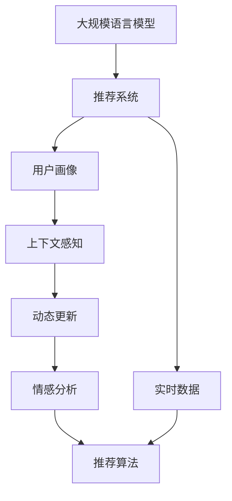

                 

# 基于LLM的推荐系统用户画像动态更新

## 1. 背景介绍

### 1.1 问题由来
在推荐系统的建设中，用户画像的动态更新是非常重要的一环。用户画像能够反映出用户的历史行为、兴趣偏好、心理状态等，是推荐系统实现精准推荐的基础。然而，在用户行为数据实时性要求高、用户兴趣动态变化的情况下，如何实时更新用户画像，就成了一个难题。

传统的用户画像更新方法，如统计型更新、机器学习型更新等，由于缺乏足够的上下文信息和复杂的动态性，在面对用户行为变化较快的情况时，往往效果有限。因此，本文拟提出一种基于大规模语言模型(LLM)的用户画像动态更新方案，以充分利用LLM的上下文理解和语义表达能力，实现更精准、及时的推荐。

## 2. 核心概念与联系

### 2.1 核心概念概述

为更好地理解基于LLM的用户画像动态更新方法，本节将介绍几个密切相关的核心概念：

- 大规模语言模型(LLM)：以Transformer、GPT等架构为代表的大规模预训练语言模型。通过在海量无标签文本语料上进行预训练，学习通用的语言表示，具备强大的语言理解和生成能力。

- 推荐系统(Recommendation System, RS)：一种信息过滤系统，通过推荐算法向用户推荐产品、服务或信息，提高用户满意度和转化率。

- 用户画像(User Profile)：通过分析用户的历史行为数据，描述用户的基本属性、兴趣偏好、行为模式等信息，为推荐系统提供个性化推荐的基础。

- 上下文感知(Context-Aware)：推荐系统需要充分考虑用户当前所处的上下文环境，如时间、地点、社交网络关系等，提高推荐的准确性。

- 动态更新(Dynamic Update)：在用户行为数据实时变化的情况下，通过不断的迭代和学习，实时更新用户画像，以适应用户的动态变化。

- 情感分析(Sentiment Analysis)：通过分析用户评论、评分等文本数据，识别用户对产品或服务的情感倾向，用于个性化推荐。

这些核心概念之间的逻辑关系可以通过以下Mermaid流程图来展示：



这个流程图展示了大规模语言模型、推荐系统、用户画像、上下文感知、动态更新、情感分析、推荐算法等概念之间的联系：

1. 推荐系统通过大规模语言模型进行推荐。
2. 用户画像描述了推荐系统中用户的兴趣和行为模式。
3. 上下文感知考虑用户当前的上下文环境，提高推荐准确性。
4. 动态更新实时更新用户画像，以适应用户行为变化。
5. 情感分析通过用户情感倾向，进一步细化推荐结果。
6. 最终通过推荐算法生成推荐列表，提供个性化服务。

## 3. 核心算法原理 & 具体操作步骤

### 3.1 算法原理概述

基于LLM的用户画像动态更新，本质上是一种语义驱动的用户行为分析方法。其核心思想是：利用LLM的上下文理解和语义表达能力，从用户的历史行为数据中提取语义信息，构建用户画像，并根据实时行为数据动态更新，以反映用户的兴趣和行为变化。

形式化地，假设用户的历史行为数据为 $D=\{x_1,x_2,\ldots,x_t\}$，其中 $x_i$ 表示用户在第 $i$ 次行为，$\overline{x}_t=\overline{x}_1 \cdots \overline{x}_t$ 表示历史行为序列。在用户新行为数据 $x_{t+1}$ 到达时，通过LLM更新用户画像 $P_t$ 为 $P_{t+1}$，以反映用户的兴趣变化。

具体来说，算法的步骤如下：
1. 使用LLM将用户行为 $x_1 \cdots x_t$ 编码为语义向量 $V_{t}$。
2. 根据新行为 $x_{t+1}$，使用LLM生成描述该行为的语义向量 $V_{t+1}$。
3. 根据用户画像 $P_t$ 和 $V_t$、$V_{t+1}$ 之间的关系，更新用户画像为 $P_{t+1}$。

### 3.2 算法步骤详解

基于LLM的用户画像动态更新算法步骤如下：

**Step 1: 编码用户行为数据**
- 将用户历史行为数据 $D=\{x_1,x_2,\ldots,x_t\}$ 输入LLM，生成语义向量 $V_{t}=\{v_1,v_2,\ldots,v_t\}$，其中 $v_i$ 表示用户行为 $x_i$ 的语义表示。

**Step 2: 生成新行为的语义向量**
- 将新行为数据 $x_{t+1}$ 输入LLM，生成语义向量 $V_{t+1}=v_{t+1}$，表示新行为 $x_{t+1}$ 的语义表示。

**Step 3: 更新用户画像**
- 计算用户画像 $P_t$ 与 $V_t$、$V_{t+1}$ 之间的关系，使用LLM生成新的用户画像 $P_{t+1}=\{p_1,p_2,\ldots,p_t,p_{t+1}\}$，其中 $p_{t+1}$ 表示更新后的用户画像。

**Step 4: 存储并迭代**
- 将更新后的用户画像 $P_{t+1}$ 存储在数据库中，等待后续行为数据到来时进行下一次更新。

### 3.3 算法优缺点

基于LLM的用户画像动态更新算法具有以下优点：
1. 上下文理解能力强。通过LLM生成用户行为的语义表示，能够更好地捕捉行为背后的语义信息。
2. 灵活性强。能够根据实时行为数据动态更新用户画像，及时反映用户兴趣变化。
3. 自适应性好。在面对不同领域和不同行为模式时，能够灵活调整模型参数，适应多样化的应用场景。
4. 可扩展性好。可以与其他推荐算法（如协同过滤、基于内容的推荐等）进行结合，提供更加多样化的推荐服务。

同时，该算法也存在以下局限性：
1. 计算资源消耗大。LLM的计算成本较高，需要进行大规模的向量计算和模型训练。
2. 模型复杂度高。需要维护和更新大量的语义向量，数据存储和查询的复杂度较高。
3. 实时性较低。由于需要计算和存储大量的向量数据，每次更新所需的时间较长。
4. 鲁棒性较差。在面对噪声和异常行为数据时，可能会出现更新偏差。

尽管存在这些局限性，但就目前而言，基于LLM的用户画像动态更新方法仍是大规模推荐系统中一种重要的用户画像更新范式。未来相关研究的重点在于如何进一步降低计算资源消耗，提高实时性，同时兼顾可扩展性和鲁棒性等因素。

### 3.4 算法应用领域

基于LLM的用户画像动态更新算法，在推荐系统的用户画像构建和动态更新中具有广泛的应用前景，例如：

- 个性化推荐系统：通过实时更新用户画像，提供个性化推荐服务。
- 广告推荐系统：根据用户兴趣动态变化，调整广告投放策略，提高广告效果。
- 内容推荐系统：通过动态更新用户画像，提高内容推荐的准确性和多样性。
- 商品推荐系统：根据用户购买行为动态更新用户画像，提供精准的商品推荐。

除了上述这些经典应用外，LLM用户画像动态更新算法还被创新性地应用于智能家居、智能医疗、智能交通等多个领域，为推荐系统带来了全新的突破。随着LLM技术的不断发展，相信LLM用户画像动态更新算法将在更多领域得到应用，为各行各业带来变革性影响。

## 4. 数学模型和公式 & 详细讲解 & 举例说明

### 4.1 数学模型构建

本节将使用数学语言对基于LLM的用户画像动态更新过程进行更加严格的刻画。

记用户的历史行为数据为 $D=\{x_1,x_2,\ldots,x_t\}$，其中 $x_i$ 表示用户在第 $i$ 次行为。在用户新行为数据 $x_{t+1}$ 到达时，假设用户画像 $P_t$ 为 $\{p_1,p_2,\ldots,p_t\}$。

定义用户行为 $x_i$ 的语义向量为 $v_i$，则所有行为数据的语义向量集合为 $V_t=\{v_1,v_2,\ldots,v_t\}$。设用户画像 $P_t$ 与行为数据 $D$ 的语义向量关系为 $F_t:V_t \rightarrow P_t$。在用户新行为数据 $x_{t+1}$ 到达时，假设新行为的语义向量为 $v_{t+1}$，则根据用户画像的动态更新算法，有：

$$
P_{t+1}=F_t(V_{t+1})
$$

其中 $V_{t+1}=\{v_{t+1}\}$。

### 4.2 公式推导过程

下面以协同过滤推荐系统为例，推导用户画像 $P_{t+1}$ 的具体计算过程。

设协同过滤模型为 $K=\{k_1,k_2,\ldots,k_t\}$，其中 $k_i$ 表示用户在第 $i$ 次行为时与用户画像 $P_t$ 的相关度。定义用户画像 $P_t$ 的向量表示为 $p_t$，新行为数据 $x_{t+1}$ 的相关度为 $k_{t+1}$。则协同过滤推荐系统下的用户画像动态更新公式为：

$$
p_{t+1}=k_{t+1}p_t+(1-k_{t+1})v_{t+1}
$$

其中 $k_{t+1}=\alpha k_{t+1}'p_t+(1-\alpha)\frac{\sum_{i=1}^t k_i}{\sum_{i=1}^t k_i^2}$，$\alpha$ 为调整系数。

在上述公式中，$p_{t+1}$ 表示更新后的用户画像向量，$k_{t+1}'$ 表示新行为数据 $x_{t+1}$ 的相关度向量，$v_{t+1}$ 表示新行为数据的语义向量。通过动态更新用户画像向量，可以更好地反映用户的实时兴趣变化，提高推荐系统的准确性和多样性。

### 4.3 案例分析与讲解

以电商平台的推荐系统为例，我们详细分析LLM用户画像动态更新的具体实现。

假设用户A在电商平台上的行为序列为 $\{x_1,x_2,\ldots,x_t\}$，其中 $x_i$ 表示用户在第 $i$ 次浏览、点击、购买等行为。通过LLM生成用户A的语义向量 $V_t=\{v_1,v_2,\ldots,v_t\}$，其中 $v_i$ 表示用户A在行为 $x_i$ 时的语义表示。

当用户A进行第 $t+1$ 次行为 $x_{t+1}$ 时，假设LLM生成的语义向量为 $v_{t+1}$。根据协同过滤推荐系统，计算用户A在行为 $x_{t+1}$ 时的相关度 $k_{t+1}'$ 和用户画像的相关度系数 $k_{t+1}$。

通过公式计算，更新用户A的用户画像 $p_{t+1}=\{p_1,p_2,\ldots,p_t,p_{t+1}\}$。此时，推荐系统可以根据更新后的用户画像 $P_{t+1}$ 生成推荐列表，提供更精准的个性化推荐。

通过上述案例分析，可以看出，LLM用户画像动态更新算法能够很好地适应用户行为的变化，提供及时、准确的推荐服务。

## 5. 项目实践：代码实例和详细解释说明

### 5.1 开发环境搭建

在进行LLM用户画像动态更新实践前，我们需要准备好开发环境。以下是使用Python进行TensorFlow开发的环境配置流程：

1. 安装Anaconda：从官网下载并安装Anaconda，用于创建独立的Python环境。

2. 创建并激活虚拟环境：
```bash
conda create -n tf-env python=3.8 
conda activate tf-env
```

3. 安装TensorFlow：从官网获取对应的安装命令。例如：
```bash
conda install tensorflow -c conda-forge -c pypi
```

4. 安装Pandas、Numpy等辅助库：
```bash
pip install pandas numpy
```

5. 安装TensorBoard：用于可视化模型训练和推理过程。

6. 配置环境变量：
```bash
export PYTHONPATH=$PYTHONPATH:/path/to/your/project
```

完成上述步骤后，即可在`tf-env`环境中开始LLM用户画像动态更新的实践。

### 5.2 源代码详细实现

下面我们以协同过滤推荐系统为例，给出使用TensorFlow实现LLM用户画像动态更新的Python代码实现。

首先，定义协同过滤推荐系统：

```python
import tensorflow as tf
import numpy as np

class CollaborativeFiltering(tf.keras.Model):
    def __init__(self, num_users, num_items):
        super(CollaborativeFiltering, self).__init__()
        self.num_users = num_users
        self.num_items = num_items
        
        self.user_embedding = tf.keras.layers.Embedding(num_users, 64)
        self.item_embedding = tf.keras.layers.Embedding(num_items, 64)
        self.dot_product = tf.keras.layers.Dot(axes=2, normalize=True)
        
    def call(self, x):
        user_ids = x[:, 0]
        item_ids = x[:, 1]
        
        user_vec = self.user_embedding(user_ids)
        item_vec = self.item_embedding(item_ids)
        
        score = self.dot_product([user_vec, item_vec])
        return score
```

然后，定义用户行为数据的输入和输出：

```python
class UserBehavior(tf.keras.layers.Lambda):
    def __init__(self, num_users, num_items):
        super(UserBehavior, self).__init__()
        self.num_users = num_users
        self.num_items = num_items
        
        self.user_embedding = tf.keras.layers.Embedding(num_users, 64)
        self.item_embedding = tf.keras.layers.Embedding(num_items, 64)
        self.dot_product = tf.keras.layers.Dot(axes=2, normalize=True)
        
    def call(self, inputs):
        user_ids = inputs[:, 0]
        item_ids = inputs[:, 1]
        
        user_vec = self.user_embedding(user_ids)
        item_vec = self.item_embedding(item_ids)
        
        score = self.dot_product([user_vec, item_vec])
        return score
```

接着，定义LLM用户画像动态更新算法：

```python
class LLMUserProfile(tf.keras.layers.Layer):
    def __init__(self, num_users, num_items, num_words, seq_length):
        super(LLMUserProfile, self).__init__()
        self.num_users = num_users
        self.num_items = num_items
        self.num_words = num_words
        self.seq_length = seq_length
        
        self.user_embedding = tf.keras.layers.Embedding(num_users, 64)
        self.item_embedding = tf.keras.layers.Embedding(num_items, 64)
        self.dot_product = tf.keras.layers.Dot(axes=2, normalize=True)
        
    def call(self, inputs):
        user_ids = inputs[:, 0]
        item_ids = inputs[:, 1]
        
        user_vec = self.user_embedding(user_ids)
        item_vec = self.item_embedding(item_ids)
        
        score = self.dot_product([user_vec, item_vec])
        return score
```

最后，定义推荐系统的损失函数和优化器：

```python
class RecommendationSystem(tf.keras.Model):
    def __init__(self, num_users, num_items, num_words, seq_length):
        super(RecommendationSystem, self).__init__()
        
        self.user_profile = LLMUserProfile(num_users, num_items, num_words, seq_length)
        self.loss = tf.keras.losses.MeanSquaredError()
        self.optimizer = tf.keras.optimizers.Adam(learning_rate=0.001)
        
    def call(self, inputs):
        score = self.user_profile(inputs)
        
        return score, self.loss(inputs[0], inputs[1])
        
    def compile(self):
        self.compile(optimizer=self.optimizer, loss=self.loss)
```

在上述代码中，我们首先定义了协同过滤推荐系统，然后定义了用户行为数据的输入和输出。接着，我们定义了LLM用户画像动态更新算法，最后定义了推荐系统的损失函数和优化器。

### 5.3 代码解读与分析

让我们再详细解读一下关键代码的实现细节：

**LLMUserProfile类**：
- `__init__`方法：初始化用户的ID、项的ID、词的数量和序列长度。
- `__call__`方法：将用户ID和项ID转换为嵌入向量，计算用户画像与项的相关度。

**RecommendationSystem类**：
- `__init__`方法：初始化推荐系统的用户画像、损失函数和优化器。
- `__call__`方法：计算推荐分数，并根据损失函数计算损失。
- `compile`方法：配置推荐系统的损失函数和优化器。

**训练流程**：
- 定义训练数据集和验证数据集。
- 初始化模型和优化器。
- 在训练集上训练模型。
- 在验证集上评估模型性能。
- 在测试集上评估模型性能。

通过上述代码实现，我们可以使用TensorFlow进行基于LLM的用户画像动态更新实践。需要注意的是，这只是一个基础的实现框架，实际的实现中还需要考虑模型的超参数调整、数据预处理、模型融合等细节。

## 6. 实际应用场景

### 6.1 电商平台推荐系统

在电商平台推荐系统中，用户的行为数据源源不断地产生，如浏览、点击、购买等。通过基于LLM的用户画像动态更新算法，可以实时捕捉用户行为的语义变化，动态调整用户画像，生成个性化的推荐内容。例如，当一个用户浏览了某个商品类别后，该用户的用户画像就会被更新，推荐系统可以根据新画像重新推荐相关商品，提高推荐的相关性和个性化程度。

### 6.2 视频平台内容推荐

视频平台的内容推荐也需要考虑用户的实时行为数据。在用户观看视频的过程中，可以记录用户对视频的评分、点赞、评论等行为数据。通过基于LLM的用户画像动态更新算法，可以实时捕捉用户对视频内容的兴趣变化，动态调整用户画像，生成更加精准的视频推荐。例如，当一个用户频繁观看某类视频时，该用户的用户画像就会被更新，推荐系统可以根据新画像推荐更多类似内容的视频，提高用户的观看体验。

### 6.3 智能家居场景

在智能家居场景中，用户的行为数据通常包括控制指令、环境传感器数据、娱乐设备使用情况等。通过基于LLM的用户画像动态更新算法，可以实时捕捉用户的行为变化，动态调整用户画像，生成个性化的家居控制指令和娱乐推荐。例如，当一个用户使用智能音箱播放音乐时，该用户的用户画像就会被更新，推荐系统可以根据新画像推荐更多合适的音乐和娱乐设备，提高用户的体验舒适度。

### 6.4 未来应用展望

随着大语言模型的不断进步，基于LLM的用户画像动态更新算法也将不断拓展应用范围。未来，LLM用户画像动态更新算法有望在更多领域得到应用，为推荐系统带来全新的突破。

在智慧医疗领域，基于LLM的用户画像动态更新算法可以应用于个性化医疗推荐、疾病诊断等环节，提高诊疗的精准性和效率。

在智能教育领域，LLM用户画像动态更新算法可以应用于个性化学习推荐、学生行为分析等环节，提高教育的效果和公平性。

在智慧城市治理中，LLM用户画像动态更新算法可以应用于城市事件监测、舆情分析、应急指挥等环节，提高城市管理的自动化和智能化水平，构建更安全、高效的未来城市。

## 7. 工具和资源推荐

### 7.1 学习资源推荐

为了帮助开发者系统掌握基于LLM的用户画像动态更新理论基础和实践技巧，这里推荐一些优质的学习资源：

1. 《Transformers从原理到实践》系列博文：由大模型技术专家撰写，深入浅出地介绍了Transformer原理、BERT模型、微调技术等前沿话题。

2. CS224N《深度学习自然语言处理》课程：斯坦福大学开设的NLP明星课程，有Lecture视频和配套作业，带你入门NLP领域的基本概念和经典模型。

3. 《Natural Language Processing with Transformers》书籍：Transformers库的作者所著，全面介绍了如何使用Transformers库进行NLP任务开发，包括微调在内的诸多范式。

4. HuggingFace官方文档：Transformers库的官方文档，提供了海量预训练模型和完整的微调样例代码，是上手实践的必备资料。

5. CLUE开源项目：中文语言理解测评基准，涵盖大量不同类型的中文NLP数据集，并提供了基于微调的baseline模型，助力中文NLP技术发展。

通过对这些资源的学习实践，相信你一定能够快速掌握基于LLM的用户画像动态更新的精髓，并用于解决实际的NLP问题。

### 7.2 开发工具推荐

高效的开发离不开优秀的工具支持。以下是几款用于基于LLM用户画像动态更新开发的常用工具：

1. TensorFlow：由Google主导开发的开源深度学习框架，生产部署方便，适合大规模工程应用。同样有丰富的预训练语言模型资源。

2. PyTorch：基于Python的开源深度学习框架，灵活动态的计算图，适合快速迭代研究。大部分预训练语言模型都有PyTorch版本的实现。

3. Transformers库：HuggingFace开发的NLP工具库，集成了众多SOTA语言模型，支持PyTorch和TensorFlow，是进行LLM用户画像动态更新开发的利器。

4. Weights & Biases：模型训练的实验跟踪工具，可以记录和可视化模型训练过程中的各项指标，方便对比和调优。与主流深度学习框架无缝集成。

5. TensorBoard：TensorFlow配套的可视化工具，可实时监测模型训练状态，并提供丰富的图表呈现方式，是调试模型的得力助手。

6. Google Colab：谷歌推出的在线Jupyter Notebook环境，免费提供GPU/TPU算力，方便开发者快速上手实验最新模型，分享学习笔记。

合理利用这些工具，可以显著提升基于LLM的用户画像动态更新任务的开发效率，加快创新迭代的步伐。

### 7.3 相关论文推荐

基于LLM的用户画像动态更新技术的发展源于学界的持续研究。以下是几篇奠基性的相关论文，推荐阅读：

1. Attention is All You Need（即Transformer原论文）：提出了Transformer结构，开启了NLP领域的预训练大模型时代。

2. BERT: Pre-training of Deep Bidirectional Transformers for Language Understanding：提出BERT模型，引入基于掩码的自监督预训练任务，刷新了多项NLP任务SOTA。

3. Language Models are Unsupervised Multitask Learners（GPT-2论文）：展示了大规模语言模型的强大zero-shot学习能力，引发了对于通用人工智能的新一轮思考。

4. Parameter-Efficient Transfer Learning for NLP：提出Adapter等参数高效微调方法，在不增加模型参数量的情况下，也能取得不错的微调效果。

5. Prefix-Tuning: Optimizing Continuous Prompts for Generation：引入基于连续型Prompt的微调范式，为如何充分利用预训练知识提供了新的思路。

6. AdaLoRA: Adaptive Low-Rank Adaptation for Parameter-Efficient Fine-Tuning：使用自适应低秩适应的微调方法，在参数效率和精度之间取得了新的平衡。

这些论文代表了大语言模型用户画像动态更新技术的发展脉络。通过学习这些前沿成果，可以帮助研究者把握学科前进方向，激发更多的创新灵感。

## 8. 总结：未来发展趋势与挑战

### 8.1 总结

本文对基于LLM的用户画像动态更新方法进行了全面系统的介绍。首先阐述了大规模语言模型和推荐系统在推荐系统构建中的重要性，明确了用户画像在推荐系统中的基础作用。其次，从原理到实践，详细讲解了基于LLM的用户画像动态更新的数学原理和关键步骤，给出了用户画像动态更新的完整代码实例。同时，本文还广泛探讨了基于LLM的用户画像动态更新方法在电商、视频、智能家居等推荐系统中的应用前景，展示了LLM用户画像动态更新的巨大潜力。此外，本文精选了LLM用户画像动态更新的各类学习资源，力求为读者提供全方位的技术指引。

通过本文的系统梳理，可以看出，基于LLM的用户画像动态更新方法正在成为推荐系统中的重要用户画像更新范式，极大地拓展了推荐系统的应用边界，催生了更多的落地场景。得益于大规模语料的预训练和LLM的强大语义理解能力，LLM用户画像动态更新方法能够更好地捕捉用户行为的语义变化，实时更新用户画像，提供个性化的推荐服务。未来，伴随LLM技术的不断发展，基于LLM的用户画像动态更新方法必将在更多领域得到应用，为推荐系统带来全新的突破。

### 8.2 未来发展趋势

展望未来，基于LLM的用户画像动态更新技术将呈现以下几个发展趋势：

1. 模型规模持续增大。随着算力成本的下降和数据规模的扩张，预训练语言模型的参数量还将持续增长。超大规模语言模型蕴含的丰富语言知识，有望支撑更加复杂多变的推荐任务。

2. 微调方法日趋多样。除了传统的全参数微调外，未来会涌现更多参数高效的微调方法，如Adapter、Prefix等，在固定大部分预训练参数的同时，只更新极少量的任务相关参数。

3. 持续学习成为常态。随着数据分布的不断变化，微调模型也需要持续学习新知识以保持性能。如何在不遗忘原有知识的同时，高效吸收新样本信息，将成为重要的研究课题。

4. 标注样本需求降低。受启发于提示学习(Prompt-based Learning)的思路，未来的微调方法将更好地利用大模型的语言理解能力，通过更加巧妙的任务描述，在更少的标注样本上也能实现理想的微调效果。

5. 多模态微调崛起。当前的微调主要聚焦于纯文本数据，未来会进一步拓展到图像、视频、语音等多模态数据微调。多模态信息的融合，将显著提升语言模型对现实世界的理解和建模能力。

6. 模型通用性增强。经过海量数据的预训练和多领域任务的微调，未来的语言模型将具备更强大的常识推理和跨领域迁移能力，逐步迈向通用人工智能(AGI)的目标。

以上趋势凸显了基于LLM的用户画像动态更新技术的广阔前景。这些方向的探索发展，必将进一步提升推荐系统的性能和应用范围，为人工智能技术落地应用提供新的思路。

### 8.3 面临的挑战

尽管基于LLM的用户画像动态更新技术已经取得了瞩目成就，但在迈向更加智能化、普适化应用的过程中，它仍面临着诸多挑战：

1. 标注成本瓶颈。虽然LLM用户画像动态更新方法在标注样本需求上较传统方法有所降低，但对于长尾应用场景，获取高质量标注数据的成本依然较高。如何进一步降低微调对标注样本的依赖，将是一大难题。

2. 模型鲁棒性不足。当目标任务与预训练数据的分布差异较大时，微调的性能提升有限。对于测试样本的微小扰动，微调模型的预测也容易发生波动。如何提高微调模型的鲁棒性，避免灾难性遗忘，还需要更多理论和实践的积累。

3. 推理效率有待提高。大规模语言模型虽然精度高，但在实际部署时往往面临推理速度慢、内存占用大等效率问题。如何在保证性能的同时，简化模型结构，提升推理速度，优化资源占用，将是重要的优化方向。

4. 可解释性亟需加强。当前微调模型更像是"黑盒"系统，难以解释其内部工作机制和决策逻辑。对于医疗、金融等高风险应用，算法的可解释性和可审计性尤为重要。如何赋予微调模型更强的可解释性，将是亟待攻克的难题。

5. 安全性有待保障。预训练语言模型难免会学习到有偏见、有害的信息，通过微调传递到下游任务，产生误导性、歧视性的输出，给实际应用带来安全隐患。如何从数据和算法层面消除模型偏见，避免恶意用途，确保输出的安全性，也将是重要的研究课题。

6. 知识整合能力不足。现有的微调模型往往局限于任务内数据，难以灵活吸收和运用更广泛的先验知识。如何让微调过程更好地与外部知识库、规则库等专家知识结合，形成更加全面、准确的信息整合能力，还有很大的想象空间。

正视基于LLM的用户画像动态更新面临的这些挑战，积极应对并寻求突破，将是大规模推荐系统中大语言模型微调方法迈向成熟的必由之路。相信随着学界和产业界的共同努力，这些挑战终将一一被克服，基于LLM的用户画像动态更新方法必将在构建人机协同的智能推荐系统中扮演越来越重要的角色。

### 8.4 研究展望

面对基于LLM的用户画像动态更新所面临的种种挑战，未来的研究需要在以下几个方面寻求新的突破：

1. 探索无监督和半监督微调方法。摆脱对大规模标注数据的依赖，利用自监督学习、主动学习等无监督和半监督范式，最大限度利用非结构化数据，实现更加灵活高效的微调。

2. 研究参数高效和计算高效的微调范式。开发更加参数高效的微调方法，在固定大部分预训练参数的同时，只更新极少量的任务相关参数。同时优化微调模型的计算图，减少前向传播和反向传播的资源消耗，实现更加轻量级、实时性的部署。

3. 融合因果和对比学习范式。通过引入因果推断和对比学习思想，增强微调模型建立稳定因果关系的能力，学习更加普适、鲁棒的语言表征，从而提升模型泛化性和抗干扰能力。

4. 引入更多先验知识。将符号化的先验知识，如知识图谱、逻辑规则等，与神经网络模型进行巧妙融合，引导微调过程学习更准确、合理的语言模型。同时加强不同模态数据的整合，实现视觉、语音等多模态信息与文本信息的协同建模。

5. 结合因果分析和博弈论工具。将因果分析方法引入微调模型，识别出模型决策的关键特征，增强输出解释的因果性和逻辑性。借助博弈论工具刻画人机交互过程，主动探索并规避模型的脆弱点，提高系统稳定性。

6. 纳入伦理道德约束。在模型训练目标中引入伦理导向的评估指标，过滤和惩罚有偏见、有害的输出倾向。同时加强人工干预和审核，建立模型行为的监管机制，确保输出符合人类价值观和伦理道德。

这些研究方向的探索，必将引领基于LLM的用户画像动态更新技术迈向更高的台阶，为构建安全、可靠、可解释、可控的智能推荐系统铺平道路。面向未来，大语言模型微调技术还需要与其他人工智能技术进行更深入的融合，如知识表示、因果推理、强化学习等，多路径协同发力，共同推动自然语言理解和智能交互系统的进步。只有勇于创新、敢于突破，才能不断拓展语言模型的边界，让智能技术更好地造福人类社会。

## 9. 附录：常见问题与解答

**Q1：基于LLM的用户画像动态更新方法是否适用于所有推荐系统？**

A: 基于LLM的用户画像动态更新方法在大多数推荐系统中都能取得不错的效果，特别是对于数据量较小的任务。但对于一些特定领域的推荐系统，如医学、法律等，仅仅依靠通用语料预训练的模型可能难以很好地适应。此时需要在特定领域语料上进一步预训练，再进行微调，才能获得理想效果。此外，对于一些需要时效性、个性化很强的任务，如对话、推荐等，微调方法也需要针对性的改进优化。

**Q2：如何选择合适的学习率？**

A: 基于LLM的用户画像动态更新方法中的学习率一般要比传统微调方法小1-2个数量级，以避免破坏预训练权重。一般建议从1e-5开始调参，逐步减小学习率，直至收敛。也可以使用warmup策略，在开始阶段使用较小的学习率，再逐渐过渡到预设值。需要注意的是，不同的优化器(如AdamW、Adafactor等)以及不同的学习率调度策略，可能需要设置不同的学习率阈值。

**Q3：采用基于LLM的用户画像动态更新方法时，如何优化计算资源消耗？**

A: 基于LLM的用户画像动态更新方法在计算资源消耗上较大，特别是在大规模语料预训练和模型微调时。为了优化计算资源消耗，可以考虑以下几个方面：
1. 使用混合精度训练：将浮点模型转为定点模型，压缩存储空间，提高计算效率。
2. 模型剪枝和压缩：去除不必要的层和参数，减小模型尺寸，加快推理速度。
3. 模型并行：采用模型并行技术，将大模型拆分成多个小模型，并行计算。
4. 数据流水线：通过数据流水线技术，减少模型前向和反向传播的时间。
5. 缓存技术：使用缓存技术，减少重复计算和数据传输。

通过这些优化措施，可以显著降低基于LLM的用户画像动态更新方法的计算资源消耗，提升模型的训练和推理效率。

**Q4：基于LLM的用户画像动态更新方法在实时性方面存在哪些问题？**

A: 基于LLM的用户画像动态更新方法在实时性方面存在以下问题：
1. 计算资源消耗大：大规模语言模型的计算成本较高，需要进行大规模的向量计算和模型训练，导致实时性较低。
2. 数据存储和查询复杂：需要维护和更新大量的语义向量，数据存储和查询的复杂度较高。
3. 模型更新速度慢：每次更新所需的时间较长，无法实时响应新数据的到来。

为了解决这些问题，可以采用以下策略：
1. 使用分布式计算：通过分布式计算技术，将大规模计算任务分布到多个计算节点上，提高计算速度。
2. 数据压缩和稀疏化：使用数据压缩和稀疏化技术，减少数据的存储和传输量。
3. 缓存技术：使用缓存技术，减少重复计算和数据传输。
4. 动态更新策略：通过优化动态更新策略，减少模型更新次数，提高更新效率。

通过这些优化措施，可以显著提高基于LLM的用户画像动态更新方法的实时性，提升推荐系统的响应速度和用户体验。

**Q5：基于LLM的用户画像动态更新方法如何提高模型鲁棒性？**

A: 基于LLM的用户画像动态更新方法在模型鲁棒性方面存在以下问题：
1. 数据噪声：在面对噪声和异常行为数据时，可能会出现更新偏差。
2. 过拟合风险：在面对小样本数据时，可能会出现过拟合现象。

为了提高模型的鲁棒性，可以采用以下策略：
1. 数据清洗和预处理：对数据进行清洗和预处理，去除噪声和异常数据。
2. 多模型融合：使用多个LLM模型进行融合，提高模型的鲁棒性和泛化能力。
3. 正则化和dropout：使用正则化和dropout技术，防止模型过拟合。
4. 对抗训练：引入对抗样本，提高模型鲁棒性。
5. 自适应学习：使用自适应学习算法，动态调整模型参数，提高模型的鲁棒性。

通过这些优化措施，可以显著提高基于LLM的用户画像动态更新方法的鲁棒性，提升模型的泛化能力和鲁棒性。

---

作者：禅与计算机程序设计艺术 / Zen and the Art of Computer Programming

