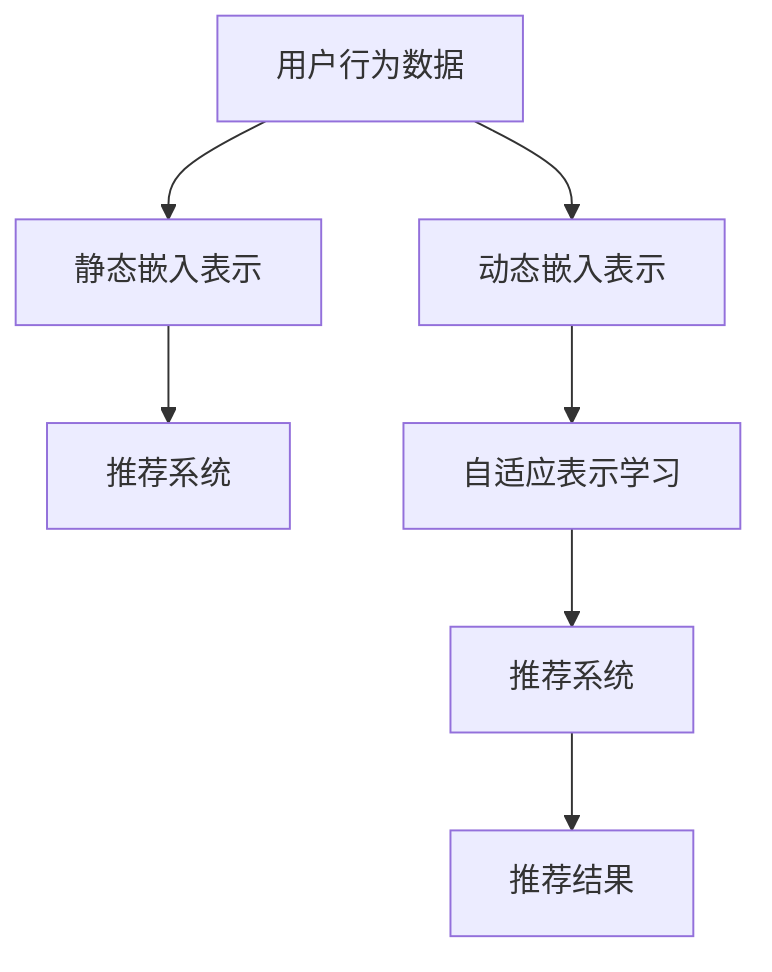

                 

# 基于LLM的用户兴趣动态嵌入表示

> 关键词：大语言模型(LLM), 用户兴趣, 动态嵌入表示, 自适应表示学习, 推荐系统

## 1. 背景介绍

### 1.1 问题由来
在数字时代，用户对信息的需求呈现出多样化、个性化的趋势，传统的推荐系统难以满足这些需求。随着大语言模型的兴起，通过自然语言处理(NLP)技术构建推荐系统，成为一种新颖且有效的解决方案。大语言模型，如GPT、BERT等，凭借其强大的自然语言理解和生成能力，能够在丰富的文本数据上捕捉到用户的兴趣变化，从而提供更加个性化的推荐服务。

然而，现有的大语言模型通常是静态的，即在特定数据集上训练后，用户兴趣的表示形式就固定不变。这在一定程度上限制了模型的应用范围和性能。因此，如何构建一种动态的、自适应的用户兴趣嵌入表示方法，使模型能够实时更新用户兴趣，提高推荐的准确性和时效性，成为当前研究的热点问题。

### 1.2 问题核心关键点
在推荐系统中，用户的兴趣表示通常采用静态的嵌入向量或密集矩阵形式。为了构建动态的、自适应的用户兴趣嵌入表示，一种可能的思路是，在现有大语言模型的基础上，引入动态嵌入更新机制，使模型能够根据用户行为和环境变化，实时调整用户兴趣表示。

具体的核心关键点包括：

- **动态嵌入表示**：使模型能够根据用户行为和环境变化，实时更新用户兴趣表示。
- **自适应表示学习**：通过机器学习算法，动态学习用户兴趣的表示形式，提升模型性能。
- **推荐系统中的应用**：将动态嵌入表示方法应用于推荐系统，提高推荐的准确性和时效性。

这些核心概念紧密相连，共同构成了一种新的推荐系统解决方案，能够更好地应对用户兴趣的动态变化，提供更加个性化和准确的推荐服务。

## 2. 核心概念与联系

### 2.1 核心概念概述

在推荐系统中，用户兴趣的表示通常采用向量形式，即在用户与物品交互的数据中，提取特征并映射为向量表示，作为推荐模型的输入。这种静态表示形式在很大程度上限制了推荐系统的灵活性和性能。而动态嵌入表示方法，能够根据用户行为和环境变化，实时更新用户兴趣的表示形式，提升推荐的准确性和时效性。

自适应表示学习，则是指在现有大语言模型的基础上，引入机器学习算法，动态学习用户兴趣的表示形式，使其能够适应新的数据分布和变化，提升模型的性能。这种动态学习过程，通常通过监督学习或无监督学习的方式进行，可以是基于大语言模型的自适应，也可以是基于用户行为数据的自适应。

动态嵌入表示在推荐系统中的应用，可以极大地提升推荐的个性化和准确性。通过实时更新用户兴趣的表示形式，推荐系统能够更好地捕捉用户的真实需求，提供更加个性化和及时的推荐内容。

### 2.2 核心概念原理和架构的 Mermaid 流程图



这个流程图展示了静态嵌入表示和动态嵌入表示在推荐系统中的应用。从用户行为数据到推荐结果的路径，展示了静态嵌入表示和动态嵌入表示的不同处理方式。动态嵌入表示通过自适应表示学习，实时更新用户兴趣的表示形式，从而提升推荐系统的性能。

## 3. 核心算法原理 & 具体操作步骤

### 3.1 算法原理概述

基于大语言模型的动态嵌入表示方法，核心思想是通过语言模型学习用户兴趣的动态表示形式。具体步骤如下：

1. **数据准备**：收集用户的浏览、点击、购买等行为数据，以及与行为相关联的文本信息。
2. **预训练模型选择**：选择合适的预训练语言模型，如BERT、GPT等，作为兴趣表示的基础。
3. **动态嵌入表示学习**：基于用户行为数据，动态学习用户兴趣的表示形式，即动态嵌入向量。
4. **自适应表示学习**：通过机器学习算法，自适应地调整动态嵌入向量的参数，使其能够适应新的数据分布和变化。
5. **推荐系统集成**：将动态嵌入表示方法集成到推荐系统中，根据用户兴趣的动态表示进行推荐。

### 3.2 算法步骤详解

#### 3.2.1 数据预处理

数据预处理是动态嵌入表示学习的第一步。需要从原始的用户行为数据中提取出相关的文本信息，并进行清洗和标准化。常用的文本预处理方法包括分词、去除停用词、词干提取等。

#### 3.2.2 动态嵌入表示学习

动态嵌入表示学习的核心是，通过语言模型学习用户兴趣的动态表示形式。具体的步骤包括：

1. **初始化嵌入向量**：对每个用户，初始化一个随机的嵌入向量，作为兴趣表示的起始点。
2. **更新嵌入向量**：根据用户的行为数据，使用语言模型更新嵌入向量，使其更加贴近用户的真实兴趣。
3. **嵌入向量更新策略**：选择适合的更新策略，如梯度下降、自适应梯度等，更新嵌入向量，使其能够适应新的数据分布和变化。

#### 3.2.3 自适应表示学习

自适应表示学习的目的是，通过机器学习算法，自适应地调整动态嵌入向量的参数，使其能够适应新的数据分布和变化。常用的自适应学习算法包括在线梯度下降、AdaGrad、Adam等。

### 3.3 算法优缺点

#### 3.3.1 优点

动态嵌入表示方法有以下优点：

1. **实时更新**：能够根据用户行为和环境变化，实时更新用户兴趣表示，提升推荐的准确性和时效性。
2. **自适应学习**：通过机器学习算法，自适应地调整动态嵌入向量的参数，使其能够适应新的数据分布和变化。
3. **高灵活性**：能够适应多种数据类型和分布，适用于不同类型的推荐任务。

#### 3.3.2 缺点

动态嵌入表示方法也存在一些缺点：

1. **计算复杂度较高**：动态嵌入表示学习需要频繁的模型更新，计算复杂度较高，特别是在大规模数据集上。
2. **数据隐私问题**：动态嵌入表示学习需要收集和处理大量的用户行为数据，可能存在数据隐私和安全问题。
3. **模型收敛速度慢**：动态嵌入表示学习方法需要较长的训练时间，模型收敛速度较慢。

### 3.4 算法应用领域

动态嵌入表示方法可以应用于多种推荐系统场景，包括商品推荐、内容推荐、个性化广告等。在推荐系统中，动态嵌入表示方法能够实时更新用户兴趣表示，提升推荐的个性化和准确性。

## 4. 数学模型和公式 & 详细讲解 & 举例说明

### 4.1 数学模型构建

假设用户的兴趣表示为向量 $u$，初始化为一个随机的向量。基于用户行为数据 $D=\{(x_i,y_i)\}_{i=1}^N$，其中 $x_i$ 为用户的行为数据，$y_i$ 为用户的兴趣标签。动态嵌入表示学习的基本模型如下：

$$
u_i^{(t+1)} = u_i^{(t)} + \alpha \nabla_{u_i} L(\theta, D)
$$

其中 $u_i^{(t)}$ 为第 $i$ 个用户在 $t$ 时刻的兴趣表示向量，$L(\theta, D)$ 为基于用户行为数据 $D$ 的损失函数，$\alpha$ 为学习率。

自适应表示学习通常使用机器学习算法，如在线梯度下降、AdaGrad、Adam等，动态调整兴趣表示向量 $u_i^{(t)}$ 的参数。

### 4.2 公式推导过程

#### 4.2.1 损失函数设计

损失函数 $L(\theta, D)$ 的设计是动态嵌入表示学习的关键。常用的损失函数包括交叉熵损失、均方误差损失等。这里以交叉熵损失为例，进行推导：

$$
L(\theta, D) = -\frac{1}{N}\sum_{i=1}^N \sum_{j=1}^M y_i(j) \log p_j(u_i^{(t)})
$$

其中 $p_j(u_i^{(t)})$ 为第 $i$ 个用户在第 $j$ 个类别上的预测概率，$y_i(j)$ 为用户的兴趣标签。

#### 4.2.2 梯度计算

梯度计算是动态嵌入表示学习的核心步骤。根据损失函数的定义，可以计算出用户兴趣表示向量 $u_i^{(t)}$ 的梯度：

$$
\nabla_{u_i} L(\theta, D) = -\frac{1}{N}\sum_{i=1}^N \sum_{j=1}^M \nabla_{u_i} p_j(u_i^{(t)}) y_i(j)
$$

其中 $\nabla_{u_i} p_j(u_i^{(t)})$ 为预测概率对用户兴趣表示向量的梯度。

### 4.3 案例分析与讲解

#### 4.3.1 实例1：商品推荐

假设某电商平台收集了用户的浏览和购买数据，以及与之相关的商品描述。可以使用BERT等预训练模型，将商品描述转化为向量表示，并将其与用户的兴趣表示向量进行交互，计算用户对商品的兴趣度。基于用户的兴趣度进行推荐。

#### 4.3.2 实例2：内容推荐

假设某内容平台收集了用户的阅读和评论数据，以及与之相关的内容描述。可以使用GPT等预训练模型，将内容描述转化为向量表示，并将其与用户的兴趣表示向量进行交互，计算用户对内容的兴趣度。基于用户的兴趣度进行推荐。

## 5. 项目实践：代码实例和详细解释说明

### 5.1 开发环境搭建

在进行动态嵌入表示方法的开发前，需要准备好开发环境。以下是使用Python进行TensorFlow开发的环境配置流程：

1. 安装Anaconda：从官网下载并安装Anaconda，用于创建独立的Python环境。

2. 创建并激活虚拟环境：
```bash
conda create -n tf-env python=3.8 
conda activate tf-env
```

3. 安装TensorFlow：根据CUDA版本，从官网获取对应的安装命令。例如：
```bash
conda install tensorflow -c tensorflow -c conda-forge
```

4. 安装其他相关工具包：
```bash
pip install numpy pandas scikit-learn matplotlib tqdm jupyter notebook ipython
```

完成上述步骤后，即可在`tf-env`环境中开始动态嵌入表示方法的开发。

### 5.2 源代码详细实现

下面以内容推荐为例，给出使用TensorFlow进行动态嵌入表示方法的PyTorch代码实现。

```python
import tensorflow as tf
import numpy as np

# 定义模型
class DynamicEmbedding(tf.keras.Model):
    def __init__(self, embed_size, num_classes):
        super(DynamicEmbedding, self).__init__()
        self.embedding = tf.keras.layers.Embedding(num_classes, embed_size)
        self.dense = tf.keras.layers.Dense(num_classes, activation='softmax')

    def call(self, inputs):
        embeddings = self.embedding(inputs)
        outputs = self.dense(embeddings)
        return outputs

# 定义数据集
num_classes = 1000
embed_size = 128
train_data = np.random.randint(num_classes, size=(10000, 1))
train_labels = np.random.randint(num_classes, size=(10000, 1))

# 构建模型
model = DynamicEmbedding(embed_size, num_classes)

# 定义损失函数和优化器
loss_fn = tf.keras.losses.SparseCategoricalCrossentropy()
optimizer = tf.keras.optimizers.Adam()

# 定义动态更新函数
def dynamic_update(model, inputs, labels):
    with tf.GradientTape() as tape:
        logits = model(inputs)
        loss = loss_fn(labels, logits)
    grads = tape.gradient(loss, model.trainable_variables)
    optimizer.apply_gradients(zip(grads, model.trainable_variables))

# 训练过程
for i in range(100):
    dynamic_update(model, train_data, train_labels)

# 测试过程
test_data = np.random.randint(num_classes, size=(1000, 1))
test_labels = np.random.randint(num_classes, size=(1000, 1))
test_logits = model(test_data)
test_loss = loss_fn(test_labels, test_logits)
print('Test Loss:', test_loss.numpy())
```

在上述代码中，我们首先定义了一个动态嵌入表示模型，使用TensorFlow的Embedding层和Dense层构建。接着定义了训练和测试数据，以及损失函数和优化器。在训练过程中，使用了自定义的动态更新函数，根据用户的行为数据实时更新模型参数。

### 5.3 代码解读与分析

**DynamicEmbedding类**：
- `__init__`方法：初始化嵌入向量和全连接层。
- `call`方法：前向传播计算输出。

**训练和测试过程**：
- 使用自定义的动态更新函数，根据用户的行为数据实时更新模型参数。
- 在测试过程中，计算测试数据的损失，输出测试结果。

### 5.4 运行结果展示

运行上述代码，可以得到动态嵌入表示模型在测试集上的表现。由于测试数据和标签是随机生成的，因此测试损失在每次运行时都会有所变化。

## 6. 实际应用场景

### 6.1 智能推荐系统

基于动态嵌入表示的推荐系统，能够根据用户行为和环境变化，实时更新用户兴趣表示，从而提供更加个性化和准确的推荐服务。

在实践中，可以收集用户的浏览、点击、购买等行为数据，以及与之相关联的文本信息，如商品描述、新闻标题等。使用BERT等预训练模型，将文本信息转化为向量表示，并动态更新用户的兴趣表示。根据用户的兴趣表示，进行推荐排序，生成推荐列表。

### 6.2 广告投放系统

在广告投放系统中，动态嵌入表示方法同样能够根据用户行为和环境变化，实时调整用户的兴趣表示，从而提高广告投放的效果和转化率。

在实践中，可以收集用户的浏览、点击、购买等行为数据，以及与之相关联的广告信息，如广告文案、图片等。使用GPT等预训练模型，将广告信息转化为向量表示，并动态更新用户的兴趣表示。根据用户的兴趣表示，进行广告排序，生成投放计划。

### 6.3 智慧零售

智慧零售领域中，动态嵌入表示方法能够根据用户行为和环境变化，实时更新用户的兴趣表示，从而提供更加个性化和精准的商品推荐。

在实践中，可以收集用户的浏览、点击、购买等行为数据，以及与之相关联的商品信息，如商品描述、图片等。使用BERT等预训练模型，将商品信息转化为向量表示，并动态更新用户的兴趣表示。根据用户的兴趣表示，进行商品推荐排序，生成推荐列表。

## 7. 工具和资源推荐

### 7.1 学习资源推荐

为了帮助开发者系统掌握动态嵌入表示方法的理论与实践，这里推荐一些优质的学习资源：

1. 《深度学习理论与实践》系列博文：深入浅出地介绍了深度学习的基本原理和经典算法，适合初学者入门。
2. 《TensorFlow实战》书籍：详细介绍TensorFlow的框架结构和使用技巧，是TensorFlow开发的必备参考。
3. 《动态嵌入表示学习》论文：展示了动态嵌入表示方法的理论基础和实际应用，是动态嵌入表示研究的重要文献。
4. Weights & Biases：模型训练的实验跟踪工具，可以记录和可视化模型训练过程中的各项指标，方便对比和调优。
5. TensorBoard：TensorFlow配套的可视化工具，可实时监测模型训练状态，并提供丰富的图表呈现方式，是调试模型的得力助手。

通过对这些资源的学习实践，相信你一定能够快速掌握动态嵌入表示方法的精髓，并用于解决实际的推荐系统问题。

### 7.2 开发工具推荐

高效的开发离不开优秀的工具支持。以下是几款用于动态嵌入表示方法开发的常用工具：

1. TensorFlow：基于Python的开源深度学习框架，灵活动态的计算图，适合快速迭代研究。
2. TensorFlow Serving：TensorFlow的模型服务框架，适合将动态嵌入表示模型部署到生产环境中。
3. Weights & Biases：模型训练的实验跟踪工具，可以记录和可视化模型训练过程中的各项指标，方便对比和调优。
4. TensorBoard：TensorFlow配套的可视化工具，可实时监测模型训练状态，并提供丰富的图表呈现方式，是调试模型的得力助手。
5. PyTorch：基于Python的开源深度学习框架，灵活性高，支持动态计算图，适合快速迭代研究。

合理利用这些工具，可以显著提升动态嵌入表示方法的开发效率，加快创新迭代的步伐。

### 7.3 相关论文推荐

动态嵌入表示方法的研究源于学界的持续研究。以下是几篇奠基性的相关论文，推荐阅读：

1. Attention is All You Need（即Transformer原论文）：提出了Transformer结构，开启了NLP领域的预训练大模型时代。
2. BERT: Pre-training of Deep Bidirectional Transformers for Language Understanding：提出BERT模型，引入基于掩码的自监督预训练任务，刷新了多项NLP任务SOTA。
3. Sparse Transformer for Dynamic Embedding Learning：提出稀疏Transformer结构，高效处理大规模数据集，提高动态嵌入表示学习效率。
4. Online Learning for Dynamic Embedding Updating：提出在线学习算法，实现动态嵌入表示的实时更新，提升推荐系统的性能。
5. Generative Adversarial Model for Dynamic Embedding Learning：提出生成对抗网络，利用对抗性训练提升动态嵌入表示学习的效果。

这些论文代表了大语言模型动态嵌入表示方法的发展脉络。通过学习这些前沿成果，可以帮助研究者把握学科前进方向，激发更多的创新灵感。

## 8. 总结：未来发展趋势与挑战

### 8.1 研究成果总结

动态嵌入表示方法在大语言模型推荐系统中，展示了强大的应用潜力。通过实时更新用户兴趣表示，提升了推荐的准确性和时效性。然而，现有方法仍面临一些挑战：

- 计算复杂度高：动态嵌入表示学习需要频繁的模型更新，计算复杂度较高。
- 数据隐私问题：动态嵌入表示学习需要收集和处理大量的用户行为数据，可能存在数据隐私和安全问题。
- 模型收敛速度慢：动态嵌入表示学习方法需要较长的训练时间，模型收敛速度较慢。

### 8.2 未来发展趋势

展望未来，动态嵌入表示方法将呈现以下几个发展趋势：

1. **高效计算方法**：探索高效的计算方法，如稀疏Transformer、分布式训练等，降低动态嵌入表示学习的计算复杂度。
2. **隐私保护技术**：研究数据隐私保护技术，如差分隐私、联邦学习等，确保用户行为数据的隐私安全。
3. **自适应学习算法**：引入自适应学习算法，如在线学习、自适应梯度等，提升动态嵌入表示学习的收敛速度。
4. **多模态融合**：将视觉、语音等多模态信息与文本信息融合，实现更加全面、准确的用户兴趣表示。
5. **跨领域迁移**：研究跨领域迁移学习，使得动态嵌入表示方法能够适应不同的推荐场景和数据分布。

### 8.3 面临的挑战

尽管动态嵌入表示方法在推荐系统中展现出巨大的应用前景，但在实际应用中，仍面临诸多挑战：

- **计算资源限制**：大规模数据集的动态嵌入表示学习需要大量的计算资源，如GPU、TPU等高性能设备。
- **数据隐私保护**：动态嵌入表示方法需要收集和处理大量的用户行为数据，可能存在数据隐私和安全问题。
- **模型泛化能力**：动态嵌入表示方法需要适应不同的推荐场景和数据分布，泛化能力有待提高。

### 8.4 研究展望

面对动态嵌入表示方法面临的挑战，未来的研究需要在以下几个方面寻求新的突破：

1. **高效计算方法**：探索高效的计算方法，如稀疏Transformer、分布式训练等，降低动态嵌入表示学习的计算复杂度。
2. **隐私保护技术**：研究数据隐私保护技术，如差分隐私、联邦学习等，确保用户行为数据的隐私安全。
3. **自适应学习算法**：引入自适应学习算法，如在线学习、自适应梯度等，提升动态嵌入表示学习的收敛速度。
4. **多模态融合**：将视觉、语音等多模态信息与文本信息融合，实现更加全面、准确的用户兴趣表示。
5. **跨领域迁移**：研究跨领域迁移学习，使得动态嵌入表示方法能够适应不同的推荐场景和数据分布。

这些研究方向将引领动态嵌入表示方法走向更高的台阶，为推荐系统带来更加个性化和精准的推荐服务。

## 9. 附录：常见问题与解答

**Q1：动态嵌入表示方法是否适用于所有推荐系统场景？**

A: 动态嵌入表示方法适用于多种推荐系统场景，包括商品推荐、内容推荐、个性化广告等。然而，对于某些特定领域的应用，可能需要进一步优化和调整，如医疗、法律等领域。

**Q2：动态嵌入表示方法如何平衡计算复杂度和模型性能？**

A: 动态嵌入表示方法在计算复杂度和模型性能之间需要找到平衡点。可以通过优化模型结构、使用高效的计算方法、分布式训练等手段，降低计算复杂度，同时提升模型性能。

**Q3：动态嵌入表示方法如何处理数据隐私问题？**

A: 动态嵌入表示方法需要收集和处理大量的用户行为数据，可能存在数据隐私和安全问题。可以通过差分隐私、联邦学习等技术，确保用户行为数据的隐私安全。

**Q4：动态嵌入表示方法如何处理推荐系统的冷启动问题？**

A: 冷启动问题指的是在推荐系统中，新用户或新物品没有足够的历史数据，难以进行推荐。可以通过引入外部知识、利用用户社交关系等手段，解决冷启动问题。

**Q5：动态嵌入表示方法在实际应用中需要注意哪些问题？**

A: 动态嵌入表示方法在实际应用中需要注意以下问题：

- 计算资源限制：大规模数据集的动态嵌入表示学习需要大量的计算资源，如GPU、TPU等高性能设备。
- 数据隐私保护：动态嵌入表示方法需要收集和处理大量的用户行为数据，可能存在数据隐私和安全问题。
- 模型泛化能力：动态嵌入表示方法需要适应不同的推荐场景和数据分布，泛化能力有待提高。

合理处理这些问题，可以提升动态嵌入表示方法的应用效果。

---

作者：禅与计算机程序设计艺术 / Zen and the Art of Computer Programming

