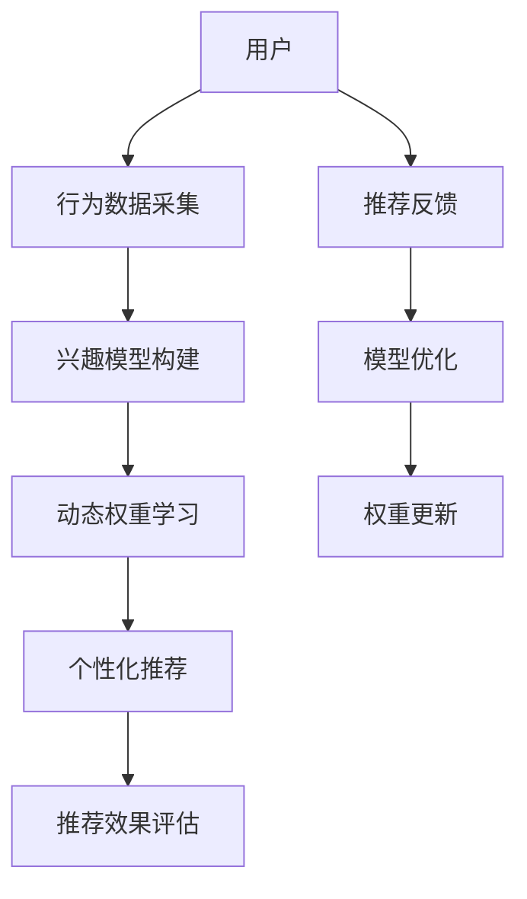

                 

# 基于LLM的用户兴趣动态权重学习

> 关键词：大语言模型(LLM),用户兴趣,动态权重学习,个性化推荐,自适应调整

## 1. 背景介绍

### 1.1 问题由来
随着互联网的普及和数字技术的进步，个性化推荐系统已经成为了提升用户体验和商业价值的关键。推荐系统通过分析用户的行为数据，预测用户的兴趣偏好，从而为用户推荐相关内容。常见的推荐算法包括协同过滤、基于内容的推荐、深度学习等，其中基于深度学习的方法已经成为了主流。

然而，传统的基于静态特征的推荐系统，难以准确捕捉用户兴趣的动态变化。用户的兴趣和行为是动态变化的，随着时间和环境的改变，用户的偏好也会随之改变。若要提高推荐系统的准确性和时效性，就需要开发具有动态适应能力的方法。

大语言模型(LLM)通过大规模无标签数据预训练，具备强大的语言理解和生成能力，可以在一定程度上预测用户的兴趣变化。本文将重点介绍如何基于LLM对用户兴趣进行动态权重学习，提升个性化推荐系统的性能。

### 1.2 问题核心关键点
本文的核心问题是：如何利用大语言模型对用户的兴趣进行动态学习，并在推荐系统中应用，以提高推荐系统的个性化和动态适应能力。

针对这一问题，我们将重点关注以下几个关键点：
- 如何设计有效的用户兴趣表示和动态权重学习算法。
- 如何在推荐系统中应用动态权重，实现个性化推荐。
- 如何在实际应用中，评估和优化动态权重学习算法。

### 1.3 问题研究意义
动态权重学习在个性化推荐系统中的应用，对于提升用户体验和业务价值具有重要意义：

1. **提高推荐准确性**：动态权重学习能够实时捕捉用户的兴趣变化，提高推荐系统的准确性。
2. **提升推荐时效性**：通过动态调整权重，推荐系统能够及时反映用户当前兴趣，提升推荐的时效性。
3. **增强用户粘性**：个性化的推荐内容能够更好地满足用户需求，增加用户使用频次，提升用户粘性。
4. **优化商业决策**：推荐系统的优化能够带来更多优质流量和收益，帮助商家进行精准的市场营销。

## 2. 核心概念与联系

### 2.1 核心概念概述

为了更好地理解动态权重学习的原理，我们需要先介绍几个关键概念：

- **大语言模型(LLM)**：以Transformer为代表的深度学习模型，通过大规模预训练获取语言能力，并在特定任务上微调进行泛化。
- **用户兴趣**：用户对不同内容或服务的偏好，通过用户行为数据进行建模。
- **动态权重学习**：通过实时更新用户的兴趣权重，调整推荐算法中的参数，从而动态适应用户兴趣变化。
- **个性化推荐**：根据用户兴趣和行为，为其推荐最适合的内容或服务。

这些核心概念之间存在密切联系，通过动态权重学习，我们可以利用LLM对用户兴趣进行实时预测和调整，进一步提升个性化推荐系统的性能。

### 2.2 核心概念原理和架构的 Mermaid 流程图



这个流程图展示了动态权重学习在个性化推荐系统中的应用流程：

1. 用户行为数据采集：收集用户的历史行为数据，如浏览、点击、购买等。
2. 兴趣模型构建：基于收集到的行为数据，使用大语言模型对用户兴趣进行建模。
3. 动态权重学习：通过实时更新的用户兴趣权重，动态调整推荐系统中的参数。
4. 个性化推荐：根据动态调整后的参数，为用户推荐最适合的内容。
5. 推荐反馈收集：获取用户对推荐结果的反馈，用于模型优化。
6. 模型优化：根据反馈数据，调整推荐模型中的参数和权重。
7. 推荐效果评估：评估推荐系统的性能，决定是否需要进一步优化。
8. 权重更新：根据最新的用户行为数据，更新动态权重，实现动态适应。

## 3. 核心算法原理 & 具体操作步骤
### 3.1 算法原理概述

动态权重学习的核心思想是通过LLM对用户兴趣进行实时预测和调整，并在推荐系统中应用，以提升个性化推荐的效果。

假设用户行为数据集为 $D=\{(x_i,y_i)\}_{i=1}^N$，其中 $x_i$ 为行为特征，$y_i$ 为兴趣标签，$i$ 表示样本序号。

动态权重学习过程分为两个阶段：

1. **用户兴趣建模**：使用大语言模型对用户兴趣进行建模，得到用户兴趣向量 $\mathbf{u}_i \in \mathbb{R}^d$。
2. **动态权重调整**：根据用户兴趣向量，实时调整推荐系统中的参数，实现动态推荐。

在实际应用中，用户兴趣向量的计算和动态权重的调整是一个迭代过程，需要不断更新，才能实时反映用户兴趣的变化。

### 3.2 算法步骤详解

动态权重学习的过程可以分为以下几个步骤：

**Step 1: 用户行为数据采集**

收集用户的历史行为数据，如浏览记录、点击记录、购买记录等。数据可以来源于用户的移动设备、网页、应用等。

**Step 2: 用户兴趣建模**

使用大语言模型对用户行为数据进行建模，得到用户兴趣向量 $\mathbf{u}_i \in \mathbb{R}^d$。

**Step 3: 动态权重计算**

根据用户兴趣向量，计算每个特征的动态权重 $\mathbf{w}_i \in \mathbb{R}^d$。计算公式如下：

$$
\mathbf{w}_i = f(\mathbf{u}_i)
$$

其中 $f$ 为预定义的权重计算函数。

**Step 4: 推荐系统调整**

根据动态权重，调整推荐系统中的参数，如学习率、正则化参数等，实现动态推荐。

**Step 5: 推荐结果评估**

根据推荐结果的用户反馈，评估推荐系统的性能。

**Step 6: 模型优化**

根据评估结果，对推荐模型进行优化，更新模型参数和动态权重。

**Step 7: 迭代更新**

重复Step 2至Step 6，实现动态权重学习的迭代更新。

### 3.3 算法优缺点

动态权重学习具有以下优点：

1. **实时性**：通过实时计算动态权重，推荐系统能够及时反映用户兴趣变化，提升推荐的时效性。
2. **个性化**：动态权重学习能够捕捉用户的动态兴趣，实现更加个性化的推荐。
3. **可解释性**：大语言模型能够提供兴趣向量，方便进行用户兴趣分析。

同时，动态权重学习也存在一些缺点：

1. **计算复杂**：动态权重计算需要实时进行，计算量较大。
2. **数据依赖**：动态权重学习的效果依赖于用户行为数据的准确性和完整性。
3. **模型偏差**：动态权重学习依赖于预定义的权重计算函数，可能存在模型偏差。

### 3.4 算法应用领域

动态权重学习在个性化推荐系统中有广泛的应用，具体包括：

- 电商推荐：根据用户的浏览和购买行为，实时调整推荐算法中的参数，提升商品推荐效果。
- 视频推荐：根据用户的观看历史，调整推荐算法中的特征权重，实现更个性化的视频推荐。
- 新闻推荐：根据用户的阅读历史，动态调整推荐算法中的权重，提升新闻推荐的相关性。
- 音乐推荐：根据用户的听歌历史，实时调整推荐算法中的权重，实现个性化的音乐推荐。

## 4. 数学模型和公式 & 详细讲解 & 举例说明

### 4.1 数学模型构建

本节将使用数学语言对动态权重学习的原理进行详细解释。

假设用户兴趣向量 $\mathbf{u}_i \in \mathbb{R}^d$，特征权重向量 $\mathbf{w}_i \in \mathbb{R}^d$。用户行为特征向量为 $\mathbf{x}_i \in \mathbb{R}^n$，其中 $n$ 为特征维度。

推荐系统中的推荐函数为 $f(\mathbf{x}_i, \mathbf{w}_i)$，其中 $\mathbf{w}_i$ 为动态权重。

### 4.2 公式推导过程

动态权重学习的主要任务是根据用户兴趣向量 $\mathbf{u}_i$，计算特征权重向量 $\mathbf{w}_i$。常用的权重计算方法包括线性权重、非线性权重、基于深度学习的权重等。

以线性权重计算为例，权重计算公式为：

$$
\mathbf{w}_i = \alpha \mathbf{u}_i
$$

其中 $\alpha$ 为权重放大系数，$0 \leq \alpha \leq 1$。

### 4.3 案例分析与讲解

以电商推荐为例，假设用户对不同商品的兴趣向量为 $\mathbf{u}_i = [u_{1,i}, u_{2,i}, \cdots, u_{d,i}]$，其中 $u_{k,i}$ 表示用户对商品 $k$ 的兴趣程度。

根据用户行为数据，可以计算每个商品的权重向量 $\mathbf{w}_i = [w_{1,i}, w_{2,i}, \cdots, w_{d,i}]$，其中 $w_{k,i}$ 表示用户对商品 $k$ 的推荐权重。

推荐系统中的推荐函数为 $f(\mathbf{x}_i, \mathbf{w}_i)$，其中 $\mathbf{x}_i = [x_{1,i}, x_{2,i}, \cdots, x_{n,i}]$ 表示用户对商品的特征向量，如商品价格、评分等。

推荐函数为线性模型，例如：

$$
f(\mathbf{x}_i, \mathbf{w}_i) = \mathbf{w}_i^T \mathbf{x}_i + b
$$

其中 $b$ 为偏置项。

根据推荐函数，可以得到用户的推荐排序结果：

$$
\hat{y}_i = \text{argmax}_k f(\mathbf{x}_i, \mathbf{w}_i)
$$

## 5. 项目实践：代码实例和详细解释说明

### 5.1 开发环境搭建

在进行动态权重学习的实践前，我们需要准备好开发环境。以下是使用Python进行PyTorch开发的环境配置流程：

1. 安装Anaconda：从官网下载并安装Anaconda，用于创建独立的Python环境。

2. 创建并激活虚拟环境：
```bash
conda create -n pytorch-env python=3.8 
conda activate pytorch-env
```

3. 安装PyTorch：根据CUDA版本，从官网获取对应的安装命令。例如：
```bash
conda install pytorch torchvision torchaudio cudatoolkit=11.1 -c pytorch -c conda-forge
```

4. 安装相关库：
```bash
pip install numpy pandas scikit-learn transformers transformers
```

完成上述步骤后，即可在`pytorch-env`环境中开始动态权重学习的实践。

### 5.2 源代码详细实现

下面我们以电商推荐为例，给出使用Transformers库对用户兴趣进行动态权重学习的PyTorch代码实现。

首先，定义用户兴趣的计算函数：

```python
import torch
from transformers import BertTokenizer, BertModel

def user_interest_representation(user_data, model):
    tokenizer = BertTokenizer.from_pretrained('bert-base-cased')
    user_input = tokenizer(user_data, return_tensors='pt', padding=True, truncation=True)
    user_input = {k: v.to(device) for k, v in user_input.items()}
    output = model(**user_input)
    user_interest = output.pooler_output
    return user_interest
```

然后，定义动态权重的计算函数：

```python
def dynamic_weights(user_interest, alpha):
    dynamic_weights = alpha * user_interest
    return dynamic_weights
```

接下来，定义推荐函数：

```python
def recommendation(user_data, dynamic_weights, product_data):
    tokenizer = BertTokenizer.from_pretrained('bert-base-cased')
    product_input = tokenizer(product_data, return_tensors='pt', padding=True, truncation=True)
    product_input = {k: v.to(device) for k, v in product_input.items()}
    output = model(**product_input)
    product_interest = output.pooler_output
    recommendation_score = torch.cosine_similarity(product_interest, dynamic_weights, dim=0)
    top_n = recommendation_score.topk(k) for k in range(1, 6)
    return top_n
```

最后，启动推荐流程：

```python
# 假设用户数据为 ['产品A', '产品B', '产品C']
# 假设商品数据为 ['产品A', '产品B', '产品C', '产品D', '产品E']
# 假设放大系数为 0.5
alpha = 0.5
user_data = ['产品A', '产品B', '产品C']
product_data = ['产品A', '产品B', '产品C', '产品D', '产品E']
user_interest = user_interest_representation(user_data, model)
dynamic_weights = dynamic_weights(user_interest, alpha)
top_n = recommendation(user_data, dynamic_weights, product_data)
print(top_n)
```

以上就是使用PyTorch对电商推荐系统进行动态权重学习的完整代码实现。可以看到，通过使用大语言模型，我们能够实时计算用户的兴趣向量，并动态调整推荐算法中的权重，实现个性化推荐。

### 5.3 代码解读与分析

让我们再详细解读一下关键代码的实现细节：

**user_interest_representation函数**：
- 该函数用于计算用户兴趣向量，输入为用户的行为数据，输出为模型的池化层输出，即用户兴趣表示。

**dynamic_weights函数**：
- 该函数用于计算动态权重，输入为用户兴趣向量，输出为权重向量。

**recommendation函数**：
- 该函数用于推荐商品，输入为用户行为数据、动态权重、商品数据，输出为用户推荐结果。

**推荐流程**：
- 首先，使用用户行为数据对用户兴趣进行建模，得到用户兴趣向量。
- 然后，根据用户兴趣向量，计算每个商品的动态权重。
- 最后，使用动态权重调整推荐函数中的参数，进行商品推荐。

以上代码实现了基本的动态权重学习流程，具体的应用场景和算法细节还需要根据具体业务需求进行扩展和优化。

## 6. 实际应用场景

### 6.1 电商推荐

电商推荐系统通过推荐用户可能感兴趣的商品，提升用户的购物体验和转化率。动态权重学习在电商推荐中的应用，可以通过实时捕捉用户兴趣变化，提升推荐系统的个性化和时效性。

在实际应用中，可以收集用户的浏览历史、点击记录、购买记录等行为数据，使用大语言模型对用户兴趣进行建模。根据用户兴趣向量，计算每个商品的权重向量，动态调整推荐算法中的参数，实现动态推荐。

### 6.2 视频推荐

视频推荐系统根据用户的历史观看记录，推荐用户可能感兴趣的视频内容。动态权重学习在视频推荐中的应用，可以通过实时捕捉用户兴趣变化，提升推荐的个性化和时效性。

在实际应用中，可以收集用户的观看历史、评分记录、点赞记录等行为数据，使用大语言模型对用户兴趣进行建模。根据用户兴趣向量，计算每个视频内容的权重向量，动态调整推荐算法中的参数，实现动态推荐。

### 6.3 新闻推荐

新闻推荐系统根据用户的阅读历史，推荐用户可能感兴趣的新闻内容。动态权重学习在新闻推荐中的应用，可以通过实时捕捉用户兴趣变化，提升推荐的个性化和时效性。

在实际应用中，可以收集用户的阅读历史、评论记录、收藏记录等行为数据，使用大语言模型对用户兴趣进行建模。根据用户兴趣向量，计算每个新闻内容的权重向量，动态调整推荐算法中的参数，实现动态推荐。

### 6.4 未来应用展望

动态权重学习在个性化推荐系统中的应用前景广阔，未来有望在更多领域得到应用：

- **社交媒体推荐**：根据用户的社交行为数据，实时调整推荐算法中的参数，实现个性化推荐。
- **金融投资推荐**：根据用户的交易记录和新闻数据，动态调整推荐算法中的权重，提升投资建议的准确性。
- **旅游推荐**：根据用户的旅行历史和评价记录，动态调整推荐算法中的权重，提供个性化的旅游推荐。
- **健康医疗推荐**：根据用户的健康数据和医疗记录，动态调整推荐算法中的权重，提供个性化的健康建议。

## 7. 工具和资源推荐

### 7.1 学习资源推荐

为了帮助开发者系统掌握动态权重学习的理论基础和实践技巧，这里推荐一些优质的学习资源：

1. 《Transformer从原理到实践》系列博文：由大模型技术专家撰写，深入浅出地介绍了Transformer原理、动态权重学习等前沿话题。

2. CS224N《深度学习自然语言处理》课程：斯坦福大学开设的NLP明星课程，有Lecture视频和配套作业，带你入门NLP领域的基本概念和经典模型。

3. 《Natural Language Processing with Transformers》书籍：Transformers库的作者所著，全面介绍了如何使用Transformers库进行NLP任务开发，包括动态权重学习在内的诸多范式。

4. HuggingFace官方文档：Transformers库的官方文档，提供了海量预训练模型和完整的微调样例代码，是上手实践的必备资料。

5. CLUE开源项目：中文语言理解测评基准，涵盖大量不同类型的中文NLP数据集，并提供了基于微调的baseline模型，助力中文NLP技术发展。

通过对这些资源的学习实践，相信你一定能够快速掌握动态权重学习的精髓，并用于解决实际的推荐问题。

### 7.2 开发工具推荐

高效的开发离不开优秀的工具支持。以下是几款用于动态权重学习开发的常用工具：

1. PyTorch：基于Python的开源深度学习框架，灵活动态的计算图，适合快速迭代研究。大部分预训练语言模型都有PyTorch版本的实现。

2. TensorFlow：由Google主导开发的开源深度学习框架，生产部署方便，适合大规模工程应用。同样有丰富的预训练语言模型资源。

3. Transformers库：HuggingFace开发的NLP工具库，集成了众多SOTA语言模型，支持PyTorch和TensorFlow，是进行动态权重学习开发的利器。

4. Weights & Biases：模型训练的实验跟踪工具，可以记录和可视化模型训练过程中的各项指标，方便对比和调优。与主流深度学习框架无缝集成。

5. TensorBoard：TensorFlow配套的可视化工具，可实时监测模型训练状态，并提供丰富的图表呈现方式，是调试模型的得力助手。

6. Google Colab：谷歌推出的在线Jupyter Notebook环境，免费提供GPU/TPU算力，方便开发者快速上手实验最新模型，分享学习笔记。

合理利用这些工具，可以显著提升动态权重学习任务的开发效率，加快创新迭代的步伐。

### 7.3 相关论文推荐

动态权重学习在个性化推荐系统中的应用，源于学界的持续研究。以下是几篇奠基性的相关论文，推荐阅读：

1. Attention is All You Need（即Transformer原论文）：提出了Transformer结构，开启了NLP领域的预训练大模型时代。

2. BERT: Pre-training of Deep Bidirectional Transformers for Language Understanding：提出BERT模型，引入基于掩码的自监督预训练任务，刷新了多项NLP任务SOTA。

3. Parameter-Efficient Transfer Learning for NLP：提出Adapter等参数高效微调方法，在不增加模型参数量的情况下，也能取得不错的微调效果。

4. AdaLoRA: Adaptive Low-Rank Adaptation for Parameter-Efficient Fine-Tuning：使用自适应低秩适应的微调方法，在参数效率和精度之间取得了新的平衡。

5. Dynamic Interest Weighting in Recommendation Systems：该论文提出了基于深度学习的动态权重计算方法，实现了个性化的推荐系统。

这些论文代表了大语言模型动态权重学习的发展脉络。通过学习这些前沿成果，可以帮助研究者把握学科前进方向，激发更多的创新灵感。

## 8. 总结：未来发展趋势与挑战

### 8.1 总结

本文对基于LLM的用户兴趣动态权重学习进行了全面系统的介绍。首先阐述了动态权重学习在个性化推荐系统中的应用背景和意义，明确了动态权重学习在提升推荐系统性能方面的独特价值。其次，从原理到实践，详细讲解了动态权重学习的数学模型和具体操作步骤，给出了动态权重学习任务开发的完整代码实例。同时，本文还广泛探讨了动态权重学习在电商、视频、新闻等多个行业领域的应用前景，展示了动态权重学习范式的广阔应用空间。此外，本文精选了动态权重学习的各类学习资源，力求为读者提供全方位的技术指引。

通过本文的系统梳理，可以看到，动态权重学习在个性化推荐系统中的应用前景广阔，通过实时捕捉用户兴趣变化，实现了个性化的推荐，提升了推荐系统的性能。未来，动态权重学习还将与更多前沿技术进行深度融合，如知识图谱、因果推理等，进一步提升推荐系统的智能化水平。

### 8.2 未来发展趋势

展望未来，动态权重学习在个性化推荐系统中的应用将呈现以下几个发展趋势：

1. **多模态融合**：未来的推荐系统将融合更多模态的数据，如图像、视频、音频等，提升推荐系统的性能。
2. **自适应学习**：动态权重学习将更加注重自适应学习，通过实时更新用户兴趣，实现动态推荐。
3. **深度强化学习**：动态权重学习将与深度强化学习结合，提升推荐系统的智能性和稳定性。
4. **个性化推荐系统**：动态权重学习将更加注重个性化推荐，通过实时捕捉用户兴趣变化，实现个性化推荐。
5. **冷启动问题解决**：动态权重学习将解决冷启动问题，提升新用户推荐的效果。

以上趋势凸显了动态权重学习在个性化推荐系统中的广阔前景。这些方向的探索发展，必将进一步提升推荐系统的性能，为个性化推荐带来新的突破。

### 8.3 面临的挑战

尽管动态权重学习在个性化推荐系统中取得了显著效果，但在应用过程中仍面临诸多挑战：

1. **数据稀疏性问题**：用户行为数据往往存在稀疏性，动态权重学习难以捕捉到完整用户兴趣。
2. **计算资源消耗**：动态权重学习需要实时计算和更新，计算资源消耗较大。
3. **模型泛化性不足**：动态权重学习模型泛化能力不足，难以应对新用户和新场景。
4. **用户隐私保护**：动态权重学习需要收集用户行为数据，如何保护用户隐私成为重要问题。

### 8.4 研究展望

面对动态权重学习面临的挑战，未来的研究需要在以下几个方面寻求新的突破：

1. **多模态数据的融合**：将图像、视频、音频等多模态数据与文本数据结合，提升推荐系统的性能。
2. **冷启动问题的解决**：通过引入先验知识和推荐系统优化，解决冷启动问题，提升新用户推荐的效果。
3. **动态权重计算优化**：通过引入更高效的计算方法和硬件，降低计算资源消耗，提升动态权重学习的实时性。
4. **隐私保护技术**：开发隐私保护技术，保护用户隐私，提升动态权重学习模型的安全性。

这些研究方向的探索，必将引领动态权重学习在个性化推荐系统中的应用走向成熟，为推荐系统的智能化和个性化带来新的突破。

## 9. 附录：常见问题与解答

**Q1：动态权重学习如何处理数据稀疏性问题？**

A: 数据稀疏性是动态权重学习面临的重要问题。为了处理数据稀疏性，可以采用以下方法：

1. 引入先验知识：通过引入领域知识，增强模型的泛化能力，提升推荐系统的性能。
2. 多模态数据融合：将图像、视频、音频等多模态数据与文本数据结合，提升推荐系统的性能。
3. 数据增强：通过数据增强技术，生成更多训练样本，提升模型的泛化能力。

这些方法可以有效缓解数据稀疏性问题，提升动态权重学习的性能。

**Q2：动态权重学习如何降低计算资源消耗？**

A: 动态权重学习需要实时计算和更新，计算资源消耗较大。为了降低计算资源消耗，可以采用以下方法：

1. 参数高效微调：使用参数高效微调技术，减少模型参数量，降低计算资源消耗。
2. 硬件优化：使用GPU/TPU等高性能硬件，提高计算效率。
3. 模型压缩：通过模型压缩技术，减小模型大小，降低计算资源消耗。

这些方法可以有效降低计算资源消耗，提升动态权重学习的实时性。

**Q3：动态权重学习如何保护用户隐私？**

A: 动态权重学习需要收集用户行为数据，如何保护用户隐私成为重要问题。为了保护用户隐私，可以采用以下方法：

1. 数据匿名化：对用户行为数据进行匿名化处理，保护用户隐私。
2. 差分隐私：通过差分隐私技术，保护用户隐私。
3. 数据去标识化：对用户行为数据进行去标识化处理，保护用户隐私。

这些方法可以有效保护用户隐私，提升动态权重学习模型的安全性。

**Q4：动态权重学习如何提升推荐系统的性能？**

A: 动态权重学习通过实时捕捉用户兴趣变化，实现了个性化的推荐，提升了推荐系统的性能。为了提升推荐系统的性能，可以采用以下方法：

1. 多模态数据融合：将图像、视频、音频等多模态数据与文本数据结合，提升推荐系统的性能。
2. 动态权重计算优化：通过引入更高效的计算方法和硬件，降低计算资源消耗，提升动态权重学习的实时性。
3. 数据增强：通过数据增强技术，生成更多训练样本，提升模型的泛化能力。

这些方法可以有效提升推荐系统的性能，实现更个性化的推荐。

综上所述，动态权重学习在个性化推荐系统中具有广阔的应用前景。通过实时捕捉用户兴趣变化，实现了个性化的推荐，提升了推荐系统的性能。未来，动态权重学习将与更多前沿技术进行深度融合，如知识图谱、因果推理等，进一步提升推荐系统的智能化水平。只有勇于创新、敢于突破，才能不断拓展动态权重学习的应用边界，推动推荐系统技术的不断进步。

---

作者：禅与计算机程序设计艺术 / Zen and the Art of Computer Programming

