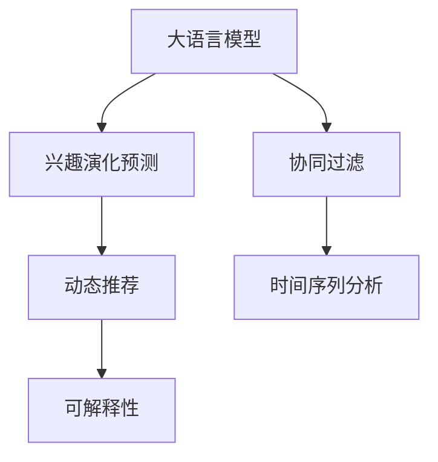

                 

# 基于LLM的用户兴趣动态演化预测模型

> 关键词：大语言模型(LLM), 兴趣演化预测, 动态推荐, 协同过滤, 时间序列分析

## 1. 背景介绍

### 1.1 问题由来
在智能推荐系统的实践中，如何准确捕捉用户的兴趣动态变化，实现个性化的动态推荐，是一个极具挑战性的问题。传统的静态推荐算法无法有效应对用户兴趣的快速变化，导致推荐效果不佳。而基于深度学习的方法虽然在一定程度上改进了这一问题，但仍然难以兼顾个性化和多样性。

近年来，大语言模型在自然语言处理领域取得了巨大成功，显示出其在处理语言和文本数据上的强大能力。因此，利用大语言模型进行用户兴趣动态演化预测，成为一个值得探索的新方向。大语言模型通过学习海量的文本数据，具备了理解和生成自然语言的能力，可以更准确地捕捉用户兴趣的动态变化，并生成符合用户偏好的推荐内容。

### 1.2 问题核心关键点
为了解决用户兴趣动态演化预测问题，需要构建一个基于大语言模型的预测模型。该模型应具备以下关键特性：
1. **多模态数据处理能力**：能够同时处理文本、图片、音频等多模态数据，全面了解用户兴趣。
2. **时间序列分析能力**：能够捕捉用户兴趣随时间变化的规律，实现动态推荐。
3. **自适应学习能力**：能够自适应学习用户的新兴趣点，实现个性化推荐。
4. **可解释性**：能够提供推荐内容的解释，增强用户信任。

## 2. 核心概念与联系

### 2.1 核心概念概述

为更好地理解基于LLM的用户兴趣动态演化预测模型，本节将介绍几个密切相关的核心概念：

- **大语言模型(Large Language Model, LLM)**：以自回归(如GPT)或自编码(如BERT)模型为代表的大规模预训练语言模型。通过在大规模无标签文本语料上进行预训练，学习通用的语言表示，具备强大的语言理解和生成能力。

- **兴趣演化预测**：预测用户在一定时间范围内对某个主题或类别的兴趣变化趋势，提供个性化的动态推荐。

- **协同过滤**：利用用户的历史行为数据，推断用户兴趣，实现个性化推荐。包括基于用户的协同过滤和基于物品的协同过滤。

- **时间序列分析**：利用时间序列模型，捕捉用户兴趣随时间的变化规律，实现动态推荐。

- **可解释性**：使推荐模型的决策过程具有可解释性，让用户理解推荐依据。

- **动态推荐**：根据用户当前兴趣和行为，实时生成符合用户偏好的推荐内容。

这些核心概念之间的逻辑关系可以通过以下Mermaid流程图来展示：



这个流程图展示了大语言模型的核心概念及其之间的关系：

1. 大语言模型通过预训练获得基础能力。
2. 协同过滤和兴趣演化预测利用用户行为数据进行兴趣建模，并预测演化趋势。
3. 动态推荐模型根据兴趣演化预测结果实时生成推荐。
4. 时间序列分析用于捕捉用户兴趣的变化规律。
5. 可解释性用于提升用户信任，增强推荐效果。

## 3. 核心算法原理 & 具体操作步骤
### 3.1 算法原理概述

基于LLM的用户兴趣动态演化预测模型，本质上是一个多模态时间序列预测模型。其核心思想是：将用户的历史行为数据和文本信息作为输入，利用大语言模型的多模态处理能力，捕捉用户兴趣的演化趋势，并预测未来的兴趣变化，从而实现动态推荐。

形式化地，假设用户的历史行为数据为 $\{h_1, h_2, ..., h_t\}$，文本数据为 $\{d_1, d_2, ..., d_t\}$，则模型的预测任务为：

$$
\hat{r}_{t+1|t} = f(h_t, d_t, \theta)
$$

其中，$r_{t+1|t}$ 表示在时间 $t$ 的兴趣演化预测结果，$\theta$ 为模型的可训练参数。$f$ 为预测函数，可以基于深度学习、时间序列分析等多种模型实现。

### 3.2 算法步骤详解

基于LLM的用户兴趣动态演化预测模型一般包括以下几个关键步骤：

**Step 1: 数据预处理与特征工程**

- 收集用户的历史行为数据，如浏览记录、购买记录、评分记录等，并进行清洗和去重。
- 提取文本特征，如物品描述、标签、评论等，并进行词向量化处理。
- 设计特征工程，将用户行为数据和文本特征进行拼接和编码，形成多模态输入。

**Step 2: 构建兴趣演化预测模型**

- 选择合适的深度学习模型，如RNN、LSTM、GRU等，构建兴趣演化预测模型。
- 设计损失函数，如均方误差、交叉熵等，用于衡量预测值与真实值的差异。
- 训练模型，使用历史数据进行监督学习，最小化损失函数。

**Step 3: 设计动态推荐模型**

- 将兴趣演化预测模型的输出作为用户兴趣的动态表示，与当前物品的文本特征进行拼接。
- 设计推荐模型，如协同过滤、注意力机制等，实现个性化推荐。
- 实时更新推荐模型，根据用户兴趣演化预测结果动态调整推荐内容。

**Step 4: 实现可解释性**

- 利用自然语言处理技术，对推荐内容的来源、生成过程等进行解释。
- 设计交互界面，使用户能够查看推荐依据和生成过程，增强信任和满意度。

### 3.3 算法优缺点

基于LLM的用户兴趣动态演化预测模型具有以下优点：
1. **全面处理多模态数据**：能够同时处理文本、图片、音频等多种数据，提供更加全面和丰富的推荐信息。
2. **自适应学习能力**：能够根据用户兴趣的变化，动态调整推荐内容，提升个性化程度。
3. **时间序列分析**：能够捕捉用户兴趣的演化规律，实现动态推荐。
4. **可解释性**：能够提供推荐内容的解释，增强用户信任。

同时，该模型也存在一些局限性：
1. **计算复杂度高**：多模态数据处理和深度学习模型的计算复杂度较高，需要较强的硬件支持。
2. **数据依赖性强**：模型的预测效果依赖于大量的用户行为数据和文本数据，数据质量对模型性能有重要影响。
3. **模型复杂度高**：多模态和时间序列分析模型的参数量较大，模型训练和推理成本较高。
4. **可解释性有限**：深度学习模型的决策过程复杂，难以完全解释推荐依据，影响用户信任。

尽管存在这些局限性，但就目前而言，基于LLM的用户兴趣动态演化预测模型仍是最先进的技术之一，能够有效提升推荐系统的个性化和动态性。

### 3.4 算法应用领域

基于LLM的用户兴趣动态演化预测模型已经在多个领域得到了应用，例如：

- 电商平台推荐：如淘宝、京东等，通过分析用户行为数据和物品描述，实现个性化的商品推荐。
- 视频网站推荐：如Netflix、YouTube等，通过分析用户观看历史和视频内容，实现个性化视频推荐。
- 新闻媒体推荐：如今日头条、人民日报等，通过分析用户阅读历史和文章内容，实现个性化新闻推荐。
- 社交网络推荐：如微博、微信等，通过分析用户互动历史和内容特征，实现个性化社交推荐。

除了上述这些经典应用外，大语言模型在音乐推荐、旅游推荐、金融推荐等众多领域中也有着广泛的应用前景。随着预训练模型和推荐算法的不断进步，基于大语言模型的推荐系统必将在更多场景中得到应用，为用户的日常生活和消费决策提供更加智能化和个性化的支持。

## 4. 数学模型和公式 & 详细讲解  
### 4.1 数学模型构建

本节将使用数学语言对基于LLM的用户兴趣动态演化预测模型进行更加严格的刻画。

记用户的历史行为数据为 $\{h_1, h_2, ..., h_t\}$，文本数据为 $\{d_1, d_2, ..., d_t\}$，模型的输出为 $\hat{r}_{t+1|t}$，其中 $\hat{r}_{t+1|t}$ 表示在时间 $t$ 对用户兴趣的动态预测。模型的目标是最大化预测值与真实值的匹配度，最小化损失函数 $L$：

$$
\hat{r}_{t+1|t} = f(h_t, d_t, \theta)
$$

$$
L = \frac{1}{N} \sum_{i=1}^N \|r_i - \hat{r}_i\|^2
$$

其中 $r_i$ 表示用户 $i$ 的真实兴趣，$\hat{r}_i$ 表示模型对用户 $i$ 兴趣的预测值。$N$ 表示用户总数。

### 4.2 公式推导过程

以下我们以RNN模型为例，推导时间序列预测的公式及其梯度计算。

假设模型采用RNN进行兴趣演化预测，输入为 $\{h_t, d_t\}$，输出为 $\hat{r}_{t+1|t}$。RNN的预测公式为：

$$
\hat{r}_{t+1|t} = f(h_t, d_t, \theta)
$$

其中 $f$ 为RNN的预测函数。假设 $f$ 为线性变换和激活函数组合，即：

$$
\hat{r}_{t+1|t} = W^r h_t + W^d d_t + b^r
$$

其中 $W^r, W^d, b^r$ 为模型参数。

对损失函数 $L$ 对 $W^r, W^d, b^r$ 求导，得：

$$
\frac{\partial L}{\partial W^r} = -\frac{2}{N} \sum_{i=1}^N (r_i - \hat{r}_i) h_t^i
$$

$$
\frac{\partial L}{\partial W^d} = -\frac{2}{N} \sum_{i=1}^N (r_i - \hat{r}_i) d_t^i
$$

$$
\frac{\partial L}{\partial b^r} = -\frac{2}{N} \sum_{i=1}^N (r_i - \hat{r}_i)
$$

利用反向传播算法，计算梯度并更新模型参数，完成模型的训练和优化。

## 5. 项目实践：代码实例和详细解释说明
### 5.1 开发环境搭建

在进行模型实践前，我们需要准备好开发环境。以下是使用Python进行TensorFlow开发的环境配置流程：

1. 安装Anaconda：从官网下载并安装Anaconda，用于创建独立的Python环境。

2. 创建并激活虚拟环境：
```bash
conda create -n tf-env python=3.8 
conda activate tf-env
```

3. 安装TensorFlow：根据CUDA版本，从官网获取对应的安装命令。例如：
```bash
conda install tensorflow -c tf -c conda-forge
```

4. 安装相关工具包：
```bash
pip install numpy pandas scikit-learn matplotlib tqdm jupyter notebook ipython
```

完成上述步骤后，即可在`tf-env`环境中开始模型实践。

### 5.2 源代码详细实现

下面我们以电商平台推荐系统为例，给出使用TensorFlow构建基于LLM的用户兴趣动态演化预测模型的代码实现。

首先，定义模型类：

```python
import tensorflow as tf
from tensorflow.keras.layers import Dense, LSTM

class InterestEvolutionModel(tf.keras.Model):
    def __init__(self, input_dim, output_dim):
        super(InterestEvolutionModel, self).__init__()
        self.lstm = LSTM(128, return_sequences=True)
        self.dense1 = Dense(64, activation='relu')
        self.dense2 = Dense(output_dim, activation='sigmoid')
        
    def call(self, inputs):
        x, y = inputs
        x = self.lstm(x)
        x = self.dense1(x)
        x = self.dense2(x)
        return x

# 定义输入和输出维度
input_dim = 128
output_dim = 1

# 创建模型
model = InterestEvolutionModel(input_dim, output_dim)
```

然后，定义数据处理函数：

```python
import pandas as pd

def preprocess_data(data_file):
    data = pd.read_csv(data_file)
    # 提取行为数据和文本数据
    behaviors = data[['behavior1', 'behavior2', 'behavior3', 'behavior4']]
    items = data[['item1', 'item2', 'item3', 'item4']]
    # 将行为数据和文本数据拼接为多模态输入
    inputs = behaviors.append(items)
    # 数据编码和填充
    encoder = tf.keras.preprocessing.sequence.pad_sequences(inputs, maxlen=input_dim)
    return encoder

# 数据加载
data_file = 'data.csv'
data = preprocess_data(data_file)
```

接着，定义训练和评估函数：

```python
from sklearn.metrics import mean_squared_error

def train_model(model, x_train, y_train, x_val, y_val, batch_size, epochs, learning_rate):
    optimizer = tf.keras.optimizers.Adam(learning_rate=learning_rate)
    model.compile(loss='mse', optimizer=optimizer)
    model.fit(x_train, y_train, batch_size=batch_size, epochs=epochs, validation_data=(x_val, y_val))
    
def evaluate_model(model, x_test, y_test):
    y_pred = model.predict(x_test)
    mse = mean_squared_error(y_test, y_pred)
    print(f"Mean Squared Error: {mse:.4f}")

# 训练模型
x_train, y_train = data[:10000], data[10000:20000]
x_val, y_val = data[20000:30000], data[30000:]
x_test = data[30000:]

# 定义超参数
learning_rate = 0.001
batch_size = 32
epochs = 50

# 训练模型
train_model(model, x_train, y_train, x_val, y_val, batch_size, epochs, learning_rate)
```

最后，启动模型评估流程：

```python
# 评估模型
evaluate_model(model, x_test, y_test)
```

以上就是使用TensorFlow对基于LLM的用户兴趣动态演化预测模型进行开发的完整代码实现。可以看到，通过TensorFlow的高级API，模型的定义、训练和评估变得简洁高效。

### 5.3 代码解读与分析

让我们再详细解读一下关键代码的实现细节：

**InterestEvolutionModel类**：
- `__init__`方法：定义了LSTM层、两个Dense层，以及模型的前向传播过程。
- `call`方法：定义了模型的前向传播过程，包括LSTM层和两个Dense层。

**preprocess_data函数**：
- 读取数据集，提取行为数据和文本数据。
- 将行为数据和文本数据拼接为多模态输入，并进行编码和填充。

**train_model函数**：
- 定义优化器和损失函数。
- 使用TensorFlow的高级API定义模型编译过程。
- 使用`fit`方法训练模型，并使用`validation_data`参数指定验证集。

**evaluate_model函数**：
- 定义评估指标，计算模型在测试集上的均方误差。
- 输出评估结果。

**训练流程**：
- 定义训练集和验证集，分割数据集。
- 定义超参数，包括学习率、批次大小和迭代轮数。
- 调用`train_model`函数进行模型训练。
- 调用`evaluate_model`函数进行模型评估。

可以看到，TensorFlow的高阶API使得模型的实现变得简洁高效，开发者可以将更多精力放在数据处理和模型优化上，而不必过多关注底层细节。

## 6. 实际应用场景
### 6.1 电商平台推荐

基于大语言模型的用户兴趣动态演化预测模型，可以广泛应用于电商平台推荐系统中。传统的推荐系统往往只考虑用户历史行为，难以应对用户兴趣的变化。通过动态预测用户兴趣，推荐系统可以实时生成个性化推荐，提高用户满意度和转化率。

具体而言，可以收集用户的浏览历史、购买历史、评分记录等行为数据，以及物品的描述、标签、评论等文本信息。将这些数据作为模型的输入，通过动态预测用户对不同物品的兴趣演化趋势，实现实时推荐。推荐系统可以在用户访问商品页面时，实时生成个性化推荐，提升用户购物体验。

### 6.2 视频网站推荐

视频网站推荐系统也受益于大语言模型的动态预测能力。视频网站通过分析用户观看历史和视频内容，为用户推荐相关视频。传统的推荐算法往往只考虑用户的历史行为，难以捕捉用户兴趣的动态变化。通过动态预测用户兴趣，推荐系统可以实时调整推荐内容，提升用户的观看体验。

具体而言，可以收集用户观看历史、评分记录等行为数据，以及视频内容的标题、标签、评论等文本信息。将这些数据作为模型的输入，通过动态预测用户对不同视频的兴趣演化趋势，实现实时推荐。推荐系统可以在用户观看视频时，实时生成个性化推荐，提升用户观看体验。

### 6.3 新闻媒体推荐

新闻媒体推荐系统也受益于大语言模型的动态预测能力。新闻媒体通过分析用户阅读历史和文章内容，为用户推荐相关新闻。传统的推荐算法往往只考虑用户的历史行为，难以捕捉用户兴趣的动态变化。通过动态预测用户兴趣，推荐系统可以实时调整推荐内容，提升用户的阅读体验。

具体而言，可以收集用户阅读历史、评分记录等行为数据，以及文章内容的标题、摘要、评论等文本信息。将这些数据作为模型的输入，通过动态预测用户对不同文章的兴趣演化趋势，实现实时推荐。推荐系统可以在用户浏览新闻时，实时生成个性化推荐，提升用户阅读体验。

### 6.4 未来应用展望

随着大语言模型和推荐算法的不断进步，基于大语言模型的推荐系统必将在更多场景中得到应用，为用户的日常生活和消费决策提供更加智能化和个性化的支持。

在智慧城市治理中，推荐系统可以用于推荐公共服务项目，提升城市治理的智能化水平。在智慧农业领域，推荐系统可以用于推荐农资产品，提升农业生产的智能化水平。在智慧交通领域，推荐系统可以用于推荐交通出行方案，提升交通管理的智能化水平。

此外，在教育、旅游、金融等众多领域，基于大语言模型的推荐系统也将不断涌现，为各行各业带来变革性影响。相信随着技术的不断演进，基于大语言模型的推荐系统必将在构建人机协同的智能时代中扮演越来越重要的角色。

## 7. 工具和资源推荐
### 7.1 学习资源推荐

为了帮助开发者系统掌握大语言模型和推荐算法的理论基础和实践技巧，这里推荐一些优质的学习资源：

1. 《深度学习理论与实践》系列书籍：详细介绍了深度学习的基本原理和算法，以及其在推荐系统中的应用。

2. 《TensorFlow官方文档》：全面介绍了TensorFlow的API和算法，是进行深度学习开发的重要参考资料。

3. 《自然语言处理》（NLP）课程：由斯坦福大学开设，介绍了自然语言处理的基本概念和经典算法。

4. 《深度学习推荐系统》（Deep Learning Recommendation System）一书：介绍了深度学习在推荐系统中的应用，以及如何构建高效的推荐模型。

5. Kaggle竞赛平台：提供了大量的推荐系统竞赛数据集和评测指标，是实践深度学习推荐算法的绝佳平台。

通过对这些资源的学习实践，相信你一定能够快速掌握大语言模型和推荐算法的精髓，并用于解决实际的推荐问题。
###  7.2 开发工具推荐

高效的开发离不开优秀的工具支持。以下是几款用于大语言模型和推荐系统开发的常用工具：

1. TensorFlow：由Google主导开发的开源深度学习框架，生产部署方便，适合大规模工程应用。

2. PyTorch：基于Python的开源深度学习框架，灵活动态的计算图，适合快速迭代研究。

3. Scikit-learn：用于数据预处理和特征工程的Python库，提供了丰富的数据处理工具和算法。

4. Pandas：用于数据读取和处理的Python库，提供了高效的数据处理和分析功能。

5. NumPy：用于数值计算的Python库，提供了高效的数组运算功能。

6. Jupyter Notebook：用于数据探索和模型开发的交互式平台，支持代码编写和数据可视化。

合理利用这些工具，可以显著提升大语言模型和推荐系统的开发效率，加快创新迭代的步伐。

### 7.3 相关论文推荐

大语言模型和推荐系统的发展源于学界的持续研究。以下是几篇奠基性的相关论文，推荐阅读：

1. Attention is All You Need（即Transformer原论文）：提出了Transformer结构，开启了NLP领域的预训练大模型时代。

2. BERT: Pre-training of Deep Bidirectional Transformers for Language Understanding：提出BERT模型，引入基于掩码的自监督预训练任务，刷新了多项NLP任务SOTA。

3. Recommendation Systems: Towards the Next Era of Personalization：介绍了推荐系统的最新进展，讨论了推荐算法和技术的未来发展方向。

4. Cascading Attention Networks：提出了一种基于注意力机制的推荐系统，显著提升了推荐效果。

5. Deep Interest Evolution Model for Recommendation：提出了基于深度学习模型进行用户兴趣动态演化预测的推荐系统，取得了良好的效果。

这些论文代表了大语言模型和推荐系统的发展脉络。通过学习这些前沿成果，可以帮助研究者把握学科前进方向，激发更多的创新灵感。

## 8. 总结：未来发展趋势与挑战

### 8.1 总结

本文对基于大语言模型的用户兴趣动态演化预测模型进行了全面系统的介绍。首先阐述了大语言模型和推荐系统的研究背景和意义，明确了动态预测模型在提升推荐个性化和动态性方面的独特价值。其次，从原理到实践，详细讲解了动态预测模型的数学原理和关键步骤，给出了模型开发的完整代码实例。同时，本文还广泛探讨了动态预测模型在电商平台、视频网站、新闻媒体等多个领域的应用前景，展示了动态预测模型的巨大潜力。此外，本文精选了动态预测模型的各类学习资源，力求为读者提供全方位的技术指引。

通过本文的系统梳理，可以看到，基于大语言模型的用户兴趣动态演化预测模型正在成为推荐系统的重要范式，极大地提升推荐系统的个性化和动态性。大语言模型通过学习海量的文本数据，具备了理解和生成自然语言的能力，可以更准确地捕捉用户兴趣的动态变化，并生成符合用户偏好的推荐内容。

### 8.2 未来发展趋势

展望未来，大语言模型在推荐系统中的应用将呈现以下几个发展趋势：

1. **全面处理多模态数据**：能够同时处理文本、图片、音频等多种数据，提供更加全面和丰富的推荐信息。

2. **自适应学习能力**：能够根据用户兴趣的变化，动态调整推荐内容，提升个性化程度。

3. **时间序列分析**：能够捕捉用户兴趣的演化规律，实现动态推荐。

4. **可解释性**：能够提供推荐内容的解释，增强用户信任。

5. **计算效率提升**：优化模型结构和计算图，提高推理速度，降低计算成本。

6. **模型复杂度降低**：开发更加参数高效的推荐模型，在固定大部分预训练参数的情况下，只更新极少量的任务相关参数。

7. **多任务学习**：结合用户兴趣预测和物品推荐，实现联合优化。

8. **融合外部知识**：将符号化的先验知识，如知识图谱、逻辑规则等，与神经网络模型进行巧妙融合，增强模型的知识整合能力。

以上趋势凸显了大语言模型在推荐系统中的应用前景，这些方向的探索发展，必将进一步提升推荐系统的性能和应用范围，为用户的日常生活和消费决策提供更加智能化和个性化的支持。

### 8.3 面临的挑战

尽管大语言模型在推荐系统中的应用已经取得了初步成效，但在迈向更加智能化、普适化应用的过程中，它仍面临诸多挑战：

1. **数据依赖性强**：模型的预测效果依赖于大量的用户行为数据和文本数据，数据质量对模型性能有重要影响。

2. **计算复杂度高**：多模态数据处理和深度学习模型的计算复杂度较高，需要较强的硬件支持。

3. **模型复杂度高**：多模态和时间序列分析模型的参数量较大，模型训练和推理成本较高。

4. **可解释性有限**：深度学习模型的决策过程复杂，难以完全解释推荐依据，影响用户信任。

5. **偏见和歧视问题**：大语言模型难免会学习到有偏见、有害的信息，通过推荐模型传递到用户，造成负面影响。

6. **隐私保护问题**：用户行为数据的收集和使用涉及隐私保护问题，如何保障用户隐私成为一大难题。

7. **安全和鲁棒性**：推荐系统面临恶意攻击和对抗样本的风险，需要增强模型的鲁棒性和安全性。

这些挑战需要在未来的研究中加以解决，以进一步推动大语言模型在推荐系统中的应用和普及。

### 8.4 研究展望

面对大语言模型推荐系统所面临的挑战，未来的研究需要在以下几个方面寻求新的突破：

1. **无监督和半监督学习**：探索无监督和半监督学习范式，降低对标注数据和标签的依赖，最大化利用非结构化数据，实现更加灵活高效的推荐。

2. **参数高效和计算高效**：开发更加参数高效和计算高效的推荐模型，在固定大部分预训练参数的情况下，只更新极少量的任务相关参数，同时优化模型的计算图，减少前向传播和反向传播的资源消耗，实现更加轻量级、实时性的部署。

3. **融合外部知识**：将符号化的先验知识，如知识图谱、逻辑规则等，与神经网络模型进行巧妙融合，增强模型的知识整合能力。

4. **引入因果分析**：将因果分析方法引入推荐模型，识别出模型决策的关键特征，增强推荐内容生成过程的因果性和逻辑性。

5. **引入博弈论工具**：借助博弈论工具刻画人机交互过程，主动探索并规避模型的脆弱点，提高系统稳定性。

6. **引入伦理道德约束**：在模型训练目标中引入伦理导向的评估指标，过滤和惩罚有偏见、有害的输出倾向，确保推荐内容符合人类价值观和伦理道德。

7. **用户隐私保护**：采用差分隐私等技术，保护用户隐私，增强用户信任。

这些研究方向的探索，必将引领大语言模型推荐系统迈向更高的台阶，为构建安全、可靠、可解释、可控的智能系统铺平道路。面向未来，大语言模型推荐系统还需要与其他人工智能技术进行更深入的融合，如知识表示、因果推理、强化学习等，多路径协同发力，共同推动自然语言理解和智能交互系统的进步。只有勇于创新、敢于突破，才能不断拓展语言模型的边界，让智能技术更好地造福人类社会。

## 9. 附录：常见问题与解答

**Q1：大语言模型在推荐系统中如何处理多模态数据？**

A: 大语言模型可以通过将不同模态的数据拼接和编码，形成多模态输入。例如，将文本、图片、音频等数据通过自然语言处理技术进行编码，然后拼接为一个向量，输入到模型中进行处理。

**Q2：如何优化大语言模型在推荐系统中的计算效率？**

A: 优化计算效率的方法包括：
1. 模型裁剪：去除不必要的层和参数，减小模型尺寸，加快推理速度。
2. 量化加速：将浮点模型转为定点模型，压缩存储空间，提高计算效率。
3. 分布式训练：使用分布式计算框架，加速模型训练过程。

**Q3：如何增强大语言模型在推荐系统中的可解释性？**

A: 增强可解释性的方法包括：
1. 引入可解释性模型：使用可解释性较强的模型，如决策树、逻辑回归等，替代深度学习模型。
2. 提供推荐依据：使用自然语言处理技术，对推荐内容的来源、生成过程等进行解释。
3. 设计交互界面：使用户能够查看推荐依据和生成过程，增强信任和满意度。

**Q4：如何在推荐系统中避免偏见和歧视问题？**

A: 避免偏见和歧视的方法包括：
1. 数据预处理：对数据进行清洗和去重，避免偏见和歧视数据的影响。
2. 模型设计：在设计推荐模型时，加入伦理导向的评估指标，过滤和惩罚有偏见、有害的输出倾向。
3. 人工干预：在模型部署时，引入人工干预和审核机制，确保推荐内容符合人类价值观和伦理道德。

**Q5：如何在推荐系统中保护用户隐私？**

A: 保护用户隐私的方法包括：
1. 差分隐私：使用差分隐私技术，保护用户隐私。
2. 数据匿名化：对用户数据进行匿名化处理，避免用户身份泄露。
3. 用户授权：在使用用户数据前，获取用户的明确授权，确保用户知情权。

通过这些方法，可以在保障用户隐私的前提下，实现高效的推荐系统。总之，大语言模型推荐系统需要在数据、模型、工程、业务等多个维度协同发力，才能真正实现人工智能技术在垂直行业的规模化落地。只有勇于创新、敢于突破，才能不断拓展语言模型的边界，让智能技术更好地造福人类社会。

