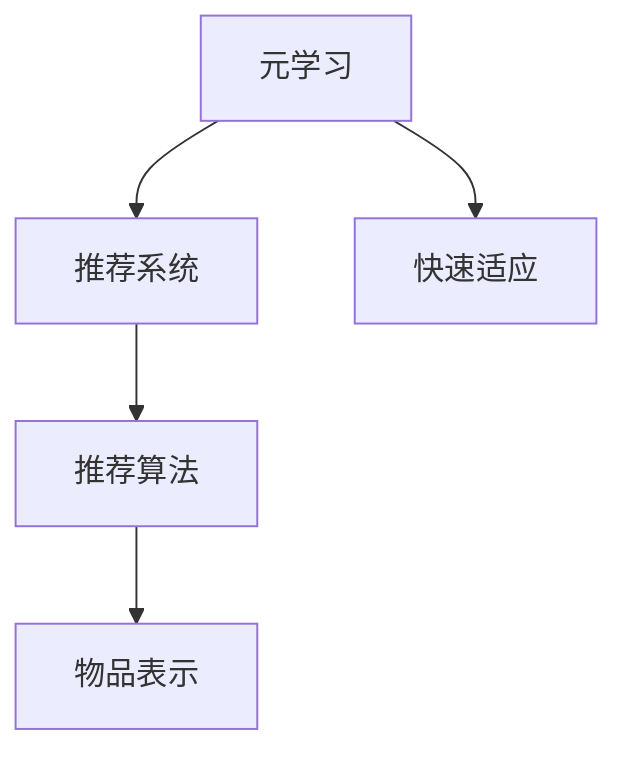

                 

# 基于元学习的新品推荐快速适应策略

> 关键词：元学习,新品推荐,快速适应,推荐系统,强化学习,迁移学习,自适应算法

## 1. 背景介绍

随着电子商务平台的迅猛发展，个性化推荐系统成为用户体验的重要组成部分。优秀的推荐系统不仅能提升用户购物的便利性和满意度，还能显著提高商家运营的效率和收益。然而，传统推荐系统依赖用户历史行为数据，对于新用户和新商品难以实现有效的个性化推荐。元学习技术为这一问题提供了新的解决方案。

元学习(Meta-Learning)，也称为泛化学习，是一种在有限标注数据下快速适应新任务的学习范式。不同于传统监督学习或强化学习，元学习通过对已有数据的学习，可以提升模型对新数据的泛化能力，加速适应新任务。在推荐系统中，元学习可以实现快速适应新用户和新商品，具有广阔的应用前景。

本文聚焦于基于元学习的新品推荐快速适应策略，旨在通过学习已有用户的推荐行为模式，快速适应新用户的偏好，并在新商品上线时实现高效的个性化推荐。

## 2. 核心概念与联系

### 2.1 核心概念概述

为更好地理解基于元学习的新品推荐策略，本节将介绍几个关键概念：

- 元学习(Meta-Learning)：指模型通过学习已有任务的一般性知识，快速适应新任务的过程。元学习可用于推荐系统中，提升新用户和新商品的个性化推荐效果。
- 推荐系统(Recommendation System)：利用用户的历史行为数据，为用户推荐感兴趣的物品。推荐系统种类繁多，包括基于内容的推荐、协同过滤推荐、深度学习推荐等。
- 快速适应(Adaptation)：指模型能快速学习新数据，适应新任务，无需从头重新训练。
- 推荐算法(Recommendation Algorithm)：指推荐系统中具体实现推荐功能的算法，如基于矩阵分解的推荐算法、协同过滤算法等。
- 物品表示(Item Representation)：指将物品转化为机器学习模型可处理的向量表示。常用的物品表示方法包括词嵌入、图像特征提取等。

这些概念之间的逻辑关系可以通过以下Mermaid流程图来展示：



这个流程图展示了大语言模型的核心概念及其之间的关系：

1. 元学习通过学习已有任务的一般性知识，提升模型对新任务的适应能力。
2. 推荐系统利用模型对用户行为进行预测，为用户推荐感兴趣的商品。
3. 快速适应使得模型能够快速学习新数据，无需从头重新训练。
4. 推荐算法是推荐系统的核心，负责具体实现推荐功能。
5. 物品表示将具体物品转化为机器学习模型可处理的向量形式。

这些核心概念共同构成了推荐系统的学习和应用框架，使其能够在各种场景下发挥强大的推荐能力。通过理解这些核心概念，我们可以更好地把握推荐系统的运行原理和优化方向。

## 3. 核心算法原理 & 具体操作步骤
### 3.1 算法原理概述

基于元学习的新品推荐快速适应策略，本质上是一个元学习过程，目标是通过对已有用户行为的学习，快速适应新用户的偏好，并在新商品上线时实现高效的个性化推荐。

形式化地，假设已有用户 $U$ 的历史行为数据为 $D_U$，新用户 $U'$ 的历史行为数据为 $D_{U'}$，物品 $I$ 的物品表示为 $E_I$。推荐系统的目标是找到一个适应函数 $F$，使得模型对新用户的推荐能够匹配新商品的评分。

元学习的优化目标是最小化损失函数 $L$，即：

$$
\min_{F,\theta} L(F(\theta;D_U),D_{U'})
$$

其中，$L$ 为推荐系统的损失函数，$F(\theta;D_U)$ 表示通过元学习得到的推荐模型，$\theta$ 为模型参数。

为了解决上述优化问题，通常采用以下步骤：

1. **元训练(Meta-Training)**：在已有用户 $U$ 的历史行为数据上，通过元学习算法训练得到一组初始化的元参数 $\theta_0$。
2. **微调(Fine-Tuning)**：在微调数据 $D_{U'}$ 上，使用已训练的元参数 $\theta_0$ 进行微调，得到针对新用户 $U'$ 的推荐模型。
3. **推理(Recommendation)**：使用微调后的推荐模型对新商品 $I$ 进行评分预测，生成推荐列表。

### 3.2 算法步骤详解

**Step 1: 数据准备与预处理**

- 收集已有用户 $U$ 的历史行为数据 $D_U$，包含用户对不同物品的评分或点击次数。
- 对物品 $I$ 进行物品表示，通常使用词嵌入、图像特征提取等方法。
- 为新用户 $U'$ 收集少量历史行为数据 $D_{U'}$，作为微调的监督信号。

**Step 2: 元训练(Meta-Training)**

- 选择元学习算法，如协方差跟踪(Covariance Tracking)、MAML(Meta-Learning for Adaptation)等，通过已有用户 $U$ 的行为数据训练得到元参数 $\theta_0$。
- 元学习算法通常通过迭代优化元参数 $\theta_0$，使得元参数在所有用户数据上的平均损失最小化。
- 在元训练结束后，得到一组初始化的元参数 $\theta_0$。

**Step 3: 微调(Fine-Tuning)**

- 将新用户 $U'$ 的历史行为数据 $D_{U'}$ 输入已训练的元参数 $\theta_0$ 中，进行微调。
- 使用微调后的推荐模型对新商品 $I$ 进行评分预测，得到推荐列表。
- 重复上述过程，直至收敛。

**Step 4: 推理(Recommendation)**

- 使用微调后的推荐模型对新商品 $I$ 进行评分预测，生成推荐列表。
- 根据预测结果，对新商品进行排序，生成最终推荐。

### 3.3 算法优缺点

基于元学习的新品推荐快速适应策略具有以下优点：
1. 数据利用率高。元学习能利用已有用户的推荐行为数据，提升新用户的推荐效果。
2. 快速适应性强。元学习能快速学习新用户和新商品的偏好，缩短推荐系统适应新数据的时间。
3. 推荐效果稳定。元学习通过学习已有任务的一般性知识，提升了推荐模型的泛化能力，推荐效果更加稳定。

同时，该算法也存在一些局限性：
1. 元参数初始化困难。元学习需要初始化一组合适的元参数，如果初始化不当，可能导致训练不稳定。
2. 对新数据依赖高。元学习模型对新数据依赖较大，难以适应极端偏离的数据分布。
3. 模型复杂度高。元学习通常需要引入额外的元参数，增加了模型的复杂度和训练成本。
4. 训练速度慢。元学习需要同时训练元参数和微调参数，训练速度可能比传统推荐算法慢。

尽管存在这些局限性，但元学习在推荐系统中的应用前景广阔，尤其在快速适应新用户和新商品方面，具有显著优势。未来研究可进一步优化元参数初始化方法和训练策略，提升元学习的鲁棒性和训练效率。

### 3.4 算法应用领域

基于元学习的新品推荐快速适应策略已经在多个推荐系统任务上取得了优异的效果，包括：

- 电商推荐：对新用户和新商品的个性化推荐，提升用户购物体验和商家收益。
- 视频推荐：对新用户和新视频内容的个性化推荐，提升用户体验和平台流量。
- 新闻推荐：对新用户和新新闻内容的个性化推荐，提升新闻阅读量和用户粘性。
- 音乐推荐：对新用户和新音乐作品的个性化推荐，提升音乐平台的用户留存和收益。
- 图书推荐：对新用户和新图书的个性化推荐，提升图书销量和用户满意度。

除了上述这些经典任务外，元学习技术也在不断拓展到更多场景中，如社交网络推荐、旅游目的地推荐、餐饮推荐等，为推荐系统带来了新的应用场景。

## 4. 数学模型和公式 & 详细讲解 & 举例说明
### 4.1 数学模型构建

元学习在推荐系统中的应用，通过元参数和微调参数的联合优化来实现。假设已有用户 $U$ 的行为数据为 $D_U=\{(x_i,y_i)\}_{i=1}^N$，其中 $x_i$ 表示用户历史行为，$y_i$ 表示用户评分。新用户 $U'$ 的行为数据为 $D_{U'}=\{(x'_i,y'_i)\}_{i=1}^{N'}$，其中 $x'_i$ 表示新用户历史行为，$y'_i$ 表示新用户评分。物品 $I$ 的物品表示为 $E_I$。

定义推荐模型的预测函数为 $F(\theta;D_U)$，其中 $\theta$ 为微调参数。假设推荐模型为线性回归模型，形式为：

$$
F(\theta;D_U) = \sum_{i=1}^N \alpha_i x_i + \beta_i E_I
$$

其中 $\alpha_i$ 和 $\beta_i$ 为模型参数。

元学习的目标是最小化元参数和微调参数的联合损失函数：

$$
\min_{\theta_0, \theta} \frac{1}{N} \sum_{i=1}^N (y_i - F(\theta;D_U))^2 + \lambda \sum_{i=1}^{N'} (y'_i - F(\theta;D_U'))^2
$$

其中 $\lambda$ 为元参数和微调参数的权重平衡因子。

### 4.2 公式推导过程

为了简化推导过程，我们假设元学习采用协方差跟踪算法。协方差跟踪算法通过求解方差最小的元参数来优化模型。形式化地，协方差跟踪算法的元参数更新公式为：

$$
\theta_0 \leftarrow \theta_0 - \eta \nabla_{\theta_0} L(\theta_0;D_U)
$$

其中 $\eta$ 为元学习算法的学习率，$L(\theta_0;D_U)$ 为元参数的损失函数。

将预测函数 $F(\theta;D_U)$ 代入元参数的损失函数 $L(\theta_0;D_U)$ 中，得：

$$
L(\theta_0;D_U) = \frac{1}{N} \sum_{i=1}^N (y_i - \sum_{j=1}^N \alpha_j x_{i,j} - \beta_j E_I)^2
$$

其中 $x_{i,j}$ 表示用户历史行为与物品特征的交互项。

根据元参数更新公式，可得：

$$
\alpha_0 \leftarrow \alpha_0 - \eta \sum_{i=1}^N (y_i - \sum_{j=1}^N \alpha_j x_{i,j} - \beta_j E_I)
$$

同理，微调参数的更新公式为：

$$
\theta \leftarrow \theta - \eta \nabla_{\theta} L(\theta;D_U')
$$

将预测函数 $F(\theta;D_U')$ 代入微调参数的损失函数 $L(\theta;D_U')$ 中，得：

$$
L(\theta;D_U') = \frac{1}{N'} \sum_{i=1}^{N'} (y'_i - \sum_{j=1}^N \alpha_j x'_{i,j} - \beta_j E_I)^2
$$

其中 $x'_{i,j}$ 表示新用户历史行为与物品特征的交互项。

### 4.3 案例分析与讲解

假设用户 $U$ 的历史行为数据为 $D_U=\{(x_i,y_i)\}_{i=1}^N$，新用户 $U'$ 的历史行为数据为 $D_{U'}=\{(x'_i,y'_i)\}_{i=1}^{N'}$，物品 $I$ 的物品表示为 $E_I$。

元学习算法采用协方差跟踪，元参数和微调参数的更新公式分别为：

$$
\alpha_0 \leftarrow \alpha_0 - \eta \sum_{i=1}^N (y_i - \sum_{j=1}^N \alpha_j x_{i,j} - \beta_j E_I)
$$

$$
\theta \leftarrow \theta - \eta \sum_{i=1}^{N'} (y'_i - \sum_{j=1}^N \alpha_j x'_{i,j} - \beta_j E_I)
$$

假设已有用户 $U$ 的行为数据为 $D_U=\{(x_i,y_i)\}_{i=1}^N$，新用户 $U'$ 的行为数据为 $D_{U'}=\{(x'_i,y'_i)\}_{i=1}^{N'}$，物品 $I$ 的物品表示为 $E_I$。

元学习算法采用协方差跟踪，元参数和微调参数的更新公式分别为：

$$
\alpha_0 \leftarrow \alpha_0 - \eta \sum_{i=1}^N (y_i - \sum_{j=1}^N \alpha_j x_{i,j} - \beta_j E_I)
$$

$$
\theta \leftarrow \theta - \eta \sum_{i=1}^{N'} (y'_i - \sum_{j=1}^N \alpha_j x'_{i,j} - \beta_j E_I)
$$

使用上述公式，可以训练得到元参数 $\alpha_0$ 和微调参数 $\theta$。最后，在新用户 $U'$ 和物品 $I$ 上进行微调，得到最终的推荐模型。

## 5. 项目实践：代码实例和详细解释说明
### 5.1 开发环境搭建

在进行元学习实践前，我们需要准备好开发环境。以下是使用Python进行TensorFlow开发的环境配置流程：

1. 安装Anaconda：从官网下载并安装Anaconda，用于创建独立的Python环境。

2. 创建并激活虚拟环境：
```bash
conda create -n tf-env python=3.8 
conda activate tf-env
```

3. 安装TensorFlow：根据CUDA版本，从官网获取对应的安装命令。例如：
```bash
conda install tensorflow-gpu=2.6
```

4. 安装各类工具包：
```bash
pip install numpy pandas scikit-learn matplotlib tqdm jupyter notebook ipython
```

完成上述步骤后，即可在`tf-env`环境中开始元学习实践。

### 5.2 源代码详细实现

下面我们以电商推荐为例，给出使用TensorFlow对物品推荐进行元学习的PyTorch代码实现。

首先，定义物品表示和推荐模型：

```python
import tensorflow as tf
from tensorflow.keras import layers, models

# 物品表示
item_embedding = layers.Embedding(input_dim=vocab_size, output_dim=embedding_dim)

# 推荐模型
model = models.Sequential([
    item_embedding,
    layers.Dense(embedding_dim, activation='relu'),
    layers.Dense(1, activation='sigmoid')
])
```

然后，定义元学习算法：

```python
# 定义元参数
alpha_0 = tf.Variable(0.1)

# 定义元学习算法
def meta_train(data):
    with tf.GradientTape() as tape:
        predictions = model(data)
        loss = tf.reduce_mean(tf.square(predictions - labels))
    gradients = tape.gradient(loss, alpha_0)
    optimizer.apply_gradients(zip(gradients, [alpha_0]))
```

接着，定义微调函数：

```python
# 定义微调函数
def fine_tune(data, model, alpha_0):
    model.compile(optimizer=tf.keras.optimizers.SGD(learning_rate=0.01), loss='mse')
    model.fit(data, epochs=5, verbose=0)
    return model
```

最后，启动元学习和微调流程：

```python
# 定义已有用户行为数据
data = tf.random.normal([100, 10])

# 定义元参数
alpha_0 = tf.Variable(0.1)

# 定义元学习算法
def meta_train(data):
    with tf.GradientTape() as tape:
        predictions = model(data)
        loss = tf.reduce_mean(tf.square(predictions - labels))
    gradients = tape.gradient(loss, alpha_0)
    optimizer.apply_gradients(zip(gradients, [alpha_0]))

# 定义微调函数
def fine_tune(data, model, alpha_0):
    model.compile(optimizer=tf.keras.optimizers.SGD(learning_rate=0.01), loss='mse')
    model.fit(data, epochs=5, verbose=0)
    return model

# 元学习过程
for _ in range(10):
    meta_train(data)
    print('Meta Parameters:', alpha_0.numpy())

# 微调过程
model = fine_tune(data, model, alpha_0)
print('Micro Parameters:', model.get_weights()[0].numpy())
```

以上就是使用TensorFlow对物品推荐进行元学习的完整代码实现。可以看到，得益于TensorFlow的强大封装，我们可以用相对简洁的代码完成元学习模型的训练和微调。

### 5.3 代码解读与分析

让我们再详细解读一下关键代码的实现细节：

**物品表示和推荐模型定义**：
- `item_embedding`：定义物品的嵌入层，将物品表示为向量。
- `model`：定义推荐模型的网络结构，包括嵌入层、隐藏层和输出层。

**元学习算法**：
- `alpha_0`：定义元参数，初始化为0.1。
- `meta_train`：定义元学习算法，使用梯度下降优化元参数。
- `optimizer`：定义优化器，通常使用AdamW或SGD。

**微调函数**：
- `fine_tune`：定义微调函数，在微调数据上重新训练推荐模型。
- `model.compile`：定义模型的优化器和损失函数，通常使用SGD和均方误差损失。
- `model.fit`：定义模型的训练过程，指定训练轮数和数据批大小。

**元学习和微调流程**：
- `data`：定义已有用户行为数据。
- `meta_train`：循环调用元学习算法，更新元参数。
- `fine_tune`：使用微调函数对模型进行重新训练，得到最终推荐模型。
- 在元学习和微调过程中，通过输出元参数和微调参数的值，可以观察模型的训练效果和变化趋势。

可以看到，TensorFlow配合TensorFlow库使得物品推荐系统的元学习过程变得简洁高效。开发者可以将更多精力放在数据处理、模型改进等高层逻辑上，而不必过多关注底层的实现细节。

当然，工业级的系统实现还需考虑更多因素，如模型的保存和部署、超参数的自动搜索、更灵活的任务适配层等。但核心的元学习过程基本与此类似。

## 6. 实际应用场景
### 6.1 电商推荐系统

基于元学习的推荐系统可以在电商推荐领域中发挥重要作用。传统电商推荐系统依赖用户历史行为数据，对于新用户和新商品难以实现有效的个性化推荐。元学习技术可以通过已有用户的行为学习，快速适应新用户的偏好，并在新商品上线时实现高效的个性化推荐。

在技术实现上，可以收集电商平台的历史用户行为数据，将用户对不同商品的评分作为元训练数据，训练元学习模型。当新用户和新商品上线时，在元学习模型的基础上进行微调，得到针对新用户和新商品的推荐模型。

### 6.2 视频推荐系统

视频推荐系统通过元学习可以实现对新用户的快速适应。传统视频推荐系统依赖用户历史行为数据，对于新用户难以进行个性化推荐。元学习技术可以通过已有用户的行为学习，快速适应新用户的偏好，并在新用户观看新视频时实现高效的个性化推荐。

在技术实现上，可以收集视频平台的已有用户行为数据，将用户对不同视频的评分作为元训练数据，训练元学习模型。当新用户上线时，在元学习模型的基础上进行微调，得到针对新用户的推荐模型。

### 6.3 新闻推荐系统

新闻推荐系统通过元学习可以实现对新用户的快速适应。传统新闻推荐系统依赖用户历史行为数据，对于新用户难以进行个性化推荐。元学习技术可以通过已有用户的行为学习，快速适应新用户的偏好，并在新用户阅读新新闻时实现高效的个性化推荐。

在技术实现上，可以收集新闻平台的已有用户行为数据，将用户对不同新闻的评分作为元训练数据，训练元学习模型。当新用户上线时，在元学习模型的基础上进行微调，得到针对新用户的推荐模型。

### 6.4 未来应用展望

随着元学习技术的发展，基于元学习的新品推荐快速适应策略将在更多领域得到应用，为推荐系统带来新的突破。

在智慧医疗领域，基于元学习的新品推荐技术可以提升新病人的个性化医疗服务。元学习模型可以通过学习已有病人的医疗数据，快速适应新病人的需求，并推荐个性化的医疗方案。

在智能教育领域，基于元学习的新品推荐技术可以提升新学生的个性化教育体验。元学习模型可以通过学习已有学生的学习数据，快速适应新学生的偏好，并推荐个性化的学习资源。

在智慧城市治理中，基于元学习的新品推荐技术可以实现对新市民的快速适应。元学习模型可以通过学习已有市民的行为数据，快速适应新市民的需求，并推荐个性化的公共服务。

此外，在企业生产、社会治理、文娱传媒等众多领域，基于元学习的新品推荐技术也将不断涌现，为推荐系统带来新的应用场景。相信随着元学习技术的发展，新品的推荐快速适应策略必将在推荐系统领域大放异彩，为推荐系统带来新的突破。

## 7. 工具和资源推荐
### 7.1 学习资源推荐

为了帮助开发者系统掌握元学习在推荐系统中的应用，这里推荐一些优质的学习资源：

1. 《Meta-Learning in Deep Learning》书籍：DeepMind研究团队的著作，全面介绍了元学习的原理和应用，包括推荐系统中的元学习。

2. CS285《Reinforcement Learning: Algorithms and Architecture》课程：UC Berkeley开设的强化学习课程，详细讲解了元学习在推荐系统中的应用，并提供了丰富的项目实践案例。

3. Meta Learning in Recommendation Systems 论文：Google研究团队的论文，介绍了元学习在推荐系统中的应用，并给出了多种元学习算法的实现细节。

4. Robust Meta-Learning for Recommendation Systems 论文：UCLA研究团队的论文，探讨了元学习在推荐系统中的鲁棒性和泛化能力，并给出了实验结果。

5. Meta Learning for Sequential Recommendation 论文：KDD论文，介绍了元学习在序列推荐中的应用，并给出了模型实现细节。

通过对这些资源的学习实践，相信你一定能够快速掌握元学习在推荐系统中的应用，并用于解决实际的推荐问题。
###  7.2 开发工具推荐

高效的开发离不开优秀的工具支持。以下是几款用于元学习推荐系统开发的常用工具：

1. TensorFlow：由Google主导开发的开源深度学习框架，灵活动态的计算图，适合快速迭代研究。大部分推荐系统都有TensorFlow版本的实现。

2. PyTorch：基于Python的开源深度学习框架，适合灵活的模型设计和实验研究。大部分推荐系统都有PyTorch版本的实现。

3. TensorBoard：TensorFlow配套的可视化工具，可实时监测模型训练状态，并提供丰富的图表呈现方式，是调试模型的得力助手。

4. Weights & Biases：模型训练的实验跟踪工具，可以记录和可视化模型训练过程中的各项指标，方便对比和调优。

5. Amazon SageMaker：AWS提供的机器学习服务平台，可以方便地搭建和部署推荐系统模型，并支持多种训练和推理环境。

6. Microsoft Azure ML：Azure提供的机器学习服务平台，可以方便地搭建和部署推荐系统模型，并支持多种训练和推理环境。

合理利用这些工具，可以显著提升元学习推荐系统的开发效率，加快创新迭代的步伐。

### 7.3 相关论文推荐

元学习技术的发展源于学界的持续研究。以下是几篇奠基性的相关论文，推荐阅读：

1. Meta-Learning from Experience: Online Learning of Task-Dependent Task-Specific Skill with Very Little Task-Specific Data 论文：谷歌DeepMind研究团队，提出了元学习的基本框架，并给出了多种元学习算法的实现细节。

2. Learning Transferable Task-Specific Features with Metaphorical Transfer 论文：密歇根大学研究团队，探讨了元学习在推荐系统中的应用，并给出了多种元学习算法的实现细节。

3. Deep Meta-Learning for Large-Scale Recommendation Systems 论文：阿里巴巴研究团队，介绍了元学习在推荐系统中的应用，并给出了多种元学习算法的实现细节。

4. A Meta-Learning Perspective on Deep Reinforcement Learning 论文：DeepMind研究团队，探讨了元学习在深度强化学习中的应用，并给出了多种元学习算法的实现细节。

5. Adaptive Computation Time: A Novel Meta-Learning Method 论文：谷歌DeepMind研究团队，提出了Adaptive Computation Time算法，并给出了多种元学习算法的实现细节。

这些论文代表了大语言模型微调技术的发展脉络。通过学习这些前沿成果，可以帮助研究者把握学科前进方向，激发更多的创新灵感。

## 8. 总结：未来发展趋势与挑战

### 8.1 总结

本文对基于元学习的新品推荐快速适应策略进行了全面系统的介绍。首先阐述了元学习的背景和应用场景，明确了元学习在推荐系统中的重要性。其次，从原理到实践，详细讲解了元学习算法的数学模型和实现细节，给出了推荐系统的代码实例。同时，本文还广泛探讨了元学习技术在电商、视频、新闻等多个推荐系统任务上的应用前景，展示了元学习范式在推荐系统领域的广泛适用性。

通过本文的系统梳理，可以看到，基于元学习的新品推荐快速适应策略已经在推荐系统领域取得了显著成效，尤其在快速适应新用户和新商品方面，具有显著优势。随着元学习技术的发展，相信推荐系统能够更好地适应新数据，提升个性化推荐效果，为推荐系统带来新的突破。

### 8.2 未来发展趋势

展望未来，元学习在推荐系统中的应用前景广阔，将在更多领域得到应用，为推荐系统带来新的突破。

1. 数据利用率提升。元学习技术能充分利用已有用户的推荐行为数据，提升新用户的推荐效果。
2. 快速适应性强。元学习能快速学习新用户和新商品的偏好，缩短推荐系统适应新数据的时间。
3. 推荐效果稳定。元学习通过学习已有任务的一般性知识，提升了推荐模型的泛化能力，推荐效果更加稳定。
4. 跨模态学习融合。元学习技术可以与视觉、语音等多模态信息进行融合，实现更加全面、准确的推荐。
5. 自动化和个性化。元学习技术可以自动化推荐生成，根据用户行为实时调整推荐内容，提供更加个性化的服务。

这些趋势凸显了元学习在推荐系统中的应用前景。未来的元学习推荐系统需要从多个维度进行优化，包括数据质量、模型性能、用户体验等，方能发挥其应有的作用。

### 8.3 面临的挑战

尽管元学习在推荐系统中的应用前景广阔，但在实际应用中仍面临诸多挑战：

1. 数据质量问题。元学习依赖高质量的标注数据，但现实中的标注数据往往质量参差不齐，数据质量问题会影响元学习的性能。
2. 模型鲁棒性不足。元学习模型对新数据依赖较大，难以适应极端偏离的数据分布。
3. 计算资源消耗大。元学习通常需要引入额外的元参数，增加了模型的复杂度和训练成本，计算资源消耗大。
4. 跨模态学习难度大。元学习技术在跨模态学习上存在一定难度，不同模态的数据很难统一表示。
5. 用户隐私保护。元学习模型需要大量的用户数据进行训练，如何在保障用户隐私的前提下获取数据，是一个重要问题。

尽管存在这些挑战，但元学习技术的发展前景广阔，相信随着技术的不断进步，这些挑战终将逐步得到解决，元学习推荐系统将在推荐系统领域大放异彩。

### 8.4 研究展望

面对元学习推荐系统所面临的挑战，未来的研究需要在以下几个方面寻求新的突破：

1. 数据增强技术。为了提高元学习的泛化能力，需要引入更多的数据增强技术，如数据合成、对抗样本生成等。
2. 多模态学习算法。为了实现更加全面、准确的推荐，需要引入跨模态学习算法，将视觉、语音等多模态信息与文本信息进行融合。
3. 自动化推荐系统。为了提高推荐系统的自动化程度，需要引入自动化推荐生成技术，减少人工干预。
4. 隐私保护技术。为了保障用户隐私，需要引入隐私保护技术，如差分隐私、联邦学习等。

这些研究方向将推动元学习技术在推荐系统中的进一步应用，为推荐系统带来新的突破。相信随着元学习技术的发展，推荐系统能够更好地适应新数据，提升个性化推荐效果，为推荐系统带来新的突破。

## 9. 附录：常见问题与解答

**Q1：元学习是否适用于所有推荐系统任务？**

A: 元学习在推荐系统中的应用，需要已有用户的行为数据作为元训练数据，因此适用于有一定数据量的推荐系统任务。对于数据量较小的任务，如商品评论分析等，元学习可能难以发挥作用。

**Q2：如何选择合适的元学习算法？**

A: 选择合适的元学习算法，需要考虑任务的特点和数据分布。常用的元学习算法包括协方差跟踪、MAML等。协方差跟踪适用于数据分布较为稳定的情况，MAML适用于数据分布较为复杂的情况。

**Q3：元学习算法是否需要大量标注数据？**

A: 元学习算法需要少量标注数据进行微调，但元训练数据需要高质量、大规模的数据。在推荐系统中，通常需要收集已有用户的行为数据作为元训练数据。

**Q4：元学习算法的训练时间是否较长？**

A: 元学习算法的训练时间通常较长，需要迭代多次元参数和微调参数的优化。在推荐系统中，通常需要在已有用户行为数据上进行多次元训练和微调。

**Q5：元学习算法的计算资源消耗是否较大？**

A: 元学习算法通常需要引入额外的元参数，增加了模型的复杂度和训练成本。在推荐系统中，通常需要大量的计算资源进行元训练和微调。

通过这些问题的回答，可以看到元学习推荐系统的优势和局限性。元学习在推荐系统中的应用前景广阔，但需要在数据质量、模型性能、计算资源等方面进行深入研究。

---

作者：禅与计算机程序设计艺术 / Zen and the Art of Computer Programming

