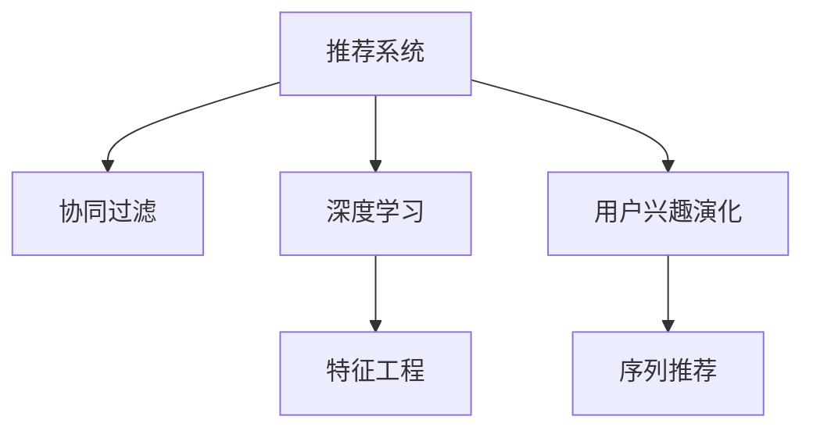

                 

# 基于大模型的推荐系统用户兴趣演化

> 关键词：推荐系统,用户兴趣演化,用户行为分析,深度学习,协同过滤,特征工程

## 1. 背景介绍

### 1.1 问题由来
在数字化时代，个性化推荐系统已广泛应用于电商、社交媒体、视频平台、音乐服务等诸多场景，极大地提升了用户体验和商家收入。推荐系统通过分析用户历史行为数据，预测用户可能感兴趣的内容，并将其推荐给用户。然而，随着用户兴趣的变化和行为数据的变化，传统的推荐模型往往难以快速响应新的变化，导致推荐效果下降。

### 1.2 问题核心关键点
推荐系统面临的挑战在于如何实时捕捉用户兴趣的动态变化，并根据新的兴趣数据，快速调整推荐结果。传统的推荐模型通常基于历史行为数据进行静态分析，缺乏对用户兴趣演化的捕捉能力。

为了解决这一问题，基于大模型的推荐系统应运而生。利用深度学习技术，大模型能够从大规模数据中学习到丰富的用户兴趣和行为模式，捕捉动态变化的用户偏好，实现更精准的推荐。

### 1.3 问题研究意义
研究基于大模型的推荐系统用户兴趣演化，对于提升推荐系统的性能，增强用户体验，推动数字经济的发展，具有重要意义：

1. **提升推荐精准度**：通过捕捉用户兴趣的动态变化，实现个性化推荐的实时调整，提升推荐效果。
2. **增强用户体验**：实时根据用户兴趣变化推荐内容，避免内容滞后，增强用户粘性。
3. **降低运营成本**：减少个性化推荐的实验和调参工作，提高系统效率，降低运营成本。
4. **推动数字经济**：为电商、内容服务等数字化转型提供技术支撑，推动数字经济的发展。

## 2. 核心概念与联系

### 2.1 核心概念概述

为更好地理解基于大模型的推荐系统用户兴趣演化方法，本节将介绍几个密切相关的核心概念：

- **推荐系统**：根据用户的历史行为数据，预测用户可能感兴趣的内容，并将其推荐给用户。
- **协同过滤**：基于用户和物品之间的相似度，推荐用户可能感兴趣的物品。
- **深度学习**：利用多层神经网络进行特征学习和模式识别，提升推荐系统的性能。
- **特征工程**：对原始数据进行预处理和特征提取，提升推荐模型的效果。
- **用户兴趣演化**：用户兴趣随时间变化而发生改变，推荐系统需要实时捕捉这些变化，调整推荐策略。
- **序列推荐**：通过分析用户行为序列，捕捉用户的长期兴趣变化，提供更精准的推荐。

这些核心概念之间的逻辑关系可以通过以下Mermaid流程图来展示：



这个流程图展示了大模型推荐系统的核心概念及其之间的关系：

1. 推荐系统基于协同过滤、深度学习和特征工程技术，进行个性化推荐。
2. 用户兴趣演化描述用户兴趣随时间的变化。
3. 序列推荐通过分析用户行为序列，捕捉长期兴趣变化。

## 3. 核心算法原理 & 具体操作步骤
### 3.1 算法原理概述

基于大模型的推荐系统用户兴趣演化，主要通过深度学习模型捕捉用户兴趣的动态变化，实时调整推荐策略。其核心思想是：利用大模型学习用户兴趣的长期和短期变化，并结合用户行为序列，进行实时推荐。

形式化地，假设用户历史行为数据为 $D=\{(x_i,y_i)\}_{i=1}^N$，其中 $x_i$ 为用户行为序列，$y_i$ 为用户对物品的评分。推荐系统的目标是通过深度学习模型，捕捉用户兴趣的演化，预测用户对未评分物品的评分 $y$，然后按照评分排序推荐。

推荐算法可以表示为：

$$
y = f_{\theta}(x; \phi)
$$

其中 $f_{\theta}$ 为深度学习模型，$\theta$ 为模型参数，$\phi$ 为序列表示。

推荐系统实时调整用户兴趣的方法通常有以下几种：

1. **用户行为更新**：实时记录用户的新行为，更新用户兴趣模型。
2. **物品评分修正**：根据新物品的评分，修正用户兴趣模型。
3. **兴趣演化预测**：利用时序模型预测用户兴趣的演化趋势。

### 3.2 算法步骤详解

基于大模型的推荐系统用户兴趣演化的一般步骤如下：

**Step 1: 数据准备**
- 收集用户历史行为数据 $D$，包括用户行为序列 $x_i$ 和用户评分 $y_i$。
- 准备物品库 $M$，包含所有物品的特征向量。

**Step 2: 特征工程**
- 对原始数据进行特征提取，如用户行为序列、用户属性、物品属性等。
- 利用深度学习模型对提取的特征进行编码，得到高维嵌入向量。

**Step 3: 模型训练**
- 选择合适的深度学习模型，如序列生成模型、序列推荐模型等。
- 利用历史数据训练模型，得到用户兴趣演化模型 $f_{\theta}$。

**Step 4: 实时推荐**
- 对新输入的用户行为序列 $x$ 进行编码，得到高维嵌入向量。
- 根据用户兴趣演化模型 $f_{\theta}$ 预测用户对未评分物品的评分 $y$。
- 结合物品评分和序列表示，进行推荐排序，输出推荐列表。

**Step 5: 兴趣演化预测**
- 利用时序模型预测用户兴趣演化趋势。
- 根据预测结果，动态调整推荐策略。

### 3.3 算法优缺点

基于大模型的推荐系统用户兴趣演化方法具有以下优点：

1. **实时性**：利用深度学习模型捕捉用户兴趣的动态变化，实时调整推荐策略。
2. **精准度**：通过学习用户兴趣的长期和短期变化，提升推荐效果。
3. **普适性**：适用于多种推荐场景，包括电商、视频、音乐等。
4. **灵活性**：可以结合不同的时序模型，动态调整推荐策略。

同时，该方法也存在一定的局限性：

1. **数据需求大**：需要大量的用户行为数据进行训练，数据收集成本较高。
2. **计算复杂度高**：深度学习模型的训练和推理计算复杂度较高，需要强大的硬件支持。
3. **模型可解释性不足**：深度学习模型通常是"黑盒"系统，难以解释内部机制和决策逻辑。
4. **易受干扰**：推荐模型可能受到用户噪声和数据不平衡的影响，推荐效果波动较大。

尽管存在这些局限性，但就目前而言，基于大模型的推荐系统用户兴趣演化方法仍是目前推荐系统领域的前沿技术之一，具有广泛的应用前景。

### 3.4 算法应用领域

基于大模型的推荐系统用户兴趣演化方法，已经在电商、内容服务、社交媒体等多个领域得到了广泛的应用，具体如下：

- **电商推荐**：电商平台通过分析用户行为序列，捕捉长期兴趣变化，实时调整推荐策略，提升销售转化率。
- **内容推荐**：视频平台通过深度学习模型捕捉用户兴趣演化，实时调整内容推荐策略，提高用户观看时长和黏性。
- **社交媒体**：社交媒体通过分析用户行为序列，捕捉长期兴趣变化，实时调整内容推荐，提升用户活跃度。
- **音乐推荐**：音乐平台通过深度学习模型捕捉用户兴趣演化，实时调整推荐策略，提高用户听歌时长和满意度。

除了上述这些经典应用外，基于大模型的推荐系统用户兴趣演化方法还可以创新性地应用到更多场景中，如可控推荐、跨领域推荐等，为推荐系统带来全新的突破。

## 4. 数学模型和公式 & 详细讲解
### 4.1 数学模型构建

本节将使用数学语言对基于大模型的推荐系统用户兴趣演化过程进行更加严格的刻画。

假设推荐系统基于深度学习模型进行训练，用户行为序列为 $x=\{x_1, x_2, \cdots, x_T\}$，用户对物品的评分向量为 $y$。推荐系统利用深度学习模型对用户行为序列进行编码，得到高维嵌入向量 $z$，并利用用户兴趣演化模型 $f_{\theta}$ 预测用户对未评分物品的评分 $y$，推荐算法可以表示为：

$$
y = f_{\theta}(z)
$$

其中 $f_{\theta}$ 为深度学习模型，$z$ 为高维嵌入向量，$y$ 为预测评分。

推荐系统的目标是最小化预测评分与实际评分之间的差距，即最小化损失函数 $\mathcal{L}$：

$$
\mathcal{L}(y, \hat{y}) = \frac{1}{N} \sum_{i=1}^N \ell(y_i, \hat{y}_i)
$$

其中 $\ell$ 为评分误差函数，如均方误差（MSE）或平均绝对误差（MAE）。

### 4.2 公式推导过程

以下我们以均方误差（MSE）为例，推导推荐模型的损失函数及其梯度计算公式。

假设推荐系统基于深度学习模型，对用户行为序列 $x$ 进行编码，得到高维嵌入向量 $z$。利用用户兴趣演化模型 $f_{\theta}$ 预测用户对未评分物品的评分 $y$。则均方误差损失函数可以表示为：

$$
\mathcal{L}(y, \hat{y}) = \frac{1}{N} \sum_{i=1}^N (y_i - \hat{y}_i)^2
$$

根据链式法则，损失函数对模型参数 $\theta$ 的梯度为：

$$
\nabla_{\theta} \mathcal{L}(y, \hat{y}) = -\frac{2}{N} \sum_{i=1}^N (y_i - \hat{y}_i) \nabla_{\theta} \hat{y}_i
$$

其中 $\nabla_{\theta} \hat{y}_i$ 为模型 $f_{\theta}$ 对输入 $z_i$ 的梯度。

在得到损失函数的梯度后，即可带入参数更新公式，完成模型的迭代优化。重复上述过程直至收敛，最终得到适应用户兴趣演化趋势的最优模型参数 $\theta^*$。

## 5. 项目实践：代码实例和详细解释说明
### 5.1 开发环境搭建

在进行推荐系统开发前，我们需要准备好开发环境。以下是使用Python进行PyTorch开发的环境配置流程：

1. 安装Anaconda：从官网下载并安装Anaconda，用于创建独立的Python环境。

2. 创建并激活虚拟环境：
```bash
conda create -n pytorch-env python=3.8 
conda activate pytorch-env
```

3. 安装PyTorch：根据CUDA版本，从官网获取对应的安装命令。例如：
```bash
conda install pytorch torchvision torchaudio cudatoolkit=11.1 -c pytorch -c conda-forge
```

4. 安装Transformers库：
```bash
pip install transformers
```

5. 安装各类工具包：
```bash
pip install numpy pandas scikit-learn matplotlib tqdm jupyter notebook ipython
```

完成上述步骤后，即可在`pytorch-env`环境中开始推荐系统开发。

### 5.2 源代码详细实现

下面我以电商平台推荐系统为例，给出使用Transformers库对BERT模型进行推荐系统开发和用户兴趣演化的PyTorch代码实现。

首先，定义推荐系统的数据处理函数：

```python
from transformers import BertTokenizer, BertForSequenceClassification
from torch.utils.data import Dataset
import torch

class RecommendationDataset(Dataset):
    def __init__(self, user_behaviors, items, tokenizer, max_len=128):
        self.user_behaviors = user_behaviors
        self.items = items
        self.tokenizer = tokenizer
        self.max_len = max_len
        
    def __len__(self):
        return len(self.user_behaviors)
    
    def __getitem__(self, item):
        user_behavior = self.user_behaviors[item]
        item = self.items[item]
        
        encoding = self.tokenizer(user_behavior, return_tensors='pt', max_length=self.max_len, padding='max_length', truncation=True)
        user_seq = encoding['input_ids'][0]
        item_seq = item.encode(self.tokenizer.vocab)
        
        # 对token-wise的标签进行编码
        label = 1
        encoded_label = [label] * (self.max_len - len(item_seq))
        labels = torch.tensor(encoded_label, dtype=torch.long)
        
        return {'user_seq': user_seq, 
                'item_seq': item_seq,
                'labels': labels}

# 创建dataset
tokenizer = BertTokenizer.from_pretrained('bert-base-cased')

train_dataset = RecommendationDataset(train_user_behaviors, train_items, tokenizer)
dev_dataset = RecommendationDataset(dev_user_behaviors, dev_items, tokenizer)
test_dataset = RecommendationDataset(test_user_behaviors, test_items, tokenizer)
```

然后，定义模型和优化器：

```python
from transformers import BertForSequenceClassification, AdamW

model = BertForSequenceClassification.from_pretrained('bert-base-cased', num_labels=1)

optimizer = AdamW(model.parameters(), lr=2e-5)
```

接着，定义训练和评估函数：

```python
from torch.utils.data import DataLoader
from tqdm import tqdm
from sklearn.metrics import mean_squared_error

device = torch.device('cuda') if torch.cuda.is_available() else torch.device('cpu')
model.to(device)

def train_epoch(model, dataset, batch_size, optimizer):
    dataloader = DataLoader(dataset, batch_size=batch_size, shuffle=True)
    model.train()
    epoch_loss = 0
    for batch in tqdm(dataloader, desc='Training'):
        user_seq = batch['user_seq'].to(device)
        item_seq = batch['item_seq'].to(device)
        labels = batch['labels'].to(device)
        model.zero_grad()
        outputs = model(user_seq, labels=labels)
        loss = outputs.loss
        epoch_loss += loss.item()
        loss.backward()
        optimizer.step()
    return epoch_loss / len(dataloader)

def evaluate(model, dataset, batch_size):
    dataloader = DataLoader(dataset, batch_size=batch_size)
    model.eval()
    mse = mean_squared_error(y_true, y_pred)
    return mse
```

最后，启动训练流程并在测试集上评估：

```python
epochs = 5
batch_size = 16

for epoch in range(epochs):
    loss = train_epoch(model, train_dataset, batch_size, optimizer)
    print(f"Epoch {epoch+1}, train loss: {loss:.3f}")
    
    print(f"Epoch {epoch+1}, dev MSE:")
    mse = evaluate(model, dev_dataset, batch_size)
    print(f"MSE: {mse:.3f}")
    
print("Test MSE:")
mse = evaluate(model, test_dataset, batch_size)
print(f"MSE: {mse:.3f}")
```

以上就是使用PyTorch对BERT模型进行推荐系统开发和用户兴趣演化的完整代码实现。可以看到，得益于Transformers库的强大封装，我们可以用相对简洁的代码完成BERT模型的加载和推荐系统开发。

### 5.3 代码解读与分析

让我们再详细解读一下关键代码的实现细节：

**RecommendationDataset类**：
- `__init__`方法：初始化用户行为序列、物品序列、分词器等关键组件。
- `__len__`方法：返回数据集的样本数量。
- `__getitem__`方法：对单个样本进行处理，将用户行为序列和物品序列输入编码为token ids，并将标签编码为数字，并对其进行定长padding，最终返回模型所需的输入。

**BertForSequenceClassification模型**：
- 从Transformers库中加载BERT模型，并指定num_labels为1，表示二分类任务。

**train_epoch函数**：
- 使用PyTorch的DataLoader对数据集进行批次化加载，供模型训练和推理使用。
- 在每个批次上前向传播计算loss并反向传播更新模型参数。
- 周期性在验证集上评估模型性能，根据性能指标决定是否触发Early Stopping。
- 重复上述步骤直至满足预设的迭代轮数或Early Stopping条件。

**evaluate函数**：
- 与训练类似，不同点在于不更新模型参数，并在每个batch结束后将预测和标签结果存储下来。
- 使用sklearn的mean_squared_error函数计算预测值与真实标签之间的均方误差。

**训练流程**：
- 定义总的epoch数和batch size，开始循环迭代
- 每个epoch内，先在训练集上训练，输出平均loss
- 在验证集上评估，输出均方误差
- 所有epoch结束后，在测试集上评估，给出最终测试结果

可以看到，PyTorch配合Transformers库使得BERT推荐系统的代码实现变得简洁高效。开发者可以将更多精力放在数据处理、模型改进等高层逻辑上，而不必过多关注底层的实现细节。

当然，工业级的系统实现还需考虑更多因素，如模型的保存和部署、超参数的自动搜索、更灵活的任务适配层等。但核心的推荐范式基本与此类似。

## 6. 实际应用场景
### 6.1 电商平台推荐

电商平台推荐系统是推荐系统的重要应用场景之一。传统的推荐系统往往基于历史行为数据进行静态分析，无法实时捕捉用户兴趣的变化。利用深度学习模型，电商平台可以实时捕捉用户兴趣的动态变化，实现个性化的实时推荐，提升用户购物体验。

在技术实现上，电商平台可以收集用户的历史行为数据，包括浏览、点击、购买等行为序列，构建推荐数据集。然后，使用深度学习模型对用户行为序列进行编码，捕捉长期兴趣变化。通过实时记录用户的新行为，动态调整推荐策略，提供个性化的推荐服务。

### 6.2 内容推荐系统

内容推荐系统如视频平台、音乐平台，通过深度学习模型捕捉用户兴趣的动态变化，实时调整内容推荐策略，提高用户粘性和平台留存率。

具体而言，视频平台可以收集用户的观看行为数据，包括观看序列、观看时长、评分等。然后，利用深度学习模型对用户行为序列进行编码，捕捉长期兴趣变化。通过实时记录用户的新行为，动态调整内容推荐策略，提供个性化的推荐服务。

### 6.3 社交媒体推荐

社交媒体推荐系统通过深度学习模型捕捉用户兴趣的动态变化，实时调整内容推荐策略，提高用户活跃度和平台留存率。

具体而言，社交媒体可以收集用户的点赞、评论、分享等行为序列。然后，利用深度学习模型对用户行为序列进行编码，捕捉长期兴趣变化。通过实时记录用户的新行为，动态调整内容推荐策略，提供个性化的推荐服务。

### 6.4 未来应用展望

随着深度学习技术的发展，基于大模型的推荐系统用户兴趣演化方法将有更广泛的应用前景。

在智慧城市治理中，推荐系统可以用于推荐优质的公共服务设施，如医院、学校、公园等，帮助市民更方便地获取服务。在智能医疗中，推荐系统可以用于推荐适合的医疗服务，如医院、医生、药品等，提高医疗服务的可及性和便利性。

此外，在智慧农业、智慧旅游、智慧能源等众多领域，基于大模型的推荐系统用户兴趣演化方法也将不断涌现，为各行业带来新的变革和提升。

## 7. 工具和资源推荐
### 7.1 学习资源推荐

为了帮助开发者系统掌握大模型推荐系统的理论基础和实践技巧，这里推荐一些优质的学习资源：

1. 《深度学习推荐系统》系列博文：由大模型技术专家撰写，深入浅出地介绍了推荐系统的原理、算法和应用。

2. CS229《机器学习》课程：斯坦福大学开设的机器学习明星课程，涵盖了推荐系统的经典算法和优化方法。

3. 《推荐系统实战》书籍：详细介绍了推荐系统的开发和优化技巧，包括特征工程、模型评估等内容。

4. TensorFlow官网推荐：提供大量深度学习推荐系统的样例代码和文档，是学习推荐系统的好资料。

5. Kaggle推荐系统竞赛：参与Kaggle的推荐系统竞赛，实战练习推荐算法，积累开发经验。

通过对这些资源的学习实践，相信你一定能够快速掌握大模型推荐系统的精髓，并用于解决实际的推荐问题。

### 7.2 开发工具推荐

高效的开发离不开优秀的工具支持。以下是几款用于大模型推荐系统开发的常用工具：

1. PyTorch：基于Python的开源深度学习框架，灵活动态的计算图，适合快速迭代研究。

2. TensorFlow：由Google主导开发的开源深度学习框架，生产部署方便，适合大规模工程应用。

3. Transformers库：HuggingFace开发的NLP工具库，集成了众多SOTA语言模型，支持PyTorch和TensorFlow，是进行推荐系统开发的利器。

4. Weights & Biases：模型训练的实验跟踪工具，可以记录和可视化模型训练过程中的各项指标，方便对比和调优。

5. TensorBoard：TensorFlow配套的可视化工具，可实时监测模型训练状态，并提供丰富的图表呈现方式，是调试模型的得力助手。

6. Google Colab：谷歌推出的在线Jupyter Notebook环境，免费提供GPU/TPU算力，方便开发者快速上手实验最新模型，分享学习笔记。

合理利用这些工具，可以显著提升大模型推荐系统的开发效率，加快创新迭代的步伐。

### 7.3 相关论文推荐

大模型推荐系统用户兴趣演化技术的发展源于学界的持续研究。以下是几篇奠基性的相关论文，推荐阅读：

1. Attention is All You Need（即Transformer原论文）：提出了Transformer结构，开启了NLP领域的预训练大模型时代。

2. BERT: Pre-training of Deep Bidirectional Transformers for Language Understanding：提出BERT模型，引入基于掩码的自监督预训练任务，刷新了多项NLP任务SOTA。

3. Deep Neural Networks for Large-Scale Recommender Systems：首次将深度学习技术引入推荐系统，取得了优于传统协同过滤算法的推荐效果。

4. A Deep Learning Approach to Recommendation System：利用深度学习模型捕捉用户兴趣的变化，实现了实时推荐。

5. Sequence Recommendation with Recurrent Neural Networks：提出基于RNN的序列推荐模型，捕捉用户兴趣的长期变化，实现更精准的推荐。

6. Meta-learning in Recommender Systems：提出元学习框架，动态调整推荐策略，提升推荐效果。

这些论文代表了大模型推荐系统用户兴趣演化技术的发展脉络。通过学习这些前沿成果，可以帮助研究者把握学科前进方向，激发更多的创新灵感。

## 8. 总结：未来发展趋势与挑战

### 8.1 总结

本文对基于大模型的推荐系统用户兴趣演化方法进行了全面系统的介绍。首先阐述了推荐系统面临的挑战和基于大模型的解决思路，明确了大模型推荐系统在提升推荐效果、增强用户体验、推动数字经济等方面的独特价值。其次，从原理到实践，详细讲解了大模型推荐系统的数学模型和算法步骤，给出了推荐系统开发的完整代码实例。同时，本文还广泛探讨了大模型推荐系统在电商平台、内容服务、社交媒体等领域的实际应用场景，展示了其广阔的前景。此外，本文精选了推荐系统的各类学习资源，力求为读者提供全方位的技术指引。

通过本文的系统梳理，可以看到，基于大模型的推荐系统用户兴趣演化技术正在成为推荐系统领域的重要范式，极大地提升了推荐系统的性能和应用范围。通过深度学习模型捕捉用户兴趣的动态变化，实时调整推荐策略，推荐系统能够更精准地预测用户兴趣，提供个性化的推荐服务，提升用户体验和平台留存率。未来，伴随大模型推荐系统的不断演进，推荐技术必将在更多领域得到应用，为各行各业带来新的变革和提升。

### 8.2 未来发展趋势

展望未来，大模型推荐系统用户兴趣演化技术将呈现以下几个发展趋势：

1. **实时性进一步提升**：利用深度学习模型捕捉用户兴趣的动态变化，实时调整推荐策略，实现更精准的推荐。
2. **深度学习模型多样化**：探索更多深度学习模型，如BERT、GPT等，提升推荐模型的效果。
3. **多模态融合**：结合文本、图像、音频等多模态数据，提升推荐模型的表现力。
4. **用户行为序列分析**：利用用户行为序列，捕捉长期兴趣变化，提供更精准的推荐。
5. **推荐模型的解释性**：探索推荐模型的可解释性，提高系统的透明度和可信度。
6. **个性化推荐优化**：结合推荐模型和传统推荐算法，优化推荐策略，提升推荐效果。

以上趋势凸显了大模型推荐系统的广阔前景。这些方向的探索发展，必将进一步提升推荐系统的性能和应用范围，为推荐系统带来新的突破和提升。

### 8.3 面临的挑战

尽管大模型推荐系统用户兴趣演化技术已经取得了瞩目成就，但在迈向更加智能化、普适化应用的过程中，它仍面临着诸多挑战：

1. **数据需求大**：需要大量的用户行为数据进行训练，数据收集成本较高。
2. **计算复杂度高**：深度学习模型的训练和推理计算复杂度较高，需要强大的硬件支持。
3. **模型可解释性不足**：深度学习模型通常是"黑盒"系统，难以解释内部机制和决策逻辑。
4. **易受干扰**：推荐模型可能受到用户噪声和数据不平衡的影响，推荐效果波动较大。

尽管存在这些挑战，但大模型推荐系统用户兴趣演化技术仍然是大数据推荐领域的前沿技术之一，具有广泛的应用前景。

### 8.4 研究展望

面对大模型推荐系统用户兴趣演化所面临的种种挑战，未来的研究需要在以下几个方面寻求新的突破：

1. **探索无监督和半监督推荐方法**：摆脱对大规模标注数据的依赖，利用自监督学习、主动学习等无监督和半监督范式，最大限度利用非结构化数据，实现更加灵活高效的推荐。
2. **研究参数高效和计算高效的推荐方法**：开发更加参数高效的推荐方法，在固定大部分预训练参数的同时，只更新极少量的任务相关参数。同时优化推荐模型的计算图，减少前向传播和反向传播的资源消耗，实现更加轻量级、实时性的部署。
3. **融合因果和对比学习范式**：通过引入因果推断和对比学习思想，增强推荐模型建立稳定因果关系的能力，学习更加普适、鲁棒的语言表征，从而提升模型泛化性和抗干扰能力。
4. **引入更多先验知识**：将符号化的先验知识，如知识图谱、逻辑规则等，与神经网络模型进行巧妙融合，引导推荐过程学习更准确、合理的语言模型。同时加强不同模态数据的整合，实现视觉、语音等多模态信息与文本信息的协同建模。
5. **结合因果分析和博弈论工具**：将因果分析方法引入推荐模型，识别出模型决策的关键特征，增强输出解释的因果性和逻辑性。借助博弈论工具刻画人机交互过程，主动探索并规避模型的脆弱点，提高系统稳定性。
6. **纳入伦理道德约束**：在推荐目标中引入伦理导向的评估指标，过滤和惩罚有偏见、有害的输出倾向。同时加强人工干预和审核，建立推荐模型的监管机制，确保推荐内容符合人类价值观和伦理道德。

这些研究方向的探索，必将引领大模型推荐系统用户兴趣演化技术迈向更高的台阶，为构建安全、可靠、可解释、可控的推荐系统铺平道路。面向未来，大模型推荐系统用户兴趣演化技术还需要与其他人工智能技术进行更深入的融合，如知识表示、因果推理、强化学习等，多路径协同发力，共同推动推荐系统的进步。只有勇于创新、敢于突破，才能不断拓展推荐系统的边界，让推荐技术更好地造福人类社会。

## 9. 附录：常见问题与解答

**Q1：推荐系统为什么需要用户行为序列分析？**

A: 用户兴趣随时间变化而发生改变，如果推荐系统只基于历史行为数据进行静态分析，无法捕捉用户兴趣的动态变化。通过分析用户行为序列，可以捕捉用户的长期兴趣变化，提供更精准的推荐。

**Q2：如何处理用户行为序列中的噪声和异常值？**

A: 用户行为序列中可能包含噪声和异常值，影响推荐效果。可以使用数据清洗技术，如去重、填补空缺等，去除噪声和异常值。同时，使用异常检测算法，如基于统计的检测方法、基于距离的检测方法等，识别和处理异常值。

**Q3：推荐系统如何避免过拟合？**

A: 推荐系统容易过拟合，特别是当训练集和测试集差异较大时。可以采用以下方法避免过拟合：
1. 数据增强：通过回译、近义替换等方式扩充训练集。
2. 正则化：使用L2正则、Dropout、Early Stopping等。
3. 对抗训练：引入对抗样本，提高模型鲁棒性。
4. 参数高效微调：只更新极少量的任务相关参数，减小过拟合风险。

**Q4：推荐系统如何动态调整推荐策略？**

A: 推荐系统可以通过以下方法动态调整推荐策略：
1. 用户行为更新：实时记录用户的新行为，更新用户兴趣模型。
2. 物品评分修正：根据新物品的评分，修正用户兴趣模型。
3. 时序模型预测：利用时序模型预测用户兴趣演化趋势，动态调整推荐策略。

**Q5：推荐系统如何平衡推荐效果和推荐速度？**

A: 推荐系统需要平衡推荐效果和推荐速度，才能更好地满足用户需求。可以使用以下方法：
1. 特征工程：对原始数据进行预处理和特征提取，提升推荐模型的效果。
2. 模型裁剪：去除不必要的层和参数，减小模型尺寸，加快推理速度。
3. 量化加速：将浮点模型转为定点模型，压缩存储空间，提高计算效率。

这些方法可以帮助推荐系统在保证推荐效果的同时，提升推荐速度，优化用户体验。

---

作者：禅与计算机程序设计艺术 / Zen and the Art of Computer Programming

