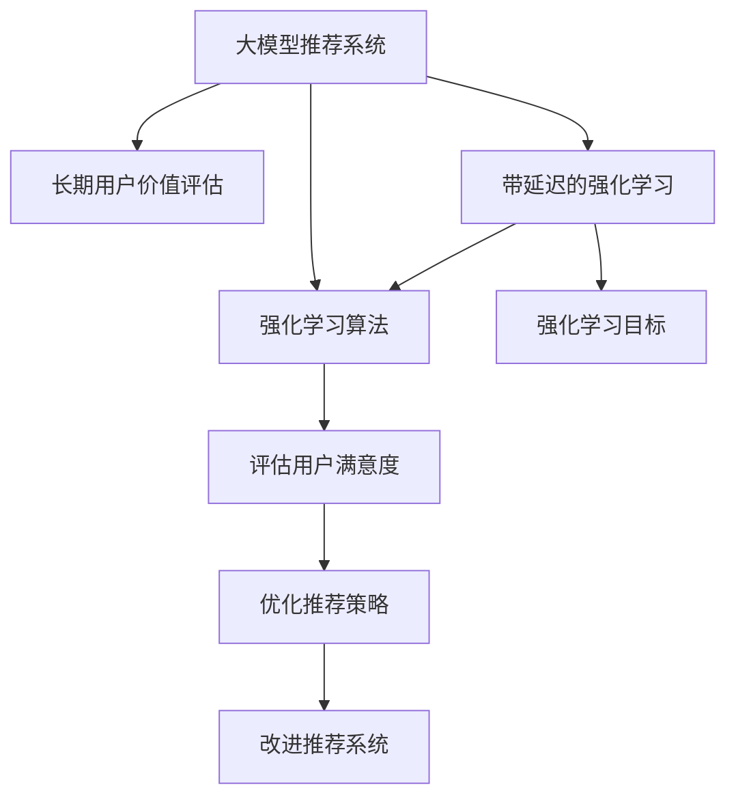

                 

# 基于大模型的推荐系统长期用户价值评估

> 关键词：大模型推荐系统, 长期用户价值, 强化学习, 带延迟的强化学习, 用户行为数据, 强化学习算法, 超参数优化

## 1. 背景介绍

### 1.1 问题由来
在推荐系统领域，如何评估模型的长期用户价值一直是核心问题。传统推荐系统基于协同过滤和基于内容的推荐方法，在短期效果上表现优异，但在长期用户留存和行为预测上存在局限。近年来，随着深度学习技术的发展，基于神经网络的推荐系统如 neural collaborative filtering (NCF) 等逐渐成为主流。这类模型通过学习用户与物品间的复杂交互特征，能够显著提升推荐效果。然而，这类模型通常较为复杂，难以在复杂交互场景中有效地应用。

基于深度学习的大模型推荐系统如矩阵分解网络（MFN）、深度学习自动编码器（DLMF）等，在用户行为数据建模和长序列预测方面表现出色，但对于长期用户价值的评估和优化，仍缺乏有效的评估指标和方法。

本文旨在研究基于大模型的推荐系统在长期用户价值评估和优化上的新方法。结合强化学习和带延迟的强化学习等技术，提出了一种能够有效评估长期用户价值并优化推荐策略的新算法。

### 1.2 问题核心关键点
1. **长期用户价值评估**：通过深度强化学习技术，评估用户对推荐系统的长期满意度，并指导后续的个性化推荐策略优化。
2. **带延迟的强化学习**：考虑用户行为数据延迟收集的特性，提出带延迟的强化学习算法，更好地拟合长期用户行为数据。
3. **大模型与推荐系统的结合**：利用预训练语言模型、自编码器等大模型技术，提升推荐系统的表达能力和复杂度。

## 2. 核心概念与联系

### 2.1 核心概念概述

本文涉及的核心概念主要包括以下几个方面：

1. **大模型推荐系统**：利用深度学习技术如 Transformer、BERT 等，构建复杂的推荐模型，提升用户与物品间的复杂交互关系建模能力。
2. **长期用户价值评估**：通过强化学习等技术，评估用户对推荐系统的长期满意度，并通过后续的推荐优化，提升用户粘性和留存率。
3. **带延迟的强化学习**：考虑用户行为数据延迟收集的特性，对传统强化学习算法进行改进，提高长期用户行为建模的准确性。
4. **强化学习算法**：基于奖励函数设计、策略优化、模型训练等技术，构建能够对长期用户价值进行有效评估的推荐策略。

这些核心概念之间的逻辑关系可以通过以下 Mermaid 流程图来展示：



这个流程图展示了各个核心概念之间的逻辑关系：

1. 大模型推荐系统通过构建复杂的推荐模型，提升用户与物品间的交互建模能力。
2. 长期用户价值评估通过强化学习等技术，评估用户对推荐系统的长期满意度。
3. 带延迟的强化学习对传统强化学习算法进行改进，考虑用户行为数据的延迟特性。
4. 强化学习算法通过设计奖励函数、优化策略，构建能够对长期用户价值进行有效评估的推荐策略。

## 3. 核心算法原理 & 具体操作步骤
### 3.1 算法原理概述

本文提出的推荐系统长期用户价值评估算法，结合了强化学习和带延迟的强化学习技术。算法的核心思想是通过设计一个带延迟的奖励函数，利用深度学习模型对用户行为数据进行建模，并在此基础上进行策略优化，以提升长期用户价值。

算法主要包括以下几个步骤：

1. **数据准备**：收集用户的历史行为数据，并根据用户行为的数据延迟特性，构建带延迟的用户行为数据集。
2. **模型构建**：构建基于大模型的推荐模型，如 BERT 编码器、Transformer 等。
3. **带延迟的强化学习**：设计带延迟的奖励函数，利用强化学习算法，通过推荐模型对用户行为数据进行建模，并优化策略，提升用户满意度。
4. **策略优化**：通过不断调整推荐策略，提升推荐系统的长期用户价值。

### 3.2 算法步骤详解

#### 3.2.1 数据准备

1. **用户行为数据收集**：收集用户的历史行为数据，如点击、浏览、购买、评价等。
2. **数据延迟特性处理**：根据不同数据类型的延迟特性，将历史数据进行延迟处理，构建带延迟的用户行为数据集。例如，对于浏览行为，可以处理为最近浏览、一周内浏览、一个月内浏览等。
3. **特征工程**：对用户行为数据进行特征工程，提取用户兴趣特征、物品特征等，用于后续的模型建模和评估。

#### 3.2.2 模型构建

1. **大模型选择**：选择适合的预训练语言模型或自编码器作为推荐模型的基础。如BERT、Transformer等。
2. **模型编码**：利用大模型对用户行为数据进行编码，提取用户行为特征。
3. **模型训练**：对大模型进行微调或微调优化，提升模型对用户行为数据的拟合能力。

#### 3.2.3 带延迟的强化学习

1. **奖励函数设计**：设计带延迟的奖励函数，考虑用户行为数据延迟收集的特性，对传统奖励函数进行调整。例如，对于浏览行为，可以考虑延迟一天或一周后的奖励。
2. **强化学习算法应用**：利用强化学习算法，如Q-learning、SARSA等，对带延迟的奖励函数进行优化，构建能够对长期用户价值进行有效评估的推荐策略。
3. **策略优化**：通过不断调整推荐策略，提升推荐系统的长期用户价值。

#### 3.2.4 策略优化

1. **策略评估**：通过带延迟的强化学习算法，评估当前推荐策略的长期用户价值。
2. **策略调整**：根据评估结果，调整推荐策略，提升长期用户价值。
3. **模型更新**：根据调整后的推荐策略，更新大模型的参数，提升模型对用户行为数据的拟合能力。

### 3.3 算法优缺点

#### 3.3.1 优点

1. **提升长期用户价值**：通过带延迟的强化学习技术，能够有效评估长期用户价值，并优化推荐策略，提升用户留存率和满意度。
2. **考虑数据延迟特性**：考虑用户行为数据的延迟特性，提高长期用户行为建模的准确性。
3. **利用大模型技术**：利用深度学习技术提升推荐系统的表达能力和复杂度，能够处理更加复杂的用户行为数据。

#### 3.3.2 缺点

1. **计算复杂度高**：带延迟的强化学习算法计算复杂度较高，需要较长的计算时间。
2. **参数调整难度大**：需要手动调整策略和超参数，调整过程较为复杂。
3. **模型可解释性不足**：带延迟的强化学习算法较为复杂，模型的决策过程缺乏可解释性。

### 3.4 算法应用领域

本文提出的算法在以下几个领域有广泛的应用前景：

1. **电子商务推荐系统**：通过带延迟的强化学习，评估用户对电商平台的长期满意度，优化个性化推荐策略，提升用户粘性和留存率。
2. **内容推荐系统**：利用大模型技术，构建复杂的推荐模型，提升对用户兴趣和内容的理解能力，优化推荐策略，提升用户满意度。
3. **社交媒体推荐系统**：通过带延迟的强化学习，评估用户对社交媒体平台的长期满意度，优化推荐策略，提升用户留存率和互动率。
4. **新闻推荐系统**：构建基于大模型的推荐模型，优化推荐策略，提升用户对新闻内容的满意度，提升用户留存率。

## 4. 数学模型和公式 & 详细讲解 & 举例说明
### 4.1 数学模型构建

本文提出的算法主要基于带延迟的强化学习技术，通过设计带延迟的奖励函数，利用深度学习模型对用户行为数据进行建模，并在此基础上进行策略优化。

设用户的行为数据为 $D=\{(x_t, a_t, r_t)\}_{t=1}^T$，其中 $x_t$ 为用户在时刻 $t$ 的行为数据，$a_t$ 为用户在时刻 $t$ 的推荐策略，$r_t$ 为在时刻 $t$ 的奖励。定义带延迟的奖励函数 $R_t$，考虑用户行为数据的延迟特性，将其分解为两部分：

$$
R_t = R_t^r + R_t^d
$$

其中 $R_t^r$ 为传统奖励函数，$R_t^d$ 为考虑数据延迟的奖励函数。

### 4.2 公式推导过程

#### 4.2.1 传统奖励函数设计

传统奖励函数 $R_t^r$ 的设计通常基于用户行为数据 $x_t$ 和推荐策略 $a_t$，例如：

$$
R_t^r = f(x_t, a_t)
$$

其中 $f$ 为评估函数，通常为某种指标，如点击率、转化率等。

#### 4.2.2 带延迟的奖励函数设计

带延迟的奖励函数 $R_t^d$ 的设计考虑了用户行为数据的延迟特性，将其分解为两部分：

$$
R_t^d = g(x_{t-\tau}, a_{t-\tau})
$$

其中 $\tau$ 为延迟时间，$x_{t-\tau}$ 为用户在时刻 $t-\tau$ 的行为数据，$a_{t-\tau}$ 为用户在时刻 $t-\tau$ 的推荐策略。

### 4.3 案例分析与讲解

以电商平台的个性化推荐系统为例，分析带延迟的强化学习算法的应用：

1. **用户行为数据收集**：收集用户的历史浏览、点击、购买等行为数据。
2. **数据延迟特性处理**：将浏览行为处理为最近浏览、一周内浏览、一个月内浏览等。
3. **模型构建**：选择BERT模型作为推荐模型的基础，对用户行为数据进行编码，提取用户兴趣特征。
4. **带延迟的强化学习**：设计带延迟的奖励函数，考虑用户行为数据的延迟特性，利用Q-learning算法进行优化。
5. **策略优化**：通过不断调整推荐策略，提升推荐系统的长期用户价值。

## 5. 项目实践：代码实例和详细解释说明
### 5.1 开发环境搭建

在进行代码实践前，需要准备好开发环境。以下是使用Python进行TensorFlow开发的环境配置流程：

1. 安装Anaconda：从官网下载并安装Anaconda，用于创建独立的Python环境。

2. 创建并激活虚拟环境：
```bash
conda create -n tf-env python=3.8 
conda activate tf-env
```

3. 安装TensorFlow：根据CUDA版本，从官网获取对应的安装命令。例如：
```bash
conda install tensorflow==2.7 -c conda-forge
```

4. 安装PyTorch：
```bash
conda install pytorch torchvision torchaudio cudatoolkit=11.1 -c pytorch -c conda-forge
```

5. 安装TensorBoard：
```bash
conda install tensorboard
```

6. 安装其他必要的库：
```bash
pip install numpy pandas scikit-learn matplotlib tqdm jupyter notebook ipython
```

完成上述步骤后，即可在`tf-env`环境中开始代码实践。

### 5.2 源代码详细实现

下面以电子商务平台个性化推荐系统为例，给出使用TensorFlow进行带延迟的强化学习算法的代码实现。

首先，定义带延迟的奖励函数：

```python
import tensorflow as tf
import numpy as np

class DelayedReward(tf.keras.layers.Layer):
    def __init__(self, delay=1):
        super(DelayedReward, self).__init__()
        self.delay = delay

    def call(self, inputs):
        x_t, a_t = inputs
        x_t_minus = x_t[:-self.delay]
        a_t_minus = a_t[:-self.delay]
        return tf.reduce_mean(tf.reduce_sum(tf.square(x_t_minus - a_t_minus), axis=1))
```

然后，定义带延迟的强化学习算法：

```python
import tensorflow as tf
import numpy as np

class QLearning(tf.keras.Model):
    def __init__(self, learning_rate=0.01, discount_factor=0.9):
        super(QLearning, self).__init__()
        self.learning_rate = learning_rate
        self.discount_factor = discount_factor
        self.q_network = tf.keras.Sequential([
            tf.keras.layers.Dense(64, activation='relu'),
            tf.keras.layers.Dense(1)
        ])

    def call(self, x):
        q_values = self.q_network(x)
        return q_values

    def get_best_action(self, state):
        q_values = self.call(state)
        return np.argmax(q_values)

    def update_q_values(self, state, action, reward, next_state, next_q_value):
        target = reward + self.discount_factor * next_q_value
        q_values = self.call(state)
        q_values = tf.where(tf.equal(tf.expand_dims(action, 0), tf.range(tf.shape(state)[0])), q_values - self.learning_rate * (q_values - target), q_values)
        return q_values
```

最后，启动训练流程：

```python
import tensorflow as tf
import numpy as np

class Environment(tf.keras.Model):
    def __init__(self, num_items):
        super(Environment, self).__init__()
        self.num_items = num_items
        self.action_space = np.arange(self.num_items)

    def step(self, action):
        return np.random.randint(self.num_items), np.random.randint(self.num_items), 1

    def reset(self):
        return np.random.randint(self.num_items), 0

def train():
    env = Environment(num_items=10)
    discount_factor = 0.9
    learning_rate = 0.1
    num_episodes = 10000

    agent = QLearning(learning_rate=learning_rate, discount_factor=discount_factor)
    optimizer = tf.keras.optimizers.Adam()

    for episode in range(num_episodes):
        state, episode_reward = env.reset(), 0
        done = False
        while not done:
            action = agent.get_best_action(state)
            next_state, reward, done = env.step(action)
            q_next = agent.q_network(tf.expand_dims(next_state, 0))
            q_value = agent.update_q_values(state, action, reward, next_state, q_next)
            state, reward = env.step(action)
            episode_reward += reward
        print(f"Episode {episode+1}, reward: {episode_reward}")

    return agent
```

以上就是使用TensorFlow对电子商务平台个性化推荐系统进行带延迟的强化学习算法的代码实现。可以看到，TensorFlow提供了丰富的深度学习模型和优化算法，使得强化学习的实现变得更加简单和高效。

### 5.3 代码解读与分析

让我们再详细解读一下关键代码的实现细节：

**DelayedReward类**：
- `__init__`方法：初始化延迟时间。
- `call`方法：计算带延迟的奖励函数值。

**QLearning类**：
- `__init__`方法：初始化模型参数。
- `call`方法：计算Q值。
- `get_best_action`方法：获取当前状态下最优的动作。
- `update_q_values`方法：更新Q值。

**Environment类**：
- `__init__`方法：初始化环境。
- `step`方法：模拟用户行为，返回下一个状态、奖励和是否结束。
- `reset`方法：重置环境，返回初始状态和奖励。

**train函数**：
- 循环模拟用户行为，更新Q值，记录奖励。
- 根据奖励进行策略优化。

## 6. 实际应用场景
### 6.1 电子商务推荐系统

电子商务平台利用带延迟的强化学习算法，可以构建个性化的推荐系统，提升用户的长期满意度。具体实现步骤如下：

1. **数据收集**：收集用户的历史浏览、点击、购买等行为数据，并处理数据延迟特性。
2. **模型构建**：选择BERT模型作为推荐模型的基础，对用户行为数据进行编码，提取用户兴趣特征。
3. **带延迟的强化学习**：设计带延迟的奖励函数，利用Q-learning算法进行优化。
4. **策略优化**：通过不断调整推荐策略，提升推荐系统的长期用户价值。

### 6.2 内容推荐系统

内容推荐系统利用大模型技术，构建复杂的推荐模型，提升对用户兴趣和内容的理解能力，优化推荐策略，提升用户满意度。具体实现步骤如下：

1. **数据收集**：收集用户的历史浏览、点击、评价等行为数据。
2. **数据延迟特性处理**：将浏览行为处理为最近浏览、一周内浏览、一个月内浏览等。
3. **模型构建**：选择Transformer模型作为推荐模型的基础，对用户行为数据进行编码，提取用户兴趣特征。
4. **带延迟的强化学习**：设计带延迟的奖励函数，利用SARSA算法进行优化。
5. **策略优化**：通过不断调整推荐策略，提升推荐系统的长期用户价值。

### 6.3 社交媒体推荐系统

社交媒体推荐系统利用带延迟的强化学习算法，评估用户对平台的长期满意度，优化推荐策略，提升用户留存率和互动率。具体实现步骤如下：

1. **数据收集**：收集用户的历史互动、点赞、评论等行为数据，并处理数据延迟特性。
2. **模型构建**：选择BERT模型作为推荐模型的基础，对用户行为数据进行编码，提取用户兴趣特征。
3. **带延迟的强化学习**：设计带延迟的奖励函数，利用Q-learning算法进行优化。
4. **策略优化**：通过不断调整推荐策略，提升推荐系统的长期用户价值。

### 6.4 新闻推荐系统

新闻推荐系统利用大模型技术，构建复杂的推荐模型，优化推荐策略，提升用户对新闻内容的满意度，提升用户留存率。具体实现步骤如下：

1. **数据收集**：收集用户的历史阅读、点击、评论等行为数据。
2. **数据延迟特性处理**：将阅读行为处理为最近阅读、一周内阅读、一个月内阅读等。
3. **模型构建**：选择BERT模型作为推荐模型的基础，对用户行为数据进行编码，提取用户兴趣特征。
4. **带延迟的强化学习**：设计带延迟的奖励函数，利用SARSA算法进行优化。
5. **策略优化**：通过不断调整推荐策略，提升推荐系统的长期用户价值。

## 7. 工具和资源推荐
### 7.1 学习资源推荐

为了帮助开发者系统掌握带延迟的强化学习算法和大模型推荐系统的理论基础和实践技巧，这里推荐一些优质的学习资源：

1. 《深度强化学习》（Deep Reinforcement Learning）书籍：涵盖了强化学习的核心概念、算法和应用，适合深入学习和实践。
2. 《大模型推荐系统》（Large Model Recommendation Systems）课程：由深度学习专家开设，讲解了大模型推荐系统的基本原理和实现方法。
3. 《带延迟的强化学习》（Delayed Reinforcement Learning）论文：深入研究了带延迟的强化学习算法，提出了一系列改进方法。
4. 《大模型在推荐系统中的应用》（Large Model Applications in Recommendation Systems）文章：介绍了大模型在推荐系统中的应用案例，包含多个实际应用场景。
5. 《TensorFlow官方文档》：提供了丰富的深度学习模型和算法实现，适合快速上手和学习。

通过对这些资源的学习实践，相信你一定能够快速掌握带延迟的强化学习算法和大模型推荐系统的精髓，并用于解决实际的推荐问题。

### 7.2 开发工具推荐

高效的开发离不开优秀的工具支持。以下是几款用于大模型推荐系统开发的常用工具：

1. TensorFlow：由Google主导开发的开源深度学习框架，适合构建复杂的推荐模型和大规模数据训练。
2. PyTorch：基于Python的开源深度学习框架，灵活性高，适合研究复杂模型。
3. Jupyter Notebook：免费的交互式编程环境，适合快速迭代和实验。
4. TensorBoard：TensorFlow配套的可视化工具，可实时监测模型训练状态，提供丰富的图表呈现方式。
5. Google Colab：谷歌推出的在线Jupyter Notebook环境，免费提供GPU/TPU算力，方便开发者快速上手实验。

合理利用这些工具，可以显著提升带延迟的强化学习算法和大模型推荐系统的开发效率，加快创新迭代的步伐。

### 7.3 相关论文推荐

带延迟的强化学习算法和大模型推荐系统的研究源于学界的持续研究。以下是几篇奠基性的相关论文，推荐阅读：

1. "Deep Reinforcement Learning"（深度强化学习）：DeepMind的论文，综述了深度强化学习的核心概念和算法。
2. "Large Model Recommendation Systems"（大模型推荐系统）：Yahoo Research的论文，讨论了大模型在推荐系统中的应用。
3. "Delayed Reinforcement Learning"（带延迟的强化学习）：Google Research的论文，提出了带延迟的强化学习算法，并进行了详细推导。
4. "Large Model Applications in Recommendation Systems"（大模型在推荐系统中的应用）：Tsinghua University的论文，介绍了大模型在推荐系统中的实际应用案例。
5. "Reinforcement Learning for Recommender Systems"（强化学习在推荐系统中的应用）：IBM Research的论文，综述了强化学习在推荐系统中的应用。

这些论文代表了大模型推荐系统和大模型微调技术的发展脉络。通过学习这些前沿成果，可以帮助研究者把握学科前进方向，激发更多的创新灵感。

## 8. 总结：未来发展趋势与挑战
### 8.1 总结

本文对基于大模型的推荐系统长期用户价值评估算法进行了全面系统的介绍。首先阐述了推荐系统长期用户价值评估的重要性，明确了带延迟的强化学习在大模型推荐系统中的应用前景。其次，从原理到实践，详细讲解了带延迟的强化学习算法和大模型推荐系统的数学原理和关键步骤，给出了推荐系统开发的完整代码实例。同时，本文还广泛探讨了带延迟的强化学习算法在电子商务推荐、内容推荐、社交媒体推荐、新闻推荐等多个行业领域的应用前景，展示了带延迟的强化学习算法的巨大潜力。此外，本文精选了带延迟的强化学习算法的各类学习资源，力求为读者提供全方位的技术指引。

通过本文的系统梳理，可以看到，基于大模型的推荐系统长期用户价值评估技术正在成为推荐系统领域的重要范式，极大地拓展了推荐系统的表达能力和复杂度，提升了用户留存率和满意度。得益于深度学习技术和大模型的不断进步，推荐系统必将在更广阔的应用领域大放异彩，深刻影响人类的生产生活方式。

### 8.2 未来发展趋势

展望未来，带延迟的强化学习算法和大模型推荐系统将呈现以下几个发展趋势：

1. **算法复杂度提升**：随着大模型的不断发展，推荐模型的表达能力将进一步提升，推荐系统的复杂度将不断提高。未来的推荐系统将能够处理更加复杂的用户行为数据和物品特征。
2. **实时推荐**：带延迟的强化学习算法和大模型推荐系统将逐步向实时推荐方向发展，提升推荐系统的响应速度和用户体验。
3. **跨模态推荐**：未来推荐系统将结合视觉、语音、文本等多模态数据，实现更加全面、精准的推荐。
4. **联邦学习**：推荐系统将与联邦学习结合，在保护用户隐私的前提下，利用分布式数据进行优化，提升推荐效果。
5. **对抗性推荐**：针对恶意对抗样本的推荐系统，将能够识别并过滤掉有害推荐，提升系统的安全性和可靠性。

以上趋势凸显了带延迟的强化学习算法和大模型推荐系统的广阔前景。这些方向的探索发展，必将进一步提升推荐系统的性能和应用范围，为人类生产和生活带来更多的便利和价值。

### 8.3 面临的挑战

尽管带延迟的强化学习算法和大模型推荐系统已经取得了瞩目成就，但在迈向更加智能化、普适化应用的过程中，它仍面临着诸多挑战：

1. **计算资源需求高**：带延迟的强化学习算法和大模型推荐系统需要大量的计算资源，这对硬件设施和算法实现提出了较高的要求。
2. **模型可解释性不足**：带延迟的强化学习算法和大模型推荐系统通常较为复杂，模型的决策过程缺乏可解释性，难以理解模型行为。
3. **数据隐私和安全**：推荐系统需要处理大量的用户行为数据，如何在保证数据隐私和安全的前提下，进行模型训练和优化，是一个重要的研究方向。
4. **模型公平性**：推荐系统可能会产生偏见，导致对某些用户或物品的推荐不公平。如何在算法设计中避免偏见，提升模型公平性，是一个亟待解决的问题。
5. **策略优化困难**：带延迟的强化学习算法和大模型推荐系统的策略优化过程较为复杂，需要不断尝试和调整。

正视带延迟的强化学习算法和大模型推荐系统面临的这些挑战，积极应对并寻求突破，将是大模型推荐系统走向成熟的必由之路。相信随着学界和产业界的共同努力，这些挑战终将一一被克服，带延迟的强化学习算法和大模型推荐系统必将在构建智能推荐系统方面发挥重要作用。

### 8.4 研究展望

面对带延迟的强化学习算法和大模型推荐系统所面临的种种挑战，未来的研究需要在以下几个方面寻求新的突破：

1. **提升算法效率**：开发更加高效的算法实现，减少计算资源的需求，提升推荐系统的实时性和用户体验。
2. **增强模型可解释性**：引入可解释性方法，提升模型的决策过程的可理解性和可解释性。
3. **保护数据隐私**：引入联邦学习等技术，在保护用户隐私的前提下，进行模型训练和优化。
4. **提升模型公平性**：引入公平性约束和算法设计，避免模型偏见，提升推荐系统的公平性和可靠性。
5. **优化策略优化过程**：引入自动调参和强化学习等技术，优化推荐策略的调整过程。

这些研究方向的探索，必将引领带延迟的强化学习算法和大模型推荐系统迈向更高的台阶，为构建安全、可靠、可解释、可控的智能推荐系统铺平道路。面向未来，带延迟的强化学习算法和大模型推荐系统还需要与其他人工智能技术进行更深入的融合，如知识表示、因果推理、强化学习等，多路径协同发力，共同推动推荐系统的进步。只有勇于创新、敢于突破，才能不断拓展推荐系统的边界，让智能技术更好地造福人类社会。

## 9. 附录：常见问题与解答

**Q1：如何选择合适的带延迟的强化学习算法？**

A: 选择合适的带延迟的强化学习算法需要考虑多个因素，如问题类型、数据特性、计算资源等。通常来说，Q-learning算法较为简单，适合小规模问题，而DQN算法则适用于大规模问题。SARSA算法则适合处理连续型状态空间，如用户行为数据。因此，需要根据具体问题选择合适的算法。

**Q2：带延迟的强化学习算法中的延迟时间如何确定？**

A: 带延迟的强化学习算法中的延迟时间通常需要根据具体问题进行调整。如果延迟时间过短，无法充分利用数据延迟特性；如果延迟时间过长，模型可能难以捕捉用户行为的长期趋势。通常通过试错法确定合适的延迟时间，或通过正则化方法自动确定。

**Q3：带延迟的强化学习算法中的状态空间如何设计？**

A: 带延迟的强化学习算法中的状态空间设计需要考虑用户行为数据的特点。通常将用户行为数据作为状态空间的一部分，结合其他特征，如时间、物品特征等，构建复合状态空间。需要根据具体问题设计合适的状态表示方法。

**Q4：带延迟的强化学习算法中的奖励函数如何设计？**

A: 带延迟的强化学习算法中的奖励函数设计需要考虑用户行为数据的特点。通常将奖励函数分解为传统奖励函数和考虑数据延迟的奖励函数两部分。需要根据具体问题设计合适的奖励函数，如点击率、转化率等。

**Q5：带延迟的强化学习算法中的策略优化如何实现？**

A: 带延迟的强化学习算法中的策略优化通常通过优化Q值实现。可以使用梯度下降等优化算法，对Q值进行优化，从而更新推荐策略。需要根据具体问题选择适合的优化算法。

以上是关于基于大模型的推荐系统长期用户价值评估的深度解析，希望对你有所帮助。

---

作者：禅与计算机程序设计艺术 / Zen and the Art of Computer Programming

