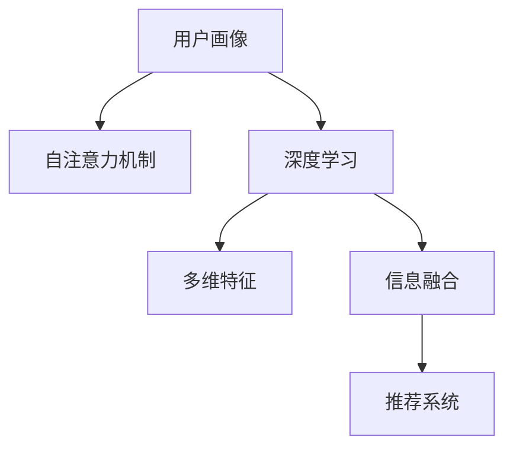

                 

# 基于自注意力机制的多维用户画像构建

> 关键词：用户画像, 自注意力机制, 深度学习, 多维特征, 信息融合

## 1. 背景介绍

### 1.1 问题由来
随着互联网技术的迅速发展，用户生成数据的数量和种类急剧增加。这些数据包括用户的浏览记录、购买历史、社交互动、评论反馈等。这些数据蕴藏着丰富的用户行为和偏好信息，是企业挖掘用户价值的重要资源。然而，由于数据维度的繁多和属性间关联的复杂性，传统用户画像构建方法面临挑战。

### 1.2 问题核心关键点
用户画像构建的核心在于如何从多维度数据中综合提炼用户特征，形成稳定、连贯的用户画像。在过去的研究中，常见的方法包括：
- 特征工程：通过手工设计特征，尝试捕捉用户行为和偏好的规律。
- 协同过滤：基于用户和物品之间的相似性，推荐用户可能感兴趣的物品。
- 聚类分析：通过算法将相似用户分为一组，形成用户群体。

这些方法在一定程度上解决了用户画像的构建问题，但依然存在以下局限性：
- 依赖领域知识：特征工程需要高度依赖领域知识，费时费力。
- 处理高维数据困难：协同过滤和聚类方法难以直接处理高维稀疏数据。
- 缺乏可解释性：聚类和协同过滤算法通常输出黑盒结果，缺乏对用户特征的直接解释。

### 1.3 问题研究意义
构建高质量的用户画像对于提升用户体验、优化个性化推荐、提高商业转化率具有重要意义。通过用户画像，企业可以更好地理解用户需求和行为，实现更精准、高效的个性化服务，进而提升市场竞争力。

## 2. 核心概念与联系

### 2.1 核心概念概述

本节将介绍几个密切相关的核心概念：

- **用户画像(User Profile)**：通过多维度数据综合提炼用户特征，形成可解释的用户画像。用户画像可以用于个性化推荐、用户分群、行为预测等多种业务场景。

- **自注意力机制(Self-Attention)**：一种能够对输入序列中不同位置信息进行综合权重分配的机制。自注意力机制广泛应用于深度学习模型中，提升模型对输入序列的语义理解能力。

- **深度学习(Deep Learning)**：一种基于神经网络的机器学习方法，能够通过多层非线性变换学习复杂的输入-输出映射。深度学习在图像、语音、自然语言处理等领域取得了广泛应用。

- **多维特征(Multi-dimensional Features)**：用户数据的非结构化特性，如文本、图像、时间序列等。多维特征的融合可以提升用户画像的丰富性和深度。

- **信息融合(Information Fusion)**：将不同来源、不同形式的信息进行综合、整合，以获得更准确、全面的用户画像。

- **推荐系统(Recommendation System)**：根据用户画像推荐用户可能感兴趣的内容或物品的系统。推荐系统通过用户画像获取用户兴趣，实现个性化推荐。

这些概念之间的逻辑关系可以通过以下Mermaid流程图来展示：



这个流程图展示了大语言模型的核心概念及其之间的关系：

1. 用户画像构建的基础是深度学习模型。
2. 深度学习模型通过多维特征进行建模。
3. 多维特征的融合使用自注意力机制。
4. 融合后的信息用于推荐系统。

这些概念共同构成了用户画像构建的框架，使得企业能够高效、全面地理解用户行为和需求。

## 3. 核心算法原理 & 具体操作步骤

### 3.1 算法原理概述

用户画像构建的核心算法是深度学习模型，特别是Transformer模型。Transformer模型通过自注意力机制对输入序列中的不同位置信息进行综合权重分配，使得模型能够捕捉长距离依赖关系，提升对序列的语义理解能力。

基于深度学习的用户画像构建过程大致分为以下几步：

1. 数据预处理：将用户多维度数据进行清洗、归一化，转化为模型能够接受的格式。
2. 特征编码：使用深度学习模型对多维特征进行编码，将数据转化为模型能够学习的表示形式。
3. 自注意力融合：通过自注意力机制对不同特征之间的信息进行融合，形成更加全面的用户表示。
4. 后处理：根据业务需求，对用户表示进行后处理，如降维、归一化等，得到最终的用户画像。

### 3.2 算法步骤详解

#### 3.2.1 数据预处理
数据预处理是用户画像构建的基础。以下是一些常见的数据预处理技术：

1. 数据清洗：去除噪声、缺失值、重复数据等。
2. 归一化：将不同维度的数据进行归一化，使其在同一尺度上。
3. 特征选择：选择与用户画像构建目标相关性较高的特征。
4. 数据编码：将文本、图像等非结构化数据进行编码，转化为数值型数据。

#### 3.2.2 特征编码
特征编码的目的是将多维数据转化为模型能够学习的表示形式。以下是常见的特征编码方法：

1. 文本特征编码：将文本数据转化为词嵌入或字符嵌入，使用Embedding Layer进行编码。
2. 图像特征编码：使用CNN或ResNet等卷积神经网络对图像特征进行编码。
3. 时间序列特征编码：使用RNN或LSTM等循环神经网络对时间序列数据进行编码。

#### 3.2.3 自注意力融合
自注意力机制是用户画像构建的核心算法。通过自注意力机制，模型可以捕捉输入序列中不同位置之间的依赖关系，从而更好地理解数据的语义。

1. 将多维特征输入Transformer模型。
2. 使用Transformer模型对特征进行编码，生成多个特征表示。
3. 通过Attention Layer对不同特征表示进行权重分配，形成综合表示。
4. 将综合表示输出作为用户画像的最终表示。

#### 3.2.4 后处理
后处理的目的是根据业务需求，对用户表示进行降维、归一化等操作，得到最终的用户画像。

1. PCA降维：对高维用户表示进行降维，减少计算成本。
2. L2归一化：对用户表示进行L2归一化，使其满足L2范数。
3. 标准化：对用户表示进行标准化，使其满足均值为0、方差为1的分布。

### 3.3 算法优缺点

基于自注意力机制的多维用户画像构建方法具有以下优点：
1. 自动特征提取：通过自注意力机制，模型能够自动学习多维特征之间的关系，无需人工设计特征。
2. 高效信息融合：自注意力机制可以高效地将不同特征进行综合，形成全面的用户表示。
3. 泛化能力强：Transformer模型在大规模语料上进行预训练，具有较强的泛化能力，能够适应不同业务场景。

同时，该方法也存在以下局限性：
1. 计算复杂度高：自注意力机制的计算复杂度较高，需要较大的算力和内存。
2. 参数量庞大：Transformer模型参数量庞大，需要较大的存储空间和计算资源。
3. 难以解释：自注意力机制通常是一个黑盒模型，难以解释模型内部如何对信息进行融合。
4. 缺乏监管：用户画像的构建过程中，缺乏有效的监管机制，可能导致数据泄露、隐私侵害等问题。

尽管存在这些局限性，但自注意力机制在用户画像构建中已经展现出了巨大的潜力，成为主流方法之一。

### 3.4 算法应用领域

基于自注意力机制的多维用户画像构建方法，在以下领域得到了广泛应用：

1. 个性化推荐：通过用户画像，推荐系统能够提供更精准、个性化的物品推荐，提升用户体验和商业转化率。
2. 广告投放：通过用户画像，广告系统能够精准定位目标用户，实现高效广告投放，提高广告效果。
3. 用户行为分析：通过用户画像，企业能够深入分析用户行为，优化产品设计和运营策略，提升市场竞争力。
4. 信用评分：通过用户画像，信用评估系统能够更准确地评估用户信用等级，减少欺诈风险。
5. 内容推荐：通过用户画像，内容推荐系统能够提供更符合用户兴趣的个性化内容，提升内容平台的用户粘性。

这些应用场景展示了多维用户画像在现实世界中的广泛价值，也证明了自注意力机制在用户画像构建中的重要性。

## 4. 数学模型和公式 & 详细讲解 & 举例说明

### 4.1 数学模型构建

基于自注意力机制的多维用户画像构建模型可以表示为：

$$
\text{User Profile} = f( \{ \text{Feature}_{i} \}_{i=1}^N )
$$

其中 $\text{Feature}_{i}$ 表示第 $i$ 个特征向量，$N$ 表示特征向量的个数。

### 4.2 公式推导过程

我们以一个简单的文本特征编码和自注意力融合为例，进行公式推导：

设文本数据 $X$ 由多个单词 $x_1, x_2, ..., x_n$ 组成，每个单词嵌入为 $e_1, e_2, ..., e_n$，则输入序列 $x$ 可以表示为：

$$
x = [e_1, e_2, ..., e_n]
$$

将输入序列 $x$ 输入到Transformer模型中，得到特征表示 $h_1, h_2, ..., h_n$。

Transformer模型的编码过程可以分为两个步骤：

1. 多头注意力机制：对输入序列 $x$ 中的不同位置信息进行权重分配，得到注意力权重 $\alpha_{i,j}$：

$$
\alpha_{i,j} = \frac{e_i^\top Q_j K_j^\top}{\sqrt{d_k} e_i^\top Q_j K_j^\top}
$$

其中 $Q$ 和 $K$ 是投影矩阵，$d_k$ 是投影向量维度。

2. 前向传播：根据注意力权重，计算每个单词的加权和表示 $h_j$：

$$
h_j = \sum_{i=1}^n \alpha_{i,j} e_i
$$

最终得到用户表示 $h$：

$$
h = [h_1, h_2, ..., h_n]
$$

### 4.3 案例分析与讲解

下面以一个简单的商品推荐系统为例，展示用户画像构建的实际应用：

假设某电商平台有用户数据 $X=\{(x_1,y_1), (x_2,y_2), ..., (x_m,y_m)\}$，其中 $x_i$ 表示用户浏览记录，$y_i$ 表示用户是否购买该商品。将用户浏览记录 $x_i$ 转化为单词嵌入序列，输入到Transformer模型中进行编码，得到用户表示 $h$。

根据用户表示 $h$，可以使用softmax函数计算用户对每个商品的兴趣评分 $s_i$：

$$
s_i = \text{softmax}(h W^T)
$$

其中 $W$ 是商品的嵌入矩阵，$T$ 表示转置操作。最终根据评分 $s_i$ 推荐用户可能感兴趣的商品。

## 5. 项目实践：代码实例和详细解释说明

### 5.1 开发环境搭建

在进行用户画像构建实践前，我们需要准备好开发环境。以下是使用Python进行TensorFlow开发的环境配置流程：

1. 安装Anaconda：从官网下载并安装Anaconda，用于创建独立的Python环境。

2. 创建并激活虚拟环境：
```bash
conda create -n tf-env python=3.8 
conda activate tf-env
```

3. 安装TensorFlow：根据CUDA版本，从官网获取对应的安装命令。例如：
```bash
conda install tensorflow -c tf -c conda-forge
```

4. 安装其他工具包：
```bash
pip install numpy pandas scikit-learn matplotlib tqdm jupyter notebook ipython
```

完成上述步骤后，即可在`tf-env`环境中开始用户画像构建实践。

### 5.2 源代码详细实现

下面我们以文本特征编码和自注意力融合为例，给出使用TensorFlow实现用户画像构建的代码实现。

首先，定义Transformer模型的编码过程：

```python
import tensorflow as tf
from tensorflow.keras.layers import Input, Dense, Embedding, MultiHeadAttention, Concatenate, Dropout

def transformer_encode(X, num_heads, d_k, d_v, d_h):
    # 输入层
    x = Input(shape=(None, ), dtype='int32')
    # 嵌入层
    embedding = Embedding(input_dim=vocab_size, output_dim=d_h, mask_zero=True)(x)
    # 多头注意力机制
    attention = MultiHeadAttention(num_heads=num_heads, key_dim=d_k, query_dim=d_v, value_dim=d_v)(embedding, embedding)
    # 前向传播
    x = Concatenate()([embedding, attention])
    # 全连接层
    x = Dense(d_h, activation='relu')(x)
    # 输出层
    x = Dense(1, activation='sigmoid')(x)
    return x
```

然后，使用用户数据进行模型训练：

```python
# 定义用户数据
X_train = ...
y_train = ...

# 定义Transformer模型
model = tf.keras.Sequential([
    transformer_encode(X_train, num_heads=8, d_k=64, d_v=64, d_h=128),
    Dense(1, activation='sigmoid')
])

# 编译模型
model.compile(optimizer='adam', loss='binary_crossentropy', metrics=['accuracy'])

# 训练模型
model.fit(X_train, y_train, epochs=10, batch_size=32)
```

最后，在测试集上评估模型性能：

```python
# 定义测试集
X_test = ...
y_test = ...

# 评估模型
model.evaluate(X_test, y_test)
```

以上就是使用TensorFlow实现用户画像构建的完整代码实现。可以看到，TensorFlow提供了丰富的深度学习组件，使得用户画像构建的实现相对简单高效。

### 5.3 代码解读与分析

让我们再详细解读一下关键代码的实现细节：

**transformer_encode函数**：
- 定义了Transformer模型的编码过程，包括输入层、嵌入层、多头注意力机制、前向传播、全连接层和输出层。
- 使用了TensorFlow的Keras API，方便构建和训练深度学习模型。

**模型训练**：
- 使用TensorFlow的Sequential API，方便构建和训练深度学习模型。
- 通过compile函数定义模型的优化器、损失函数和评估指标。
- 通过fit函数进行模型训练，指定训练轮数和批量大小。

**模型评估**：
- 使用TensorFlow的evaluate函数，在测试集上评估模型性能，输出准确率和损失值。

可以看到，TensorFlow的高级API大大简化了用户画像构建的实现过程，使得开发者可以更加专注于模型设计、数据处理等核心环节。

当然，工业级的系统实现还需考虑更多因素，如模型的保存和部署、超参数的自动搜索、更灵活的任务适配层等。但核心的用户画像构建范式基本与此类似。

## 6. 实际应用场景

### 6.1 个性化推荐

基于用户画像的多维特征融合和自注意力机制，推荐系统能够实现更加精准的个性化推荐。通过用户画像，推荐系统可以深入理解用户的兴趣和行为，实现更个性化、更高效的推荐。

在实际应用中，可以收集用户的浏览记录、购买历史、评分反馈等数据，使用多维特征编码和自注意力机制，得到用户画像，输入到推荐系统中进行物品推荐。推荐系统可以根据用户画像生成推荐列表，并根据用户的点击、购买行为不断调整推荐策略，提升用户体验和商业价值。

### 6.2 广告投放

广告系统可以根据用户画像进行精准定位，实现高效广告投放。通过用户画像，广告系统能够准确识别目标用户群体，定向投放广告，提高广告点击率和转化率。

在广告投放过程中，可以使用用户画像作为特征输入，输入到广告推荐模型中进行精准定位。广告推荐模型可以根据用户画像生成广告推荐结果，并根据点击、转化等反馈不断优化广告策略，实现更好的广告效果。

### 6.3 用户行为分析

通过用户画像，企业可以深入分析用户行为，优化产品设计和运营策略，提升市场竞争力。用户画像包含了用户的兴趣、偏好、行为等信息，可以用于市场细分、用户分群、需求预测等多种业务场景。

在用户行为分析中，可以使用用户画像进行市场细分，识别不同用户群体的特点和需求，制定有针对性的营销策略。同时，可以通过用户画像进行需求预测，优化产品设计和功能，提升用户满意度和留存率。

### 6.4 未来应用展望

随着深度学习技术和用户数据的不断丰富，基于自注意力机制的多维用户画像构建方法将在更多领域得到应用，为各行各业带来变革性影响。

在智慧医疗领域，用户画像可以用于医疗信息查询、疾病预测、诊疗推荐等多种场景，提升医疗服务的智能化水平，辅助医生诊疗，加速新药开发进程。

在智能教育领域，用户画像可以用于个性化学习、智能辅导、内容推荐等多种场景，因材施教，促进教育公平，提高教学质量。

在智慧城市治理中，用户画像可以用于城市事件监测、舆情分析、应急指挥等多种环节，提高城市管理的自动化和智能化水平，构建更安全、高效的未来城市。

此外，在企业生产、社会治理、文娱传媒等众多领域，基于用户画像的技术也将不断涌现，为经济社会发展注入新的动力。相信随着技术的日益成熟，用户画像构建必将在构建人机协同的智能时代中扮演越来越重要的角色。

## 7. 工具和资源推荐

### 7.1 学习资源推荐

为了帮助开发者系统掌握用户画像构建的理论基础和实践技巧，这里推荐一些优质的学习资源：

1. 《深度学习》系列书籍：由Ian Goodfellow等著，全面介绍了深度学习的基本原理和应用实例。
2. TensorFlow官方文档：TensorFlow的官方文档，提供了丰富的API参考和案例样例。
3. Keras官方文档：Keras的官方文档，提供了易于使用的API和详细教程。
4. 《推荐系统》书籍：由Wang Wei等著，介绍了推荐系统的基本原理和应用实例。
5. KDD Cup 2021赛题讲解视频：KDD Cup 2021的推荐系统赛题讲解视频，涵盖了多维特征编码、自注意力机制等多种技术。

通过对这些资源的学习实践，相信你一定能够快速掌握用户画像构建的精髓，并用于解决实际的业务问题。

### 7.2 开发工具推荐

高效的开发离不开优秀的工具支持。以下是几款用于用户画像构建开发的常用工具：

1. TensorFlow：由Google主导开发的开源深度学习框架，生产部署方便，适合大规模工程应用。
2. PyTorch：基于Python的开源深度学习框架，灵活动态的计算图，适合快速迭代研究。
3. Keras：基于TensorFlow和Theano等后端的高级深度学习API，易于使用。
4. Scikit-learn：用于数据预处理、特征工程、模型评估等任务的Python库。
5. Pandas：用于数据清洗、数据处理等任务的Python库。

合理利用这些工具，可以显著提升用户画像构建的开发效率，加快创新迭代的步伐。

### 7.3 相关论文推荐

用户画像构建的研究源于学界的持续研究。以下是几篇奠基性的相关论文，推荐阅读：

1. Attention is All You Need（即Transformer原论文）：提出了Transformer结构，开启了深度学习模型的自注意力机制时代。
2. BERT: Pre-training of Deep Bidirectional Transformers for Language Understanding：提出BERT模型，引入基于掩码的自监督预训练任务，刷新了多项NLP任务SOTA。
3. Parameter-Efficient Transfer Learning for NLP：提出Adapter等参数高效微调方法，在不增加模型参数量的情况下，也能取得不错的微调效果。
4. Self-Attention and Transformer-based Approaches for User Profile Generation：提出基于自注意力机制的用户画像生成方法，取得了良好的实验结果。

这些论文代表了大语言模型微调技术的发展脉络。通过学习这些前沿成果，可以帮助研究者把握学科前进方向，激发更多的创新灵感。

## 8. 总结：未来发展趋势与挑战

### 8.1 总结

本文对基于自注意力机制的多维用户画像构建方法进行了全面系统的介绍。首先阐述了用户画像构建的背景和意义，明确了深度学习模型在用户画像构建中的核心作用。其次，从原理到实践，详细讲解了多维特征编码、自注意力融合、后处理等关键步骤，给出了用户画像构建的完整代码实现。同时，本文还广泛探讨了用户画像在推荐系统、广告投放、用户行为分析等多个领域的应用前景，展示了多维用户画像在现实世界中的广泛价值。

通过本文的系统梳理，可以看到，基于深度学习的多维用户画像构建方法正在成为用户画像构建的重要范式，极大地提升了用户画像构建的自动化和智能化水平，为个性化推荐、广告投放、用户行为分析等业务场景提供了强有力的支持。未来，伴随深度学习技术和用户数据的不断丰富，用户画像构建将得到更加广泛的应用，成为人工智能技术落地应用的重要手段。

### 8.2 未来发展趋势

展望未来，基于自注意力机制的多维用户画像构建方法将呈现以下几个发展趋势：

1. 自注意力机制的优化。随着深度学习技术的不断进步，自注意力机制的计算效率和模型效果将不断提升。未来的自注意力机制将更加高效、更加灵活，能够适应更多业务场景。
2. 多模态融合。未来的用户画像构建将不仅局限于文本数据，而是将多模态数据进行融合，形成更全面、更丰富的用户画像。如文本、图像、时间序列等多维数据进行综合编码和自注意力融合。
3. 知识增强。未来的用户画像构建将与知识图谱、逻辑规则等专家知识进行融合，提升用户画像的准确性和解释性。
4. 联邦学习。未来的用户画像构建将采用联邦学习等技术，保护用户隐私，同时实现高效数据融合。
5. 实时性提升。未来的用户画像构建将采用边缘计算等技术，实现实时用户画像生成和更新，提升用户体验和系统响应速度。

以上趋势凸显了用户画像构建技术的广阔前景。这些方向的探索发展，必将进一步提升用户画像构建的性能和应用范围，为人工智能技术落地应用提供强有力的支持。

### 8.3 面临的挑战

尽管基于自注意力机制的多维用户画像构建方法已经取得了瞩目成就，但在迈向更加智能化、普适化应用的过程中，它仍面临诸多挑战：

1. 数据质量瓶颈。用户数据的质量和完整性对用户画像构建至关重要。如何获取高质量、高可靠性的用户数据，是用户画像构建的一大挑战。
2. 隐私保护问题。用户画像构建过程中，如何保护用户隐私，防止数据泄露，是用户画像构建的重要课题。
3. 计算资源限制。自注意力机制的计算复杂度较高，需要较大的算力和内存。如何降低计算复杂度，提升计算效率，是用户画像构建的重要研究方向。
4. 模型可解释性。自注意力机制通常是一个黑盒模型，难以解释模型内部如何对信息进行融合。如何增强模型可解释性，提升用户对模型的信任，是用户画像构建的重要挑战。
5. 业务适应性。用户画像构建方法需要根据不同业务场景进行调整和优化。如何构建通用的用户画像构建框架，提升其适应性，是用户画像构建的重要方向。

正视用户画像构建面临的这些挑战，积极应对并寻求突破，将是大语言模型微调走向成熟的必由之路。相信随着学界和产业界的共同努力，这些挑战终将一一被克服，用户画像构建必将在构建人机协同的智能时代中扮演越来越重要的角色。

### 8.4 研究展望

面对用户画像构建所面临的种种挑战，未来的研究需要在以下几个方面寻求新的突破：

1. 探索无监督和半监督用户画像构建方法。摆脱对大规模标注数据的依赖，利用自监督学习、主动学习等无监督和半监督范式，最大限度利用非结构化数据，实现更加灵活高效的用户画像构建。
2. 研究高效用户画像构建方法。开发更加高效的用户画像构建方法，如参数高效的微调方法、稀疏化表示方法等，在不增加计算资源的情况下，实现更准确的特征编码和自注意力融合。
3. 引入更多先验知识。将符号化的先验知识，如知识图谱、逻辑规则等，与神经网络模型进行巧妙融合，引导用户画像构建过程学习更准确、合理的用户表示。
4. 融合因果分析和博弈论工具。将因果分析方法引入用户画像构建模型，识别出模型决策的关键特征，增强输出解释的因果性和逻辑性。借助博弈论工具刻画人机交互过程，主动探索并规避模型的脆弱点，提高系统稳定性。
5. 纳入伦理道德约束。在用户画像构建目标中引入伦理导向的评估指标，过滤和惩罚有偏见、有害的输出倾向。同时加强人工干预和审核，建立用户画像构建的监管机制，确保输出符合人类价值观和伦理道德。

这些研究方向的探索，必将引领用户画像构建技术迈向更高的台阶，为构建安全、可靠、可解释、可控的智能系统铺平道路。面向未来，用户画像构建技术还需要与其他人工智能技术进行更深入的融合，如知识表示、因果推理、强化学习等，多路径协同发力，共同推动人工智能技术的发展。只有勇于创新、敢于突破，才能不断拓展用户画像构建的边界，让智能技术更好地造福人类社会。

## 9. 附录：常见问题与解答

**Q1：用户画像构建是否适用于所有业务场景？**

A: 用户画像构建在大多数业务场景中都具有广泛的适用性。通过多维特征融合和自注意力机制，用户画像能够捕捉用户深层次的行为和偏好，为个性化推荐、广告投放、用户行为分析等业务场景提供强有力的支持。但对于一些特定领域，如医疗、法律等，用户画像构建可能需要结合领域知识进行定制化设计。

**Q2：如何选择合适的模型参数？**

A: 模型参数的选择需要根据具体业务场景和数据特征进行调整。一般来说，模型的隐藏层维度越高，表示能力越强，但计算复杂度也越高。因此需要根据数据量和计算资源进行平衡选择。此外，可以根据实验结果进行调整，如使用网格搜索或随机搜索进行超参数优化。

**Q3：如何评估用户画像构建模型的效果？**

A: 用户画像构建模型的评估可以从多个维度进行，如准确率、召回率、F1值、AUC等。可以使用混淆矩阵、ROC曲线等方法进行可视化分析。此外，还可以通过用户满意度、推荐效果等业务指标进行评估。

**Q4：用户画像构建过程中如何处理噪声数据？**

A: 噪声数据对用户画像构建的准确性和稳定性具有较大影响。处理噪声数据的方法包括：
1. 数据清洗：去除重复数据、缺失值、异常值等。
2. 特征选择：选择与用户画像构建目标相关性较高的特征，降低噪声对模型的影响。
3. 数据增强：通过数据增强技术，生成高质量的合成数据，弥补缺失数据。

**Q5：用户画像构建过程中如何保护用户隐私？**

A: 用户画像构建过程中需要严格遵守隐私保护法规，如GDPR等。保护用户隐私的方法包括：
1. 数据匿名化：将用户数据进行匿名化处理，去除或掩盖个人身份信息。
2. 差分隐私：在数据处理过程中引入差分隐私机制，确保数据处理过程中不泄露用户隐私。
3. 访问控制：对用户数据进行严格的访问控制，防止未授权访问和数据泄露。

这些方法可以有效保护用户隐私，确保用户画像构建过程中的数据安全。

---

作者：禅与计算机程序设计艺术 / Zen and the Art of Computer Programming

