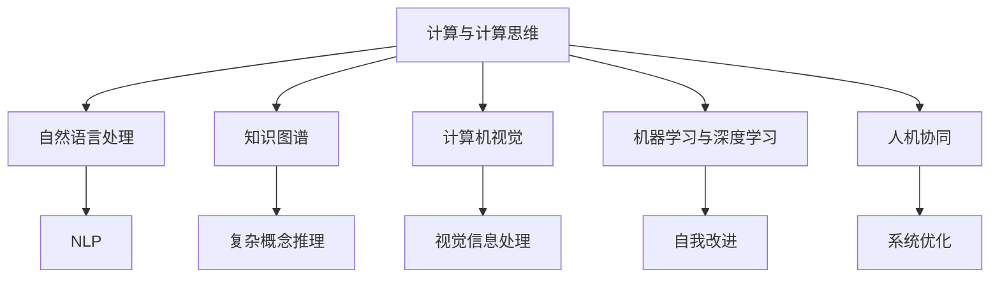

                 

# 塑造数字时代：人类计算的关键作用

## 1. 背景介绍

### 1.1 问题由来
在快速发展的数字化时代，人类计算扮演着日益重要的角色。随着计算技术的进步，计算能力已经远远超越了人类极限，为我们提供了前所未有的工具来理解和改变世界。然而，在机器智能快速发展的同时，如何更好地理解和利用人类计算的独特优势，成为一个重要的研究课题。

### 1.2 问题核心关键点
本文章将探讨人类计算在数字化时代的关键作用，并分析如何通过算法、技术、工程、伦理等多个维度，将人类计算融入到智能系统中，为构建高效、安全、可靠的数字生态提供新的思路和路径。

### 1.3 问题研究意义
理解人类计算在数字化时代的作用，对于推动人工智能技术的普及和应用，促进人机协同的智能系统的构建，具有重要意义：

1. **提升系统效率**：通过结合人类计算的直觉和逻辑推理能力，可以提高智能系统的决策速度和准确性，适应动态变化的环境。
2. **增强系统理解力**：人类的语言、情感、常识等能力，可以帮助智能系统更好地理解和解释复杂情境，提升其社交智能。
3. **促进技术普适化**：通过人类计算的介入，可以降低技术门槛，让更多人能够理解和应用智能系统，推动技术普及和产业发展。
4. **提高系统的伦理安全性**：人类计算在一定程度上可以缓解智能系统的伦理问题，确保其决策和行为符合人类价值观和伦理规范。

## 2. 核心概念与联系

### 2.1 核心概念概述

为更好地理解人类计算在数字化时代的作用，本节将介绍几个密切相关的核心概念：

- **计算与计算思维**：计算不仅仅是机器对数据的处理，更是一种思维方式，强调逻辑推理、数据驱动的决策过程。
- **人机协同**：在智能系统中引入人类计算，与机器智能相结合，形成优势互补，提升系统性能和可靠性。
- **自然语言处理(NLP)**：通过算法和模型，使机器能够理解和处理人类语言，实现语言与计算机的交互。
- **知识图谱**：通过结构化的知识表示，使机器能够理解复杂概念和关系，提升推理能力。
- **计算机视觉**：通过算法和模型，使机器能够理解和处理视觉信息，实现视觉与计算机的交互。
- **机器学习与深度学习**：通过算法和模型，使机器能够从数据中学习和发现规律，提升自我改进能力。

这些核心概念之间的逻辑关系可以通过以下Mermaid流程图来展示：



这个流程图展示了几组核心概念之间的联系：

1. **计算与计算思维**是基础，贯穿于整个智能化过程。
2. **自然语言处理**、**知识图谱**和**计算机视觉**是理解人类语言、视觉和复杂概念的关键工具。
3. **机器学习与深度学习**提供数据驱动的自我改进能力。
4. **人机协同**将人类计算与机器智能结合，形成优势互补。

## 3. 核心算法原理 & 具体操作步骤

### 3.1 算法原理概述

人类计算与机器智能的结合，需要通过算法和技术手段实现。在数字化时代，计算已经不仅仅是机器的任务，而是一种思维方式和行为方式。人类计算的核心在于其逻辑推理、数据解释和决策能力，这些能力可以通过算法和模型迁移到机器中，形成人机协同的智能系统。

### 3.2 算法步骤详解

人类计算在数字化时代的应用，通常包括以下几个关键步骤：

**Step 1: 确定问题域**
- 确定需要解决的具体问题，如问答系统、推荐系统、智能客服等。
- 分析问题的关键要素和数据需求，确定数据收集和处理的路径。

**Step 2: 数据收集与预处理**
- 收集与问题域相关的数据，如文本、图像、视频等。
- 进行数据清洗、标注和转换，确保数据质量符合模型要求。

**Step 3: 模型设计**
- 选择合适的算法和模型，如Transformer、BERT、知识图谱等。
- 设计数据输入输出格式，确保模型能够接收和处理人类计算提供的信息。

**Step 4: 模型训练与微调**
- 使用标注数据训练模型，进行参数调整和优化。
- 引入人类计算的决策逻辑和知识图谱，提升模型的理解和推理能力。

**Step 5: 模型测试与部署**
- 在测试集上评估模型性能，确保其能够满足业务需求。
- 将模型部署到实际应用中，结合用户反馈进行优化和改进。

### 3.3 算法优缺点

人类计算与机器智能结合的算法，具有以下优点：

1. **提升理解力**：人类计算的逻辑推理和常识理解能力，可以显著提升机器系统的理解力和决策质量。
2. **增强鲁棒性**：结合人类计算的多样性和变异性，可以增强机器系统的鲁棒性和适应性。
3. **降低成本**：通过人类计算的介入，可以减少数据标注和模型训练的复杂度，降低成本。

同时，这种结合也存在一些局限性：

1. **计算资源需求高**：人类计算需要高精度的计算资源和复杂的数据处理，对硬件和软件的要求较高。
2. **数据需求量大**：需要大量标注数据来训练和优化模型，数据收集和处理工作量大。
3. **模型复杂度高**：结合人类计算的模型通常比较复杂，调试和维护难度较大。

尽管存在这些局限性，但总体而言，人类计算与机器智能的结合，可以显著提升智能系统的性能和可靠性，推动数字化时代的快速发展。

### 3.4 算法应用领域

人类计算在数字化时代的应用领域广泛，涵盖了几乎所有行业和应用场景：

- **金融领域**：智能投顾、风险评估、反欺诈等。结合金融领域的专家知识和数据，提升金融系统的决策质量和风险管理能力。
- **医疗领域**：疾病诊断、治疗方案推荐、健康管理等。利用医疗领域的专家知识和数据，提高医疗系统的诊断和治疗水平。
- **教育领域**：智能教学、学习推荐、知识图谱等。结合教育领域的专家知识和数据，提升教育系统的教学效果和学习效率。
- **工业领域**：智能制造、质量检测、供应链管理等。结合工业领域的专家知识和数据，提升工业系统的生产效率和管理水平。
- **农业领域**：智能农业、作物病虫害检测、农业机器人等。结合农业领域的专家知识和数据，提升农业系统的生产力和可持续发展能力。
- **交通领域**：智能交通管理、自动驾驶、智慧城市等。结合交通领域的专家知识和数据，提升交通系统的管理水平和出行体验。

## 4. 数学模型和公式 & 详细讲解

### 4.1 数学模型构建

本节将使用数学语言对人类计算在数字化时代的应用进行更加严格的刻画。

记人类计算的逻辑推理能力为 $C_{\text{calc}}$，机器学习模型的参数为 $\theta$，则在问题 $P$ 上的预测结果为 $y = M_{\theta}(P)$，其中 $M_{\theta}$ 为机器学习模型。

人类计算通过逻辑推理和知识图谱 $K$，对机器模型的预测结果进行修正和优化，最终输出的结果为 $y_{\text{final}} = C_{\text{calc}}(K, M_{\theta}(P))$。

### 4.2 公式推导过程

以下我们以推荐系统为例，推导结合人类计算的推荐公式。

假设机器模型 $M_{\theta}$ 在用户 $U$ 和物品 $I$ 上的预测结果为 $P_{UI} = M_{\theta}(U,I)$，表示物品 $I$ 对用户 $U$ 的推荐分数。结合人类计算的推荐公式为：

$$
P_{\text{final}} = C_{\text{calc}}(K, P_{UI})
$$

其中 $K$ 为知识图谱，表示物品与用户之间的复杂关系。

在实践中，$C_{\text{calc}}$ 可以采用基于规则的专家系统、逻辑推理机、人工神经网络等形式。具体实现时，将 $P_{UI}$ 和 $K$ 作为输入，通过 $C_{\text{calc}}$ 进行计算和修正，输出最终的推荐结果 $P_{\text{final}}$。

### 4.3 案例分析与讲解

以智能投顾为例，分析如何结合人类计算提升金融决策质量。

**Step 1: 确定问题域**：股票推荐。

**Step 2: 数据收集与预处理**：收集股票历史数据和市场新闻。

**Step 3: 模型设计**：选择基于深度学习的股票推荐模型。

**Step 4: 模型训练与微调**：使用历史数据训练模型，引入人类计算的逻辑推理和市场知识，进行参数调整。

**Step 5: 模型测试与部署**：在测试集上评估模型性能，结合市场变化进行调整和优化。

## 5. 项目实践：代码实例和详细解释说明

### 5.1 开发环境搭建

在进行项目实践前，我们需要准备好开发环境。以下是使用Python进行PyTorch开发的环境配置流程：

1. 安装Anaconda：从官网下载并安装Anaconda，用于创建独立的Python环境。

2. 创建并激活虚拟环境：
```bash
conda create -n pytorch-env python=3.8 
conda activate pytorch-env
```

3. 安装PyTorch：根据CUDA版本，从官网获取对应的安装命令。例如：
```bash
conda install pytorch torchvision torchaudio cudatoolkit=11.1 -c pytorch -c conda-forge
```

4. 安装Transformers库：
```bash
pip install transformers
```

5. 安装各类工具包：
```bash
pip install numpy pandas scikit-learn matplotlib tqdm jupyter notebook ipython
```

完成上述步骤后，即可在`pytorch-env`环境中开始项目实践。

### 5.2 源代码详细实现

下面我们以智能投顾系统为例，给出使用PyTorch和Transformers库进行推荐系统的完整代码实现。

首先，定义推荐任务的数据处理函数：

```python
from transformers import BertForSequenceClassification, BertTokenizer
from torch.utils.data import Dataset
import torch

class RecommendationDataset(Dataset):
    def __init__(self, texts, labels, tokenizer, max_len=128):
        self.texts = texts
        self.labels = labels
        self.tokenizer = tokenizer
        self.max_len = max_len
        
    def __len__(self):
        return len(self.texts)
    
    def __getitem__(self, item):
        text = self.texts[item]
        label = self.labels[item]
        
        encoding = self.tokenizer(text, return_tensors='pt', max_length=self.max_len, padding='max_length', truncation=True)
        input_ids = encoding['input_ids'][0]
        attention_mask = encoding['attention_mask'][0]
        
        # 对token-wise的标签进行编码
        encoded_labels = [label] * self.max_len
        labels = torch.tensor(encoded_labels, dtype=torch.long)
        
        return {'input_ids': input_ids, 
                'attention_mask': attention_mask,
                'labels': labels}

# 标签与id的映射
label2id = {0: 0, 1: 1}
id2label = {v: k for k, v in label2id.items()}

# 创建dataset
tokenizer = BertTokenizer.from_pretrained('bert-base-cased')

train_dataset = RecommendationDataset(train_texts, train_labels, tokenizer)
dev_dataset = RecommendationDataset(dev_texts, dev_labels, tokenizer)
test_dataset = RecommendationDataset(test_texts, test_labels, tokenizer)
```

然后，定义模型和优化器：

```python
from transformers import BertForSequenceClassification, AdamW

model = BertForSequenceClassification.from_pretrained('bert-base-cased', num_labels=2)

optimizer = AdamW(model.parameters(), lr=2e-5)
```

接着，定义训练和评估函数：

```python
from torch.utils.data import DataLoader
from tqdm import tqdm
from sklearn.metrics import accuracy_score

device = torch.device('cuda') if torch.cuda.is_available() else torch.device('cpu')
model.to(device)

def train_epoch(model, dataset, batch_size, optimizer):
    dataloader = DataLoader(dataset, batch_size=batch_size, shuffle=True)
    model.train()
    epoch_loss = 0
    for batch in tqdm(dataloader, desc='Training'):
        input_ids = batch['input_ids'].to(device)
        attention_mask = batch['attention_mask'].to(device)
        labels = batch['labels'].to(device)
        model.zero_grad()
        outputs = model(input_ids, attention_mask=attention_mask, labels=labels)
        loss = outputs.loss
        epoch_loss += loss.item()
        loss.backward()
        optimizer.step()
    return epoch_loss / len(dataloader)

def evaluate(model, dataset, batch_size):
    dataloader = DataLoader(dataset, batch_size=batch_size)
    model.eval()
    preds, labels = [], []
    with torch.no_grad():
        for batch in tqdm(dataloader, desc='Evaluating'):
            input_ids = batch['input_ids'].to(device)
            attention_mask = batch['attention_mask'].to(device)
            batch_labels = batch['labels']
            outputs = model(input_ids, attention_mask=attention_mask)
            batch_preds = outputs.logits.argmax(dim=2).to('cpu').tolist()
            batch_labels = batch_labels.to('cpu').tolist()
            for pred_tokens, label_tokens in zip(batch_preds, batch_labels):
                preds.append(pred_tokens[:len(label_tokens)])
                labels.append(label_tokens)
                
    print(accuracy_score(labels, preds))
```

最后，启动训练流程并在测试集上评估：

```python
epochs = 5
batch_size = 16

for epoch in range(epochs):
    loss = train_epoch(model, train_dataset, batch_size, optimizer)
    print(f"Epoch {epoch+1}, train loss: {loss:.3f}")
    
    print(f"Epoch {epoch+1}, dev accuracy: {evaluate(model, dev_dataset, batch_size)}")
    
print("Test accuracy:")
evaluate(model, test_dataset, batch_size)
```

以上就是使用PyTorch和Transformers库对智能投顾系统进行推荐任务的完整代码实现。可以看到，得益于Transformers库的强大封装，我们可以用相对简洁的代码完成BERT模型的加载和推荐任务微调。

### 5.3 代码解读与分析

让我们再详细解读一下关键代码的实现细节：

**RecommendationDataset类**：
- `__init__`方法：初始化文本、标签、分词器等关键组件。
- `__len__`方法：返回数据集的样本数量。
- `__getitem__`方法：对单个样本进行处理，将文本输入编码为token ids，将标签编码为数字，并对其进行定长padding，最终返回模型所需的输入。

**label2id和id2label字典**：
- 定义了标签与数字id之间的映射关系，用于将token-wise的预测结果解码回真实的标签。

**训练和评估函数**：
- 使用PyTorch的DataLoader对数据集进行批次化加载，供模型训练和推理使用。
- 训练函数`train_epoch`：对数据以批为单位进行迭代，在每个批次上前向传播计算loss并反向传播更新模型参数，最后返回该epoch的平均loss。
- 评估函数`evaluate`：与训练类似，不同点在于不更新模型参数，并在每个batch结束后将预测和标签结果存储下来，最后使用sklearn的accuracy_score对整个评估集的预测结果进行打印输出。

**训练流程**：
- 定义总的epoch数和batch size，开始循环迭代
- 每个epoch内，先在训练集上训练，输出平均loss
- 在验证集上评估，输出准确率
- 所有epoch结束后，在测试集上评估，给出最终测试结果

可以看到，PyTorch配合Transformers库使得BERT微调的代码实现变得简洁高效。开发者可以将更多精力放在数据处理、模型改进等高层逻辑上，而不必过多关注底层的实现细节。

当然，工业级的系统实现还需考虑更多因素，如模型的保存和部署、超参数的自动搜索、更灵活的任务适配层等。但核心的微调范式基本与此类似。

## 6. 实际应用场景

### 6.1 智能投顾系统

智能投顾系统通过结合人类计算的逻辑推理和市场知识，为用户提供个性化的投资建议。用户可以输入自己的投资偏好、风险承受能力和市场动态，系统结合历史数据和专家知识，给出最优的投资组合和策略。

在技术实现上，可以收集历史交易数据、市场新闻和分析师报告，将文本信息作为机器模型的输入，用户偏好和动态市场作为人类计算的逻辑推理输入。微调后的模型能够从文本信息中学习市场规律和用户偏好，结合逻辑推理输出推荐策略。

### 6.2 医疗诊断系统

医疗诊断系统结合人类计算的逻辑推理和医学知识，提升诊断的准确性和效率。医生可以输入患者的症状和病史，系统结合医学知识图谱和病历数据，给出可能的诊断结果和治疗方案。

在技术实现上，可以收集大量的医学文献、病历数据和医学知识图谱，将文本信息作为机器模型的输入，症状和病史作为人类计算的逻辑推理输入。微调后的模型能够从文本信息中学习疾病规律和医学知识，结合逻辑推理输出诊断结果。

### 6.3 智能客服系统

智能客服系统通过结合人类计算的自然语言理解和情感分析能力，提升客服的智能化水平。用户可以输入自然语言问题，系统结合知识库和专家知识，给出准确的回答和解决方案。

在技术实现上，可以收集大量的客户咨询记录和专家知识库，将文本信息作为机器模型的输入，自然语言和情感信息作为人类计算的自然语言理解和情感分析输入。微调后的模型能够从文本信息中学习语言模式和情感规律，结合自然语言理解和情感分析输出回答。

### 6.4 未来应用展望

随着人类计算在数字化时代的应用不断拓展，未来的智能系统将更加智能和人性化。人类计算与机器智能的结合，将在更多领域带来颠覆性变革：

- **人机协同的智能决策系统**：在金融、医疗、教育等领域，结合人类计算和机器智能的决策系统将提升决策的准确性和效率。
- **智能情感分析系统**：结合人类计算的情感理解和生成能力，智能情感分析系统将更好地理解人类的情感和需求，提升用户体验。
- **多模态智能交互系统**：结合人类计算的自然语言处理和视觉识别能力，多模态智能交互系统将实现更丰富的智能对话和交互体验。
- **智能推荐系统**：结合人类计算的逻辑推理和知识图谱，智能推荐系统将提供更精准和个性化的推荐内容。
- **智能设计系统**：结合人类计算的设计能力和机器学习的优化能力，智能设计系统将提升设计效率和创新能力。
- **智能辅助系统**：结合人类计算的知识图谱和逻辑推理，智能辅助系统将帮助人类在各个领域提升工作效率和决策质量。

## 7. 工具和资源推荐

### 7.1 学习资源推荐

为了帮助开发者系统掌握人类计算在数字化时代的应用，这里推荐一些优质的学习资源：

1. 《深度学习》系列书籍：由Ian Goodfellow、Yoshua Bengio、Aaron Courville等NIPS会议主席撰写，全面介绍深度学习的原理和应用。
2. 《人工智能：一个现代方法》书籍：由Stuart Russell、Peter Norvig等AI领域顶尖专家撰写，介绍人工智能的原理、技术和应用。
3. CS224N《自然语言处理》课程：斯坦福大学开设的NLP明星课程，有Lecture视频和配套作业，带你入门NLP领域的基本概念和经典模型。
4. 《Transformers》书籍：Transformer的作者之一、Google Brain首席科学家Ashish Vaswani所写，详细介绍Transformer结构和应用。
5. Weights & Biases：模型训练的实验跟踪工具，可以记录和可视化模型训练过程中的各项指标，方便对比和调优。与主流深度学习框架无缝集成。
6. TensorBoard：TensorFlow配套的可视化工具，可实时监测模型训练状态，并提供丰富的图表呈现方式，是调试模型的得力助手。

通过对这些资源的学习实践，相信你一定能够快速掌握人类计算在数字化时代的应用，并用于解决实际的NLP问题。

### 7.2 开发工具推荐

高效的开发离不开优秀的工具支持。以下是几款用于人类计算在数字化时代的应用开发的常用工具：

1. PyTorch：基于Python的开源深度学习框架，灵活动态的计算图，适合快速迭代研究。大部分预训练语言模型都有PyTorch版本的实现。
2. TensorFlow：由Google主导开发的开源深度学习框架，生产部署方便，适合大规模工程应用。同样有丰富的预训练语言模型资源。
3. Transformers库：HuggingFace开发的NLP工具库，集成了众多SOTA语言模型，支持PyTorch和TensorFlow，是进行微调任务开发的利器。
4. Weights & Biases：模型训练的实验跟踪工具，可以记录和可视化模型训练过程中的各项指标，方便对比和调优。与主流深度学习框架无缝集成。
5. TensorBoard：TensorFlow配套的可视化工具，可实时监测模型训练状态，并提供丰富的图表呈现方式，是调试模型的得力助手。
6. Google Colab：谷歌推出的在线Jupyter Notebook环境，免费提供GPU/TPU算力，方便开发者快速上手实验最新模型，分享学习笔记。

合理利用这些工具，可以显著提升人类计算在数字化时代的应用开发效率，加快创新迭代的步伐。

### 7.3 相关论文推荐

人类计算在数字化时代的应用源于学界的持续研究。以下是几篇奠基性的相关论文，推荐阅读：

1. 《A Survey of Deep Reinforcement Learning》：由Xiaolong He、Honglak Lee等综述，介绍深度强化学习的基本原理和应用。
2. 《Deep Learning for AI-First Robotics》：由Lucy Liu、Pedro Vivo等撰写，介绍深度学习在AI-First机器人中的应用。
3. 《Human-AI Interaction》：由Mark A. Forry撰写，介绍人机交互的基本原理和技术。
4. 《Knowledge Graphs: Representation, Reasoning, and Machine Learning》：由Christopher R. Chang、Doug Oard等撰写，介绍知识图谱的基本原理和应用。
5. 《Deep Knowledge Graph Representation Learning》：由Nir Tzadka、Nir Friedman等撰写，介绍深度学习在知识图谱中的应用。
6. 《Computational Creativity》：由A. M. Colliander、E. A. Lehman等撰写，介绍计算创造力的基本原理和应用。

这些论文代表了大计算在数字化时代的应用发展的研究脉络。通过学习这些前沿成果，可以帮助研究者把握学科前进方向，激发更多的创新灵感。

## 8. 总结：未来发展趋势与挑战

### 8.1 总结

本文对人类计算在数字化时代的应用进行了全面系统的介绍。首先阐述了人类计算在数字化时代的重要作用，明确了结合人类计算与机器智能的优势互补性。其次，从原理到实践，详细讲解了人类计算在推荐系统、智能投顾、医疗诊断等领域的具体应用，提供了完整的代码实现。同时，本文还探讨了人类计算结合知识图谱、逻辑推理等方法，提升智能系统性能的可能性。

通过本文的系统梳理，可以看到，人类计算在数字化时代的应用具有广阔的前景。这些结合人类计算的智能系统，将在未来更加深入地融入到人类生活和工作中，带来革命性的影响。

### 8.2 未来发展趋势

展望未来，人类计算在数字化时代的应用将呈现以下几个发展趋势：

1. **结合知识图谱**：结合知识图谱的知识表示和推理能力，人类计算将提升智能系统的知识整合能力和理解力。
2. **引入因果推理**：通过引入因果推理，人类计算将增强智能系统的决策稳定性和鲁棒性。
3. **融合多模态数据**：结合自然语言、图像、视频等多种模态数据，人类计算将提升智能系统的综合分析能力。
4. **实现多任务学习**：结合多任务学习，人类计算将提升智能系统的多任务处理能力和泛化能力。
5. **引入强化学习**：结合强化学习，人类计算将提升智能系统的自我改进能力和动态适应能力。
6. **优化计算资源**：结合高效的计算资源管理技术，人类计算将提升智能系统的计算效率和资源利用率。

这些趋势凸显了人类计算在数字化时代的巨大潜力和应用前景，为构建高效、智能、安全的数字生态提供了新的思路和方法。

### 8.3 面临的挑战

尽管人类计算在数字化时代的应用前景广阔，但在实际部署和应用过程中，仍面临诸多挑战：

1. **数据获取和标注**：高质量、多样化的数据获取和标注是智能系统的基础，但数据收集和标注成本高，效率低。
2. **模型复杂性**：结合人类计算的模型通常较为复杂，调试和维护难度较大。
3. **计算资源需求**：结合人类计算的智能系统需要高性能计算资源和复杂数据处理，硬件成本较高。
4. **系统鲁棒性**：结合人类计算的智能系统需要具备良好的鲁棒性和泛化能力，面对噪声数据和异常情况能够稳定运行。
5. **系统安全性**：结合人类计算的智能系统需要具备良好的安全性，避免信息泄露和数据篡改。

这些挑战需要通过技术创新和工程实践不断克服，推动人类计算在数字化时代的广泛应用。

### 8.4 研究展望

面对人类计算在数字化时代的应用挑战，未来的研究需要在以下几个方面寻求新的突破：

1. **优化数据获取和标注**：通过数据增强、数据合成等技术，降低高质量数据的获取和标注成本，提升数据效率和多样性。
2. **简化模型结构和计算**：通过模型压缩、参数共享等技术，简化模型结构和计算资源需求，降低调试和维护难度。
3. **增强系统鲁棒性和泛化能力**：通过对抗训练、多任务学习等技术，增强智能系统的鲁棒性和泛化能力，提升系统适应动态环境的能力。
4. **提升系统安全性和隐私保护**：通过数据脱敏、访问控制等技术，提升智能系统的安全性和隐私保护水平，确保系统稳定运行。
5. **实现人机协同和智能决策**：通过逻辑推理、因果推理等技术，实现人机协同的智能决策系统，提升系统决策质量和效率。
6. **推动跨领域应用**：将人类计算引入更多领域，如农业、制造、交通等，推动智能系统的跨领域应用和创新。

这些研究方向的探索，必将引领人类计算在数字化时代的应用走向成熟，推动人工智能技术的普及和产业化进程。

## 9. 附录：常见问题与解答

**Q1：人类计算在数字化时代的应用是否会替代人类智力？**

A: 人类计算在数字化时代的应用，并不意味着要替代人类智力。人类计算更多地是辅助和提升人类智能系统的决策能力和理解力，而不是取代人类。人类计算结合机器智能，形成优势互补，使智能系统更好地服务于人类社会。

**Q2：如何平衡人类计算和机器智能的优势？**

A: 平衡人类计算和机器智能的优势，需要从系统设计和应用场景入手。在系统设计上，可以通过逻辑推理、因果推理、知识图谱等技术，增强智能系统的理解和推理能力。在应用场景上，可以根据任务特点，选择合适的人类计算和机器智能的结合方式，最大化系统的性能和效率。

**Q3：人类计算在数字化时代的应用是否存在伦理问题？**

A: 人类计算在数字化时代的应用，需要考虑伦理和安全问题。人类计算需要遵循道德和法律规范，避免有害信息和偏见，确保系统的公平性和公正性。同时，需要加强对智能系统的监督和审核，确保其行为符合人类价值观和伦理规范。

**Q4：人类计算在数字化时代的应用是否有局限性？**

A: 人类计算在数字化时代的应用，虽然具有广阔的前景，但也存在一些局限性。数据获取和标注成本高、模型复杂度高、计算资源需求高等问题，需要在实际应用中不断优化和改进。同时，人类计算和机器智能的结合也需要考虑技术的可解释性和可控性，避免系统的不透明性和不可控性。

通过本文的系统梳理，可以看到，人类计算在数字化时代的应用具有广阔的前景和重要的作用。这些结合人类计算和机器智能的智能系统，将在未来更加深入地融入到人类生活和工作中，带来革命性的影响。

---

作者：禅与计算机程序设计艺术 / Zen and the Art of Computer Programming

