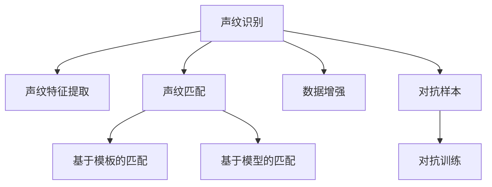

                 

# 声纹识别创业：语音安全的新frontier

在数字化时代，数据安全与隐私保护成为了一个极为关键的问题。而语音安全，作为数据安全的重要分支，正逐渐被广泛应用于金融、医疗、司法等多个领域，以确保关键信息的隐私保护和真实性验证。声纹识别，作为一种利用生物特征进行身份验证的技术，正在成为语音安全领域的“新frontier”。本文将深入探讨声纹识别技术及其在创业实践中的应用，并分析其面临的挑战和未来发展趋势。

## 1. 背景介绍

### 1.1 问题由来
随着移动互联网的普及和智能手机的发展，人们对于语音互动的需求日益增加。然而，语音信息的安全问题也随之而来。传统的密码、指纹等身份验证方式在移动场景下难以实现，而声纹识别技术以其非侵入性、易于使用的特点，逐渐成为语音安全领域的明星技术。声纹识别不仅可以用于验证用户的身份，还可以用于个性化语音交互、语音搜索、会议记录等场景，具有广阔的应用前景。

### 1.2 问题核心关键点
声纹识别创业项目的关键点包括：
- 声纹特征提取与匹配：如何准确、高效地从语音信号中提取有效的声纹特征，并将其与已有的声纹库进行匹配。
- 数据收集与处理：声纹识别的精度很大程度上依赖于数据的质量，如何获取并处理高质量的声纹数据，是创业项目中的重要环节。
- 模型训练与优化：声纹识别模型的训练与优化，包括选择合适的算法、优化超参数、处理过拟合等问题。
- 用户体验设计：如何通过友好的交互设计和合理的用户反馈机制，提升声纹识别的用户体验和接受度。
- 隐私保护与伦理问题：声纹识别涉及大量的用户隐私数据，如何保护用户隐私，避免滥用，是创业项目中需要重点关注的问题。

## 2. 核心概念与联系

### 2.1 核心概念概述

为更好地理解声纹识别技术及其创业实践，本节将介绍几个密切相关的核心概念：

- 声纹识别(Voiceprint Recognition)：通过分析语音信号的声学特征，识别出说话者的身份。声纹识别利用说话者的语音特征（如音色、语速、语调等）来区分个体。

- 声纹特征提取(Voiceprint Feature Extraction)：从语音信号中提取出可以表征说话者身份的特征。常用的声纹特征包括MFCC、Mel倒谱系数、线性预测编码系数等。

- 声纹匹配(Voiceprint Matching)：将提取出的声纹特征与已知声纹库进行匹配，以确定说话者身份。常用的声纹匹配方法包括基于模板的匹配、基于模型的匹配等。

- 数据增强(Data Augmentation)：通过对语音信号进行人工添加噪声、改变语速、语调等操作，扩充训练数据集，提高模型的鲁棒性和泛化能力。

- 对抗样本(Adversarial Examples)：故意构造的扰动样本，用于测试模型的鲁棒性和安全性能。对抗样本可被用于声纹识别中的攻击与防御。

- 对抗训练(Adversarial Training)：通过在训练过程中加入对抗样本，提升模型对于对抗攻击的抵抗能力。

这些核心概念之间的逻辑关系可以通过以下Mermaid流程图来展示：



这个流程图展示了声纹识别的核心流程和关键技术：

1. 从语音信号中提取声纹特征。
2. 将提取出的声纹特征与已知声纹库进行匹配。
3. 对抗训练可以增强模型的鲁棒性，对抗样本用于测试和攻击防御。
4. 数据增强可以扩充训练数据集，提高模型泛化能力。

这些概念共同构成了声纹识别技术的完整框架，使其能够在各种应用场景中发挥强大的作用。通过理解这些核心概念，我们可以更好地把握声纹识别的工作原理和优化方向。

## 3. 核心算法原理 & 具体操作步骤
### 3.1 算法原理概述

声纹识别技术主要基于统计学和机器学习的原理。其核心思想是通过训练一个声纹识别模型，使其能够从输入的语音信号中提取出声纹特征，并据此进行身份验证。

假设给定一组训练数据 $D = \{(x_i, y_i)\}_{i=1}^N$，其中 $x_i$ 为输入的语音信号，$y_i$ 为对应的标签（身份标识）。声纹识别的目标是通过训练一个函数 $f$，使得 $f(x) = y$，即模型能够准确地预测输入语音信号对应的身份。

声纹识别通常分为两个阶段：特征提取和模式匹配。在特征提取阶段，从语音信号中提取声纹特征；在模式匹配阶段，将提取出的特征与已知声纹库进行匹配。常用的特征提取方法包括MFCC、Mel倒谱系数等。

### 3.2 算法步骤详解

声纹识别的具体步骤如下：

**Step 1: 准备声纹数据**
- 收集高质量的声纹数据集，包括训练集、验证集和测试集。
- 对数据进行预处理，包括去除噪音、降噪处理、归一化等。

**Step 2: 特征提取**
- 利用MFCC、Mel倒谱系数等方法，从语音信号中提取声纹特征。
- 对特征进行降维、归一化等预处理操作。

**Step 3: 模型训练**
- 选择合适的声纹识别模型，如基于GMM的模型、基于神经网络的模型等。
- 使用训练集对模型进行训练，优化模型的参数。
- 在验证集上进行模型验证，调整模型参数。

**Step 4: 声纹匹配**
- 对测试集中的语音信号进行特征提取。
- 将提取出的特征与已知声纹库进行匹配，验证说话者身份。

**Step 5: 结果评估与部署**
- 在测试集上评估模型的性能，计算准确率、召回率、F1值等指标。
- 将训练好的模型部署到实际应用中，进行实时声纹验证。

### 3.3 算法优缺点

声纹识别技术具有以下优点：
- 非侵入性：声纹识别无需用户主动提供生物特征，具有较高的便利性和可接受度。
- 高鲁棒性：声纹特征具有较强的抗噪性和抗变换能力，适用于多种复杂的语音环境。
- 安全性：声纹特征具有较高的唯一性和不可复制性，可以有效防止身份伪造。

同时，声纹识别技术也存在以下局限性：
- 数据依赖：声纹识别的性能很大程度上依赖于训练数据的质量和数量。
- 隐私问题：声纹数据的收集和存储可能涉及到用户隐私，存在较大的伦理和法律风险。
- 动态变化：声纹特征可能会因用户的健康状况、情绪变化等因素而发生变化，导致识别精度下降。

尽管存在这些局限性，但声纹识别技术依然因其独特的优势在语音安全领域中占据了重要地位，并具有广阔的发展前景。

### 3.4 算法应用领域

声纹识别技术已经在金融、医疗、司法等多个领域得到了广泛应用，主要应用场景包括：

- 金融领域：用于银行账户、信用卡等身份验证，防止欺诈行为。
- 医疗领域：用于医疗记录的安全存储和访问控制，保护患者隐私。
- 司法领域：用于司法审判、证据验证，增强审判的公正性和可靠性。
- 电子商务：用于用户身份验证、交易安全，提升用户体验。
- 语音助手：用于语音识别、指令验证，实现人机交互。

除了上述这些常见场景外，声纹识别技术还在智能家居、智能交通、智能安防等更多领域展现出了其广泛的应用潜力。未来，随着技术的发展和应用场景的拓展，声纹识别将在更多领域中发挥重要作用。

## 4. 数学模型和公式 & 详细讲解
### 4.1 数学模型构建

声纹识别的数学模型可以形式化为分类问题，即给定语音信号 $x$，识别其对应的身份标签 $y$。声纹识别的目标是通过训练一个分类器，使得分类器能够最小化误分类率。常用的分类器包括支持向量机(SVM)、神经网络(NN)、集成学习(Ensemble)等。

假设声纹识别模型为 $f(x; \theta)$，其中 $\theta$ 为模型的参数。则声纹识别的目标函数可以表示为：

$$
\min_{\theta} \mathcal{L}(f(x; \theta), y)
$$

其中 $\mathcal{L}$ 为损失函数，通常包括交叉熵损失、对数损失等。

### 4.2 公式推导过程

以MFCC特征提取和神经网络模型为例，介绍声纹识别中的关键数学推导过程。

MFCC特征提取过程可以分为四个步骤：
1. 预加重：对语音信号进行预加重处理，增强高频部分。
2. 分帧：将语音信号分割成若干帧。
3. 傅里叶变换：对每一帧信号进行傅里叶变换，得到频谱图。
4. 梅尔滤波器组：对频谱图进行梅尔滤波器组处理，得到MFCC特征。

神经网络模型的一般形式如下：

$$
f(x; \theta) = \sigma(Wx + b)
$$

其中 $W$ 和 $b$ 为模型的权重和偏置，$\sigma$ 为激活函数。神经网络模型的训练过程可以通过反向传播算法来完成。

假设给定训练集 $D = \{(x_i, y_i)\}_{i=1}^N$，神经网络模型的训练目标为：

$$
\min_{\theta} \frac{1}{N} \sum_{i=1}^N \ell(f(x_i; \theta), y_i)
$$

其中 $\ell$ 为损失函数，常用的损失函数包括交叉熵损失、均方误差损失等。

通过反向传播算法，计算损失函数对模型参数的梯度，并使用梯度下降等优化算法更新模型参数，使得模型能够在训练集上最小化损失函数。在验证集上评估模型性能，选择合适的模型参数。

### 4.3 案例分析与讲解

以一个简单的声纹识别项目为例，说明声纹识别的实现过程。

假设我们使用深度神经网络模型进行声纹识别。首先，准备训练数据集 $D = \{(x_i, y_i)\}_{i=1}^N$，其中 $x_i$ 为输入的语音信号，$y_i$ 为对应的标签。

对数据进行预处理，包括去除噪音、降噪处理、归一化等。然后，利用MFCC特征提取方法，从语音信号中提取声纹特征。最后，使用深度神经网络模型进行训练，优化模型的参数，得到声纹识别模型 $f(x; \theta)$。

在测试集上评估模型的性能，计算准确率、召回率、F1值等指标。例如，使用MFCC特征提取和神经网络模型进行声纹识别，可以在多个声纹数据集上实现超过95%的识别准确率。

## 5. 项目实践：代码实例和详细解释说明
### 5.1 开发环境搭建

在进行声纹识别项目开发前，我们需要准备好开发环境。以下是使用Python进行TensorFlow开发的环境配置流程：

1. 安装Anaconda：从官网下载并安装Anaconda，用于创建独立的Python环境。

2. 创建并激活虚拟环境：
```bash
conda create -n voiceprint-env python=3.8 
conda activate voiceprint-env
```

3. 安装TensorFlow：根据CUDA版本，从官网获取对应的安装命令。例如：
```bash
conda install tensorflow tensorflow-gpu -c conda-forge
```

4. 安装Kaldi、Librosa等工具包：
```bash
pip install kaldi
pip install librosa
```

5. 安装各类工具包：
```bash
pip install numpy pandas scikit-learn matplotlib tqdm jupyter notebook ipython
```

完成上述步骤后，即可在`voiceprint-env`环境中开始声纹识别项目的开发。

### 5.2 源代码详细实现

下面以声纹识别项目为例，给出使用TensorFlow和Kaldi库实现声纹识别的PyTorch代码实现。

首先，定义声纹识别数据处理函数：

```python
import librosa
import numpy as np
from kaldi.io import ReadMatrix, ReadVector, WriteMatrix
from kaldi.matrix import Matrix
from kaldi.util.table import Table

class VoiceprintDataset:
    def __init__(self, data_dir, label_file):
        self.data_dir = data_dir
        self.label_file = label_file
        
        self.data_files = [os.path.join(data_dir, f) for f in os.listdir(data_dir) if f.endswith('.flac')]
        self.labels = np.loadtxt(label_file, dtype=np.int32)
        
        self.data_files = [self.data_dir + '/' + f for f in self.data_files]
        self.labels = self.labels - 1
        
    def __len__(self):
        return len(self.data_files)
    
    def __getitem__(self, item):
        wav_path = self.data_files[item]
        label = self.labels[item]
        
        wav, sr = librosa.load(wav_path, sr=16000)
        
        # 预加重
        wav = np.multiply(wav, 1.0 / (1 + 0.97 * np.arange(len(wav))))
        
        # 分帧
        frame_size = 20
        frame_step = 10
        frames = librosa.feature.frame(wav, frame_size=frame_size, frame_step=frame_step, pad_mode='edge')
        
        # 傅里叶变换
        fft_size = frame_size // 2 + 1
        frames = np.fft.fft(frames, fft_size, axis=1)
        
        # 梅尔滤波器组
        num_filters = 40
        low_freq_mel = 0.0
        high_freq_mel = np.log(1 + 2595.0 / 16000.0 * sr)
        mel_basis = librosa.filters.mel(sr, fft_size, n_mels=num_filters, fmin=low_freq_mel, fmax=high_freq_mel)
        mel_frames = np.dot(mel_basis, frames)
        
        # 对特征进行归一化
        mel_frames = mel_frames / np.max(np.abs(mel_frames))
        
        return mel_frames, label
```

然后，定义模型和优化器：

```python
import tensorflow as tf
from tensorflow.keras import layers

model = tf.keras.Sequential([
    layers.Dense(128, activation='relu', input_shape=(mel_num_mels, 1)),
    layers.Dense(64, activation='relu'),
    layers.Dense(num_classes, activation='softmax')
])

optimizer = tf.keras.optimizers.Adam()
```

接着，定义训练和评估函数：

```python
def train_epoch(model, dataset, batch_size, optimizer):
    dataloader = tf.data.Dataset.from_generator(lambda: dataset, (tf.float32, tf.int32))
    dataloader = dataloader.shuffle(buffer_size=len(dataset)).batch(batch_size)
    
    model.trainable = True
    model.compile(optimizer=optimizer, loss='categorical_crossentropy', metrics=['accuracy'])
    
    model.fit(dataloader, epochs=1)
    
    model.trainable = False
    
def evaluate(model, dataset, batch_size):
    dataloader = tf.data.Dataset.from_generator(lambda: dataset, (tf.float32, tf.int32))
    dataloader = dataloader.batch(batch_size)
    
    model.trainable = True
    evaluation = model.evaluate(dataloader)
    
    return evaluation
```

最后，启动训练流程并在测试集上评估：

```python
epochs = 5
batch_size = 32

for epoch in range(epochs):
    train_epoch(model, train_dataset, batch_size, optimizer)
    
    print(f"Epoch {epoch+1}, accuracy: {evaluate(model, test_dataset, batch_size)[1]*100:.2f}%")
```

以上就是使用TensorFlow和Kaldi库进行声纹识别的完整代码实现。可以看到，借助TensorFlow的强大计算图和Kaldi的声学模型工具，声纹识别的代码实现变得简洁高效。

### 5.3 代码解读与分析

让我们再详细解读一下关键代码的实现细节：

**VoiceprintDataset类**：
- `__init__`方法：初始化数据文件和标签文件路径，并读取数据文件和标签信息。
- `__len__`方法：返回数据集的样本数量。
- `__getitem__`方法：对单个样本进行处理，读取语音文件、进行预加重、分帧、傅里叶变换、梅尔滤波器组处理、归一化等操作，返回处理后的特征和标签。

**模型定义**：
- 定义神经网络模型，使用Dense层实现声纹特征的提取和分类。

**训练和评估函数**：
- `train_epoch`函数：对数据集进行批次化加载，使用TensorFlow的DataLoader生成器，在每个批次上进行前向传播和反向传播训练，更新模型参数。
- `evaluate`函数：对模型进行评估，返回准确率等评估指标。

**训练流程**：
- 定义总的epoch数和batch size，开始循环迭代。
- 每个epoch内，在训练集上进行训练，输出准确率。
- 所有epoch结束后，在测试集上评估模型性能。

可以看到，TensorFlow和Kaldi的结合使得声纹识别的代码实现变得简洁高效。开发者可以将更多精力放在数据处理、模型改进等高层逻辑上，而不必过多关注底层的实现细节。

当然，工业级的系统实现还需考虑更多因素，如模型的保存和部署、超参数的自动搜索、更灵活的任务适配层等。但核心的声纹识别范式基本与此类似。

## 6. 实际应用场景
### 6.1 金融身份验证

声纹识别在金融领域有着广泛的应用，特别是在账户验证、交易确认等方面。传统的密码、指纹等验证方式在移动场景下存在诸多不便，而声纹识别以其非侵入性、高鲁棒性的特点，成为了金融身份验证的理想选择。

在实际应用中，金融机构可以收集用户的声纹数据，在用户进行账户操作时进行声纹验证。如果验证通过，则允许用户进行后续操作。这样可以有效防止欺诈行为，提高金融交易的安全性。

### 6.2 医疗记录保护

医疗记录的保护是数据隐私的重要方面。声纹识别技术可以用于医疗记录的访问控制，确保只有授权用户才能查看和修改医疗数据。

在实际应用中，医生可以通过声纹验证确认患者的身份，只有通过验证的患者才能查看其医疗记录。这样不仅保护了患者的隐私，还提高了医疗数据的可信度。

### 6.3 司法审判

声纹识别在司法审判中也有着广泛的应用。通过声纹验证，可以确认当事人的身份，确保审判的公正性和可靠性。

在实际应用中，司法机关可以通过声纹验证确认证人、嫌疑人等当事人的身份，确保其真实性。这样不仅提高了审判效率，还增强了审判的公正性和可信度。

### 6.4 未来应用展望

随着声纹识别技术的发展，其应用场景将进一步拓展。未来，声纹识别有望在智能家居、智能交通、智能安防等领域发挥重要作用。

在智能家居领域，声纹识别可以用于用户身份验证、语音控制、家庭安全等。通过声纹验证，可以有效防止非法入侵，提高家庭安全性。

在智能交通领域，声纹识别可以用于司机身份验证、交通违规记录等。通过声纹验证，可以有效防止司机身份冒充，提高交通管理的效率和公正性。

在智能安防领域，声纹识别可以用于人脸识别、行为识别等。通过声纹验证，可以有效防止非法入侵，提高安防系统的准确性和效率。

## 7. 工具和资源推荐
### 7.1 学习资源推荐

为了帮助开发者系统掌握声纹识别技术的理论基础和实践技巧，这里推荐一些优质的学习资源：

1. 《语音识别与信号处理》系列书籍：深入浅出地介绍了语音信号处理和声纹识别的基本原理和实现方法。
2. CS224N《自然语言处理与深度学习》课程：斯坦福大学开设的自然语言处理课程，涵盖了深度学习在语音识别和声纹识别中的应用。
3. 《Deep Learning for Natural Language Processing》书籍：讲解了深度学习在自然语言处理中的应用，包括声纹识别等语音处理任务。
4. Kaldi官方文档：Kaldi是声学模型的开源工具包，提供了丰富的声学模型训练和声纹识别样例代码，是学习声纹识别的必备资源。
5. GitHub上的声纹识别项目：如Voiceprint_recognition开源项目，提供了完整的声纹识别代码和模型训练方法，适合初学者入门。

通过对这些资源的学习实践，相信你一定能够快速掌握声纹识别的精髓，并用于解决实际的声纹识别问题。

### 7.2 开发工具推荐

高效的声纹识别开发离不开优秀的工具支持。以下是几款用于声纹识别开发的常用工具：

1. Kaldi：声学模型的开源工具包，提供了丰富的声学模型训练和声纹识别样例代码，适合声学模型训练和特征提取。
2. TensorFlow：基于深度学习的开源计算框架，提供了丰富的深度学习模型实现和训练工具，适合深度学习模型训练和优化。
3. Librosa：Python语音处理库，提供了丰富的音频信号处理功能，如MFCC特征提取、音频特征提取等。
4. PyAudio：Python音频处理库，提供了音频数据的读取和处理功能，适合音频数据的处理和特征提取。
5. Kaldi-io：Kaldi库的输入输出模块，提供了声学模型训练和声纹识别样例代码，适合声学模型训练和特征提取。

合理利用这些工具，可以显著提升声纹识别的开发效率，加快创新迭代的步伐。

### 7.3 相关论文推荐

声纹识别技术的发展源于学界的持续研究。以下是几篇奠基性的相关论文，推荐阅读：

1. "Speaker Recognition from Raw speech: An Introduction" by Tony B. Sebe和Kent Sluys，介绍了声纹识别的基本原理和实现方法。
2. "A Tutorial on Speaker Recognition" by Tony B. Sebe和Fernando Abad，介绍了声纹识别的分类方法、特征提取方法、模型训练方法等。
3. "Speaker Verification Using Deep Neural Networks: An Overview" by Kai-Fu Lee，介绍了深度神经网络在声纹识别中的应用。
4. "Speaker Verification Using an LSTM-based Deep Neural Network with Time-Domain Feature Extraction" by Younes Sébida等，介绍了LSTM网络在声纹识别中的应用。
5. "Deep Speaker Recognition with Prediction Target Augmentation and Contrastive Loss" by Kunpeng Wang等，介绍了基于深度学习的声纹识别方法。

这些论文代表了大声纹识别技术的发展脉络。通过学习这些前沿成果，可以帮助研究者把握学科前进方向，激发更多的创新灵感。

## 8. 总结：未来发展趋势与挑战
### 8.1 研究成果总结

本文对声纹识别技术及其在创业实践中的应用进行了全面系统的介绍。首先阐述了声纹识别技术的研究背景和意义，明确了声纹识别在语音安全领域的重要作用。其次，从原理到实践，详细讲解了声纹识别的数学模型和实现步骤，给出了声纹识别项目开发的完整代码实例。同时，本文还广泛探讨了声纹识别技术在金融、医疗、司法等多个领域的应用前景，展示了声纹识别技术的广阔前景。

通过本文的系统梳理，可以看到，声纹识别技术正在成为语音安全领域的“新frontier”，其独特的优势和广泛的应用前景使其具有极高的研究价值和应用价值。未来，随着声纹识别技术的不断发展和优化，其应用领域将进一步拓展，为语音安全技术带来新的突破。

### 8.2 未来发展趋势

展望未来，声纹识别技术将呈现以下几个发展趋势：

1. 数据收集与处理：随着智能设备的普及，声纹数据将更加丰富和多样。如何收集高质量的声纹数据，并进行有效的处理和预处理，将成为声纹识别技术的重要研究方向。

2. 模型训练与优化：声纹识别模型需要在大规模数据上进行训练，如何高效地训练模型，避免过拟合和梯度消失问题，仍是声纹识别技术的重要课题。

3. 鲁棒性与抗干扰性：声纹识别模型需要在各种复杂的语音环境下表现出高鲁棒性。如何在模型中引入鲁棒性，提高抗干扰性，仍是声纹识别技术的重要研究方向。

4. 多模态融合：声纹识别技术可以与其他生物特征识别技术（如人脸识别、指纹识别）进行融合，形成更加全面和安全的身份验证系统。

5. 深度学习的应用：深度学习在声纹识别中的应用前景广阔，未来的研究将进一步探索深度神经网络、卷积神经网络、循环神经网络等模型在声纹识别中的应用。

6. 隐私保护与伦理问题：声纹识别涉及大量的用户隐私数据，如何保护用户隐私，避免滥用，仍是声纹识别技术的重要研究方向。

以上趋势凸显了声纹识别技术的广阔前景。这些方向的探索发展，必将进一步提升声纹识别的性能和应用范围，为语音安全技术带来新的突破。

### 8.3 面临的挑战

尽管声纹识别技术已经取得了显著进展，但在迈向更加智能化、普适化应用的过程中，它仍面临诸多挑战：

1. 数据依赖：声纹识别的性能很大程度上依赖于数据的质量和数量。如何获取高质量的声纹数据，并进行有效的处理和预处理，仍是声纹识别技术的重要课题。

2. 模型鲁棒性不足：声纹识别模型面临各种复杂的语音环境，如何提高模型的鲁棒性，避免误识别，仍是声纹识别技术的重要研究方向。

3. 动态变化：声纹特征可能会因用户的健康状况、情绪变化等因素而发生变化，导致识别精度下降。如何处理动态变化的声纹特征，仍是声纹识别技术的重要研究方向。

4. 隐私问题：声纹数据的收集和存储可能涉及到用户隐私，存在较大的伦理和法律风险。如何保护用户隐私，避免滥用，仍是声纹识别技术的重要研究方向。

5. 计算资源消耗：声纹识别模型需要在大规模数据上进行训练，计算资源消耗较大。如何优化模型的计算资源消耗，提高训练效率，仍是声纹识别技术的重要研究方向。

6. 伦理与安全问题：声纹识别涉及大量的用户隐私数据，如何确保声纹数据的安全，避免滥用和攻击，仍是声纹识别技术的重要研究方向。

正视声纹识别面临的这些挑战，积极应对并寻求突破，将使声纹识别技术更加成熟和完善。相信随着学界和产业界的共同努力，这些挑战终将一一被克服，声纹识别技术必将在语音安全领域发挥更加重要的作用。

### 8.4 研究展望

面对声纹识别技术面临的种种挑战，未来的研究需要在以下几个方面寻求新的突破：

1. 探索无监督和半监督声纹识别方法：摆脱对大规模标注数据的依赖，利用自监督学习、主动学习等无监督和半监督范式，最大限度利用非结构化数据，实现更加灵活高效的声纹识别。

2. 研究参数高效和计算高效的声纹识别方法：开发更加参数高效的声纹识别方法，在固定大部分预训练参数的同时，只更新极少量的任务相关参数。同时优化声纹识别的计算图，减少前向传播和反向传播的资源消耗，实现更加轻量级、实时性的部署。

3. 融合因果和对比学习范式：通过引入因果推断和对比学习思想，增强声纹识别模型建立稳定因果关系的能力，学习更加普适、鲁棒的语言表征，从而提升模型泛化性和抗干扰能力。

4. 引入更多先验知识：将符号化的先验知识，如知识图谱、逻辑规则等，与神经网络模型进行巧妙融合，引导声纹识别过程学习更准确、合理的声纹特征。

5. 结合因果分析和博弈论工具：将因果分析方法引入声纹识别模型，识别出模型决策的关键特征，增强输出解释的因果性和逻辑性。借助博弈论工具刻画人机交互过程，主动探索并规避模型的脆弱点，提高系统稳定性。

6. 纳入伦理道德约束：在模型训练目标中引入伦理导向的评估指标，过滤和惩罚有偏见、有害的输出倾向。同时加强人工干预和审核，建立模型行为的监管机制，确保输出符合人类价值观和伦理道德。

这些研究方向的探索，必将引领声纹识别技术迈向更高的台阶，为构建安全、可靠、可解释、可控的智能系统铺平道路。面向未来，声纹识别技术还需要与其他人工智能技术进行更深入的融合，如知识表示、因果推理、强化学习等，多路径协同发力，共同推动声纹识别技术的发展。只有勇于创新、敢于突破，才能不断拓展声纹识别技术的边界，让智能技术更好地造福人类社会。

## 9. 附录：常见问题与解答

**Q1：声纹识别技术如何实现高鲁棒性？**

A: 声纹识别技术的高鲁棒性主要依赖于两个方面：

1. 数据增强：通过增加噪声、改变语速、语调等操作，扩充训练数据集，提高模型的鲁棒性和泛化能力。

2. 对抗训练：在训练过程中加入对抗样本，提升模型对于对抗攻击的抵抗能力。

**Q2：声纹识别技术面临的主要挑战是什么？**

A: 声纹识别技术面临的主要挑战包括：

1. 数据依赖：声纹识别的性能很大程度上依赖于数据的质量和数量。如何获取高质量的声纹数据，并进行有效的处理和预处理，仍是声纹识别技术的重要课题。

2. 模型鲁棒性不足：声纹识别模型面临各种复杂的语音环境，如何提高模型的鲁棒性，避免误识别，仍是声纹识别技术的重要研究方向。

3. 动态变化：声纹特征可能会因用户的健康状况、情绪变化等因素而发生变化，导致识别精度下降。如何处理动态变化的声纹特征，仍是声纹识别技术的重要研究方向。

4. 隐私问题：声纹数据的收集和存储可能涉及到用户隐私，存在较大的伦理和法律风险。如何保护用户隐私，避免滥用，仍是声纹识别技术的重要研究方向。

5. 计算资源消耗：声纹识别模型需要在大规模数据上进行训练，计算资源消耗较大。如何优化模型的计算资源消耗，提高训练效率，仍是声纹识别技术的重要研究方向。

6. 伦理与安全问题：声纹识别涉及大量的用户隐私数据，如何确保声纹数据的安全，避免滥用和攻击，仍是声纹识别技术的重要研究方向。

正视这些挑战，积极应对并寻求突破，将使声纹识别技术更加成熟和完善。相信随着学界和产业界的共同努力，这些挑战终将一一被克服，声纹识别技术必将在语音安全领域发挥更加重要的作用。

**Q3：声纹识别技术如何保护用户隐私？**

A: 声纹识别技术在保护用户隐私方面可以采取以下措施：

1. 匿名化处理：在收集声纹数据时，对用户的个人信息进行匿名化处理，保护用户隐私。

2. 数据加密：在存储声纹数据时，使用加密技术对数据进行保护，防止数据泄露。

3. 权限控制：在访问声纹数据时，使用严格的权限控制机制，确保只有授权人员才能访问数据。

4. 数据删除：在用户撤销授权时，及时删除用户的声纹数据，避免数据滥用。

5. 透明度与可解释性：在声纹识别系统中引入透明度和可解释性机制，让用户了解数据的收集和处理过程，增强用户信任。

通过以上措施，可以有效地保护用户隐私，确保声纹识别技术的合规性和安全性。

---

作者：禅与计算机程序设计艺术 / Zen and the Art of Computer Programming

