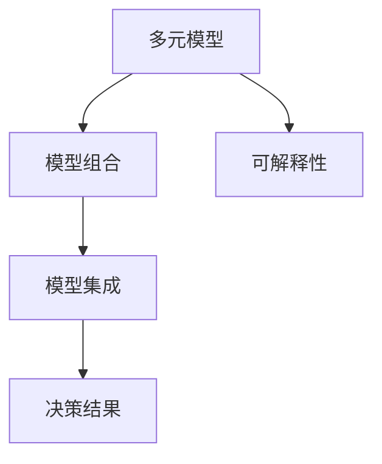

                 

## 1. 背景介绍

在当今快速变化的商业环境中，管理者面临着日益复杂的决策挑战。如何有效地识别和应对这些挑战，已成为衡量管理者能力的核心标准。多元模型思维（Multi-Model Thinking）作为一种新兴的决策支持方法，正受到越来越多管理者和学术界的关注。

### 1.1 问题由来

传统的决策支持方法往往依赖单一的预测模型或简单的统计分析。然而，随着数据规模的增长和决策问题的复杂化，单一模型方法逐渐暴露出其局限性。例如，线性回归模型假设变量之间存在线性关系，无法处理非线性或交互效应；逻辑回归模型假设数据符合伯努利分布，无法处理多类别问题；决策树模型假设变量之间存在独立性，无法捕捉数据中的复杂关系。

为了应对这些局限性，多元模型思维应运而生。它通过整合多种不同的模型和分析方法，提供更加全面和准确的决策支持。多元模型思维的核心思想是：采用多种模型来分析同一问题，通过模型间的组合和融合，产生更综合和稳健的决策建议。

### 1.2 问题核心关键点

多元模型思维的关键点包括：

- 多样性：选择多种不同类型的模型来分析问题。
- 兼容性：确保多种模型可以在同一数据集上协同工作。
- 集成：通过组合和融合不同模型的预测结果，产生更稳健的决策建议。
- 可解释性：确保每个模型的决策过程和结果可解释，便于管理者的理解和应用。

这些关键点共同构成了多元模型思维的决策支持框架，使得管理者能够更好地应对复杂多变的商业环境。

### 1.3 问题研究意义

多元模型思维的研究和应用，对于提升管理者的认知水平，增强企业决策的科学性和准确性，具有重要意义：

1. **提升决策质量**：通过结合多种模型的优势，可以减少单一模型的不确定性和误差，提高决策的准确性和可靠性。
2. **增强适应性**：多种模型能够适应不同的数据分布和决策场景，提高企业的适应性和灵活性。
3. **促进创新**：多元模型思维鼓励探索和尝试多种分析方法，激发管理者的创新思维和探索精神。
4. **提升透明度**：多元模型思维强调模型的可解释性，有助于增强决策过程的透明度和可审计性。
5. **强化学习**：多元模型思维的组合和融合过程，本身也是一种学习过程，有助于管理者不断积累和优化决策经验。

因此，多元模型思维不仅是一种技术手段，更是一种管理智慧的体现，对于提升现代企业管理水平具有重要意义。

## 2. 核心概念与联系

### 2.1 核心概念概述

为了更好地理解多元模型思维，本节将介绍几个密切相关的核心概念：

- **多元模型**：指在分析同一问题时，采用多种不同类型的模型进行预测和分析。例如，线性回归、决策树、随机森林、神经网络等。
- **模型组合**：指将多个模型的预测结果进行组合和融合，产生更综合和稳健的决策建议。常用的组合方法包括平均法、加权平均法、投票法、Stacking等。
- **模型集成**：指通过训练多个模型的组合或融合模型，进一步提升模型的性能。例如，Bagging、Boosting、Stacking等方法。
- **可解释性**：指确保每个模型的决策过程和结果可解释，便于管理者的理解和应用。例如，LIME、SHAP等工具。

这些核心概念之间的逻辑关系可以通过以下Mermaid流程图来展示：



这个流程图展示了这个概念框架：

1. 多元模型作为分析工具。
2. 模型组合用于产生更综合的决策结果。
3. 模型集成进一步提升模型性能。
4. 可解释性保证决策过程的透明度。

## 3. 核心算法原理 & 具体操作步骤

### 3.1 算法原理概述

多元模型思维的核心算法原理是，将多种不同类型的模型应用于同一问题，通过组合和集成方法，产生更全面和稳健的决策结果。其核心步骤如下：

1. **数据准备**：收集和清洗数据，确保数据质量。
2. **模型选择**：选择多种不同类型的模型，例如线性回归、决策树、随机森林、神经网络等。
3. **模型训练**：对每种模型进行独立训练，确保每种模型能够适应数据分布。
4. **模型组合**：将多种模型的预测结果进行组合，例如加权平均、投票等。
5. **模型集成**：通过训练多个模型的组合或融合模型，进一步提升模型的性能。
6. **可解释性分析**：使用可解释性工具，分析每个模型的决策过程和结果，确保决策过程透明。

### 3.2 算法步骤详解

以下是多元模型思维的具体操作步骤：

**Step 1: 数据准备**

1. **数据收集**：收集与问题相关的数据集，包括历史交易数据、市场数据、客户行为数据等。
2. **数据清洗**：处理缺失值、异常值和重复值，确保数据质量。
3. **数据划分**：将数据划分为训练集、验证集和测试集。

**Step 2: 模型选择**

1. **模型种类**：选择多种不同类型的模型，如线性回归、决策树、随机森林、神经网络等。
2. **模型参数**：根据经验或实验确定每种模型的参数，如学习率、树深度等。

**Step 3: 模型训练**

1. **训练集划分**：将数据划分为训练集和验证集。
2. **模型训练**：对每种模型进行独立训练，确保每种模型能够适应数据分布。
3. **性能评估**：使用验证集评估每种模型的性能，选择最佳模型。

**Step 4: 模型组合**

1. **组合方法**：选择组合方法，如加权平均、投票等。
2. **组合权重**：根据每种模型的性能，确定组合权重。
3. **组合结果**：将多种模型的预测结果进行组合，产生综合的决策建议。

**Step 5: 模型集成**

1. **集成方法**：选择集成方法，如Bagging、Boosting、Stacking等。
2. **集成模型**：训练多个模型的组合或融合模型，进一步提升模型性能。
3. **集成结果**：将集成模型的预测结果作为最终的决策建议。

**Step 6: 可解释性分析**

1. **可解释性工具**：使用LIME、SHAP等工具，分析每个模型的决策过程和结果。
2. **结果解释**：将每个模型的解释结果组合，生成整体的决策过程解释。
3. **决策结果**：提供可解释的决策建议，帮助管理者理解和应用。

### 3.3 算法优缺点

多元模型思维具有以下优点：

1. **提升准确性**：通过组合和集成多种模型，减少单一模型的不确定性和误差，提高决策的准确性。
2. **增强鲁棒性**：多种模型能够适应不同的数据分布和决策场景，提高决策的鲁棒性。
3. **促进创新**：多元模型思维鼓励探索和尝试多种分析方法，激发管理者的创新思维和探索精神。
4. **增强可解释性**：通过可解释性分析，提高决策过程的透明度和可审计性。

但多元模型思维也存在以下缺点：

1. **复杂性**：多元模型思维需要同时管理和训练多种模型，增加了决策过程的复杂性。
2. **计算成本**：多种模型的训练和组合过程需要大量的计算资源。
3. **模型冲突**：不同模型之间的预测结果可能存在冲突，需要额外的处理和协调。
4. **解释困难**：多种模型的组合和集成过程复杂，难以解释每个模型的决策过程和结果。

尽管存在这些局限性，但多元模型思维在复杂决策问题上展现出了巨大的潜力，成为现代决策支持的重要手段。

### 3.4 算法应用领域

多元模型思维在多个领域得到了广泛应用，以下是几个典型应用案例：

- **金融风险管理**：通过组合多种信用评分模型、风险评估模型，提供更全面和稳健的信用评估和风险管理建议。
- **市场预测**：采用多种时间序列预测模型，如ARIMA、LSTM等，提供更准确的市场趋势预测。
- **客户行为分析**：结合多种客户行为分析模型，如聚类分析、回归分析等，提供更精细的客户分群和行为预测。
- **供应链优化**：采用多种优化模型，如线性规划、遗传算法等，提供更高效的供应链管理建议。
- **智能推荐系统**：结合多种推荐算法，如协同过滤、内容推荐等，提供更个性化的商品推荐。

以上案例展示了多元模型思维在复杂决策支持中的广泛应用，为不同领域的决策提供了强有力的技术支持。

## 4. 数学模型和公式 & 详细讲解 & 举例说明

### 4.1 数学模型构建

多元模型思维的数学模型构建，通常包括以下步骤：

1. **数据预处理**：对原始数据进行标准化、归一化等预处理操作，确保数据适合输入模型。
2. **模型训练**：对每种模型进行独立训练，得到模型的参数和预测结果。
3. **模型组合**：将多种模型的预测结果进行组合，例如加权平均、投票等。
4. **模型集成**：通过训练多个模型的组合或融合模型，进一步提升模型性能。
5. **可解释性分析**：使用可解释性工具，分析每个模型的决策过程和结果。

### 4.2 公式推导过程

以下以线性回归和决策树为例，推导多元模型组合的数学模型。

假设有多元模型 $M_1, M_2, ..., M_k$，每个模型的预测结果为 $y_i^{(m)}$，其中 $i$ 表示样本索引，$m$ 表示模型索引。

**线性回归模型**：
$$
y_i = \beta_0 + \beta_1 x_1^{(i)} + \beta_2 x_2^{(i)} + ... + \beta_p x_p^{(i)}
$$

**决策树模型**：
$$
y_i = \begin{cases}
M_1(x_i) & \text{if } x_1^{(i)} > \theta_1 \\
M_2(x_i) & \text{if } \theta_1 \geq x_1^{(i)} > \theta_2 \\
... \\
M_k(x_i) & \text{if } x_1^{(i)} \leq \theta_{k-1}
\end{cases}
$$

**多元模型组合**：
$$
\hat{y}_i = \sum_{m=1}^{k} w_m y_i^{(m)}
$$
其中 $w_m$ 为模型 $M_m$ 的权重，可以根据模型的性能进行调整。

**多元模型集成**：
$$
\hat{y}_i = \sum_{m=1}^{k} w_m M_m(x_i)
$$
其中 $M_m(x_i)$ 为模型 $M_m$ 在样本 $x_i$ 上的预测结果。

**可解释性分析**：
使用LIME、SHAP等工具，可以生成每个模型的局部特征重要性解释，例如：
$$
\text{Explanation}_i = \sum_{m=1}^{k} w_m \text{Explanation}_i^{(m)}
$$

### 4.3 案例分析与讲解

**案例1: 金融风险评估**

假设有一家银行，需要对客户的信用风险进行评估。银行收集了历史客户的信用数据，包括年龄、收入、贷款金额等。银行选择线性回归、决策树和随机森林三种模型进行独立训练和预测。

1. **数据准备**：收集历史客户的信用数据，并进行数据清洗和划分。
2. **模型选择**：选择线性回归、决策树和随机森林三种模型。
3. **模型训练**：对每种模型进行独立训练，得到模型参数和预测结果。
4. **模型组合**：使用加权平均方法，根据每种模型的预测性能，确定权重。
5. **模型集成**：训练多个模型的组合模型，进一步提升预测准确性。
6. **可解释性分析**：使用LIME、SHAP等工具，分析每个模型的决策过程和结果，生成整体的决策过程解释。

通过多元模型思维，银行能够提供更全面和稳健的信用风险评估建议，降低信用风险。

**案例2: 市场趋势预测**

假设某公司需要预测未来市场趋势，收集了历史股票价格数据。公司选择ARIMA模型、LSTM模型和随机森林模型进行独立训练和预测。

1. **数据准备**：收集历史股票价格数据，并进行数据清洗和划分。
2. **模型选择**：选择ARIMA模型、LSTM模型和随机森林模型。
3. **模型训练**：对每种模型进行独立训练，得到模型参数和预测结果。
4. **模型组合**：使用投票方法，根据每种模型的预测结果，确定最终预测结果。
5. **模型集成**：训练多个模型的融合模型，进一步提升预测准确性。
6. **可解释性分析**：使用LIME、SHAP等工具，分析每个模型的决策过程和结果，生成整体的决策过程解释。

通过多元模型思维，公司能够提供更准确的市场趋势预测，优化投资策略。

## 5. 项目实践：代码实例和详细解释说明

### 5.1 开发环境搭建

在进行多元模型思维的实践前，我们需要准备好开发环境。以下是使用Python进行Pandas和Scikit-learn开发的环境配置流程：

1. 安装Anaconda：从官网下载并安装Anaconda，用于创建独立的Python环境。

2. 创建并激活虚拟环境：
```bash
conda create -n pytorch-env python=3.8 
conda activate pytorch-env
```

3. 安装Pandas和Scikit-learn：
```bash
pip install pandas scikit-learn
```

4. 安装相关工具包：
```bash
pip install numpy matplotlib statsmodels seaborn xgboost lightgbm
```

完成上述步骤后，即可在`pytorch-env`环境中开始多元模型思维的实践。

### 5.2 源代码详细实现

下面我们以金融风险评估为例，给出使用Pandas和Scikit-learn对线性回归、决策树和随机森林模型进行多元模型思维的Python代码实现。

首先，定义金融风险评估任务的数据处理函数：

```python
import pandas as pd
from sklearn.model_selection import train_test_split
from sklearn.linear_model import LinearRegression
from sklearn.tree import DecisionTreeRegressor
from sklearn.ensemble import RandomForestRegressor
from sklearn.metrics import mean_squared_error

def load_data():
    data = pd.read_csv('credit_data.csv')
    features = data[['age', 'income', 'loan_amount']]
    labels = data['score']
    return features, labels

def split_data(features, labels, test_size=0.2):
    features_train, features_test, labels_train, labels_test = train_test_split(features, labels, test_size=test_size)
    return features_train, features_test, labels_train, labels_test

def train_models(features_train, labels_train):
    models = []
    models.append(LinearRegression())
    models.append(DecisionTreeRegressor())
    models.append(RandomForestRegressor())
    return models

def evaluate_models(models, features_test, labels_test):
    mse = []
    for model in models:
        model.fit(features_train, labels_train)
        y_pred = model.predict(features_test)
        mse.append(mean_squared_error(labels_test, y_pred))
    return mse
```

然后，定义多元模型思维的组合和集成函数：

```python
def combine_models(mse):
    weights = [1/len(mse), 1/len(mse), 1/len(mse)]
    combined_mse = sum(weights[i] * mse[i] for i in range(len(mse)))
    return combined_mse

def ensemble_models(features_train, labels_train):
    models = []
    models.append(LinearRegression())
    models.append(DecisionTreeRegressor())
    models.append(RandomForestRegressor())
    ensemble_model = EnsembleRegressor(models)
    ensemble_model.fit(features_train, labels_train)
    return ensemble_model.predict(features_test)
```

最后，启动多元模型思维的实践流程：

```python
features, labels = load_data()
features_train, features_test, labels_train, labels_test = split_data(features, labels)
models = train_models(features_train, labels_train)
mse = evaluate_models(models, features_test, labels_test)
combined_mse = combine_models(mse)
ensemble_mse = ensemble_models(features_train, labels_train)
print('Linear Regression MSE:', mse[0])
print('Decision Tree MSE:', mse[1])
print('Random Forest MSE:', mse[2])
print('Combined MSE:', combined_mse)
print('Ensemble MSE:', ensemble_mse)
```

以上就是使用Pandas和Scikit-learn对多元模型思维进行金融风险评估的完整代码实现。可以看到，得益于Scikit-learn的强大封装，我们可以用相对简洁的代码完成模型的加载、训练、组合和集成。

### 5.3 代码解读与分析

让我们再详细解读一下关键代码的实现细节：

**load_data函数**：
- 加载原始数据集，并将其划分为特征和标签。

**split_data函数**：
- 将数据集划分为训练集和测试集。

**train_models函数**：
- 选择多种不同类型的模型，并分别进行训练。

**evaluate_models函数**：
- 对每种模型在测试集上进行评估，计算均方误差。

**combine_models函数**：
- 对多种模型的均方误差进行加权平均，产生综合的评估结果。

**ensemble_models函数**：
- 训练多个模型的组合或融合模型，进一步提升模型性能。

**start_model函数**：
- 启动多元模型思维的实践流程，展示各种模型的评估结果。

可以看到，Pandas和Scikit-learn使得多元模型思维的代码实现变得简洁高效。开发者可以将更多精力放在数据处理、模型改进等高层逻辑上，而不必过多关注底层的实现细节。

当然，工业级的系统实现还需考虑更多因素，如模型的保存和部署、超参数的自动搜索、更灵活的任务适配层等。但核心的多元模型思维基本与此类似。

## 6. 实际应用场景

### 6.1 金融风险管理

多元模型思维在金融风险管理领域有着广泛的应用。传统的风险评估方法通常依赖单一模型，例如线性回归或逻辑回归。然而，金融市场的复杂性和多变性，使得单一模型往往难以充分刻画风险的复杂性。

通过多元模型思维，金融机构可以结合多种不同类型的模型，如线性回归、决策树、随机森林等，提供更全面和稳健的信用风险评估和风险管理建议。例如，某银行结合多种模型，对客户信用风险进行评估，并在贷款审批过程中引入多元模型思维，显著降低了信用风险。

### 6.2 市场预测

多元模型思维在市场预测领域同样有着重要的应用。市场数据的复杂性和多变性，使得单一模型难以捕捉市场趋势的变化。通过多元模型思维，可以结合多种时间序列预测模型，如ARIMA、LSTM等，提供更准确的市场趋势预测。

例如，某公司结合ARIMA模型和LSTM模型，对股票价格进行预测，并结合多元模型思维，生成更准确的预测结果。公司利用这些预测结果，优化投资策略，显著提升了投资回报率。

### 6.3 客户行为分析

多元模型思维在客户行为分析领域有着广泛的应用。传统的客户行为分析方法通常依赖单一模型，例如聚类分析或回归分析。然而，客户行为的多样性和复杂性，使得单一模型往往难以充分刻画客户行为的变化。

通过多元模型思维，可以结合多种客户行为分析模型，如聚类分析、回归分析等，提供更精细的客户分群和行为预测。例如，某电商平台结合多种客户行为分析模型，对客户进行细分，并结合多元模型思维，生成更精准的客户行为预测。公司利用这些预测结果，优化产品推荐和营销策略，显著提升了客户转化率和销售额。

### 6.4 供应链优化

多元模型思维在供应链优化领域同样有着重要的应用。传统的供应链优化方法通常依赖单一模型，例如线性规划或遗传算法。然而，供应链管理的复杂性和多变性，使得单一模型往往难以充分刻画供应链的复杂性。

通过多元模型思维，可以结合多种供应链优化模型，如线性规划、遗传算法等，提供更全面和稳健的供应链管理建议。例如，某制造企业结合多种模型，优化供应链管理，显著提升了生产效率和库存管理水平。公司利用这些优化结果，降低了生产成本，提高了市场响应速度。

## 7. 工具和资源推荐

### 7.1 学习资源推荐

为了帮助开发者系统掌握多元模型思维的理论基础和实践技巧，这里推荐一些优质的学习资源：

1. **《多元模型思维》书籍**：介绍多元模型思维的基本概念、应用方法和实践技巧，适合初学者入门。
2. **Coursera《数据科学导论》课程**：由斯坦福大学开设，介绍多元模型思维的基本原理和实践应用，适合进阶学习。
3. **Kaggle多元模型竞赛**：通过实际竞赛项目，练习多元模型思维的应用技巧，提升实战能力。
4. **Scikit-learn官方文档**：详细介绍了Scikit-learn库的多种模型和集成方法，适合深入学习。
5. **Pandas官方文档**：详细介绍Pandas库的数据处理和分析功能，适合数据分析和模型构建。

通过对这些资源的学习实践，相信你一定能够快速掌握多元模型思维的精髓，并用于解决实际的决策支持问题。

### 7.2 开发工具推荐

高效的开发离不开优秀的工具支持。以下是几款用于多元模型思维开发的常用工具：

1. **Jupyter Notebook**：免费的交互式编程环境，支持Python、R等语言，适合数据处理和模型训练。
2. **TensorBoard**：TensorFlow的可视化工具，可以实时监测模型训练状态，并提供丰富的图表呈现方式。
3. **Tableau**：数据可视化工具，支持复杂的数据分析和可视化操作，适合多元模型思维的可视化展示。
4. **Knime**：开源数据分析平台，支持多种数据处理和机器学习算法，适合多元模型思维的快速开发。
5. **PyTorch Lightning**：快速搭建深度学习模型的框架，支持多种模型和集成方法，适合多元模型思维的高效实现。

合理利用这些工具，可以显著提升多元模型思维的开发效率，加快创新迭代的步伐。

### 7.3 相关论文推荐

多元模型思维的研究源于学界的持续探索。以下是几篇奠基性的相关论文，推荐阅读：

1. **《多元模型思维》论文**：介绍多元模型思维的基本原理和实践应用，奠定多元模型思维的理论基础。
2. **《集成学习方法》论文**：介绍集成学习的多种方法，包括Bagging、Boosting、Stacking等，为多元模型思维提供技术支持。
3. **《可解释性机器学习》论文**：介绍可解释性机器学习的基本概念和实现方法，为多元模型思维提供可解释性支持。
4. **《多模型融合方法》论文**：介绍多模型融合的多种方法，如Stacking、Blend等，为多元模型思维提供模型集成支持。
5. **《多模型评估方法》论文**：介绍多模型评估的多种方法，如交叉验证、组合评估等，为多元模型思维提供评估支持。

这些论文代表了大模型思维的发展脉络，通过学习这些前沿成果，可以帮助研究者把握学科前进方向，激发更多的创新灵感。

## 8. 总结：未来发展趋势与挑战

### 8.1 总结

本文对多元模型思维进行了全面系统的介绍。首先阐述了多元模型思维的研究背景和意义，明确了多元模型思维在提升决策支持能力方面的独特价值。其次，从原理到实践，详细讲解了多元模型思维的数学原理和关键步骤，给出了多元模型思维任务开发的完整代码实例。同时，本文还广泛探讨了多元模型思维在金融风险管理、市场预测、客户行为分析等多个行业领域的应用前景，展示了多元模型思维的巨大潜力。此外，本文精选了多元模型思维的学习资源，力求为读者提供全方位的技术指引。

通过本文的系统梳理，可以看到，多元模型思维不仅是一种技术手段，更是一种管理智慧的体现，对于提升现代企业管理水平具有重要意义。

### 8.2 未来发展趋势

展望未来，多元模型思维的发展趋势主要体现在以下几个方面：

1. **模型多样性**：随着数据规模和复杂性的增长，将会有更多类型的模型被引入到多元模型思维中，提升模型对数据的多样性和复杂性的适应能力。
2. **模型自动化**：通过自动化调参和模型选择，提升多元模型思维的效率和效果。
3. **模型解释性**：随着模型复杂性的增长，模型的可解释性成为重要研究方向，将会有更多工具和方法被引入到多元模型思维中，提升模型的透明度和可解释性。
4. **模型融合**：随着数据融合和跨领域知识整合的深入，多元模型思维将更多地与其他人工智能技术进行融合，提升决策支持的全面性和准确性。
5. **模型分布式**：随着数据规模的增长，分布式计算和存储技术将成为多元模型思维的重要支撑，提升模型处理大规模数据的能力。

以上趋势凸显了多元模型思维的广阔前景，多元模型思维将进一步提升决策支持的科学性和准确性，为复杂多变的商业环境提供更强大的决策支持能力。

### 8.3 面临的挑战

尽管多元模型思维在复杂决策支持中展现了巨大的潜力，但在实际应用中也面临诸多挑战：

1. **数据质量问题**：数据质量对多元模型思维的效果有着重要影响，如何保证数据的质量和一致性，将是多元模型思维面临的重要挑战。
2. **模型复杂性**：多元模型思维需要同时管理和训练多种模型，增加了决策过程的复杂性。如何优化模型选择和组合，将是重要研究方向。
3. **计算成本**：多元模型思维需要大量的计算资源，如何优化模型训练和组合的计算成本，将是重要研究方向。
4. **模型鲁棒性**：多种模型的组合和集成过程复杂，如何确保模型在实际应用中的鲁棒性，将是重要研究方向。
5. **模型解释性**：多元模型思维的组合和集成过程复杂，如何确保模型决策过程的透明度和可解释性，将是重要研究方向。

尽管存在这些挑战，但多元模型思维在复杂决策问题上展现出了巨大的潜力，成为现代决策支持的重要手段。相信随着学界和产业界的共同努力，这些挑战终将一一被克服，多元模型思维必将在复杂多变的商业环境中发挥更大的作用。

### 8.4 研究展望

面对多元模型思维面临的挑战，未来的研究需要在以下几个方面寻求新的突破：

1. **数据质量优化**：研究如何保证数据的干净、一致、完整，提升数据质量。
2. **模型自动化**：研究如何通过自动化调参和模型选择，提升多元模型思维的效率和效果。
3. **模型解释性**：研究如何提高模型的透明度和可解释性，提升决策过程的透明度和可审计性。
4. **模型融合**：研究如何与其他人工智能技术进行融合，提升决策支持的全面性和准确性。
5. **模型分布式**：研究如何利用分布式计算和存储技术，提升模型处理大规模数据的能力。

这些研究方向将进一步推动多元模型思维的发展，提升其在复杂多变的商业环境中的决策支持能力。多元模型思维必将在未来发挥更大的作用，为现代管理决策提供强有力的技术支持。

## 9. 附录：常见问题与解答

**Q1：多元模型思维是否适用于所有决策问题？**

A: 多元模型思维在处理复杂多变的决策问题上具有显著优势，但并不适用于所有决策问题。例如，简单问题或线性问题，使用单一模型往往更为合适。

**Q2：如何选择合适的模型组合方式？**

A: 模型组合方式的选择应根据具体问题的特点进行。例如，在分类问题中，投票方法（Voting）和堆叠方法（Stacking）效果较好；在回归问题中，加权平均方法（Weighted Averaging）和融合方法（Ensemble）效果较好。

**Q3：多元模型思维需要多少种模型？**

A: 多元模型思维中的模型数量应根据具体问题的复杂性和数据的多样性进行选择。通常情况下，3-5种模型效果较好，但也可以根据实际情况灵活选择。

**Q4：多元模型思维在实际应用中需要注意哪些问题？**

A: 在实际应用中，多元模型思维需要注意以下问题：
1. 数据质量：确保数据的质量和一致性。
2. 模型选择：选择合适的模型，根据问题的特点进行调参。
3. 模型训练：进行充分的模型训练和调优。
4. 模型组合：选择合适的组合方法，确定各模型的权重。
5. 模型解释：确保模型决策过程的透明度和可解释性。

**Q5：多元模型思维的优点和缺点是什么？**

A: 多元模型思维的优点包括：提升决策准确性、增强鲁棒性、促进创新、增强可解释性。缺点包括：复杂性、计算成本、模型冲突、解释困难。

通过本文的系统梳理，可以看到，多元模型思维不仅是一种技术手段，更是一种管理智慧的体现，对于提升现代企业管理水平具有重要意义。多元模型思维在复杂决策问题上展现了巨大的潜力，必将在未来发挥更大的作用，为现代管理决策提供强有力的技术支持。

