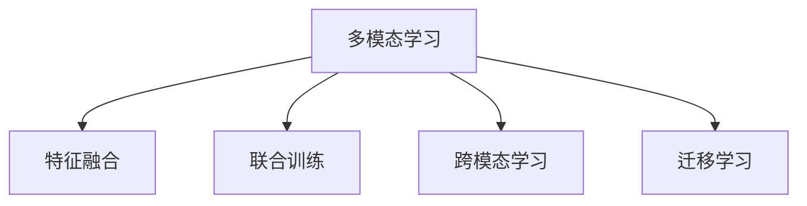

                 

## 1. 背景介绍

### 1.1 问题由来
随着人工智能(AI)技术的飞速发展，多模态学习(Multi-modal Learning)逐渐成为AI研究的热点方向之一。多模态学习通过结合多种感官数据的优势，提升了AI系统的感知和理解能力，使其能够更准确、全面地处理现实世界复杂多样的信息。在图像、音频和视频等感知模态上，多模态学习已经展现出巨大的潜力，并成功应用于自动驾驶、医疗诊断、智能家居等众多领域。

当前，图像、音频和视频处理技术已经高度成熟，并广泛应用于各个行业。然而，传统的图像、音频和视频处理技术往往是基于单一模态的，难以充分利用多模态信息的互补优势，从而提升系统性能。多模态AI应用能够更自然地融合多种信息源，进一步提高系统的准确性和鲁棒性。因此，本文旨在全面阐述多模态AI应用的原理与技术，分析其应用前景，探讨未来的发展趋势和挑战。

### 1.2 问题核心关键点
多模态AI应用的核心在于如何融合多种模态数据，提升系统性能。目前，多模态AI应用的主流方法包括：
- 特征融合(Feature Fusion)：将不同模态的特征进行融合，生成统一的表示，以提升模型的整体性能。
- 联合训练(Joint Training)：同时训练多模态数据，共享网络结构，使得每个模态的模型都能学习到其他模态的信息。
- 跨模态学习(Cross-modal Learning)：利用低维空间映射或对抗训练等方式，使不同模态的数据能够在高维空间内进行相互转换，实现信息共享。
- 迁移学习(Transfer Learning)：将预训练的单模态模型或特征提取器，迁移到其他模态的学习任务中，提高系统的泛化能力。

## 2. 核心概念与联系

### 2.1 核心概念概述

为了更好地理解多模态AI应用，本节将介绍几个密切相关的核心概念：

- **多模态学习(Multi-modal Learning)**：通过结合多种感官数据的优势，提升AI系统的感知和理解能力。常见的多模态数据包括图像、音频、视频、文本等。
- **特征融合(Feature Fusion)**：将不同模态的特征进行融合，生成统一的表示，以提升模型的整体性能。
- **联合训练(Joint Training)**：同时训练多模态数据，共享网络结构，使得每个模态的模型都能学习到其他模态的信息。
- **跨模态学习(Cross-modal Learning)**：利用低维空间映射或对抗训练等方式，使不同模态的数据能够在高维空间内进行相互转换，实现信息共享。
- **迁移学习(Transfer Learning)**：将预训练的单模态模型或特征提取器，迁移到其他模态的学习任务中，提高系统的泛化能力。

这些核心概念之间的逻辑关系可以通过以下Mermaid流程图来展示：



这个流程图展示了多模态AI学习的主要过程：

1. 多模态学习：通过结合多种模态数据，提升AI系统的感知和理解能力。
2. 特征融合：将不同模态的特征进行融合，生成统一的表示。
3. 联合训练：同时训练多模态数据，共享网络结构。
4. 跨模态学习：通过低维空间映射或对抗训练，实现不同模态数据之间的相互转换。
5. 迁移学习：将预训练的单模态模型或特征提取器，迁移到其他模态的学习任务中，提高系统的泛化能力。

这些核心概念共同构成了多模态AI应用的基础，使得系统能够更好地理解和处理复杂的多模态信息。

## 3. 核心算法原理 & 具体操作步骤
### 3.1 算法原理概述

多模态AI应用的核心在于如何将不同模态的数据进行有效融合和处理。常见的方法包括特征融合、联合训练、跨模态学习和迁移学习等。本节将重点介绍特征融合和联合训练这两种方法，并简要说明其原理和操作步骤。

### 3.2 算法步骤详解

#### 3.2.1 特征融合

特征融合是指将不同模态的特征进行组合，生成统一的表示。常见的特征融合方法包括：

1. **特征拼接(Feature Concatenation)**：将不同模态的特征向量直接拼接在一起。例如，将图像特征和音频特征拼接，形成新的特征向量。
2. **特征加权融合(Weighted Fusion)**：根据不同模态的重要性，对特征向量进行加权处理。例如，给图像特征较高的权重，给音频特征较低的权重。
3. **基于深度学习的网络融合(Network Fusion)**：使用深度神经网络对不同模态的特征进行融合，生成高维表示。例如，使用卷积神经网络(CNN)对图像特征进行提取，使用循环神经网络(RNN)对音频特征进行提取，然后将提取结果输入全连接网络进行融合。

特征融合的具体步骤如下：

1. 对不同模态的输入数据进行预处理，例如，对图像进行裁剪、归一化处理，对音频进行分帧、特征提取。
2. 使用特定的特征融合方法，将不同模态的特征进行组合，形成新的特征向量。
3. 将融合后的特征向量输入深度学习模型进行训练和推理。

#### 3.2.2 联合训练

联合训练是指同时训练多个模态的数据，共享网络结构，使得每个模态的模型都能学习到其他模态的信息。常见的联合训练方法包括：

1. **单塔训练(Single-Tower Training)**：使用一个共享的深度神经网络，对不同模态的数据进行联合训练。例如，使用卷积神经网络对图像特征进行提取，使用循环神经网络对音频特征进行提取，然后将提取结果输入全连接网络进行联合训练。
2. **多塔训练(Multi-Tower Training)**：使用多个独立的深度神经网络，分别对不同模态的数据进行训练，然后在高维空间中对不同模态的表示进行联合训练。例如，使用一个图像卷积神经网络和另一个音频卷积神经网络分别对图像和音频进行提取，然后将提取结果在高维空间中进行联合训练。

联合训练的具体步骤如下：

1. 对不同模态的输入数据进行预处理，例如，对图像进行裁剪、归一化处理，对音频进行分帧、特征提取。
2. 使用特定的联合训练方法，对不同模态的特征进行联合训练，生成高维表示。
3. 将联合训练后的高维表示输入深度学习模型进行训练和推理。

### 3.3 算法优缺点

特征融合和联合训练这两种方法具有以下优点：

1. **提升系统性能**：通过融合不同模态的特征，生成统一的表示，提升了系统的整体性能。
2. **提高泛化能力**：在联合训练中，不同模态的模型共享网络结构，可以更好地学习到数据的联合特征，提高系统的泛化能力。
3. **简化模型结构**：联合训练可以简化模型结构，减少模型的参数量和计算量，提高模型的训练和推理效率。

同时，这两种方法也存在一些局限性：

1. **计算复杂度高**：由于涉及多个模态的特征，计算复杂度较高，需要较大的计算资源和存储空间。
2. **模型训练难度大**：在特征融合和联合训练中，需要调整多个模态的特征权重，训练难度较大。
3. **数据处理复杂**：不同模态的数据格式和处理方式不同，需要进行复杂的数据处理和预处理。

尽管存在这些局限性，但特征融合和联合训练在多模态AI应用中依然具有重要的地位，特别是在需要高效融合多种模态信息的任务中，如自动驾驶、医疗诊断等。

### 3.4 算法应用领域

特征融合和联合训练在多个领域中得到了广泛的应用，以下是几个典型的应用场景：

1. **自动驾驶**：自动驾驶系统需要同时处理图像、雷达、激光雷达等多种传感器的数据，通过特征融合和联合训练，将不同模态的数据进行融合，提高系统的感知和决策能力。
2. **医疗诊断**：医疗影像、生理信号、病历等多种模态数据需要融合，通过特征融合和联合训练，提升系统的诊断准确性和可靠性。
3. **智能家居**：智能家居系统需要融合音频、视频、文本等多种数据，通过特征融合和联合训练，提高系统的感知和交互能力。
4. **视频分析**：视频分析系统需要融合图像、音频、文字等多种模态数据，通过特征融合和联合训练，提高系统的识别和分析能力。

这些领域中，特征融合和联合训练的多模态处理方法显著提升了系统的性能和鲁棒性，为多模态AI应用的发展提供了坚实的基础。

## 4. 数学模型和公式 & 详细讲解  
### 4.1 数学模型构建

本节将使用数学语言对特征融合和联合训练的方法进行更加严格的刻画。

假设有多模态数据 $X=(X^1,X^2,\dots,X^M)$，其中 $X^m=(X^m_1,X^m_2,\dots,X^m_n)$ 表示第 $m$ 个模态的 $n$ 个样本，$X^m_i$ 表示第 $i$ 个样本的第 $m$ 个模态特征。

定义特征融合函数 $F(\cdot)$，对不同模态的特征进行融合，生成统一的表示 $Z=(Z_1,Z_2,\dots,Z_n)$，其中 $Z_i=F(X^1_i,X^2_i,\dots,X^M_i)$。

定义联合训练函数 $G(\cdot)$，对多模态数据进行联合训练，生成高维表示 $Y=(Y_1,Y_2,\dots,Y_n)$，其中 $Y_i=G(X^1_i,X^2_i,\dots,X^M_i)$。

### 4.2 公式推导过程

以下我们以图像-音频融合为例，推导联合训练过程的数学公式。

假设图像特征 $X^1$ 为 $n\times h\times w\times c$ 的张量，音频特征 $X^2$ 为 $T\times F$ 的张量，其中 $n$ 表示样本数，$h$ 和 $w$ 表示图像的宽度和高度，$c$ 表示图像的通道数，$T$ 表示音频的时间步长，$F$ 表示音频的特征维度。

定义特征融合函数 $F$ 为：

$$
Z_i = F(X^1_i,X^2_i) = W_F(X^1_i) + W_A(X^2_i)
$$

其中 $W_F$ 和 $W_A$ 为两个线性变换矩阵，分别对图像和音频特征进行映射，生成新的特征向量 $Z_i$。

定义联合训练函数 $G$ 为：

$$
Y_i = G(X^1_i,X^2_i) = [W_1X^1_i + W_2X^2_i + b_1]^T
$$

其中 $W_1$ 和 $W_2$ 为两个线性变换矩阵，$b_1$ 为偏置项，$Y_i$ 表示联合训练后的高维表示。

在得到联合训练的数学公式后，即可带入深度学习模型进行训练和推理。

## 5. 项目实践：代码实例和详细解释说明
### 5.1 开发环境搭建

在进行多模态AI应用开发前，我们需要准备好开发环境。以下是使用Python进行TensorFlow开发的环境配置流程：

1. 安装Anaconda：从官网下载并安装Anaconda，用于创建独立的Python环境。

2. 创建并激活虚拟环境：
```bash
conda create -n tf-env python=3.8 
conda activate tf-env
```

3. 安装TensorFlow：根据CUDA版本，从官网获取对应的安装命令。例如：
```bash
conda install tensorflow -c pytorch -c conda-forge
```

4. 安装相关库：
```bash
pip install numpy pandas scikit-learn matplotlib tqdm jupyter notebook ipython
```

完成上述步骤后，即可在`tf-env`环境中开始多模态AI应用开发。

### 5.2 源代码详细实现

这里我们以图像-音频融合的联合训练为例，给出使用TensorFlow进行图像-音频融合的代码实现。

首先，定义数据处理函数：

```python
import tensorflow as tf
from tensorflow.keras import layers, models

def preprocess(X):
    # 对图像和音频进行预处理
    # 图像预处理，例如裁剪、归一化
    # 音频预处理，例如分帧、特征提取
    pass
```

然后，定义模型和优化器：

```python
def build_model():
    # 定义图像和音频的卷积神经网络
    # 图像卷积神经网络
    # 音频卷积神经网络
    # 将图像和音频的特征进行融合
    # 定义联合训练的神经网络
    # 定义损失函数和优化器
    pass

model = build_model()
optimizer = tf.keras.optimizers.Adam(lr=0.001)
```

接着，定义训练和评估函数：

```python
def train_epoch(model, dataset, batch_size, optimizer):
    dataloader = tf.data.Dataset.from_tensor_slices(dataset).shuffle(buffer_size=10000).batch(batch_size)
    for batch in dataloader:
        inputs, labels = batch
        with tf.GradientTape() as tape:
            outputs = model(inputs)
            loss = tf.keras.losses.categorical_crossentropy(labels, outputs)
        gradients = tape.gradient(loss, model.trainable_variables)
        optimizer.apply_gradients(zip(gradients, model.trainable_variables))
    return loss

def evaluate(model, dataset, batch_size):
    dataloader = tf.data.Dataset.from_tensor_slices(dataset).shuffle(buffer_size=10000).batch(batch_size)
    total_loss = 0
    for batch in dataloader:
        inputs, labels = batch
        outputs = model(inputs)
        loss = tf.keras.losses.categorical_crossentropy(labels, outputs)
        total_loss += loss.numpy()
    return total_loss / len(dataset)
```

最后，启动训练流程并在测试集上评估：

```python
epochs = 10
batch_size = 32

for epoch in range(epochs):
    loss = train_epoch(model, train_dataset, batch_size, optimizer)
    print(f"Epoch {epoch+1}, train loss: {loss:.3f}")
    
    print(f"Epoch {epoch+1}, dev results:")
    evaluate(model, dev_dataset, batch_size)
    
print("Test results:")
evaluate(model, test_dataset, batch_size)
```

以上就是使用TensorFlow进行图像-音频融合的联合训练的完整代码实现。可以看到，TensorFlow提供的高级API使得多模态AI应用开发变得更加简单和高效。

### 5.3 代码解读与分析

让我们再详细解读一下关键代码的实现细节：

**preprocess函数**：
- 对图像和音频进行预处理，例如，对图像进行裁剪、归一化处理，对音频进行分帧、特征提取。

**build_model函数**：
- 定义图像和音频的卷积神经网络。
- 将图像和音频的特征进行融合，生成新的特征向量。
- 定义联合训练的神经网络。
- 定义损失函数和优化器。

**train_epoch函数**：
- 对数据集进行批次化加载。
- 在每个批次上进行前向传播计算损失函数。
- 反向传播计算梯度，使用优化器更新模型参数。

**evaluate函数**：
- 对数据集进行批次化加载。
- 在每个批次上进行前向传播计算损失函数。
- 计算平均损失，返回测试集的损失。

**训练流程**：
- 定义总的epoch数和batch size，开始循环迭代。
- 每个epoch内，在训练集上训练，输出平均loss。
- 在验证集上评估，输出分类指标。
- 所有epoch结束后，在测试集上评估，给出最终测试结果。

可以看到，TensorFlow提供了丰富的API和工具，使得多模态AI应用的开发变得高效、简单。开发者可以利用TensorFlow提供的高级API，快速搭建和训练多模态模型。

当然，工业级的系统实现还需考虑更多因素，如模型的保存和部署、超参数的自动搜索、更灵活的任务适配层等。但核心的多模态处理流程基本与此类似。

## 6. 实际应用场景
### 6.1 智能安防

多模态AI应用在智能安防领域有着广泛的应用。智能安防系统需要同时处理图像、视频、声音等多种信息，通过多模态处理技术，可以提高系统的感知和识别能力。

在实际应用中，智能安防系统可以结合摄像头、麦克风等多种传感器，实时采集现场的图像、视频和声音数据，通过特征融合和联合训练，生成统一的表示，提高系统的识别准确性和鲁棒性。例如，在视频监控中，可以结合图像特征和声音特征，识别出可疑行为，实时预警。

### 6.2 医疗诊断

多模态AI应用在医疗诊断领域也具有重要的应用价值。医疗影像、生理信号、病历等多种模态数据需要融合，通过多模态处理技术，可以提高系统的诊断准确性和可靠性。

在实际应用中，多模态AI可以结合医学影像、生理信号、病历等多种数据，通过特征融合和联合训练，生成统一的表示，提高系统的诊断准确性。例如，在医疗影像中，可以结合图像特征和生理信号特征，识别出病变区域，提供诊断建议。

### 6.3 智能家居

多模态AI应用在智能家居领域也有着广泛的应用。智能家居系统需要融合音频、视频、文本等多种数据，通过多模态处理技术，可以提高系统的感知和交互能力。

在实际应用中，智能家居系统可以结合摄像头、麦克风、语音助手等多种设备，实时采集用户的图像、音频和语音数据，通过特征融合和联合训练，生成统一的表示，提高系统的感知和交互能力。例如，在智能音箱中，可以结合音频特征和文本特征，实现语音识别和文本转写，提高系统的交互体验。

### 6.4 未来应用展望

随着多模态AI应用的不断成熟，未来将会在更多领域得到广泛应用，为各行各业带来深刻的变革：

1. **智慧城市**：多模态AI可以应用于智慧城市的各个环节，如智能交通、智能安防、智能环境监测等，提高城市管理的自动化和智能化水平，构建更安全、高效的未来城市。
2. **智能制造**：多模态AI可以应用于智能制造的各个环节，如智能检测、智能调度、智能预测等，提高生产效率和质量，降低成本。
3. **智能农业**：多模态AI可以应用于智能农业的各个环节，如智能种植、智能监测、智能预测等，提高农业生产的智能化水平，促进农业现代化。
4. **智能教育**：多模态AI可以应用于智能教育的各个环节，如智能评估、智能推荐、智能教学等，提高教学质量和效率，促进教育公平。
5. **智能医疗**：多模态AI可以应用于智能医疗的各个环节，如智能诊断、智能监测、智能治疗等，提高医疗服务的智能化水平，提升医疗效果。

总之，多模态AI应用将在更多领域发挥重要作用，带来深远影响。未来，随着技术的不断进步和应用的不断深入，多模态AI将展现出更加广阔的应用前景。

## 7. 工具和资源推荐
### 7.1 学习资源推荐

为了帮助开发者系统掌握多模态AI应用的理论基础和实践技巧，这里推荐一些优质的学习资源：

1. **《深度学习基础》课程**：由斯坦福大学开设的深度学习基础课程，讲解了深度学习的基本概念和算法，适合初学者入门。
2. **《多模态学习综述》论文**：详细介绍了多模态学习的各种方法和应用场景，是研究多模态学习的必读文献。
3. **TensorFlow官方文档**：TensorFlow官方文档提供了丰富的API和示例代码，是学习多模态AI应用的理想资料。
4. **《多模态学习》书籍**：由多模态学习领域的专家撰写，全面介绍了多模态学习的基本概念、方法和应用场景。
5. **Kaggle竞赛平台**：Kaggle是一个数据科学竞赛平台，可以参与多模态数据处理的竞赛，积累实际经验。

通过对这些资源的学习实践，相信你一定能够快速掌握多模态AI应用的精髓，并用于解决实际的AI问题。

### 7.2 开发工具推荐

多模态AI应用需要综合处理图像、音频、视频等多种数据，选择合适的开发工具至关重要。以下是几款用于多模态AI应用开发的常用工具：

1. **OpenCV**：开源计算机视觉库，提供了丰富的图像处理和计算机视觉算法，适用于图像处理任务。
2. **Librosa**：开源音频处理库，提供了丰富的音频处理和特征提取算法，适用于音频处理任务。
3. **TensorFlow**：由Google主导开发的深度学习框架，支持多模态数据处理，适用于深度学习任务。
4. **PyTorch**：由Facebook主导开发的深度学习框架，支持多模态数据处理，适用于深度学习任务。
5. **Amazon SageMaker**：AWS提供的云机器学习服务，支持多模态数据处理，适用于云部署任务。

合理利用这些工具，可以显著提升多模态AI应用的开发效率，加速创新迭代的步伐。

### 7.3 相关论文推荐

多模态AI应用的研究始于学术界的持续探索。以下是几篇奠基性的相关论文，推荐阅读：

1. **《多模态学习综述》**：详细介绍了多模态学习的各种方法和应用场景，是研究多模态学习的必读文献。
2. **《跨模态表示学习》**：介绍了多种跨模态表示学习方法，包括基于低维空间映射和对抗训练的方法。
3. **《多模态深度学习》**：全面介绍了多模态深度学习的各种方法和应用场景，是深度学习领域的经典文献。
4. **《多模态数据融合方法》**：介绍了多种多模态数据融合方法，包括特征拼接、特征加权融合、网络融合等。
5. **《联合训练方法》**：介绍了多种联合训练方法，包括单塔训练、多塔训练、对抗训练等。

这些论文代表了大规模学习技术的发展脉络。通过学习这些前沿成果，可以帮助研究者把握学科前进方向，激发更多的创新灵感。

## 8. 总结：未来发展趋势与挑战
### 8.1 总结

本文对多模态AI应用的原理与技术进行了全面系统的介绍。首先阐述了多模态学习的背景和意义，明确了多模态学习在提升系统性能方面的独特价值。其次，从原理到实践，详细讲解了特征融合和联合训练的方法，给出了多模态AI应用的完整代码实现。同时，本文还广泛探讨了多模态AI应用在智能安防、医疗诊断、智能家居等诸多领域的应用前景，展示了多模态AI应用的广阔前景。最后，本文精选了多模态AI应用的各类学习资源，力求为读者提供全方位的技术指引。

通过本文的系统梳理，可以看到，多模态AI应用正在成为AI研究的热点方向之一，极大地提升了系统的感知和理解能力。未来，随着多模态AI应用的不断成熟，将在更多领域得到应用，为各行各业带来深刻的变革。

### 8.2 未来发展趋势

展望未来，多模态AI应用将呈现以下几个发展趋势：

1. **模型规模不断增大**：随着算力成本的下降和数据规模的扩张，多模态AI应用的模型规模将持续增大，能够处理更复杂的多模态信息。
2. **融合方式更加多样**：未来将涌现更多融合方式，如基于注意力机制的融合、基于联合训练的融合等，提升系统的整体性能。
3. **跨模态学习逐步成熟**：跨模态学习技术将更加成熟，能够在不同模态之间实现高效的信息共享，提升系统的泛化能力。
4. **联合训练逐步普及**：联合训练将成为多模态AI应用的标准方法，广泛应用于各个领域，提升系统的性能和鲁棒性。
5. **多模态迁移学习兴起**：多模态迁移学习将成为热门研究方向，通过预训练的单模态模型或特征提取器，迁移到其他模态的学习任务中，提高系统的泛化能力。

以上趋势凸显了多模态AI应用的广阔前景。这些方向的探索发展，必将进一步提升多模态AI应用的性能和应用范围，为人工智能技术的落地应用提供新的方向。

### 8.3 面临的挑战

尽管多模态AI应用已经取得了显著成果，但在迈向更加智能化、普适化应用的过程中，它仍面临着诸多挑战：

1. **计算资源需求大**：多模态数据的处理和融合需要较大的计算资源，未来随着模型规模的增大，计算需求将进一步增加。
2. **数据处理复杂**：不同模态的数据格式和处理方式不同，需要进行复杂的数据处理和预处理，增加了系统的开发难度。
3. **模型训练难度大**：在特征融合和联合训练中，需要调整多个模态的特征权重，训练难度较大。
4. **系统复杂度高**：多模态AI应用的系统架构复杂度高，需要进行全面的系统设计和优化。
5. **应用场景多样化**：不同应用场景对多模态AI的要求不同，需要针对不同的应用场景进行定制化开发。

尽管存在这些挑战，但多模态AI应用具有广阔的发展前景和应用空间，未来仍需通过技术创新和工程优化，进一步提升多模态AI应用的性能和应用范围。

### 8.4 研究展望

面对多模态AI应用所面临的挑战，未来的研究需要在以下几个方面寻求新的突破：

1. **高效的多模态数据融合方法**：开发更加高效的多模态数据融合方法，减少计算资源消耗，提高系统性能。
2. **鲁棒的多模态数据处理技术**：开发鲁棒的多模态数据处理技术，减少数据处理和预处理的复杂度，提高系统可扩展性。
3. **高效的多模态联合训练方法**：开发高效的多模态联合训练方法，提高模型训练效率，降低训练难度。
4. **可解释的多模态AI应用**：开发可解释的多模态AI应用，提高系统的可解释性和可控性，增强用户信任。
5. **跨模态迁移学习**：开发跨模态迁移学习技术，将预训练的单模态模型或特征提取器，迁移到其他模态的学习任务中，提高系统的泛化能力。
6. **多模态用户交互技术**：开发多模态用户交互技术，提高系统的交互体验，增强用户体验。

这些研究方向将为多模态AI应用提供新的技术突破，推动多模态AI应用的普及和应用。面向未来，多模态AI应用还需与其他人工智能技术进行更深入的融合，如知识表示、因果推理、强化学习等，共同推动多模态AI应用的发展。只有勇于创新、敢于突破，才能不断拓展多模态AI应用的边界，为人工智能技术带来新的突破。

## 9. 附录：常见问题与解答

**Q1：多模态AI应用是否适用于所有任务？**

A: 多模态AI应用在处理多种模态数据时具有显著的优势，但在某些特定任务上可能不如单模态处理。例如，对于需要高度依赖单一模态的任务，如文本分类，多模态处理可能反而降低系统性能。因此，在选择任务时，需要根据具体情况综合考虑，选择最适合的多模态处理方法。

**Q2：多模态AI应用是否需要大量的标注数据？**

A: 多模态AI应用对标注数据的需求较高，但可以通过迁移学习和多模态数据融合技术，减少标注数据的依赖。例如，通过预训练的单模态模型或特征提取器，迁移到其他模态的任务中，可以显著减少标注数据的需求。

**Q3：多模态AI应用是否适合实时处理？**

A: 多模态AI应用对实时处理的要求较高，需要高效的数据处理和模型推理。因此，在实时应用场景中，需要优化数据预处理和模型推理流程，以提高系统的响应速度。

**Q4：多模态AI应用在实际应用中是否需要复杂的数据预处理？**

A: 多模态AI应用需要综合处理多种模态数据，数据预处理是必不可少的环节。例如，对图像进行裁剪、归一化处理，对音频进行分帧、特征提取等，这些预处理步骤在提高系统性能方面起到了重要作用。

**Q5：多模态AI应用在实际应用中是否需要复杂的模型结构？**

A: 多模态AI应用需要处理多种模态数据，模型结构相对复杂。但随着深度学习技术的不断发展，模型结构越来越简洁高效，如Transformer结构，可以很好地处理多模态数据。

这些问题的解答，可以帮助开发者更好地理解多模态AI应用的原理和应用场景，从而在实际开发中做出合理的选择。

---

作者：禅与计算机程序设计艺术 / Zen and the Art of Computer Programming

