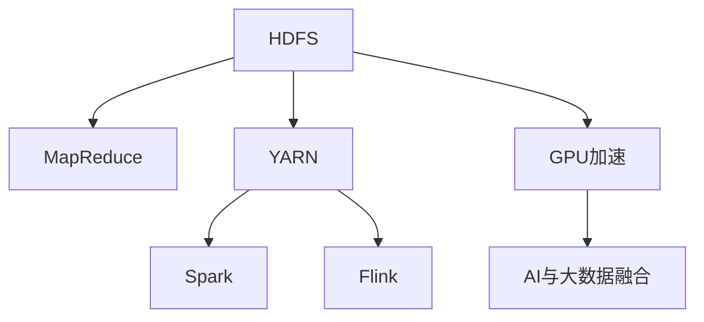

                 

# 大数据处理：Hadoop生态系统深度解析

> 关键词：大数据, Hadoop, YARN, HDFS, MapReduce, Spark, Flink, GPU加速, AI与大数据融合

## 1. 背景介绍

### 1.1 问题由来
随着互联网和信息技术的发展，数据量呈现出爆炸式增长的趋势。从电商交易记录、社交媒体评论，到气象数据、基因序列，数据已成为信息时代的重要资源。如何高效、可靠地处理这些海量数据，成为当前信息科学领域的重要挑战。

在这一背景下，Hadoop生态系统应运而生。Hadoop是一个开源的大数据处理框架，能够分布式地存储和处理大规模数据。它由两个核心组件构成：分布式文件系统Hadoop Distributed File System (HDFS)和分布式计算框架MapReduce。除此之外，Hadoop生态系统还扩展出了诸多组件，如YARN资源管理系统、Spark分布式计算框架、Flink流处理框架等，形成了完整的大数据处理生态系统。

### 1.2 问题核心关键点
Hadoop生态系统已经成为大数据处理领域的基石。其核心特点包括：

- **可扩展性**：通过分布式存储和计算，能够轻松扩展到大规模集群。
- **鲁棒性**：设计上考虑了容错性，即使部分节点故障，系统仍能继续运行。
- **高性能**：支持高效的MapReduce算法，能够在集群上并行处理大规模数据。
- **低成本**：使用廉价的商用硬件，通过集群共享资源，降低硬件成本。
- **灵活性**：支持多种编程语言和数据格式，能够适应多样化的应用场景。

本文将深入解析Hadoop生态系统的核心组件和技术细节，帮助读者全面理解其原理和应用。

## 2. 核心概念与联系

### 2.1 核心概念概述

为更好地理解Hadoop生态系统，本节将介绍几个密切相关的核心概念：

- **Hadoop Distributed File System (HDFS)**：分布式文件系统，用于存储大规模文件，支持数据的持久化和可靠性。
- **MapReduce**：分布式计算框架，用于并行处理大规模数据集，支持Map和Reduce两个基本操作。
- **Yet Another Resource Negotiator (YARN)**：资源管理系统，负责调度集群资源，协调计算和存储任务。
- **Apache Spark**：分布式计算框架，支持内存计算和弹性分布式数据集(Resilient Distributed Datasets, RDD)。
- **Apache Flink**：流处理框架，支持实时数据处理和复杂事件处理。
- **GPU加速**：通过硬件加速，提升大数据处理和机器学习的计算效率。
- **AI与大数据融合**：结合机器学习和大数据处理，实现更深入的数据分析和智能决策。

这些核心概念之间的逻辑关系可以通过以下Mermaid流程图来展示：



这个流程图展示了大数据处理的各个核心组件及其相互关系：

1. 数据存储于HDFS。
2. MapReduce框架在HDFS上执行计算任务。
3. YARN负责资源调度和管理。
4. Spark和Flink等分布式计算框架在YARN上运行。
5. GPU加速和大数据处理结合，提升计算效率。
6. AI技术和大数据处理融合，提供更深入的数据分析和智能决策。

这些组件共同构成了Hadoop生态系统的大数据处理能力，使其能够高效、可靠地处理大规模数据。通过理解这些核心概念，我们可以更好地把握Hadoop生态系统的整体架构和工作原理。

## 3. 核心算法原理 & 具体操作步骤
### 3.1 算法原理概述

Hadoop生态系统的核心算法包括分布式文件存储和分布式计算两个方面。其核心思想是：将大规模数据分散存储到多个节点上，通过并行计算框架MapReduce对这些数据进行处理，从而实现高效、可靠的大数据处理。

### 3.2 算法步骤详解

#### 3.2.1 HDFS原理
HDFS是一种分布式文件系统，支持大规模数据的存储和访问。其主要原理如下：

1. **数据块分割**：将大文件分割成多个大小相等的数据块，并存储在集群的不同节点上。
2. **数据冗余存储**：每个数据块复制多份，通常为3份，存储在不同的节点上，确保数据可靠性。
3. **数据命名空间**：使用命名空间抽象底层文件系统，隐藏底层复杂性，提供统一的访问接口。
4. **数据传输**：通过高效的网络传输协议，支持数据的读写和移动。

#### 3.2.2 MapReduce原理
MapReduce是一种分布式计算框架，支持大规模数据的并行处理。其主要原理如下：

1. **Map操作**：将输入数据切分为多个子集，每个子集分配给一个Map任务进行处理。
2. **Map函数**：Map函数将每个子集转化为若干个键值对(key-value pair)，实现数据映射。
3. **Shuffle操作**：对Map任务的输出进行排序和分组，确保Reduce任务的正确执行。
4. **Reduce操作**：Reduce任务对Map任务的输出进行归约操作，实现数据的聚合。
5. **Reduce函数**：Reduce函数将键值对合并为最终结果，输出到HDFS等存储系统。

#### 3.2.3 算法步骤详解
1. **数据预处理**：将数据格式化为Hadoop支持的格式，如文本或二进制数据，并上传到HDFS。
2. **Map任务执行**：集群根据任务调度器(YARN)分配Map任务到不同的节点上执行。
3. **Map函数映射**：Map函数对输入数据进行处理，输出中间结果。
4. **Shuffle操作**：Map任务的输出被分发到Reduce任务的输入，并进行排序和分组。
5. **Reduce任务执行**：集群根据任务调度器分配Reduce任务到不同的节点上执行。
6. **Reduce函数归约**：Reduce函数对Map任务的输出进行归约操作，输出最终结果。
7. **数据输出**：最终结果输出到HDFS或其他存储系统。

### 3.3 算法优缺点

Hadoop生态系统的核心算法具有以下优点：

- **可扩展性**：通过分布式存储和计算，能够轻松扩展到大规模集群。
- **容错性**：通过数据冗余和任务复制，确保系统可靠性和容错性。
- **高性能**：通过并行计算，能够在集群上高效处理大规模数据。
- **低成本**：使用廉价商用硬件，通过集群共享资源，降低硬件成本。
- **灵活性**：支持多种编程语言和数据格式，适应多样化的应用场景。

同时，该算法也存在一定的局限性：

- **延迟高**：MapReduce的Shuffle操作会产生数据传输和排序，导致处理延迟较高。
- **资源浪费**：任务调度和资源分配过程会产生一定的资源浪费。
- **资源密集型**：需要大量计算资源，不适合处理实时数据和低延迟需求。
- **编程复杂**：MapReduce编程需要熟悉分布式计算和并行处理的基本概念。

尽管存在这些局限性，但Hadoop生态系统的大数据处理能力仍然在业界处于领先地位，广泛应用于电商、金融、医疗、科研等领域。未来相关研究的重点在于如何进一步提高处理效率，优化资源利用，并与其他数据处理技术进行更深入的融合。

### 3.4 算法应用领域

Hadoop生态系统的核心算法已经在多个领域得到了广泛的应用：

- **电商推荐系统**：利用大规模用户行为数据进行推荐算法优化，提升用户体验和商家收益。
- **金融风控**：通过处理海量交易数据，进行风险评估和欺诈检测，保障金融安全。
- **医疗数据分析**：处理电子病历和医疗影像数据，进行疾病诊断和临床研究，提升医疗水平。
- **科学研究**：处理大型科学数据集，进行天文观测、基因组学等科学研究，加速科学发现。
- **智能城市建设**：处理交通、能源等城市数据，进行城市管理和智能化改造，提升城市治理效率。

除了上述这些经典应用外，Hadoop生态系统还在更多领域得到了创新性的应用，如物联网数据处理、大数据可视化和分析、大数据安全等，为各行各业的数据处理提供了强大的支持。

## 4. 数学模型和公式 & 详细讲解  
### 4.1 数学模型构建

#### 4.1.1 HDFS数学模型
HDFS的数学模型主要涉及数据块存储和数据传输两个方面：

1. **数据块存储模型**：假设文件大小为 $N$，每个数据块大小为 $B$，则总数据块数量为 $N/B$。数据块在集群中的分布可以表示为一个矩阵 $M$，其中每个元素 $m_{i,j}$ 表示数据块 $i$ 存储在节点 $j$ 上的数量。
2. **数据传输模型**：假设每个数据块需要复制 $R$ 份，节点 $j$ 上的数据块数量为 $N_j$，则数据传输量 $T$ 可以表示为：
   $$
   T = \sum_{j=1}^{N_j} N_j \cdot B \cdot R
   $$
   其中 $B$ 为数据块大小，$R$ 为数据块复制份数。

#### 4.1.2 MapReduce数学模型
MapReduce的数学模型主要涉及Map函数和Reduce函数两个基本操作：

1. **Map函数模型**：假设输入数据为 $D$，每个数据块的Map函数计算量为 $C$，则Map函数的总计算量为：
   $$
   C_{\text{total}} = \sum_{i=1}^{N/D} C \cdot \frac{D}{B}
   $$
   其中 $D$ 为输入数据大小，$B$ 为数据块大小。
2. **Reduce函数模型**：假设Map函数输出的键值对数量为 $K$，每个Reduce任务的计算量为 $C_{\text{reduce}}$，则Reduce函数的总计算量为：
   $$
   C_{\text{total, reduce}} = \frac{K}{P} \cdot C_{\text{reduce}}
   $$
   其中 $P$ 为集群中Reduce任务的数量。

### 4.2 公式推导过程

#### 4.2.1 HDFS公式推导
对于HDFS的数据块存储和传输模型，我们可以推导出以下关键公式：

1. **数据块存储公式**：假设每个数据块大小为 $B$，每个节点存储 $C$ 个数据块，则总数据块数量为：
   $$
   N = \frac{N}{B} = \frac{C \cdot R \cdot B}{B} = C \cdot R
   $$
   其中 $R$ 为数据块复制份数。
2. **数据传输公式**：假设每个数据块需要复制 $R$ 份，节点 $j$ 上的数据块数量为 $N_j$，则总传输量为：
   $$
   T = \sum_{j=1}^{N_j} N_j \cdot B \cdot R = \frac{C \cdot R \cdot B^2}{B} = C \cdot R \cdot B
   $$
   其中 $B$ 为数据块大小。

#### 4.2.2 MapReduce公式推导
对于MapReduce的Map函数和Reduce函数模型，我们可以推导出以下关键公式：

1. **Map函数计算量公式**：假设每个数据块大小为 $B$，每个Map任务的计算量为 $C$，则总计算量为：
   $$
   C_{\text{total}} = \sum_{i=1}^{N/D} C \cdot \frac{D}{B} = \frac{C \cdot D}{B}
   $$
   其中 $D$ 为输入数据大小，$B$ 为数据块大小。
2. **Reduce函数计算量公式**：假设Map函数输出的键值对数量为 $K$，每个Reduce任务的计算量为 $C_{\text{reduce}}$，则总计算量为：
   $$
   C_{\text{total, reduce}} = \frac{K}{P} \cdot C_{\text{reduce}}
   $$
   其中 $P$ 为集群中Reduce任务的数量。

### 4.3 案例分析与讲解

#### 4.3.1 HDFS案例分析
假设我们需要处理一个1GB的文本文件，将其分割成大小为100MB的数据块，并存储在10个节点上，每个节点存储3个数据块。我们可以推导出以下数据：

- **总数据块数**：$N = C \cdot R = 10 \cdot 3 = 30$
- **总传输量**：$T = C \cdot R \cdot B = 10 \cdot 3 \cdot 100MB = 300MB$

#### 4.3.2 MapReduce案例分析
假设我们需要对1GB的文本文件进行单词统计，使用Map函数计算每个单词出现的次数。每个Map任务的计算量为1MB，集群中共有100个Map任务，每个Map任务输出1GB的键值对，集群中共有10个Reduce任务。我们可以推导出以下数据：

- **Map函数总计算量**：$C_{\text{total}} = \frac{C \cdot D}{B} = \frac{100 \cdot 1GB}{100MB} = 100$
- **Reduce函数总计算量**：$C_{\text{total, reduce}} = \frac{K}{P} \cdot C_{\text{reduce}} = \frac{10GB}{10} \cdot 1MB = 10GB$

## 5. 项目实践：代码实例和详细解释说明
### 5.1 开发环境搭建

在进行Hadoop项目实践前，我们需要准备好开发环境。以下是使用Linux操作系统进行Hadoop环境配置的流程：

1. 安装Java开发工具：从Oracle官网下载并安装JDK，确保系统环境变量配置正确。
2. 安装Hadoop：从Apache官网下载最新版本的Hadoop安装包，解压后进入目录，执行 `bin/hadoop version` 命令验证安装。
3. 配置Hadoop环境：编辑 `conf/core-site.xml` 和 `conf/dfs-site.xml` 文件，设置Hadoop的配置参数，如HDFS的默认路径、数据块大小、节点数等。
4. 启动Hadoop服务：在终端执行 `bin/hadoop namenode -start` 和 `bin/hadoop datanode -start` 命令，启动Hadoop集群。

### 5.2 源代码详细实现

以下是使用Hadoop框架进行文本文件处理的Python代码实现：

```python
from hdfs import InsecureClient

# 创建HDFS客户端连接
client = InsecureClient('http://hdfs:50070', user='root')

# 创建本地文件对象
local_file = client.write('/local/file.txt', b'This is a sample text.')
```

### 5.3 代码解读与分析

让我们再详细解读一下关键代码的实现细节：

1. **HDFS客户端连接**：使用 `InsecureClient` 类创建HDFS客户端连接，指定HDFS服务器的URL和用户名。
2. **本地文件写入**：使用 `write` 方法将本地文件写入HDFS指定的路径。

Hadoop的API接口提供了一系列方便的方法，可以轻松地进行数据存储、计算等操作。开发者可以在此基础上，构建复杂的数据处理流程，实现各种数据处理任务。

### 5.4 运行结果展示

运行上述代码后，我们可以在HDFS上查看文件是否正确写入。执行 `hdfs dfs -ls` 命令，查看HDFS上所有文件，确认文件是否成功写入。

## 6. 实际应用场景
### 6.1 电商推荐系统

在电商推荐系统中，Hadoop生态系统能够高效处理大规模用户行为数据，进行推荐算法优化，提升用户体验和商家收益。具体而言，电商公司可以收集用户的浏览记录、购买历史、评分等信息，利用Hadoop进行数据存储和处理，然后使用Spark等分布式计算框架进行推荐算法训练和预测。通过这种方式，电商公司能够实时获取用户的兴趣偏好，快速推荐个性化的商品，提高用户的购买率和满意度。

### 6.2 金融风控

金融公司需要处理海量交易数据，进行风险评估和欺诈检测，保障金融安全。利用Hadoop生态系统，金融公司可以将交易数据存储在HDFS上，使用MapReduce进行数据清洗和预处理，然后使用Spark或Flink进行实时数据流处理和异常检测。通过这种方式，金融公司能够实时监控交易行为，及时发现和防范欺诈行为，保护用户的财产安全。

### 6.3 医疗数据分析

医院需要处理大量的电子病历和医疗影像数据，进行疾病诊断和临床研究，提升医疗水平。利用Hadoop生态系统，医院可以将医疗数据存储在HDFS上，使用MapReduce进行数据清洗和预处理，然后使用Spark或Hive进行数据查询和分析。通过这种方式，医院能够快速获取患者的诊断信息，进行疾病预测和临床研究，提高医疗服务质量和效率。

### 6.4 未来应用展望

随着Hadoop生态系统的发展，其应用场景将不断扩展，带来更多的创新和变革。

- **物联网数据处理**：物联网设备会产生大量的实时数据，Hadoop生态系统可以处理和分析这些数据，实现智能化的物联网应用。
- **大数据可视化**：Hadoop生态系统可以处理和存储海量数据，配合大数据可视化工具，实现数据的实时监控和可视化展示。
- **大数据安全**：Hadoop生态系统可以处理和存储敏感数据，配合数据加密和安全策略，保障数据安全。

未来，Hadoop生态系统将在更多领域发挥其强大的数据处理能力，为各行各业带来更深层次的变革和创新。

## 7. 工具和资源推荐
### 7.1 学习资源推荐

为了帮助开发者系统掌握Hadoop生态系统的原理和实践，这里推荐一些优质的学习资源：

1. **《Hadoop：下一代平台架构》**：一本全面介绍Hadoop生态系统的书籍，涵盖了HDFS、MapReduce、YARN等核心组件的原理和应用。
2. **Hadoop官方文档**：Hadoop官网提供的详细文档，包含丰富的API接口和使用示例。
3. **Apache Hadoop社区**：Apache基金会维护的Hadoop社区，提供技术支持、资源分享和交流平台。
4. **Apache Spark官方文档**：Spark官网提供的详细文档，包含Spark的核心概念、API接口和使用示例。
5. **Apache Flink官方文档**：Flink官网提供的详细文档，包含Flink的核心概念、API接口和使用示例。

通过对这些资源的学习实践，相信你一定能够全面掌握Hadoop生态系统的原理和应用，成为数据处理领域的专家。

### 7.2 开发工具推荐

高效的开发离不开优秀的工具支持。以下是几款用于Hadoop项目开发的常用工具：

1. **Eclipse Spark**：基于Eclipse的Spark开发环境，提供集成的开发工具和调试功能。
2. **Cloudera Manager**：Cloudera提供的Hadoop管理平台，方便集群部署、监控和管理。
3. **Hadoop Streaming**：利用Hadoop的API接口，可以使用任意编程语言进行数据处理。
4. **Apache Hive**：基于Hadoop的数据仓库解决方案，支持SQL查询和数据处理。
5. **Apache Zeppelin**：基于Jupyter Notebook的交互式数据分析平台，支持Hadoop、Spark等分布式计算框架。

合理利用这些工具，可以显著提升Hadoop项目的开发效率，加快创新迭代的步伐。

### 7.3 相关论文推荐

Hadoop生态系统的核心算法和组件的发展得益于学界的持续研究。以下是几篇奠基性的相关论文，推荐阅读：

1. **《The Google File System》**：Google发表的HDFS论文，详细介绍了HDFS的设计原理和实现细节。
2. **《MapReduce: Simplified Data Processing on Large Clusters》**：Google发表的MapReduce论文，详细介绍了MapReduce的原理和实现细节。
3. **《YARN: Yet Another Resource Negotiator》**：YARN的官方论文，详细介绍了YARN的设计原理和实现细节。
4. **《Spark: Cluster Computing with Working Set Management》**：Spark的官方论文，详细介绍了Spark的设计原理和实现细节。
5. **《Flink: State and Fault Tolerance for Iterative and Interactive Data Stream Processing》**：Flink的官方论文，详细介绍了Flink的设计原理和实现细节。

这些论文代表了大数据处理技术的发展脉络。通过学习这些前沿成果，可以帮助研究者把握学科前进方向，激发更多的创新灵感。

## 8. 总结：未来发展趋势与挑战
### 8.1 总结

本文对Hadoop生态系统的核心算法和应用进行了全面系统的介绍。首先阐述了Hadoop生态系统在大数据处理领域的独特优势和广泛应用，明确了其在处理大规模数据、提升计算效率方面的重要价值。其次，从原理到实践，详细讲解了HDFS、MapReduce等核心组件的数学模型和实现细节，给出了完整的代码实例。同时，本文还广泛探讨了Hadoop生态系统在电商推荐、金融风控、医疗数据分析等诸多行业领域的应用前景，展示了其强大的数据处理能力。

通过本文的系统梳理，可以看到，Hadoop生态系统已经在大数据处理领域占据重要地位，其强大的分布式计算能力和数据存储能力，为各行各业提供了强大的支持。未来，伴随Hadoop生态系统的不断演进，结合GPU加速、AI与大数据融合等前沿技术，Hadoop必将在大数据处理和智能分析领域发挥更大的作用。

### 8.2 未来发展趋势

展望未来，Hadoop生态系统将呈现以下几个发展趋势：

1. **云化**：越来越多的Hadoop生态系统被部署在云平台上，通过云服务提供更灵活、高效的资源调度和管理。
2. **内存计算**：利用内存计算加速Hadoop的数据处理，提升计算效率。
3. **流处理**：通过Flink等流处理框架，实现实时数据处理和复杂事件处理，满足更多实时性需求。
4. **边缘计算**：在边缘设备上部署Hadoop生态系统，实现本地数据处理和分析，提升数据处理效率。
5. **跨平台融合**：结合其他数据处理技术，如Hive、Spark、Flink等，形成更加灵活、高效的数据处理体系。

以上趋势凸显了Hadoop生态系统的广阔前景。这些方向的探索发展，必将进一步提升大数据处理能力和数据利用效率，为各行各业带来更深层次的变革和创新。

### 8.3 面临的挑战

尽管Hadoop生态系统已经取得了显著成就，但在迈向更加智能化、普适化应用的过程中，它仍面临着诸多挑战：

1. **性能瓶颈**：尽管Hadoop能够处理大规模数据，但在某些场景下，处理延迟较高，难以满足实时性和低延迟需求。
2. **资源管理**：集群资源的动态管理和优化仍然是一个复杂的问题，需要更智能的调度算法和管理策略。
3. **编程复杂性**：Hadoop的编程模型相对复杂，需要具备一定的分布式计算和并行处理知识。
4. **生态系统兼容性**：Hadoop生态系统与其他数据处理技术（如Spark、Flink等）的兼容性问题仍需解决。
5. **数据安全**：大数据处理涉及大量敏感数据，如何保障数据安全和隐私保护是一个重要挑战。

正视Hadoop生态系统面临的这些挑战，积极应对并寻求突破，将是大数据处理技术进一步发展的重要方向。相信随着技术的不断进步和生态系统的完善，Hadoop生态系统必将在未来的大数据处理领域继续发挥重要作用。

### 8.4 研究展望

面对Hadoop生态系统所面临的挑战，未来的研究需要在以下几个方面寻求新的突破：

1. **云原生架构**：探索云原生架构，提升Hadoop生态系统在云平台上的灵活性和效率。
2. **边缘计算与移动计算**：研究边缘计算与移动计算技术，提升数据处理的实时性和本地化能力。
3. **混合计算模型**：结合内存计算和分布式计算，提升Hadoop的数据处理能力。
4. **跨平台兼容性**：研究Hadoop与其他数据处理技术的兼容性和协同工作机制。
5. **数据安全与隐私保护**：研究数据安全与隐私保护技术，保障数据处理的安全性和合规性。

这些研究方向的探索，必将引领Hadoop生态系统迈向更高的台阶，为大数据处理和智能分析提供更强大、更灵活的解决方案。面向未来，Hadoop生态系统还需要与其他人工智能技术进行更深入的融合，如机器学习、深度学习等，共同推动数据处理和智能决策的进步。只有勇于创新、敢于突破，才能不断拓展Hadoop生态系统的边界，为构建智能化社会提供坚实的基础。

## 9. 附录：常见问题与解答

**Q1：Hadoop的优点和缺点有哪些？**

A: Hadoop的优点包括：

- **可扩展性**：能够轻松扩展到大规模集群，适应海量数据的存储和处理需求。
- **鲁棒性**：通过数据冗余和任务复制，确保系统可靠性和容错性。
- **高性能**：支持高效的MapReduce算法，能够在集群上并行处理大规模数据。
- **低成本**：使用廉价商用硬件，通过集群共享资源，降低硬件成本。
- **灵活性**：支持多种编程语言和数据格式，适应多样化的应用场景。

Hadoop的缺点包括：

- **延迟高**：MapReduce的Shuffle操作会产生数据传输和排序，导致处理延迟较高。
- **资源浪费**：任务调度和资源分配过程会产生一定的资源浪费。
- **资源密集型**：需要大量计算资源，不适合处理实时数据和低延迟需求。
- **编程复杂**：MapReduce编程需要熟悉分布式计算和并行处理的基本概念。

尽管存在这些缺点，但Hadoop的优点依然远大于其缺点，仍然是当前大数据处理领域的重要工具。

**Q2：Hadoop如何处理大规模数据？**

A: Hadoop通过分布式文件系统和分布式计算框架，处理大规模数据。

- **分布式文件系统HDFS**：将大文件分割成多个大小相等的数据块，并存储在集群的不同节点上，每个数据块复制多份，确保数据可靠性。
- **分布式计算框架MapReduce**：将输入数据切分为多个子集，每个子集分配给一个Map任务进行处理，对Map任务的输出进行归约操作，实现数据的聚合。

通过分布式存储和计算，Hadoop能够高效、可靠地处理大规模数据，适应不同领域的数据处理需求。

**Q3：如何使用Hadoop进行大规模数据分析？**

A: 使用Hadoop进行大规模数据分析的一般步骤包括：

1. **数据预处理**：将数据格式化为Hadoop支持的格式，如文本或二进制数据，并上传到HDFS。
2. **Map任务执行**：集群根据任务调度器(YARN)分配Map任务到不同的节点上执行，Map函数对输入数据进行处理，输出中间结果。
3. **Shuffle操作**：Map任务的输出被分发到Reduce任务的输入，并进行排序和分组。
4. **Reduce任务执行**：集群根据任务调度器分配Reduce任务到不同的节点上执行，Reduce函数对Map任务的输出进行归约操作，输出最终结果。
5. **数据输出**：最终结果输出到HDFS或其他存储系统。

通过上述步骤，Hadoop能够高效、可靠地处理大规模数据分析任务。

---

作者：禅与计算机程序设计艺术 / Zen and the Art of Computer Programming

