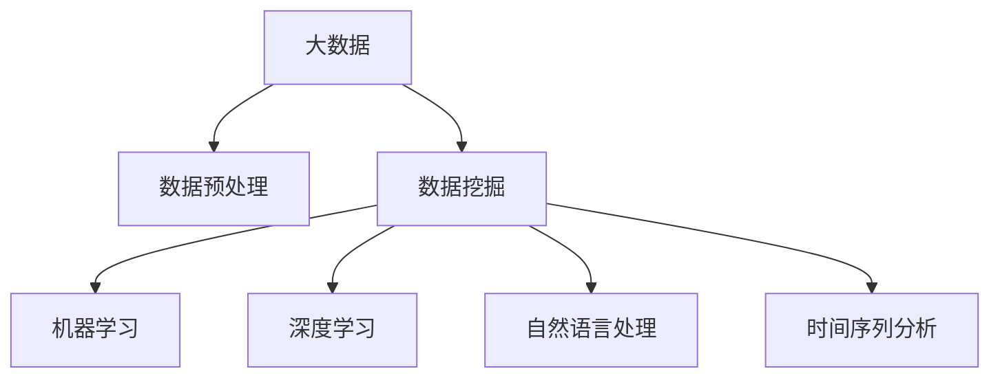

                 

# 大数据时代的知识发现：机遇与挑战

## 1. 背景介绍

### 1.1 问题由来

在信息技术迅猛发展的今天，大数据已经渗透到社会的各个领域，驱动着各行各业创新变革。海量数据的产生带来了新的研究领域和应用场景，也给传统知识发现方法带来了巨大挑战。

从科学研究到商业决策，从医疗健康到交通运输，大数据的应用无时无刻不在改变着我们的生活和工作方式。然而，如何高效地从大数据中提取有价值的信息，进行精确的知识发现，是当前大数据领域的一个核心问题。

### 1.2 问题核心关键点

大数据时代知识发现的核心关键点在于：

1. 数据规模的爆炸性增长：数据量的激增带来了存储和处理上的挑战。
2. 数据类型的多样性：文本、图像、语音、视频等不同类型的数据，需要不同的处理方法。
3. 数据质量的参差不齐：数据噪音、缺失值等问题需要有效的数据清洗和预处理。
4. 数据分布的不均匀：不同领域、不同地区的数据分布不均，需要针对性处理。
5. 数据价值的隐匿性：从大数据中发现知识，需要高效的数据挖掘和统计方法。
6. 数据隐私和安全问题：在数据采集、存储、处理过程中，保护用户隐私，确保数据安全。

这些核心问题共同构成了大数据时代知识发现的主要挑战，同时也为技术创新和应用实践提供了丰富的机遇。

### 1.3 问题研究意义

在当今社会，大数据已经成为了推动科技进步和经济发展的关键动力。大数据时代知识发现的深入研究，不仅有助于提升数据的利用率，促进产业转型升级，还能够在科学研究、公共服务等领域带来深远影响。

- **科学研究**：大数据为科研提供了大量实验数据和计算资源，支持复杂系统的模拟和预测。
- **公共服务**：通过大数据分析，能够提升公共服务水平，如交通流量预测、疾病预防、灾害预警等。
- **企业决策**：大数据能够帮助企业进行市场分析、客户细分、风险管理等，实现精准营销和经营决策。
- **社会治理**：大数据在公共安全、社会稳定等方面发挥着重要作用，促进了社会治理现代化。

因此，深入研究大数据时代知识发现的方法和工具，对于推动社会进步，具有重要的战略意义。

## 2. 核心概念与联系

### 2.1 核心概念概述

为更好地理解大数据时代知识发现的方法和工具，本节将介绍几个关键概念：

- **大数据**：指规模巨大、类型多样、速度快、价值密度低的数据集合。
- **知识发现**：指从数据中挖掘出隐藏在其中的有用信息和知识的过程。
- **数据预处理**：指对原始数据进行清洗、归一化、特征选择等处理，提高数据质量。
- **数据挖掘**：指从大量数据中自动地发现规律、模式和关联。
- **机器学习**：指通过算法训练模型，利用数据预测未来结果。
- **深度学习**：指通过多层次神经网络模型，从数据中学习复杂特征表示。
- **自然语言处理**：指计算机理解和处理人类语言的技术。
- **时间序列分析**：指对随时间变化的数据序列进行建模和预测。

这些核心概念之间的逻辑关系可以通过以下Mermaid流程图来展示：



这个流程图展示了大数据时代知识发现的关键流程：

1. 原始数据经过预处理后，可以进行数据挖掘。
2. 数据挖掘得到的规律和模式，可以用于机器学习模型的训练。
3. 机器学习模型和深度学习模型可以进一步从数据中学习到复杂特征表示。
4. 自然语言处理和时序分析等技术，可以进一步提升数据挖掘和建模的精确度。

## 3. 核心算法原理 & 具体操作步骤

### 3.1 算法原理概述

大数据时代知识发现的本质是通过数据挖掘和机器学习等方法，从大规模数据中提取有价值的信息和知识。其核心思想是：将大数据视为一个信息源，通过算法自动化地处理、分析和建模，从而实现知识发现。

形式化地，假设大数据集为 $D=\{d_1, d_2, ..., d_n\}$，其中 $d_i$ 为数据样本。知识发现的目标是找到映射函数 $f$，将 $D$ 映射为知识表示 $K$，即 $K=f(D)$。常用的知识表示方法包括模式、关联规则、分类、聚类等。

### 3.2 算法步骤详解

大数据时代知识发现通常包括以下几个关键步骤：

**Step 1: 数据采集与预处理**
- 从各个数据源（如互联网、传感器、数据库等）收集数据，确保数据覆盖全面。
- 对收集到的数据进行清洗、归一化、去重等预处理操作，提升数据质量。

**Step 2: 特征选择与提取**
- 从预处理后的数据中提取有意义的特征，如文本中的关键词、时间序列中的周期性等。
- 利用特征选择算法，从大量特征中筛选出对知识发现有帮助的特征。

**Step 3: 数据建模与挖掘**
- 应用统计学和机器学习算法，对数据进行建模和挖掘，发现规律和模式。
- 根据任务需求，选择合适的算法和模型，如分类算法、聚类算法、关联规则算法等。

**Step 4: 知识表示与解释**
- 将挖掘得到的结果转化为易于理解的格式，如模式、规则、关联等。
- 对知识表示进行解释和验证，确保知识发现结果的可信性和可用性。

**Step 5: 知识应用与评估**
- 将知识应用于实际问题中，进行预测、分类、推荐等操作。
- 评估知识应用的准确性和效果，根据反馈调整模型和算法。

### 3.3 算法优缺点

大数据时代知识发现方法具有以下优点：

1. 数据覆盖全面：利用数据源的多样性，能够获取更多的数据信息。
2. 自动化处理：自动化数据预处理和特征选择，提升效率和精度。
3. 高泛化能力：利用机器学习和大数据分析方法，能够发现更为广泛的规律和模式。
4. 跨领域应用：可以应用于科学研究、公共服务、商业决策等多个领域。

然而，大数据时代知识发现也存在一定的局限性：

1. 数据质量不稳定：数据噪音、缺失值、异常值等影响数据质量。
2. 算法复杂度高：数据挖掘和机器学习算法较为复杂，需要大量的计算资源。
3. 模型解释性不足：部分算法的黑盒特性，使得结果难以解释和理解。
4. 数据隐私和安全问题：在数据采集和处理过程中，需要考虑用户隐私和数据安全。

尽管存在这些局限性，但大数据时代知识发现方法仍然是当前最主流的知识发现手段，正在推动各个领域的创新和进步。

### 3.4 算法应用领域

大数据时代知识发现方法在多个领域中得到了广泛应用，包括但不限于：

- **科学研究**：用于基因组分析、气候变化、生物医学等科学研究。
- **公共服务**：用于交通流量预测、环境监测、疾病预防等公共服务领域。
- **金融领域**：用于风险管理、市场分析、客户细分等金融决策。
- **零售行业**：用于个性化推荐、库存管理、需求预测等零售业务。
- **制造业**：用于质量控制、生产优化、供应链管理等制造业应用。
- **医疗健康**：用于病人诊断、药物研发、健康管理等医疗应用。

除了上述这些经典应用外，大数据时代知识发现技术还在诸多新场景中发挥着重要作用，如城市治理、社会分析、智能交通等，推动着数据驱动型社会的全面发展。

## 4. 数学模型和公式 & 详细讲解 & 举例说明

### 4.1 数学模型构建

本节将使用数学语言对大数据时代知识发现的方法进行更加严格的刻画。

假设大数据集为 $D=\{d_1, d_2, ..., d_n\}$，其中 $d_i$ 为数据样本。定义知识发现的目标函数 $f$，将 $D$ 映射为知识表示 $K$，即 $K=f(D)$。

常见的知识表示方法包括：

1. **模式识别**：通过统计方法，识别数据中的显著模式和规律。
2. **关联规则**：使用频繁项集算法，发现数据中的关联规则。
3. **分类**：使用机器学习算法，将数据分为不同的类别。
4. **聚类**：使用聚类算法，将数据分为不同的群组。
5. **时间序列分析**：通过时间序列模型，预测未来数据变化趋势。

### 4.2 公式推导过程

以分类算法为例，展示知识发现的数学模型构建和公式推导。

假设数据集 $D$ 包含 $n$ 个样本 $d_i$，每个样本有 $m$ 个特征 $x_{ij}$，目标变量为 $y_i \in \{0,1\}$。定义分类器的参数为 $\theta$，使用逻辑回归模型，目标函数为：

$$
\min_{\theta} \frac{1}{n}\sum_{i=1}^n L(y_i, f_{\theta}(x_i))
$$

其中，$L$ 为损失函数，常用的有交叉熵损失函数：

$$
L(y_i, f_{\theta}(x_i)) = -y_i \log(f_{\theta}(x_i)) - (1-y_i)\log(1-f_{\theta}(x_i))
$$

分类器输出为：

$$
f_{\theta}(x_i) = \frac{1}{1+\exp(-\sum_{j=1}^m \theta_j x_{ij})}
$$

通过求解上述最优化问题，可以训练出最优的分类器参数 $\theta$。

### 4.3 案例分析与讲解

以金融领域为例，展示如何使用大数据时代知识发现方法进行风险管理。

假设某金融公司需要预测客户的违约风险，数据集 $D$ 包含客户的基本信息（如年龄、收入、教育程度）和历史交易记录（如贷款金额、还款情况）。目标变量 $y_i$ 表示客户是否违约，取值为 $0$ 或 $1$。

1. 数据采集与预处理：从金融公司内部系统收集数据，并进行去重、清洗等操作。
2. 特征选择与提取：提取客户基本信息和交易记录中的关键特征，如年龄、收入、贷款金额、还款情况等。
3. 数据建模与挖掘：使用逻辑回归模型，对数据进行建模和挖掘，发现违约风险的影响因素。
4. 知识表示与解释：将挖掘得到的特征权重和模型参数转化为易于理解的规律，如高收入客户违约概率低，高贷款金额客户风险高。
5. 知识应用与评估：将知识应用于新客户的风险预测，评估模型的准确性和效果，根据反馈调整模型和算法。

## 5. 项目实践：代码实例和详细解释说明

### 5.1 开发环境搭建

在进行知识发现实践前，我们需要准备好开发环境。以下是使用Python进行Scikit-learn开发的环境配置流程：

1. 安装Anaconda：从官网下载并安装Anaconda，用于创建独立的Python环境。

2. 创建并激活虚拟环境：
```bash
conda create -n sklearn-env python=3.8 
conda activate sklearn-env
```

3. 安装Scikit-learn：
```bash
conda install scikit-learn
```

4. 安装各类工具包：
```bash
pip install numpy pandas matplotlib seaborn jupyter notebook
```

完成上述步骤后，即可在`sklearn-env`环境中开始知识发现实践。

### 5.2 源代码详细实现

下面我们以金融领域风险管理为例，给出使用Scikit-learn库进行分类任务的知识发现PyTorch代码实现。

首先，定义数据处理函数：

```python
from sklearn.datasets import load_boston
from sklearn.model_selection import train_test_split
from sklearn.preprocessing import StandardScaler
from sklearn.linear_model import LogisticRegression
import pandas as pd
import numpy as np

# 加载波士顿房价数据集
boston_data = load_boston()
X = boston_data.data
y = boston_data.target

# 将数据集划分为训练集和测试集
X_train, X_test, y_train, y_test = train_test_split(X, y, test_size=0.2, random_state=42)

# 标准化数据
scaler = StandardScaler()
X_train = scaler.fit_transform(X_train)
X_test = scaler.transform(X_test)

# 训练逻辑回归模型
model = LogisticRegression()
model.fit(X_train, y_train)

# 在测试集上评估模型
y_pred = model.predict(X_test)
print(classification_report(y_test, y_pred))
```

然后，定义模型和评估函数：

```python
from sklearn.metrics import classification_report
from sklearn.linear_model import LogisticRegression
from sklearn.model_selection import train_test_split

def train_model(X_train, y_train):
    # 标准化数据
    scaler = StandardScaler()
    X_train = scaler.fit_transform(X_train)

    # 训练逻辑回归模型
    model = LogisticRegression()
    model.fit(X_train, y_train)

    return model

def evaluate_model(model, X_test, y_test):
    # 在测试集上评估模型
    y_pred = model.predict(X_test)
    print(classification_report(y_test, y_pred))
```

最后，启动训练流程并在测试集上评估：

```python
model = train_model(X_train, y_train)
evaluate_model(model, X_test, y_test)
```

以上就是使用Scikit-learn对波士顿房价数据进行分类任务的知识发现代码实现。可以看到，Scikit-learn提供了强大的模型训练和评估功能，使用户能够快速实现基本的知识发现过程。

### 5.3 代码解读与分析

让我们再详细解读一下关键代码的实现细节：

**load_boston函数**：
- 加载波士顿房价数据集，返回特征矩阵 $X$ 和目标向量 $y$。

**train_test_split函数**：
- 将数据集划分为训练集和测试集，保留20%的数据用于测试。

**StandardScaler函数**：
- 对特征矩阵进行标准化处理，使其均值为0，方差为1，提升模型的收敛速度和准确性。

**LogisticRegression函数**：
- 定义逻辑回归模型，使用交叉熵损失函数进行训练，得到最优的分类器参数。

**classification_report函数**：
- 计算模型在测试集上的分类准确率、召回率、F1分数等指标，评估模型效果。

**train_model函数**：
- 定义模型训练过程，包括数据标准化、模型训练、返回训练好的模型。

**evaluate_model函数**：
- 定义模型评估过程，在测试集上使用训练好的模型进行预测，并打印出评估指标。

这些代码展示了基本的知识发现流程，从数据预处理到模型训练和评估。在实际应用中，还需要对模型进行调参、模型集成、特征工程等优化操作，进一步提升模型的准确性和泛化能力。

## 6. 实际应用场景

### 6.1 智能医疗

大数据时代知识发现方法在智能医疗领域具有广泛应用，能够提升医疗服务水平，促进疾病预防和健康管理。

以疾病预测为例，医疗机构可以利用患者的历史病历、生活习惯、环境因素等数据，构建预测模型，实现疾病的早期预警和预防。具体而言，可以从电子病历系统、智能手环等设备中获取数据，经过预处理后，使用时间序列分析和机器学习模型，预测患者的疾病风险，提供个性化的健康管理建议。

### 6.2 智能交通

智能交通系统需要实时监控交通流量、车辆运行状态等数据，利用大数据技术进行分析和预测，提升交通管理的效率和安全性。

例如，可以利用摄像头采集的交通流量数据，通过图像识别和机器学习算法，实时分析交通拥堵情况，提供交通流预测和道路优化方案，缓解交通拥堵。此外，还可以利用GPS数据和移动设备信息，构建路径规划和导航系统，提升出行效率和舒适度。

### 6.3 智能制造

在智能制造领域，大数据时代知识发现方法可以用于质量控制、生产优化、供应链管理等环节，提升生产效率和产品品质。

例如，利用传感器采集的机器运行数据，通过时间序列分析和机器学习算法，预测设备故障和维护需求，提升设备的运行效率和稳定性。此外，还可以利用供应链数据，进行需求预测和库存管理，减少资源浪费和成本损失。

### 6.4 未来应用展望

未来，大数据时代知识发现技术将进一步扩展应用领域，带来更多的创新和突破：

1. **智慧城市**：利用大数据分析城市运行数据，提升城市管理和公共服务水平，实现智慧城市治理。
2. **金融科技**：利用大数据进行市场分析、风险管理、客户细分等，提升金融服务效率和决策精准性。
3. **智能零售**：利用大数据分析消费者行为数据，进行个性化推荐和需求预测，提升零售业务竞争力。
4. **智能制造**：利用大数据进行质量控制、生产优化、供应链管理等，提升生产效率和产品品质。
5. **智慧医疗**：利用大数据进行疾病预测、健康管理等，提升医疗服务水平和患者满意度。

随着技术的不断进步，大数据时代知识发现技术将广泛应用于各行各业，推动社会进步和经济发展。

## 7. 工具和资源推荐

### 7.1 学习资源推荐

为了帮助开发者系统掌握大数据时代知识发现的技术，这里推荐一些优质的学习资源：

1. **《数据科学入门》系列博文**：由知名数据科学家撰写，涵盖数据预处理、特征工程、机器学习等基本概念和实用技巧。
2. **Coursera《数据科学导论》课程**：由哈佛大学开设的在线课程，系统讲解数据科学的各个方面，包括数据预处理、建模、可视化等。
3. **Kaggle数据科学竞赛平台**：提供大量实际数据集和竞赛题目，帮助开发者锻炼数据处理和建模能力。
4. **O'Reilly《Python数据科学手册》**：全面介绍Python在数据科学中的应用，包括数据预处理、机器学习、可视化等。
5. **Scikit-learn官方文档**：Scikit-learn的官方文档，提供了丰富的模型库和样例代码，是学习数据科学的必备资源。

通过对这些资源的学习实践，相信你一定能够快速掌握大数据时代知识发现的精髓，并用于解决实际的数据分析问题。

### 7.2 开发工具推荐

高效的数据分析离不开优秀的工具支持。以下是几款用于大数据时代知识发现开发的常用工具：

1. **Python**：数据科学的首选语言，提供丰富的数据处理和分析库。
2. **Scikit-learn**：基于Python的机器学习库，包含丰富的算法和模型，适合各种数据挖掘任务。
3. **TensorFlow**：谷歌开发的深度学习框架，支持大规模数据处理和模型训练。
4. **RapidMiner**：开源数据科学平台，提供可视化的数据处理和建模工具。
5. **Tableau**：数据可视化工具，支持复杂的数据分析和报表生成。
6. **Hadoop**：大数据处理的开源框架，支持海量数据存储和处理。

合理利用这些工具，可以显著提升大数据时代知识发现任务的开发效率，加快创新迭代的步伐。

### 7.3 相关论文推荐

大数据时代知识发现技术的发展源于学界的持续研究。以下是几篇奠基性的相关论文，推荐阅读：

1. **《大数据时代的知识发现》**：探讨大数据背景下知识发现的挑战和机遇，提出了一套知识发现的基本框架和方法。
2. **《基于大数据的城市治理》**：研究大数据在城市治理中的应用，提出了基于数据驱动的城市管理模型。
3. **《智能制造中的大数据应用》**：介绍大数据技术在智能制造中的应用，包括质量控制、生产优化、供应链管理等。
4. **《智慧医疗中的大数据应用》**：探讨大数据在智慧医疗中的应用，包括疾病预测、健康管理、公共卫生等。
5. **《金融科技中的大数据分析》**：研究大数据在金融领域的应用，包括市场分析、风险管理、客户细分等。

这些论文代表了大数据时代知识发现技术的发展脉络。通过学习这些前沿成果，可以帮助研究者把握学科前进方向，激发更多的创新灵感。

## 8. 总结：未来发展趋势与挑战

### 8.1 总结

本文对大数据时代知识发现的方法和工具进行了全面系统的介绍。首先阐述了大数据时代知识发现的研究背景和意义，明确了知识发现在大数据应用中的核心地位。其次，从原理到实践，详细讲解了知识发现的数学模型和关键步骤，给出了知识发现任务开发的完整代码实例。同时，本文还广泛探讨了知识发现方法在智能医疗、智能交通、智能制造等多个行业领域的应用前景，展示了知识发现技术的巨大潜力。此外，本文精选了知识发现技术的各类学习资源，力求为读者提供全方位的技术指引。

通过本文的系统梳理，可以看到，大数据时代知识发现技术正在成为各个领域的核心手段，极大地提升了数据的应用价值，推动了产业升级和社会进步。未来，伴随技术的不断演进，知识发现方法将更加智能化、自动化、高效化，为数据驱动型社会带来更深远的影响。

### 8.2 未来发展趋势

展望未来，大数据时代知识发现技术将呈现以下几个发展趋势：

1. **智能化水平提升**：知识发现系统将更加智能化，能够自动处理和分析大规模数据，提取有价值的信息和知识。
2. **自动化程度提高**：知识发现流程将更加自动化，利用深度学习和大数据技术，自动完成数据预处理、特征选择、模型训练等环节。
3. **多模态融合**：知识发现方法将更加灵活，能够融合文本、图像、语音、视频等多模态数据，提升数据的综合利用率。
4. **实时性增强**：知识发现系统将具备实时处理能力，能够及时响应数据变化，提供实时分析和决策支持。
5. **云计算支持**：知识发现技术将与云计算技术深度结合，提供高效、弹性的计算资源支持。
6. **跨领域应用拓展**：知识发现方法将突破行业壁垒，应用于更多领域，如智慧城市、智能制造、金融科技等。

以上趋势凸显了大数据时代知识发现技术的广阔前景，为各个领域带来了巨大的创新和应用潜力。

### 8.3 面临的挑战

尽管大数据时代知识发现技术已经取得了显著进展，但在实际应用中，仍然面临诸多挑战：

1. **数据质量和可用性**：数据缺失、噪音、异常等问题，影响数据质量和可用性。
2. **算法复杂度**：大数据时代知识发现算法复杂度高，需要大量的计算资源和优化技巧。
3. **模型可解释性**：部分算法的黑盒特性，使得结果难以解释和理解。
4. **隐私和安全问题**：在数据采集和处理过程中，需要考虑用户隐私和数据安全。
5. **跨领域应用难度**：不同领域的数据具有不同的特点，知识发现方法的适用性需要根据领域特性进行调整。

这些挑战需要研究者和开发者共同努力，通过技术创新和优化，逐步克服，推动知识发现技术的应用落地。

### 8.4 研究展望

面对大数据时代知识发现所面临的挑战，未来的研究需要在以下几个方面寻求新的突破：

1. **数据质量和可用性提升**：通过数据清洗、数据增强、数据合成等技术，提升数据的完整性、准确性和可用性。
2. **算法复杂度优化**：研究高效的数据挖掘算法，降低计算资源消耗，提升算法可扩展性。
3. **模型可解释性增强**：引入可解释性方法，如因果推断、模型可视化等，提高模型结果的可理解和可信性。
4. **隐私和安全保障**：采用隐私保护技术，如差分隐私、联邦学习等，确保数据隐私和安全。
5. **跨领域应用探索**：研究通用知识发现方法，推动知识发现技术在更多领域的应用。

这些研究方向将引领大数据时代知识发现技术迈向更高的台阶，为数据驱动型社会的全面发展奠定坚实基础。相信随着研究的深入和技术的不断演进，知识发现技术必将在更多领域中发挥重要作用，推动人类社会的创新和进步。

## 9. 附录：常见问题与解答

**Q1：大数据时代知识发现的主要挑战有哪些？**

A: 大数据时代知识发现的主要挑战包括：
1. 数据质量和可用性：数据缺失、噪音、异常等问题，影响数据质量和可用性。
2. 算法复杂度：大数据时代知识发现算法复杂度高，需要大量的计算资源和优化技巧。
3. 模型可解释性：部分算法的黑盒特性，使得结果难以解释和理解。
4. 隐私和安全问题：在数据采集和处理过程中，需要考虑用户隐私和数据安全。
5. 跨领域应用难度：不同领域的数据具有不同的特点，知识发现方法的适用性需要根据领域特性进行调整。

**Q2：如何选择适合的知识发现方法？**

A: 选择适合的知识发现方法需要考虑以下几个方面：
1. 任务类型：根据任务类型选择相应的算法，如分类、聚类、关联规则等。
2. 数据类型：根据数据类型选择适合的算法，如文本数据使用自然语言处理技术，图像数据使用计算机视觉技术。
3. 数据规模：根据数据规模选择适合的算法，如大规模数据使用分布式算法，小规模数据使用单机算法。
4. 计算资源：根据计算资源选择适合的算法，如深度学习算法需要大量计算资源，逻辑回归算法计算资源消耗较少。
5. 结果解释性：根据结果解释性要求选择适合的算法，如因果推断方法可解释性强，但计算复杂度高。

**Q3：大数据时代知识发现的应用场景有哪些？**

A: 大数据时代知识发现技术在多个领域中得到了广泛应用，包括但不限于：
1. 科学研究：用于基因组分析、气候变化、生物医学等科学研究。
2. 公共服务：用于交通流量预测、环境监测、疾病预防等公共服务领域。
3. 金融领域：用于风险管理、市场分析、客户细分等金融决策。
4. 零售行业：用于个性化推荐、库存管理、需求预测等零售业务。
5. 制造业：用于质量控制、生产优化、供应链管理等制造业应用。
6. 医疗健康：用于病人诊断、药物研发、健康管理等医疗应用。
7. 智能交通：用于交通流量预测、车辆运行状态监控等智能交通系统。

**Q4：如何提高知识发现的效率和准确性？**

A: 提高知识发现的效率和准确性可以从以下几个方面入手：
1. 数据预处理：对原始数据进行清洗、归一化、去重等预处理操作，提升数据质量。
2. 特征选择与提取：从大量特征中筛选出对知识发现有帮助的特征，提高模型准确性。
3. 算法优化：选择适合的算法，并根据任务需求进行优化，提升算法效率和效果。
4. 模型集成：通过模型集成技术，综合多个模型的优点，提升整体性能。
5. 跨领域应用：结合领域特点和业务需求，设计针对性强、效果好的知识发现方法。
6. 数据增强与合成：通过数据增强和合成技术，提高数据多样性，提升模型泛化能力。

通过这些措施，可以有效提升知识发现的效率和准确性，为实际应用提供可靠的数据支持。

**Q5：知识发现的未来发展方向有哪些？**

A: 知识发现的未来发展方向包括：
1. 智能化水平提升：知识发现系统将更加智能化，能够自动处理和分析大规模数据，提取有价值的信息和知识。
2. 自动化程度提高：知识发现流程将更加自动化，利用深度学习和大数据技术，自动完成数据预处理、特征选择、模型训练等环节。
3. 多模态融合：知识发现方法将更加灵活，能够融合文本、图像、语音、视频等多模态数据，提升数据的综合利用率。
4. 实时性增强：知识发现系统将具备实时处理能力，能够及时响应数据变化，提供实时分析和决策支持。
5. 云计算支持：知识发现技术将与云计算技术深度结合，提供高效、弹性的计算资源支持。
6. 跨领域应用拓展：知识发现方法将突破行业壁垒，应用于更多领域，如智慧城市、智能制造、金融科技等。

这些方向凸显了大数据时代知识发现技术的广阔前景，为各个领域带来了巨大的创新和应用潜力。

---

作者：禅与计算机程序设计艺术 / Zen and the Art of Computer Programming

