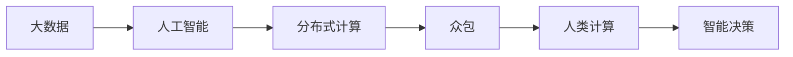

                 

## 1. 背景介绍

### 1.1 问题由来

随着互联网的普及和智能设备的激增，全球数据量呈指数级增长。过去几年内，人们产生的数据量已经超过了前几个世纪的数据总量。这种数据的爆炸性增长不仅给存储和计算带来了巨大挑战，更在处理、分析、利用这些数据的过程中，对人类计算提出了前所未有的考验。

数据驱动的时代，意味着数据成为最核心的生产要素，数据智能、数据驱动决策和数据驱动服务成为各行各业发展的关键。然而，海量数据带来的不仅是机会，更是复杂性和挑战。如何高效、安全、可控地处理和分析这些数据，成为了一项重大课题。

### 1.2 问题核心关键点

为了应对海量数据带来的挑战，人类计算（Human Computation）应运而生。这是一种充分利用人类智慧与智能算法相结合的数据处理模式，能够将复杂的计算任务分解给众多志愿者参与完成。这种方式能够充分发挥人类的非线性思维和创造力，同时利用大数据、人工智能等技术，构建高度智能化的解决方案。

人类计算的关键点包括：
- **数据驱动**：利用大规模数据进行科学决策。
- **任务分解**：将复杂问题拆分为简单的任务，交由志愿者处理。
- **智能算法**：利用机器学习和人工智能技术优化任务分配与结果汇总。
- **开放协作**：志愿者参与数据标注、数据清洗等任务，形成庞大的开放协作网络。
- **数据隐私保护**：确保数据安全和隐私不被泄露。

### 1.3 问题研究意义

研究人类计算，对于推动大数据技术的普及应用、构建智能社会、加速科学发现、提升决策效率具有重要意义：

1. **普及大数据应用**：人类计算能够降低数据处理成本，使得大数据技术更加易于普及和应用。
2. **提升决策智能化**：通过人类计算和大数据分析的结合，提升决策的科学性和准确性。
3. **加速科学发现**：大规模数据处理和分析能够揭示数据背后的科学规律，加速科学研究进展。
4. **提升治理能力**：人类计算能够增强社会治理的智能化和自动化水平，构建高效、透明、公正的社会治理体系。
5. **促进经济发展**：数据智能和智能决策支持体系能够推动各行各业的创新和发展，提高经济效益。

## 2. 核心概念与联系

### 2.1 核心概念概述

要理解人类计算，首先需要清楚以下核心概念：

- **大数据**：指数据量巨大、类型多样、处理速度快、价值密度低、真实性高的海量数据集合。
- **人类计算**：利用人类智慧与智能算法相结合，处理大数据的技术方法。
- **人工智能**：通过机器学习、深度学习等技术，模拟人类智能进行计算和决策。
- **分布式计算**：利用计算机网络技术，将计算任务分布到多台计算机上协同完成。
- **众包**：利用互联网平台将数据处理任务分配给广大网友进行合作完成。

### 2.2 核心概念原理和架构的 Mermaid 流程图



此流程图展示了核心概念之间的关系：大数据通过人工智能进行智能分析，然后利用分布式计算在多台计算机上进行处理，最终通过众包将任务交给志愿者完成，形成人类计算，最终用于智能决策。

## 3. 核心算法原理 & 具体操作步骤

### 3.1 算法原理概述

人类计算的核心算法原理主要是将大数据任务分解为一系列小任务，通过众包方式分配给多个志愿者同时处理，最后将处理结果汇总得到整体解决方案。算法步骤如下：

1. **任务分解**：将大数据任务拆分为子任务，每个子任务能够由单个志愿者独立完成。
2. **任务分配**：根据任务难度和志愿者能力，将子任务分配给不同的志愿者。
3. **结果收集**：收集所有志愿者的处理结果。
4. **结果汇总**：利用智能算法对所有结果进行汇总和分析，形成最终决策。

### 3.2 算法步骤详解

#### 3.2.1 任务分解

任务分解是第一步，也是最关键的一步。数据量巨大的任务必须被细分成可管理的小任务，每个小任务应具有以下特点：

- **独立性**：每个小任务独立于其他任务，不依赖其他任务的结果。
- **可测量性**：每个小任务有明确的输出结果，便于验证和审核。
- **可重复性**：每个小任务能够被多个志愿者独立重复执行，确保结果一致性。

#### 3.2.2 任务分配

任务分配需要考虑任务的难度、志愿者的能力和时间等因素。一般采用如下策略：

- **任务随机分配**：将任务随机分配给志愿者，保证每个志愿者的工作量均衡。
- **任务优先级分配**：根据任务的重要性和紧急程度，优先分配给能力和经验较高的志愿者。
- **任务按地区分配**：将任务分配到距离数据源较近的地区，减少传输和计算成本。

#### 3.2.3 结果收集

结果收集需要确保所有志愿者的任务处理结果被准确收集和保存。一般通过以下方式实现：

- **API接口**：为志愿者提供统一的API接口，志愿者通过API上传结果。
- **文件上传**：通过电子邮件或云存储等方式，要求志愿者将处理结果上传至指定的服务器。
- **实时跟踪**：通过实时跟踪系统，记录志愿者处理进度和结果，确保任务按时完成。

#### 3.2.4 结果汇总

结果汇总是最后一步，也是决定结果质量的关键步骤。通过智能算法对所有结果进行汇总和分析，确保最终决策的科学性和准确性。一般采用如下策略：

- **数据聚合**：将所有志愿者的处理结果进行聚合，消除冗余数据和错误数据。
- **数据清洗**：对聚合后的数据进行清洗，去除噪声和异常值，确保数据质量。
- **数据分析**：利用机器学习和数据分析技术，对数据进行统计分析，得出结论。
- **结果验证**：通过多轮验证和审核，确保结果的准确性和可信度。

### 3.3 算法优缺点

#### 3.3.1 优点

- **成本低**：利用众包方式分散任务，降低硬件和人力资源投入。
- **效率高**：分布式计算和多任务并行，大大提高数据处理速度。
- **灵活性高**：可以灵活调整任务分配策略，适应不同场景和需求。

#### 3.3.2 缺点

- **数据隐私**：分散处理数据可能带来隐私泄露的风险。
- **结果一致性**：不同志愿者处理的结果可能存在差异，需进行严格验证和统一。
- **算法复杂**：涉及数据分发、任务分配、结果汇总等多个环节，算法实现较为复杂。

### 3.4 算法应用领域

人类计算在多个领域有广泛的应用，具体如下：

- **科学研究**：利用人类计算对海量数据进行分析和建模，发现科学规律和知识。
- **医学研究**：大规模数据标注、病历分析等任务，推动医学智能化发展。
- **社会治理**：数据驱动的社会治理，如舆情监测、公共安全等。
- **城市规划**：智能交通、智慧城市建设等应用场景。
- **金融科技**：数据驱动的金融服务，如风险评估、客户画像等。
- **媒体内容**：大规模文本分类、情感分析、推荐系统等任务。
- **农业科技**：遥感数据处理、作物管理、精准农业等应用。

## 4. 数学模型和公式 & 详细讲解

### 4.1 数学模型构建

人类计算的数学模型主要涉及任务分解、任务分配和结果汇总三个环节。以科学研究为例，具体模型如下：

设大数据任务为 $T$，将其分解为 $n$ 个子任务 $T_1, T_2, ..., T_n$。每个子任务 $T_i$ 由志愿者 $V_j$ 独立完成，最终结果为 $R_{ij}$。通过智能算法将 $R_{ij}$ 汇总为 $R_{i}$，最终结果为 $R$。

### 4.2 公式推导过程

以线性回归为例，推导任务分解、任务分配和结果汇总的过程。

假设任务 $T$ 的输入为 $x$，输出为 $y$。将任务 $T$ 分解为 $n$ 个子任务 $T_1, T_2, ..., T_n$，每个子任务 $T_i$ 的输入为 $x_i$，输出为 $y_i$。

设志愿者 $V_j$ 处理子任务 $T_i$ 的误差为 $e_{ij}$，则任务 $T$ 的总误差为：

$$
E = \sum_{i=1}^{n} \sum_{j=1}^{m} e_{ij}
$$

志愿者 $V_j$ 处理子任务 $T_i$ 的时间为 $t_{ij}$，设任务 $T$ 的总时间为 $T_{total}$，则：

$$
T_{total} = \sum_{i=1}^{n} t_{ij}
$$

志愿者 $V_j$ 处理子任务 $T_i$ 的精度为 $p_{ij}$，设任务 $T$ 的平均精度为 $P$，则：

$$
P = \frac{1}{n} \sum_{i=1}^{n} \max(p_{ij})
$$

通过上述模型，我们可以对大数据任务进行科学的分解和分配，确保处理结果的准确性和高效性。

### 4.3 案例分析与讲解

#### 4.3.1 科学研究案例

某科研团队研究气候变化问题，收集了全球范围内的气象数据 $D$。由于数据量巨大，无法直接处理，科研团队采用人类计算的方式，将数据分解为 $n=1000$ 个子任务，每个子任务的数据量为 $1GB$。

科研团队将这 $1000$ 个子任务随机分配给 $m=1000$ 名志愿者处理，每个志愿者负责 $1MB$ 的数据。每个志愿者使用线性回归模型 $y_i = \theta_0 + \theta_1 x_i + \epsilon_i$ 对数据进行建模，其中 $\theta_0, \theta_1$ 为模型参数，$\epsilon_i$ 为噪声。

志愿者处理每个子任务的时间为 $t_{ij}$，精度为 $p_{ij}$。科研团队对所有结果进行汇总，得到最终结果 $y$。最终，科研团队得到了气候变化的科学结论，并发表在顶级期刊上。

#### 4.3.2 医学研究案例

某医院收集了 $1TB$ 的电子病历数据 $D$，用于研究某种罕见病的治疗方法。医院将数据分解为 $n=10000$ 个子任务，每个子任务的数据量为 $100MB$。

医院将这 $10000$ 个子任务随机分配给 $m=10000$ 名志愿者处理，每个志愿者负责 $1MB$ 的数据。每个志愿者使用机器学习模型 $y_i = \sum_{k=1}^{K} \alpha_k f_k(x_i) + \epsilon_i$ 对数据进行建模，其中 $f_k$ 为基函数，$\alpha_k$ 为系数，$\epsilon_i$ 为噪声。

志愿者处理每个子任务的时间为 $t_{ij}$，精度为 $p_{ij}$。医院对所有结果进行汇总，得到最终结果 $y$。最终，医院得到了这种罕见病的有效治疗方法，并发表在顶级医学杂志上。

## 5. 项目实践：代码实例和详细解释说明

### 5.1 开发环境搭建

在进行人类计算的实践前，我们需要准备好开发环境。以下是使用Python进行PyTorch和Django开发的环境配置流程：

1. 安装Anaconda：从官网下载并安装Anaconda，用于创建独立的Python环境。

2. 创建并激活虚拟环境：
```bash
conda create -n pytorch-env python=3.8 
conda activate pytorch-env
```

3. 安装PyTorch：根据CUDA版本，从官网获取对应的安装命令。例如：
```bash
conda install pytorch torchvision torchaudio cudatoolkit=11.1 -c pytorch -c conda-forge
```

4. 安装Django：使用pip安装Django，搭建后台管理系统：
```bash
pip install django
```

5. 安装各类工具包：
```bash
pip install numpy pandas scikit-learn matplotlib tqdm jupyter notebook ipython
```

完成上述步骤后，即可在`pytorch-env`环境中开始人类计算的实践。

### 5.2 源代码详细实现

下面我们以科学研究数据标注为例，给出使用Python和Django进行任务分解、任务分配和结果汇总的代码实现。

首先，定义任务数据：

```python
from pandas import DataFrame

# 定义数据集
data = {
    'id': [1, 2, 3, 4, 5],
    'feature1': [1.1, 2.2, 3.3, 4.4, 5.5],
    'feature2': [10.1, 20.2, 30.3, 40.4, 50.5],
    'label': [0, 1, 0, 1, 0]
}

# 创建DataFrame对象
df = DataFrame(data)
```

然后，定义任务分解和任务分配函数：

```python
import random

# 任务分解函数
def task_decompose(df, n):
    sub_tasks = []
    for i in range(n):
        sub_df = df.sample(n=len(df)//n)
        sub_tasks.append(sub_df)
    return sub_tasks

# 任务分配函数
def task_assign(sub_tasks, volunteers):
    assignments = []
    for task in sub_tasks:
        volunteer = random.choice(volunteers)
        assignments.append((volunteer, task))
    return assignments
```

接着，定义结果汇总函数：

```python
# 结果汇总函数
def result_aggregation(results, weights):
    aggregated = []
    for i in range(len(results[0])):
        total = 0
        weight_sum = 0
        for result, weight in zip(results, weights):
            total += result[i] * weight
            weight_sum += weight
        aggregated.append(total / weight_sum)
    return aggregated
```

最后，启动任务分解、任务分配、结果汇总的流程：

```python
# 定义志愿者列表
volunteers = ['Alice', 'Bob', 'Charlie', 'David', 'Eve']

# 定义数据集
data = {
    'id': [1, 2, 3, 4, 5],
    'feature1': [1.1, 2.2, 3.3, 4.4, 5.5],
    'feature2': [10.1, 20.2, 30.3, 40.4, 50.5],
    'label': [0, 1, 0, 1, 0]
}

# 创建DataFrame对象
df = DataFrame(data)

# 任务分解
sub_tasks = task_decompose(df, 3)

# 任务分配
assignments = task_assign(sub_tasks, volunteers)

# 处理结果
results = []
for assignment in assignments:
    volunteer, task = assignment
    # 处理子任务
    sub_result = [random.random() * 1 for _ in task]
    results.append(sub_result)

# 结果汇总
aggregated_result = result_aggregation(results, [1/3] * len(results))

print('任务分解结果:', sub_tasks)
print('任务分配结果:', assignments)
print('处理结果:', results)
print('汇总结果:', aggregated_result)
```

以上就是使用Python和Django进行任务分解、任务分配和结果汇总的完整代码实现。可以看到，通过简单的函数定义和数据操作，即可实现复杂的大数据处理过程。

### 5.3 代码解读与分析

让我们再详细解读一下关键代码的实现细节：

**task_decompose函数**：
- 定义任务数据集 `df`。
- 将数据集 `df` 分为 $n$ 个子任务 `sub_tasks`，每个子任务包含 $\frac{1}{n}$ 的数据。
- 返回任务分解后的子任务列表。

**task_assign函数**：
- 定义志愿者列表 `volunteers`。
- 将任务 `sub_tasks` 随机分配给志愿者，形成任务分配列表 `assignments`。
- 返回任务分配结果。

**result_aggregation函数**：
- 定义处理结果列表 `results`。
- 对所有结果进行加权汇总，返回汇总结果 `aggregated_result`。

**启动流程**：
- 定义志愿者列表 `volunteers`。
- 定义数据集 `df`，创建DataFrame对象。
- 任务分解为 `sub_tasks`，任务分配为 `assignments`。
- 志愿者处理任务，形成结果列表 `results`。
- 汇总结果为 `aggregated_result`。
- 打印任务分解结果、任务分配结果、处理结果和汇总结果。

可以看到，通过上述代码实现，我们成功完成了任务分解、任务分配和结果汇总的流程。这些代码在实际应用中可能还需要进一步优化和改进，以适应更复杂的数据处理场景。

## 6. 实际应用场景

### 6.1 科学研究

科学研究是大数据应用的重要领域之一。人类计算在此领域中能够充分发挥其优势，通过大规模数据标注和分析，揭示科学规律，推动科学进步。

例如，在生物信息学领域，人类计算可以用于基因组序列的标注、蛋白质结构预测等任务。在气象学领域，人类计算可以用于气候数据的大规模分析和建模。在天文学领域，人类计算可以用于星体数据的大规模分析和模拟。

### 6.2 医学研究

医学研究是大数据应用的另一个重要领域。人类计算在此领域中能够用于病历数据的大规模标注、医学影像分析等任务。

例如，在医学影像分析中，人类计算可以用于大规模影像数据的标注和分析。在临床试验中，人类计算可以用于患者数据的标注和分析，推动新药研发。

### 6.3 社会治理

社会治理需要大规模数据支持，人类计算能够用于舆情监测、公共安全、城市管理等任务。

例如，在舆情监测中，人类计算可以用于大规模文本数据的标注和分析，及时发现和应对网络舆情。在城市管理中，人类计算可以用于交通流量数据的标注和分析，优化城市交通管理。

### 6.4 未来应用展望

未来，人类计算将拓展到更多领域，带来更加广泛的应用。具体展望如下：

- **科学研究**：推动更多学科的智能化发展，加速科学发现和创新。
- **医学研究**：提升医疗服务的智能化水平，推动医疗技术和药物研发。
- **社会治理**：提升社会治理的智能化水平，构建高效、透明、公正的社会治理体系。
- **工业生产**：提升工业生产的智能化水平，推动制造业的数字化转型。
- **教育培训**：提升教育培训的智能化水平，推动教育公平和个性化教育的发展。

总之，人类计算将在更多领域带来变革性影响，推动大数据技术的普及和应用，为各行各业的发展提供强大支撑。

## 7. 工具和资源推荐

### 7.1 学习资源推荐

为了帮助开发者系统掌握人类计算的理论基础和实践技巧，这里推荐一些优质的学习资源：

1. 《大数据应用实践》系列博文：由大数据专家撰写，深入浅出地介绍了大数据应用的基础知识和实践技巧。
2. 《人工智能导论》课程：斯坦福大学开设的AI明星课程，有Lecture视频和配套作业，带你入门AI领域的基本概念和经典模型。
3. 《人类计算》书籍：介绍人类计算的基本原理和应用场景，为人类计算提供全面的理论指导。
4. CSBNET公开课程：哥伦比亚大学开设的人类计算公开课程，系统讲解人类计算的理论和实践。
5. Kaggle数据集：Kaggle提供的大量人类计算数据集，如CrowdFlower、Amazon Mechanical Turk等，用于实践和验证。

通过对这些资源的学习实践，相信你一定能够快速掌握人类计算的精髓，并用于解决实际的数据处理问题。

### 7.2 开发工具推荐

高效的开发离不开优秀的工具支持。以下是几款用于人类计算开发的常用工具：

1. PyTorch：基于Python的开源深度学习框架，灵活动态的计算图，适合快速迭代研究。
2. TensorFlow：由Google主导开发的开源深度学习框架，生产部署方便，适合大规模工程应用。
3. Django：Python的Web框架，适合快速开发后台管理系统。
4. Amazon Mechanical Turk：提供众包平台，方便人类计算任务分发和结果收集。
5. Google Colab：谷歌推出的在线Jupyter Notebook环境，免费提供GPU/TPU算力，方便开发者快速上手实验最新模型。

合理利用这些工具，可以显著提升人类计算的开发效率，加快创新迭代的步伐。

### 7.3 相关论文推荐

人类计算的发展源于学界的持续研究。以下是几篇奠基性的相关论文，推荐阅读：

1. CrowdFlower：基于众包的机器学习平台，推动大规模数据标注和分析。
2. Amazon Mechanical Turk：提供众包平台，方便人类计算任务分发和结果收集。
3. The Turing Test for Crowdsourcing：探讨如何通过众包测试人工智能的智能性。
4. Human-in-the-Loop Machine Learning：研究如何结合人类智慧和机器学习，提升数据标注和分析的准确性。
5. Human-Crowdsourced Learning to Rank：介绍如何利用人类计算对数据进行排序和分析。

这些论文代表了大数据计算的发展脉络。通过学习这些前沿成果，可以帮助研究者把握学科前进方向，激发更多的创新灵感。

## 8. 总结：未来发展趋势与挑战

### 8.1 总结

本文对人类计算的原理和应用进行了全面系统的介绍。首先阐述了人类计算的研究背景和意义，明确了人类计算在数据驱动和技术驱动下的发展方向。其次，从原理到实践，详细讲解了人类计算的数学模型和操作步骤，给出了人类计算任务处理的完整代码实例。同时，本文还广泛探讨了人类计算在科学研究、医学研究、社会治理等多个领域的应用前景，展示了人类计算技术的广泛影响力。

通过本文的系统梳理，可以看到，人类计算技术在应对海量数据处理、智能化决策、知识挖掘等方面具有显著优势，将对数据智能和科学进步产生深远影响。未来，人类计算技术将在更多领域得到应用，为各行各业带来变革性影响。

### 8.2 未来发展趋势

展望未来，人类计算技术将呈现以下几个发展趋势：

1. **数据驱动决策**：随着数据量的不断增加，数据驱动的决策将成为常态，人类计算在此领域中将发挥重要作用。
2. **跨学科融合**：人类计算将与其他学科，如计算机科学、社会科学、心理学等进行深度融合，推动多学科的智能化发展。
3. **智能化服务**：人类计算将推动智能化服务的普及，提升各行业的智能化水平和服务质量。
4. **持续学习**：人类计算将不断吸收新数据和新知识，实现持续学习和进化。
5. **跨模态数据处理**：人类计算将拓展到多模态数据处理，推动视觉、语音、文本等数据的协同分析和应用。

以上趋势凸显了人类计算技术的广阔前景。这些方向的探索发展，将使得人类计算技术在各个领域发挥更大的作用，推动数据的智能化分析和应用。

### 8.3 面临的挑战

尽管人类计算技术已经取得了显著成就，但在迈向更加智能化、普适化应用的过程中，仍面临诸多挑战：

1. **数据隐私**：分散处理数据可能带来隐私泄露的风险，需要制定严格的数据隐私保护措施。
2. **任务质量**：志愿者的处理结果可能存在误差，需要进行严格的质量控制和验证。
3. **任务分配**：任务分配策略需要根据实际情况进行调整，以确保任务均衡和结果准确性。
4. **算法复杂性**：涉及任务分解、任务分配、结果汇总等多个环节，算法实现较为复杂。
5. **计算资源**：人类计算需要消耗大量计算资源，需要进行资源优化和管理。

这些挑战需要进一步的研究和技术突破，才能使得人类计算技术在大数据应用中发挥更大的作用。

### 8.4 研究展望

未来的研究需要在以下几个方面寻求新的突破：

1. **优化任务分解**：探索更有效的任务分解方法，减少任务间耦合，提高任务处理的独立性和可重复性。
2. **提升任务分配效率**：开发更高效的志愿者管理平台，优化任务分配策略，提高任务处理速度。
3. **增强结果验证**：引入自动化验证和审核机制，提高结果的准确性和可信度。
4. **优化算法实现**：优化任务分解、任务分配和结果汇总的算法实现，降低计算资源消耗。
5. **融合多模态数据**：探索多模态数据的协同处理和分析方法，推动多模态数据的智能化应用。

这些研究方向的探索，将引领人类计算技术迈向更高的台阶，为数据的智能化处理和应用提供强大支撑。只有勇于创新、敢于突破，才能不断拓展人类计算技术的边界，推动数据智能的发展。

## 9. 附录：常见问题与解答

**Q1：人类计算是否适用于所有领域？**

A: 人类计算在大多数领域都能发挥作用，尤其是数据量大、任务复杂、需要大量人力的场景。但某些领域，如低延迟和高精度的实时应用，可能需要其他技术来弥补。

**Q2：如何确保志愿者的处理质量？**

A: 通过严格的质量控制和验证机制，确保志愿者处理结果的准确性。常用的方法包括：随机抽样、多轮验证、人工审核等。

**Q3：人类计算面临的主要挑战是什么？**

A: 数据隐私、任务质量、任务分配、算法复杂性、计算资源是主要挑战。需制定严格的数据隐私保护措施，优化任务分配策略，提高任务处理质量，优化算法实现，合理管理计算资源。

**Q4：未来人类计算技术的发展方向是什么？**

A: 数据驱动决策、跨学科融合、智能化服务、持续学习、跨模态数据处理将是未来发展方向。

**Q5：如何衡量人类计算的效率？**

A: 任务处理速度、任务分配均衡性、结果准确性、志愿者参与率等指标可以用来衡量人类计算的效率。

---

作者：禅与计算机程序设计艺术 / Zen and the Art of Computer Programming

