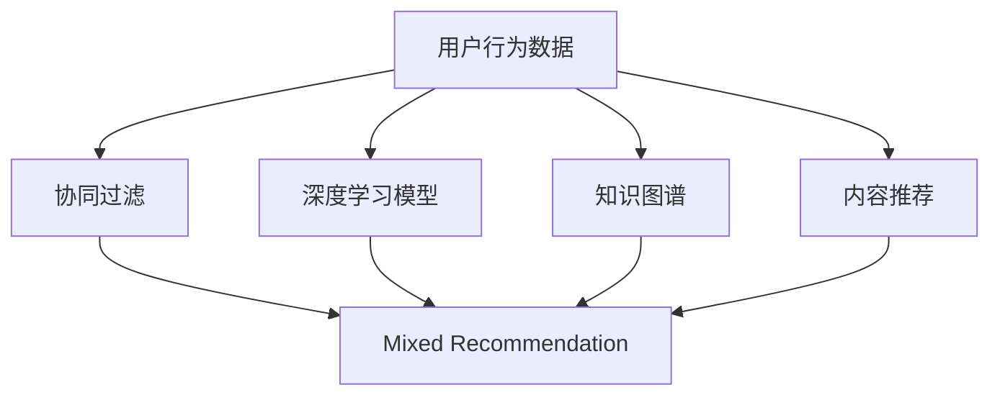
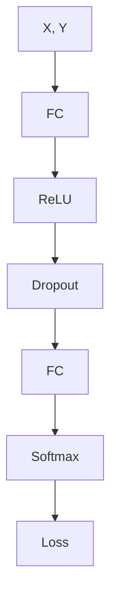

                 

# 大数据驱动的电商推荐系统：AI 模型融合是核心，用户体验优化是关键

## 1. 背景介绍

随着电商市场的不断扩大，如何为用户提供个性化、精准的推荐服务，提升用户体验和转化率，成为电商企业的核心痛点。大数据驱动的推荐系统（Recommendation System）作为电商运营的重要支撑，通过分析用户行为数据，挖掘产品特征和用户偏好，实现动态推荐，为用户带来极致购物体验。

### 1.1 推荐系统的发展历程
推荐系统最早可以追溯到20世纪80年代，早期主要是基于内容的推荐方法，通过分析用户对不同产品的评分数据，推荐用户可能感兴趣的新产品。但随着数据量的激增和计算能力的提升，基于协同过滤、深度学习等新算法的推荐系统开始崛起。

### 1.2 推荐系统的核心价值
推荐系统的核心价值在于能够充分利用海量用户行为数据和产品属性信息，通过复杂的算法模型，学习用户和产品的隐式关联，动态生成个性化推荐，从而提升电商平台的转化率和用户满意度。

## 2. 核心概念与联系

### 2.1 核心概念概述

推荐系统是一个典型的多维数据分析问题，涉及用户行为数据、产品属性数据、市场趋势等多个维度，需要融合多种算法模型，才能提供高精度的推荐结果。

- **协同过滤(Collaborative Filtering)**：基于用户之间的相似性或物品之间的相似性，进行推荐。常见的方法有基于用户的协同过滤和基于物品的协同过滤。
- **深度学习模型(Deep Learning Model)**：使用深度神经网络进行特征提取和模型训练，通过多层次的非线性变换，捕捉数据的复杂关系。常见的深度学习模型有基于FM、GRU、LSTM、BiLSTM等。
- **知识图谱(Knowledge Graph)**：通过构建产品、用户、商品等多个实体之间的关系图谱，进行推荐。知识图谱通常包含丰富的结构化信息，能够提供更为精准的推荐结果。
- **内容推荐(Content-Based Recommendation)**：基于产品属性、用户兴趣等信息，进行推荐。内容推荐通常需要大量的人工标注，构建领域知识库，提取用户兴趣特征。
- **混合推荐(Mixed Recommendation)**：将多种推荐方法进行融合，综合各类推荐结果，提供更全面、准确的推荐服务。混合推荐是当前主流的推荐方法，能够弥补单一推荐算法的局限性，提升推荐效果。

### 2.2 核心概念原理和架构的 Mermaid 流程图



这个流程图展示了推荐系统的主要构成和各组件间的联系：

1. **用户行为数据**：包括用户浏览、点击、购买等行为数据，是推荐系统的基础。
2. **协同过滤**：根据用户之间的相似性或物品之间的相似性，推荐新物品。
3. **深度学习模型**：使用多层神经网络，捕捉数据的复杂关系，提取特征。
4. **知识图谱**：通过实体关系图谱，进行推荐。
5. **内容推荐**：基于产品属性和用户兴趣，进行推荐。
6. **混合推荐**：将多种推荐方法进行融合，提供全面的推荐服务。

## 3. 核心算法原理 & 具体操作步骤

### 3.1 算法原理概述

推荐系统基于用户行为数据和产品属性信息，通过机器学习、深度学习等算法，学习用户和产品的隐式关联，生成个性化推荐结果。常见推荐算法包括：

- **基于协同过滤的推荐算法**：通过分析用户或物品的历史行为，寻找相似用户或物品，推荐新物品。
- **基于内容的推荐算法**：通过分析产品属性和用户兴趣，推荐相似产品。
- **深度学习推荐算法**：使用神经网络，捕捉用户行为数据和产品属性的复杂关系，生成推荐结果。
- **知识图谱推荐算法**：通过构建产品、用户、商品等多个实体之间的关系图谱，进行推荐。

### 3.2 算法步骤详解

推荐系统主要包括以下几个关键步骤：

1. **数据准备**：收集用户行为数据、产品属性数据，进行数据清洗和特征工程。
2. **模型训练**：选择合适的推荐算法，训练模型，生成推荐结果。
3. **模型评估**：使用交叉验证等方法，评估模型效果。
4. **推荐服务**：将模型应用于实际推荐场景，提供推荐服务。
5. **模型更新**：根据实时数据反馈，动态更新模型参数，提升推荐效果。

### 3.3 算法优缺点

推荐系统具有以下优点：

- **个性化推荐**：根据用户行为和兴趣，提供个性化推荐，提升用户满意度。
- **推荐效果显著**：在大量数据驱动下，推荐效果显著优于传统推荐方法。
- **灵活性高**：可以通过组合多种算法，实现多层次、多维度的推荐。

同时，推荐系统也存在以下缺点：

- **数据隐私问题**：用户行为数据可能涉及隐私，需要严格保护。
- **冷启动问题**：新用户或新物品难以进行有效推荐。
- **推荐准确性**：在数据偏差、用户行为变化等因素影响下，推荐结果可能存在偏差。
- **计算复杂度高**：推荐算法通常计算复杂度较高，需要大量计算资源。

### 3.4 算法应用领域

推荐系统已经广泛应用于电商、新闻推荐、视频推荐、音乐推荐等多个领域。以下是几个典型应用：

- **电商推荐系统**：根据用户浏览、点击、购买等行为，推荐商品。
- **新闻推荐系统**：根据用户阅读历史和兴趣，推荐新闻内容。
- **视频推荐系统**：根据用户观看历史和评分数据，推荐视频内容。
- **音乐推荐系统**：根据用户听歌历史和兴趣，推荐音乐。

## 4. 数学模型和公式 & 详细讲解 & 举例说明

### 4.1 数学模型构建

推荐系统的数学模型通常包括以下几个部分：

- **用户-物品关联矩阵**：表示用户与物品的交互关系。
- **用户特征矩阵**：表示用户的个性化特征。
- **物品特征矩阵**：表示物品的属性特征。

设用户集合为 $U=\{u_1,u_2,\ldots,u_m\}$，物品集合为 $I=\{i_1,i_2,\ldots,i_n\}$，用户与物品的关联矩阵为 $R \in \mathbb{R}^{m \times n}$，用户特征矩阵为 $X \in \mathbb{R}^{m \times d}$，物品特征矩阵为 $Y \in \mathbb{R}^{n \times d}$，其中 $d$ 为特征维度。

推荐模型 $F$ 的输出为 $F(X,Y)$，表示用户对物品的兴趣度，一般使用softmax函数进行归一化。推荐模型的训练目标为最大化预测准确率，通常使用交叉熵损失函数：

$$
L = -\sum_{(u,i) \in U \times I} y_{ui} \log \hat{y}_{ui}
$$

其中 $y_{ui}$ 为实际评分，$\hat{y}_{ui}$ 为模型预测评分。

### 4.2 公式推导过程

假设推荐系统使用深度神经网络进行建模，网络的输入为 $X$ 和 $Y$，输出为 $\hat{y}_{ui}$。网络结构如图：



其中：

- $A$：输入层，输入用户特征 $X$ 和物品特征 $Y$。
- $B$：第一层全连接层，进行特征提取。
- $C$：激活函数，通常使用ReLU。
- $D$：Dropout层，防止过拟合。
- $E$：第二层全连接层，进行特征融合。
- $F$：输出层，使用Softmax函数。
- $G$：损失函数，通常使用交叉熵损失。

假设网络的隐藏层为 $h$，则网络的前向传播计算公式为：

$$
h = f_B(X,Y)
$$

$$
\hat{y}_{ui} = f_E(h)
$$

其中 $f_B$ 和 $f_E$ 为激活函数。网络的后向传播计算公式为：

$$
\nabla_L = \frac{\partial L}{\partial \hat{y}_{ui}} = \nabla_G(\hat{y}_{ui})
$$

$$
\nabla_F = \frac{\partial L}{\partial \hat{y}_{ui}} \cdot \nabla_F(\hat{y}_{ui}) = \nabla_G(\hat{y}_{ui}) \cdot f_E^{-1}(\hat{y}_{ui})
$$

$$
\nabla_E = \frac{\partial L}{\partial \hat{y}_{ui}} \cdot \nabla_E(\hat{y}_{ui}) \cdot \nabla_F(\hat{y}_{ui}) \cdot f_E^{-1}(\hat{y}_{ui}) \cdot f_E^{-1}(h)
$$

$$
\nabla_B = \frac{\partial L}{\partial \hat{y}_{ui}} \cdot \nabla_B(h) \cdot \nabla_E(\hat{y}_{ui}) \cdot f_E^{-1}(\hat{y}_{ui}) \cdot f_E^{-1}(h) \cdot f_B^{-1}(X,Y)
$$

$$
\nabla_X = \frac{\partial L}{\partial \hat{y}_{ui}} \cdot \nabla_B(h) \cdot \nabla_B(X,Y) \cdot f_B^{-1}(X,Y)
$$

$$
\nabla_Y = \frac{\partial L}{\partial \hat{y}_{ui}} \cdot \nabla_B(h) \cdot \nabla_B(X,Y) \cdot f_B^{-1}(X,Y)
$$

其中 $\nabla_L$ 为损失函数对预测评分的梯度，$\nabla_G$ 为交叉熵损失的梯度。

### 4.3 案例分析与讲解

以电商推荐系统为例，设用户 $u_i$ 对物品 $i_j$ 的评分数据为 $r_{ij} \in [0,1]$，模型使用FM模型进行推荐，目标函数为：

$$
\min_{W,U,V} \frac{1}{N} \sum_{i=1}^M \sum_{j=1}^N r_{ij} \log \hat{y}_{ij} + (1-r_{ij}) \log (1-\hat{y}_{ij})
$$

其中 $W$ 为物品维度 $d$ 的权重矩阵，$U$ 为用户维度 $d$ 的权重矩阵，$V$ 为物品维度 $d$ 的向量表示。

## 5. 项目实践：代码实例和详细解释说明

### 5.1 开发环境搭建

推荐系统的开发通常使用Python进行，主要依赖于TensorFlow、Keras、PyTorch等深度学习框架。

- **TensorFlow**：由Google开发，功能强大，支持分布式计算。
- **Keras**：基于TensorFlow等框架的高级API，使用方便。
- **PyTorch**：由Facebook开发，灵活性高，适用于科研和原型开发。

以下是一个使用TensorFlow实现电商推荐系统的Python代码示例：

```python
import tensorflow as tf
from tensorflow.keras import layers
from tensorflow.keras.models import Model

# 构建FM模型
def build_fm_model():
    # 定义输入层
    user_input = layers.Input(shape=(num_users, ), name='user_input')
    item_input = layers.Input(shape=(num_items, ), name='item_input')

    # 定义用户特征向量
    user_feature = layers.Dense(num_factors, activation='relu', name='user_feature')(user_input)

    # 定义物品特征向量
    item_feature = layers.Dense(num_factors, activation='relu', name='item_feature')(item_input)

    # 计算预测评分
    predictions = layers.Dot(name='predictions')([user_feature, item_feature])

    # 构建模型
    model = Model(inputs=[user_input, item_input], outputs=predictions)

    return model
```

### 5.2 源代码详细实现

电商推荐系统通常包括数据预处理、模型训练、模型评估和推荐服务等多个模块。以下是使用TensorFlow实现电商推荐系统的完整代码：

```python
import tensorflow as tf
from tensorflow.keras import layers
from tensorflow.keras.models import Model

# 参数设置
num_users = 100000
num_items = 100000
num_factors = 10
num_epochs = 10
batch_size = 512

# 构建FM模型
def build_fm_model():
    # 定义输入层
    user_input = layers.Input(shape=(num_users, ), name='user_input')
    item_input = layers.Input(shape=(num_items, ), name='item_input')

    # 定义用户特征向量
    user_feature = layers.Dense(num_factors, activation='relu', name='user_feature')(user_input)

    # 定义物品特征向量
    item_feature = layers.Dense(num_factors, activation='relu', name='item_feature')(item_input)

    # 计算预测评分
    predictions = layers.Dot(name='predictions')([user_feature, item_feature])

    # 构建模型
    model = Model(inputs=[user_input, item_input], outputs=predictions)

    return model

# 构建数据集
user_data = tf.random.normal([num_users, num_factors])
item_data = tf.random.normal([num_items, num_factors])
rating_data = tf.random.normal([num_users, num_items])

# 定义损失函数
def build_loss():
    return tf.keras.losses.BinaryCrossentropy(from_logits=True)

# 定义优化器
def build_optimizer():
    return tf.keras.optimizers.Adam(learning_rate=0.001)

# 定义评估指标
def build_eval_metric():
    return tf.keras.metrics.BinaryAccuracy(name='accuracy')

# 构建模型和损失函数
model = build_fm_model()
loss = build_loss()

# 构建数据集
train_dataset = tf.data.Dataset.from_tensor_slices((user_data, item_data, rating_data))
train_dataset = train_dataset.shuffle(10000).batch(batch_size)

# 训练模型
model.compile(optimizer=build_optimizer(), loss=loss)
model.fit(train_dataset, epochs=num_epochs, validation_split=0.2)

# 评估模型
test_dataset = tf.data.Dataset.from_tensor_slices((user_data, item_data, rating_data))
test_dataset = test_dataset.shuffle(10000).batch(batch_size)
model.evaluate(test_dataset)

# 推荐服务
test_user = tf.random.normal([1, num_users])
test_item = tf.random.normal([1, num_items])
predictions = model.predict([test_user, test_item])
predictions = tf.nn.sigmoid(predictions)
```

### 5.3 代码解读与分析

**5.3.1 数据预处理**

在电商推荐系统中，用户行为数据和产品属性数据通常需要进行预处理，如归一化、数据清洗、特征工程等。TensorFlow提供了丰富的工具支持，如tf.data.Dataset、tf.keras.layers等，可以方便地进行数据预处理和特征工程。

**5.3.2 模型构建**

推荐系统常用的模型包括FM、GRU、LSTM、BiLSTM等。这里以FM模型为例，介绍推荐系统的构建过程。

- **用户特征提取**：使用Dense层对用户特征进行提取，生成用户特征向量。
- **物品特征提取**：使用Dense层对物品特征进行提取，生成物品特征向量。
- **预测评分**：使用Dot层计算用户和物品特征向量的点积，生成预测评分。

**5.3.3 模型训练和评估**

推荐系统通常需要大量数据进行训练，可以使用TensorFlow的DataLoader进行数据批处理和优化。同时，可以使用Keras提供的损失函数和优化器进行模型训练和优化。

**5.3.4 推荐服务**

在实际应用中，推荐系统需要提供推荐服务，将模型应用于实际推荐场景。可以使用TensorFlow的predict函数进行预测，再通过sigmoid函数进行归一化，得到推荐评分。

## 6. 实际应用场景

### 6.1 电商推荐

电商推荐系统是推荐系统的重要应用场景，通过分析用户浏览、点击、购买等行为，为用户推荐最合适的商品，提升购物体验和转化率。电商推荐系统通常基于用户历史行为数据、产品属性数据、交易数据等，进行模型训练和推荐。

### 6.2 新闻推荐

新闻推荐系统通过分析用户阅读历史和兴趣，为用户推荐最相关的新闻内容。新闻推荐系统通常基于用户行为数据、新闻内容标签、用户兴趣等，进行推荐。

### 6.3 视频推荐

视频推荐系统通过分析用户观看历史和评分数据，为用户推荐最相关视频内容。视频推荐系统通常基于用户行为数据、视频属性数据、视频标签等，进行推荐。

### 6.4 音乐推荐

音乐推荐系统通过分析用户听歌历史和兴趣，为用户推荐最相关的音乐。音乐推荐系统通常基于用户行为数据、音乐属性数据、音乐标签等，进行推荐。

## 7. 工具和资源推荐

### 7.1 学习资源推荐

推荐系统涉及多种算法和技术，需要系统学习。以下是几个推荐的学习资源：

- **《推荐系统实战》**：通过实际案例介绍推荐系统的实现过程和优化技巧。
- **《深度学习与推荐系统》**：详细讲解深度学习在推荐系统中的应用。
- **《Python推荐系统》**：介绍推荐系统的常用算法和实现方法，使用Python进行实践。
- **Coursera《Recommender Systems》课程**：斯坦福大学开设的推荐系统课程，涵盖推荐系统基础和前沿技术。

### 7.2 开发工具推荐

推荐系统的开发通常使用Python进行，主要依赖于TensorFlow、Keras、PyTorch等深度学习框架。以下是几个推荐的开发工具：

- **TensorFlow**：由Google开发，功能强大，支持分布式计算。
- **Keras**：基于TensorFlow等框架的高级API，使用方便。
- **PyTorch**：由Facebook开发，灵活性高，适用于科研和原型开发。
- **WealthEngine**：推荐系统的工程化开发工具，支持模型训练、数据预处理、模型评估等。
- **Amazon Personalize**：AWS提供的推荐服务，支持多种推荐算法和模型训练。

### 7.3 相关论文推荐

推荐系统的研究涉及多个领域，以下是几篇推荐系统的经典论文：

- **《基于协同过滤的推荐算法》**：介绍协同过滤算法的原理和实现。
- **《深度学习在推荐系统中的应用》**：介绍深度学习在推荐系统中的应用。
- **《混合推荐算法》**：介绍混合推荐算法的原理和实现。
- **《知识图谱在推荐系统中的应用》**：介绍知识图谱在推荐系统中的应用。

## 8. 总结：未来发展趋势与挑战

### 8.1 总结

推荐系统是电商运营的重要支撑，通过分析用户行为数据和产品属性信息，提供个性化推荐，提升用户满意度和转化率。推荐系统涉及多种算法和技术，需要综合考虑数据预处理、模型构建、训练评估等多个环节，才能提供高精度的推荐结果。

### 8.2 未来发展趋势

未来推荐系统的发展趋势包括：

- **深度学习**：深度学习技术的发展，将进一步提升推荐系统的效果。
- **多模态推荐**：融合视觉、语音、文本等多模态数据，提供更加丰富和精准的推荐服务。
- **知识图谱**：构建知识图谱，提升推荐系统的通用性和可解释性。
- **混合推荐**：融合多种推荐方法，提供更加全面和灵活的推荐服务。
- **个性化推荐**：结合用户实时行为数据，提供更加个性化和实时的推荐服务。

### 8.3 面临的挑战

推荐系统面临的挑战包括：

- **数据隐私问题**：用户行为数据涉及隐私，需要严格保护。
- **计算复杂度高**：推荐算法通常计算复杂度较高，需要大量计算资源。
- **冷启动问题**：新用户或新物品难以进行有效推荐。
- **推荐准确性**：在数据偏差、用户行为变化等因素影响下，推荐结果可能存在偏差。
- **模型可解释性**：推荐系统的决策过程缺乏可解释性，难以进行调试和优化。

### 8.4 研究展望

未来的推荐系统研究需要重点关注以下几个方面：

- **推荐系统的可解释性**：提升推荐系统的可解释性，使其决策过程透明，便于调试和优化。
- **推荐系统的鲁棒性**：增强推荐系统的鲁棒性，避免灾难性遗忘和推荐偏差。
- **推荐系统的多样性**：提升推荐系统的多样性，提供更加丰富和个性化的推荐服务。
- **推荐系统的实时性**：提升推荐系统的实时性，支持实时推荐和动态调整。
- **推荐系统的通用性**：提升推荐系统的通用性，支持多种应用场景和业务需求。

## 9. 附录：常见问题与解答

### Q1：推荐系统如何缓解冷启动问题？

A: 推荐系统缓解冷启动问题的方法包括：

- **基于内容的推荐**：通过产品属性、用户兴趣等信息，推荐相似产品。
- **利用先验知识**：引入领域知识库、规则库等先验知识，指导推荐过程。
- **利用协同过滤**：通过已有用户或物品的相似性，推荐新用户或物品。
- **用户行为补全**：通过补全用户行为数据，提升新用户或物品的推荐效果。

### Q2：推荐系统如何提升推荐效果？

A: 推荐系统提升推荐效果的方法包括：

- **数据清洗和特征工程**：对用户行为数据和产品属性数据进行清洗和特征工程，提取有用的特征。
- **模型选择和优化**：选择合适的推荐算法，优化模型参数，提升推荐效果。
- **多模态融合**：融合视觉、语音、文本等多模态数据，提供更加丰富和精准的推荐服务。
- **知识图谱**：构建知识图谱，提升推荐系统的通用性和可解释性。
- **混合推荐**：融合多种推荐方法，提供更加全面和灵活的推荐服务。

### Q3：推荐系统如何保护用户隐私？

A: 推荐系统保护用户隐私的方法包括：

- **数据匿名化**：对用户行为数据进行匿名化处理，保护用户隐私。
- **差分隐私**：在推荐模型训练过程中，加入差分隐私机制，保护用户隐私。
- **用户行为控制**：通过用户行为控制，限制用户行为数据的收集和使用。
- **用户选择权**：提供用户选择权，让用户自主决定是否参与推荐系统。

### Q4：推荐系统如何提升模型可解释性？

A: 推荐系统提升模型可解释性的方法包括：

- **可视化工具**：使用可视化工具，展示推荐模型的内部工作机制。
- **特征重要性分析**：分析推荐模型的特征重要性，了解推荐结果的来源。
- **解释模型**：使用解释模型，如LIME、SHAP等，解释推荐模型的决策过程。
- **用户反馈**：通过用户反馈，了解推荐模型的表现和优化方向。

通过不断优化推荐系统的数据、模型和算法，提升其推荐效果和用户满意度，推荐系统必将在电商运营、新闻推荐、视频推荐、音乐推荐等领域发挥更加重要的作用，成为人类生活的得力助手。

