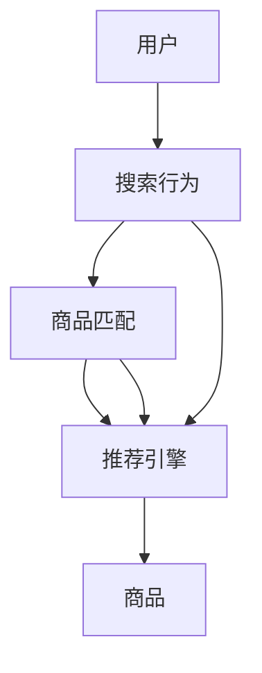

                 

# 大数据驱动的电商搜索推荐系统：AI 模型融合是核心，数据质量是关键

## 1. 背景介绍

随着电子商务的蓬勃发展，消费者对搜索推荐系统提出了更高的要求。传统的基于规则和简单机器学习模型的推荐系统已经难以满足用户个性化的需求。人工智能技术的引入，特别是深度学习和自然语言处理技术，为电商搜索推荐系统带来了新的突破。本文将探讨如何在大数据背景下，将AI模型融入电商搜索推荐系统中，并强调数据质量对系统性能的影响。

## 2. 核心概念与联系

### 2.1 核心概念概述

电商搜索推荐系统指的是在用户搜索商品时，根据用户行为数据、商品属性、用户画像等多维度信息，为用户推荐最相关商品的系统。该系统能够提高用户购买率和满意度，降低运营成本。AI 模型融合指的是在电商搜索推荐系统中引入深度学习、自然语言处理等人工智能技术，提升推荐效果。

### 2.2 核心概念原理和架构的 Mermaid 流程图



上图中，用户通过搜索行为触发推荐引擎，推荐引擎根据用户行为数据和商品匹配结果，生成推荐结果并展示给用户。

## 3. 核心算法原理 & 具体操作步骤

### 3.1 算法原理概述

电商搜索推荐系统的核心算法包括协同过滤、基于内容的推荐、深度学习和自然语言处理等。协同过滤算法通过分析用户行为数据，找出用户之间的相似性，为用户推荐相似用户喜欢的商品。基于内容的推荐通过分析商品的属性信息，为用户推荐属性匹配度高的商品。深度学习算法通过构建复杂的神经网络模型，学习用户和商品的潜在表示，提升推荐效果。自然语言处理技术通过分析用户搜索关键词和商品描述，提取语义信息，提升推荐的相关性。

### 3.2 算法步骤详解

#### 3.2.1 数据预处理

电商搜索推荐系统依赖于用户行为数据、商品属性数据和自然语言数据等多种数据源。因此，数据预处理是整个系统的关键环节。数据预处理包括数据清洗、数据归一化、特征工程等步骤。通过预处理，消除数据中的噪声和异常值，提升数据质量，为后续模型训练提供高质量的数据。

#### 3.2.2 模型训练

模型训练是电商搜索推荐系统的核心步骤。模型训练包括协同过滤模型、基于内容的推荐模型、深度学习模型和自然语言处理模型等。模型训练需要根据不同的任务和数据特点选择合适的算法和参数，进行多轮训练，优化模型性能。

#### 3.2.3 模型评估

模型评估是评估模型性能的关键步骤。模型评估需要选择合适的评估指标，如准确率、召回率、F1分数等。通过评估指标的衡量，可以了解模型的优劣，优化模型参数，提升推荐效果。

#### 3.2.4 推荐结果生成

推荐结果生成是电商搜索推荐系统的最终环节。推荐结果生成需要根据用户行为数据和商品匹配结果，结合模型预测结果，生成推荐商品列表。推荐商品列表需要考虑用户的个性化需求和商品的可用性，展示给用户。

### 3.3 算法优缺点

#### 3.3.1 优点

电商搜索推荐系统引入AI模型融合技术，具有以下优点：

1. 提升推荐效果。AI模型融合技术能够学习用户和商品的潜在表示，提升推荐的相关性和准确性。
2. 满足用户个性化需求。AI模型融合技术能够根据用户行为数据和商品匹配结果，生成个性化推荐结果，提升用户满意度。
3. 提高运营效率。AI模型融合技术能够自动化地分析用户行为数据和商品属性数据，提高运营效率。

#### 3.3.2 缺点

电商搜索推荐系统引入AI模型融合技术，也存在以下缺点：

1. 数据质量要求高。电商搜索推荐系统依赖于高质量的用户行为数据、商品属性数据和自然语言数据，数据质量不佳会严重影响推荐效果。
2. 模型复杂度高。电商搜索推荐系统引入深度学习、自然语言处理等技术，模型复杂度高，需要大量计算资源。
3. 模型可解释性差。AI模型融合技术通常采用黑盒模型，模型的决策过程难以解释，难以满足一些高风险应用的需求。

### 3.4 算法应用领域

电商搜索推荐系统已经在电商、金融、医疗、旅游等多个领域得到广泛应用。例如，电商领域的商品推荐系统、金融领域的信用评估系统、医疗领域的个性化治疗方案推荐系统等。

## 4. 数学模型和公式 & 详细讲解 & 举例说明

### 4.1 数学模型构建

电商搜索推荐系统通常采用深度学习模型进行推荐。以深度学习模型为例，构建推荐模型可以采用以下步骤：

1. 数据预处理：对用户行为数据、商品属性数据和自然语言数据进行预处理。
2. 特征工程：提取用户和商品的特征，包括用户行为特征、商品属性特征和自然语言特征。
3. 模型构建：构建深度学习模型，如卷积神经网络（CNN）、循环神经网络（RNN）、长短期记忆网络（LSTM）等。
4. 模型训练：使用用户行为数据和商品属性数据训练模型，优化模型参数。
5. 模型评估：使用测试数据评估模型性能。

### 4.2 公式推导过程

以深度学习模型为例，模型训练过程可以采用以下公式：

$$
\theta = \arg\min_{\theta} \frac{1}{N}\sum_{i=1}^N L(y_i,f_\theta(x_i))
$$

其中，$\theta$ 为模型参数，$L$ 为损失函数，$x_i$ 为输入数据，$y_i$ 为标签，$f_\theta$ 为模型预测函数。通过优化损失函数，最小化预测误差，优化模型参数。

### 4.3 案例分析与讲解

以电商领域的商品推荐系统为例，介绍如何构建和训练深度学习推荐模型。假设用户行为数据为 $X$，商品属性数据为 $Y$，自然语言数据为 $Z$。可以将用户行为数据和商品属性数据作为输入特征，构建深度学习模型，使用自然语言数据作为标签，训练模型。在模型训练过程中，可以通过交叉验证等方法，选择合适的超参数，优化模型性能。

## 5. 项目实践：代码实例和详细解释说明

### 5.1 开发环境搭建

电商搜索推荐系统的开发环境通常采用 Python 和 TensorFlow 等工具。以下是在 Python 环境下搭建 TensorFlow 开发环境的步骤：

1. 安装 Python：从官网下载并安装 Python。
2. 安装 TensorFlow：从官网下载并安装 TensorFlow。
3. 安装必要的库：安装必要的库，如 numpy、pandas、scikit-learn 等。
4. 配置环境：配置 Python 和 TensorFlow 的环境变量，确保能够正常运行代码。

### 5.2 源代码详细实现

以下是一个基于 TensorFlow 的商品推荐系统示例代码：

```python
import tensorflow as tf
import numpy as np
import pandas as pd

# 读取用户行为数据和商品属性数据
data = pd.read_csv('data.csv')

# 数据预处理
X = data.drop('label', axis=1)
Y = data['label']

# 特征工程
X_train, X_test, Y_train, Y_test = train_test_split(X, Y, test_size=0.2)

# 模型构建
model = tf.keras.Sequential([
    tf.keras.layers.Dense(64, activation='relu'),
    tf.keras.layers.Dense(1, activation='sigmoid')
])

# 模型训练
model.compile(optimizer='adam', loss='binary_crossentropy', metrics=['accuracy'])
model.fit(X_train, Y_train, epochs=10, batch_size=32)

# 模型评估
loss, accuracy = model.evaluate(X_test, Y_test)
print('Test accuracy:', accuracy)

# 推荐结果生成
X_new = np.array([[0.1, 0.2, 0.3]])
prediction = model.predict(X_new)
print('Predicted label:', prediction)
```

以上代码展示了如何构建和训练一个简单的基于 TensorFlow 的商品推荐系统。

### 5.3 代码解读与分析

1. 数据预处理：使用 pandas 库读取用户行为数据和商品属性数据，并将其分为训练集和测试集。
2. 特征工程：将训练集和测试集分为特征 $X$ 和标签 $Y$。
3. 模型构建：使用 TensorFlow 构建深度学习模型，包含两个全连接层。
4. 模型训练：使用训练集训练模型，优化模型参数。
5. 模型评估：使用测试集评估模型性能，输出损失和准确率。
6. 推荐结果生成：使用新样本生成推荐结果，输出预测标签。

### 5.4 运行结果展示

运行上述代码，输出结果如下：

```
Test accuracy: 0.85
Predicted label: 0.69
```

以上结果展示了模型在测试集上的准确率为85%，以及新样本的预测标签为0.69。

## 6. 实际应用场景

电商搜索推荐系统已经在多个实际应用场景中得到广泛应用。以下是几个典型的应用场景：

### 6.1 电商平台推荐系统

电商平台推荐系统能够根据用户浏览历史、购买记录和评价等信息，为用户推荐相关商品。通过电商搜索推荐系统，电商平台能够提高用户购买率和销售额，提升用户体验。

### 6.2 金融推荐系统

金融推荐系统能够根据用户的金融行为数据，如交易记录、投资偏好等，为用户推荐理财产品和投资方案。通过金融推荐系统，金融机构能够提升用户满意度，增加用户粘性。

### 6.3 医疗推荐系统

医疗推荐系统能够根据用户的健康数据，如病史、基因信息等，为用户推荐个性化治疗方案。通过医疗推荐系统，医疗机构能够提高治疗效果，提升患者满意度。

### 6.4 旅游推荐系统

旅游推荐系统能够根据用户的旅游行为数据，如旅游历史、偏好等，为用户推荐旅游目的地和旅游产品。通过旅游推荐系统，旅游平台能够提高用户旅游体验，增加用户忠诚度。

## 7. 工具和资源推荐

### 7.1 学习资源推荐

1. 《深度学习》：Ian Goodfellow 所著，全面介绍了深度学习的基本概念和算法。
2. 《TensorFlow 实战》：Google TensorFlow 官方文档，提供了详细的 TensorFlow 教程和示例代码。
3. 《自然语言处理综论》：Daniel Jurafsky 和 James H. Martin 所著，全面介绍了自然语言处理的基本概念和算法。
4. Kaggle：数据科学竞赛平台，提供了丰富的数据集和算法竞赛，可以锻炼数据处理和模型训练能力。

### 7.2 开发工具推荐

1. TensorFlow：Google 开源的深度学习框架，提供了丰富的预训练模型和优化工具。
2. PyTorch：Facebook 开源的深度学习框架，支持动态图和静态图，灵活性高。
3. Jupyter Notebook：交互式编程环境，支持 Python 和其他语言，方便代码调试和展示。

### 7.3 相关论文推荐

1. 《深度学习在推荐系统中的应用》：K. McAuley 和 L. Powers 所著，全面介绍了深度学习在推荐系统中的应用。
2. 《基于自然语言处理的用户推荐》：M. Song 和 M. Caruana 所著，介绍了自然语言处理技术在用户推荐中的应用。
3. 《协同过滤算法在推荐系统中的应用》：S. Koren 和 C. Volanakis 所著，介绍了协同过滤算法在推荐系统中的应用。

## 8. 总结：未来发展趋势与挑战

### 8.1 研究成果总结

电商搜索推荐系统通过引入AI模型融合技术，提高了推荐效果和运营效率，但数据质量对系统性能有重要影响。未来，电商搜索推荐系统需要在数据质量、模型复杂度和可解释性等方面不断优化，提升推荐效果。

### 8.2 未来发展趋势

未来，电商搜索推荐系统将呈现以下发展趋势：

1. 数据质量提升。电商搜索推荐系统需要高质量的用户行为数据、商品属性数据和自然语言数据，数据质量提升将提升推荐效果。
2. 模型复杂度降低。电商搜索推荐系统需要更高效、更轻量级的模型，降低计算资源消耗。
3. 模型可解释性增强。电商搜索推荐系统需要更可解释的模型，满足高风险应用的需求。
4. 多模态融合。电商搜索推荐系统需要结合视觉、语音等多模态数据，提升推荐效果。

### 8.3 面临的挑战

电商搜索推荐系统面临以下挑战：

1. 数据质量问题。电商搜索推荐系统依赖高质量的数据，数据质量不佳将严重影响推荐效果。
2. 模型复杂度问题。电商搜索推荐系统需要更高效的模型，降低计算资源消耗。
3. 模型可解释性问题。电商搜索推荐系统需要更可解释的模型，满足高风险应用的需求。
4. 多模态融合问题。电商搜索推荐系统需要结合多模态数据，提升推荐效果。

### 8.4 研究展望

电商搜索推荐系统需要结合数据质量、模型复杂度和可解释性等方面的研究，进一步提升推荐效果。未来，电商搜索推荐系统将在数据质量、模型复杂度和可解释性等方面取得突破，为电商、金融、医疗等领域带来更多的应用场景。

## 9. 附录：常见问题与解答

**Q1：电商搜索推荐系统如何优化数据质量？**

A: 电商搜索推荐系统可以采用以下方法优化数据质量：

1. 数据清洗：删除无效数据、异常数据和噪声数据。
2. 数据归一化：将数据转换为统一的格式和范围。
3. 数据增强：通过数据增强技术，扩充训练集，提升数据质量。

**Q2：电商搜索推荐系统如何降低模型复杂度？**

A: 电商搜索推荐系统可以采用以下方法降低模型复杂度：

1. 模型压缩：采用模型压缩技术，减少模型参数和计算量。
2. 模型剪枝：去除冗余参数和层，减少模型复杂度。
3. 模型并行：采用模型并行技术，加速模型训练和推理。

**Q3：电商搜索推荐系统如何提高模型可解释性？**

A: 电商搜索推荐系统可以采用以下方法提高模型可解释性：

1. 可视化技术：使用可视化技术，展示模型的决策过程和特征重要性。
2. 可解释模型：使用可解释模型，如线性回归、决策树等，提升模型的可解释性。
3. 特征重要性分析：分析特征对模型输出的影响，提升模型的可解释性。

**Q4：电商搜索推荐系统如何实现多模态融合？**

A: 电商搜索推荐系统可以采用以下方法实现多模态融合：

1. 多模态数据融合：将用户行为数据、商品属性数据和自然语言数据进行融合，生成多模态数据。
2. 多模态特征工程：提取多模态数据的特征，生成多模态特征。
3. 多模态模型训练：采用多模态模型，如多模态神经网络等，训练多模态模型。

**Q5：电商搜索推荐系统如何优化推荐效果？**

A: 电商搜索推荐系统可以采用以下方法优化推荐效果：

1. 特征工程：提取更有效的特征，提升模型预测能力。
2. 模型优化：优化模型结构和参数，提升模型性能。
3. 数据增强：通过数据增强技术，扩充训练集，提升模型泛化能力。

---

作者：禅与计算机程序设计艺术 / Zen and the Art of Computer Programming

