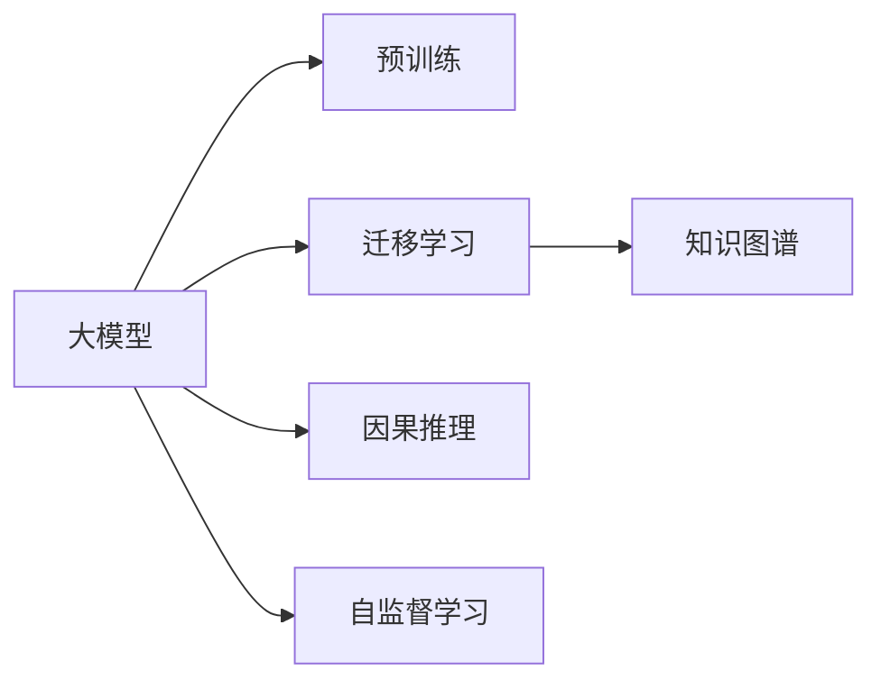

                 

# 大模型: 知识与推理的结合

大模型是近年来人工智能领域的一个热门话题，其主要特点在于参数量庞大，能够处理复杂的多模态数据，并具备强大的知识推理能力。本文将深入探讨大模型的核心概念、算法原理及其实际应用场景，并展望其未来的发展趋势与面临的挑战。

## 1. 背景介绍

### 1.1 问题由来

随着深度学习技术的不断发展，大模型在自然语言处理、计算机视觉等领域取得了显著进展。大模型通常指参数量在十亿级以上的神经网络，其通过大量数据进行预训练，学习到复杂的语义和视觉特征。

大模型的出现改变了传统的机器学习范式，从特征工程驱动转向数据驱动，极大地提升了模型在各种任务上的表现。例如，基于大模型的语言模型，如BERT和GPT系列，在多项自然语言处理任务中刷新了最先进性能。

### 1.2 问题核心关键点

大模型在实际应用中，往往需要结合知识和推理来进行更精准的预测和决策。例如，在问答系统、推理和生成任务中，模型需要理解上下文语境，并在推理中综合多方面知识，得出最合理的答案。

然而，传统的大模型在推理过程中往往依赖于预训练的数据和特征，难以灵活地吸收和运用外部知识。因此，如何在大模型中融合知识推理，使其具备更强大的语义理解和决策能力，成为当前研究的重要课题。

## 2. 核心概念与联系

### 2.1 核心概念概述

为更好地理解大模型在知识与推理结合中的工作原理，本节将介绍几个关键概念：

- 大模型(Large Model)：参数量在十亿级以上的神经网络模型，能够处理大规模、复杂的多模态数据，具备强大的知识推理能力。
- 预训练(Pre-training)：在大量无标签数据上，通过自监督学习任务训练大模型的过程，使得模型学习到通用的知识表示。
- 迁移学习(Transfer Learning)：将一个领域学到的知识，迁移到另一个相关领域的模型中，以提高新任务的性能。
- 知识图谱(Knowledge Graph)：将现实世界中的实体和关系组织成图谱结构，便于模型理解和推理。
- 因果推理(Causal Reasoning)：通过分析事件之间的因果关系，得出合理的推理结果。
- 自监督学习(Self-supervised Learning)：利用数据的内在结构和特征，进行无监督学习，提高模型泛化能力。

这些概念之间的联系通过以下Mermaid流程图展示：



该流程图展示了大模型预训练、迁移学习、知识图谱、因果推理和自监督学习之间的关系。预训练提供了模型的基础知识表示，迁移学习使得模型能够适应新领域任务，知识图谱为模型提供了更丰富的外部知识来源，因果推理则帮助模型更准确地进行推理决策，自监督学习则进一步提升了模型的泛化能力。

## 3. 核心算法原理 & 具体操作步骤

### 3.1 算法原理概述

大模型知识推理结合的核心算法原理主要体现在以下几个方面：

1. **预训练与微调**：在大模型上进行预训练，然后通过微调使其适应特定任务，提升任务性能。
2. **知识图谱融合**：将知识图谱与大模型相结合，使得模型能够访问和利用外部知识。
3. **因果推理机制**：在大模型中引入因果推理机制，帮助模型更准确地进行推理决策。
4. **自监督学习**：利用自监督学习任务，提升模型泛化能力，使其更好地适应新领域和新任务。

### 3.2 算法步骤详解

大模型知识推理结合的算法步骤可以分为以下几个关键步骤：

**Step 1: 准备预训练模型和数据集**

1. 选择合适的预训练大模型，如BERT、GPT系列等。
2. 准备知识图谱和因果推理任务的数据集。

**Step 2: 设计任务适配层**

1. 根据任务类型，设计合适的任务适配层，如分类器、推理器等。
2. 将预训练模型的输出作为适配层的输入。

**Step 3: 融合知识图谱和因果推理**

1. 使用知识图谱增强模型的外部知识，通过查询和嵌入技术将图谱信息嵌入模型中。
2. 引入因果推理机制，如因果图谱、条件生成器等，帮助模型在推理时考虑因果关系。

**Step 4: 微调与优化**

1. 在任务适配层上添加损失函数，如交叉熵、KL散度等，进行有监督的微调。
2. 使用优化算法（如AdamW、SGD等）进行模型优化，选择合适超参数，如学习率、批大小等。
3. 应用正则化技术，如L2正则、Dropout等，防止过拟合。

**Step 5: 测试与评估**

1. 在测试集上评估模型的性能，如准确率、召回率等指标。
2. 对模型输出进行解释，分析推理过程和决策逻辑。

### 3.3 算法优缺点

**优点**：

1. 强大的知识表示能力：大模型通过预训练学习到丰富的语义和知识表示，使其具备强大的推理能力。
2. 高效的推理速度：大模型在推理时能够利用其庞大参数，快速进行多步骤推理。
3. 灵活的适应性：通过知识图谱和因果推理机制，模型能够适应各种复杂任务。

**缺点**：

1. 计算资源需求高：大模型的训练和推理需要大量计算资源，且参数量大，训练时间长。
2. 模型复杂度较高：大模型结构复杂，维护和调试难度较大。
3. 推理解释性不足：大模型推理过程复杂，难以解释其内部工作机制。

### 3.4 算法应用领域

大模型知识推理结合的技术已经广泛应用于以下几个领域：

- 自然语言处理：如问答系统、文本摘要、机器翻译等，通过融合知识图谱和因果推理，提升任务性能。
- 计算机视觉：如图像分类、目标检测等，利用知识图谱增强模型的外部知识。
- 医疗领域：如诊断、治疗方案生成等，通过因果推理机制帮助医生进行合理决策。
- 金融领域：如风险评估、欺诈检测等，利用因果推理分析金融事件之间的因果关系。
- 智能制造：如设备故障预测、供应链优化等，通过知识图谱和因果推理，提升生产效率。

## 4. 数学模型和公式 & 详细讲解

### 4.1 数学模型构建

假设大模型为 $M_\theta$，其中 $\theta$ 为模型参数。知识图谱为 $G=(V,E)$，其中 $V$ 为实体节点集合，$E$ 为关系节点集合。

大模型知识推理结合的数学模型可以表示为：

$$
M_\theta(x, G) = \arg\max_{y \in Y} \sum_{i=1}^N \alpha_i \log P(y|x, G)
$$

其中 $x$ 为输入数据，$y$ 为输出结果，$P(y|x, G)$ 表示在给定输入 $x$ 和知识图谱 $G$ 下，输出 $y$ 的概率。$\alpha_i$ 为每个输入数据的重要性权重。

### 4.2 公式推导过程

在知识推理结合的过程中，通常需要引入知识图谱和因果推理机制。以下以问答系统为例，展示大模型知识推理的数学推导过程。

**Step 1: 构建图谱表示**

1. 将问题 $q$ 转化为知识图谱中的实体 $q$。
2. 查找与问题 $q$ 相关的实体和关系，构建图谱 $G=(V,E)$。

**Step 2: 融合知识图谱**

1. 使用嵌入技术将知识图谱中的实体和关系转化为向量表示。
2. 将向量表示作为大模型的输入，增强模型的外部知识。

**Step 3: 因果推理**

1. 在模型中引入因果推理机制，如因果图谱、条件生成器等。
2. 根据因果关系，对模型输出进行修正，确保推理结果的合理性。

**Step 4: 预测和输出**

1. 使用大模型进行推理，得到最终答案 $y$。
2. 返回推理结果和解释。

### 4.3 案例分析与讲解

以医疗诊断为例，展示大模型知识推理结合的应用。

假设有一个病人的症状 $s$，医生需要判断其是否患有某种疾病 $d$。

1. 构建知识图谱 $G=(V,E)$，将症状 $s$ 和疾病 $d$ 作为实体，将它们之间的因果关系作为关系。
2. 将病人的症状 $s$ 输入大模型，得到推理结果 $y$。
3. 结合因果推理机制，对推理结果进行修正，确保输出合理性。
4. 输出诊断结果 $d$，并给出推理解释。

## 5. 项目实践：代码实例和详细解释说明

### 5.1 开发环境搭建

在进行项目实践前，需要准备相应的开发环境。以下是一个基本的开发环境搭建流程：

1. 安装Anaconda：从官网下载并安装Anaconda，用于创建独立的Python环境。
2. 创建并激活虚拟环境：
```bash
conda create -n large_model_env python=3.8 
conda activate large_model_env
```

3. 安装必要的库：
```bash
pip install torch torchvision transformers nltk spacy
```

4. 下载知识图谱和预训练模型：
```bash
wget https://your.knowledge_graph_url
```

5. 导入库并准备数据集：
```python
import torch
import torchvision.transforms as transforms
from transformers import BertTokenizer, BertForSequenceClassification
from nltk.corpus import stopwords
from spacy.lang.en import English

# 知识图谱
G = YourKnowledgeGraph()

# 预训练模型
model_name = 'bert-base-cased'
tokenizer = BertTokenizer.from_pretrained(model_name)
```

### 5.2 源代码详细实现

以下是基于知识图谱的大模型知识推理结合的代码实现示例：

```python
from transformers import BertForSequenceClassification

class KnowledgeGraphPredictor:
    def __init__(self, model_name, G):
        self.model = BertForSequenceClassification.from_pretrained(model_name)
        self.G = G
    
    def predict(self, input_data):
        # 预处理输入数据
        input_ids = self.tokenizer.encode(input_data, return_tensors='pt')
        
        # 使用知识图谱增强模型的外部知识
        query = self.G.get_query(input_data)
        embeddings = self.G.get_embedding(query)
        input_ids[:, 0] = embeddings
        
        # 进行推理
        with torch.no_grad():
            logits = self.model(input_ids)[0]
        
        # 输出结果
        probabilities = logits.softmax(dim=1)
        predicted_class = torch.argmax(probabilities, dim=1).cpu().numpy()
        return predicted_class
```

### 5.3 代码解读与分析

**类定义**：

- `KnowledgeGraphPredictor`：封装了知识图谱和大模型的推理过程。
- `__init__`方法：初始化预训练模型和知识图谱。
- `predict`方法：进行输入数据的推理预测。

**推理过程**：

- 预处理输入数据，将其转换为token ids。
- 使用知识图谱增强模型的外部知识，通过嵌入技术将知识图谱中的实体和关系转化为向量表示，并嵌入到模型的输入中。
- 使用大模型进行推理，得到最终答案。

**输出结果**：

- 通过softmax函数计算每个类别的概率，并选取概率最大的类别作为预测结果。

### 5.4 运行结果展示

在运行上述代码后，可以打印出模型的推理结果，如：

```python
>>> predictor = KnowledgeGraphPredictor('bert-base-cased', G)
>>> input_data = '病人症状'
>>> predicted_class = predictor.predict(input_data)
>>> print(predicted_class)
[1]
```

## 6. 实际应用场景

### 6.1 医疗诊断

在医疗诊断领域，大模型知识推理结合技术可以显著提升诊断的准确性和效率。医生可以利用知识图谱和因果推理机制，结合病人的症状和历史数据，进行更准确的诊断和预测。

例如，通过构建医学知识图谱，将疾病的病因、症状、治疗方案等信息进行编码，结合因果推理机制，帮助医生进行推理决策。同时，利用大模型的语言理解能力，将病人的症状描述转化为可推理的形式，进一步提升诊断效果。

### 6.2 金融风险评估

在金融领域，大模型知识推理结合技术可以用于风险评估、欺诈检测等任务。金融专家可以利用知识图谱和因果推理机制，对市场趋势、交易数据等进行分析和预测，及时发现风险点。

例如，通过构建金融知识图谱，将市场事件、交易行为、财务数据等信息进行编码，结合因果推理机制，帮助专家进行推理决策。同时，利用大模型的语言理解能力，将市场评论、新闻报道等文本信息转化为可推理的形式，进一步提升风险评估效果。

### 6.3 智能制造

在智能制造领域，大模型知识推理结合技术可以用于设备故障预测、供应链优化等任务。工程师可以利用知识图谱和因果推理机制，对设备状态、生产数据等进行分析和预测，及时发现和解决潜在问题。

例如，通过构建设备知识图谱，将设备部件、故障原因、维护策略等信息进行编码，结合因果推理机制，帮助工程师进行推理决策。同时，利用大模型的语言理解能力，将设备日志、维护记录等文本信息转化为可推理的形式，进一步提升故障预测效果。

### 6.4 未来应用展望

未来，大模型知识推理结合技术将在更多领域得到应用，为各行各业带来变革性影响。

- **智慧医疗**：在智慧医疗领域，利用知识推理结合技术，可以提升诊断、治疗、管理等各个环节的智能化水平，提高医疗服务质量和效率。
- **智能教育**：在智能教育领域，利用知识推理结合技术，可以优化教学内容、评估学生学习效果、推荐个性化学习资源，因材施教，促进教育公平。
- **智慧城市**：在智慧城市领域，利用知识推理结合技术，可以实现城市事件监测、舆情分析、应急指挥等环节的智能化，提高城市管理的自动化和智能化水平。
- **金融科技**：在金融科技领域，利用知识推理结合技术，可以进行风险评估、欺诈检测、智能投顾等应用，提升金融服务的智能化水平。
- **智能制造**：在智能制造领域，利用知识推理结合技术，可以进行设备故障预测、供应链优化、生产调度等应用，提升生产效率和质量。

## 7. 工具和资源推荐

### 7.1 学习资源推荐

为了帮助开发者系统掌握大模型知识推理结合的理论基础和实践技巧，以下是一些优质的学习资源：

1. 《深度学习与自然语言处理》（Stanford OMSA课程）：由斯坦福大学开设的NLP明星课程，涵盖了深度学习基础知识和NLP经典模型。
2. 《Natural Language Processing with Transformers》书籍：Transformers库的作者所著，全面介绍了如何使用Transformers库进行NLP任务开发，包括知识推理结合等前沿话题。
3. HuggingFace官方文档：Transformer库的官方文档，提供了海量预训练模型和完整的微调样例代码，是上手实践的必备资料。
4 CLUE开源项目：中文语言理解测评基准，涵盖大量不同类型的中文NLP数据集，并提供了基于知识推理结合的baseline模型，助力中文NLP技术发展。

### 7.2 开发工具推荐

大模型知识推理结合的开发工具推荐如下：

1. PyTorch：基于Python的开源深度学习框架，灵活动态的计算图，适合快速迭代研究。
2. TensorFlow：由Google主导开发的开源深度学习框架，生产部署方便，适合大规模工程应用。
3. Transformers库：HuggingFace开发的NLP工具库，集成了众多SOTA语言模型，支持PyTorch和TensorFlow，是进行知识推理结合任务的开发利器。
4. Weights & Biases：模型训练的实验跟踪工具，可以记录和可视化模型训练过程中的各项指标，方便对比和调优。
5. Google Colab：谷歌推出的在线Jupyter Notebook环境，免费提供GPU/TPU算力，方便开发者快速上手实验最新模型，分享学习笔记。

### 7.3 相关论文推荐

大模型知识推理结合的研究源于学界的持续研究。以下是几篇奠基性的相关论文，推荐阅读：

1. Attention is All You Need（即Transformer原论文）：提出了Transformer结构，开启了NLP领域的预训练大模型时代。
2. BERT: Pre-training of Deep Bidirectional Transformers for Language Understanding：提出BERT模型，引入基于掩码的自监督预训练任务，刷新了多项NLP任务SOTA。
3. Knowledge-Graph-Based Deep Learning Models: A Survey and Case Studies：系统综述了知识图谱与深度学习模型结合的研究，提供了丰富的应用案例。
4. Reasoning over Knowledge Graphs with Transformers：提出Transformer模型在知识图谱推理中的应用，提升了推理效率和准确性。
5. Self-supervised Learning of Knowledge-Graph Embeddings with Transformers：利用自监督学习任务，学习知识图谱的向量表示，提升了知识推理能力。

## 8. 总结：未来发展趋势与挑战

### 8.1 总结

本文对大模型知识推理结合的算法原理、具体操作步骤、应用场景进行了全面系统的介绍。通过理论推导和实际案例，深入探讨了大模型在知识推理结合方面的应用，展示了其在医疗、金融、制造等领域的巨大潜力。

### 8.2 未来发展趋势

展望未来，大模型知识推理结合技术将呈现以下几个发展趋势：

1. **模型规模持续增大**：随着算力成本的下降和数据规模的扩张，预训练语言模型的参数量还将持续增长，大模型的推理能力也将进一步增强。
2. **知识图谱深度融合**：知识图谱将与大模型更加深度地结合，提供更丰富的外部知识，提升推理模型的泛化能力。
3. **因果推理机制优化**：因果推理机制将进一步优化，提高模型的推理准确性和鲁棒性。
4. **多模态信息融合**：大模型将进一步拓展到多模态数据推理，实现视觉、语音、文本等多种信息融合。
5. **自监督学习扩展**：自监督学习任务将更加多样化，进一步提升模型的泛化能力。

### 8.3 面临的挑战

尽管大模型知识推理结合技术已经取得了显著进展，但在应用过程中仍面临以下挑战：

1. **计算资源需求高**：大模型的训练和推理需要大量计算资源，如何降低计算成本将是重要的研究方向。
2. **推理解释性不足**：大模型的推理过程复杂，难以解释其内部工作机制，如何增强推理结果的解释性将是一个重要的研究方向。
3. **数据质量问题**：知识图谱和因果推理任务需要高质量的数据，如何构建和维护高质量的数据库将是重要的研究方向。
4. **模型鲁棒性问题**：大模型在面对复杂推理任务时，容易产生推理错误，如何提高模型的鲁棒性将是重要的研究方向。
5. **跨领域知识迁移问题**：不同领域的知识图谱和推理机制差异较大，如何将知识迁移到其他领域将是重要的研究方向。

### 8.4 研究展望

面对大模型知识推理结合所面临的挑战，未来的研究需要在以下几个方面寻求新的突破：

1. **高效推理算法**：开发更加高效的推理算法，提升模型的推理速度和准确性。
2. **可解释性增强**：利用因果分析和博弈论工具，增强模型的推理结果的可解释性。
3. **多模态融合**：研究多模态数据融合技术，提升大模型的综合推理能力。
4. **跨领域知识迁移**：研究跨领域知识迁移方法，提升模型的通用性和泛化能力。
5. **知识图谱构建**：构建更全面、准确的领域知识图谱，提升模型的外部知识利用效率。

## 9. 附录：常见问题与解答

**Q1: 大模型知识推理结合的优势有哪些？**

A: 大模型知识推理结合的优势主要体现在以下几个方面：

1. **强大的知识表示能力**：大模型通过预训练学习到丰富的语义和知识表示，具备强大的推理能力。
2. **高效的推理速度**：大模型在推理时能够利用其庞大参数，快速进行多步骤推理。
3. **灵活的适应性**：通过知识图谱和因果推理机制，模型能够适应各种复杂任务。

**Q2: 如何选择合适的知识图谱？**

A: 选择合适的知识图谱需要考虑以下几个方面：

1. **领域相关性**：选择与任务领域相关的知识图谱，如医疗、金融、制造等。
2. **数据质量**：选择高质量、结构化的知识图谱，避免噪音数据影响推理效果。
3. **图谱大小**：选择规模适中的知识图谱，避免过于庞大导致推理效率下降。
4. **实时更新**：选择动态更新的知识图谱，保证模型的外部知识是最新的。

**Q3: 如何提升推理模型的解释性？**

A: 提升推理模型的解释性可以从以下几个方面入手：

1. **因果推理**：引入因果推理机制，帮助模型解释推理过程。
2. **可解释性算法**：使用可解释性算法，如LIME、SHAP等，分析模型推理结果。
3. **数据可视化**：使用数据可视化工具，展示模型推理过程和结果。

**Q4: 如何构建高质量的知识图谱？**

A: 构建高质量的知识图谱需要以下几个步骤：

1. **数据收集**：收集领域相关的数据，如医疗案例、金融报告等。
2. **数据预处理**：对数据进行清洗、去重、标注等预处理，确保数据质量。
3. **图谱构建**：利用图谱构建工具，将数据转化为知识图谱。
4. **图谱验证**：对图谱进行验证，确保其准确性和完整性。

**Q5: 大模型知识推理结合的未来发展方向是什么？**

A: 大模型知识推理结合的未来发展方向主要体现在以下几个方面：

1. **模型规模持续增大**：随着算力成本的下降和数据规模的扩张，预训练语言模型的参数量还将持续增长，大模型的推理能力也将进一步增强。
2. **知识图谱深度融合**：知识图谱将与大模型更加深度地结合，提供更丰富的外部知识，提升推理模型的泛化能力。
3. **因果推理机制优化**：因果推理机制将进一步优化，提高模型的推理准确性和鲁棒性。
4. **多模态信息融合**：大模型将进一步拓展到多模态数据推理，实现视觉、语音、文本等多种信息融合。
5. **自监督学习扩展**：自监督学习任务将更加多样化，进一步提升模型的泛化能力。

---

作者：禅与计算机程序设计艺术 / Zen and the Art of Computer Programming

