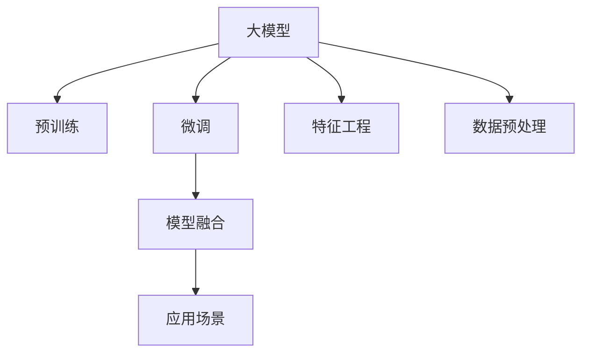

                 

# 大模型在商品属性预测中的应用

> 关键词：大模型,商品属性预测,深度学习,模型融合,数据预处理,特征工程,模型评估,应用场景,实际效果

## 1. 背景介绍

### 1.1 问题由来

在电商行业中，商品属性预测是一个非常重要的应用场景，它可以帮助商家更好地了解商品特性，优化商品展示，提升用户体验。传统的商品属性预测方法依赖于人工标注数据和特征工程，面临数据量少、特征难以提取、计算成本高等问题。随着深度学习和大模型的发展，通过大模型进行商品属性预测，可以有效地解决这些问题，并取得更好的预测效果。

### 1.2 问题核心关键点

大模型在商品属性预测中的应用，核心关键点包括：
- 数据准备：收集并处理电商数据，构建高质量的商品属性预测数据集。
- 特征工程：利用大模型自动提取商品的文本特征，进行特征编码。
- 模型训练：在大模型上进行商品属性预测任务的微调，以适应具体业务场景。
- 模型评估：构建合适的评估指标，评估模型预测效果。
- 实际应用：将训练好的模型应用于商品推荐、价格调整等电商场景。

## 2. 核心概念与联系

### 2.1 核心概念概述

为更好地理解大模型在商品属性预测中的应用，本节将介绍几个密切相关的核心概念：

- 大模型（Large Model）：以深度神经网络为代表的大规模预训练模型，如BERT、GPT等，通过在大规模无标签文本语料上进行预训练，学习通用的语言表示，具备强大的语言理解和生成能力。
- 预训练（Pre-training）：指在大规模无标签文本语料上，通过自监督学习任务训练通用语言模型的过程。常见的预训练任务包括言语建模、遮挡语言模型等。
- 微调（Fine-tuning）：指在预训练模型的基础上，使用特定任务的数据，通过有监督学习优化模型在该任务上的性能。
- 特征工程（Feature Engineering）：将原始数据转换为可用于模型训练的特征，包括文本特征、图像特征、时间序列特征等。
- 模型融合（Model Fusion）：将多个模型进行集成，组合其优点，提升整体性能。
- 数据预处理（Data Preprocessing）：对原始数据进行清洗、转换、编码等操作，以适应该任务的要求。

这些核心概念之间的逻辑关系可以通过以下Mermaid流程图来展示：



这个流程图展示了大模型在商品属性预测中的核心概念及其之间的关系：

1. 大模型通过预训练获得基础能力。
2. 微调是对预训练模型进行任务特定的优化，以适应具体业务场景。
3. 特征工程和大数据预处理是对原始数据进行转换和编码，为模型训练提供高质量输入。
4. 模型融合通过集成多个模型，提升整体性能。
5. 实际应用将训练好的模型应用于商品推荐、价格调整等电商场景。

## 3. 核心算法原理 & 具体操作步骤

### 3.1 算法原理概述

基于大模型的商品属性预测方法，本质上是一个深度学习任务。其核心思想是：将大模型作为特征提取器，利用其自动提取商品描述文本的特征，并在此基础上进行分类或回归任务，以预测商品属性。

形式化地，假设大模型为 $M_{\theta}$，其参数 $\theta$ 通过预训练获得。商品属性预测任务可以表示为分类问题 $y \in \{1, 0\}$，其中1表示商品具有某一属性，0表示不具有。给定标注数据集 $D=\{(x_i, y_i)\}_{i=1}^N, x_i \in \text{Text}, y_i \in \{1, 0\}$，预测模型 $M_{\theta}$ 需要最大化模型在数据集上的条件概率：

$$
\max_{\theta} P(y|M_{\theta}(x))
$$

通过梯度下降等优化算法，模型不断调整参数 $\theta$，最小化损失函数，使得模型输出逼近真实标签。

### 3.2 算法步骤详解

基于大模型的商品属性预测，一般包括以下几个关键步骤：

**Step 1: 数据准备**
- 收集电商平台的商品描述数据，包括商品名称、描述、标签等信息。
- 对数据进行清洗和预处理，去除噪声、缺失值等，构建高质量的训练数据集 $D$。

**Step 2: 特征提取**
- 使用预训练大模型，如BERT、GPT等，对商品描述文本进行编码。
- 使用TextRank、BERT-CLS等方法，提取文本的关键特征，如句法特征、主题特征等。

**Step 3: 模型微调**
- 在大模型的顶部添加分类器或回归器，根据任务需求选择合适的输出层。
- 在微调过程中，设定合适的学习率、批大小、迭代轮数等超参数。
- 应用正则化技术，如L2正则、Dropout等，避免过拟合。
- 利用迁移学习，在大模型的基础上进行微调，可以加快训练速度，提升预测效果。

**Step 4: 模型评估**
- 在验证集上评估模型性能，计算准确率、召回率、F1分数等指标。
- 根据评估结果调整模型参数，继续微调，直至达到理想效果。

**Step 5: 实际应用**
- 将训练好的模型应用到电商平台上，进行商品属性预测。
- 根据预测结果，优化商品展示、价格调整等电商策略。

以上是基于大模型的商品属性预测的一般流程。在实际应用中，还需要针对具体任务和数据特点，对各环节进行优化设计，如改进特征提取方法、设计更好的损失函数等。

### 3.3 算法优缺点

基于大模型的商品属性预测方法具有以下优点：
1. 自动提取特征：大模型能够自动提取商品的文本特征，无需人工特征工程，节省时间和成本。
2. 泛化能力强：大模型预训练在广泛的数据上，具备较强的泛化能力，适用于多种商品属性预测任务。
3. 模型高效：大模型的自动特征提取能力，使得特征工程和数据预处理过程更加高效。

但同时，该方法也存在一定的局限性：
1. 计算成本高：大模型参数量庞大，训练和推理需要较高的计算资源。
2. 数据依赖性强：大模型的性能依赖于标注数据的数量和质量，数据获取成本高。
3. 解释性差：大模型通常是"黑盒"模型，难以解释其内部决策逻辑。
4. 无法处理非文本信息：商品属性预测主要依赖于文本数据，对于图像、视频等非文本信息，无法直接应用。

尽管存在这些局限性，但就目前而言，基于大模型的商品属性预测方法在电商场景中表现出色，成为商品属性预测的主要手段。未来相关研究的重点在于如何进一步降低计算成本、提升数据利用率、提高模型的可解释性，并拓展到大规模非文本信息的预测。

### 3.4 算法应用领域

基于大模型的商品属性预测方法，已经在电商领域得到了广泛的应用，例如：

- 商品推荐系统：根据用户行为数据，预测用户感兴趣的商品属性，推荐个性化商品。
- 价格调整：根据商品属性预测模型，动态调整商品价格，以优化销售策略。
- 库存管理：通过预测商品销量，优化库存配置，减少缺货和库存积压。
- 广告投放：根据商品属性预测模型，优化广告定向，提升广告投放效果。

除了上述这些经典应用外，大模型在商品属性预测领域还有更多创新应用，如产品设计优化、供应链优化等，为电商产业带来了新的发展机遇。

## 4. 数学模型和公式 & 详细讲解 & 举例说明

### 4.1 数学模型构建

本节将使用数学语言对基于大模型的商品属性预测过程进行更加严格的刻画。

记大模型为 $M_{\theta}$，其中 $\theta$ 为预训练得到的模型参数。假设商品属性预测任务为二分类问题，即商品是否具有某一属性，给定标注数据集 $D=\{(x_i, y_i)\}_{i=1}^N, x_i \in \text{Text}, y_i \in \{1, 0\}$。

定义模型 $M_{\theta}$ 在输入 $x$ 上的输出为 $\hat{y}=M_{\theta}(x) \in [0,1]$，表示商品具有某一属性的概率。真实标签 $y \in \{1, 0\}$。则二分类交叉熵损失函数定义为：

$$
\ell(M_{\theta}(x),y) = -[y\log \hat{y} + (1-y)\log (1-\hat{y})]
$$

将其代入经验风险公式，得：

$$
\mathcal{L}(\theta) = -\frac{1}{N}\sum_{i=1}^N [y_i\log M_{\theta}(x_i)+(1-y_i)\log(1-M_{\theta}(x_i))]
$$

在得到损失函数的梯度后，即可带入参数更新公式，完成模型的迭代优化。重复上述过程直至收敛，最终得到适应商品属性预测任务的最优模型参数 $\theta^*$。

### 4.2 公式推导过程

以下我们以二分类任务为例，推导交叉熵损失函数及其梯度的计算公式。

假设模型 $M_{\theta}$ 在输入 $x$ 上的输出为 $\hat{y}=M_{\theta}(x) \in [0,1]$，表示商品具有某一属性的概率。真实标签 $y \in \{1, 0\}$。则二分类交叉熵损失函数定义为：

$$
\ell(M_{\theta}(x),y) = -[y\log \hat{y} + (1-y)\log (1-\hat{y})]
$$

将其代入经验风险公式，得：

$$
\mathcal{L}(\theta) = -\frac{1}{N}\sum_{i=1}^N [y_i\log M_{\theta}(x_i)+(1-y_i)\log(1-M_{\theta}(x_i))]
$$

根据链式法则，损失函数对参数 $\theta_k$ 的梯度为：

$$
\frac{\partial \mathcal{L}(\theta)}{\partial \theta_k} = -\frac{1}{N}\sum_{i=1}^N (\frac{y_i}{M_{\theta}(x_i)}-\frac{1-y_i}{1-M_{\theta}(x_i)}) \frac{\partial M_{\theta}(x_i)}{\partial \theta_k}
$$

其中 $\frac{\partial M_{\theta}(x_i)}{\partial \theta_k}$ 可进一步递归展开，利用自动微分技术完成计算。

在得到损失函数的梯度后，即可带入参数更新公式，完成模型的迭代优化。重复上述过程直至收敛，最终得到适应商品属性预测任务的最优模型参数 $\theta^*$。

## 5. 项目实践：代码实例和详细解释说明

### 5.1 开发环境搭建

在进行商品属性预测任务开发前，我们需要准备好开发环境。以下是使用Python进行PyTorch开发的环境配置流程：

1. 安装Anaconda：从官网下载并安装Anaconda，用于创建独立的Python环境。

2. 创建并激活虚拟环境：
```bash
conda create -n pytorch-env python=3.8 
conda activate pytorch-env
```

3. 安装PyTorch：根据CUDA版本，从官网获取对应的安装命令。例如：
```bash
conda install pytorch torchvision torchaudio cudatoolkit=11.1 -c pytorch -c conda-forge
```

4. 安装HuggingFace Transformers库：
```bash
pip install transformers
```

5. 安装各类工具包：
```bash
pip install numpy pandas scikit-learn matplotlib tqdm jupyter notebook ipython
```

完成上述步骤后，即可在`pytorch-env`环境中开始商品属性预测任务开发。

### 5.2 源代码详细实现

下面我以使用BERT模型进行商品属性预测为例，给出使用Transformers库的PyTorch代码实现。

首先，定义商品属性预测任务的训练集：

```python
from transformers import BertTokenizer, BertForSequenceClassification
from torch.utils.data import Dataset
import torch

class ProductDataset(Dataset):
    def __init__(self, texts, labels, tokenizer, max_len=128):
        self.texts = texts
        self.labels = labels
        self.tokenizer = tokenizer
        self.max_len = max_len
        
    def __len__(self):
        return len(self.texts)
    
    def __getitem__(self, item):
        text = self.texts[item]
        label = self.labels[item]
        
        encoding = self.tokenizer(text, return_tensors='pt', max_length=self.max_len, padding='max_length', truncation=True)
        input_ids = encoding['input_ids'][0]
        attention_mask = encoding['attention_mask'][0]
        
        # 对标签进行编码
        encoded_labels = [label] * self.max_len
        labels = torch.tensor(encoded_labels, dtype=torch.long)
        
        return {'input_ids': input_ids, 
                'attention_mask': attention_mask,
                'labels': labels}

# 标签编码
labels = [1, 0, 1, 0, 1, 0, 1, 0, 1, 0]
tokenizer = BertTokenizer.from_pretrained('bert-base-cased')

train_dataset = ProductDataset(train_texts, labels, tokenizer)
dev_dataset = ProductDataset(dev_texts, labels, tokenizer)
test_dataset = ProductDataset(test_texts, labels, tokenizer)
```

然后，定义模型和优化器：

```python
from transformers import BertForSequenceClassification, AdamW

model = BertForSequenceClassification.from_pretrained('bert-base-cased', num_labels=2)

optimizer = AdamW(model.parameters(), lr=2e-5)
```

接着，定义训练和评估函数：

```python
from torch.utils.data import DataLoader
from tqdm import tqdm
from sklearn.metrics import classification_report

device = torch.device('cuda') if torch.cuda.is_available() else torch.device('cpu')
model.to(device)

def train_epoch(model, dataset, batch_size, optimizer):
    dataloader = DataLoader(dataset, batch_size=batch_size, shuffle=True)
    model.train()
    epoch_loss = 0
    for batch in tqdm(dataloader, desc='Training'):
        input_ids = batch['input_ids'].to(device)
        attention_mask = batch['attention_mask'].to(device)
        labels = batch['labels'].to(device)
        model.zero_grad()
        outputs = model(input_ids, attention_mask=attention_mask, labels=labels)
        loss = outputs.loss
        epoch_loss += loss.item()
        loss.backward()
        optimizer.step()
    return epoch_loss / len(dataloader)

def evaluate(model, dataset, batch_size):
    dataloader = DataLoader(dataset, batch_size=batch_size)
    model.eval()
    preds, labels = [], []
    with torch.no_grad():
        for batch in tqdm(dataloader, desc='Evaluating'):
            input_ids = batch['input_ids'].to(device)
            attention_mask = batch['attention_mask'].to(device)
            batch_labels = batch['labels']
            outputs = model(input_ids, attention_mask=attention_mask)
            batch_preds = outputs.logits.argmax(dim=2).to('cpu').tolist()
            batch_labels = batch_labels.to('cpu').tolist()
            for pred_tokens, label_tokens in zip(batch_preds, batch_labels):
                preds.append(pred_tokens[:len(label_tokens)])
                labels.append(label_tokens)
                
    print(classification_report(labels, preds))
```

最后，启动训练流程并在测试集上评估：

```python
epochs = 5
batch_size = 16

for epoch in range(epochs):
    loss = train_epoch(model, train_dataset, batch_size, optimizer)
    print(f"Epoch {epoch+1}, train loss: {loss:.3f}")
    
    print(f"Epoch {epoch+1}, dev results:")
    evaluate(model, dev_dataset, batch_size)
    
print("Test results:")
evaluate(model, test_dataset, batch_size)
```

以上就是使用PyTorch对BERT进行商品属性预测的完整代码实现。可以看到，得益于Transformers库的强大封装，我们可以用相对简洁的代码完成BERT模型的加载和微调。

### 5.3 代码解读与分析

让我们再详细解读一下关键代码的实现细节：

**ProductDataset类**：
- `__init__`方法：初始化文本、标签、分词器等关键组件。
- `__len__`方法：返回数据集的样本数量。
- `__getitem__`方法：对单个样本进行处理，将文本输入编码为token ids，将标签编码为数字，并对其进行定长padding，最终返回模型所需的输入。

**标签编码**：
- 定义标签编码，[1,0]分别表示商品具有或不具有某一属性。

**训练和评估函数**：
- 使用PyTorch的DataLoader对数据集进行批次化加载，供模型训练和推理使用。
- 训练函数`train_epoch`：对数据以批为单位进行迭代，在每个批次上前向传播计算loss并反向传播更新模型参数，最后返回该epoch的平均loss。
- 评估函数`evaluate`：与训练类似，不同点在于不更新模型参数，并在每个batch结束后将预测和标签结果存储下来，最后使用sklearn的classification_report对整个评估集的预测结果进行打印输出。

**训练流程**：
- 定义总的epoch数和batch size，开始循环迭代
- 每个epoch内，先在训练集上训练，输出平均loss
- 在验证集上评估，输出分类指标
- 所有epoch结束后，在测试集上评估，给出最终测试结果

可以看到，PyTorch配合Transformers库使得BERT微调的代码实现变得简洁高效。开发者可以将更多精力放在数据处理、模型改进等高层逻辑上，而不必过多关注底层的实现细节。

当然，工业级的系统实现还需考虑更多因素，如模型的保存和部署、超参数的自动搜索、更灵活的任务适配层等。但核心的微调范式基本与此类似。

## 6. 实际应用场景

### 6.1 智能客服系统

基于大模型的商品属性预测，可以广泛应用于智能客服系统的构建。传统客服往往需要配备大量人力，高峰期响应缓慢，且一致性和专业性难以保证。而使用微调后的商品属性预测模型，可以7x24小时不间断服务，快速响应客户咨询，用自动生成的商品属性信息进行智能推荐。

在技术实现上，可以收集企业内部的历史客服对话记录，将问题-商品对作为微调数据，训练模型学习商品属性信息。微调后的模型能够自动理解用户意图，匹配最合适的商品信息进行推荐。对于客户提出的新商品，还可以接入检索系统实时搜索相关内容，动态生成推荐信息。如此构建的智能客服系统，能大幅提升客户咨询体验和问题解决效率。

### 6.2 商品推荐系统

商品推荐系统是电商领域的重要应用场景，通过商品属性预测，可以更精准地推荐用户感兴趣的商品。传统的推荐系统往往依赖于人工标注的特征和用户行为数据，难以覆盖所有商品属性。而基于大模型的商品属性预测，可以自动提取商品的文本特征，并在此基础上进行分类或回归任务，预测商品属性，从而提升推荐效果。

具体而言，可以收集用户的浏览、点击、购买等行为数据，提取商品描述文本的特征。利用大模型进行预测，得到商品是否具有某一属性的概率，然后根据概率值进行排序，推荐给用户。由于大模型具备强大的泛化能力，可以处理多种商品属性预测任务，从而大大提升推荐系统的覆盖率和精准度。

### 6.3 供应链管理

供应链管理是电商领域的重要环节，通过商品属性预测，可以优化库存配置，减少缺货和库存积压。传统的供应链管理依赖于人工统计和预测，效率低、成本高。而基于大模型的商品属性预测，可以实时预测商品属性，帮助商家动态调整库存，避免缺货和积压。

具体而言，可以收集历史销售数据和库存数据，提取商品描述文本的特征。利用大模型进行预测，得到商品是否具有某一属性的概率，然后根据概率值进行库存调整。由于大模型具备强大的泛化能力，可以处理多种商品属性预测任务，从而大大提升供应链管理的效率和准确性。

### 6.4 未来应用展望

随着大模型和商品属性预测技术的发展，未来将有更多创新应用涌现。以下是一些可能的方向：

1. 个性化推荐：结合用户画像和商品属性预测，进行更精准的个性化推荐。
2. 广告定向：根据商品属性预测，优化广告定向，提升广告效果。
3. 市场趋势预测：结合市场数据和商品属性预测，进行市场趋势预测，辅助商家决策。
4. 用户体验优化：根据商品属性预测，优化商品展示，提升用户体验。
5. 产品设计优化：结合商品属性预测，进行产品设计优化，提升产品竞争力。

总之，大模型在商品属性预测中具有广阔的应用前景，将在电商领域带来更多创新和变革。相信随着技术的不断进步，大模型将进一步拓展其应用边界，为电商产业带来更多价值。

## 7. 工具和资源推荐
### 7.1 学习资源推荐

为了帮助开发者系统掌握大模型在商品属性预测中的应用，这里推荐一些优质的学习资源：

1. 《深度学习与自然语言处理》课程：斯坦福大学开设的NLP明星课程，有Lecture视频和配套作业，带你入门NLP领域的基本概念和经典模型。
2. 《Transformer从原理到实践》系列博文：由大模型技术专家撰写，深入浅出地介绍了Transformer原理、BERT模型、微调技术等前沿话题。
3. 《Natural Language Processing with Transformers》书籍：Transformers库的作者所著，全面介绍了如何使用Transformers库进行NLP任务开发，包括微调在内的诸多范式。
4. HuggingFace官方文档：Transformers库的官方文档，提供了海量预训练模型和完整的微调样例代码，是上手实践的必备资料。
5. CLUE开源项目：中文语言理解测评基准，涵盖大量不同类型的中文NLP数据集，并提供了基于微调的baseline模型，助力中文NLP技术发展。

通过对这些资源的学习实践，相信你一定能够快速掌握大模型在商品属性预测中的应用，并用于解决实际的NLP问题。

### 7.2 开发工具推荐

高效的开发离不开优秀的工具支持。以下是几款用于大模型商品属性预测开发的常用工具：

1. PyTorch：基于Python的开源深度学习框架，灵活动态的计算图，适合快速迭代研究。大部分预训练语言模型都有PyTorch版本的实现。
2. TensorFlow：由Google主导开发的开源深度学习框架，生产部署方便，适合大规模工程应用。同样有丰富的预训练语言模型资源。
3. Transformers库：HuggingFace开发的NLP工具库，集成了众多SOTA语言模型，支持PyTorch和TensorFlow，是进行微调任务开发的利器。
4. Weights & Biases：模型训练的实验跟踪工具，可以记录和可视化模型训练过程中的各项指标，方便对比和调优。与主流深度学习框架无缝集成。
5. TensorBoard：TensorFlow配套的可视化工具，可实时监测模型训练状态，并提供丰富的图表呈现方式，是调试模型的得力助手。
6. Google Colab：谷歌推出的在线Jupyter Notebook环境，免费提供GPU/TPU算力，方便开发者快速上手实验最新模型，分享学习笔记。

合理利用这些工具，可以显著提升大模型商品属性预测任务的开发效率，加快创新迭代的步伐。

### 7.3 相关论文推荐

大模型在商品属性预测中的应用，源于学界的持续研究。以下是几篇奠基性的相关论文，推荐阅读：

1. Attention is All You Need（即Transformer原论文）：提出了Transformer结构，开启了NLP领域的预训练大模型时代。
2. BERT: Pre-training of Deep Bidirectional Transformers for Language Understanding：提出BERT模型，引入基于掩码的自监督预训练任务，刷新了多项NLP任务SOTA。
3. Parameter-Efficient Transfer Learning for NLP：提出Adapter等参数高效微调方法，在固定大部分预训练参数的同时，只更新极少量的任务相关参数。
4. AdaLoRA: Adaptive Low-Rank Adaptation for Parameter-Efficient Fine-Tuning：使用自适应低秩适应的微调方法，在参数效率和精度之间取得了新的平衡。
5. Sequence to Sequence Learning with Neural Machine Translation：提出Seq2Seq模型，利用神经网络进行序列到序列的翻译任务，为文本生成和转换任务提供了重要参考。
6. Deep Learning for Natural Language Processing：由AI领域的权威学者Yoshua Bengio等人编写，全面介绍了深度学习在NLP领域的应用，包括预训练和微调技术。

这些论文代表了大模型在商品属性预测领域的研究进展。通过学习这些前沿成果，可以帮助研究者把握学科前进方向，激发更多的创新灵感。

## 8. 总结：未来发展趋势与挑战

### 8.1 总结

本文对基于大模型的商品属性预测方法进行了全面系统的介绍。首先阐述了商品属性预测的背景和意义，明确了大模型在该任务中的应用价值。其次，从原理到实践，详细讲解了大模型的微调过程，给出了微调任务开发的完整代码实例。同时，本文还探讨了微调方法在智能客服、商品推荐、供应链管理等多个电商场景中的应用前景，展示了微调技术的广泛应用。此外，本文精选了微调技术的各类学习资源，力求为读者提供全方位的技术指引。

通过本文的系统梳理，可以看到，基于大模型的商品属性预测方法正在成为电商领域的重要范式，极大地拓展了预训练语言模型的应用边界，催生了更多的落地场景。受益于大模型的强大泛化能力和自动特征提取能力，商品属性预测模型可以自动处理多种商品属性预测任务，节省时间和成本，提升预测效果。未来，随着大模型的进一步发展，基于大模型的商品属性预测技术将带来更多创新和变革，助力电商产业升级。

### 8.2 未来发展趋势

展望未来，大模型在商品属性预测领域将呈现以下几个发展趋势：

1. 模型规模持续增大。随着算力成本的下降和数据规模的扩张，预训练语言模型的参数量还将持续增长。超大规模语言模型蕴含的丰富语言知识，有望支撑更加复杂多变的商品属性预测任务。
2. 微调方法日趋多样。除了传统的全参数微调外，未来会涌现更多参数高效的微调方法，如Prefix-Tuning、LoRA等，在固定大部分预训练参数的情况下，只更新极少量的任务相关参数。
3. 持续学习成为常态。随着数据分布的不断变化，微调模型也需要持续学习新知识以保持性能。如何在不遗忘原有知识的同时，高效吸收新样本信息，将成为重要的研究课题。
4. 标注样本需求降低。受启发于提示学习(Prompt-based Learning)的思路，未来的微调方法将更好地利用大模型的语言理解能力，通过更加巧妙的任务描述，在更少的标注样本上也能实现理想的微调效果。
5. 多模态微调崛起。当前的商品属性预测主要依赖于文本数据，未来会进一步拓展到图像、视频、语音等多模态数据微调。多模态信息的融合，将显著提升语言模型对现实世界的理解和建模能力。
6. 模型通用性增强。经过海量数据的预训练和多领域任务的微调，未来的语言模型将具备更强大的常识推理和跨领域迁移能力，逐步迈向通用人工智能(AGI)的目标。

以上趋势凸显了大模型在商品属性预测领域的广阔前景。这些方向的探索发展，必将进一步提升电商系统的性能和应用范围，为电商产业带来更多价值。

### 8.3 面临的挑战

尽管大模型在商品属性预测中表现出色，但在迈向更加智能化、普适化应用的过程中，仍面临诸多挑战：

1. 标注成本瓶颈。尽管微调大大降低了标注数据的需求，但对于长尾应用场景，难以获得充足的高质量标注数据，成为制约微调性能的瓶颈。如何进一步降低微调对标注样本的依赖，将是一大难题。
2. 模型鲁棒性不足。当目标任务与预训练数据的分布差异较大时，微调的性能提升有限。对于测试样本的微小扰动，微调模型的预测也容易发生波动。如何提高微调模型的鲁棒性，避免灾难性遗忘，还需要更多理论和实践的积累。
3. 推理效率有待提高。大规模语言模型虽然精度高，但在实际部署时往往面临推理速度慢、内存占用大等效率问题。如何在保证性能的同时，简化模型结构，提升推理速度，优化资源占用，将是重要的优化方向。
4. 可解释性亟需加强。当前微调模型更像是"黑盒"模型，难以解释其内部决策逻辑。对于金融、医疗等高风险应用，算法的可解释性和可审计性尤为重要。如何赋予微调模型更强的可解释性，将是亟待攻克的难题。
5. 安全性有待保障。预训练语言模型难免会学习到有偏见、有害的信息，通过微调传递到下游任务，产生误导性、歧视性的输出，给实际应用带来安全隐患。如何从数据和算法层面消除模型偏见，避免恶意用途，确保输出的安全性，也将是重要的研究课题。
6. 知识整合能力不足。现有的微调模型往往局限于任务内数据，难以灵活吸收和运用更广泛的先验知识。如何让微调过程更好地与外部知识库、规则库等专家知识结合，形成更加全面、准确的信息整合能力，还有很大的想象空间。

正视微调面临的这些挑战，积极应对并寻求突破，将是大模型在商品属性预测中走向成熟的必由之路。相信随着学界和产业界的共同努力，这些挑战终将一一被克服，大模型在商品属性预测中必将在构建智能电商系统中扮演越来越重要的角色。

### 8.4 研究展望

面对大模型在商品属性预测中面临的挑战，未来的研究需要在以下几个方面寻求新的突破：

1. 探索无监督和半监督微调方法。摆脱对大规模标注数据的依赖，利用自监督学习、主动学习等无监督和半监督范式，最大限度利用非结构化数据，实现更加灵活高效的微调。
2. 研究参数高效和计算高效的微调范式。开发更加参数高效的微调方法，在固定大部分预训练参数的同时，只更新极少量的任务相关参数。同时优化微调模型的计算图，减少前向传播和反向传播的资源消耗，实现更加轻量级、实时性的部署。
3. 融合因果和对比学习范式。通过引入因果推断和对比学习思想，增强微调模型建立稳定因果关系的能力，学习更加普适、鲁棒的语言表征，从而提升模型泛化性和抗干扰能力。
4. 引入更多先验知识。将符号化的先验知识，如知识图谱、逻辑规则等，与神经网络模型进行巧妙融合，引导微调过程学习更准确、合理的语言模型。同时加强不同模态数据的整合，实现视觉、语音等多模态信息与文本信息的协同建模。
5. 结合因果分析和博弈论工具。将因果分析方法引入微调模型，识别出模型决策的关键特征，增强输出解释的因果性和逻辑性。借助博弈论工具刻画人机交互过程，主动探索并规避模型的脆弱点，提高系统稳定性。
6. 纳入伦理道德约束。在模型训练目标中引入伦理导向的评估指标，过滤和惩罚有偏见、有害的输出倾向。同时加强人工干预和审核，建立模型行为的监管机制，确保输出符合人类价值观和伦理道德。

这些研究方向的探索，必将引领大模型在商品属性预测中走向更高的台阶，为电商产业带来更多创新和变革。面向未来，大模型需要在数据、算法、工程、业务等多个维度协同发力，共同推动自然语言理解和智能交互系统的进步。只有勇于创新、敢于突破，才能不断拓展语言模型的边界，让智能技术更好地造福人类社会。

## 9. 附录：常见问题与解答

**Q1：大模型在商品属性预测中是否适用于所有商品？**

A: 大模型在商品属性预测中通常表现良好，但并不适用于所有商品。对于某些特殊商品，如产品说明书、复杂说明书等，大模型可能难以准确理解文本内容，从而影响预测效果。此时，可以结合人工标注数据和专家知识，进行知识增强或人工标注微调。

**Q2：商品属性预测中，如何选择合适的大模型？**

A: 选择合适的大模型通常需要考虑以下几个因素：
1. 任务需求：根据预测任务的要求，选择适合的模型结构和层数，如BERT、GPT等。
2. 数据规模：对于数据量较小的任务，可以选择参数量较小的模型，以减少计算成本。
3. 计算资源：根据计算资源的可用性，选择适合的数据和模型配置，避免资源浪费。
4. 预训练任务：选择预训练任务与商品属性预测任务相似度高的模型，可以提高微调效果。

**Q3：大模型在商品属性预测中的计算成本如何？**

A: 大模型的计算成本主要体现在预训练和微调过程中。预训练过程需要大量的计算资源和时间，通常需要在GPU或TPU上完成。微调过程的计算成本相对较低，但仍然需要较高的计算资源。因此，为了降低计算成本，可以采用参数高效微调方法，如 Adapter、Prefix等，减少微调过程中的计算量。

**Q4：如何优化大模型在商品属性预测中的性能？**

A: 优化大模型在商品属性预测中的性能可以从以下几个方面入手：
1. 数据预处理：清洗、转换、编码数据，提取有效的特征，提高数据质量。
2. 特征工程：自动提取文本特征，利用文本表示的语义信息，提高预测效果。
3. 模型微调：选择合适的预训练模型，设定合适的超参数，优化模型结构，提升微调效果。
4. 模型集成：将多个模型进行集成，组合其优点，提升整体性能。
5. 持续学习：根据新数据和新任务，持续更新模型，保持性能稳定。

**Q5：如何评估大模型在商品属性预测中的性能？**

A: 评估大模型在商品属性预测中的性能通常需要考虑以下几个指标：
1. 准确率：预测正确的样本占总样本的比例。
2. 召回率：预测出的正样本占实际正样本的比例。
3. F1分数：综合考虑准确率和召回率的指标。
4. ROC曲线：绘制真正率与假正率的关系曲线，评估模型在不同阈值下的性能。
5. 混淆矩阵：展示预测结果的正确与错误情况，分析模型在不同类别上的表现。

通过对这些指标的评估，可以全面了解大模型在商品属性预测中的性能，并进行优化调整。

