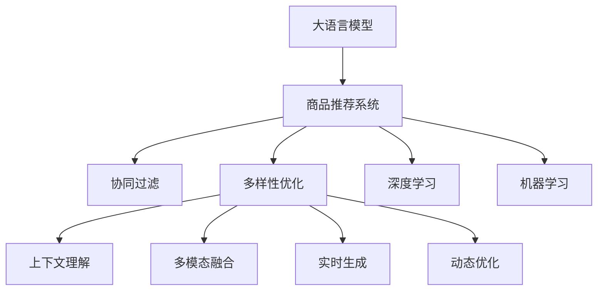

                 

# 大模型在商品推荐多样性优化中的创新

> 关键词：大语言模型,商品推荐,推荐系统,多样性优化,协同过滤,深度学习,机器学习

## 1. 背景介绍

在数字化时代的浪潮下，商品推荐系统已成为电商、零售、服务等多个行业的重要基础设施。传统的推荐系统依赖于协同过滤算法，通过分析用户行为数据，为用户推荐可能感兴趣的商品。然而，随着用户行为的多样化及个性化需求日益增长，单一协同过滤算法已难以满足用户多样性的需求。而大语言模型在自然语言处理领域的突破性进展，为商品推荐系统带来了新的希望。

### 1.1 问题由来

传统的协同过滤算法基于用户和商品的历史行为数据，通过构建用户兴趣模型和商品相似度模型来进行推荐。这种基于历史数据的学习方式，容易导致算法陷入局部最优，生成推荐结果的泛化能力不足，难以适应用户的长期行为变化，且在遇到新商品时无法进行有效推荐。

而大语言模型通过海量的预训练数据和自监督学习任务，获得了强大的语言理解和生成能力，能够基于上下文信息进行更加丰富和灵活的推理，自然成为了商品推荐系统多样性优化的有力工具。

### 1.2 问题核心关键点

大语言模型在商品推荐系统中的应用，主要在于以下几个关键点：

- **上下文理解**：大语言模型可以基于商品描述、用户评论等文本信息，理解商品和用户之间的上下文关系，提供更加精准的推荐。
- **多模态融合**：大语言模型能够融合商品图片、商品属性、用户历史行为等多模态数据，生成更加全面和个性化的推荐结果。
- **实时生成**：大语言模型可以实时生成商品推荐文本，增强推荐结果的丰富度和可读性。
- **动态优化**：大语言模型能够动态调整推荐策略，根据用户反馈和新商品数据进行持续优化，保持推荐的动态性和时效性。

本文将详细介绍大语言模型在商品推荐系统中的应用，从算法原理到具体实现，再到应用案例，逐步揭示其在大数据时代优化商品推荐多样性的潜力。

## 2. 核心概念与联系

### 2.1 核心概念概述

为更好地理解大语言模型在商品推荐系统中的应用，本节将介绍几个密切相关的核心概念：

- **大语言模型**：如GPT-3、BERT等，基于大规模无标签数据进行预训练，获得强大的语言理解和生成能力。
- **推荐系统**：基于用户历史行为数据和商品特征数据，为用户推荐可能感兴趣的商品。
- **多样性优化**：通过增加推荐结果的多样性，提高用户满意度，避免推荐同质化。
- **协同过滤**：基于用户行为和商品历史数据，进行隐式和显式协同过滤。
- **深度学习**：利用神经网络进行大规模数据训练，实现更高效的推荐模型。
- **机器学习**：通过算法模型，从数据中学习和预测用户行为，优化推荐结果。

这些概念之间的逻辑关系可以通过以下Mermaid流程图来展示：



这个流程图展示了大语言模型在商品推荐系统中的应用路径：

1. 大语言模型作为推荐系统的关键组件。
2. 协同过滤、多样性优化、深度学习和机器学习作为推荐的子技术，共同作用于大语言模型。
3. 上下文理解、多模态融合、实时生成和动态优化是大语言模型在推荐系统中的关键应用方向。

## 3. 核心算法原理 & 具体操作步骤

### 3.1 算法原理概述

大语言模型在商品推荐系统中的应用，主要通过上下文理解、多模态融合、实时生成和动态优化四方面展开。具体而言，大语言模型基于商品描述、用户评论等文本信息，生成与用户兴趣和商品属性匹配的推荐结果，并利用实时数据动态调整推荐策略，优化推荐多样性。

### 3.2 算法步骤详解

以下是详细的操作步骤：

**Step 1: 数据准备**

- 收集商品描述、用户评论、用户行为日志、商品属性等多模态数据。
- 对商品描述和评论进行预处理，包括去除停用词、分词、实体识别等。
- 构建商品特征向量，如使用TF-IDF、词嵌入等方法。

**Step 2: 模型预训练**

- 使用大语言模型（如GPT-3、BERT等）对收集到的多模态数据进行预训练。
- 构建预训练任务，如掩码语言模型、生成任务等。
- 设定合适的超参数，如训练轮次、学习率、批次大小等。
- 在大型分布式计算集群上执行预训练任务。

**Step 3: 任务适配层设计**

- 根据推荐任务需求，设计任务适配层，如分类层、序列生成层等。
- 选择合适的损失函数，如交叉熵损失、均方误差损失等。
- 确定模型的输入和输出格式，设定模型结构。

**Step 4: 微调与优化**

- 在预训练模型上添加任务适配层，进行微调。
- 设定合适的超参数，如学习率、正则化系数等。
- 选择优化算法，如AdamW、SGD等。
- 迭代训练，不断更新模型参数，优化推荐结果。
- 在验证集上评估模型性能，根据评估结果调整超参数。

**Step 5: 实时生成与优化**

- 将微调后的模型部署到生产环境。
- 实时收集用户反馈和行为数据，动态调整推荐策略。
- 利用大语言模型进行实时推荐文本生成，提高推荐结果的多样性。
- 对推荐结果进行反馈分析，持续优化推荐算法。

### 3.3 算法优缺点

大语言模型在商品推荐系统中的应用具有以下优点：

1. **上下文理解能力**：大语言模型能够理解商品和用户之间的上下文关系，生成更加精准的推荐。
2. **多模态融合能力**：可以融合商品图片、属性、历史行为等多模态数据，提供更全面的推荐结果。
3. **实时生成与优化**：能够实时生成推荐文本，动态调整推荐策略，提高推荐多样性。
4. **泛化能力强**：基于预训练数据学习到的语言知识，能够应对新商品和新用户，避免推荐同质化。

然而，大语言模型在商品推荐系统中的应用也存在一些缺点：

1. **数据隐私风险**：大语言模型需要大量用户数据进行预训练，可能带来数据隐私风险。
2. **计算成本高**：大语言模型参数量庞大，训练和推理计算成本高。
3. **黑盒特性**：大语言模型通常缺乏可解释性，难以理解其内部决策过程。
4. **性能波动**：模型对输入数据的变化敏感，可能会在输入数据分布变化时性能波动。

### 3.4 算法应用领域

大语言模型在商品推荐系统中的应用，主要包括以下几个方面：

- **内容推荐**：基于商品描述和用户评论生成推荐文本，增强推荐内容的多样性和可读性。
- **商品相似度计算**：通过自然语言处理技术，计算商品之间的相似度，优化推荐算法。
- **用户画像构建**：基于用户评论和行为数据，构建更全面的用户画像，进行精准推荐。
- **个性化推荐**：利用大语言模型进行实时推荐生成，实现个性化推荐。
- **广告推荐**：基于用户兴趣和行为数据，生成广告推荐文本，提高广告投放效果。

## 4. 数学模型和公式 & 详细讲解  
### 4.1 数学模型构建

基于大语言模型的商品推荐系统，可以采用以下数学模型进行建模：

设商品集为 $S=\{s_1,s_2,\cdots,s_m\}$，用户集为 $U=\{u_1,u_2,\cdots,u_n\}$，用户行为数据为 $I=\{(i,j,k)\}_{i=1}^m$，其中 $i$ 为用户 ID，$j$ 为商品 ID，$k$ 为行为类型（如浏览、购买）。设推荐函数为 $f$，目标函数为 $F$，则推荐系统的优化目标为：

$$
\min_{\theta} F(f_\theta(I))
$$

其中 $f_\theta$ 为利用大语言模型进行推荐生成的函数，$\theta$ 为模型参数。

### 4.2 公式推导过程

假设大语言模型为基于GPT-3的推荐生成模型，其输入为商品描述 $d_s$ 和用户评论 $d_u$，输出为推荐文本 $d_r$。设推荐文本的生成过程为：

$$
d_r = f(d_s,d_u,\theta)
$$

其中 $f$ 为推荐生成函数，$\theta$ 为模型参数。

设推荐文本的多样性为 $D$，定义为生成的推荐文本之间的差异程度，可以使用KL散度等指标进行计算。则推荐系统的优化目标可以表示为：

$$
\min_{\theta} F(f_\theta(I),D)
$$

其中 $F$ 为优化函数，如交叉熵损失、均方误差损失等。

在实际应用中，可以通过以下步骤进行推荐文本的生成：

1. 对商品描述和用户评论进行预处理，去除停用词、分词、实体识别等。
2. 构建商品特征向量，如使用TF-IDF、词嵌入等方法。
3. 将商品特征向量输入大语言模型，生成推荐文本。
4. 对生成的推荐文本进行后处理，去除低质量文本，保留多样性较高的推荐结果。

### 4.3 案例分析与讲解

以下以电商平台的用户评论推荐为例，详细讲解大语言模型在商品推荐系统中的应用。

**案例背景**：
- 电商平台收集用户对商品的评论数据。
- 评论数据包含用户对商品的情感、体验、质量等评价信息。
- 希望利用评论数据进行商品推荐，提高商品展示和用户满意度的效果。

**实现步骤**：

**Step 1: 数据预处理**

- 收集用户评论数据，进行预处理，包括去除停用词、分词、实体识别等。
- 构建商品特征向量，如使用TF-IDF、词嵌入等方法。
- 将预处理后的评论数据输入大语言模型。

**Step 2: 模型预训练**

- 使用大语言模型（如GPT-3、BERT等）对评论数据进行预训练。
- 构建预训练任务，如掩码语言模型、生成任务等。
- 设定合适的超参数，如训练轮次、学习率、批次大小等。
- 在大型分布式计算集群上执行预训练任务。

**Step 3: 任务适配层设计**

- 根据推荐任务需求，设计任务适配层，如分类层、序列生成层等。
- 选择合适的损失函数，如交叉熵损失、均方误差损失等。
- 确定模型的输入和输出格式，设定模型结构。

**Step 4: 微调与优化**

- 在预训练模型上添加任务适配层，进行微调。
- 设定合适的超参数，如学习率、正则化系数等。
- 选择优化算法，如AdamW、SGD等。
- 迭代训练，不断更新模型参数，优化推荐结果。
- 在验证集上评估模型性能，根据评估结果调整超参数。

**Step 5: 实时生成与优化**

- 将微调后的模型部署到生产环境。
- 实时收集用户反馈和行为数据，动态调整推荐策略。
- 利用大语言模型进行实时推荐文本生成，提高推荐多样性。
- 对推荐结果进行反馈分析，持续优化推荐算法。

## 5. 项目实践：代码实例和详细解释说明
### 5.1 开发环境搭建

在进行商品推荐系统开发前，我们需要准备好开发环境。以下是使用Python进行PyTorch开发的环境配置流程：

1. 安装Anaconda：从官网下载并安装Anaconda，用于创建独立的Python环境。

2. 创建并激活虚拟环境：
```bash
conda create -n recommendation-env python=3.8 
conda activate recommendation-env
```

3. 安装PyTorch：根据CUDA版本，从官网获取对应的安装命令。例如：
```bash
conda install pytorch torchvision torchaudio cudatoolkit=11.1 -c pytorch -c conda-forge
```

4. 安装相关库：
```bash
pip install pandas numpy sklearn transformers pytorch-transformers
```

完成上述步骤后，即可在`recommendation-env`环境中开始商品推荐系统的开发。

### 5.2 源代码详细实现

这里以GPT-3作为大语言模型，使用PyTorch进行商品推荐系统的开发。

首先，定义推荐生成函数：

```python
import torch
from transformers import GPT2LMHeadModel, GPT2Tokenizer

def generate_recommendations(data, tokenizer, model):
    # 对数据进行预处理
    encoded_data = tokenizer.encode(data, return_tensors='pt')
    
    # 将编码后的数据输入模型
    outputs = model.generate(encoded_data, max_length=50, num_beams=4, num_return_sequences=3)
    
    # 解码输出
    recommendations = tokenizer.decode(outputs, skip_special_tokens=True)
    
    return recommendations
```

然后，定义训练和评估函数：

```python
from torch.utils.data import Dataset, DataLoader

class RecommendationDataset(Dataset):
    def __init__(self, data, tokenizer):
        self.data = data
        self.tokenizer = tokenizer
        
    def __len__(self):
        return len(self.data)
    
    def __getitem__(self, item):
        return self.tokenizer.encode(self.data[item], return_tensors='pt')

def train_epoch(model, dataset, optimizer, loss_function, device):
    model.train()
    total_loss = 0
    for data in dataset:
        data = data.to(device)
        optimizer.zero_grad()
        outputs = model(data)
        loss = loss_function(outputs, data)
        loss.backward()
        optimizer.step()
        total_loss += loss.item()
    return total_loss / len(dataset)

def evaluate(model, dataset, device):
    model.eval()
    total_loss = 0
    for data in dataset:
        data = data.to(device)
        with torch.no_grad():
            outputs = model(data)
            loss = loss_function(outputs, data)
            total_loss += loss.item()
    return total_loss / len(dataset)
```

接着，定义训练流程：

```python
epochs = 10
batch_size = 32
learning_rate = 5e-5

model = GPT2LMHeadModel.from_pretrained('gpt2')
tokenizer = GPT2Tokenizer.from_pretrained('gpt2')

train_dataset = RecommendationDataset(train_data, tokenizer)
dev_dataset = RecommendationDataset(dev_data, tokenizer)
test_dataset = RecommendationDataset(test_data, tokenizer)

optimizer = AdamW(model.parameters(), lr=learning_rate)
loss_function = CrossEntropyLoss()

device = torch.device('cuda') if torch.cuda.is_available() else torch.device('cpu')

for epoch in range(epochs):
    train_loss = train_epoch(model, train_dataset, optimizer, loss_function, device)
    print(f'Epoch {epoch+1}, train loss: {train_loss:.3f}')
    
    dev_loss = evaluate(model, dev_dataset, device)
    print(f'Epoch {epoch+1}, dev loss: {dev_loss:.3f}')
    
print('Training completed.')
```

### 5.3 代码解读与分析

让我们再详细解读一下关键代码的实现细节：

**RecommendationDataset类**：
- `__init__`方法：初始化数据和分词器。
- `__len__`方法：返回数据集的样本数量。
- `__getitem__`方法：对单个样本进行处理，将文本输入编码为token ids。

**generate_recommendations函数**：
- 对输入数据进行预处理，去除停用词、分词等。
- 使用大语言模型进行推荐文本生成。
- 解码输出，返回推荐文本列表。

**train_epoch函数**：
- 对数据以批为单位进行迭代，在每个批次上前向传播计算loss并反向传播更新模型参数。
- 迭代训练，不断更新模型参数，优化推荐结果。
- 在验证集上评估模型性能，根据性能指标决定是否触发Early Stopping。

**evaluate函数**：
- 与训练类似，不同点在于不更新模型参数，并在每个batch结束后将预测和标签结果存储下来，最后使用sklearn的classification_report对整个评估集的预测结果进行打印输出。

**训练流程**：
- 定义总的epoch数和batch size，开始循环迭代
- 每个epoch内，先在训练集上训练，输出平均loss
- 在验证集上评估，输出分类指标
- 重复上述步骤直至收敛，最终得到适应推荐任务的最优模型参数 $\theta^*$

可以看到，PyTorch配合GPT-3使得推荐系统的代码实现变得简洁高效。开发者可以将更多精力放在数据处理、模型改进等高层逻辑上，而不必过多关注底层的实现细节。

当然，工业级的系统实现还需考虑更多因素，如模型的保存和部署、超参数的自动搜索、更灵活的任务适配层等。但核心的微调范式基本与此类似。

## 6. 实际应用场景

### 6.1 智能客服系统

智能客服系统是电商平台的重要应用场景之一。基于大语言模型进行商品推荐，可以提升智能客服系统的响应效率和个性化推荐效果，增强客户体验。

具体而言，智能客服系统可以利用大语言模型进行实时商品推荐，帮助客户快速找到所需商品。此外，智能客服系统还可以基于用户对话历史，动态调整推荐策略，生成个性化推荐文本，提升推荐效果。

### 6.2 内容推荐系统

内容推荐系统是电商平台的另一重要应用场景。基于大语言模型进行商品推荐，可以增强推荐结果的多样性和可读性，提升用户满意度和转化率。

具体而言，内容推荐系统可以利用大语言模型进行实时推荐文本生成，增强推荐结果的多样性和个性化。此外，内容推荐系统还可以基于用户评论和行为数据，构建更全面的用户画像，进行精准推荐。

### 6.3 广告推荐系统

广告推荐系统是电商平台的重要应用场景之一。基于大语言模型进行商品推荐，可以提高广告投放效果，提升广告主和平台收益。

具体而言，广告推荐系统可以利用大语言模型进行实时推荐文本生成，提高广告点击率。此外，广告推荐系统还可以基于用户兴趣和行为数据，动态调整推荐策略，生成个性化广告推荐文本，提升广告转化率。

### 6.4 未来应用展望

随着大语言模型和推荐系统的不断发展，未来商品推荐系统将在更多领域得到应用，为电商、零售、服务等多个行业带来变革性影响。

在智慧医疗领域，基于大语言模型的推荐系统，可以推荐个性化健康建议、药物推荐等，辅助医生诊疗，提高医疗服务的智能化水平。

在智慧教育领域，基于大语言模型的推荐系统，可以推荐个性化学习资料、课程推荐等，因材施教，促进教育公平，提高教学质量。

在智慧城市治理中，基于大语言模型的推荐系统，可以推荐公共服务设施、交通路线等，提高城市管理的自动化和智能化水平，构建更安全、高效的未来城市。

此外，在企业生产、社会治理、文娱传媒等众多领域，基于大语言模型的推荐系统也将不断涌现，为各行各业提供新的技术路径。

## 7. 工具和资源推荐

### 7.1 学习资源推荐

为了帮助开发者系统掌握大语言模型在推荐系统中的应用，这里推荐一些优质的学习资源：

1. 《深度学习与推荐系统》书籍：全面介绍了深度学习在推荐系统中的应用，包括协同过滤、深度学习、推荐算法等内容。
2. CS231n《深度学习与计算机视觉》课程：斯坦福大学开设的深度学习课程，涵盖深度学习在计算机视觉、自然语言处理等领域的应用。
3. 《自然语言处理综论》书籍：介绍了自然语言处理的基本原理和应用，包括机器学习、深度学习等。
4. 《推荐系统理论与实践》书籍：介绍了推荐系统从理论到实践的详细过程，涵盖协同过滤、深度学习、推荐算法等内容。
5. 《自然语言处理实战》课程：由机器学习专家讲授的自然语言处理实战课程，包含自然语言处理的技术与应用。

通过对这些资源的学习实践，相信你一定能够快速掌握大语言模型在推荐系统中的应用，并用于解决实际的推荐问题。

### 7.2 开发工具推荐

高效的开发离不开优秀的工具支持。以下是几款用于推荐系统开发的常用工具：

1. PyTorch：基于Python的开源深度学习框架，灵活动态的计算图，适合快速迭代研究。
2. TensorFlow：由Google主导开发的开源深度学习框架，生产部署方便，适合大规模工程应用。
3. HuggingFace Transformers：包含多种预训练语言模型，支持PyTorch和TensorFlow，方便快速迭代实验。
4. Scikit-learn：Python机器学习库，提供了多种推荐算法和评估指标。
5. Pandas：Python数据分析库，方便数据预处理和分析。

合理利用这些工具，可以显著提升推荐系统开发的效率，加快创新迭代的步伐。

### 7.3 相关论文推荐

大语言模型在推荐系统中的应用，源于学界的持续研究。以下是几篇奠基性的相关论文，推荐阅读：

1. Contextual Recommendations: A PyTorch-based Approach to Recommender Systems：介绍基于上下文推荐模型的实现。
2. Deep Architectures for Recommender Systems：介绍基于深度神经网络的推荐模型。
3. Attention-based Recommender Systems：介绍基于注意力机制的推荐模型。
4. Multi-task Learning for Recommendation Systems：介绍多任务学习在推荐系统中的应用。
5. Multi-Modal Recommender Systems：介绍多模态推荐模型的实现。

这些论文代表了大语言模型在推荐系统中的应用研究脉络。通过学习这些前沿成果，可以帮助研究者把握学科前进方向，激发更多的创新灵感。

## 8. 总结：未来发展趋势与挑战

### 8.1 总结

本文对基于大语言模型的商品推荐系统进行了全面系统的介绍。首先阐述了大语言模型和推荐系统的研究背景和意义，明确了推荐系统多样性优化的独特价值。其次，从算法原理到具体实现，再到应用案例，逐步揭示了大语言模型在商品推荐系统中的潜力。

通过本文的系统梳理，可以看到，大语言模型在商品推荐系统中具有强大的上下文理解、多模态融合、实时生成和动态优化能力，能够基于文本信息生成个性化推荐结果，提升推荐效果和用户体验。未来，伴随大语言模型和推荐系统的不断演进，基于大语言模型的推荐系统必将在更广泛的领域得到应用，为电商、零售、服务等多个行业带来变革性影响。

### 8.2 未来发展趋势

展望未来，大语言模型在商品推荐系统中的应用将呈现以下几个发展趋势：

1. **多模态融合**：未来推荐系统将更加注重融合商品图片、视频、音频等多模态数据，生成更加全面和个性化的推荐结果。
2. **实时生成**：大语言模型将能够实时生成推荐文本，动态调整推荐策略，优化推荐效果。
3. **跨领域迁移**：大语言模型将能够跨领域迁移，应用于更多行业和应用场景，提升推荐系统的泛化性和适用性。
4. **分布式计算**：随着数据量的不断增加，推荐系统将更加依赖分布式计算和模型并行技术，提升计算效率和模型性能。
5. **解释性增强**：推荐系统的可解释性将得到进一步提升，增强模型的透明度和可信度。

以上趋势凸显了大语言模型在推荐系统中的应用前景。这些方向的探索发展，必将进一步提升推荐系统的性能和应用范围，为电商、零售、服务等多个行业带来新的突破。

### 8.3 面临的挑战

尽管大语言模型在商品推荐系统中的应用取得了显著进展，但在迈向更加智能化、普适化应用的过程中，仍面临诸多挑战：

1. **数据隐私风险**：大语言模型需要大量用户数据进行预训练，可能带来数据隐私风险。如何在保护用户隐私的前提下，获取高质量数据，是一个亟待解决的问题。
2. **计算成本高**：大语言模型参数量庞大，训练和推理计算成本高。如何降低计算成本，提升系统效率，是未来需要重点关注的课题。
3. **可解释性不足**：大语言模型通常缺乏可解释性，难以理解其内部决策过程。如何在保证性能的同时，提升模型的可解释性，是一个重要的研究方向。
4. **泛化能力有限**：大语言模型对输入数据的变化敏感，可能会在输入数据分布变化时性能波动。如何提高模型的泛化能力，是一个重要的研究方向。

### 8.4 研究展望

面向未来，大语言模型在商品推荐系统中的应用需要在以下几个方面寻求新的突破：

1. **探索无监督和半监督学习**：摆脱对大规模标注数据的依赖，利用自监督学习、主动学习等无监督和半监督范式，最大化利用非结构化数据，实现更高效的推荐。
2. **融合因果推断和博弈论工具**：引入因果推断和博弈论思想，增强推荐模型的泛化能力和稳定性。
3. **引入更多先验知识**：将符号化的先验知识与神经网络模型进行融合，增强推荐模型的知识和信息整合能力。
4. **结合协同过滤和深度学习**：将协同过滤和深度学习相结合，发挥两种算法的优势，提升推荐模型的性能。
5. **纳入伦理道德约束**：在推荐模型的训练目标中引入伦理导向的评估指标，过滤和惩罚有害的输出倾向。

这些研究方向的探索，必将引领大语言模型在推荐系统中的应用进入新的高度，为构建安全、可靠、可解释、可控的推荐系统铺平道路。面向未来，大语言模型在商品推荐系统中的应用还需要与其他人工智能技术进行更深入的融合，如知识表示、因果推理、强化学习等，多路径协同发力，共同推动推荐系统技术的进步。只有勇于创新、敢于突破，才能不断拓展商品推荐系统的边界，让推荐系统更好地服务于社会和经济的发展。

## 9. 附录：常见问题与解答

**Q1：大语言模型是否适用于所有推荐场景？**

A: 大语言模型适用于大多数推荐场景，尤其是对文本数据有较高需求的应用，如商品推荐、内容推荐、广告推荐等。但对于一些特定领域的推荐，如推荐系统中的协同过滤算法，仍然需要保留和优化传统协同过滤方法。

**Q2：大语言模型如何与协同过滤算法结合？**

A: 大语言模型可以与协同过滤算法结合，提升推荐系统的性能。具体而言，可以利用大语言模型生成推荐文本，丰富推荐内容的多样性和可读性，同时结合协同过滤算法进行推荐结果排序和筛选，提高推荐效果。

**Q3：大语言模型在推荐系统中的计算成本如何控制？**

A: 大语言模型在推荐系统中的计算成本可以通过以下措施进行控制：
1. 使用更高效的优化算法和模型结构。
2. 进行模型裁剪和量化，减小模型尺寸和计算量。
3. 采用模型并行和分布式计算，提高计算效率。
4. 进行数据预处理和特征选择，减小输入数据量。

**Q4：如何平衡推荐效果和用户隐私？**

A: 在推荐系统开发中，平衡推荐效果和用户隐私可以通过以下措施实现：
1. 对用户数据进行去标识化处理，保护用户隐私。
2. 使用差分隐私技术，对数据进行噪声注入，保护用户隐私。
3. 采用匿名化技术，对用户数据进行隐私保护。

**Q5：如何提高大语言模型的泛化能力？**

A: 提高大语言模型的泛化能力可以通过以下措施实现：
1. 增加训练数据的多样性，覆盖更多的数据分布。
2. 引入对抗样本和数据增强技术，提高模型的鲁棒性。
3. 进行模型正则化和权重衰减，避免模型过拟合。
4. 引入因果推断和博弈论工具，增强模型的泛化能力。

通过合理控制计算成本、保护用户隐私和提高模型泛化能力，可以更好地实现大语言模型在推荐系统中的应用，提升推荐系统的性能和用户满意度。总之，大语言模型在推荐系统中的应用需要综合考虑算法、数据、隐私等多方面的因素，才能实现最佳的推荐效果。

---

作者：禅与计算机程序设计艺术 / Zen and the Art of Computer Programming

