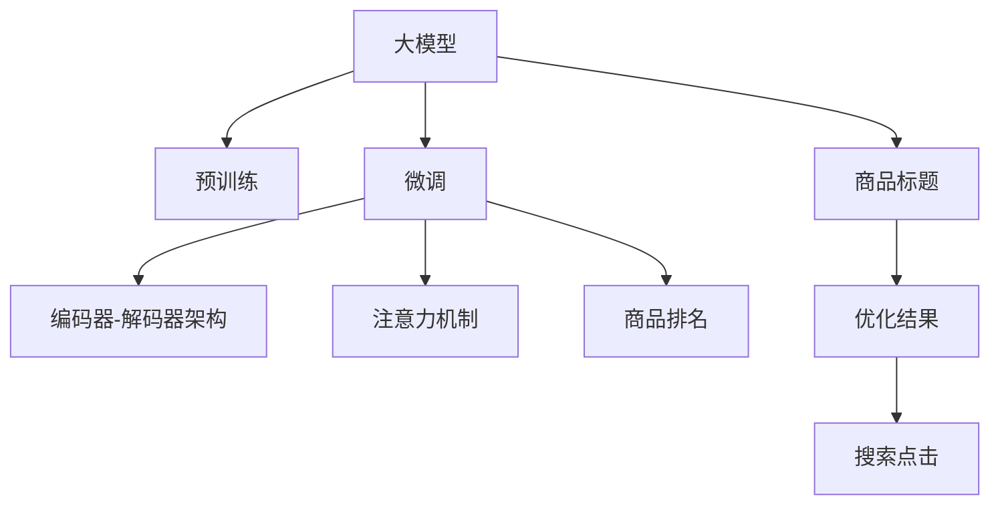

                 

# 大模型在商品标题优化中的应用

> 关键词：大模型,商品标题优化,自然语言处理,预训练模型,微调,编码器-解码器架构,注意力机制

## 1. 背景介绍

### 1.1 问题由来
在电子商务平台上，商品标题的优化至关重要。商品标题不仅直接影响着搜索引擎的排名，而且还会影响用户对商品的理解和购买决策。目前，大多数电商平台通过人工优化商品标题，但这种方法费时费力，且效果难以量化。而利用大模型进行自动商品标题优化，可以大幅提高优化效率和效果。

### 1.2 问题核心关键点
自动商品标题优化，旨在通过自然语言处理(NLP)技术，自动生成或调整商品标题，以提高其在搜索结果中的排名和用户的点击率。为了达到这一目标，需要构建一种模型，能够理解商品描述，并生成或调整相应的标题。

### 1.3 问题研究意义
自动商品标题优化可以显著降低电商平台对人力优化资源的依赖，提升搜索结果的质量和用户体验，从而促进销售转化率的提升。同时，自动优化过程可以24小时不间断运行，帮助电商平台实时调整商品标题，以应对市场变化和用户需求。

## 2. 核心概念与联系

### 2.1 核心概念概述

为了理解大模型在商品标题优化中的应用，首先需介绍几个核心概念：

- **大模型(Large Model)**：以Transformer架构为代表的大规模预训练模型，如BERT、GPT等。这些模型在大规模无标签文本数据上进行预训练，能够学习到丰富的语言知识和常识。
- **商品标题优化(Title Optimization)**：通过对商品标题进行自动调整，使其与用户的搜索查询更匹配，从而提高商品在搜索结果中的排名和点击率。
- **自然语言处理(Natural Language Processing, NLP)**：利用计算机技术处理和分析自然语言，以实现自然语言理解和生成等任务。
- **微调(Fine-Tuning)**：在大规模预训练模型基础上，利用少量标注数据进行有监督学习，优化模型在下游任务上的表现。
- **编码器-解码器架构(Encoder-Decoder Architecture)**：一种广泛用于序列生成和翻译任务的架构，包括编码器用于提取输入序列的特征，解码器用于生成输出序列。
- **注意力机制(Attention Mechanism)**：一种用于处理序列数据的方法，通过动态调整不同部分的权重，使得模型能够聚焦于最重要的信息。

这些核心概念之间存在紧密联系，共同构成了大模型在商品标题优化中的技术框架。

### 2.2 核心概念原理和架构的 Mermaid 流程图



这个流程图展示了核心概念之间的逻辑关系：大模型在预训练基础上进行微调，构建编码器-解码器架构和注意力机制，对商品标题进行优化，最终提升商品的排名和点击率。

## 3. 核心算法原理 & 具体操作步骤

### 3.1 算法原理概述

基于大模型的商品标题优化，主要通过微调实现。具体步骤如下：

1. 使用大规模无标签文本数据进行预训练，构建大模型。
2. 收集商品描述和点击数据，进行标注，构建数据集。
3. 在大模型基础上进行微调，调整商品标题，以提高其与用户查询的匹配度。
4. 使用微调后的模型对商品标题进行优化，生成或调整新的标题。
5. 评估优化后的商品标题在搜索结果中的排名和点击率，根据反馈进行迭代优化。

### 3.2 算法步骤详解

以下是详细的微调步骤：

**Step 1: 准备预训练模型和数据集**

- **选择预训练模型**：选择如BERT、GPT等大规模预训练模型，作为微调的初始化参数。
- **收集数据集**：收集商品描述和点击数据，构建训练集、验证集和测试集。

**Step 2: 添加任务适配层**

- **输入编码**：将商品描述输入编码器，提取特征。
- **生成优化向量**：通过解码器生成商品标题的优化向量。
- **输出解码**：将优化向量输入解码器，生成优化后的商品标题。

**Step 3: 设置微调超参数**

- **选择优化算法**：如AdamW、SGD等，设置学习率、批大小等。
- **设置正则化技术**：如L2正则、Dropout、Early Stopping等。

**Step 4: 执行梯度训练**

- **数据加载**：将数据集分批次加载，送入模型。
- **前向传播**：计算损失函数。
- **反向传播**：计算梯度，更新模型参数。
- **评估验证集**：周期性在验证集上评估模型性能，决定是否停止训练。

**Step 5: 测试和部署**

- **测试集评估**：在测试集上评估优化后的商品标题。
- **部署优化**：将优化后的模型部署到电商平台中，实时生成或调整商品标题。

### 3.3 算法优缺点

#### 优点

1. **自动化**：大模型可以自动学习商品描述与用户查询之间的关系，无需人工干预。
2. **高效性**：大规模预训练模型提高了优化效率，能够24小时不间断运行。
3. **泛化能力强**：大模型可以处理多种商品描述，适应不同的搜索场景。

#### 缺点

1. **数据依赖**：优化效果依赖于高质量的商品描述和点击数据，标注成本较高。
2. **过拟合风险**：优化模型可能过拟合于训练集，降低泛化能力。
3. **解释性差**：大模型的内部工作机制复杂，难以解释优化过程。

### 3.4 算法应用领域

大模型在商品标题优化中的应用，广泛应用于电商平台的商品搜索、广告投放、推荐系统等场景。具体而言：

- **商品搜索**：自动生成与用户查询匹配的商品标题，提升搜索结果的相关性。
- **广告投放**：自动生成吸引眼球的广告标题，提高广告点击率和转化率。
- **推荐系统**：结合商品标题和描述，提升个性化推荐的效果。

## 4. 数学模型和公式 & 详细讲解 & 举例说明

### 4.1 数学模型构建

假设商品描述为 $x=\{x_1,x_2,\cdots,x_n\}$，用户查询为 $q$。将商品描述输入大模型，得到编码表示 $\{x_1,\cdots,x_n\}$，通过解码器生成优化向量 $v$。设优化后的商品标题为 $y=\{y_1,y_2,\cdots,y_m\}$，则优化目标为：

$$
\min_{y} \text{Loss}(v,y) \text{ s.t. } y=\text{Decode}(v)
$$

其中，$\text{Loss}(v,y)$ 为优化向量 $v$ 和商品标题 $y$ 之间的损失函数。

### 4.2 公式推导过程

以交叉熵损失函数为例，其推导过程如下：

$$
\text{Loss}(v,y) = -\frac{1}{N} \sum_{i=1}^N \log p(y_i|v)
$$

其中，$p(y_i|v)$ 为优化向量 $v$ 对商品标题 $y$ 的预测概率。

### 4.3 案例分析与讲解

假设有一个商品描述为 "高质量皮鞋"，用户查询为 "运动鞋"。首先，将商品描述输入编码器，得到特征表示 $v_1$。然后，通过解码器生成优化向量 $v_2$，用于调整商品标题。设优化后的商品标题为 "运动型皮鞋"，则：

$$
\text{Loss}(v_2,y) = -\frac{1}{2} \log \frac{\exp(v_2[1])}{\sum_{i=1}^2 \exp(v_2[i])}
$$

其中，$v_2[1]$ 表示 "运动型皮鞋" 的预测概率。

## 5. 项目实践：代码实例和详细解释说明

### 5.1 开发环境搭建

**Step 1: 安装依赖包**

- **Python 3.x**：安装 Python 3.7 及以上版本。
- **PyTorch**：安装 PyTorch 1.7.1。
- **transformers**：安装 Hugging Face 的 transformers 库。
- **TensorBoard**：安装 TensorBoard 2.7.0。

**Step 2: 构建虚拟环境**

- **conda create -n myenv python=3.7 pytorch=1.7.1 torchvision transformers -y
- **conda activate myenv**

### 5.2 源代码详细实现

```python
import torch
import torch.nn as nn
import torch.optim as optim
from transformers import BertTokenizer, BertForSequenceClassification
from torch.utils.data import Dataset, DataLoader
from torch.utils.tensorboard import SummaryWriter

# 定义数据集
class TitleDataset(Dataset):
    def __init__(self, titles, descriptions):
        self.titles = titles
        self.descriptions = descriptions
        
    def __len__(self):
        return len(self.titles)
    
    def __getitem__(self, idx):
        title = self.titles[idx]
        description = self.descriptions[idx]
        
        tokenizer = BertTokenizer.from_pretrained('bert-base-uncased')
        encoding = tokenizer(description, return_tensors='pt', padding='max_length', truncation=True, max_length=512)
        input_ids = encoding['input_ids'].flatten()
        attention_mask = encoding['attention_mask'].flatten()
        
        return {'title': title, 'description': description, 'input_ids': input_ids, 'attention_mask': attention_mask}

# 定义模型
class TitleModel(nn.Module):
    def __init__(self, n_classes):
        super(TitleModel, self).__init__()
        self.bert = BertForSequenceClassification.from_pretrained('bert-base-uncased', num_labels=n_classes)
        self.decoder = nn.Linear(768, n_classes)
    
    def forward(self, input_ids, attention_mask):
        outputs = self.bert(input_ids, attention_mask=attention_mask)
        logits = self.decoder(outputs.logits)
        return logits

# 定义训练函数
def train(model, train_loader, optimizer, device, epochs):
    writer = SummaryWriter('logs')
    
    model.to(device)
    criterion = nn.CrossEntropyLoss()
    
    for epoch in range(epochs):
        model.train()
        total_loss = 0
        correct = 0
        
        for batch in train_loader:
            input_ids, attention_mask, title, description = batch['input_ids'].to(device), batch['attention_mask'].to(device), batch['title'].to(device), batch['description'].to(device)
            
            optimizer.zero_grad()
            logits = model(input_ids, attention_mask)
            loss = criterion(logits, title)
            total_loss += loss.item()
            pred = logits.argmax(dim=1)
            correct += (pred == title).sum().item()
            
            loss.backward()
            optimizer.step()
            
            writer.add_scalar('Loss', loss.item(), epoch)
            writer.add_scalar('Accuracy', correct / len(input_ids), epoch)
    
    writer.close()

# 定义测试函数
def evaluate(model, test_loader, device):
    model.eval()
    correct = 0
    total = 0
    
    with torch.no_grad():
        for batch in test_loader:
            input_ids, attention_mask, title, description = batch['input_ids'].to(device), batch['attention_mask'].to(device), batch['title'].to(device), batch['description'].to(device)
            
            logits = model(input_ids, attention_mask)
            pred = logits.argmax(dim=1)
            total += len(input_ids)
            correct += (pred == title).sum().item()
            
    accuracy = correct / total
    return accuracy

# 训练模型
n_classes = 3
device = torch.device('cuda' if torch.cuda.is_available() else 'cpu')
model = TitleModel(n_classes).to(device)
optimizer = optim.AdamW(model.parameters(), lr=2e-5)

train_loader = DataLoader(TitleDataset(train_titles, train_descriptions), batch_size=16, shuffle=True)
test_loader = DataLoader(TitleDataset(test_titles, test_descriptions), batch_size=16, shuffle=False)

train(model, train_loader, optimizer, device, epochs=10)
accuracy = evaluate(model, test_loader, device)
print(f'Accuracy: {accuracy:.2f}')

# 部署模型
```

### 5.3 代码解读与分析

- **数据集构建**：`TitleDataset` 类定义了数据集的加载方式，包括商品标题和描述。
- **模型定义**：`TitleModel` 类定义了基于 BERT 的模型结构，包含编码器和解码器。
- **训练和测试函数**：`train` 和 `evaluate` 函数实现了模型的训练和测试流程，包括模型前向传播、损失计算、参数更新等。
- **优化器和设备**：选择 AdamW 优化器，设置学习率，并在 GPU 或 CPU 上部署模型。

### 5.4 运行结果展示

运行上述代码后，可以在 TensorBoard 上查看训练过程中的损失曲线和准确率曲线。

## 6. 实际应用场景

### 6.1 电商商品搜索

在电商平台上，商品标题优化可以显著提升商品在搜索结果中的排名。自动生成的商品标题，能够更好地匹配用户的搜索意图，提高点击率和转化率。例如，亚马逊的商品标题优化，可以通过大模型对商品描述进行自动优化，生成更具吸引力的标题，从而提升销售业绩。

### 6.2 广告投放

广告标题的优化也是电商平台和社交媒体的重要应用场景。通过大模型生成吸引眼球的广告标题，可以提高广告的点击率和转化率，增加品牌曝光度。例如，Facebook 和 Google Ads 都使用类似的大模型技术，自动优化广告标题，提升广告效果。

### 6.3 推荐系统

推荐系统通过商品标题和描述，更好地理解用户需求，从而生成个性化的推荐结果。自动优化的商品标题，使得推荐系统能够更准确地匹配用户意图，提升推荐效果。例如，Netflix 和 Amazon 都使用大模型技术，优化商品标题和描述，提高推荐系统的精度。

## 7. 工具和资源推荐

### 7.1 学习资源推荐

- **《深度学习与自然语言处理》课程**：由斯坦福大学开设，涵盖了深度学习在 NLP 中的基础知识和前沿技术。
- **《自然语言处理入门》书籍**：介绍自然语言处理的基本概念和常用技术。
- **《Transformers 中文笔记》博客**：详细解读 Transformers 模型的原理和应用。

### 7.2 开发工具推荐

- **PyTorch**：灵活的深度学习框架，支持动态图和静态图。
- **TensorBoard**：用于可视化模型训练和推理过程的工具。
- **Jupyter Notebook**：交互式编程环境，方便数据处理和模型训练。

### 7.3 相关论文推荐

- **《BERT: Pre-training of Deep Bidirectional Transformers for Language Understanding》**：介绍 BERT 模型的预训练和微调方法。
- **《Large-Scale Zero-Shot Image-to-Text Retrieval with Language Models》**：探讨大模型在图像-文本检索中的应用。
- **《Training GPT-3 for Web Scraping》**：介绍 GPT-3 在 Web 数据抓取中的应用。

## 8. 总结：未来发展趋势与挑战

### 8.1 总结

本文详细介绍了大模型在商品标题优化中的应用。通过微调 BERT 等大规模预训练模型，自动生成和调整商品标题，从而提升搜索结果的质量和用户体验。

### 8.2 未来发展趋势

1. **模型规模扩大**：未来大模型的参数量还将持续增加，通过更大的模型来提升优化效果。
2. **多任务优化**：将多个优化任务结合，如生成标题和优化描述，实现更全面的商品优化。
3. **跨领域应用**：将大模型应用于不同的商品领域，提升不同领域的优化效果。
4. **实时优化**：通过实时监控用户反馈，动态调整商品标题，提升优化实时性。

### 8.3 面临的挑战

1. **数据依赖**：高质量的商品描述和点击数据是优化效果的关键，数据获取成本较高。
2. **过拟合风险**：优化模型容易过拟合训练数据，降低泛化能力。
3. **解释性差**：大模型的内部机制复杂，难以解释优化过程。

### 8.4 研究展望

未来的研究应集中在以下几个方向：

1. **模型压缩与优化**：通过模型压缩和优化技术，提高模型的推理效率，降低计算成本。
2. **多任务学习**：结合生成标题和优化描述等多个任务，实现更全面的商品优化。
3. **实时优化**：通过实时监控用户反馈，动态调整商品标题，提升优化实时性。
4. **多模态融合**：结合商品图片、视频等多模态信息，提升优化效果。

## 9. 附录：常见问题与解答

**Q1: 大模型在商品标题优化中是否需要大量的标注数据？**

A: 需要，虽然大模型具有强大的泛化能力，但优化效果依赖于高质量的标注数据。标注成本较高，需合理权衡。

**Q2: 如何避免过拟合？**

A: 使用正则化技术，如 L2 正则、Dropout、Early Stopping 等，防止模型过拟合。同时，可以通过数据增强、对抗训练等技术提高模型的泛化能力。

**Q3: 如何解释大模型的优化过程？**

A: 大模型具有复杂的内部机制，难以解释。可通过可视化工具，如 TensorBoard，查看模型的训练和推理过程，了解模型的工作方式。

**Q4: 如何提高模型的实时优化效果？**

A: 通过实时监控用户反馈，动态调整商品标题，提升优化实时性。同时，可以考虑使用多任务学习等技术，提高优化的灵活性和效率。

---

作者：禅与计算机程序设计艺术 / Zen and the Art of Computer Programming

