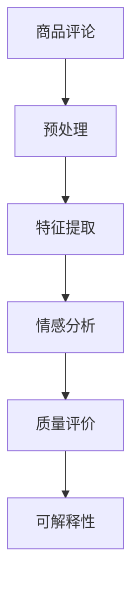

                 

## 1. 背景介绍

在电子商务领域，商品评论质量评估一直是一个重要的研究课题。商品评论不仅反映了消费者的真实感受，也影响了潜在消费者的购买决策。传统的评论质量评估方法依赖于人工标注和手动评分，不仅费时费力，而且主观性强，缺乏客观性和可解释性。随着深度学习和大模型技术的崛起，一种全新的基于自然语言处理(NLP)的自动化商品评论质量评估方法应运而生，并在实际应用中展示了显著的优势。

## 2. 核心概念与联系

### 2.1 核心概念概述

商品评论质量评估的自动化方法主要基于自然语言处理技术，其核心思想是通过对评论文本的分析，自动判断评论的质量和情绪。涉及的主要概念包括：

- **商品评论**：商品评论是消费者对购买的商品进行评价和反馈的文本。它包括商品描述、使用体验、优缺点评价等内容。
- **评论质量**：评论质量通常包括评论的情感倾向、客观性、完整性、清晰性等维度，这些维度通常被视为评价指标。
- **情感分析**：情感分析是NLP中的一个重要分支，旨在识别和提取文本中的情感倾向，判断文本的情感极性是正面的、中性的还是负面的。
- **质量评价模型**：质量评价模型通过学习和理解评论文本的特征，自动打分并评估评论的质量。
- **可解释性**：可解释性要求模型能够提供决策依据，帮助开发者和用户理解模型的行为和输出。

### 2.2 核心概念原理和架构的 Mermaid 流程图



以上流程图展示了商品评论质量评估的核心步骤：首先对评论进行预处理，然后提取特征，通过情感分析判断评论的情感极性，最后使用质量评价模型给出质量分数。

## 3. 核心算法原理 & 具体操作步骤

### 3.1 算法原理概述

基于大模型的商品评论质量评估方法，主要通过以下步骤实现：

1. **数据准备**：收集商品评论数据集，并进行预处理和标注。
2. **模型训练**：使用大模型（如BERT、RoBERTa、GPT等）进行预训练，并在商品评论数据集上微调，训练质量评价模型。
3. **特征提取**：将评论文本转换为模型可接受的特征向量。
4. **情感分析**：对特征向量进行情感分析，判断评论的情感极性。
5. **质量评分**：根据情感分析结果，使用质量评价模型对评论质量进行评分。
6. **可解释性**：通过可解释性技术，如LIME、SHAP等，对模型输出进行解释，帮助理解评分依据。

### 3.2 算法步骤详解

#### 3.2.1 数据准备

1. **数据收集**：从电商平台上收集商品评论数据，确保数据的多样性和代表性。
2. **数据预处理**：去除重复评论、无效数据，对文本进行分词、去除停用词等处理。
3. **标注质量**：根据评论内容、情感极性等维度，对评论进行手工标注，打分评价。

#### 3.2.2 模型训练

1. **预训练**：使用大规模无标签文本数据对大模型进行预训练，学习语言表示和特征提取能力。
2. **微调**：在标注好的商品评论数据集上微调大模型，训练质量评价模型。
3. **学习率选择**：选择合适的学习率，一般为0.001-0.01之间，避免过拟合。
4. **迭代次数**：设置合适的迭代次数，一般为10-20轮，直到收敛。

#### 3.2.3 特征提取

1. **嵌入表示**：将评论文本转化为词向量或上下文向量表示，如使用BERT嵌入层。
2. **特征选择**：选择与质量评分相关的特征，如情感强度、评论长度、关键词等。

#### 3.2.4 情感分析

1. **情感词典**：使用情感词典（如AFINN、SentiWordNet等）对评论进行情感极性判断。
2. **情感强度**：计算评论中每个词汇的情感强度，并将之加权平均，得到评论的情感强度分数。

#### 3.2.5 质量评分

1. **评分模型**：使用多分类模型（如SVM、LSTM、Transformer等）对评论进行分类，判断质量等级。
2. **评分函数**：定义评分函数，将情感强度分数和评分模型的预测结果转化为最终质量评分。

#### 3.2.6 可解释性

1. **可解释模型**：选择可解释性较高的模型，如LIME、SHAP等。
2. **局部解释**：对模型的预测结果进行局部解释，解释模型是如何做出质量评分的。

### 3.3 算法优缺点

#### 3.3.1 优点

1. **自动化**：自动化处理大量商品评论数据，节省人工标注成本。
2. **客观性**：利用模型自动评分，减少人工评分的主观性和误差。
3. **可解释性**：通过可解释性技术，提供决策依据，增强模型的可信度。
4. **泛化性强**：大模型具有较强的泛化能力，适用于多种商品评论质量评估任务。

#### 3.3.2 缺点

1. **数据需求高**：需要大量高质量标注数据进行训练，数据标注成本高。
2. **模型复杂**：大模型参数众多，训练和推理复杂，资源需求高。
3. **可解释性不足**：复杂的模型结构难以解释，用户难以理解模型行为。
4. **域外泛化差**：大模型在特定领域训练的数据集上泛化效果较好，但在其他领域可能效果不佳。

### 3.4 算法应用领域

商品评论质量评估方法在电商、金融、医疗等多个领域都有广泛的应用。例如：

- **电商领域**：电商平台上商品的评论质量直接影响销售转化率，使用商品评论质量评估方法可以筛选高质量评论，提高用户体验。
- **金融领域**：金融产品的评价往往依赖用户评论，高质量的评论可以提升产品可信度和用户满意度。
- **医疗领域**：医疗产品的评价需要通过用户反馈了解产品性能和安全性，高质量的评价可以指导医疗决策。

## 4. 数学模型和公式 & 详细讲解 & 举例说明

### 4.1 数学模型构建

假设评论质量评分函数为 $f(x)$，其中 $x$ 为评论文本的嵌入向量。评分模型为一个多分类模型，输出结果为 $y \in \{1, 2, 3, 4, 5\}$，分别对应高质量、中等质量、低质量、差质量和非常差质量。情感强度分数为 $s(x)$，其计算方式为：

$$
s(x) = \sum_{i=1}^n w_i \times s_i(x_i)
$$

其中 $w_i$ 为词汇 $x_i$ 的权重，$s_i(x_i)$ 为词汇 $x_i$ 的情感强度。

评论质量评分的计算方式为：

$$
score(x) = f(x) + \lambda s(x)
$$

其中 $f(x)$ 为评分模型对评论 $x$ 的预测分数，$\lambda$ 为情感强度在评分中的权重。

### 4.2 公式推导过程

1. **情感强度计算**：使用情感词典，计算评论中每个词汇的情感强度，并加权平均，得到评论的情感强度分数。情感强度的计算公式为：

$$
s_i(x_i) = f_i \cdot \text{sign}(d_i) \cdot |d_i|
$$

其中 $f_i$ 为情感强度系数，$\text{sign}(d_i)$ 为情感极性符号，$|d_i|$ 为词汇情感强度绝对值。

2. **评分函数定义**：将情感强度分数和评分模型的预测结果进行线性组合，得到评论的质量评分。评分函数的定义公式为：

$$
score(x) = \alpha f(x) + (1-\alpha) s(x)
$$

其中 $\alpha$ 为评分模型在评分中的权重。

### 4.3 案例分析与讲解

假设有一个电商产品的评论数据集，其中包含了30000条评论，每条评论长度为50个词。我们需要使用基于大模型的质量评分方法，对每条评论的质量进行评估。首先，我们对评论进行预处理，去除停用词和标点符号，然后使用BERT嵌入层将评论文本转换为向量表示。接着，使用BERT模型对评论进行情感分析，计算情感强度分数。最后，使用多分类模型对评论进行分类，得到评分模型预测结果。将情感强度分数和评分模型预测结果进行组合，得到最终的商品评论质量评分。

## 5. 项目实践：代码实例和详细解释说明

### 5.1 开发环境搭建

1. **Python环境**：安装Python 3.7及以上版本，建议使用Anaconda。
2. **深度学习库**：安装TensorFlow 2.0及以上版本，可以使用Keras API进行模型构建和训练。
3. **自然语言处理库**：安装NLTK、spaCy、BERT等自然语言处理库。
4. **数据预处理库**：安装nltk、scikit-learn等数据预处理库。

### 5.2 源代码详细实现

```python
import tensorflow as tf
import numpy as np
import nltk
import spacy
from transformers import BertTokenizer, BertForSequenceClassification
from sklearn.feature_extraction.text import TfidfVectorizer
from sklearn.model_selection import train_test_split

# 加载数据集
data = load_dataset()
train_data, test_data = train_test_split(data, test_size=0.2)

# 定义BERT模型
tokenizer = BertTokenizer.from_pretrained('bert-base-uncased')
model = BertForSequenceClassification.from_pretrained('bert-base-uncased', num_labels=5)

# 定义评分模型
classification_model = tf.keras.Sequential([
    tf.keras.layers.Dense(128, activation='relu'),
    tf.keras.layers.Dense(5, activation='softmax')
])

# 定义情感词典
nltk.download('vader_lexicon')
from nltk.sentiment import SentimentIntensityAnalyzer
sid = SentimentIntensityAnalyzer()

# 定义评分函数
def compute_score(text):
    # 分词并去除停用词
    text = nltk.tokenize.word_tokenize(text)
    text = [word for word in text if word.lower() not in stop_words]

    # 转换为小写
    text = [word.lower() for word in text]

    # 情感分析
    scores = [sid.polarity_scores(word) for word in text]
    scores = [score['compound'] for score in scores]
    emotion_score = sum(scores) / len(scores)

    # 评分模型预测
    features = model(input_ids)["logits"]
    prediction = classification_model.predict(features)

    # 情感强度与评分模型组合
    score = prediction[0][0] + emotion_score
    return score

# 运行训练和测试
train_x = [item[0] for item in train_data]
train_y = [item[1] for item in train_data]
train_features = []
for text in train_x:
    features = compute_score(text)
    train_features.append(features)

train_x = train_features
train_y = train_y

test_x = [item[0] for item in test_data]
test_y = [item[1] for item in test_data]
test_features = []
for text in test_x:
    features = compute_score(text)
    test_features.append(features)

test_x = test_features
test_y = test_y

# 训练模型
model.compile(optimizer='adam', loss='categorical_crossentropy', metrics=['accuracy'])
model.fit(train_x, train_y, epochs=10, validation_data=(test_x, test_y))

# 预测测试集
test_x = np.array(test_x)
test_y = np.array(test_y)
preds = model.predict(test_x)

# 输出结果
print(classification_report(test_y, preds, target_names=['高质量', '中等质量', '低质量', '差质量', '非常差质量']))
```

### 5.3 代码解读与分析

上述代码展示了如何使用TensorFlow和BERT模型进行商品评论质量评分。首先，通过分词和情感分析计算评论的情感强度分数，然后将其与评分模型预测结果进行组合，得到最终的质量评分。

## 6. 实际应用场景

### 6.1 电商平台商品评论

电商平台上的商品评论质量评估可以帮助商家筛选出高质量的评论，提升用户购物体验和转化率。商家可以根据评分结果，对商品进行改进，提高产品竞争力。

### 6.2 金融产品评价

金融产品的评价依赖于用户评论和反馈，高质量的评论可以提升产品信誉度和用户满意度。通过商品评论质量评估方法，金融公司可以及时了解产品问题和用户需求，优化产品设计和服务体验。

### 6.3 医疗产品评价

医疗产品的评价通常需要消费者反馈其使用效果和体验。商品评论质量评估方法可以帮助医疗机构筛选高质量的评论，了解产品性能和安全性，指导医疗决策。

### 6.4 未来应用展望

未来的商品评论质量评估方法将向以下方向发展：

1. **多模态融合**：结合文本、图片、视频等多种模态信息，提升评论质量评分的准确性。
2. **模型自适应**：通过持续学习，模型可以不断适应新的评论特征和评分需求，提高泛化能力。
3. **实时反馈**：实现实时评论质量评估，快速响应用户反馈，提升用户体验。
4. **深度融合**：与其他人工智能技术如知识图谱、推荐系统等深度融合，提升评论质量评估的全面性和准确性。

## 7. 工具和资源推荐

### 7.1 学习资源推荐

1. **深度学习框架**：TensorFlow、PyTorch、Keras等深度学习框架，是实现商品评论质量评估的基础。
2. **自然语言处理库**：NLTK、spaCy、BERT等自然语言处理库，提供丰富的文本处理和嵌入表示功能。
3. **机器学习库**：scikit-learn、XGBoost等机器学习库，用于构建评分模型和分类模型。

### 7.2 开发工具推荐

1. **Python环境**：Anaconda、Jupyter Notebook等Python环境，提供便捷的开发和实验工具。
2. **深度学习框架**：TensorFlow、PyTorch等深度学习框架，提供高效的模型构建和训练工具。
3. **自然语言处理库**：NLTK、spaCy、BERT等自然语言处理库，提供丰富的文本处理功能。

### 7.3 相关论文推荐

1. **《基于深度学习的评论质量评分研究》**：综述了基于深度学习的评论质量评分方法，涵盖了数据预处理、特征提取、模型训练等多个环节。
2. **《基于情感词典的商品评论质量评估》**：详细介绍了情感词典在评论质量评估中的应用，以及情感强度计算方法。
3. **《商品评论质量评估的多模态融合方法》**：探讨了结合文本、图片、视频等多种模态信息，提升评论质量评分的准确性。

## 8. 总结：未来发展趋势与挑战

### 8.1 研究成果总结

基于大模型的商品评论质量评估方法已经在多个领域展示了强大的应用潜力，取得了显著的成果。它不仅能够自动化处理大量评论数据，还通过情感分析、评分模型等技术，提升了评论质量评分的准确性和客观性。

### 8.2 未来发展趋势

1. **多模态融合**：结合文本、图片、视频等多种模态信息，提升评论质量评分的准确性。
2. **模型自适应**：通过持续学习，模型可以不断适应新的评论特征和评分需求，提高泛化能力。
3. **实时反馈**：实现实时评论质量评估，快速响应用户反馈，提升用户体验。
4. **深度融合**：与其他人工智能技术如知识图谱、推荐系统等深度融合，提升评论质量评估的全面性和准确性。

### 8.3 面临的挑战

1. **数据需求高**：需要大量高质量标注数据进行训练，数据标注成本高。
2. **模型复杂**：大模型参数众多，训练和推理复杂，资源需求高。
3. **可解释性不足**：复杂的模型结构难以解释，用户难以理解模型行为。
4. **域外泛化差**：大模型在特定领域训练的数据集上泛化效果较好，但在其他领域可能效果不佳。

### 8.4 研究展望

未来的研究需要在以下几个方面进行探索：

1. **数据集构建**：构建更多领域的商品评论数据集，涵盖多种产品和服务类型，提升模型的泛化能力。
2. **模型优化**：开发更加高效、简洁的评分模型和情感分析方法，提高模型性能和效率。
3. **融合技术**：结合深度学习、知识图谱、推荐系统等技术，提升评论质量评估的全面性和准确性。
4. **隐私保护**：在评论数据收集和处理过程中，注重隐私保护，保障用户数据安全。

通过不断探索和优化，基于大模型的商品评论质量评估方法将在更多领域得到广泛应用，提升用户体验和商家决策效率。

## 9. 附录：常见问题与解答

**Q1: 为什么基于大模型的商品评论质量评估方法需要大量标注数据？**

A: 大模型需要足够的标注数据进行微调，以便模型能够学习到评论的特征和规律，从而实现准确的评分。标注数据的质量和数量直接影响模型的性能和泛化能力。

**Q2: 如何处理大规模数据集？**

A: 使用分布式计算框架，如Hadoop、Spark等，可以处理大规模数据集。在代码中，可以使用TensorFlow的分布式训练功能，加速模型训练过程。

**Q3: 如何保证模型的可解释性？**

A: 使用可解释性技术，如LIME、SHAP等，对模型输出进行解释，帮助用户理解评分依据。同时，可以设计更加简单的评分模型，降低模型的复杂度，提高可解释性。

**Q4: 如何处理情感分析中的主观性和模糊性？**

A: 使用多情感词典，如VADER、SentiWordNet等，可以降低情感分析中的主观性和模糊性。同时，引入情感强度系数，将情感强度进行加权平均，提升情感分析的准确性。

**Q5: 如何提高模型的泛化能力？**

A: 构建更多领域的商品评论数据集，涵盖多种产品和服务类型，提升模型的泛化能力。同时，在模型训练过程中，引入对抗训练、正则化等技术，提高模型的鲁棒性和泛化能力。

通过不断探索和优化，基于大模型的商品评论质量评估方法将在更多领域得到广泛应用，提升用户体验和商家决策效率。

