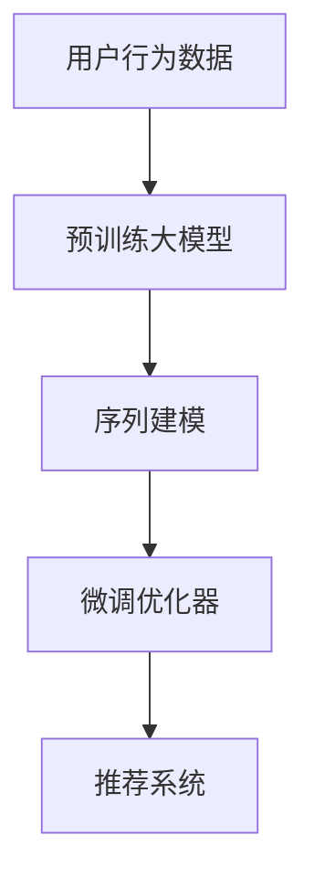

                 

## 1. 背景介绍

在如今信息爆炸的时代，推荐系统成为各大互联网平台的核心竞争力之一，通过个性化推荐服务满足用户的多样化需求。传统的推荐系统主要基于协同过滤、矩阵分解等方法，通过用户行为数据和物品属性数据训练推荐模型。然而，这些方法存在稀疏性、冷启动等问题，难以处理长尾需求和低质量数据。

近年来，随着深度学习和大规模预训练语言模型的发展，推荐系统也开始引入大模型进行推荐。通过利用大模型在预训练过程中学习到的通用知识，结合用户历史行为数据和物品属性信息，可以在有限的标注数据和稀疏数据下，提升推荐模型的效果。本文将对大模型在序列推荐中的应用进行系统性探讨，力求揭示其背后的原理和优化方法，帮助读者深入理解这一前沿技术。

## 2. 核心概念与联系

### 2.1 核心概念概述

在进行深入分析前，首先需要对一些核心概念进行定义和梳理：

- **大模型（Large Model）**：指具有亿级参数规模的深度学习模型，通过在大规模无标注数据上预训练，获得广泛的通用语言知识。如GPT、BERT、T5等。

- **推荐系统（Recommendation System）**：通过分析用户行为数据和物品属性信息，为用户推荐可能感兴趣的商品或内容。主要包括协同过滤、基于内容的推荐、混合推荐等。

- **序列推荐（Sequential Recommendation）**：指通过用户的浏览、点击、评分等行为序列，预测用户下一步可能感兴趣的商品或内容。主要应用于电商、音乐、视频等平台。

- **大模型微调（Fine-Tuning）**：在预训练模型的基础上，使用推荐系统任务的有标注数据，调整模型参数，使其适应特定推荐任务的优化方法。

- **序列建模（Sequential Modeling）**：通过时间序列分析技术，捕捉用户行为序列中的潜在模式和规律，为推荐模型提供输入特征。

- **神经网络序列建模（Neural Network Sequential Modeling）**：使用深度神经网络技术，构建序列推荐模型，将序列建模与大模型微调相结合。

### 2.2 核心概念原理和架构的 Mermaid 流程图



该图展示了从用户行为数据到推荐系统的全流程，各个环节的输入输出关系清晰。用户行为数据首先进入预训练大模型，提取行为序列的语义特征；然后通过序列建模技术，捕捉行为序列中的潜在模式；最后使用微调优化器调整模型参数，实现推荐模型的优化。

## 3. 核心算法原理 & 具体操作步骤

### 3.1 算法原理概述

大模型在序列推荐中的应用，主要是基于序列建模和大模型微调两个关键步骤：

1. **序列建模**：通过时间序列分析技术，将用户行为序列转换为向量表示，捕捉行为序列中的潜在规律和模式。
2. **大模型微调**：在序列建模的基础上，使用推荐系统任务的有标注数据，调整大模型的参数，使其适应推荐任务的优化。

形式化地，假设用户行为序列为 $X = (x_1, x_2, ..., x_t)$，其中 $x_t$ 为第 $t$ 个行为。设 $M_\theta$ 为预训练大模型，$\theta$ 为模型参数。推荐系统任务为 $T$，有标注数据集为 $D=\{(X_i, Y_i)\}_{i=1}^N$，其中 $X_i$ 为样本的行为序列，$Y_i$ 为推荐结果。

大模型的微调目标是最小化损失函数 $\mathcal{L}(\theta)$：

$$
\mathcal{L}(\theta) = \frac{1}{N} \sum_{i=1}^N \ell(M_{\theta}(X_i), Y_i)
$$

其中 $\ell$ 为推荐任务的损失函数，如均方误差损失、交叉熵损失等。

### 3.2 算法步骤详解

大模型在序列推荐中的应用步骤如下：

1. **数据预处理**：将用户行为序列转换为向量表示，使用序列建模技术，提取行为序列中的语义特征。

2. **模型初始化**：使用预训练大模型 $M_\theta$ 作为推荐模型的初始化参数。

3. **序列建模**：将用户行为序列输入序列建模模块，提取行为序列中的潜在规律和模式，生成序列表示向量 $S$。

4. **微调优化**：在序列建模的基础上，使用推荐系统任务的有标注数据 $D$，对大模型进行微调。

5. **评估与部署**：在微调后的大模型上，对推荐系统任务进行评估和部署，得到推荐结果。

### 3.3 算法优缺点

**优点**：

1. **效果好**：大模型通过预训练学到了广泛的通用语言知识，微调后能够更好地理解用户行为序列，提升推荐效果。
2. **适应性强**：大模型在各种推荐任务上都有良好的表现，可以适应不同推荐平台的需求。
3. **计算高效**：大模型参数量较大，但通过微调可以显著减少需优化的参数量，降低计算复杂度。
4. **可扩展性强**：大模型在预训练阶段已经具备较强的表达能力，可以通过微调适配不同的推荐任务。

**缺点**：

1. **过拟合风险**：大模型参数量庞大，容易出现过拟合现象。
2. **数据依赖强**：微调效果依赖于推荐系统任务的有标注数据，数据量不足可能影响性能。
3. **计算成本高**：大模型微调需要较高的计算资源，特别是GPU/TPU等高性能设备。
4. **解释性差**：大模型内部的决策逻辑难以解释，难以提供清晰的推荐依据。

### 3.4 算法应用领域

大模型在序列推荐中的应用已经广泛应用于电商、音乐、视频等多个领域，为推荐系统带来了显著的效果提升。具体而言：

1. **电商推荐**：通过分析用户的浏览、点击、购买等行为序列，预测用户可能感兴趣的商品，提升用户满意度。
2. **音乐推荐**：根据用户的听歌历史和行为序列，推荐新的音乐曲目，增加用户的粘性。
3. **视频推荐**：通过分析用户的观看历史和行为序列，推荐相关的视频内容，提高用户的观看时长和满意度。
4. **智能客服**：利用用户与客服的对话序列，推荐合适的客服应答，提升用户体验和满意度。

未来，随着大模型和序列建模技术的不断进步，推荐系统也将迎来更多新的应用场景，如个性化推荐、可控推荐、跨平台推荐等，为用户提供更加精准和高效的推荐服务。

## 4. 数学模型和公式 & 详细讲解

### 4.1 数学模型构建

在进行大模型在序列推荐的应用时，首先需要构建相应的数学模型。假设用户行为序列 $X$ 为长度为 $T$ 的向量，包含 $T$ 个行为 $x_t$。设预训练大模型 $M_\theta$ 的输出为 $h_t$，序列建模模块将 $X$ 映射为向量表示 $S$。

序列建模模块一般使用循环神经网络（RNN）或卷积神经网络（CNN）等序列建模技术，将用户行为序列 $X$ 转换为向量表示 $S$。例如，使用LSTM序列建模，序列建模的数学表达式为：

$$
S = \text{LSTM}(X)
$$

其中 $\text{LSTM}$ 表示LSTM序列建模模块。

### 4.2 公式推导过程

在得到序列表示向量 $S$ 后，可以将其输入微调的大模型 $M_\theta$ 进行微调，最小化推荐任务的损失函数 $\mathcal{L}$。假设推荐任务的输出为 $Y$，其预测值可以通过大模型输出 $h_t$ 和序列建模模块输出 $S$ 计算得到：

$$
Y = M_\theta(S)
$$

推荐任务的损失函数可以表示为：

$$
\mathcal{L}(\theta) = \frac{1}{N} \sum_{i=1}^N \ell(Y_i, Y)
$$

其中 $\ell$ 为推荐任务的损失函数，如均方误差损失、交叉熵损失等。

微调过程中，根据链式法则，损失函数对参数 $\theta$ 的梯度为：

$$
\frac{\partial \mathcal{L}}{\partial \theta} = \frac{\partial \mathcal{L}}{\partial Y} \frac{\partial Y}{\partial h_t} \frac{\partial h_t}{\partial S} \frac{\partial S}{\partial X}
$$

将 $Y$ 和 $h_t$ 的表达式代入，得到：

$$
\frac{\partial \mathcal{L}}{\partial \theta} = \frac{\partial \mathcal{L}}{\partial Y} M_\theta^\top \frac{\partial S}{\partial X}
$$

其中 $M_\theta^\top$ 表示大模型的梯度矩阵。

根据反向传播算法，可以得到模型参数的更新公式为：

$$
\theta \leftarrow \theta - \eta \nabla_{\theta} \mathcal{L}(\theta)
$$

其中 $\eta$ 为学习率。

### 4.3 案例分析与讲解

下面以电商推荐为例，说明大模型在序列推荐中的应用。

假设电商平台收集了用户的浏览、点击、购买行为序列 $X$，以及对应的商品ID $Y$。使用BERT模型作为预训练大模型，对用户行为序列 $X$ 进行序列建模，得到序列表示向量 $S$。然后，将 $S$ 输入BERT模型进行微调，最小化电商推荐任务的损失函数 $\mathcal{L}$。

微调后，BERT模型可以输出每个行为对应的商品ID $Y$，预测用户可能感兴趣的商品。具体实现步骤如下：

1. **数据预处理**：将用户行为序列 $X$ 转换为BERT模型接受的格式，并进行分词和编码。

2. **序列建模**：使用BERT模型的语言建模任务进行预训练，得到序列表示向量 $S$。

3. **微调优化**：在序列建模的基础上，使用电商推荐任务的有标注数据 $D$，对BERT模型进行微调。

4. **评估与部署**：在微调后的大模型上，对电商推荐任务进行评估和部署，得到推荐结果。

## 5. 项目实践：代码实例和详细解释说明

### 5.1 开发环境搭建

在进行大模型在序列推荐的应用时，需要搭建相应的开发环境。以下是一个基于PyTorch的推荐系统开发环境搭建步骤：

1. 安装Anaconda：从官网下载并安装Anaconda，用于创建独立的Python环境。

2. 创建并激活虚拟环境：
```bash
conda create -n pytorch-env python=3.8 
conda activate pytorch-env
```

3. 安装PyTorch：根据CUDA版本，从官网获取对应的安装命令。例如：
```bash
conda install pytorch torchvision torchaudio cudatoolkit=11.1 -c pytorch -c conda-forge
```

4. 安装Transformers库：
```bash
pip install transformers
```

5. 安装各类工具包：
```bash
pip install numpy pandas scikit-learn matplotlib tqdm jupyter notebook ipython
```

完成上述步骤后，即可在`pytorch-env`环境中开始推荐系统开发。

### 5.2 源代码详细实现

以下是一个使用PyTorch和Transformers库实现电商推荐系统的代码示例：

```python
import torch
import torch.nn as nn
import torch.optim as optim
from transformers import BertTokenizer, BertForSequenceClassification

class BertRecommender(nn.Module):
    def __init__(self, num_labels):
        super(BertRecommender, self).__init__()
        self.num_labels = num_labels
        self.bert = BertForSequenceClassification.from_pretrained('bert-base-uncased', num_labels=num_labels)
        self.dropout = nn.Dropout(0.5)
        
    def forward(self, input_ids, attention_mask, labels=None):
        outputs = self.bert(input_ids, attention_mask=attention_mask)
        sequence_output = outputs[0]
        sequence_output = self.dropout(sequence_output)
        logits = sequence_output
        return logits

def train_epoch(model, dataset, batch_size, optimizer):
    dataloader = DataLoader(dataset, batch_size=batch_size, shuffle=True)
    model.train()
    epoch_loss = 0
    for batch in dataloader:
        input_ids = batch['input_ids'].to(device)
        attention_mask = batch['attention_mask'].to(device)
        labels = batch['labels'].to(device)
        model.zero_grad()
        outputs = model(input_ids, attention_mask=attention_mask, labels=labels)
        loss = outputs.loss
        epoch_loss += loss.item()
        loss.backward()
        optimizer.step()
    return epoch_loss / len(dataloader)

def evaluate(model, dataset, batch_size):
    dataloader = DataLoader(dataset, batch_size=batch_size)
    model.eval()
    preds, labels = [], []
    with torch.no_grad():
        for batch in dataloader:
            input_ids = batch['input_ids'].to(device)
            attention_mask = batch['attention_mask'].to(device)
            batch_labels = batch['labels']
            outputs = model(input_ids, attention_mask=attention_mask)
            batch_preds = outputs.logits.argmax(dim=2).to('cpu').tolist()
            batch_labels = batch_labels.to('cpu').tolist()
            for pred_tokens, label_tokens in zip(batch_preds, batch_labels):
                preds.append(pred_tokens[:len(label_tokens)])
                labels.append(label_tokens)
    print(classification_report(labels, preds))

# 准备数据集
train_dataset = ...
dev_dataset = ...
test_dataset = ...

# 模型定义
model = BertRecommender(num_labels=num_classes)

# 优化器定义
optimizer = optim.Adam(model.parameters(), lr=2e-5)

# 训练过程
epochs = 5
batch_size = 16

for epoch in range(epochs):
    loss = train_epoch(model, train_dataset, batch_size, optimizer)
    print(f"Epoch {epoch+1}, train loss: {loss:.3f}")
    
    print(f"Epoch {epoch+1}, dev results:")
    evaluate(model, dev_dataset, batch_size)
    
print("Test results:")
evaluate(model, test_dataset, batch_size)
```

### 5.3 代码解读与分析

以下是关键代码的详细解读和分析：

**BertRecommender类**：

- `__init__`方法：初始化模型，包括BERT分类器、Dropout层等。
- `forward`方法：定义模型的前向传播过程，将输入数据经过BERT分类器，得到输出向量。

**train_epoch函数**：

- 使用DataLoader对数据集进行批次化加载，供模型训练和推理使用。
- 每个批次内，将输入数据输入模型，计算损失函数，反向传播更新模型参数，最后返回该epoch的平均损失。

**evaluate函数**：

- 在模型不更新参数的情况下，对验证集和测试集进行评估，计算分类指标。
- 将模型预测结果与真实标签进行对比，使用sklearn的classification_report打印输出。

**数据集定义**：

- 使用pytorch的Dataset类定义数据集，将输入数据转换为模型接受的格式。
- 使用DataLoader对数据集进行批次化加载，方便模型的训练和推理。

**训练流程**：

- 定义总的epoch数和batch size，开始循环迭代。
- 每个epoch内，先在训练集上训练，输出平均损失。
- 在验证集上评估，输出分类指标。
- 所有epoch结束后，在测试集上评估，给出最终测试结果。

可以看出，使用PyTorch和Transformers库，可以很方便地构建大模型在序列推荐中的应用。开发者可以将更多精力放在数据处理、模型改进等高层逻辑上，而不必过多关注底层的实现细节。

## 6. 实际应用场景

### 6.1 智能客服系统

智能客服系统是电商推荐系统的一种典型应用。通过分析用户与客服的对话序列，推荐合适的客服应答，提升用户体验和满意度。具体而言：

1. **数据收集**：收集用户与客服的对话记录，将其转换为机器可读的形式。
2. **预处理**：对对话记录进行分词、编码等预处理操作，生成用户意图表示。
3. **微调优化**：在预训练大模型的基础上，使用对话序列和应答数据进行微调，得到推荐模型。
4. **部署应用**：将微调后的模型部署到生产环境中，根据用户输入生成应答推荐。

### 6.2 个性化推荐系统

个性化推荐系统通过分析用户行为序列，为用户推荐可能感兴趣的商品或内容。使用大模型进行个性化推荐，可以更好地理解用户需求，提高推荐效果。具体而言：

1. **数据收集**：收集用户浏览、点击、评分等行为数据。
2. **预处理**：对行为数据进行分词、编码等预处理操作，生成用户行为序列。
3. **序列建模**：使用RNN或CNN等序列建模技术，将行为序列转换为向量表示。
4. **微调优化**：在序列建模的基础上，使用推荐系统任务的有标注数据进行微调，得到推荐模型。
5. **部署应用**：将微调后的模型部署到推荐系统中，根据用户行为生成个性化推荐。

### 6.3 未来应用展望

随着大模型和序列建模技术的不断进步，序列推荐系统将迎来更多新的应用场景，如可控推荐、跨平台推荐等，为用户提供更加精准和高效的推荐服务。

## 7. 工具和资源推荐

### 7.1 学习资源推荐

为了帮助开发者系统掌握大模型在序列推荐中的应用，这里推荐一些优质的学习资源：

1. 《深度学习与推荐系统》书籍：全面介绍了深度学习在推荐系统中的应用，涵盖多种推荐算法和实现细节。
2. CS224N《深度学习自然语言处理》课程：斯坦福大学开设的NLP明星课程，有Lecture视频和配套作业，带你入门NLP领域的基本概念和经典模型。
3. 《Neural Networks for Recommendation Systems》书籍：推荐系统领域的大作，系统性地介绍了深度学习在推荐系统中的应用。
4. 《Sequence Models》书籍：深度学习序列建模的入门教材，介绍了多种序列建模技术及其应用。
5. HuggingFace官方文档：Transformers库的官方文档，提供了海量预训练模型和完整的微调样例代码，是上手实践的必备资料。

通过对这些资源的学习实践，相信你一定能够快速掌握大模型在序列推荐中的应用，并用于解决实际的推荐问题。

### 7.2 开发工具推荐

高效的开发离不开优秀的工具支持。以下是几款用于大模型在序列推荐开发的工具：

1. PyTorch：基于Python的开源深度学习框架，灵活动态的计算图，适合快速迭代研究。大部分预训练语言模型都有PyTorch版本的实现。
2. TensorFlow：由Google主导开发的开源深度学习框架，生产部署方便，适合大规模工程应用。同样有丰富的预训练语言模型资源。
3. Transformers库：HuggingFace开发的NLP工具库，集成了众多SOTA语言模型，支持PyTorch和TensorFlow，是进行序列推荐任务开发的利器。
4. Weights & Biases：模型训练的实验跟踪工具，可以记录和可视化模型训练过程中的各项指标，方便对比和调优。与主流深度学习框架无缝集成。
5. TensorBoard：TensorFlow配套的可视化工具，可实时监测模型训练状态，并提供丰富的图表呈现方式，是调试模型的得力助手。
6. Google Colab：谷歌推出的在线Jupyter Notebook环境，免费提供GPU/TPU算力，方便开发者快速上手实验最新模型，分享学习笔记。

合理利用这些工具，可以显著提升序列推荐任务的开发效率，加快创新迭代的步伐。

### 7.3 相关论文推荐

大模型在序列推荐中的应用源于学界的持续研究。以下是几篇奠基性的相关论文，推荐阅读：

1. Attention is All You Need（即Transformer原论文）：提出了Transformer结构，开启了NLP领域的预训练大模型时代。
2. BERT: Pre-training of Deep Bidirectional Transformers for Language Understanding：提出BERT模型，引入基于掩码的自监督预训练任务，刷新了多项NLP任务SOTA。
3. Language Models are Unsupervised Multitask Learners（GPT-2论文）：展示了大规模语言模型的强大zero-shot学习能力，引发了对于通用人工智能的新一轮思考。
4. Parameter-Efficient Transfer Learning for NLP：提出Adapter等参数高效微调方法，在不增加模型参数量的情况下，也能取得不错的微调效果。
5. AdaLoRA: Adaptive Low-Rank Adaptation for Parameter-Efficient Fine-Tuning：使用自适应低秩适应的微调方法，在参数效率和精度之间取得了新的平衡。
6. Sparse Models for Sequence Modeling：提出稀疏化序列建模方法，减少了模型参数量，降低了计算复杂度。

这些论文代表了大模型在序列推荐中的应用和发展脉络。通过学习这些前沿成果，可以帮助研究者把握学科前进方向，激发更多的创新灵感。

## 8. 总结：未来发展趋势与挑战

### 8.1 总结

本文对大模型在序列推荐中的应用进行了系统性探讨，力求揭示其背后的原理和优化方法，帮助读者深入理解这一前沿技术。

通过本文的系统梳理，可以看到，大模型在序列推荐中的应用在电商、音乐、视频等多个领域取得了显著效果。得益于预训练模型在处理长序列、捕捉语义信息等方面的优势，序列推荐系统能够更好地理解用户需求，提供个性化的推荐服务。未来，随着大模型和序列建模技术的不断进步，推荐系统也将迎来更多新的应用场景，为推荐系统带来更大的发展潜力。

### 8.2 未来发展趋势

展望未来，大模型在序列推荐中的应用将呈现以下几个发展趋势：

1. **模型规模持续增大**：随着算力成本的下降和数据规模的扩张，预训练语言模型的参数量还将持续增长。超大规模语言模型蕴含的丰富语言知识，有望支撑更加复杂多变的推荐任务。
2. **序列建模技术不断进步**：序列建模技术的不断进步，如Transformer、BERT等大模型，将进一步提升推荐系统的效果。
3. **参数高效微调技术发展**：开发更加参数高效的微调方法，如Adapter、LoRA等，在减小参数量的情况下，仍能保持推荐精度。
4. **多模态推荐系统崛起**：将视觉、音频等多模态信息与文本信息进行整合，提升推荐系统的泛化能力和效果。
5. **推荐系统的实时性增强**：通过模型压缩和优化，提升推荐系统的计算速度，实现实时推荐。
6. **推荐系统的安全性增强**：引入伦理道德和隐私保护机制，确保推荐系统的公平性和安全性。

这些趋势凸显了大模型在序列推荐应用的广阔前景。这些方向的探索发展，必将进一步提升推荐系统的性能和应用范围，为推荐系统带来更多的创新和突破。

### 8.3 面临的挑战

尽管大模型在序列推荐中的应用已经取得了显著成效，但在迈向更加智能化、普适化应用的过程中，它仍面临着诸多挑战：

1. **计算资源成本高**：大模型参数量庞大，训练和微调需要高性能设备，计算成本较高。
2. **数据依赖强**：推荐系统任务的数据量不足或质量不高，会影响推荐效果。
3. **过拟合风险**：大模型容易在推荐任务上出现过拟合现象，影响模型的泛化能力。
4. **模型解释性差**：大模型的决策逻辑难以解释，难以提供清晰的推荐依据。
5. **伦理和隐私问题**：推荐系统中的用户隐私保护和公平性问题仍需进一步解决。

这些挑战需要未来在计算资源、数据质量、模型解释性等方面进行更深入的研究和优化，才能更好地发挥大模型在序列推荐中的优势。

### 8.4 研究展望

面对大模型在序列推荐中的应用所面临的挑战，未来的研究需要在以下几个方面寻求新的突破：

1. **无监督和半监督推荐方法**：摆脱对大规模标注数据的依赖，利用自监督学习、主动学习等无监督和半监督范式，最大限度利用非结构化数据。
2. **参数高效和计算高效的微调方法**：开发更加参数高效的微调方法，在固定大部分预训练参数的情况下，只更新极少量的任务相关参数。同时优化微调模型的计算图，减少前向传播和反向传播的资源消耗。
3. **多模态推荐系统**：将视觉、音频等多模态信息与文本信息进行整合，提升推荐系统的泛化能力和效果。
4. **推荐系统的实时性优化**：通过模型压缩和优化，提升推荐系统的计算速度，实现实时推荐。
5. **推荐系统的安全性增强**：引入伦理道德和隐私保护机制，确保推荐系统的公平性和安全性。

这些研究方向的探索，必将引领大模型在序列推荐应用迈向更高的台阶，为推荐系统带来更多的创新和突破。只有勇于创新、敢于突破，才能不断拓展大模型在序列推荐中的边界，让推荐系统更好地服务于人类社会。

## 9. 附录：常见问题与解答

**Q1：如何选择合适的学习率？**

A: 大模型的学习率一般要比预训练时小1-2个数量级，使用过大的学习率容易破坏预训练权重，导致过拟合。一般建议从1e-5开始调参，逐步减小学习率，直至收敛。也可以使用warmup策略，在开始阶段使用较小的学习率，再逐渐过渡到预设值。

**Q2：大模型在推荐系统中面临哪些挑战？**

A: 大模型在推荐系统中面临以下挑战：
1. 计算资源成本高：大模型参数量庞大，训练和微调需要高性能设备，计算成本较高。
2. 数据依赖强：推荐系统任务的数据量不足或质量不高，会影响推荐效果。
3. 过拟合风险：大模型容易在推荐任务上出现过拟合现象，影响模型的泛化能力。
4. 模型解释性差：大模型的决策逻辑难以解释，难以提供清晰的推荐依据。
5. 伦理和隐私问题：推荐系统中的用户隐私保护和公平性问题仍需进一步解决。

**Q3：如何缓解大模型在推荐系统中的过拟合问题？**

A: 过拟合是推荐系统中的主要问题之一。以下是一些缓解策略：
1. 数据增强：通过回译、近义替换等方式扩充训练集。
2. 正则化：使用L2正则、Dropout等防止模型过度适应小规模训练集。
3. 对抗训练：引入对抗样本，提高模型鲁棒性。
4. 参数高效微调：只调整少量参数，减小过拟合风险。

这些策略往往需要根据具体任务和数据特点进行灵活组合。只有在数据、模型、训练、推理等各环节进行全面优化，才能最大限度地发挥大模型在推荐系统中的应用效果。

**Q4：大模型在推荐系统中的性能如何衡量？**

A: 大模型在推荐系统中的性能通常通过以下指标进行衡量：
1. 准确率（Accuracy）：推荐系统推荐正确商品的比例。
2. 召回率（Recall）：推荐系统中，正确商品被推荐出的比例。
3. F1分数（F1 Score）：综合考虑准确率和召回率，综合评价推荐系统的效果。
4. 平均绝对误差（MAE）：预测结果与真实结果之间的平均误差。
5. 均方误差（MSE）：预测结果与真实结果之间的均方误差。

这些指标通常用于衡量推荐系统的效果，可以帮助开发者评估模型的性能并进行优化。

**Q5：大模型在推荐系统中的优化策略有哪些？**

A: 大模型在推荐系统中的优化策略主要包括以下几点：
1. 数据增强：通过回译、近义替换等方式扩充训练集。
2. 正则化：使用L2正则、Dropout等防止模型过度适应小规模训练集。
3. 对抗训练：引入对抗样本，提高模型鲁棒性。
4. 参数高效微调：只调整少量参数，减小过拟合风险。
5. 模型压缩：通过剪枝、量化等方法，减小模型大小，提升计算效率。
6. 多任务学习：同时训练多个推荐任务，提升模型泛化能力。

这些优化策略可以根据具体任务和数据特点进行灵活组合，帮助提升大模型在推荐系统中的应用效果。

---

作者：禅与计算机程序设计艺术 / Zen and the Art of Computer Programming

