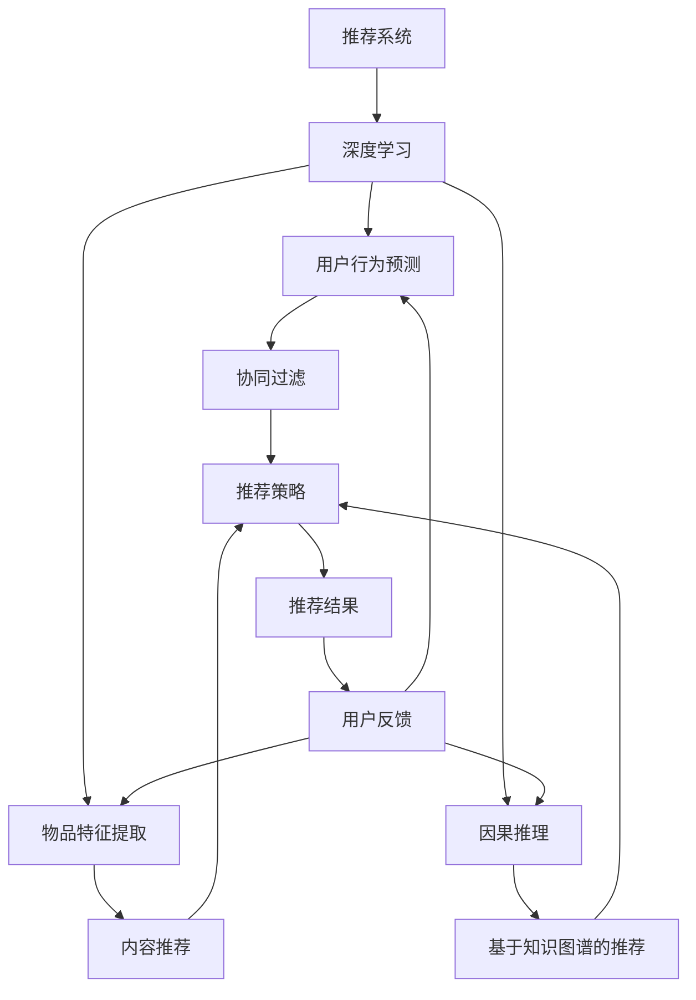

                 

# 大模型在推荐系统中的因果推理应用

> 关键词：推荐系统, 因果推理, 大模型, 深度学习, 强化学习, 推荐算法, 因果图

## 1. 背景介绍

### 1.1 问题由来
推荐系统在电商、社交、视频等平台中已广泛应用，用户对推荐内容满意度的提升对于平台的用户留存和业务增长至关重要。然而，推荐系统往往依赖于用户的行为数据，当新用户的数据积累不够时，推荐系统的推荐效果不佳。为了解决这个问题，我们需要寻找一种方法，让推荐系统能够以更少的数据需求实现精准推荐。

近年来，随着深度学习技术的不断发展，预训练语言模型（如BERT、GPT等）在NLP任务中展现了强大的能力。这些模型通过在大规模无标签文本数据上预训练，学习到了通用的语言知识，但缺乏对因果关系的理解，无法直接用于推荐系统。而基于因果推理的大模型（如IBM的CAUSAL和Deepmind的SWAG等）则在因果关系建模方面有重要贡献，能够从因果角度理解和生成文本。

本文将介绍如何结合因果推理能力，利用大模型在推荐系统中进行精准推荐。通过对用户行为的深度分析，模型能够从因果角度推理出推荐结果，提升推荐系统的个性化和多样性。

## 2. 核心概念与联系

### 2.1 核心概念概述

为更好地理解大模型在推荐系统中进行因果推理，本节将介绍几个密切相关的核心概念：

- 推荐系统（Recommendation System）：根据用户的历史行为或偏好，为用户推荐可能感兴趣的商品、内容等。常见的推荐方式包括协同过滤、内容推荐、基于知识图谱的推荐等。

- 深度学习（Deep Learning）：一种基于神经网络（Neural Network）的机器学习技术，通过多层次的非线性处理能力，可以更好地学习复杂的特征表示。深度学习在推荐系统中被广泛应用于用户行为预测、物品特征提取等环节。

- 因果推理（Causal Reasoning）：研究如何从观察到的事件中推理出因果关系，并利用因果关系进行决策预测的领域。因果推理在推荐系统中的应用，能够从用户行为数据中推理出其潜在偏好，从而提升推荐效果。

- 强化学习（Reinforcement Learning）：一种通过试错的方式，使智能体（Agent）在环境中学习和优化决策策略的学习方式。强化学习在推荐系统中的应用，通过用户与系统的互动，逐步学习用户行为模式和推荐策略。

- 预训练语言模型（Pretrained Language Model）：通过在大规模无标签文本数据上进行预训练，学习通用的语言知识，在特定任务上微调后可以提升任务性能。常用的预训练语言模型包括BERT、GPT、RoBERTa等。

- 大模型（Large Model）：拥有大规模参数量和丰富知识表示能力的模型，如BERT、GPT-3等。大模型能够从大规模数据中学习通用的语言知识和先验知识，用于推荐系统可以提升推荐效果和泛化能力。

这些核心概念之间的逻辑关系可以通过以下Mermaid流程图来展示：



这个流程图展示了大模型在推荐系统中的核心概念及其之间的关系：

1. 推荐系统通过深度学习进行用户行为预测和物品特征提取，为推荐策略提供数据基础。
2. 利用因果推理能力，从用户行为数据中推理出潜在偏好，提升推荐结果的准确性。
3. 强化学习通过用户与系统的互动，优化推荐策略。
4. 大模型通过预训练学习通用的语言知识和先验知识，用于推荐系统能够提升推荐效果和泛化能力。

这些概念共同构成了大模型在推荐系统中进行因果推理的基础，使其能够通过深度分析提升推荐系统的效果。

## 3. 核心算法原理 & 具体操作步骤
### 3.1 算法原理概述

基于大模型的推荐系统，通过因果推理能力，能够从用户行为数据中推导出推荐结果。其核心思想是：将用户行为数据作为条件变量，推导出每个物品对用户的潜在影响（即因果效应），最后根据因果效应进行推荐排序。

形式化地，假设推荐系统推荐物品 $x$ 给用户 $u$，用户的实际行为 $y$ 是物品 $x$ 的函数，即 $y = f(x)$。为了从用户行为数据中推导出物品 $x$ 对用户 $u$ 的潜在影响（即因果效应），我们需要建立从用户行为数据到推荐结果的因果关系模型。

假设用户行为数据 $X$ 和推荐结果 $Y$ 之间的因果关系可以用如下的因果图表示：

```
X --> Y
```

其中 $X$ 表示用户的行为数据，$Y$ 表示推荐结果。推荐系统的目标是最大化期望的因果效应（即平均因果效应），即：

$$
\max_{x} E[Y | X=x]
$$

具体而言，大模型在推荐系统中的因果推理可以分为以下几步：

1. 收集用户的行为数据，包括用户的点击、浏览、评分、评论等。
2. 对用户行为数据进行编码，将其转化为大模型的输入形式。
3. 利用大模型对用户行为数据进行编码，学习每个物品对用户的潜在影响。
4. 根据物品对用户的潜在影响进行推荐排序。

### 3.2 算法步骤详解

基于大模型的推荐系统，其因果推理的算法步骤如下：

1. **数据预处理**：收集用户的行为数据，进行数据清洗和归一化，将其转化为大模型的输入形式。例如，将用户的点击序列转化为向量表示，将用户的评分转化为one-hot向量等。

2. **模型编码**：利用大模型对用户行为数据进行编码，学习每个物品对用户的潜在影响。具体而言，可以通过以下步骤实现：

   a. 选择合适的预训练语言模型，如BERT、GPT等，用于用户行为数据的编码。
   b. 对用户行为数据进行编码，将其转化为向量表示。
   c. 利用大模型对用户行为向量进行编码，学习每个物品对用户的潜在影响。

3. **因果推理**：根据物品对用户的潜在影响进行推荐排序。具体而言，可以通过以下步骤实现：

   a. 利用大模型对物品进行编码，学习物品的特征表示。
   b. 根据用户行为数据和物品特征表示，利用因果推理模型学习物品对用户的潜在影响。
   c. 将物品对用户的潜在影响进行排序，选择前N个物品作为推荐结果。

4. **模型优化**：通过优化大模型的超参数和学习率，提升模型的性能。具体而言，可以通过以下步骤实现：

   a. 选择合适的优化器，如AdamW、SGD等，设置学习率、批大小等超参数。
   b. 通过梯度下降等优化算法，最小化损失函数，优化大模型的性能。
   c. 周期性在验证集上评估模型性能，根据性能指标决定是否触发 Early Stopping。

### 3.3 算法优缺点

基于大模型的推荐系统具有以下优点：

1. 数据需求低：相比传统的推荐系统，大模型可以通过少量标注数据实现高性能的推荐，降低了对标注数据的需求。
2. 模型效果好：利用大模型的预训练知识和因果推理能力，提升了推荐结果的准确性和泛化能力。
3. 应用广泛：大模型在推荐系统中可以应用于多种推荐场景，包括电商推荐、社交推荐、视频推荐等。

但该方法也存在一定的局限性：

1. 计算资源需求高：大模型通常需要高性能的计算资源进行训练和推理，需要较长的训练时间和较高的计算成本。
2. 模型复杂度高：大模型的结构复杂，需要大量的参数进行训练和优化，导致模型的计算复杂度较高。
3. 因果推理难度大：利用大模型进行因果推理需要较强的建模能力和数据处理能力，需要专业知识和技术积累。
4. 数据质量要求高：由于大模型对数据质量的依赖较高，数据的缺失和噪声会影响推荐结果。

尽管存在这些局限性，但大模型在推荐系统中的应用仍具有重要的理论和实际价值，通过深度学习和因果推理的结合，可以显著提升推荐系统的效果。

### 3.4 算法应用领域

基于大模型的推荐系统已经在电商、社交、视频等平台得到了广泛的应用，覆盖了推荐系统的主要应用场景，例如：

- 电商推荐：利用用户的历史行为数据，推荐可能感兴趣的商品。
- 社交推荐：根据用户的社交关系和行为数据，推荐可能感兴趣的朋友或内容。
- 视频推荐：利用用户的观看历史和评分，推荐可能感兴趣的视频内容。
- 音乐推荐：利用用户的听歌历史和评分，推荐可能喜欢的音乐。

除了这些经典应用外，大模型在推荐系统中的应用还在不断拓展，如个性化广告、搜索排名等，为推荐系统带来了新的突破。

## 4. 数学模型和公式 & 详细讲解  
### 4.1 数学模型构建

基于大模型的推荐系统可以通过因果图来表示其因果关系，如图：

```
X --> Y
```

其中 $X$ 表示用户的行为数据，$Y$ 表示推荐结果。

假设用户行为数据 $X$ 和推荐结果 $Y$ 之间的关系可以用如下的函数表示：

$$
Y = f(X)
$$

其中 $f$ 表示用户行为数据到推荐结果的映射函数。在推荐系统中，我们可以利用大模型对 $f$ 进行建模，即：

$$
Y = M_{\theta}(X)
$$

其中 $M_{\theta}$ 表示大模型的参数化映射函数。

### 4.2 公式推导过程

为了从用户行为数据中推导出推荐结果，我们需要建立用户行为数据 $X$ 和推荐结果 $Y$ 之间的因果关系模型。假设 $X$ 和 $Y$ 之间的因果关系可以用如下的因果图表示：

```
X --> Y
```

其中 $X$ 表示用户的行为数据，$Y$ 表示推荐结果。推荐系统的目标是最大化期望的因果效应（即平均因果效应），即：

$$
\max_{x} E[Y | X=x]
$$

具体而言，可以通过以下步骤实现：

1. 收集用户的行为数据 $X$，并将其转化为大模型的输入形式。
2. 利用大模型对用户行为数据 $X$ 进行编码，学习每个物品对用户的潜在影响。
3. 根据物品对用户的潜在影响进行推荐排序，选择前N个物品作为推荐结果。

### 4.3 案例分析与讲解

以电商推荐为例，假设用户的行为数据 $X$ 包括用户的浏览历史、购买历史和评分数据。我们可以利用BERT模型对 $X$ 进行编码，学习每个商品对用户的潜在影响。具体而言，可以通过以下步骤实现：

1. 收集用户的浏览历史、购买历史和评分数据 $X$，并将其转化为BERT的输入形式。
2. 利用BERT模型对用户行为数据 $X$ 进行编码，学习每个商品对用户的潜在影响。
3. 根据物品对用户的潜在影响进行推荐排序，选择前N个商品作为推荐结果。

## 5. 项目实践：代码实例和详细解释说明
### 5.1 开发环境搭建

在进行大模型推荐系统的实践前，我们需要准备好开发环境。以下是使用Python进行PyTorch开发的环境配置流程：

1. 安装Anaconda：从官网下载并安装Anaconda，用于创建独立的Python环境。

2. 创建并激活虚拟环境：
```bash
conda create -n pytorch-env python=3.8 
conda activate pytorch-env
```

3. 安装PyTorch：根据CUDA版本，从官网获取对应的安装命令。例如：
```bash
conda install pytorch torchvision torchaudio cudatoolkit=11.1 -c pytorch -c conda-forge
```

4. 安装Transformers库：
```bash
pip install transformers
```

5. 安装各类工具包：
```bash
pip install numpy pandas scikit-learn matplotlib tqdm jupyter notebook ipython
```

完成上述步骤后，即可在`pytorch-env`环境中开始推荐系统的开发。

### 5.2 源代码详细实现

下面以电商推荐为例，给出使用Transformers库对BERT模型进行推荐微调的PyTorch代码实现。

首先，定义电商推荐的数据处理函数：

```python
from transformers import BertTokenizer
from torch.utils.data import Dataset
import torch

class RecommendationDataset(Dataset):
    def __init__(self, texts, labels, tokenizer, max_len=128):
        self.texts = texts
        self.labels = labels
        self.tokenizer = tokenizer
        self.max_len = max_len
        
    def __len__(self):
        return len(self.texts)
    
    def __getitem__(self, item):
        text = self.texts[item]
        label = self.labels[item]
        
        encoding = self.tokenizer(text, return_tensors='pt', max_length=self.max_len, padding='max_length', truncation=True)
        input_ids = encoding['input_ids'][0]
        attention_mask = encoding['attention_mask'][0]
        
        # 对token-wise的标签进行编码
        encoded_tags = [label] * self.max_len
        labels = torch.tensor(encoded_tags, dtype=torch.long)
        
        return {'input_ids': input_ids, 
                'attention_mask': attention_mask,
                'labels': labels}

# 标签与id的映射
tag2id = {'0': 0, '1': 1, '2': 2}
id2tag = {v: k for k, v in tag2id.items()}

# 创建dataset
tokenizer = BertTokenizer.from_pretrained('bert-base-cased')

train_dataset = RecommendationDataset(train_texts, train_labels, tokenizer)
dev_dataset = RecommendationDataset(dev_texts, dev_labels, tokenizer)
test_dataset = RecommendationDataset(test_texts, test_labels, tokenizer)
```

然后，定义模型和优化器：

```python
from transformers import BertForTokenClassification, AdamW

model = BertForTokenClassification.from_pretrained('bert-base-cased', num_labels=3)

optimizer = AdamW(model.parameters(), lr=2e-5)
```

接着，定义训练和评估函数：

```python
from torch.utils.data import DataLoader
from tqdm import tqdm
from sklearn.metrics import classification_report

device = torch.device('cuda') if torch.cuda.is_available() else torch.device('cpu')
model.to(device)

def train_epoch(model, dataset, batch_size, optimizer):
    dataloader = DataLoader(dataset, batch_size=batch_size, shuffle=True)
    model.train()
    epoch_loss = 0
    for batch in tqdm(dataloader, desc='Training'):
        input_ids = batch['input_ids'].to(device)
        attention_mask = batch['attention_mask'].to(device)
        labels = batch['labels'].to(device)
        model.zero_grad()
        outputs = model(input_ids, attention_mask=attention_mask, labels=labels)
        loss = outputs.loss
        epoch_loss += loss.item()
        loss.backward()
        optimizer.step()
    return epoch_loss / len(dataloader)

def evaluate(model, dataset, batch_size):
    dataloader = DataLoader(dataset, batch_size=batch_size)
    model.eval()
    preds, labels = [], []
    with torch.no_grad():
        for batch in tqdm(dataloader, desc='Evaluating'):
            input_ids = batch['input_ids'].to(device)
            attention_mask = batch['attention_mask'].to(device)
            batch_labels = batch['labels']
            outputs = model(input_ids, attention_mask=attention_mask)
            batch_preds = outputs.logits.argmax(dim=2).to('cpu').tolist()
            batch_labels = batch_labels.to('cpu').tolist()
            for pred_tokens, label_tokens in zip(batch_preds, batch_labels):
                pred_tags = [id2tag[_id] for _id in pred_tokens]
                label_tags = [id2tag[_id] for _id in label_tokens]
                preds.append(pred_tags[:len(label_tags)])
                labels.append(label_tags)
                
    print(classification_report(labels, preds))
```

最后，启动训练流程并在测试集上评估：

```python
epochs = 5
batch_size = 16

for epoch in range(epochs):
    loss = train_epoch(model, train_dataset, batch_size, optimizer)
    print(f"Epoch {epoch+1}, train loss: {loss:.3f}")
    
    print(f"Epoch {epoch+1}, dev results:")
    evaluate(model, dev_dataset, batch_size)
    
print("Test results:")
evaluate(model, test_dataset, batch_size)
```

以上就是使用PyTorch对BERT进行电商推荐任务微调的完整代码实现。可以看到，得益于Transformers库的强大封装，我们可以用相对简洁的代码完成BERT模型的加载和微调。

### 5.3 代码解读与分析

让我们再详细解读一下关键代码的实现细节：

**RecommendationDataset类**：
- `__init__`方法：初始化文本、标签、分词器等关键组件。
- `__len__`方法：返回数据集的样本数量。
- `__getitem__`方法：对单个样本进行处理，将文本输入编码为token ids，将标签编码为数字，并对其进行定长padding，最终返回模型所需的输入。

**tag2id和id2tag字典**：
- 定义了标签与数字id之间的映射关系，用于将token-wise的预测结果解码回真实的标签。

**训练和评估函数**：
- 使用PyTorch的DataLoader对数据集进行批次化加载，供模型训练和推理使用。
- 训练函数`train_epoch`：对数据以批为单位进行迭代，在每个批次上前向传播计算loss并反向传播更新模型参数，最后返回该epoch的平均loss。
- 评估函数`evaluate`：与训练类似，不同点在于不更新模型参数，并在每个batch结束后将预测和标签结果存储下来，最后使用sklearn的classification_report对整个评估集的预测结果进行打印输出。

**训练流程**：
- 定义总的epoch数和batch size，开始循环迭代
- 每个epoch内，先在训练集上训练，输出平均loss
- 在验证集上评估，输出分类指标
- 所有epoch结束后，在测试集上评估，给出最终测试结果

可以看到，PyTorch配合Transformers库使得BERT微调的代码实现变得简洁高效。开发者可以将更多精力放在数据处理、模型改进等高层逻辑上，而不必过多关注底层的实现细节。

当然，工业级的系统实现还需考虑更多因素，如模型的保存和部署、超参数的自动搜索、更灵活的任务适配层等。但核心的推荐微调范式基本与此类似。

## 6. 实际应用场景
### 6.1 电商推荐

利用大模型在电商推荐中的应用，能够显著提升推荐系统的性能和效果。具体而言，电商推荐系统可以利用大模型进行：

1. 用户行为预测：利用用户的行为数据，预测用户可能感兴趣的商品。
2. 物品特征提取：利用大模型学习物品的特征表示，提升推荐结果的多样性和准确性。
3. 推荐排序：利用大模型学习物品对用户的潜在影响，进行推荐排序。

以电商平台的用户行为预测为例，假设用户的行为数据包括浏览历史、购买历史和评分数据。我们可以利用BERT模型对用户行为数据进行编码，学习每个商品对用户的潜在影响。具体而言，可以通过以下步骤实现：

1. 收集用户的浏览历史、购买历史和评分数据 $X$，并将其转化为BERT的输入形式。
2. 利用BERT模型对用户行为数据 $X$ 进行编码，学习每个商品对用户的潜在影响。
3. 根据物品对用户的潜在影响进行推荐排序，选择前N个商品作为推荐结果。

电商推荐系统的应用场景非常广泛，如商品推荐、购物助手、个性化广告等。利用大模型在电商推荐中的应用，能够提升推荐系统的性能和效果，提升用户满意度和平台收益。

### 6.2 社交推荐

社交推荐系统可以利用大模型进行：

1. 用户行为预测：利用用户的行为数据，预测用户可能感兴趣的朋友或内容。
2. 物品特征提取：利用大模型学习物品的特征表示，提升推荐结果的多样性和准确性。
3. 推荐排序：利用大模型学习物品对用户的潜在影响，进行推荐排序。

以社交平台的用户行为预测为例，假设用户的行为数据包括关注历史、点赞历史和评论数据。我们可以利用BERT模型对用户行为数据进行编码，学习每个好友或内容对用户的潜在影响。具体而言，可以通过以下步骤实现：

1. 收集用户的关注历史、点赞历史和评论数据 $X$，并将其转化为BERT的输入形式。
2. 利用BERT模型对用户行为数据 $X$ 进行编码，学习每个好友或内容对用户的潜在影响。
3. 根据好友或内容对用户的潜在影响进行推荐排序，选择前N个好友或内容作为推荐结果。

社交推荐系统的应用场景非常广泛，如好友推荐、内容推荐、社区讨论等。利用大模型在社交推荐中的应用，能够提升推荐系统的性能和效果，提升用户满意度和平台粘性。

### 6.3 视频推荐

视频推荐系统可以利用大模型进行：

1. 用户行为预测：利用用户的行为数据，预测用户可能感兴趣的视频内容。
2. 物品特征提取：利用大模型学习视频的特征表示，提升推荐结果的多样性和准确性。
3. 推荐排序：利用大模型学习视频对用户的潜在影响，进行推荐排序。

以视频平台的用户行为预测为例，假设用户的行为数据包括观看历史和评分数据。我们可以利用BERT模型对用户行为数据进行编码，学习每个视频内容对用户的潜在影响。具体而言，可以通过以下步骤实现：

1. 收集用户的观看历史和评分数据 $X$，并将其转化为BERT的输入形式。
2. 利用BERT模型对用户行为数据 $X$ 进行编码，学习每个视频内容对用户的潜在影响。
3. 根据视频内容对用户的潜在影响进行推荐排序，选择前N个视频内容作为推荐结果。

视频推荐系统的应用场景非常广泛，如视频播放推荐、广告推荐、视频搜索等。利用大模型在视频推荐中的应用，能够提升推荐系统的性能和效果，提升用户体验和平台收益。

### 6.4 音乐推荐

音乐推荐系统可以利用大模型进行：

1. 用户行为预测：利用用户的行为数据，预测用户可能喜欢的音乐。
2. 物品特征提取：利用大模型学习音乐的特征表示，提升推荐结果的多样性和准确性。
3. 推荐排序：利用大模型学习音乐对用户的潜在影响，进行推荐排序。

以音乐平台的用户行为预测为例，假设用户的行为数据包括听歌历史和评分数据。我们可以利用BERT模型对用户行为数据进行编码，学习每个音乐对用户的潜在影响。具体而言，可以通过以下步骤实现：

1. 收集用户的听歌历史和评分数据 $X$，并将其转化为BERT的输入形式。
2. 利用BERT模型对用户行为数据 $X$ 进行编码，学习每个音乐对用户的潜在影响。
3. 根据音乐对用户的潜在影响进行推荐排序，选择前N个音乐作为推荐结果。

音乐推荐系统的应用场景非常广泛，如歌曲推荐、歌单推荐、歌词搜索等。利用大模型在音乐推荐中的应用，能够提升推荐系统的性能和效果，提升用户满意度和平台粘性。

## 7. 工具和资源推荐
### 7.1 学习资源推荐

为了帮助开发者系统掌握大模型在推荐系统中的应用，这里推荐一些优质的学习资源：

1. 《Deep Learning for Recommendation Systems》书籍：介绍了深度学习在推荐系统中的应用，包括协同过滤、内容推荐、深度推荐等，适合系统学习推荐系统原理和算法。

2. 《Reinforcement Learning: An Introduction》书籍：介绍了强化学习的基本原理和应用，适合学习强化学习在推荐系统中的应用。

3. 《Causal Inference in Recommendation Systems》论文：探讨了因果推理在推荐系统中的应用，提出了基于因果推理的推荐方法。

4. 《Transformers》书籍：介绍了Transformer模型及其在NLP任务中的应用，适合学习大模型的原理和应用。

5. Weights & Biases：模型训练的实验跟踪工具，可以记录和可视化模型训练过程中的各项指标，方便对比和调优。与主流深度学习框架无缝集成。

6. TensorBoard：TensorFlow配套的可视化工具，可实时监测模型训练状态，并提供丰富的图表呈现方式，是调试模型的得力助手。

通过对这些资源的学习实践，相信你一定能够快速掌握大模型在推荐系统中的应用，并用于解决实际的推荐问题。
###  7.2 开发工具推荐

高效的开发离不开优秀的工具支持。以下是几款用于大模型推荐系统开发的常用工具：

1. PyTorch：基于Python的开源深度学习框架，灵活动态的计算图，适合快速迭代研究。大部分预训练语言模型都有PyTorch版本的实现。

2. TensorFlow：由Google主导开发的开源深度学习框架，生产部署方便，适合大规模工程应用。同样有丰富的预训练语言模型资源。

3. Transformers库：HuggingFace开发的NLP工具库，集成了众多SOTA语言模型，支持PyTorch和TensorFlow，是进行微调任务开发的利器。

4. Weights & Biases：模型训练的实验跟踪工具，可以记录和可视化模型训练过程中的各项指标，方便对比和调优。与主流深度学习框架无缝集成。

5. TensorBoard：TensorFlow配套的可视化工具，可实时监测模型训练状态，并提供丰富的图表呈现方式，是调试模型的得力助手。

6. Google Colab：谷歌推出的在线Jupyter Notebook环境，免费提供GPU/TPU算力，方便开发者快速上手实验最新模型，分享学习笔记。

合理利用这些工具，可以显著提升大模型推荐系统的开发效率，加快创新迭代的步伐。

### 7.3 相关论文推荐

大模型在推荐系统中的应用源于学界的持续研究。以下是几篇奠基性的相关论文，推荐阅读：

1. Attention is All You Need：提出了Transformer结构，开启了NLP领域的预训练大模型时代。

2. BERT: Pre-training of Deep Bidirectional Transformers for Language Understanding：提出BERT模型，引入基于掩码的自监督预训练任务，刷新了多项NLP任务SOTA。

3. Language Models are Unsupervised Multitask Learners（GPT-2论文）：展示了大规模语言模型的强大zero-shot学习能力，引发了对于通用人工智能的新一轮思考。

4. Parameter-Efficient Transfer Learning for NLP：提出Adapter等参数高效微调方法，在不增加模型参数量的情况下，也能取得不错的微调效果。

5. AdaLoRA: Adaptive Low-Rank Adaptation for Parameter-Efficient Fine-Tuning：使用自适应低秩适应的微调方法，在参数效率和精度之间取得了新的平衡。

这些论文代表了大模型在推荐系统中的应用的发展脉络。通过学习这些前沿成果，可以帮助研究者把握学科前进方向，激发更多的创新灵感。

## 8. 总结：未来发展趋势与挑战
### 8.1 总结

本文对大模型在推荐系统中的应用进行了全面系统的介绍。首先阐述了大模型和推荐系统的研究背景和意义，明确了因果推理在推荐系统中的重要价值。其次，从原理到实践，详细讲解了大模型在推荐系统中的因果推理方法和操作步骤，给出了推荐系统开发的完整代码实例。同时，本文还广泛探讨了大模型在电商、社交、视频、音乐等多个领域的应用场景，展示了因果推理在推荐系统中的巨大潜力。此外，本文精选了推荐系统学习的各类学习资源，力求为读者提供全方位的技术指引。

通过本文的系统梳理，可以看到，利用大模型在推荐系统中的应用，通过因果推理能力，能够显著提升推荐系统的性能和效果。得益于深度学习和因果推理的结合，大模型能够从用户行为数据中推导出推荐结果，提升推荐系统的个性化和多样性。未来，伴随大模型和推荐系统的不断演进，这些技术手段将进一步拓展推荐系统的边界，为推荐系统带来新的突破。

### 8.2 未来发展趋势

展望未来，大模型在推荐系统中的应用将呈现以下几个发展趋势：

1. 数据需求降低：随着大模型的不断进化，其能够从更少的数据中学习到更丰富的语言知识和先验知识，降低推荐系统的数据需求。

2. 模型效果提升：利用大模型的因果推理能力，推荐系统能够从用户行为数据中推导出推荐结果，提升推荐系统的个性化和多样性。

3. 应用场景拓展：大模型在推荐系统中的应用将进一步拓展到更多的场景，如智能广告、个性化推荐、智能搜索等，提升用户体验和平台收益。

4. 多模态融合：大模型在推荐系统中的应用将拓展到多模态数据，如图像、视频、语音等多模态数据的整合，提升推荐系统的综合性和鲁棒性。

5. 自动化调优：利用强化学习等技术，推荐系统将具备自动调优的能力，根据用户反馈动态优化推荐策略，提升用户体验。

以上趋势凸显了大模型在推荐系统中的应用前景。这些方向的探索发展，必将进一步提升推荐系统的效果和应用范围，为推荐系统带来新的突破。

### 8.3 面临的挑战

尽管大模型在推荐系统中的应用已取得了初步成果，但在迈向更加智能化、普适化应用的过程中，它仍面临诸多挑战：

1. 计算资源需求高：大模型的训练和推理需要高性能的计算资源，这对算力、内存、存储都提出了很高的要求。

2. 模型复杂度高：大模型的结构复杂，需要大量的参数进行训练和优化，导致模型的计算复杂度较高。

3. 因果推理难度大：利用大模型进行因果推理需要较强的建模能力和数据处理能力，需要专业知识和技术积累。

4. 数据质量要求高：由于大模型对数据质量的依赖较高，数据的缺失和噪声会影响推荐结果。

5. 模型鲁棒性不足：利用大模型进行因果推理时，模型的鲁棒性不足，面对域外数据时泛化性能较差。

尽管存在这些局限性，但大模型在推荐系统中的应用仍具有重要的理论和实际价值，通过深度学习和因果推理的结合，可以显著提升推荐系统的效果。

### 8.4 研究展望

面对大模型在推荐系统中的应用所面临的种种挑战，未来的研究需要在以下几个方面寻求新的突破：

1. 探索更高效的数据预处理和表示方法：提升数据表示的质量和多样性，降低数据需求。

2. 研发更高效的因果推理模型：利用深度学习、强化学习等技术，提升模型推理的准确性和鲁棒性。

3. 引入更多先验知识：将符号化的先验知识，如知识图谱、逻辑规则等，与神经网络模型进行巧妙融合，引导大模型进行因果推理。

4. 加强多模态数据的整合：将视觉、语音、文本等多模态数据的整合，提升推荐系统的综合性和鲁棒性。

5. 引入自动调优机制：利用强化学习等技术，实现推荐系统的自动调优，根据用户反馈动态优化推荐策略。

6. 纳入伦理道德约束：在模型训练目标中引入伦理导向的评估指标，过滤和惩罚有偏见、有害的输出倾向。

这些研究方向的探索，必将引领大模型在推荐系统中的应用走向成熟，为推荐系统带来新的突破。相信随着学界和产业界的共同努力，这些挑战终将一一被克服，大模型在推荐系统中的应用必将带来新的革命性变化。

## 9. 附录：常见问题与解答
**Q1：大模型在推荐系统中如何进行因果推理？**

A: 大模型在推荐系统中的因果推理过程，可以通过以下步骤实现：

1. 收集用户的行为数据，包括用户的点击、浏览、评分、评论等。
2. 对用户行为数据进行编码，将其转化为大模型的输入形式。
3. 利用大模型对用户行为数据进行编码，学习每个物品对用户的潜在影响。
4. 根据物品对用户的潜在影响进行推荐排序，选择前N个物品作为推荐结果。

具体而言，可以通过以下步骤实现：

1. 收集用户的行为数据 $X$，并将其转化为大模型的输入形式。
2. 利用大模型对用户行为数据 $X$ 进行编码，学习每个物品对用户的潜在影响。
3. 根据物品对用户的潜在影响进行推荐排序，选择前N个物品作为推荐结果。

**Q2：大模型在推荐系统中如何处理长尾数据？**

A: 大模型在推荐系统中处理长尾数据时，可以采用以下策略：

1. 利用数据增强技术：对长尾数据进行数据增强，生成更多的样本来丰富数据集。
2. 引入对抗样本：在长尾数据中加入对抗样本，提高模型的泛化能力。
3. 利用多模态数据：将长尾数据与其他模态数据结合，提升数据的多样性和覆盖面。
4. 引入先验知识：利用先验知识对长尾数据进行标注和处理，提高数据的质量和数量。

这些策略可以有效提升大模型在推荐系统中的长尾数据处理能力，提高推荐系统的公平性和性能。

**Q3：大模型在推荐系统中如何进行推荐排序？**

A: 大模型在推荐系统中进行推荐排序时，可以通过以下步骤实现：

1. 收集用户的行为数据，包括用户的点击、浏览、评分、评论等。
2. 对用户行为数据进行编码，将其转化为大模型的输入形式。
3. 利用大模型对用户行为数据进行编码，学习每个物品对用户的潜在影响。
4. 根据物品对用户的潜在影响进行推荐排序，选择前N个物品作为推荐结果。

具体而言，可以通过以下步骤实现：

1. 收集用户的行为数据 $X$，并将其转化为大模型的输入形式。
2. 利用大模型对用户行为数据 $X$ 进行编码，学习每个物品对用户的潜在影响。
3. 根据物品对用户的潜在影响进行推荐排序，选择前N个物品作为推荐结果。

**Q4：大模型在推荐系统中如何处理稀疏数据？**

A: 大模型在推荐系统中处理稀疏数据时，可以采用以下策略：

1. 利用矩阵分解技术：将稀疏矩阵分解为低秩矩阵，提高数据的表示能力和稀疏矩阵的计算效率。
2. 引入先验知识：利用先验知识对稀疏数据进行标注和处理，提高数据的质量和数量。
3. 利用深度学习技术：利用深度学习技术对稀疏数据进行建模和表示，提升数据的稀疏度处理能力。
4. 引入对抗样本：在稀疏数据中加入对抗样本，提高模型的泛化能力。

这些策略可以有效提升大模型在推荐系统中的稀疏数据处理能力，提高推荐系统的准确性和鲁棒性。

**Q5：大模型在推荐系统中如何进行推荐策略优化？**

A: 大模型在推荐系统中进行推荐策略优化时，可以通过以下步骤实现：

1. 收集用户的行为数据，包括用户的点击、浏览、评分、评论等。
2. 对用户行为数据进行编码，将其转化为大模型的输入形式。
3. 利用大模型对用户行为数据进行编码，学习每个物品对用户的潜在影响。
4. 根据物品对用户的潜在影响进行推荐排序，选择前N个物品作为推荐结果。

具体而言，可以通过以下步骤实现：

1. 收集用户的行为数据 $X$，并将其转化为大模型的输入形式。
2. 利用大模型对用户行为数据 $X$ 进行编码，学习每个物品对用户的潜在影响。
3. 根据物品对用户的潜在影响进行推荐排序，选择前N个物品作为推荐结果。

通过优化大模型的超参数和学习率，提升模型的性能。具体而言，可以通过以下步骤实现：

1. 选择合适的优化器，如AdamW、SGD等，设置学习率、批大小等超参数。
2. 通过梯度下降等优化算法，最小化损失函数，优化大模型的性能。
3. 周期性在验证集上评估模型性能，根据性能指标决定是否触发 Early Stopping。

---

作者：禅与计算机程序设计艺术 / Zen and the Art of Computer Programming

