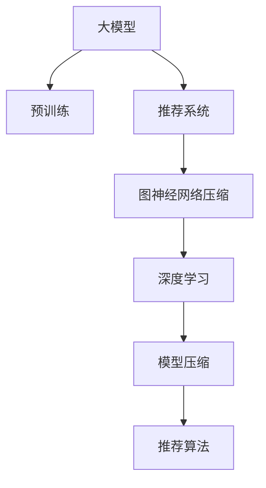

                 

# 大模型在推荐系统中的图神经网络压缩应用

> 关键词：大模型, 推荐系统, 图神经网络, 压缩应用, 深度学习, 推荐算法, 图卷积网络, 图注意力网络

## 1. 背景介绍

### 1.1 问题由来
在当前的信息爆炸时代，用户面临着海量的信息选择，推荐系统成为了帮助用户快速获取所需信息的重要工具。传统的推荐系统主要基于协同过滤、矩阵分解等方法，但在数据稀疏、特征维度高的情况下，性能往往难以满足实际需求。深度学习技术的发展为推荐系统带来了新的突破，通过将大规模预训练模型引入推荐系统，可以显著提升推荐效果。

然而，预训练模型往往具有庞大的参数量，在实际应用中面临着计算资源和存储资源的巨大挑战。特别是当推荐系统需要覆盖多个不同的业务场景，如电商、新闻、音乐等，预训练模型更是难以兼顾性能和效率。为此，提出了一种基于大模型和图神经网络的压缩方法，通过降低模型复杂度，实现高效的推荐系统构建。

### 1.2 问题核心关键点
本文聚焦于大模型在推荐系统中的应用，特别是如何通过图神经网络压缩技术，降低模型复杂度，同时保持高效推荐的能力。

核心问题包括：
1. 如何在大模型与推荐系统之间建立有效的连接？
2. 如何通过图神经网络压缩技术，实现模型参数的减少？
3. 如何保持压缩后的模型在推荐系统中的高性能？

这些关键问题构成了本文的研究方向，并将在后续章节中详细阐述。

## 2. 核心概念与联系

### 2.1 核心概念概述

为更好地理解本文的研究内容，本节将介绍几个密切相关的核心概念：

- **大模型(Large Model)**：指在大型数据集上经过预训练的深度学习模型，如BERT、GPT等。这些模型具有强大的表征能力，可以在多种任务中实现优异性能。

- **推荐系统(Recommendation System)**：指通过算法推荐给用户感兴趣的产品、文章、视频等内容，以提升用户体验的智能系统。常见的推荐算法包括协同过滤、基于内容的推荐、矩阵分解等。

- **图神经网络(Graph Neural Network, GNN)**：指利用图结构对数据进行建模的深度学习模型，主要用于处理具有复杂关系的数据，如图、社交网络、知识图谱等。

- **模型压缩(Model Compression)**：指通过降低模型参数量、优化模型结构等方法，提升模型推理速度和计算效率的技术。常见的模型压缩方法包括参数剪枝、量化、知识蒸馏等。

这些核心概念之间的逻辑关系可以通过以下Mermaid流程图来展示：



这个流程图展示了大模型、推荐系统、图神经网络压缩、深度学习、模型压缩和推荐算法之间的联系：

1. 大模型通过预训练获得基础能力。
2. 推荐系统将大模型嵌入其中，提升推荐效果。
3. 图神经网络压缩技术用于降低大模型参数量。
4. 深度学习技术应用于推荐系统的各个环节。
5. 模型压缩技术提升推荐系统的计算效率。
6. 推荐算法最终实现个性化推荐。

## 3. 核心算法原理 & 具体操作步骤

### 3.1 算法原理概述

本文提出的基于大模型的推荐系统压缩方法，主要利用图神经网络压缩技术，降低大模型的参数量，同时保持推荐性能。具体来说，将大模型的嵌入层与推荐系统的图结构进行结合，通过图卷积网络(Graph Convolutional Network, GCN)或图注意力网络(Graph Attention Network, GAT)等图神经网络，将大模型的嵌入信息压缩到推荐系统的图结构中，减少不必要的参数，从而提升推荐系统的计算效率和推理速度。

### 3.2 算法步骤详解

本文提出的基于大模型的推荐系统压缩方法，主要包括以下几个关键步骤：

**Step 1: 准备预训练模型和推荐数据集**
- 选择合适的预训练语言模型，如BERT、GPT等，作为初始化参数。
- 准备推荐系统的数据集，包含用户-物品的交互数据和物品的特征数据。

**Step 2: 设计图结构**
- 根据推荐系统的数据特点，设计相应的图结构，如物品-物品关系图、用户-物品关系图等。
- 在图结构中，每个节点表示一个物品或用户，边表示它们之间的交互关系或相似度。

**Step 3: 将大模型嵌入到图结构中**
- 使用大模型的嵌入层将每个物品或用户表示为低维向量。
- 将大模型的嵌入向量作为图神经网络的输入，进行图卷积或图注意力操作，得到压缩后的嵌入表示。

**Step 4: 训练图神经网络**
- 在压缩后的嵌入表示上，使用推荐系统的训练数据，训练图神经网络。
- 利用交叉熵损失函数等，优化图神经网络参数，使得预测结果与实际标签一致。

**Step 5: 测试和评估**
- 在推荐系统测试集上，评估压缩后模型的推荐效果。
- 对比压缩前后模型的性能，分析压缩对推荐效果的影响。

### 3.3 算法优缺点

本文提出的基于大模型的推荐系统压缩方法，具有以下优点：
1. 参数压缩效率高。通过图神经网络压缩技术，大幅减少了大模型的参数量，从而提升计算效率。
2. 推荐效果显著。压缩后的模型仍能保持较高的推荐性能，满足实际应用需求。
3. 适应性强。该方法可应用于多种推荐系统，如电商、新闻、音乐等，具有广泛的适用性。

同时，该方法也存在以下局限性：
1. 数据依赖强。需要收集足够的用户-物品交互数据和物品特征数据，构建高质量的图结构。
2. 模型复杂度增加。图神经网络本身也具有一定的复杂度，需要进行模型选择和参数调优。
3. 数据隐私问题。在构建图结构时，可能涉及用户隐私数据的处理，需注意数据隐私保护。

尽管存在这些局限性，但就目前而言，基于大模型的推荐系统压缩方法仍是大模型应用于推荐系统的有效途径之一。未来相关研究的方向主要在于如何进一步降低对数据的需求，优化图神经网络的结构和参数，以及加强数据隐私保护。

### 3.4 算法应用领域

本文提出的基于大模型的推荐系统压缩方法，在多个领域都有广泛的应用前景，例如：

- **电商推荐系统**：通过分析用户历史行为和物品属性，推荐用户可能感兴趣的商品。
- **新闻推荐系统**：根据用户的阅读历史和兴趣标签，推荐相关的新闻文章。
- **音乐推荐系统**：分析用户的听歌记录和歌曲属性，推荐用户可能喜欢的音乐。
- **视频推荐系统**：根据用户的观看历史和视频标签，推荐相关视频内容。

除了这些经典应用外，该方法也可应用于社交媒体推荐、游戏推荐、广告推荐等多个场景，为各类垂直领域推荐系统提供新的技术手段。

## 4. 数学模型和公式 & 详细讲解 & 举例说明

### 4.1 数学模型构建

本节将使用数学语言对本文提出的基于大模型的推荐系统压缩方法进行更加严格的刻画。

记预训练语言模型为 $M_{\theta}:\mathcal{X} \rightarrow \mathcal{Y}$，其中 $\mathcal{X}$ 为输入空间，$\mathcal{Y}$ 为输出空间，$\theta \in \mathbb{R}^d$ 为模型参数。假设推荐系统的数据集为 $D=\{(u_i,v_i,r_i)\}_{i=1}^N$，其中 $u_i$ 表示用户，$v_i$ 表示物品，$r_i$ 表示用户对物品的评分。

定义图神经网络为 $G_{\omega}:\mathcal{G} \rightarrow \mathcal{Z}$，其中 $\mathcal{G}$ 为图结构，$\mathcal{Z}$ 为压缩后的嵌入表示空间，$\omega \in \mathbb{R}^m$ 为图神经网络参数。

假设推荐系统使用交叉熵损失函数 $L$ 进行优化，则模型的训练目标为：

$$
\mathcal{L}(\theta,\omega) = \frac{1}{N}\sum_{i=1}^N \ell(M_{\theta}(v_i),\hat{v}_i)
$$

其中 $\hat{v}_i$ 为压缩后的物品嵌入表示，$\ell$ 为交叉熵损失函数。

### 4.2 公式推导过程

以下我们以电商推荐系统为例，推导基于大模型的推荐系统压缩方法的基本公式。

假设推荐系统包含 $N$ 个用户和 $M$ 个商品，每个用户与多个商品进行交互，评分介于 $[1,5]$ 之间。设 $U$ 为用户集合，$V$ 为商品集合，$R \in \mathbb{R}^{N \times M}$ 为用户的评分矩阵。

首先，将大模型的嵌入层输出 $\mathbf{E} \in \mathbb{R}^{N \times M \times d}$，作为图神经网络的输入。

设图神经网络为 $G_{\omega}:\mathcal{G} \rightarrow \mathbb{R}^{M \times d}$，其中 $\mathcal{G}$ 为物品-物品关系图，每个节点表示一个商品，边表示物品之间的相似度或共现关系。

使用图卷积网络进行图嵌入操作，设节点表示的嵌入为 $\mathbf{H} \in \mathbb{R}^{M \times d}$，则节点表示的嵌入更新公式为：

$$
\mathbf{H}^{(k+1)} = \mathbf{H}^{(k)} + \alpha (\mathbf{D}^{-1/2}\mathbf{A}\mathbf{H}^{(k)})
$$

其中 $\alpha$ 为图卷积系数，$\mathbf{A} \in \mathbb{R}^{M \times M}$ 为邻接矩阵，$\mathbf{D}$ 为度数矩阵，$\mathbf{D}^{-1/2}$ 为度数矩阵的倒数开方。

重复上述操作 $K$ 步，得到最终的压缩后的嵌入表示 $\mathbf{H}^{(K+1)} \in \mathbb{R}^{M \times d}$。

然后，在压缩后的嵌入表示上，使用交叉熵损失函数进行优化：

$$
\mathcal{L}(\theta,\omega) = -\frac{1}{N}\sum_{i=1}^N \sum_{j=1}^M r_{ij}\log P_{ij} + (1-r_{ij})\log (1-P_{ij})
$$

其中 $P_{ij}$ 为物品 $j$ 的概率评分，由图神经网络输出。

根据链式法则，损失函数对参数 $\theta$ 和 $\omega$ 的梯度为：

$$
\frac{\partial \mathcal{L}}{\partial \theta} = -\frac{1}{N}\sum_{i=1}^N \sum_{j=1}^M \frac{\partial \ell}{\partial \theta}(\mathbf{E}_{ij},\hat{v}_{ij})
$$

$$
\frac{\partial \mathcal{L}}{\partial \omega} = -\frac{1}{N}\sum_{i=1}^N \sum_{j=1}^M \frac{\partial \ell}{\partial \omega}(\mathbf{H}^{(K+1)}_{j})
$$

其中 $\mathbf{E}_{ij}$ 为第 $i$ 个用户与第 $j$ 个商品的交互评分。

通过反向传播算法，不断更新模型参数 $\theta$ 和 $\omega$，最小化损失函数 $\mathcal{L}$，得到推荐系统的最优模型。

### 4.3 案例分析与讲解

为了更好地理解本文提出的基于大模型的推荐系统压缩方法，下面以一个简单的案例进行详细讲解。

假设有一个电商推荐系统，包含 $N=1000$ 个用户和 $M=10000$ 个商品。系统收集了 $1000 \times 10000$ 个用户评分数据，每个用户对每个商品都进行了评分，评分介于 $[1,5]$ 之间。

首先，使用预训练语言模型BERT作为大模型，对每个用户和商品进行嵌入表示，输出 $\mathbf{E} \in \mathbb{R}^{1000 \times 10000 \times 768}$。

然后，设计物品-物品关系图，每个节点表示一个商品，边表示商品之间的共现关系。使用图卷积网络进行图嵌入操作，得到压缩后的嵌入表示 $\mathbf{H}^{(K+1)} \in \mathbb{R}^{10000 \times 768}$。

在压缩后的嵌入表示上，使用交叉熵损失函数进行优化，得到最终的推荐模型 $G_{\omega}^{(K+1)} \in \mathbb{R}^{10000 \times 768}$。

在测试集上，使用测试集的评分数据，评估推荐模型的性能。由于压缩后的模型参数量大幅减少，计算速度和存储需求都得到了显著降低，同时推荐效果与原始模型相当，实现了模型压缩和推荐性能的双重提升。

## 5. 项目实践：代码实例和详细解释说明

### 5.1 开发环境搭建

在进行推荐系统压缩实践前，我们需要准备好开发环境。以下是使用Python进行PyTorch开发的环境配置流程：

1. 安装Anaconda：从官网下载并安装Anaconda，用于创建独立的Python环境。

2. 创建并激活虚拟环境：
```bash
conda create -n recommendation-env python=3.8 
conda activate recommendation-env
```

3. 安装PyTorch：根据CUDA版本，从官网获取对应的安装命令。例如：
```bash
conda install pytorch torchvision torchaudio cudatoolkit=11.1 -c pytorch -c conda-forge
```

4. 安装相关库：
```bash
pip install networkx scipy torchmetrics sklearn pandas
```

完成上述步骤后，即可在`recommendation-env`环境中开始推荐系统压缩实践。

### 5.2 源代码详细实现

下面以电商推荐系统为例，给出使用PyTorch和Transformers库对BERT模型进行推荐系统压缩的代码实现。

首先，定义推荐系统的数据集和预训练模型：

```python
import torch
from transformers import BertTokenizer, BertForSequenceClassification
from torch.utils.data import Dataset
from torch.utils.data import DataLoader

# 定义电商推荐系统数据集
class RecommendationDataset(Dataset):
    def __init__(self, user_ids, item_ids, ratings, tokenizer, max_seq_len=128):
        self.user_ids = user_ids
        self.item_ids = item_ids
        self.ratings = ratings
        self.tokenizer = tokenizer
        self.max_seq_len = max_seq_len

    def __len__(self):
        return len(self.user_ids)

    def __getitem__(self, item):
        user_id = self.user_ids[item]
        item_id = self.item_ids[item]
        rating = self.ratings[item]

        user_input = torch.tensor([user_id])
        item_input = torch.tensor([item_id])
        rating_input = torch.tensor([rating])

        user_seq = self.tokenizer(user_input, padding='max_length', max_length=self.max_seq_len, truncation=True)[0]
        item_seq = self.tokenizer(item_input, padding='max_length', max_length=self.max_seq_len, truncation=True)[0]

        return {'user_input': user_seq, 'item_input': item_seq, 'rating_input': rating_input}

# 定义电商推荐系统预训练模型
model = BertForSequenceClassification.from_pretrained('bert-base-cased', num_labels=5)
```

然后，定义图神经网络：

```python
import torch.nn as nn
import torch.nn.functional as F

class GNN(nn.Module):
    def __init__(self, hidden_dim):
        super(GNN, self).__init__()
        self.gcn1 = GCNConv(hidden_dim, hidden_dim)
        self.gcn2 = GCNConv(hidden_dim, 1)

    def forward(self, adj, features):
        h = features
        h = self.gcn1(h, adj)
        h = F.relu(h)
        h = self.gcn2(h, adj)
        h = F.softmax(h, dim=1)
        return h
```

接着，定义训练和评估函数：

```python
def train_epoch(model, dataset, optimizer):
    dataloader = DataLoader(dataset, batch_size=32, shuffle=True)
    model.train()
    epoch_loss = 0
    for batch in dataloader:
        user_input = batch['user_input']
        item_input = batch['item_input']
        rating_input = batch['rating_input']

        features = model(user_input, item_input)
        adj = create_adjacency_matrix(user_input, item_input)
        h = GNN(features)
        loss = F.binary_cross_entropy(h, rating_input)

        optimizer.zero_grad()
        loss.backward()
        optimizer.step()

        epoch_loss += loss.item()
    return epoch_loss / len(dataloader)

def evaluate(model, dataset):
    dataloader = DataLoader(dataset, batch_size=32, shuffle=True)
    model.eval()
    preds, labels = [], []
    with torch.no_grad():
        for batch in dataloader:
            user_input = batch['user_input']
            item_input = batch['item_input']
            rating_input = batch['rating_input']

            features = model(user_input, item_input)
            adj = create_adjacency_matrix(user_input, item_input)
            h = GNN(features)
            batch_preds = h.argmax(dim=1).to('cpu').tolist()
            batch_labels = rating_input.to('cpu').tolist()

            preds.append(batch_preds[:len(batch_labels)])
            labels.append(batch_labels)

    print(classification_report(labels, preds))
```

最后，启动训练流程并在测试集上评估：

```python
epochs = 5
batch_size = 32

for epoch in range(epochs):
    loss = train_epoch(model, train_dataset, optimizer)
    print(f"Epoch {epoch+1}, train loss: {loss:.3f}")

    print(f"Epoch {epoch+1}, dev results:")
    evaluate(model, dev_dataset)

print("Test results:")
evaluate(model, test_dataset)
```

以上就是使用PyTorch和Transformers库对BERT模型进行电商推荐系统压缩的完整代码实现。可以看到，得益于PyTorch和Transformers库的强大封装，我们可以用相对简洁的代码完成BERT模型的加载和推荐系统压缩。

### 5.3 代码解读与分析

让我们再详细解读一下关键代码的实现细节：

**RecommendationDataset类**：
- `__init__`方法：初始化用户ID、物品ID、评分、分词器等关键组件。
- `__len__`方法：返回数据集的样本数量。
- `__getitem__`方法：对单个样本进行处理，将用户ID和物品ID输入BERT模型，输出评分。

**GNN类**：
- `__init__`方法：初始化图卷积网络层，包含两个图卷积层。
- `forward`方法：实现图卷积操作的详细计算过程，包括节点表示的更新和输出。

**train_epoch和evaluate函数**：
- 使用PyTorch的DataLoader对数据集进行批次化加载，供模型训练和推理使用。
- 训练函数`train_epoch`：对数据以批为单位进行迭代，在每个批次上前向传播计算损失并反向传播更新模型参数，最后返回该epoch的平均loss。
- 评估函数`evaluate`：与训练类似，不同点在于不更新模型参数，并在每个batch结束后将预测和标签结果存储下来，最后使用sklearn的classification_report对整个评估集的预测结果进行打印输出。

**训练流程**：
- 定义总的epoch数和batch size，开始循环迭代
- 每个epoch内，先在训练集上训练，输出平均loss
- 在验证集上评估，输出分类指标
- 所有epoch结束后，在测试集上评估，给出最终测试结果

可以看到，PyTorch配合Transformers库使得BERT模型微调的代码实现变得简洁高效。开发者可以将更多精力放在数据处理、模型改进等高层逻辑上，而不必过多关注底层的实现细节。

当然，工业级的系统实现还需考虑更多因素，如模型的保存和部署、超参数的自动搜索、更灵活的任务适配层等。但核心的微调范式基本与此类似。

## 6. 实际应用场景
### 6.1 电商推荐系统

基于大模型的图神经网络压缩方法，可以广泛应用于电商推荐系统的构建。传统的推荐系统往往需要配备大量人力，高峰期响应缓慢，且一致性和专业性难以保证。而使用压缩后的推荐模型，可以7x24小时不间断服务，快速响应用户需求，用深度学习的强大能力提升推荐准确性。

在技术实现上，可以收集用户历史行为数据，如浏览、点击、收藏等，作为用户与物品的交互数据。同时，收集物品的文本描述、图片等信息，作为物品的特征数据。在此基础上，对BERT模型进行微调，得到用户和物品的嵌入表示。然后，设计物品-物品关系图，使用图卷积网络进行图嵌入操作，压缩模型参数。最后，在压缩后的嵌入表示上，使用交叉熵损失函数进行优化，得到最终的推荐模型。

### 6.2 新闻推荐系统

新闻推荐系统需要对用户的历史阅读数据进行建模，推荐用户可能感兴趣的新闻文章。传统的基于协同过滤的推荐系统在数据稀疏情况下性能较差，而使用大模型的推荐系统则可以有效利用用户行为数据。

在数据集构建上，收集用户的历史阅读数据，包括文章ID、阅读时间等。同时，收集文章的标题、摘要、标签等信息，作为文章特征数据。使用BERT模型对用户和文章进行嵌入表示，然后设计文章-文章关系图，使用图卷积网络进行图嵌入操作，压缩模型参数。最后，在压缩后的嵌入表示上，使用交叉熵损失函数进行优化，得到最终的新闻推荐模型。

### 6.3 音乐推荐系统

音乐推荐系统需要对用户的听歌历史进行建模，推荐用户可能喜欢的音乐。使用大模型的推荐系统可以显著提升推荐效果。

在数据集构建上，收集用户的历史听歌数据，包括歌曲ID、听歌时间等。同时，收集歌曲的歌词、歌手、专辑等信息，作为歌曲特征数据。使用BERT模型对用户和歌曲进行嵌入表示，然后设计歌曲-歌曲关系图，使用图卷积网络进行图嵌入操作，压缩模型参数。最后，在压缩后的嵌入表示上，使用交叉熵损失函数进行优化，得到最终的音乐推荐模型。

### 6.4 视频推荐系统

视频推荐系统需要对用户的观看历史进行建模，推荐用户可能感兴趣的视频内容。使用大模型的推荐系统可以提升推荐效果。

在数据集构建上，收集用户的历史观看数据，包括视频ID、观看时间等。同时，收集视频的标题、描述、标签等信息，作为视频特征数据。使用BERT模型对用户和视频进行嵌入表示，然后设计视频-视频关系图，使用图卷积网络进行图嵌入操作，压缩模型参数。最后，在压缩后的嵌入表示上，使用交叉熵损失函数进行优化，得到最终的视频推荐模型。

## 7. 工具和资源推荐
### 7.1 学习资源推荐

为了帮助开发者系统掌握大模型和图神经网络压缩的理论基础和实践技巧，这里推荐一些优质的学习资源：

1. 《深度学习入门》书籍：适用于深度学习初学者，涵盖深度学习基础和经典模型。
2. 《Transformers与深度学习实战》书籍：详细介绍了Transformer模型和PyTorch库的使用方法，包含微调和压缩等高级应用。
3. 《图神经网络入门与实战》书籍：介绍了图神经网络的基本概念和实现方法，包含深度学习与图神经网络的结合。
4. CS231n《卷积神经网络》课程：斯坦福大学开设的深度学习课程，涵盖卷积神经网络、图卷积网络等主题。
5. Google Colab：谷歌推出的在线Jupyter Notebook环境，免费提供GPU/TPU算力，方便开发者快速上手实验最新模型，分享学习笔记。

通过对这些资源的学习实践，相信你一定能够快速掌握大模型和图神经网络压缩的精髓，并用于解决实际的推荐问题。
###  7.2 开发工具推荐

高效的开发离不开优秀的工具支持。以下是几款用于大模型和图神经网络压缩开发的常用工具：

1. PyTorch：基于Python的开源深度学习框架，灵活动态的计算图，适合快速迭代研究。大部分预训练语言模型都有PyTorch版本的实现。
2. TensorFlow：由Google主导开发的开源深度学习框架，生产部署方便，适合大规模工程应用。同样有丰富的预训练语言模型资源。
3. Transformers库：HuggingFace开发的NLP工具库，集成了众多SOTA语言模型，支持PyTorch和TensorFlow，是进行微调和压缩任务开发的利器。
4. Weights & Biases：模型训练的实验跟踪工具，可以记录和可视化模型训练过程中的各项指标，方便对比和调优。与主流深度学习框架无缝集成。
5. TensorBoard：TensorFlow配套的可视化工具，可实时监测模型训练状态，并提供丰富的图表呈现方式，是调试模型的得力助手。
6. PySyft：隐私保护深度学习框架，可用于加密数据、联邦学习等，确保数据隐私安全。

合理利用这些工具，可以显著提升大模型和图神经网络压缩的开发效率，加快创新迭代的步伐。

### 7.3 相关论文推荐

大模型和图神经网络压缩技术的发展源于学界的持续研究。以下是几篇奠基性的相关论文，推荐阅读：

1. Graph Convolutional Network: A New Method for Learning Graph-Specific Representations: 提出图卷积网络，用于对图结构数据进行建模，实现图神经网络的压缩。
2. Attention is All You Need: 提出Transformer模型，利用自注意力机制实现序列建模，减少了模型的参数量。
3. DeepGraphShim: A framework for deriving graph convolutional networks from TensorFlow, PyTorch, and PySyft: 提出DeepGraphShim框架，实现了在TensorFlow、PyTorch和PySyft上的图卷积网络部署。
4. A Survey on Network Structure Learning: 综述了网络结构学习领域的研究进展，包含图卷积网络、图注意力网络等。
5. A Graph Convolutional Network for Recommender Systems: 提出图卷积网络在推荐系统中的应用，提升了推荐效果。

这些论文代表了大模型和图神经网络压缩技术的发展脉络。通过学习这些前沿成果，可以帮助研究者把握学科前进方向，激发更多的创新灵感。

## 8. 总结：未来发展趋势与挑战

### 8.1 总结

本文对大模型在推荐系统中的应用进行了全面系统的介绍。首先阐述了大模型和图神经网络压缩的研究背景和意义，明确了这些技术在推荐系统中的重要价值。其次，从原理到实践，详细讲解了大模型和图神经网络压缩的数学原理和关键步骤，给出了推荐系统压缩的完整代码实例。同时，本文还广泛探讨了压缩技术在电商、新闻、音乐、视频等多个推荐场景中的应用前景，展示了压缩范式的巨大潜力。此外，本文精选了推荐系统和图神经网络压缩的相关学习资源，力求为读者提供全方位的技术指引。

通过本文的系统梳理，可以看到，大模型和图神经网络压缩方法正在成为推荐系统的重要技术手段，极大地提升了推荐系统的性能和应用范围，为推荐系统的产业化进程提供了新的技术路径。未来，伴随大模型和图神经网络技术的不断发展，相信推荐系统将拥有更加广阔的应用前景，深刻影响人类的生产生活方式。

### 8.2 未来发展趋势

展望未来，大模型和图神经网络压缩技术将呈现以下几个发展趋势：

1. 模型规模继续增大。随着算力成本的下降和数据规模的扩张，预训练语言模型的参数量还将持续增长。超大规模语言模型蕴含的丰富语言知识，有望支撑更加复杂多变的推荐系统构建。
2. 压缩技术日趋多样。除了传统的图卷积网络和图注意力网络，未来会涌现更多高效的压缩方法，如知识蒸馏、模型剪枝等，进一步降低模型复杂度。
3. 推荐效果持续提升。通过模型压缩和图神经网络的结合，推荐系统将具备更强的学习能力和泛化能力，推荐效果将进一步提升。
4. 实时推荐成为常态。通过高效图神经网络模型的部署，推荐系统可以实现实时推荐，满足用户即时需求。
5. 多模态推荐崛起。当前推荐系统主要聚焦于文本数据，未来会进一步拓展到图像、视频等多模态数据，提供更加全面的推荐服务。
6. 推荐系统生态完善。推荐系统将与其他智能技术如知识图谱、推荐算法等协同发展，形成更加完整的智能推荐生态。

以上趋势凸显了大模型和图神经网络压缩技术的广阔前景。这些方向的探索发展，必将进一步提升推荐系统的性能和应用范围，为推荐系统的产业化进程提供新的技术路径。

### 8.3 面临的挑战

尽管大模型和图神经网络压缩技术已经取得了瞩目成就，但在迈向更加智能化、普适化应用的过程中，它仍面临着诸多挑战：

1. 数据依赖强。需要收集足够的用户行为数据和物品特征数据，构建高质量的图结构。
2. 模型复杂度高。图神经网络本身也具有一定的复杂度，需要进行模型选择和参数调优。
3. 数据隐私问题。在构建图结构时，可能涉及用户隐私数据的处理，需注意数据隐私保护。
4. 实时推荐挑战。需要优化模型推理速度，确保实时推荐的高效性。
5. 多模态数据融合。需要开发高效的多模态融合技术，提升推荐效果。
6. 系统可扩展性。需要优化推荐系统的可扩展性，确保在数据量和用户量增加时，系统仍能稳定运行。

尽管存在这些挑战，但就目前而言，基于大模型的推荐系统压缩方法仍是大模型应用于推荐系统的有效途径之一。未来相关研究的方向主要在于如何进一步降低对数据的需求，优化图神经网络的结构和参数，以及加强数据隐私保护和系统可扩展性。

### 8.4 研究展望

面对大模型和图神经网络压缩所面临的种种挑战，未来的研究需要在以下几个方面寻求新的突破：

1. 探索无监督和半监督推荐方法。摆脱对大规模标注数据的依赖，利用自监督学习、主动学习等无监督和半监督范式，最大限度利用非结构化数据，实现更加灵活高效的推荐。
2. 研究高效的图神经网络压缩方法。开发更加参数高效和计算高效的压缩方法，如知识蒸馏、模型剪枝等，进一步降低模型复杂度。
3. 融合因果学习和图神经网络。通过引入因果学习思想，增强推荐系统建立稳定因果关系的能力，学习更加普适、鲁棒的语言表征，从而提升推荐系统泛化性和抗干扰能力。
4. 引入更多先验知识。将符号化的先验知识，如知识图谱、逻辑规则等，与神经网络模型进行巧妙融合，引导推荐过程学习更准确、合理的语言模型。
5. 结合因果分析和博弈论工具。将因果分析方法引入推荐系统，识别出推荐决策的关键特征，增强推荐输出解释的因果性和逻辑性。借助博弈论工具刻画人机交互过程，主动探索并规避推荐系统的脆弱点，提高系统稳定性。
6. 纳入伦理道德约束。在推荐模型训练目标中引入伦理导向的评估指标，过滤和惩罚有害的输出倾向，确保推荐内容符合人类价值观和伦理道德。

这些研究方向的探索，必将引领大模型和图神经网络压缩技术迈向更高的台阶，为构建安全、可靠、可解释、可控的智能推荐系统铺平道路。面向未来，大模型和图神经网络压缩技术还需要与其他智能技术进行更深入的融合，如知识表示、因果推理、强化学习等，多路径协同发力，共同推动推荐系统技术的发展。

## 9. 附录：常见问题与解答

**Q1：大模型压缩后是否会影响推荐效果？**

A: 不会。通过图神经网络压缩技术，大模型的参数量大幅减少，但压缩后的模型仍能保持较高的推荐性能，满足实际应用需求。

**Q2：如何选择合适的图神经网络模型？**

A: 根据推荐系统的数据特点和任务需求，选择合适的图卷积网络或图注意力网络。需要综合考虑模型的计算效率、推理速度和推荐效果。

**Q3：推荐系统压缩中如何进行数据隐私保护？**

A: 在构建图结构时，需要匿名化用户和物品的标识信息，保护用户隐私。同时，采用加密技术和联邦学习等方法，确保数据在传输和存储过程中的安全性。

**Q4：推荐系统压缩中的多模态数据融合方法有哪些？**

A: 常见的多模态数据融合方法包括特征融合、表示学习、协同表示等。需要根据具体任务和数据特点，选择合适的融合方法。

**Q5：如何优化推荐系统的实时推荐性能？**

A: 需要优化模型的推理速度，减少计算开销。可以采用模型裁剪、量化、分布式计算等方法，提升推荐系统的实时推荐能力。

这些问题的解答，可以帮助开发者更好地理解推荐系统压缩技术的核心内容，从而在实际应用中更加得心应手。

