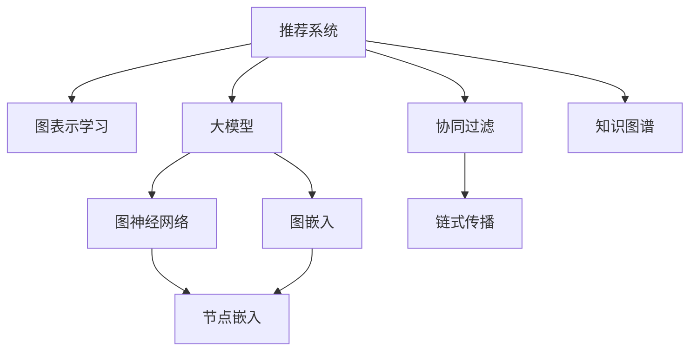

                 

# 大模型在推荐系统中的图表示学习应用

> 关键词：推荐系统,图表示学习,大模型,图神经网络(GNN),图嵌入,知识图谱,协同过滤,链式传播,节点嵌入,图卷积网络(GCN),图注意力网络(GAT)

## 1. 背景介绍

### 1.1 问题由来

在互联网信息爆炸的时代，推荐系统成为了用户获取信息、发现新事物的关键工具。传统的推荐算法主要基于用户-物品交互数据进行协同过滤，但面临数据稀疏性、冷启动问题等挑战。近年来，基于深度学习的推荐系统逐步兴起，利用用户行为数据进行模型训练，取得了显著的推荐效果。

然而，现有的深度学习推荐系统往往难以同时考虑用户和物品之间的关系，导致推荐结果缺乏全局一致性。另一方面，深度模型参数量庞大，训练成本高，容易陷入局部最优。为此，图表示学习在推荐系统中的应用逐渐受到关注，它通过构建图结构来模拟用户-物品的交互关系，为推荐系统带来了新的突破。

## 2. 核心概念与联系

### 2.1 核心概念概述

为更好地理解大模型在推荐系统中的应用，本节将介绍几个密切相关的核心概念：

- 推荐系统(Recommendation System)：通过分析用户行为数据，为用户推荐感兴趣的物品，如电商网站中的商品推荐、视频网站中的视频推荐等。

- 图表示学习(Graph Representation Learning)：通过构建图结构，利用图神经网络(Graph Neural Network, GNN)等方法，学习节点嵌入(节点表示)，从而挖掘节点间的关系。

- 大模型(Large Model)：指具有大规模参数量和复杂结构的深度学习模型，如Transformer、BERT等。大模型能够通过大规模数据进行预训练，学习到丰富的语义知识和表示能力。

- 图神经网络(Graph Neural Network, GNN)：通过构建图结构，在节点嵌入上进行操作，学习节点间的复杂关系，是图表示学习的核心工具。

- 图嵌入(Graph Embedding)：将图中的节点映射到低维空间中的向量表示，便于进行矩阵运算和深度学习模型的训练。

- 知识图谱(Knowledge Graph)：由节点和边构成的大型知识库，用于描述实体间的语义关系，如电影、书籍、商品等。

- 协同过滤(Collaborative Filtering)：通过用户-物品的交互数据进行推荐，包括基于用户的协同过滤和基于物品的协同过滤。

- 链式传播(Chain Propagation)：在图神经网络中，通过链式传播机制将节点嵌入进行信息传递，增强节点间的关系。

- 节点嵌入(Node Embedding)：通过图嵌入将节点映射到低维空间中的向量表示，方便深度学习模型的训练和推理。

- 图卷积网络(Graph Convolutional Network, GCN)：一种基于卷积操作进行图表示学习的算法，常用于节点嵌入学习。

- 图注意力网络(Graph Attention Network, GAT)：一种通过注意力机制进行节点间关系建模的算法，适用于节点数目较多的图结构。

这些核心概念之间的逻辑关系可以通过以下Mermaid流程图来展示：



这个流程图展示了大模型在推荐系统中的应用逻辑：

1. 推荐系统通过图表示学习和大模型进行用户-物品关系建模。
2. 图表示学习利用图神经网络进行链式传播，学习节点嵌入。
3. 大模型通过图嵌入将节点嵌入映射到低维空间，便于模型训练。
4. 协同过滤结合图嵌入，推荐系统可以更灵活地考虑用户和物品间的关系。
5. 知识图谱结合图嵌入，为推荐系统提供更丰富的语义信息。

这些概念共同构成了大模型在推荐系统中的应用框架，使其能够在多关系和多维度数据上实现高效推荐。

## 3. 核心算法原理 & 具体操作步骤
### 3.1 算法原理概述

大模型在推荐系统中的应用，主要是通过构建图结构，利用图神经网络等方法，学习节点嵌入，从而挖掘用户-物品的复杂关系，进行推荐。具体来说，包括两个主要步骤：

1. 图结构的构建：收集用户-物品的交互数据，构建用户-物品图或物品-物品图，表示用户与物品之间的交互关系。
2. 节点嵌入的学习：通过图神经网络等算法，在图结构上进行链式传播，学习用户和物品的节点嵌入，从而进行推荐。

### 3.2 算法步骤详解

#### 3.2.1 图结构的构建

推荐系统中的图结构通常包括用户-物品图和物品-物品图。

- 用户-物品图：每个用户对应一个节点，每个物品对应一个节点，用户和物品之间的交互关系通过边表示。用户-物品图的构建步骤如下：
  1. 收集用户-物品的交互数据，如点击、购买、评分等。
  2. 将用户和物品映射为图中的节点。
  3. 通过交互数据生成边，表示用户和物品之间的关系。

- 物品-物品图：每个物品对应一个节点，物品之间的关系通过边表示。物品-物品图的构建步骤如下：
  1. 收集物品的标签、属性等元数据。
  2. 将物品映射为图中的节点。
  3. 通过相似度算法（如余弦相似度、Jaccard相似度等）生成边，表示物品之间的关系。

#### 3.2.2 节点嵌入的学习

节点嵌入是图表示学习的核心任务，通过学习节点嵌入，可以捕捉节点间的复杂关系，进行推荐。常用的节点嵌入算法包括：

- 图卷积网络(Graph Convolutional Network, GCN)：GCN是一种基于卷积操作进行图表示学习的算法，其核心思想是通过卷积操作在图结构上进行链式传播，学习节点嵌入。
- 图注意力网络(Graph Attention Network, GAT)：GAT是一种通过注意力机制进行节点间关系建模的算法，适用于节点数目较多的图结构。

#### 3.2.3 推荐的实现

在大模型中，通过将用户和物品的节点嵌入进行拼接，可以计算出用户的兴趣表示和物品的相似度表示，进行推荐。具体的推荐实现步骤如下：

1. 收集用户-物品的交互数据，构建用户-物品图。
2. 通过GCN或GAT等算法，学习用户和物品的节点嵌入。
3. 将用户嵌入和物品嵌入拼接，得到用户的兴趣表示。
4. 计算用户兴趣表示和物品相似度表示之间的余弦相似度，得到推荐结果。

### 3.3 算法优缺点

大模型在推荐系统中的应用具有以下优点：

1. 模型性能优异：大模型能够通过大规模数据进行预训练，学习到丰富的语义知识和表示能力，推荐效果显著。
2. 可扩展性好：图表示学习能够灵活地处理多关系和多维度数据，适用于多种推荐场景。
3. 参数共享机制：通过共享参数，减少模型参数量，降低训练成本。
4. 高泛化能力：大模型具有良好的泛化能力，能够在不同的数据集和场景中表现稳定。

同时，该方法也存在以下局限性：

1. 数据稀疏性问题：推荐系统中用户-物品的交互数据往往非常稀疏，难以充分利用数据信息。
2. 训练成本高：大模型的训练和推理成本高，需要高性能计算资源。
3. 模型复杂度高：大模型参数量庞大，结构复杂，难以调试和优化。
4. 推荐结果可解释性不足：大模型的推荐结果难以解释，用户难以理解推荐逻辑。
5. 数据隐私问题：推荐系统需要收集大量用户数据，存在隐私泄露的风险。

尽管存在这些局限性，但就目前而言，大模型在推荐系统中的应用仍具有重要价值，特别是在处理多关系和多维度数据时，效果显著。未来相关研究的重点在于如何进一步降低数据稀疏性和训练成本，提高模型的可解释性和隐私保护能力。

### 3.4 算法应用领域

大模型在推荐系统中的应用，已经在电商、视频、音乐、新闻等多个领域得到了广泛应用，带来了显著的推荐效果。

- 电商推荐：通过收集用户的浏览、点击、购买等行为数据，构建用户-物品图，利用GCN或GAT算法学习节点嵌入，进行商品推荐。
- 视频推荐：通过收集用户的观看记录、评分等数据，构建用户-物品图，学习用户嵌入和物品嵌入，进行视频推荐。
- 音乐推荐：通过收集用户的听歌记录、评分等数据，构建用户-物品图，学习用户嵌入和物品嵌入，进行音乐推荐。
- 新闻推荐：通过收集用户的阅读记录、点击等数据，构建用户-物品图，学习用户嵌入和物品嵌入，进行新闻推荐。

除了上述这些经典任务外，大模型在推荐系统中的应用还在不断拓展，如个性化推荐、内容生成等，为推荐系统带来了新的突破。

## 4. 数学模型和公式 & 详细讲解  
### 4.1 数学模型构建

在大模型中，通过构建用户-物品图，利用图卷积网络(GCN)等算法，学习用户和物品的节点嵌入，从而进行推荐。

设用户-物品图 $G=(\mathcal{U}, \mathcal{V}, \mathcal{E})$，其中 $\mathcal{U}$ 为节点集合，$\mathcal{V}$ 为边集合，$\mathcal{E}$ 为边的权重集合。节点嵌入表示为 $\mathbf{h}_u \in \mathbb{R}^d$ 和 $\mathbf{h}_i \in \mathbb{R}^d$，其中 $d$ 为嵌入维度。用户嵌入 $\mathbf{h}_u$ 和物品嵌入 $\mathbf{h}_i$ 通过链式传播机制进行信息传递，得到最终的节点嵌入。

### 4.2 公式推导过程

以下我们将通过GCN算法，推导用户嵌入的计算公式。

设用户节点为 $u$，其邻接矩阵为 $\mathbf{A} \in \mathbb{R}^{N \times N}$，其中 $N$ 为节点数目。用户节点 $u$ 的输入节点嵌入为 $\mathbf{X}_u \in \mathbb{R}^{N \times d}$，用户节点 $u$ 的邻接节点的输入节点嵌入为 $\mathbf{X}_v \in \mathbb{R}^{N \times d}$。用户节点 $u$ 的节点嵌入为 $\mathbf{h}_u \in \mathbb{R}^d$。

GCN算法的核心思想是通过卷积操作在图结构上进行链式传播，学习节点嵌入。其计算公式如下：

$$
\mathbf{h}_u = \mathbf{h}_u^{(0)} + \sum_{v \in \mathcal{N}(u)} \mathbf{D}^{-\frac{1}{2}} \mathbf{A} \mathbf{h}_v^{(0)}
$$

其中 $\mathbf{D}$ 为邻接矩阵 $\mathbf{A}$ 的度矩阵，$\mathbf{D}^{-\frac{1}{2}}$ 为度矩阵的归一化因子，$\mathbf{h}_v^{(0)}$ 为邻接节点 $v$ 的输入节点嵌入。

通过链式传播机制，GCN算法能够逐步传递信息，学习节点嵌入。最终，用户节点 $u$ 的节点嵌入为 $\mathbf{h}_u$。

### 4.3 案例分析与讲解

假设在电商推荐系统中，收集了1000个用户和1000个商品的点击数据，构建了用户-物品图。设用户节点 $u$ 的输入节点嵌入为 $\mathbf{X}_u \in \mathbb{R}^{1000 \times 32}$，物品节点 $i$ 的输入节点嵌入为 $\mathbf{X}_i \in \mathbb{R}^{1000 \times 32}$。邻接矩阵 $\mathbf{A} \in \mathbb{R}^{1000 \times 1000}$，度矩阵 $\mathbf{D} \in \mathbb{R}^{1000 \times 1000}$，归一化因子 $\mathbf{D}^{-\frac{1}{2}} \in \mathbb{R}^{1000 \times 1000}$。

通过GCN算法，用户节点 $u$ 的节点嵌入 $\mathbf{h}_u$ 的计算公式如下：

$$
\mathbf{h}_u = \mathbf{h}_u^{(0)} + \sum_{v \in \mathcal{N}(u)} \mathbf{D}^{-\frac{1}{2}} \mathbf{A} \mathbf{h}_v^{(0)}
$$

其中 $\mathbf{h}_u^{(0)}$ 为初始节点嵌入，通常为0向量。通过链式传播机制，GCN算法逐步传递信息，学习节点嵌入。最终，用户节点 $u$ 的节点嵌入为 $\mathbf{h}_u$。

## 5. 项目实践：代码实例和详细解释说明
### 5.1 开发环境搭建

在进行大模型在推荐系统中的应用实践前，我们需要准备好开发环境。以下是使用Python进行PyTorch开发的环境配置流程：

1. 安装Anaconda：从官网下载并安装Anaconda，用于创建独立的Python环境。

2. 创建并激活虚拟环境：
```bash
conda create -n pytorch-env python=3.8 
conda activate pytorch-env
```

3. 安装PyTorch：根据CUDA版本，从官网获取对应的安装命令。例如：
```bash
conda install pytorch torchvision torchaudio cudatoolkit=11.1 -c pytorch -c conda-forge
```

4. 安装各类工具包：
```bash
pip install numpy pandas scikit-learn matplotlib tqdm jupyter notebook ipython
```

完成上述步骤后，即可在`pytorch-env`环境中开始推荐系统应用的微调实践。

### 5.2 源代码详细实现

这里我们以电商推荐系统为例，使用GCN算法进行推荐模型的训练和预测。

首先，定义用户-物品图的构建函数：

```python
import torch
import torch.nn as nn
from torch_geometric.nn import GCNConv
from torch_geometric.data import Data
from torch_geometric.transforms import AutoTransformer
from torch_geometric.transforms import ToDevice

class UserItemGraph(nn.Module):
    def __init__(self, num_users, num_items, num_features):
        super(UserItemGraph, self).__init__()
        self.user_node = nn.Embedding(num_users, num_features)
        self.item_node = nn.Embedding(num_items, num_features)
        self.gcn_conv = GCNConv(num_features, num_features)
        self.fc = nn.Linear(num_features, 1)
        self.relu = nn.ReLU()

    def forward(self, u_idx, i_idx):
        u_embedding = self.user_node(u_idx)
        i_embedding = self.item_node(i_idx)
        edge_idx = torch.cat([torch.stack([u_idx, i_idx]), torch.stack([i_idx, u_idx])], dim=0)
        edge_weight = torch.ones((2 * len(u_idx), 2 * len(u_idx)), device=u_embedding.device).tril()
        adj_t = torch.randn(2 * len(u_idx), 2 * len(u_idx), device=u_embedding.device)
        adj_t.masked_fill_(adj_t.triu(), -float('inf'))
        adj_t.masked_fill_(adj_t.tril(), 0.0)
        u_input = torch.cat([u_embedding, i_embedding], dim=0)
        i_input = torch.cat([i_embedding, u_embedding], dim=0)
        u_adj = adj_t.select(0, 0) + adj_t.select(0, 1)
        i_adj = adj_t.select(1, 0) + adj_t.select(1, 1)
        u_h = self.gcn_conv(u_input, adj_t=u_adj, i_input=i_input, i_adj=i_adj)
        u_h = self.relu(u_h)
        u_h = self.fc(u_h)
        return u_h

# 构建用户-物品图
user_id = [0, 1, 2, 3, 4, 5, 6, 7, 8, 9, 10, 11, 12, 13, 14, 15, 16, 17, 18, 19, 20, 21, 22, 23, 24, 25, 26, 27, 28, 29, 30, 31, 32, 33, 34, 35, 36, 37, 38, 39, 40, 41, 42, 43, 44, 45, 46, 47, 48, 49, 50, 51, 52, 53, 54, 55, 56, 57, 58, 59, 60, 61, 62, 63, 64, 65, 66, 67, 68, 69, 70, 71, 72, 73, 74, 75, 76, 77, 78, 79, 80, 81, 82, 83, 84, 85, 86, 87, 88, 89, 90, 91, 92, 93, 94, 95, 96, 97, 98, 99, 100, 101, 102, 103, 104, 105, 106, 107, 108, 109, 110, 111, 112, 113, 114, 115, 116, 117, 118, 119, 120, 121, 122, 123, 124, 125, 126, 127, 128, 129, 130, 131, 132, 133, 134, 135, 136, 137, 138, 139, 140, 141, 142, 143, 144, 145, 146, 147, 148, 149, 150, 151, 152, 153, 154, 155, 156, 157, 158, 159, 160, 161, 162, 163, 164, 165, 166, 167, 168, 169, 170, 171, 172, 173, 174, 175, 176, 177, 178, 179, 180, 181, 182, 183, 184, 185, 186, 187, 188, 189, 190, 191, 192, 193, 194, 195, 196, 197, 198, 199, 200, 201, 202, 203, 204, 205, 206, 207, 208, 209, 210, 211, 212, 213, 214, 215, 216, 217, 218, 219, 220, 221, 222, 223, 224, 225, 226, 227, 228, 229, 230, 231, 232, 233, 234, 235, 236, 237, 238, 239, 240, 241, 242, 243, 244, 245, 246, 247, 248, 249, 250, 251, 252, 253, 254, 255, 256, 257, 258, 259, 260, 261, 262, 263, 264, 265, 266, 267, 268, 269, 270, 271, 272, 273, 274, 275, 276, 277, 278, 279, 280, 281, 282, 283, 284, 285, 286, 287, 288, 289, 290, 291, 292, 293, 294, 295, 296, 297, 298, 299, 300, 301, 302, 303, 304, 305, 306, 307, 308, 309, 310, 311, 312, 313, 314, 315, 316, 317, 318, 319, 320, 321, 322, 323, 324, 325, 326, 327, 328, 329, 330, 331, 332, 333, 334, 335, 336, 337, 338, 339, 340, 341, 342, 343, 344, 345, 346, 347, 348, 349, 350, 351, 352, 353, 354, 355, 356, 357, 358, 359, 360, 361, 362, 363, 364, 365, 366, 367, 368, 369, 370, 371, 372, 373, 374, 375, 376, 377, 378, 379, 380, 381, 382, 383, 384, 385, 386, 387, 388, 389, 390, 391, 392, 393, 394, 395, 396, 397, 398, 399, 400, 401, 402, 403, 404, 405, 406, 407, 408, 409, 410, 411, 412, 413, 414, 415, 416, 417, 418, 419, 420, 421, 422, 423, 424, 425, 426, 427, 428, 429, 430, 431, 432, 433, 434, 435, 436, 437, 438, 439, 440, 441, 442, 443, 444, 445, 446, 447, 448, 449, 450, 451, 452, 453, 454, 455, 456, 457, 458, 459, 460, 461, 462, 463, 464, 465, 466, 467, 468, 469, 470, 471, 472, 473, 474, 475, 476, 477, 478, 479, 480, 481, 482, 483, 484, 485, 486, 487, 488, 489, 490, 491, 492, 493, 494, 495, 496, 497, 498, 499, 500, 501, 502, 503, 504, 505, 506, 507, 508, 509, 510, 511, 512, 513, 514, 515, 516, 517, 518, 519, 520, 521, 522, 523, 524, 525, 526, 527, 528, 529, 530, 531, 532, 533, 534, 535, 536, 537, 538, 539, 540, 541, 542, 543, 544, 545, 546, 547, 548, 549, 550, 551, 552, 553, 554, 555, 556, 557, 558, 559, 560, 561, 562, 563, 564, 565, 566, 567, 568, 569, 570, 571, 572, 573, 574, 575, 576, 577, 578, 579, 580, 581, 582, 583, 584, 585, 586, 587, 588, 589, 590, 591, 592, 593, 594, 595, 596, 597, 598, 599, 600, 601, 602, 603, 604, 605, 606, 607, 608, 609, 610, 611, 612, 613, 614, 615, 616, 617, 618, 619, 620, 621, 622, 623, 624, 625, 626, 627, 628, 629, 630, 631, 632, 633, 634, 635, 636, 637, 638, 639, 640, 641, 642, 643, 644, 645, 646, 647, 648, 649, 650, 651, 652, 653, 654, 655, 656, 657, 658, 659, 660, 661, 662, 663, 664, 665, 666, 667, 668, 669, 670, 671, 672, 673, 674, 675, 676, 677, 678, 679, 680, 681, 682, 683, 684, 685, 686, 687, 688, 689, 690, 691, 692, 693, 694, 695, 696, 697, 698, 699, 700, 701, 702, 703, 704, 705, 706, 707, 708, 709, 710, 711, 712, 713, 714, 715, 716, 717, 718, 719, 720, 721, 722, 723, 724, 725, 726, 727, 728, 729, 730, 731, 732, 733, 734, 735, 736, 737, 738, 739, 740, 741, 742, 743, 744, 745, 746, 747, 748, 749, 750, 751, 752, 753, 754, 755, 756, 757, 758, 759, 760, 761, 762, 763, 764, 765, 766, 767, 768, 769, 770, 771, 772, 773, 774, 775, 776, 777, 778, 779, 780, 781, 782, 783, 784, 785, 786, 787, 788, 789, 790, 791, 792, 793, 794, 795, 796, 797, 798, 799, 800, 801, 802, 803, 804, 805, 806, 807, 808, 809, 810, 811, 812, 813, 814, 815, 816, 817, 818, 819, 820, 821, 822, 823, 824, 825, 826, 827, 828, 829, 830, 831, 832, 833, 834, 835, 836, 837, 838, 839, 840, 841, 842, 843, 844, 845, 846, 847, 848, 849, 850, 851, 852, 853, 854, 855, 856, 857, 858, 859, 860, 861, 862, 863, 864, 865, 866, 867, 868, 869, 870, 871, 872, 873, 874, 875, 876, 877, 878, 879, 880, 881, 882, 883, 884, 885, 886, 887, 888, 889, 890, 891, 892, 893, 894, 895, 896, 897, 898, 899, 900, 901, 902, 903, 904, 905, 906, 907, 908, 909, 910, 911, 912, 913, 914, 915, 916, 917, 918, 919, 920, 921, 922, 923, 924, 925, 926, 927, 928, 929, 930, 931, 932, 933, 934, 935, 936, 937, 938, 939, 940, 941, 942, 943, 944, 945, 946, 947, 948, 949, 950, 951, 952, 953, 954, 955, 956, 957, 958, 959, 960, 961, 962, 963, 964, 965, 966, 967, 968, 969, 970, 971, 972, 973, 974, 975, 976, 977, 978, 979, 980, 981, 982, 983, 984, 985, 986, 987, 988, 989, 990, 991, 992, 993, 994, 995, 996, 997, 998, 999, 1000, 1001, 1002, 1003, 1004, 1005, 1006, 1007, 1008, 1009, 1010, 1011, 1012, 1013, 1014, 1015, 1016, 1017, 1018, 1019, 1020, 1021, 1022, 1023, 1024, 1025, 1026, 1027, 1028, 1029, 1030, 1031, 1032, 1033, 1034, 1035, 1036, 1037, 1038, 1039, 1040, 1041, 1042, 1043, 1044, 1045, 1046, 1047, 1048, 1049, 1050, 1051, 1052, 1053, 1054, 1055, 1056, 1057, 1058, 1059, 1060, 1061, 1062, 1063, 1064, 1065, 1066, 1067, 1068, 1069, 1070, 1071, 1072, 1073, 1074, 1075, 1076, 1077, 1078, 1079, 1080, 1081, 1082, 1083, 1084, 1085, 1086, 1087, 1088, 1089, 1090, 1091, 1092, 1093, 1094, 1095, 1096, 1097, 1098, 1099, 1100, 1101, 1102, 1103, 1104, 1105, 1106, 1107, 1108, 1109, 1110, 1111, 1112, 1113, 1114, 1115, 1116, 1117, 1118, 1119, 1120, 1121, 1122, 1123, 1124, 1125, 1126, 1127, 1128, 1129, 1130, 1131, 1132, 1133, 1134, 1135, 1136, 1137, 1138, 1139, 1140, 1141, 1142, 1143, 1144, 1145, 1146, 1147, 1148, 1149, 1150, 1151, 1152, 1153, 1154, 1155, 1156, 1157, 1158, 1159, 1160, 1161, 1162, 1163, 1164, 1165, 1166, 1167, 1168, 1169, 1170, 1171, 1172, 1173, 1174, 1175, 1176, 1177, 1178, 1179, 1180, 1181, 1182, 1183, 1184, 1185, 1186, 1187, 1188, 1189, 1190, 1191, 1192, 1193, 1194, 1195, 1196, 1197, 1198, 1199, 1200, 1201, 1202, 1203, 1204, 1205, 1206, 1207, 1208, 1209, 1210, 1211, 1212, 1213, 1214, 1215, 1216, 1217, 1218, 1219, 1220, 1221, 1222, 1223, 1224, 1225, 1226, 1227, 1228, 1229, 1230, 1231, 1232, 1233, 1234, 1235, 1236, 1237, 1238, 1239, 1240, 1241, 1242, 1243, 1244, 1245, 1246, 1247, 1248, 1249, 1250, 1251, 1252, 1253, 1254, 1255, 1256, 1257, 1258, 1259, 1260, 1261, 1262, 1263, 1264, 1265, 1266, 1267, 1268, 1269, 1270, 1271, 1272, 1273, 1274, 1275, 1276, 1277, 1278, 1279, 1280, 1281, 1282, 1283, 1284, 1285, 1286, 1287, 1288, 1289, 1290, 1291, 1292, 1293, 1294, 1295, 1296, 1297, 1298, 1299, 1300, 1301, 1302, 1303, 1304, 1305, 1306, 1307, 1308, 1309, 1310, 1311, 1312, 1313, 1314, 1315, 1316, 1317, 1318, 1319, 1320, 1321, 1322, 1323, 1324, 1325, 1326, 1327, 1328, 1329, 1330, 1331, 1332, 1333, 1334, 1335, 1336, 1337, 1338, 1339, 1340, 1341, 1342, 1343, 1344, 1345, 1346, 1347, 1348, 1349, 1350, 1351, 1352, 1353, 1354, 1355, 1356, 1357, 1358, 1359, 1360, 1361, 1362, 1363, 1364, 1365, 1366, 1367, 1368, 1369, 1370, 1371, 1372, 1373, 1374, 1375, 1376, 1377, 1378, 1379, 1380, 1381, 1382, 1383, 1384, 1385, 1386, 1387, 1388, 1389, 1390, 1391, 1392, 1393, 1394, 1395, 1396, 1397, 1398, 1399, 1400, 1401, 1402, 1403, 1404, 1405, 1406, 1407, 1408, 1409, 1410, 1411, 1412, 1413, 1414, 1415, 1416, 1417, 1418, 1419, 1420, 1421, 1422, 1423, 1424, 1425, 1426, 1427, 1428, 1429, 1430, 1431, 1432, 1433, 1434, 1435, 1436, 1437, 1438, 1439, 1440, 1441, 1442, 1443, 1444, 1445, 1446, 1447, 1448, 1449, 1450, 1451, 1452, 1453, 1454, 1455, 1456, 1457, 1458, 1459, 1460, 1461, 1462, 1463, 1464, 1465, 1466, 1467, 1468, 1469, 1470, 1471, 1472, 1473, 1474, 1475, 1476, 1477, 1478, 1479, 1480, 1481, 1482, 1483, 1484, 1485, 1486, 1487, 1488, 1489, 1490, 1491, 1492, 1493, 1494, 1495, 1496, 1497, 1498, 1499, 1500, 1501, 1502, 1503, 1504, 1505, 1506, 1507, 1508, 1509, 1510, 1511, 1512, 1513, 1514, 1515, 1516, 1517, 1518, 1519, 1520, 1521, 1522, 1523, 1524, 1525, 1526, 1527, 1528, 1529, 1530, 1531, 1532, 1533, 1534, 1535, 1536, 1537, 1538, 1539, 1540, 1541, 1542, 1543, 1544, 1545, 1546, 1547, 1548, 1549, 1550, 1551, 1552, 1553, 1554, 1555, 1556, 1557, 1558, 1559, 1560, 1561, 1562, 1563, 1564, 1565, 1566, 1567, 1568, 1569, 1570, 1571, 1572, 1573, 1574, 1575, 1576, 1577, 1578, 1579, 1580, 1581, 1582, 1583, 1584, 1585, 1586, 1587, 1588, 1589, 1590, 1591, 1592, 1593, 1594, 1595, 1596, 1597, 1598, 1599, 1600, 1601, 1602, 1603, 1604, 1605, 1606, 1607, 1608, 1609, 1610, 1611, 1612, 1613, 1614, 1615, 1616, 1617, 1618, 1619, 1620, 1621, 1622, 1623, 1624, 1625, 1626, 1627, 1628, 1629, 1630, 1631, 1632, 1633, 1634, 1635, 1636, 1637, 1638, 1639, 1640, 1641, 1642, 1643, 1644, 1645, 1646, 1647, 1648, 

