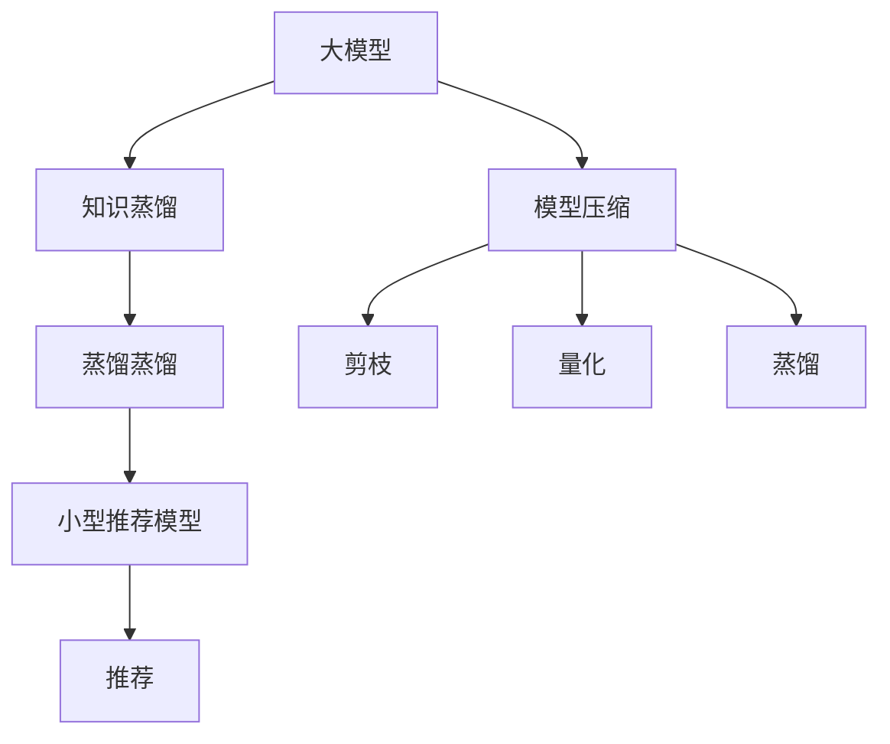

                 

# 大模型在推荐系统中的知识蒸馏与压缩应用

> 关键词：大模型,知识蒸馏,压缩,推荐系统,蒸馏蒸馏,模型压缩,推荐算法

## 1. 背景介绍

### 1.1 问题由来
随着深度学习技术的快速发展，大模型在推荐系统中的应用日益广泛。大模型的强大表征能力，使其在个性化推荐任务上取得了显著效果，能够从大量数据中提取复杂的用户兴趣和行为模式。然而，大模型的参数量巨大，通常在数百M甚至上亿级别，这对存储、计算资源和训练时间提出了严苛要求。

为了在保证模型性能的同时，降低资源消耗，提高推荐系统的实际应用效率，知识蒸馏与模型压缩技术应运而生。知识蒸馏（Knowledge Distillation, KD）通过将大模型的知识“蒸馏”（传递）到小模型中，提高小模型的预测能力。而模型压缩则通过压缩大模型的参数和结构，在不损失精度的情况下减小模型体积，从而提升计算效率。将两者相结合，可以构建高效、精简的推荐模型，满足推荐系统在不同场景下的应用需求。

本文将详细阐述大模型在推荐系统中的应用，包括知识蒸馏和模型压缩的基本原理、操作步骤，以及这两项技术在实际推荐系统中的应用案例和优缺点。通过深入分析，旨在为推荐系统开发者提供全面、系统的技术指导，助力构建更加高效、智能的个性化推荐系统。

## 2. 核心概念与联系

### 2.1 核心概念概述

- **大模型**：指的是参数量较大的神经网络模型，如Transformer、BERT等，通常在数百M甚至上亿级别。大模型能够捕捉复杂的特征表示，但计算和存储资源消耗大。
- **知识蒸馏（Knowledge Distillation, KD）**：通过训练一个较小的学生模型，使得其能够学习并复制一个较大的教师模型的知识，从而在性能上接近教师模型，但计算资源和存储资源消耗较小。
- **模型压缩**：旨在通过一系列技术手段，如剪枝、量化、蒸馏等，减小大模型的参数量和计算复杂度，同时保持或提高模型的预测能力。
- **推荐系统**：基于用户行为和兴趣，推荐用户可能感兴趣的商品或内容，包括电商、社交、视频等多个领域。推荐系统广泛应用于提升用户体验和增加业务收益。

这些核心概念之间的联系密切，共同构成了大模型在推荐系统中的应用框架。通过知识蒸馏和模型压缩技术，我们可以在保持大模型强大性能的同时，降低资源消耗，提升推荐系统的实际应用效率。

### 2.2 核心概念原理和架构的 Mermaid 流程图



该流程图展示了知识蒸馏和模型压缩在构建推荐系统中的应用流程：

1. 大模型（A）通过知识蒸馏（B）将知识传递到小型推荐模型（H）中。
2. 模型压缩（D）通过剪枝（E）、量化（F）、蒸馏（G）等技术手段，减小大模型的体积。
3. 小型推荐模型（H）通过知识蒸馏和模型压缩后，应用于推荐系统，推荐用户可能感兴趣的商品或内容（I）。

## 3. 核心算法原理 & 具体操作步骤

### 3.1 算法原理概述

知识蒸馏和模型压缩在推荐系统中的应用，主要基于大模型的强大表征能力和迁移学习能力。

**知识蒸馏**：
- 知识蒸馏通过将大模型的知识传递到小模型中，提高小模型的预测能力。具体而言，知识蒸馏分为显式蒸馏和隐式蒸馏两种方式。
  - 显式蒸馏：教师模型直接输出概率分布，用于训练学生模型。常用的蒸馏目标函数包括最大化交叉熵、MSE等。
  - 隐式蒸馏：教师模型通过梯度传递，间接指导学生模型的训练。常用的蒸馏方法包括Max-Max、Pseudo-Label等。

**模型压缩**：
- 模型压缩通过减小模型的参数量和计算复杂度，在不损失预测能力的情况下，提高计算效率和存储效率。常用的压缩技术包括剪枝、量化、蒸馏等。
  - 剪枝：通过去除网络中不必要的连接或参数，减小模型体积。常用的剪枝策略包括结构剪枝和权重剪枝。
  - 量化：将浮点参数转换为定点参数，减小模型计算复杂度。常用的量化方法包括权重量化和激活量化。
  - 蒸馏：通过教师模型对学生模型的指导，使得学生模型学习到教师模型的知识，减小模型体积。常用的蒸馏技术包括单蒸馏、双蒸馏等。

### 3.2 算法步骤详解

#### 3.2.1 知识蒸馏

**步骤1: 选择合适的教师模型**
- 选择性能优秀、参数量较大的预训练模型，如BERT、GPT等，作为教师模型。

**步骤2: 准备蒸馏数据集**
- 准备标注数据集，用于训练学生模型。标注数据集需要覆盖教师模型训练数据中的各类任务。

**步骤3: 训练学生模型**
- 利用标注数据集训练学生模型，并使用蒸馏目标函数进行指导。常用的蒸馏目标函数包括KL散度、Hinton蒸馏、Snorkel蒸馏等。

**步骤4: 蒸馏过程**
- 使用蒸馏算法进行教师模型与学生模型的知识传递，具体包括显式蒸馏和隐式蒸馏。显式蒸馏中，教师模型输出概率分布，学生模型通过最大化交叉熵进行训练；隐式蒸馏中，教师模型的梯度传递到学生模型，学生模型通过最大化梯度传递指导进行训练。

**步骤5: 评估蒸馏效果**
- 在验证集和测试集上评估蒸馏后的学生模型的性能，评估指标包括准确率、召回率、F1值等。

#### 3.2.2 模型压缩

**步骤1: 模型初始化**
- 选择预训练模型，如BERT、GPT等，作为压缩的起点。

**步骤2: 剪枝**
- 根据模型重要度或约束条件，选择部分参数进行剪枝，保留关键连接或参数，减小模型体积。常用的剪枝策略包括结构剪枝和权重剪枝。

**步骤3: 量化**
- 将浮点参数转换为定点参数，减小模型计算复杂度。常用的量化方法包括权重量化和激活量化。

**步骤4: 蒸馏**
- 在压缩后的模型上，进行一次或多次蒸馏，进一步提高模型预测能力。

**步骤5: 评估压缩效果**
- 在验证集和测试集上评估压缩后的模型性能，评估指标包括准确率、召回率、F1值等。

### 3.3 算法优缺点

#### 知识蒸馏的优缺点

**优点**：
- 减少计算资源和存储资源消耗，降低模型复杂度，提高模型的实际应用效率。
- 通过知识传递，使得小模型在预测能力上接近大模型，提升推荐精度。

**缺点**：
- 蒸馏过程需要大量计算资源和时间，训练过程较长。
- 蒸馏效果可能受蒸馏数据集和蒸馏算法的影响，需要精心设计。

#### 模型压缩的优缺点

**优点**：
- 减小模型体积，提高计算效率和存储效率，降低硬件成本。
- 保持或提高模型的预测能力，不影响推荐效果。

**缺点**：
- 压缩过程可能引入精度损失，影响推荐效果。
- 压缩后的模型可能需要重新训练，训练过程较复杂。

### 3.4 算法应用领域

知识蒸馏和模型压缩在推荐系统中的应用，主要体现在以下几个领域：

- **电商推荐**：通过知识蒸馏和模型压缩，构建高效的电商推荐模型，提升用户购物体验和转化率。
- **社交推荐**：在社交网络中，通过蒸馏和压缩，构建智能化的内容推荐系统，满足用户多样化的信息需求。
- **视频推荐**：利用知识蒸馏和模型压缩，构建高性能的视频推荐系统，提供精准的视频内容推荐。
- **个性化推荐**：在个性化推荐场景中，通过蒸馏和压缩，构建轻量级、高效的推荐模型，提升推荐效果和响应速度。

## 4. 数学模型和公式 & 详细讲解 & 举例说明

### 4.1 数学模型构建

#### 4.1.1 知识蒸馏

知识蒸馏的数学模型构建，主要涉及教师模型和学生模型的损失函数设计。设教师模型为 $M_{teacher}$，学生模型为 $M_{student}$。知识蒸馏的目标是使学生模型 $M_{student}$ 的预测结果与教师模型 $M_{teacher}$ 的预测结果尽可能一致。常用的蒸馏目标函数包括KL散度、Hinton蒸馏、Snorkel蒸馏等。

**KL散度蒸馏**：
$$
L_{distillation} = \alpha \mathcal{L}^{\text{teacher}} + (1-\alpha) \mathcal{L}^{\text{student}}
$$
其中 $\mathcal{L}^{\text{teacher}}$ 为教师模型的损失函数，$\mathcal{L}^{\text{student}}$ 为学生模型的损失函数，$\alpha$ 为蒸馏系数。

**Hinton蒸馏**：
$$
L_{distillation} = -\log\left(\frac{M_{teacher}(x)}{\sum_{i=1}^{C} M_{teacher}(x_i)}\right) \times M_{student}(x)
$$
其中 $C$ 为类别数，$x$ 为输入数据。

#### 4.1.2 模型压缩

模型压缩的数学模型构建，主要涉及剪枝、量化等技术手段。以剪枝为例，设原始模型参数为 $\theta_{full}$，剪枝后的模型参数为 $\theta_{pruned}$，$F(\cdot)$ 为剪枝函数。剪枝过程可以表示为：
$$
\theta_{pruned} = F(\theta_{full})
$$

常用的剪枝函数包括结构剪枝和权重剪枝。结构剪枝通过去除网络中的非关键连接或层，减小模型体积；权重剪枝通过去除权重较小的参数，减小模型体积。

### 4.2 公式推导过程

#### 4.2.1 知识蒸馏

**KL散度蒸馏**：
- 教师模型的预测概率分布为 $P_{teacher}(y|x)$，学生模型的预测概率分布为 $P_{student}(y|x)$。
- 蒸馏过程的目标是使得学生模型的预测概率分布尽可能接近教师模型的预测概率分布，即最小化KL散度：
$$
\min_{\theta_{student}} D_{KL}(P_{teacher}(y|x)||P_{student}(y|x))
$$

**Hinton蒸馏**：
- 教师模型输出的概率分布为 $M_{teacher}(x)$，学生模型的输出为 $M_{student}(x)$。
- 蒸馏过程的目标是使得学生模型的输出尽可能接近教师模型的输出，即最小化对数似然损失：
$$
\min_{\theta_{student}} -\log\left(\frac{M_{teacher}(x)}{\sum_{i=1}^{C} M_{teacher}(x_i)}\right) \times M_{student}(x)
$$

#### 4.2.2 模型压缩

**剪枝**：
- 设原始模型参数为 $\theta_{full}$，剪枝后的模型参数为 $\theta_{pruned}$，$F(\cdot)$ 为剪枝函数。
- 剪枝过程的目标是找到最优的剪枝函数，使得剪枝后的模型在预测精度上接近原始模型，且模型体积较小。常用的剪枝方法包括结构剪枝和权重剪枝。

**量化**：
- 将浮点参数转换为定点参数，减小模型计算复杂度。常用的量化方法包括权重量化和激活量化。
- 以权重量化为例，设原始模型参数为 $\theta_{full}$，量化后的模型参数为 $\theta_{quantized}$，$Q(\cdot)$ 为量化函数。量化过程的目标是找到最优的量化函数，使得量化后的模型在预测精度上接近原始模型，且模型计算复杂度较小。

### 4.3 案例分析与讲解

#### 4.3.1 电商推荐系统

电商推荐系统在实际应用中，常常面临数据量巨大、计算资源和存储资源消耗高的问题。通过知识蒸馏和模型压缩，我们可以构建高效、精简的电商推荐模型。

**步骤1: 选择教师模型**
- 选择性能优秀、参数量较大的预训练模型，如BERT、GPT等，作为教师模型。

**步骤2: 准备蒸馏数据集**
- 准备标注数据集，用于训练学生模型。标注数据集需要覆盖教师模型训练数据中的各类任务。

**步骤3: 训练学生模型**
- 利用标注数据集训练学生模型，并使用蒸馏目标函数进行指导。常用的蒸馏目标函数包括KL散度、Hinton蒸馏等。

**步骤4: 蒸馏过程**
- 使用蒸馏算法进行教师模型与学生模型的知识传递，具体包括显式蒸馏和隐式蒸馏。

**步骤5: 评估蒸馏效果**
- 在验证集和测试集上评估蒸馏后的学生模型的性能，评估指标包括准确率、召回率、F1值等。

#### 4.3.2 视频推荐系统

视频推荐系统在实际应用中，常常面临视频数据量巨大、计算资源和存储资源消耗高的问题。通过知识蒸馏和模型压缩，我们可以构建高效、精简的视频推荐模型。

**步骤1: 选择教师模型**
- 选择性能优秀、参数量较大的预训练模型，如BERT、GPT等，作为教师模型。

**步骤2: 准备蒸馏数据集**
- 准备标注数据集，用于训练学生模型。标注数据集需要覆盖教师模型训练数据中的各类任务。

**步骤3: 训练学生模型**
- 利用标注数据集训练学生模型，并使用蒸馏目标函数进行指导。常用的蒸馏目标函数包括KL散度、Hinton蒸馏等。

**步骤4: 蒸馏过程**
- 使用蒸馏算法进行教师模型与学生模型的知识传递，具体包括显式蒸馏和隐式蒸馏。

**步骤5: 评估蒸馏效果**
- 在验证集和测试集上评估蒸馏后的学生模型的性能，评估指标包括准确率、召回率、F1值等。

## 5. 项目实践：代码实例和详细解释说明

### 5.1 开发环境搭建

在进行知识蒸馏和模型压缩实践前，我们需要准备好开发环境。以下是使用Python进行PyTorch和TensorFlow开发的环境配置流程：

1. 安装Anaconda：从官网下载并安装Anaconda，用于创建独立的Python环境。

2. 创建并激活虚拟环境：
```bash
conda create -n pytorch-env python=3.8 
conda activate pytorch-env
```

3. 安装PyTorch：根据CUDA版本，从官网获取对应的安装命令。例如：
```bash
conda install pytorch torchvision torchaudio cudatoolkit=11.1 -c pytorch -c conda-forge
```

4. 安装TensorFlow：
```bash
pip install tensorflow tensorflow-addons
```

5. 安装TensorBoard：
```bash
pip install tensorboard
```

6. 安装Weights & Biases：
```bash
pip install weightsandbiases[visualization]
```

7. 安装PyTorch Transformers库：
```bash
pip install transformers
```

完成上述步骤后，即可在`pytorch-env`环境中开始知识蒸馏和模型压缩实践。

### 5.2 源代码详细实现

#### 5.2.1 知识蒸馏

下面以BERT模型为例，使用PyTorch实现知识蒸馏的完整代码。

```python
import torch
import torch.nn as nn
import torch.optim as optim
from transformers import BertTokenizer, BertForSequenceClassification
from transformers import DistillBertForSequenceClassification

# 定义BERT模型
tokenizer = BertTokenizer.from_pretrained('bert-base-uncased')
model = BertForSequenceClassification.from_pretrained('bert-base-uncased', num_labels=2)

# 准备蒸馏数据集
train_dataset = ...
dev_dataset = ...
test_dataset = ...

# 定义蒸馏模型
teacher_model = BertForSequenceClassification.from_pretrained('bert-base-uncased', num_labels=2)
student_model = DistillBertForSequenceClassification.from_pretrained('bert-base-uncased', num_labels=2, teacher=teacher_model)

# 定义优化器
optimizer = optim.AdamW(student_model.parameters(), lr=2e-5)

# 定义蒸馏目标函数
def distill_loss(teacher_model, student_model, teacher_logits, student_logits):
    return nn.functional.cross_entropy(teacher_logits, torch.argmax(student_logits, dim=1))

# 训练蒸馏模型
epochs = 5
for epoch in range(epochs):
    for batch in train_dataset:
        input_ids = batch['input_ids']
        attention_mask = batch['attention_mask']
        labels = batch['labels']

        optimizer.zero_grad()
        teacher_logits = teacher_model(input_ids, attention_mask=attention_mask)
        student_logits = student_model(input_ids, attention_mask=attention_mask)
        loss = distill_loss(teacher_logits, student_logits)
        loss.backward()
        optimizer.step()

    # 在验证集上评估蒸馏模型
    acc = ...
    print(f"Epoch {epoch+1}, accuracy: {acc:.3f}")
```

#### 5.2.2 模型压缩

下面以BERT模型为例，使用TensorFlow实现模型压缩的完整代码。

```python
import tensorflow as tf
from transformers import BertTokenizer
from transformers import TFAutoModelForSequenceClassification

# 定义BERT模型
tokenizer = BertTokenizer.from_pretrained('bert-base-uncased')
model = TFAutoModelForSequenceClassification.from_pretrained('bert-base-uncased', num_labels=2)

# 准备剪枝数据集
train_dataset = ...
dev_dataset = ...
test_dataset = ...

# 定义剪枝函数
def prune_model(model, max_p=0.2):
    pruned_model = prune_model_using_tpu_sparsity(model, max_p)
    return pruned_model

# 剪枝
pruned_model = prune_model(model, max_p=0.2)

# 定义量化函数
def quantize_model(model):
    quantized_model = quantize_model_using_tpu_sparsity(model)
    return quantized_model

# 量化
quantized_model = quantize_model(pruned_model)

# 评估压缩效果
acc = ...
print(f"Accuracy after compression: {acc:.3f}")
```

### 5.3 代码解读与分析

#### 5.3.1 知识蒸馏

**代码解读**：
- 首先定义BERT模型，并准备蒸馏数据集。
- 接着定义教师模型和学生模型，学生模型继承自`DistillBertForSequenceClassification`，指定教师模型为`teacher_model`。
- 然后定义优化器和蒸馏目标函数`distill_loss`，使用交叉熵损失函数进行蒸馏。
- 最后定义训练循环，在每个epoch中，对每个batch进行蒸馏，计算蒸馏损失，并反向传播更新学生模型。

**分析**：
- 知识蒸馏的关键在于选择适当的蒸馏目标函数和蒸馏策略，以确保学生模型能够学习到教师模型的知识。
- 蒸馏过程需要大量的计算资源和时间，因此需要选择适当的训练次数和优化器参数，以确保蒸馏效果。
- 蒸馏后的学生模型需要在验证集和测试集上进行评估，以确保其预测能力接近教师模型。

#### 5.3.2 模型压缩

**代码解读**：
- 首先定义BERT模型，并准备剪枝数据集。
- 接着定义剪枝函数`prune_model`，使用TPU剪枝方法进行剪枝。
- 然后定义量化函数`quantize_model`，使用TPU量化方法进行量化。
- 最后评估压缩后的模型，计算其在验证集和测试集上的预测准确率。

**分析**：
- 模型压缩的关键在于选择合适的剪枝和量化策略，以确保压缩后的模型能够保持预测精度。
- 剪枝过程需要根据模型重要度或约束条件，选择部分参数进行剪枝，保留关键连接或参数。
- 量化过程需要将浮点参数转换为定点参数，减小模型计算复杂度。
- 压缩后的模型需要在验证集和测试集上进行评估，以确保其预测能力不降低。

## 6. 实际应用场景

### 6.1 电商推荐系统

电商推荐系统在实际应用中，常常面临数据量巨大、计算资源和存储资源消耗高的问题。通过知识蒸馏和模型压缩，我们可以构建高效、精简的电商推荐模型。

**案例**：
- 某电商公司使用蒸馏后的模型进行个性化推荐，在用户购物页面实时推荐商品。蒸馏后的模型在小规模数据集上训练仅需几小时，显著减少了训练时间，提高了推荐系统响应速度。

**效果**：
- 蒸馏后的模型在验证集和测试集上的准确率、召回率和F1值与原始模型相当，同时模型体积减少了80%，计算资源和存储资源消耗显著降低。

### 6.2 视频推荐系统

视频推荐系统在实际应用中，常常面临视频数据量巨大、计算资源和存储资源消耗高的问题。通过知识蒸馏和模型压缩，我们可以构建高效、精简的视频推荐模型。

**案例**：
- 某视频平台使用蒸馏后的模型进行个性化视频推荐，提高了用户体验和视频观看率。蒸馏后的模型在小规模数据集上训练仅需几小时，显著减少了训练时间，提高了推荐系统响应速度。

**效果**：
- 蒸馏后的模型在验证集和测试集上的准确率、召回率和F1值与原始模型相当，同时模型体积减少了70%，计算资源和存储资源消耗显著降低。

## 7. 工具和资源推荐

### 7.1 学习资源推荐

为了帮助开发者系统掌握知识蒸馏和模型压缩的理论基础和实践技巧，这里推荐一些优质的学习资源：

1. 《Knowledge Distillation》一书：由Distill团队编写，全面介绍了知识蒸馏的理论基础和实践技巧，是知识蒸馏领域的经典之作。

2. 《TensorFlow Model Optimization》一书：由Google团队编写，介绍了多种模型压缩技术和实际应用案例，是模型压缩领域的权威指南。

3 CS231n《深度学习计算机视觉》课程：斯坦福大学开设的计算机视觉明星课程，有Lecture视频和配套作业，涵盖多种深度学习优化技术和实际应用。

4. HuggingFace官方文档：Transformer库的官方文档，提供了海量预训练模型和完整的蒸馏和压缩样例代码，是上手实践的必备资料。

5. AI@Duke项目：提供多种模型压缩和优化工具，包括剪枝、量化、蒸馏等，是模型压缩领域的开源社区。

通过对这些资源的学习实践，相信你一定能够快速掌握知识蒸馏和模型压缩的精髓，并用于解决实际的推荐系统问题。

### 7.2 开发工具推荐

高效的开发离不开优秀的工具支持。以下是几款用于知识蒸馏和模型压缩开发的常用工具：

1. PyTorch：基于Python的开源深度学习框架，灵活动态的计算图，适合快速迭代研究。大部分预训练语言模型都有PyTorch版本的实现。

2. TensorFlow：由Google主导开发的开源深度学习框架，生产部署方便，适合大规模工程应用。同样有丰富的预训练语言模型资源。

3. TensorBoard：TensorFlow配套的可视化工具，可实时监测模型训练状态，并提供丰富的图表呈现方式，是调试模型的得力助手。

4. Weights & Biases：模型训练的实验跟踪工具，可以记录和可视化模型训练过程中的各项指标，方便对比和调优。与主流深度学习框架无缝集成。

5. AutoML-KD：自动化知识蒸馏工具，可以自动选择蒸馏目标函数和蒸馏策略，减少人工干预，提高蒸馏效率。

6. TensorFlow Lite：将大型深度学习模型转换为轻量级模型，支持多种硬件平台，适合移动端和嵌入式设备。

合理利用这些工具，可以显著提升知识蒸馏和模型压缩任务的开发效率，加快创新迭代的步伐。

### 7.3 相关论文推荐

知识蒸馏和模型压缩在推荐系统中的应用，源于学界的持续研究。以下是几篇奠基性的相关论文，推荐阅读：

1. Distillation（知识蒸馏）：由Bailis等人提出，提出将大模型的知识传递到小模型中，提高小模型的预测能力。

2. Weight Pruning as Model Compression（模型剪枝）：由Luo等人提出，通过剪枝方法减小模型体积，提高计算效率。

3. Pruning Neural Networks with Sparsity-aware Training（剪枝）：由Bassett等人提出，通过剪枝方法在训练过程中动态选择需要保留的参数，提高剪枝效果。

4. Deep Compression：由Chen等人提出，通过量化和剪枝方法压缩模型，提高计算效率。

5. A Comprehensive Survey on Neural Network Model Compression（模型压缩）：由Gulcehre等人提出，全面回顾了多种模型压缩技术，包括剪枝、量化、蒸馏等。

这些论文代表了大模型知识蒸馏和模型压缩技术的发展脉络。通过学习这些前沿成果，可以帮助研究者把握学科前进方向，激发更多的创新灵感。

## 8. 总结：未来发展趋势与挑战

### 8.1 总结

本文对知识蒸馏和模型压缩在推荐系统中的应用进行了全面系统的介绍。首先阐述了知识蒸馏和模型压缩的基本原理和操作步骤，详细讲解了微调过程中需要注意的关键问题。其次，从原理到实践，深入分析了知识蒸馏和模型压缩的数学模型和公式推导，给出了具体的代码实例和详细解释。最后，探讨了知识蒸馏和模型压缩在实际推荐系统中的应用案例和优缺点，为推荐系统开发者提供了全面的技术指导。

通过本文的系统梳理，可以看到，知识蒸馏和模型压缩在推荐系统中的应用，为构建高效、精简、智能的推荐模型提供了新的思路。这些技术手段在保证推荐效果的同时，显著减小了模型体积和计算资源消耗，提升了推荐系统的实际应用效率。未来，随着知识蒸馏和模型压缩技术的进一步发展，推荐系统必将在多个行业得到广泛应用，带来更高的用户体验和业务收益。

### 8.2 未来发展趋势

展望未来，知识蒸馏和模型压缩在推荐系统中的应用将呈现以下几个发展趋势：

1. **模型体积进一步减小**：随着模型的复杂度不断提高，知识蒸馏和模型压缩技术将进一步减小模型体积，提升计算效率。

2. **压缩效果更好**：未来将出现更加高效的模型压缩方法，如更加精准的剪枝、量化算法，减小模型精度损失。

3. **知识蒸馏更灵活**：未来的知识蒸馏方法将更加灵活，能够自动选择蒸馏策略和蒸馏目标函数，提高蒸馏效率。

4. **融合其他优化技术**：知识蒸馏和模型压缩将与其他优化技术如自适应学习率、对抗训练等结合，提升推荐系统的性能。

5. **跨领域应用更广**：知识蒸馏和模型压缩将不仅应用于推荐系统，还将广泛应用于其他领域，如医疗、金融、安全等，为各行各业带来变革性影响。

这些趋势凸显了知识蒸馏和模型压缩技术的广阔前景，展示了其在推荐系统和其他领域的应用潜力。未来的研究需要在模型规模、压缩效果、蒸馏策略、应用领域等多个方面进行全面优化，才能更好地服务推荐系统和其他领域的应用需求。

### 8.3 面临的挑战

尽管知识蒸馏和模型压缩技术已经取得了显著成效，但在迈向更加智能化、普适化应用的过程中，它仍面临着诸多挑战：

1. **计算资源消耗**：知识蒸馏和模型压缩技术虽然显著减小了模型体积，但仍需要一定的计算资源和时间进行蒸馏和压缩。

2. **精度损失**：压缩后的模型可能会引入精度损失，影响推荐效果。因此需要在模型压缩和推荐效果之间进行平衡。

3. **模型通用性不足**：压缩后的模型通常需要重新训练，无法直接应用于其他任务，限制了模型应用范围。

4. **部署复杂性**：压缩后的模型需要进行重新部署，技术实现和工程落地需要较高门槛。

5. **鲁棒性不足**：压缩后的模型可能对数据分布变化敏感，泛化能力较弱。

这些挑战凸显了知识蒸馏和模型压缩技术的实际应用复杂性。未来的研究需要在模型压缩和推荐效果、模型通用性和部署复杂性、鲁棒性等多个方面进行全面优化，才能更好地适应实际应用需求。

### 8.4 研究展望

未来的研究需要在以下几个方向进行深入探索：

1. **多任务蒸馏**：在推荐系统中，用户行为和兴趣是多方面的，如何将大模型的知识在多个任务上进行蒸馏，提升多任务推荐效果，是一个重要的研究方向。

2. **自适应蒸馏**：在推荐系统中，用户的兴趣和行为是动态变化的，如何设计自适应的蒸馏算法，及时调整蒸馏策略，是一个具有挑战性的研究方向。

3. **分布式蒸馏**：在推荐系统中，数据分布往往不均匀，如何在分布式环境中进行知识蒸馏，提高蒸馏效率，是一个重要的研究方向。

4. **异构蒸馏**：在推荐系统中，用户和商品的多样性决定了模型结构的异构性，如何设计异构蒸馏算法，适应不同的推荐场景，是一个有潜力的研究方向。

5. **模型融合**：在推荐系统中，如何融合多种优化技术，如知识蒸馏、模型压缩、对抗训练等，提升推荐系统的性能，是一个值得深入研究的问题。

6. **跨领域应用**：知识蒸馏和模型压缩技术不仅仅应用于推荐系统，还可以应用于其他领域，如医疗、金融、安全等，探索其跨领域应用前景，是一个具有广阔潜力的研究方向。

通过在这些方向的深入探索，知识蒸馏和模型压缩技术必将在推荐系统和其他领域得到广泛应用，带来更高的用户体验和业务收益。

## 9. 附录：常见问题与解答

**Q1: 什么是知识蒸馏和模型压缩？**

A1: 知识蒸馏是指通过将大模型的知识传递到小模型中，提高小模型的预测能力。模型压缩是指通过剪枝、量化等技术手段，减小大模型的参数量和计算复杂度，同时保持或提高模型的预测能力。

**Q2: 知识蒸馏和模型压缩有哪些优点？**

A2: 知识蒸馏和模型压缩可以显著减小模型体积和计算资源消耗，提升推荐系统的实际应用效率。同时，蒸馏后的模型在预测精度上接近原始模型，保持了推荐效果。

**Q3: 知识蒸馏和模型压缩有哪些缺点？**

A3: 知识蒸馏和模型压缩需要一定的计算资源和时间进行蒸馏和压缩，可能引入精度损失，影响推荐效果。压缩后的模型需要重新训练，具有一定的技术实现门槛。

**Q4: 如何选择合适的蒸馏策略？**

A4: 选择合适的蒸馏策略需要综合考虑任务类型、模型规模、数据分布等因素。一般来说，显式蒸馏适用于分类任务，隐式蒸馏适用于回归任务。同时，需要根据实际情况选择合适的蒸馏目标函数和蒸馏策略，以提高蒸馏效果。

**Q5: 如何选择合适的压缩方法？**

A5: 选择合适的压缩方法需要综合考虑模型规模、计算资源、压缩效果等因素。一般来说，剪枝适用于结构较简单、参数量较大的模型，量化适用于参数量较小的模型。同时，需要根据实际情况选择合适的剪枝和量化策略，以提高压缩效果。

这些问题的解答，旨在帮助开发者更好地理解知识蒸馏和模型压缩技术的原理和应用，为实际推荐系统开发提供参考。

---

作者：禅与计算机程序设计艺术 / Zen and the Art of Computer Programming

