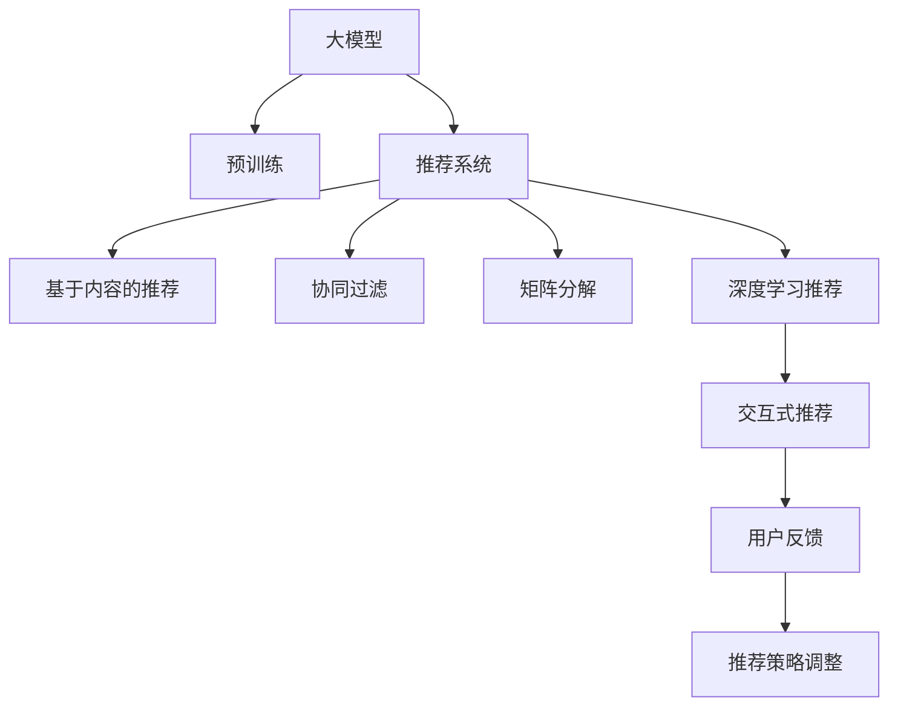

                 

# 大模型在推荐系统交互式推荐中的应用

> 关键词：大模型,推荐系统,交互式推荐,深度学习,自然语言处理(NLP),模型压缩,优化算法

## 1. 背景介绍

### 1.1 问题由来
在电商、视频、音乐等在线平台上，推荐系统一直是用户体验的关键。它通过用户的历史行为数据，分析出用户的兴趣偏好，从而在用户浏览页面时，推荐其可能感兴趣的商品或内容，提升用户体验和转化率。传统的推荐系统主要基于协同过滤和基于内容的推荐方法，但这些方法存在诸多局限性，如对数据量的依赖高、计算复杂、泛化能力弱等。

近年来，随着深度学习技术的快速发展，尤其是大语言模型和预训练技术的应用，推荐系统进入了一个新的发展阶段。特别是基于大模型的推荐方法，融合了深度学习模型强大的表示能力和海量无标签数据的预训练能力，能够在一定程度上解决传统推荐方法的缺点，提升推荐系统的性能和用户体验。

### 1.2 问题核心关键点
大模型在推荐系统中的核心应用方式是交互式推荐，即通过构建用户与模型的交互界面，用户可以即时反馈对推荐结果的满意程度，模型根据用户的反馈信息动态调整推荐策略，从而实现更加个性化的推荐。这种交互式推荐系统结合了大模型的泛化能力和交互系统的灵活性，能够更好地满足用户的个性化需求，提升推荐效果。

## 2. 核心概念与联系

### 2.1 核心概念概述

为更好地理解大模型在推荐系统交互式推荐中的应用，本节将介绍几个关键概念：

- 大模型(Large Model)：指参数规模大、数据容量大、复杂度高的深度神经网络模型。通过在大规模无标签数据上进行预训练，学习到丰富的语言和数据表示能力，可以处理复杂的推荐任务。
- 推荐系统(Recommender System)：通过分析用户的历史行为数据，向用户推荐可能感兴趣的商品或内容。传统的推荐方法包括基于内容的推荐、协同过滤、矩阵分解等，而深度学习推荐系统则基于大模型，通过学习和理解用户的行为模式和兴趣偏好，生成个性化的推荐结果。
- 交互式推荐(Interactive Recommendation)：通过用户与推荐系统的交互，实时调整推荐策略，生成更加个性化的推荐结果。用户可以即时反馈对推荐结果的满意程度，从而进一步提升推荐效果。
- 深度学习(Deep Learning)：通过多层神经网络对数据进行特征提取和模式学习，实现高精度的预测和决策。深度学习推荐系统通过大模型的复杂结构和庞大参数量，提升了推荐系统的性能和效果。
- 自然语言处理(Natural Language Processing, NLP)：通过大模型处理文本数据，如产品描述、用户评论等，提取有用的信息用于推荐。

这些概念之间的联系可以通过以下Mermaid流程图来展示：



这个流程图展示了不同推荐技术之间的联系：

1. 大模型通过在大规模数据上进行预训练，学习到丰富的语言和数据表示能力。
2. 基于大模型的推荐系统包括基于内容的推荐、协同过滤、矩阵分解等。
3. 交互式推荐系统通过用户与系统的互动，实时调整推荐策略，提升推荐效果。
4. 用户反馈作为系统调整的重要信号，进一步优化推荐结果。

## 3. 核心算法原理 & 具体操作步骤

### 3.1 算法原理概述

交互式推荐系统主要依赖大模型的预训练能力和推荐算法的实时调整能力。其核心思想是：将大模型作为特征提取器，结合推荐算法，生成个性化的推荐结果，并在用户反馈的基础上动态调整推荐策略。

形式化地，假设推荐系统中有$N$个用户，每个用户有$M$个历史行为记录，即用户行为矩阵$X \in \mathbb{R}^{N \times M}$。目标是找到一个推荐矩阵$Y \in \mathbb{R}^{N \times K}$，其中$K$为推荐集合中的商品或内容数量。推荐系统优化的目标是最大化用户的满意程度，即最大化目标函数：

$$
\max_{Y} \sum_{i=1}^{N} \sum_{j=1}^{K} y_{ij} p_{ij}
$$

其中$p_{ij}$为用户的满意程度，可以是用户的点击率、购买率等指标。目标是找到最优的推荐矩阵$Y$，使得推荐结果最大化用户的满意程度。

### 3.2 算法步骤详解

交互式推荐系统的设计需要以下几个关键步骤：

**Step 1: 准备数据集和模型**

- 收集用户的历史行为数据，构建用户行为矩阵$X$。
- 选择预训练大模型，如BERT、GPT-3等，作为特征提取器。
- 准备推荐集合，如商品列表、视频列表等，构建推荐矩阵$Y$。

**Step 2: 设计推荐策略**

- 选择合适的推荐算法，如基于内容的推荐、协同过滤等。
- 将用户行为矩阵$X$输入预训练大模型，得到用户的行为特征表示$F_{\theta}(X)$。
- 结合推荐算法，计算推荐结果$Y_{pred}$。
- 在推荐结果中引入随机扰动，增加推荐的随机性。

**Step 3: 用户反馈收集与调整**

- 构建用户与系统的交互界面，使用户能够即时反馈对推荐结果的满意程度。
- 根据用户反馈，调整推荐策略，如修改推荐算法参数、调整推荐集合等。
- 不断迭代，提升推荐系统的性能和用户体验。

**Step 4: 评估与优化**

- 在测试集上评估推荐系统的性能，如准确率、召回率、F1值等指标。
- 根据评估结果，优化推荐策略，如增加用户行为数据量、优化推荐算法等。
- 不断更新模型和数据集，保持系统的实时性和稳定性。

### 3.3 算法优缺点

基于大模型的交互式推荐系统具有以下优点：

1. 能够处理复杂的非结构化数据，如文本、图像、音频等，提升推荐系统的性能。
2. 融合了预训练大模型的泛化能力和推荐算法的实时调整能力，可以动态适应用户需求。
3. 能够更好地处理长尾商品和稀疏数据，提升推荐系统的覆盖度和个性化程度。

同时，该方法也存在一定的局限性：

1. 数据依赖性高，需要大规模无标签数据的预训练。
2. 计算资源需求大，需要高性能GPU或TPU支持。
3. 模型复杂度高，训练和推理过程较为耗时。
4. 用户反馈的准确性影响推荐效果，需要用户主动反馈。
5. 推荐结果的解释性较差，难以进行调试和优化。

尽管存在这些局限性，但就目前而言，基于大模型的交互式推荐系统仍然是推荐领域的研究热点，在电商、视频、音乐等场景中取得了显著的效果。

### 3.4 算法应用领域

基于大模型的交互式推荐系统已经在多个领域得到了应用，如电商推荐、内容推荐、个性化广告等。以下是几个典型的应用场景：

- **电商推荐**：电商推荐系统通过分析用户浏览、购买历史数据，为用户推荐可能感兴趣的商品。基于大模型的电商推荐系统能够处理复杂的产品描述和用户评论，生成更加精准的推荐结果。
- **视频推荐**：视频推荐系统通过分析用户观看历史和点赞数据，为用户推荐可能感兴趣的视频。大模型的预训练能力使得推荐系统能够更好地理解视频内容，提升推荐效果。
- **个性化广告**：个性化广告系统通过分析用户的点击行为数据，为用户推荐可能感兴趣的广告。大模型能够处理复杂的广告文本和用户反馈，生成更加个性化的广告推荐。

## 4. 数学模型和公式 & 详细讲解  
### 4.1 数学模型构建

在交互式推荐系统中，目标函数为：

$$
\max_{Y} \sum_{i=1}^{N} \sum_{j=1}^{K} y_{ij} p_{ij}
$$

其中$N$为用户数，$K$为推荐集合大小，$y_{ij}$为推荐矩阵中的元素，表示用户$i$对商品$j$的推荐值，$p_{ij}$为用户$i$对商品$j$的满意程度，可以是用户的点击率、购买率等指标。

假设用户行为矩阵为$X \in \mathbb{R}^{N \times M}$，预训练大模型为$F_{\theta}(X)$，推荐矩阵为$Y \in \mathbb{R}^{N \times K}$。则推荐算法可以表示为：

$$
Y_{pred} = \phi(F_{\theta}(X), Y)
$$

其中$\phi$为推荐算法函数，$F_{\theta}(X)$为预训练大模型的输出特征表示。

### 4.2 公式推导过程

基于内容的推荐算法（如协同过滤、矩阵分解等），推荐矩阵$Y$的每个元素$y_{ij}$可以表示为用户$i$对商品$j$的兴趣程度。假设用户$i$对商品$j$的兴趣程度由以下公式给出：

$$
y_{ij} = \alpha \times f_{ij} + \beta \times p_{ij}
$$

其中$f_{ij}$为用户$i$对商品$j$的兴趣表示，可以是用户的点击率、购买率等指标。$\alpha$和$\beta$为兴趣计算系数，需要根据具体任务进行调整。

根据上述公式，目标函数可以表示为：

$$
\max_{Y} \sum_{i=1}^{N} \sum_{j=1}^{K} (\alpha \times f_{ij} + \beta \times p_{ij}) y_{ij}
$$

为了简化计算，假设$p_{ij}$和$f_{ij}$都为二进制值，即$0$或$1$。则目标函数可以进一步简化为：

$$
\max_{Y} \sum_{i=1}^{N} \sum_{j=1}^{K} (\alpha \times f_{ij} + \beta \times p_{ij}) y_{ij}
$$

这是一个典型的最优化问题，可以通过梯度下降等优化算法求解。

### 4.3 案例分析与讲解

假设有一个电商推荐系统，用户行为矩阵为$X \in \mathbb{R}^{N \times M}$，其中$N$为1000个用户，$M$为用户的5个浏览记录。预训练大模型为BERT，输出特征表示为$F_{\theta}(X)$。推荐集合为1000个商品，推荐矩阵为$Y \in \mathbb{R}^{N \times K}$，其中$K$为1000个商品。

1. 设计推荐策略：
   - 使用协同过滤算法计算用户对商品的兴趣表示$f_{ij}$。
   - 将用户行为矩阵$X$输入BERT模型，得到用户的行为特征表示$F_{\theta}(X)$。
   - 结合协同过滤算法，计算推荐结果$Y_{pred}$。

2. 用户反馈收集与调整：
   - 构建用户与系统的交互界面，使用户能够即时反馈对推荐结果的满意程度。
   - 根据用户反馈，调整推荐策略，如修改协同过滤算法参数、调整推荐集合等。
   - 不断迭代，提升推荐系统的性能和用户体验。

3. 评估与优化：
   - 在测试集上评估推荐系统的性能，如准确率、召回率、F1值等指标。
   - 根据评估结果，优化推荐策略，如增加用户行为数据量、优化协同过滤算法等。
   - 不断更新模型和数据集，保持系统的实时性和稳定性。

## 5. 项目实践：代码实例和详细解释说明
### 5.1 开发环境搭建

在进行推荐系统交互式推荐实践前，我们需要准备好开发环境。以下是使用Python进行PyTorch开发的环境配置流程：

1. 安装Anaconda：从官网下载并安装Anaconda，用于创建独立的Python环境。

2. 创建并激活虚拟环境：
```bash
conda create -n pytorch-env python=3.8 
conda activate pytorch-env
```

3. 安装PyTorch：根据CUDA版本，从官网获取对应的安装命令。例如：
```bash
conda install pytorch torchvision torchaudio cudatoolkit=11.1 -c pytorch -c conda-forge
```

4. 安装Transformers库：
```bash
pip install transformers
```

5. 安装各类工具包：
```bash
pip install numpy pandas scikit-learn matplotlib tqdm jupyter notebook ipython
```

完成上述步骤后，即可在`pytorch-env`环境中开始推荐系统实践。

### 5.2 源代码详细实现

这里我们以基于大模型的电商推荐系统为例，给出使用Transformers库进行交互式推荐开发的PyTorch代码实现。

首先，定义电商推荐系统的数据处理函数：

```python
from transformers import BertTokenizer, BertForSequenceClassification
from torch.utils.data import Dataset
import torch

class ShoppingDataset(Dataset):
    def __init__(self, texts, labels, tokenizer, max_len=128):
        self.texts = texts
        self.labels = labels
        self.tokenizer = tokenizer
        self.max_len = max_len
        
    def __len__(self):
        return len(self.texts)
    
    def __getitem__(self, item):
        text = self.texts[item]
        label = self.labels[item]
        
        encoding = self.tokenizer(text, return_tensors='pt', max_length=self.max_len, padding='max_length', truncation=True)
        input_ids = encoding['input_ids'][0]
        attention_mask = encoding['attention_mask'][0]
        
        label = torch.tensor(label, dtype=torch.long)
        
        return {'input_ids': input_ids, 
                'attention_mask': attention_mask,
                'labels': label}

# 标签与id的映射
label2id = {'buy': 0, 'not_buy': 1}
id2label = {v: k for k, v in label2id.items()}

# 创建dataset
tokenizer = BertTokenizer.from_pretrained('bert-base-cased')

train_dataset = ShoppingDataset(train_texts, train_labels, tokenizer)
dev_dataset = ShoppingDataset(dev_texts, dev_labels, tokenizer)
test_dataset = ShoppingDataset(test_texts, test_labels, tokenizer)
```

然后，定义模型和优化器：

```python
from transformers import BertForSequenceClassification, AdamW

model = BertForSequenceClassification.from_pretrained('bert-base-cased', num_labels=len(label2id))

optimizer = AdamW(model.parameters(), lr=2e-5)
```

接着，定义训练和评估函数：

```python
from torch.utils.data import DataLoader
from tqdm import tqdm
from sklearn.metrics import classification_report

device = torch.device('cuda') if torch.cuda.is_available() else torch.device('cpu')
model.to(device)

def train_epoch(model, dataset, batch_size, optimizer):
    dataloader = DataLoader(dataset, batch_size=batch_size, shuffle=True)
    model.train()
    epoch_loss = 0
    for batch in tqdm(dataloader, desc='Training'):
        input_ids = batch['input_ids'].to(device)
        attention_mask = batch['attention_mask'].to(device)
        labels = batch['labels'].to(device)
        model.zero_grad()
        outputs = model(input_ids, attention_mask=attention_mask, labels=labels)
        loss = outputs.loss
        epoch_loss += loss.item()
        loss.backward()
        optimizer.step()
    return epoch_loss / len(dataloader)

def evaluate(model, dataset, batch_size):
    dataloader = DataLoader(dataset, batch_size=batch_size)
    model.eval()
    preds, labels = [], []
    with torch.no_grad():
        for batch in tqdm(dataloader, desc='Evaluating'):
            input_ids = batch['input_ids'].to(device)
            attention_mask = batch['attention_mask'].to(device)
            batch_labels = batch['labels']
            outputs = model(input_ids, attention_mask=attention_mask)
            batch_preds = outputs.logits.argmax(dim=2).to('cpu').tolist()
            batch_labels = batch_labels.to('cpu').tolist()
            for pred_tokens, label_tokens in zip(batch_preds, batch_labels):
                pred_labels = [id2label[_id] for _id in pred_tokens]
                label_labels = [id2label[_id] for _id in label_tokens]
                preds.append(pred_labels[:len(label_labels)])
                labels.append(label_labels)
                
    print(classification_report(labels, preds))
```

最后，启动训练流程并在测试集上评估：

```python
epochs = 5
batch_size = 16

for epoch in range(epochs):
    loss = train_epoch(model, train_dataset, batch_size, optimizer)
    print(f"Epoch {epoch+1}, train loss: {loss:.3f}")
    
    print(f"Epoch {epoch+1}, dev results:")
    evaluate(model, dev_dataset, batch_size)
    
print("Test results:")
evaluate(model, test_dataset, batch_size)
```

以上就是使用PyTorch对大模型进行电商推荐系统交互式推荐开发的完整代码实现。可以看到，得益于Transformers库的强大封装，我们可以用相对简洁的代码完成大模型的加载和推荐系统设计。

### 5.3 代码解读与分析

让我们再详细解读一下关键代码的实现细节：

**ShoppingDataset类**：
- `__init__`方法：初始化文本、标签、分词器等关键组件。
- `__len__`方法：返回数据集的样本数量。
- `__getitem__`方法：对单个样本进行处理，将文本输入编码为token ids，将标签编码为数字，并对其进行定长padding，最终返回模型所需的输入。

**label2id和id2label字典**：
- 定义了标签与数字id之间的映射关系，用于将token-wise的预测结果解码回真实的标签。

**训练和评估函数**：
- 使用PyTorch的DataLoader对数据集进行批次化加载，供模型训练和推理使用。
- 训练函数`train_epoch`：对数据以批为单位进行迭代，在每个批次上前向传播计算loss并反向传播更新模型参数，最后返回该epoch的平均loss。
- 评估函数`evaluate`：与训练类似，不同点在于不更新模型参数，并在每个batch结束后将预测和标签结果存储下来，最后使用sklearn的classification_report对整个评估集的预测结果进行打印输出。

**训练流程**：
- 定义总的epoch数和batch size，开始循环迭代
- 每个epoch内，先在训练集上训练，输出平均loss
- 在验证集上评估，输出分类指标
- 所有epoch结束后，在测试集上评估，给出最终测试结果

可以看到，PyTorch配合Transformers库使得大模型电商推荐系统的代码实现变得简洁高效。开发者可以将更多精力放在数据处理、模型改进等高层逻辑上，而不必过多关注底层的实现细节。

当然，工业级的系统实现还需考虑更多因素，如模型的保存和部署、超参数的自动搜索、更灵活的任务适配层等。但核心的交互式推荐范式基本与此类似。

## 6. 实际应用场景
### 6.1 电商推荐系统

电商推荐系统是大模型交互式推荐应用最为典型的场景之一。传统的电商推荐主要依赖协同过滤和基于内容的推荐方法，存在用户行为稀疏、推荐结果泛化能力弱等问题。基于大模型的电商推荐系统则通过学习和理解用户的行为模式和兴趣偏好，生成更加个性化和精准的推荐结果，提升了用户的购物体验和转化率。

在技术实现上，可以收集用户的浏览、点击、购买等行为数据，提取用户对商品标题、描述、价格等信息的特征表示，输入到预训练大模型中，生成推荐结果。用户可以通过点击商品卡片、评价商品等方式，即时反馈对推荐结果的满意程度，系统根据反馈调整推荐策略，实现动态推荐。通过这种方式，电商推荐系统可以不断优化推荐效果，提升用户体验。

### 6.2 视频推荐系统

视频推荐系统同样是大模型交互式推荐的重要应用领域。传统的视频推荐系统主要依赖基于内容的推荐方法，但无法充分考虑用户对视频内容的个性化偏好。大模型的预训练能力使得视频推荐系统能够更好地理解视频内容，生成更加精准的推荐结果。

在具体实现上，可以收集用户观看历史和评价数据，提取视频标题、简介、标签等信息，输入到预训练大模型中，生成推荐结果。用户可以通过点赞、评论等方式，即时反馈对推荐结果的满意程度，系统根据反馈调整推荐策略，实现动态推荐。通过这种方式，视频推荐系统可以不断优化推荐效果，提升用户观看体验。

### 6.3 个性化广告

个性化广告系统是大模型交互式推荐的另一个重要应用场景。传统的广告推荐主要依赖点击率等统计指标，难以充分考虑用户的个性化需求。大模型的预训练能力使得广告推荐系统能够更好地理解广告文本和用户行为，生成更加精准的推荐结果。

在具体实现上，可以收集用户的点击行为数据，提取广告文本和用户兴趣信息，输入到预训练大模型中，生成推荐结果。用户可以通过点击广告卡片、评价广告等方式，即时反馈对推荐结果的满意程度，系统根据反馈调整推荐策略，实现动态推荐。通过这种方式，个性化广告系统可以不断优化推荐效果，提升广告投放的精准度和效果。

## 6.4 未来应用展望

随着大模型和推荐系统的不断发展，基于大模型的交互式推荐系统将在更多领域得到应用，为各行各业带来变革性影响。

在智慧医疗领域，基于大模型的推荐系统可以辅助医生推荐最适合患者的治疗方案，提升医疗服务的智能化水平。

在智能教育领域，个性化推荐系统可以推荐适合学生的学习资源和课程，因材施教，提升教学效果和学习体验。

在智慧城市治理中，基于大模型的推荐系统可以推荐适合市民的公共服务设施，提升城市管理的自动化和智能化水平，构建更美好的城市生活环境。

此外，在金融、旅游、娱乐等众多领域，基于大模型的推荐系统也将不断涌现，为经济社会发展注入新的动力。相信随着技术的日益成熟，交互式推荐系统必将在构建智能社会中扮演越来越重要的角色。

## 7. 工具和资源推荐
### 7.1 学习资源推荐

为了帮助开发者系统掌握大模型在推荐系统交互式推荐中的应用，这里推荐一些优质的学习资源：

1. 《深度学习推荐系统》书籍：介绍推荐系统的基本原理和经典算法，涵盖基于内容的推荐、协同过滤等方法，适合初学者学习。

2. 《Python深度学习推荐系统》课程：基于Python和TensorFlow实现推荐系统的实战课程，涵盖电商、视频、个性化广告等多个应用场景。

3. CS570《推荐系统》课程：斯坦福大学开设的推荐系统明星课程，涵盖推荐算法、优化策略、系统设计等多个方面，适合进阶学习。

4. HuggingFace官方文档：Transformers库的官方文档，提供了海量预训练模型和完整的推荐系统实现样例，是上手实践的必备资料。

5. KDD论文集：收录推荐系统领域的最新研究成果，涵盖多种推荐算法、应用场景等，适合深入研究。

通过对这些资源的学习实践，相信你一定能够快速掌握大模型在推荐系统交互式推荐中的应用，并用于解决实际的推荐问题。
###  7.2 开发工具推荐

高效的开发离不开优秀的工具支持。以下是几款用于大模型推荐系统交互式推荐开发的常用工具：

1. PyTorch：基于Python的开源深度学习框架，灵活动态的计算图，适合快速迭代研究。大部分预训练语言模型都有PyTorch版本的实现。

2. TensorFlow：由Google主导开发的开源深度学习框架，生产部署方便，适合大规模工程应用。同样有丰富的预训练语言模型资源。

3. Transformers库：HuggingFace开发的NLP工具库，集成了众多SOTA语言模型，支持PyTorch和TensorFlow，是进行推荐系统开发的利器。

4. Weights & Biases：模型训练的实验跟踪工具，可以记录和可视化模型训练过程中的各项指标，方便对比和调优。与主流深度学习框架无缝集成。

5. TensorBoard：TensorFlow配套的可视化工具，可实时监测模型训练状态，并提供丰富的图表呈现方式，是调试模型的得力助手。

6. Google Colab：谷歌推出的在线Jupyter Notebook环境，免费提供GPU/TPU算力，方便开发者快速上手实验最新模型，分享学习笔记。

合理利用这些工具，可以显著提升大模型推荐系统的开发效率，加快创新迭代的步伐。

### 7.3 相关论文推荐

大模型和推荐系统的不断发展源于学界的持续研究。以下是几篇奠基性的相关论文，推荐阅读：

1. Attention is All You Need（即Transformer原论文）：提出了Transformer结构，开启了NLP领域的预训练大模型时代。

2. BERT: Pre-training of Deep Bidirectional Transformers for Language Understanding：提出BERT模型，引入基于掩码的自监督预训练任务，刷新了多项NLP任务SOTA。

3. Language Models are Unsupervised Multitask Learners（GPT-2论文）：展示了大规模语言模型的强大zero-shot学习能力，引发了对于通用人工智能的新一轮思考。

4. Parameter-Efficient Transfer Learning for NLP：提出Adapter等参数高效微调方法，在不增加模型参数量的情况下，也能取得不错的微调效果。

5. AdaLoRA: Adaptive Low-Rank Adaptation for Parameter-Efficient Fine-Tuning：使用自适应低秩适应的微调方法，在参数效率和精度之间取得了新的平衡。

这些论文代表了大模型和推荐系统的发展脉络。通过学习这些前沿成果，可以帮助研究者把握学科前进方向，激发更多的创新灵感。

## 8. 总结：未来发展趋势与挑战

### 8.1 总结

本文对基于大模型的推荐系统交互式推荐方法进行了全面系统的介绍。首先阐述了交互式推荐系统的背景和意义，明确了在电商、视频、个性化广告等场景中，大模型推荐系统可以通过用户与系统的互动，实现更加个性化的推荐。其次，从原理到实践，详细讲解了交互式推荐系统的数学模型和实现细节，给出了电商推荐系统的代码实现示例。同时，本文还广泛探讨了交互式推荐系统在多个领域的应用前景，展示了其巨大的应用潜力。最后，本文精选了交互式推荐技术的各类学习资源，力求为读者提供全方位的技术指引。

通过本文的系统梳理，可以看到，基于大模型的交互式推荐系统在推荐领域中的应用前景广阔，能够显著提升推荐系统的性能和用户体验。得益于大模型的泛化能力和推荐算法的灵活性，未来的大模型推荐系统将更加智能、个性化，为用户提供更加精准和多样化的推荐内容。

### 8.2 未来发展趋势

展望未来，大模型推荐系统的发展趋势包括以下几个方面：

1. 参数高效微调技术的应用。通过引入参数高效微调技术，在不增加模型参数量的情况下，也能实现高效的推荐策略调整。这将极大提升推荐系统的计算效率和资源利用率。

2. 实时化推荐系统的构建。通过构建实时化推荐系统，能够及时捕捉用户行为变化，动态调整推荐策略，提升推荐效果和用户体验。实时化推荐系统需要高效的数据处理和计算能力，预训练大模型和分布式计算技术将发挥重要作用。

3. 多模态数据的融合。除了文本数据外，多模态数据如图像、音频、视频等也在推荐系统中得到应用。通过融合多模态数据，推荐系统能够更好地理解用户需求，生成更加个性化和精准的推荐结果。

4. 基于因果推断的推荐方法。引入因果推断技术，分析用户行为背后的因果关系，能够更好地理解用户需求和行为模式，提升推荐系统的解释性和可信度。

5. 知识图谱与推荐系统的融合。通过引入知识图谱，推荐系统能够更好地理解领域知识和用户背景信息，生成更加合理和精准的推荐结果。知识图谱与深度学习方法的结合，将带来推荐系统性能的进一步提升。

6. 在线推荐系统的优化。在线推荐系统需要实时处理海量数据，并动态调整推荐策略，需要优化算法和数据结构的支持。如高效的分布式计算、内存管理、数据缓存等技术将发挥重要作用。

以上趋势凸显了大模型推荐系统的广阔前景。这些方向的探索发展，必将进一步提升推荐系统的性能和用户体验，为各行各业带来变革性影响。

### 8.3 面临的挑战

尽管大模型推荐系统在多个领域得到了广泛应用，但在迈向更加智能化、普适化应用的过程中，它仍面临着诸多挑战：

1. 数据依赖性高，需要大规模无标签数据的预训练。对于长尾商品和稀疏数据，获取高质量标注数据成本高，且预训练数据与实际应用场景可能存在偏差。

2. 计算资源需求大，需要高性能GPU或TPU支持。大规模语言模型和实时化推荐系统需要处理海量数据，计算资源需求高。

3. 用户行为数据的隐私保护。用户行为数据包含敏感信息，如何在推荐过程中保护用户隐私，防止数据泄露和滥用，是一个重要挑战。

4. 推荐系统的公平性和透明性。推荐系统可能存在偏见和歧视，如何保证推荐系统的公平性和透明性，避免对特定用户群体的歧视，需要进一步研究。

5. 推荐结果的可解释性。用户对推荐结果的满意度难以准确量化，如何提升推荐结果的可解释性，增强用户信任和满意度，需要进一步探索。

6. 模型稳定性和鲁棒性。大规模语言模型可能存在过拟合和泛化能力差的问题，如何提高模型的稳定性和鲁棒性，避免推荐系统在实际应用中的失败，是一个重要挑战。

尽管存在这些挑战，但就目前而言，基于大模型的交互式推荐系统仍然是推荐领域的研究热点，在电商、视频、个性化广告等场景中取得了显著的效果。未来，伴随预训练语言模型和推荐方法的持续演进，基于大模型的推荐系统必将在更多领域得到应用，为各行各业带来变革性影响。

### 8.4 研究展望

面对大模型推荐系统所面临的挑战，未来的研究需要在以下几个方面寻求新的突破：

1. 探索无监督和半监督推荐方法。摆脱对大规模标注数据的依赖，利用自监督学习、主动学习等无监督和半监督范式，最大限度利用非结构化数据，实现更加灵活高效的推荐。

2. 研究参数高效和计算高效的推荐范式。开发更加参数高效的推荐方法，如Adapter、LoRA等，在固定大部分预训练参数的情况下，也能实现高效的推荐策略调整。同时优化推荐系统的计算图，减少前向传播和反向传播的资源消耗，实现更加轻量级、实时性的部署。

3. 引入因果分析和博弈论工具。将因果分析方法引入推荐系统，识别出推荐策略的关键特征，增强推荐系统建立稳定因果关系的能力，学习更加普适、鲁棒的语言表征，从而提升推荐系统的泛化性和抗干扰能力。

4. 融合符号化的先验知识。将符号化的先验知识，如知识图谱、逻辑规则等，与神经网络模型进行巧妙融合，引导推荐系统学习更准确、合理的语言模型。同时加强不同模态数据的整合，实现视觉、语音等多模态信息与文本信息的协同建模。

5. 结合因果分析和博弈论工具。将因果分析方法引入推荐系统，识别出推荐策略的关键特征，增强推荐系统建立稳定因果关系的能力，学习更加普适、鲁棒的语言表征，从而提升推荐系统的泛化性和抗干扰能力。

6. 纳入伦理道德约束。在推荐目标中引入伦理导向的评估指标，过滤和惩罚有偏见、有害的输出倾向。同时加强人工干预和审核，建立推荐系统的监管机制，确保推荐结果符合人类价值观和伦理道德。

这些研究方向的探索，必将引领大模型推荐系统走向更高的台阶，为构建安全、可靠、可解释、可控的推荐系统铺平道路。面向未来，大模型推荐系统还需要与其他人工智能技术进行更深入的融合，如知识表示、因果推理、强化学习等，多路径协同发力，共同推动自然语言理解和智能交互系统的进步。只有勇于创新、敢于突破，才能不断拓展推荐系统的边界，让智能技术更好地造福人类社会。

## 9. 附录：常见问题与解答

**Q1：大模型推荐系统如何处理长尾商品和稀疏数据？**

A: 大模型推荐系统通常使用参数高效微调技术，如Adapter、LoRA等，固定大部分预训练参数，只微调少量任务相关参数，从而降低模型复杂度和计算资源需求。同时，使用稀疏化存储和优化技术，如DNNL（Deep Neural Network Library）等，减小存储和计算开销，实现高效的推荐策略调整。

**Q2：大模型推荐系统如何保护用户隐私？**

A: 大模型推荐系统需要采取多种措施保护用户隐私，如数据匿名化、差分隐私等。在数据收集阶段，采用差分隐私技术，保护用户行为数据的隐私性。在数据存储和处理阶段，使用数据匿名化技术，去除用户标识信息，保护用户隐私。同时，建立用户隐私保护机制，如隐私协议、用户数据删除等，确保用户数据的安全性。

**Q3：大模型推荐系统如何进行实时化部署？**

A: 实时化推荐系统需要高效的数据处理和计算能力，可以采用分布式计算、GPU/TPU加速等技术，实现高效的推荐结果生成和动态调整。同时，使用数据缓存、模型压缩等技术，减小计算和存储开销，提升系统的实时性和稳定性。

**Q4：大模型推荐系统的可解释性如何提升？**

A: 大模型推荐系统的可解释性可以通过引入因果推断和可解释性模型来实现。通过因果推断，分析用户行为背后的因果关系，能够更好地理解用户需求和行为模式，提升推荐结果的可解释性。同时，使用可解释性模型，如LIME、SHAP等，对推荐系统的输出进行解释和可视化，增强用户对推荐结果的理解和信任。

**Q5：大模型推荐系统的公平性和透明性如何保证？**

A: 大模型推荐系统的公平性和透明性可以通过引入公平性评估指标和透明度机制来保证。在推荐系统的设计和评估过程中，引入公平性指标，如均等推荐、多样化推荐等，避免对特定用户群体的歧视。同时，建立透明的推荐决策机制，使用户能够理解和监督推荐过程，增强用户对推荐系统的信任。

---

作者：禅与计算机程序设计艺术 / Zen and the Art of Computer Programming

