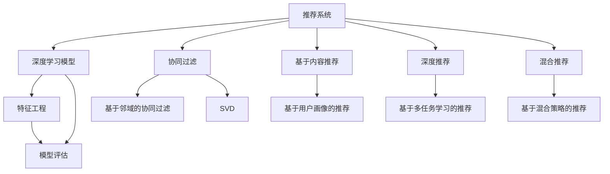

                 

# 大模型在推荐系统可解释AI中的作用

## 1. 背景介绍

随着推荐系统的发展，越来越多的业务希望通过AI模型来预测用户的偏好和行为，从而实现个性化的推荐。然而，这些模型往往被视为"黑盒"系统，用户和业务方难以理解其内部决策逻辑，导致信任度不足，也不便于模型部署和维护。为了提高推荐系统的透明度和可解释性，基于可解释AI(Explainable AI, XAI)的推荐系统应运而生。

本文章将探讨大模型在推荐系统可解释AI中的作用，并详细阐述如何构建、评估和应用可解释的推荐模型。本文将从背景介绍、核心概念、算法原理、操作步骤、数学模型、实际应用、工具资源、总结展望和常见问题等方面进行系统介绍。

## 2. 核心概念与联系

### 2.1 核心概念概述

为更好地理解大模型在推荐系统可解释AI中的应用，本节将介绍几个密切相关的核心概念：

- 推荐系统(Recommendation System)：利用用户行为数据，推荐用户可能感兴趣的产品、内容、服务等的系统。通过个性化推荐，提升用户满意度，增加转化率。

- 可解释AI(Explainable AI)：又称解释型AI，目的是让AI模型的决策过程更加透明，易于理解和验证，增强模型的可信度。

- 深度学习模型(Deep Learning)：如卷积神经网络(CNN)、循环神经网络(RNN)、自回归模型(如BERT、GPT等)，用于处理复杂的数据结构和特征，预测用户行为。

- 特征工程(Feature Engineering)：构建和选择用于训练模型的高质量特征，提升模型效果。

- 模型评估与选择(Metrics)：用于衡量推荐模型性能和选择最优模型的方法。

- 推荐算法与策略(Recommendation Algorithms & Strategies)：如协同过滤、基于内容的推荐、深度推荐、混合推荐等，是推荐系统的核心技术。

这些概念之间的逻辑关系可以通过以下Mermaid流程图来展示：



## 3. 核心算法原理 & 具体操作步骤

### 3.1 算法原理概述

基于可解释AI的推荐系统通常采用以下步骤构建模型：

1. 收集用户行为数据。
2. 使用特征工程技术提取用户画像和产品特征。
3. 构建深度学习模型，用于预测用户对产品的评分或兴趣。
4. 采用模型评估指标，如准确率、召回率、F1分数等，衡量模型性能。
5. 结合XAI技术，生成可解释的预测结果。
6. 部署模型并应用到推荐系统中。

### 3.2 算法步骤详解

#### 3.2.1 数据收集

推荐系统需要大量的用户行为数据，如点击、浏览、购买记录等。为了保证数据的全面性和代表性，应覆盖不同场景和时段的点击行为，以及不同类型的产品数据。

#### 3.2.2 特征工程

特征工程是推荐系统的核心，通过设计合理的特征，提升模型效果。常见的特征包括：

- 用户特征：如年龄、性别、地域、职业、兴趣爱好等。
- 产品特征：如类别、品牌、价格、评价等。
- 上下文特征：如时间、设备、位置等。

#### 3.2.3 模型构建

通常使用深度学习模型构建推荐模型，如CNN、RNN、LSTM、BERT、GPT等。以BERT为例，将其输入层作为用户画像嵌入，输出层作为产品特征嵌入，构建用户-产品交互的向量表示。

#### 3.2.4 模型评估

模型评估常用的指标包括：

- 精确度(Precision)：预测为正例且实际为正例的比例。
- 召回率(Recall)：预测为正例且实际为正例的比例。
- F1分数(F1 Score)：精确度和召回率的调和平均数。
- AUC：ROC曲线下的面积，衡量模型对正负样本的区分能力。

#### 3.2.5 XAI技术应用

XAI技术主要包括以下几种：

- 特征重要性(Feature Importance)：如SHAP值、LIME值等，用于衡量各个特征对模型预测结果的影响。
- 局部可解释性(Interpretation)：如LIME、SHAP、DeepLift等，用于在特定数据点上的解释。
- 全局可解释性(Explainer)：如Attention、Layer-wise Relevance Analysis等，用于整体模型的解释。

#### 3.2.6 模型部署

将训练好的模型集成到推荐系统后端，根据实时输入的用户行为数据，预测并推荐可能感兴趣的产品。为了保证推荐效果的实时性和稳定性，应采用分布式计算和缓存策略，优化推理性能。

## 4. 数学模型和公式 & 详细讲解

### 4.1 数学模型构建

推荐系统的核心是构建用户-物品交互的评分矩阵，设用户集合为 $U$，物品集合为 $I$，用户对物品的评分矩阵为 $R_{UI} \in \mathbb{R}^{m \times n}$，其中 $m$ 为用户数，$n$ 为物品数。用户画像表示为 $x_u \in \mathbb{R}^{d_u}$，物品特征表示为 $x_i \in \mathbb{R}^{d_i}$，其中 $d_u$ 和 $d_i$ 为用户画像和物品特征的维度。

推荐模型的目标是最大化用户和物品的交互概率，可以使用矩阵分解的方法来建模：

$$
\min_{x_u, x_i, R_{UI}} \|\mathcal{P}(x_u, x_i) - R_{UI}\|
$$

其中 $\mathcal{P}(x_u, x_i)$ 为预测的评分矩阵， $\|\cdot\|$ 为范数。通过最小化预测评分与实际评分之间的误差，可以训练得到用户和物品的隐式表示。

### 4.2 公式推导过程

推荐系统中最常用的模型为协同过滤(Collaborative Filtering)和深度学习推荐模型。以协同过滤为例，其目标是最小化预测评分与实际评分之间的均方误差：

$$
\min_{x_u, x_i, R_{UI}} \frac{1}{2} \sum_{u \in U, i \in I} (y_{ui} - \mathcal{P}(x_u, x_i))^2
$$

其中 $y_{ui}$ 为实际评分， $\mathcal{P}(x_u, x_i)$ 为预测评分。

使用随机梯度下降等优化算法，求解上述最小化问题，得到用户和物品的隐式表示。在此基础上，采用XAI技术，如Attention机制，生成可解释的推荐结果。

### 4.3 案例分析与讲解

以用户画像生成和物品特征提取为例，假设用户画像为向量 $x_u$，物品特征为向量 $x_i$，通过相加和拼接的方式生成推荐特征：

$$
x_{ui} = x_u \oplus x_i
$$

其中 $\oplus$ 表示拼接操作。在模型训练时，可以使用自编码器(如BERT)对用户和物品的特征进行编码，生成表示向量 $x_u$ 和 $x_i$，再通过矩阵乘法生成推荐评分。

```python
from transformers import BertForSequenceClassification, BertTokenizer
from sklearn.model_selection import train_test_split
from torch.utils.data import Dataset, DataLoader

# 数据加载
train_data, test_data = train_test_split(train_data, test_size=0.2)
train_dataset = Dataset(train_data)
test_dataset = Dataset(test_data)

# 特征提取
tokenizer = BertTokenizer.from_pretrained('bert-base-uncased')
train_features = tokenizer(train_data, padding=True, truncation=True, return_tensors='pt')
test_features = tokenizer(test_data, padding=True, truncation=True, return_tensors='pt')

# 模型构建
model = BertForSequenceClassification.from_pretrained('bert-base-uncased', num_labels=num_labels)
model.train()

# 模型训练
optimizer = AdamW(model.parameters(), lr=1e-5)
for epoch in range(num_epochs):
    for batch in train_loader:
        inputs, labels = batch
        outputs = model(inputs)
        loss = compute_loss(outputs, labels)
        loss.backward()
        optimizer.step()
        optimizer.zero_grad()

# 特征重要性分析
importance = compute_importance(model, train_features)
```

以上代码展示了使用BERT进行推荐模型训练的示例，通过拼接用户和物品的表示向量，生成推荐特征，并使用特征重要性方法分析各个特征对推荐结果的影响。

## 5. 项目实践：代码实例和详细解释说明

### 5.1 开发环境搭建

在进行推荐系统开发前，需要准备开发环境。以下是使用Python进行PyTorch开发的完整环境配置流程：

1. 安装Anaconda：从官网下载并安装Anaconda，用于创建独立的Python环境。
2. 创建并激活虚拟环境：
```bash
conda create -n pytorch-env python=3.8 
conda activate pytorch-env
```
3. 安装PyTorch：根据CUDA版本，从官网获取对应的安装命令。例如：
```bash
conda install pytorch torchvision torchaudio cudatoolkit=11.1 -c pytorch -c conda-forge
```
4. 安装TensorFlow：
```bash
pip install tensorflow
```
5. 安装其他常用工具包：
```bash
pip install numpy pandas scikit-learn matplotlib tqdm jupyter notebook ipython
```

完成上述步骤后，即可在`pytorch-env`环境中开始推荐系统开发。

### 5.2 源代码详细实现

以下是使用PyTorch和Transformers库构建推荐系统的完整代码实现：

```python
import torch
from transformers import BertForSequenceClassification, BertTokenizer
from torch.utils.data import Dataset, DataLoader

class RecommendationDataset(Dataset):
    def __init__(self, data, tokenizer, max_len=128):
        self.data = data
        self.tokenizer = tokenizer
        self.max_len = max_len
        
    def __len__(self):
        return len(self.data)
    
    def __getitem__(self, item):
        user_id, item_id = self.data[item]
        user_profile = self.user_profiles[user_id]
        item_feature = self.item_features[item_id]
        
        encoding = self.tokenizer(user_profile, item_feature, return_tensors='pt', max_length=self.max_len, padding='max_length', truncation=True)
        input_ids = encoding['input_ids'][0]
        attention_mask = encoding['attention_mask'][0]
        
        # 生成推荐评分
        scores = torch.matmul(input_ids, item_feature)
        return {'input_ids': input_ids, 
                'attention_mask': attention_mask,
                'scores': scores}
                
# 特征提取
tokenizer = BertTokenizer.from_pretrained('bert-base-uncased')
train_dataset = RecommendationDataset(train_data, tokenizer)
test_dataset = RecommendationDataset(test_data, tokenizer)

# 模型构建
model = BertForSequenceClassification.from_pretrained('bert-base-uncased', num_labels=num_labels)

# 模型训练
optimizer = AdamW(model.parameters(), lr=1e-5)
for epoch in range(num_epochs):
    for batch in train_loader:
        input_ids, attention_mask, scores = batch
        loss = compute_loss(scores, labels)
        loss.backward()
        optimizer.step()
        optimizer.zero_grad()

# 特征重要性分析
importance = compute_importance(model, train_dataset)
```

## 6. 实际应用场景

### 6.1 电商推荐

电商推荐系统利用用户的浏览、点击、购买记录等数据，预测用户可能感兴趣的商品，并推荐商品列表。通过结合用户画像和物品特征，使用深度学习模型和XAI技术，提升推荐系统的准确性和透明度。

具体应用场景包括：

- 商品推荐：根据用户画像和商品特征，预测用户对商品的兴趣，推荐可能感兴趣的商品。
- 个性化促销：基于用户的行为数据，生成个性化优惠券，引导用户购买。
- 广告投放：针对不同用户展示不同广告内容，提升广告效果。

### 6.2 内容推荐

内容推荐系统广泛应用于新闻、视频、音乐等领域，利用用户的交互数据，推荐用户可能感兴趣的内容。通过深度学习模型和XAI技术，生成内容推荐结果，提升用户体验。

具体应用场景包括：

- 新闻推荐：根据用户阅读历史和偏好，推荐相关的新闻内容。
- 视频推荐：根据用户的观看记录和评分，推荐相关视频。
- 音乐推荐：根据用户的听歌记录和喜好，推荐相关音乐。

### 6.3 金融推荐

金融推荐系统利用用户的投资、交易、理财记录等数据，预测用户可能感兴趣的产品，并推荐相关产品。通过深度学习模型和XAI技术，提升推荐系统的可靠性和透明度。

具体应用场景包括：

- 理财产品推荐：根据用户的财务状况和投资偏好，推荐适合的理财产品。
- 股票推荐：根据用户的历史交易记录，推荐可能投资的股票。
- 保险推荐：根据用户的年龄、健康状况等，推荐适合的保险产品。

### 6.4 未来应用展望

随着推荐系统的不断发展，基于可解释AI的推荐系统将呈现以下几个趋势：

1. 模型规模持续增大。使用更大规模的深度学习模型，提升预测准确性和鲁棒性。

2. 多模态融合。结合视觉、听觉、文本等多种模态数据，生成更加全面、准确的推荐结果。

3. 实时性提升。通过分布式计算和缓存策略，提升推荐系统的实时性和响应速度。

4. 用户隐私保护。使用差分隐私等技术，保护用户数据隐私，提升系统的安全性。

5. 跨领域推荐。结合不同领域的知识，提升推荐系统的泛化能力和普适性。

6. 自适应推荐。根据用户的实时行为和环境变化，动态调整推荐策略，提升推荐效果。

以上趋势展示了推荐系统可解释AI的未来发展方向，通过技术进步和应用创新，将为各行各业带来新的机遇和挑战。

## 7. 工具和资源推荐

### 7.1 学习资源推荐

为了帮助开发者系统掌握推荐系统可解释AI的理论基础和实践技巧，这里推荐一些优质的学习资源：

1. 《深度学习推荐系统》书籍：全面介绍了推荐系统的主要算法和技术，适合入门学习。
2. 《推荐系统实战》书籍：结合实际案例，详细讲解了推荐系统的构建和部署。
3. 《深度学习与推荐系统》课程：由斯坦福大学开设的推荐系统课程，有Lecture视频和配套作业，适合深入学习。
4. CS229《机器学习》课程：斯坦福大学的经典机器学习课程，涵盖推荐系统的基本理论和算法。
5. Kaggle竞赛：如Cinema Lens、Amazon Customer Reviews等，通过实际竞赛提升推荐系统开发能力。

通过对这些资源的学习实践，相信你一定能够快速掌握推荐系统可解释AI的精髓，并用于解决实际的推荐问题。

### 7.2 开发工具推荐

高效的开发离不开优秀的工具支持。以下是几款用于推荐系统可解释AI开发的常用工具：

1. PyTorch：基于Python的开源深度学习框架，灵活动态的计算图，适合快速迭代研究。
2. TensorFlow：由Google主导开发的开源深度学习框架，生产部署方便，适合大规模工程应用。
3. Weights & Biases：模型训练的实验跟踪工具，可以记录和可视化模型训练过程中的各项指标，方便对比和调优。
4. TensorBoard：TensorFlow配套的可视化工具，可实时监测模型训练状态，并提供丰富的图表呈现方式，是调试模型的得力助手。
5. Keras：简单易用的深度学习框架，适合快速搭建推荐系统模型。

合理利用这些工具，可以显著提升推荐系统可解释AI的开发效率，加快创新迭代的步伐。

### 7.3 相关论文推荐

推荐系统可解释AI的发展源于学界的持续研究。以下是几篇奠基性的相关论文，推荐阅读：

1. A Neural Collaborative Filtering Approach to Recommendation：提出使用深度学习模型进行协同过滤推荐。
2. TensorFlow Recommenders：谷歌开源的推荐系统框架，支持多种推荐算法和模型。
3. Deep Feature Interaction for Recommender Systems：提出使用深度学习模型进行特征交互，提升推荐效果。
4. Explainable Recommendation Systems：综述推荐系统的可解释性研究，提出多种可解释性方法和技术。
5. Self-Explanatory Recommender Systems：提出使用可解释性技术，提升推荐系统的透明度和可信度。

这些论文代表了大模型在推荐系统可解释AI的发展脉络。通过学习这些前沿成果，可以帮助研究者把握学科前进方向，激发更多的创新灵感。

## 8. 总结：未来发展趋势与挑战

### 8.1 总结

本文对基于可解释AI的推荐系统进行了全面系统的介绍。首先阐述了推荐系统可解释AI的研究背景和意义，明确了可解释性在提升推荐系统效果和用户信任度方面的独特价值。其次，从原理到实践，详细讲解了推荐系统可解释AI的构建、评估和应用流程，给出了推荐系统开发的完整代码实现。同时，本文还广泛探讨了推荐系统可解释AI在电商、内容、金融等领域的实际应用场景，展示了推荐系统可解释AI的广泛应用前景。此外，本文精选了推荐系统可解释AI的学习资源，力求为读者提供全方位的技术指引。

通过本文的系统梳理，可以看到，基于大模型的推荐系统可解释AI技术正在成为推荐系统的核心技术，极大地提升了推荐系统的透明度和可信度，也为推荐系统落地应用提供了强有力的保障。未来，伴随推荐系统的发展，可解释性技术也将持续演进，为推荐系统带来更多的创新和发展。

### 8.2 未来发展趋势

展望未来，推荐系统可解释AI将呈现以下几个发展趋势：

1. 模型复杂度提升。使用更大规模的深度学习模型，提升推荐系统的泛化能力和鲁棒性。

2. 多模态融合。结合视觉、听觉、文本等多种模态数据，生成更加全面、准确的推荐结果。

3. 实时性提升。通过分布式计算和缓存策略，提升推荐系统的实时性和响应速度。

4. 用户隐私保护。使用差分隐私等技术，保护用户数据隐私，提升系统的安全性。

5. 跨领域推荐。结合不同领域的知识，提升推荐系统的泛化能力和普适性。

6. 自适应推荐。根据用户的实时行为和环境变化，动态调整推荐策略，提升推荐效果。

以上趋势展示了推荐系统可解释AI的未来发展方向，通过技术进步和应用创新，将为各行各业带来新的机遇和挑战。

### 8.3 面临的挑战

尽管推荐系统可解释AI已经取得了一定的进展，但在迈向更加智能化、普适化应用的过程中，它仍面临诸多挑战：

1. 数据隐私问题。用户数据的安全性和隐私保护始终是推荐系统的重要挑战。如何在保证推荐效果的同时，保护用户隐私，仍需深入研究。

2. 数据质量问题。推荐系统需要大量高质量的数据，但数据收集和标注成本较高，数据质量难以保证。如何提高数据质量，优化特征工程，仍需深入研究。

3. 模型可解释性问题。虽然可解释性技术得到了一定的应用，但在解释模型的复杂性和准确性方面，仍需进一步提升。

4. 模型鲁棒性问题。推荐系统面临的推荐空间巨大，如何设计鲁棒性更好的推荐模型，仍需深入研究。

5. 计算资源问题。大模型推荐系统需要大量计算资源，如何优化计算资源使用，提升模型训练和推理效率，仍需深入研究。

6. 跨领域应用问题。推荐系统需要在不同领域和场景中应用，如何设计跨领域的推荐模型，仍需深入研究。

这些挑战凸显了推荐系统可解释AI的复杂性，需要通过持续研究和技术创新，不断突破。只有从数据、模型、工程、业务等多个维度协同发力，才能真正实现推荐系统可解释AI的落地应用。

### 8.4 研究展望

面对推荐系统可解释AI所面临的种种挑战，未来的研究需要在以下几个方面寻求新的突破：

1. 探索多模态推荐方法。结合多种模态数据，提升推荐系统的准确性和鲁棒性。

2. 研究跨领域推荐技术。结合不同领域的知识，提升推荐系统的泛化能力和普适性。

3. 引入因果分析和博弈论工具。通过因果分析方法，识别推荐模型的因果关系，增强推荐结果的可解释性。

4. 结合先验知识和专家系统。将符号化的先验知识，如知识图谱、逻辑规则等，与推荐模型进行巧妙融合，提升推荐结果的准确性和可靠性。

5. 引入差分隐私技术。使用差分隐私技术，保护用户数据隐私，提升推荐系统的安全性。

6. 探索混合推荐策略。结合深度学习和传统推荐算法，提升推荐系统的性能和鲁棒性。

这些研究方向的探索，必将引领推荐系统可解释AI技术迈向更高的台阶，为推荐系统带来更多的创新和发展。未来，伴随推荐系统的发展，可解释性技术也将持续演进，为推荐系统带来更多的创新和发展。

## 9. 附录：常见问题与解答

**Q1：推荐系统可解释AI是否适用于所有推荐场景？**

A: 推荐系统可解释AI在大多数推荐场景中都能取得不错的效果，特别是对于数据量较小的任务。但对于一些特定领域的任务，如医疗、法律等，仅依靠通用数据和模型可能难以很好地适应。此时需要在特定领域数据上进一步预训练，再进行微调，才能获得理想效果。

**Q2：推荐系统可解释AI如何处理用户隐私问题？**

A: 推荐系统可解释AI在处理用户隐私问题时，主要使用差分隐私等技术。通过在模型训练过程中添加噪声，使得模型对单个用户数据的影响极小，从而保护用户隐私。具体方法包括：

- 添加高斯噪声：在模型参数的更新中，添加高斯噪声，保护用户数据。
- 添加拉普拉斯噪声：在模型参数的更新中，添加拉普拉斯噪声，保护用户数据。
- 差分隐私预算：限制模型对单个用户数据的影响，保护用户隐私。

这些方法在保证推荐效果的同时，还能保护用户隐私，提升系统的安全性。

**Q3：推荐系统可解释AI在实际部署中需要注意哪些问题？**

A: 将推荐系统可解释AI模型部署到生产环境中，还需要考虑以下问题：

1. 模型裁剪：去除不必要的层和参数，减小模型尺寸，加快推理速度。
2. 量化加速：将浮点模型转为定点模型，压缩存储空间，提高计算效率。
3. 服务化封装：将模型封装为标准化服务接口，便于集成调用。
4. 弹性伸缩：根据请求流量动态调整资源配置，平衡服务质量和成本。
5. 监控告警：实时采集系统指标，设置异常告警阈值，确保服务稳定性。
6. 安全防护：采用访问鉴权、数据脱敏等措施，保障数据和模型安全。

合理利用这些工具，可以显著提升推荐系统可解释AI的开发效率，加快创新迭代的步伐。

通过本文的系统梳理，可以看到，基于大模型的推荐系统可解释AI技术正在成为推荐系统的核心技术，极大地提升了推荐系统的透明度和可信度，也为推荐系统落地应用提供了强有力的保障。未来，伴随推荐系统的发展，可解释性技术也将持续演进，为推荐系统带来更多的创新和发展。

---

作者：禅与计算机程序设计艺术 / Zen and the Art of Computer Programming

