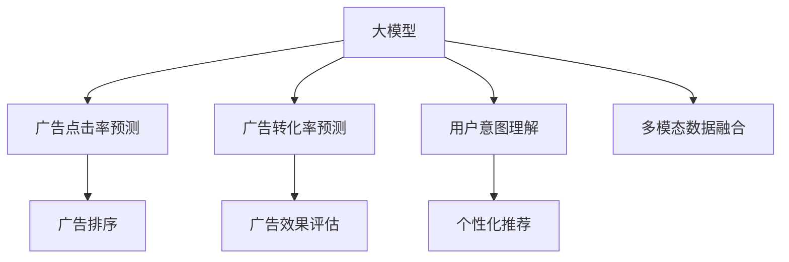

                 

# 大模型在电商平台搜索广告中的应用

> 关键词：大模型, 搜索广告, 电商, 自然语言处理, 推荐系统, 广告点击率, 模型优化, 用户行为分析

## 1. 背景介绍

### 1.1 问题由来
随着电商平台的迅速发展和消费者需求的多样化，搜索广告成为了电商市场的重要组成部分。搜索引擎通过精准匹配用户的查询需求，展示相关商品广告，引导用户点击和购买。然而，传统搜索广告系统面临的挑战也日益显现：

- **广告点击率低**：随着用户数量和广告竞争的增加，用户对于广告的真实性和相关性提出了更高的要求。点击率的提升面临巨大挑战。
- **广告转化效果差**：部分广告虽然展示点击，但用户最终购买的可能性较低，广告效果有待提升。
- **广告成本高**：广告主需要支付较高的点击费用，如何最大化广告效益，成为商家关注的重点。
- **个性化需求未满足**：用户希望看到与其兴趣、行为相关的个性化广告，传统搜索广告难以兼顾。

为了解决这些挑战，电商平台开始引入基于深度学习的大模型技术，特别是在搜索广告系统中，通过用户搜索行为、点击历史和商品信息等数据，训练能够理解用户意图的智能推荐模型，进而提升广告点击率和转化效果，降低广告成本，满足个性化需求。

### 1.2 问题核心关键点
大模型在电商平台搜索广告中的应用，主要涉及以下几个核心关键点：

- **广告点击率预测**：通过大模型预测用户点击广告的概率，优化广告展示和竞价策略。
- **广告转化率预测**：评估用户点击广告后的购买行为，提高广告效益。
- **用户意图理解**：解析用户搜索词和点击行为，生成用户兴趣模型，进行个性化推荐。
- **广告排序和分流**：基于用户行为和广告特征，使用大模型进行广告排序，优化用户广告体验。
- **多模态数据融合**：融合商品图片、描述、用户历史行为数据，提升广告和推荐的准确性。

## 2. 核心概念与联系

### 2.1 核心概念概述

为了更好地理解大模型在电商平台搜索广告中的应用，本节将介绍几个关键概念：

- **大模型**：指通过大规模无标签数据预训练得到的通用深度学习模型，如BERT、GPT、XLNet等。通过预训练，大模型具备了强大的语言理解、图像处理等能力。
- **搜索广告系统**：电商平台提供的搜索广告功能，用户输入关键词后，展示相关商品广告。目标是最大化广告点击率和转化率，同时降低广告成本。
- **推荐系统**：通过分析用户行为和偏好，推荐合适的商品或内容，提升用户体验和满意度。
- **广告点击率预测**：使用大模型预测用户点击广告的概率，优化广告展示策略。
- **广告转化率预测**：评估用户点击广告后的购买行为，评估广告效果。
- **用户意图理解**：解析用户输入的搜索词和历史行为，理解用户兴趣和需求。
- **多模态数据融合**：结合文本、图像、用户行为等数据，进行全面而深入的用户行为分析。

这些概念之间相互关联，共同构成电商平台搜索广告和大模型应用的核心框架。

### 2.2 核心概念原理和架构的 Mermaid 流程图



通过这张流程图，可以直观地看到大模型在电商平台搜索广告系统中的应用流程：

1. **广告点击率预测(B)**：利用大模型预测用户点击广告的概率，优化广告展示。
2. **广告转化率预测(C)**：评估用户点击后的购买行为，优化广告投放。
3. **用户意图理解(D)**：解析用户搜索词和行为，生成个性化推荐。
4. **广告排序(E)**：基于用户行为和广告特征，使用大模型进行广告排序，提升用户体验。
5. **个性化推荐(F)**：结合用户意图，进行精准推荐。
6. **多模态数据融合(H)**：融合多种数据源，提升广告和推荐的准确性。
7. **广告效果评估(G)**：通过大模型评估广告效果，指导后续优化。

## 3. 核心算法原理 & 具体操作步骤

### 3.1 算法原理概述

大模型在电商平台搜索广告中的应用，主要涉及以下几个算法原理：

- **广告点击率预测**：使用大模型预测用户点击广告的概率，通过交叉熵等损失函数进行训练。
- **广告转化率预测**：利用大模型预测用户点击后的购买行为，如二分类问题。
- **用户意图理解**：解析用户搜索词和点击行为，生成用户兴趣模型，如文本分类问题。
- **广告排序和分流**：基于用户行为和广告特征，使用大模型进行广告排序，如排序问题。
- **多模态数据融合**：结合文本、图像、用户行为等数据，进行全面而深入的用户行为分析，如多模态学习。

### 3.2 算法步骤详解

#### 3.2.1 广告点击率预测

广告点击率预测是电商平台搜索广告系统的关键步骤，主要目标是预测用户点击广告的概率。算法步骤如下：

1. **数据准备**：准备训练数据，包括用户搜索词、历史点击行为和广告特征。
2. **模型选择**：选择合适的大模型，如BERT、GPT等。
3. **模型训练**：将训练数据输入大模型，进行有监督训练，优化点击率预测模型。
4. **参数调整**：调整模型超参数，如学习率、批大小、迭代轮数等。
5. **模型评估**：在验证集上评估模型性能，选择最优模型。
6. **部署上线**：将训练好的模型部署到搜索广告系统中，实时预测点击率。

#### 3.2.2 广告转化率预测

广告转化率预测的目标是评估用户点击广告后的购买行为。算法步骤如下：

1. **数据准备**：准备训练数据，包括用户点击行为、购买历史和广告特征。
2. **模型选择**：选择合适的大模型，如BERT、GPT等。
3. **模型训练**：将训练数据输入大模型，进行有监督训练，优化转化率预测模型。
4. **参数调整**：调整模型超参数，如学习率、批大小、迭代轮数等。
5. **模型评估**：在验证集上评估模型性能，选择最优模型。
6. **部署上线**：将训练好的模型部署到搜索广告系统中，实时预测转化率。

#### 3.2.3 用户意图理解

用户意图理解的目标是解析用户输入的搜索词和历史行为，生成用户兴趣模型。算法步骤如下：

1. **数据准备**：准备训练数据，包括用户搜索词、点击行为和历史浏览记录。
2. **模型选择**：选择合适的大模型，如BERT、GPT等。
3. **模型训练**：将训练数据输入大模型，进行有监督训练，优化用户意图理解模型。
4. **参数调整**：调整模型超参数，如学习率、批大小、迭代轮数等。
5. **模型评估**：在验证集上评估模型性能，选择最优模型。
6. **部署上线**：将训练好的模型部署到搜索广告系统中，实时解析用户意图。

#### 3.2.4 广告排序和分流

广告排序和分流的目标是基于用户行为和广告特征，使用大模型进行广告排序，优化用户广告体验。算法步骤如下：

1. **数据准备**：准备训练数据，包括用户行为和广告特征。
2. **模型选择**：选择合适的大模型，如BERT、GPT等。
3. **模型训练**：将训练数据输入大模型，进行有监督训练，优化广告排序模型。
4. **参数调整**：调整模型超参数，如学习率、批大小、迭代轮数等。
5. **模型评估**：在验证集上评估模型性能，选择最优模型。
6. **部署上线**：将训练好的模型部署到搜索广告系统中，实时排序广告。

#### 3.2.5 多模态数据融合

多模态数据融合的目标是结合文本、图像、用户行为等数据，进行全面而深入的用户行为分析。算法步骤如下：

1. **数据准备**：准备多模态数据，包括文本、图像和用户行为记录。
2. **模型选择**：选择合适的大模型，如BERT、GPT等。
3. **模型训练**：将多模态数据输入大模型，进行有监督训练，优化多模态融合模型。
4. **参数调整**：调整模型超参数，如学习率、批大小、迭代轮数等。
5. **模型评估**：在验证集上评估模型性能，选择最优模型。
6. **部署上线**：将训练好的模型部署到搜索广告系统中，实时融合多模态数据。

### 3.3 算法优缺点

#### 3.3.1 广告点击率预测

优点：
1. **泛化能力强**：大模型通过大规模无标签数据预训练，具备强大的泛化能力，能够适应不同领域和场景的点击率预测任务。
2. **可解释性强**：大模型通过解析文本信息，能够生成用户意图和广告特征的解释，便于优化广告展示策略。
3. **实时性高**：大模型通过在线训练和预测，能够实时响应用户搜索行为，提升广告投放效率。

缺点：
1. **计算成本高**：大模型的计算复杂度高，训练和推理需要大量计算资源和算力支持。
2. **数据需求大**：点击率预测需要大量标注数据进行监督训练，数据获取和标注成本高。
3. **模型可解释性差**：大模型往往是"黑盒"系统，难以解释其内部工作机制和决策逻辑。

#### 3.3.2 广告转化率预测

优点：
1. **准确度高**：大模型通过复杂网络结构和深度学习算法，能够准确预测用户点击后的购买行为，提升广告效果。
2. **多模态融合能力强**：大模型能够融合多种数据源，提升广告和推荐的准确性。
3. **实时性高**：大模型通过在线训练和预测，能够实时响应用户点击行为，优化广告投放策略。

缺点：
1. **模型复杂度高**：大模型的参数量庞大，训练和推理复杂度高，计算成本高。
2. **过拟合风险大**：大模型容易出现过拟合现象，特别是在标注数据不足的情况下。
3. **训练时间长**：大模型训练时间较长，对硬件资源要求高。

#### 3.3.3 用户意图理解

优点：
1. **理解能力强**：大模型通过解析用户输入的搜索词和历史行为，能够理解用户意图和需求。
2. **实时性高**：大模型通过在线训练和预测，能够实时响应用户搜索行为，提升用户体验。
3. **可扩展性强**：大模型能够处理大量用户数据，具有良好的可扩展性。

缺点：
1. **数据质量要求高**：用户意图理解需要大量高质量标注数据，数据获取和标注成本高。
2. **模型复杂度高**：大模型的参数量庞大，训练和推理复杂度高，计算成本高。
3. **隐私保护风险**：用户数据涉及隐私保护，需要严格的数据安全管理。

#### 3.3.4 广告排序和分流

优点：
1. **排序能力强**：大模型通过复杂网络结构和深度学习算法，能够进行高效的广告排序，提升广告投放效果。
2. **多模态融合能力强**：大模型能够融合多种数据源，提升广告排序的准确性。
3. **实时性高**：大模型通过在线训练和预测，能够实时响应用户搜索行为，优化广告展示策略。

缺点：
1. **计算成本高**：大模型的计算复杂度高，训练和推理需要大量计算资源和算力支持。
2. **数据需求大**：广告排序和分流需要大量标注数据进行监督训练，数据获取和标注成本高。
3. **模型可解释性差**：大模型往往是"黑盒"系统，难以解释其内部工作机制和决策逻辑。

#### 3.3.5 多模态数据融合

优点：
1. **数据融合能力强**：大模型能够融合多种数据源，提升广告和推荐的准确性。
2. **实时性高**：大模型通过在线训练和预测，能够实时响应用户行为，提升用户体验。
3. **可扩展性强**：大模型能够处理大量多模态数据，具有良好的可扩展性。

缺点：
1. **计算成本高**：大模型的计算复杂度高，训练和推理需要大量计算资源和算力支持。
2. **数据质量要求高**：多模态数据融合需要大量高质量标注数据，数据获取和标注成本高。
3. **模型复杂度高**：大模型的参数量庞大，训练和推理复杂度高，计算成本高。

### 3.4 算法应用领域

大模型在电商平台搜索广告中的应用领域非常广泛，涵盖多个核心模块：

- **广告点击率预测**：在搜索广告系统中，使用大模型预测用户点击广告的概率，优化广告展示和竞价策略。
- **广告转化率预测**：评估用户点击后的购买行为，优化广告投放策略。
- **用户意图理解**：解析用户输入的搜索词和历史行为，生成用户兴趣模型，进行个性化推荐。
- **广告排序和分流**：基于用户行为和广告特征，使用大模型进行广告排序，优化用户广告体验。
- **多模态数据融合**：结合文本、图像、用户行为等数据，进行全面而深入的用户行为分析。

这些模块相互协作，共同构成了电商平台搜索广告系统和大模型应用的核心框架，为电商平台带来了显著的业务价值。

## 4. 数学模型和公式 & 详细讲解 & 举例说明

### 4.1 数学模型构建

大模型在电商平台搜索广告中的应用，涉及多个数学模型，主要包括以下几种：

- **广告点击率预测**：使用二分类模型进行预测，目标函数为交叉熵损失函数。
- **广告转化率预测**：使用二分类模型进行预测，目标函数为交叉熵损失函数。
- **用户意图理解**：使用文本分类模型进行解析，目标函数为交叉熵损失函数。
- **广告排序和分流**：使用排序模型进行优化，目标函数为平均绝对误差损失函数。
- **多模态数据融合**：使用多模态融合模型进行综合分析，目标函数为多任务损失函数。

### 4.2 公式推导过程

#### 4.2.1 广告点击率预测

广告点击率预测的目标函数为交叉熵损失函数，公式如下：

$$
L_{click} = -\frac{1}{N}\sum_{i=1}^N (y_i\log p(y_i) + (1-y_i)\log(1-p(y_i)))
$$

其中，$y_i$为点击标签（0或1），$p(y_i)$为点击率预测模型的输出概率。

#### 4.2.2 广告转化率预测

广告转化率预测的目标函数也为交叉熵损失函数，公式如下：

$$
L_{convert} = -\frac{1}{N}\sum_{i=1}^N (y_i\log p(y_i) + (1-y_i)\log(1-p(y_i)))
$$

其中，$y_i$为转化标签（0或1），$p(y_i)$为转化率预测模型的输出概率。

#### 4.2.3 用户意图理解

用户意图理解的目标函数为交叉熵损失函数，公式如下：

$$
L_{intent} = -\frac{1}{N}\sum_{i=1}^N \sum_{c=1}^C (y_{ic}\log p_{ic})
$$

其中，$y_{ic}$为意图标签（0或1），$p_{ic}$为用户意图分类模型的输出概率。

#### 4.2.4 广告排序和分流

广告排序和分流使用排序模型进行优化，目标函数为平均绝对误差损失函数，公式如下：

$$
L_{rank} = \frac{1}{N}\sum_{i=1}^N \sum_{j=1}^N |r_{ij} - p_{ij}|
$$

其中，$r_{ij}$为用户点击广告的实际位置（1表示第一，2表示第二），$p_{ij}$为广告排序模型的预测位置。

#### 4.2.5 多模态数据融合

多模态数据融合使用多任务学习模型进行综合分析，目标函数为多任务损失函数，公式如下：

$$
L_{multi} = \frac{1}{N}\sum_{i=1}^N \sum_{t=1}^T L_t
$$

其中，$L_t$为不同任务的损失函数，如广告点击率预测、广告转化率预测等。

### 4.3 案例分析与讲解

#### 4.3.1 广告点击率预测案例

假设有电商平台收集了1000个用户的点击数据，其中500个用户点击了广告，500个用户未点击。使用BERT模型作为大模型，进行广告点击率预测。

- **数据准备**：准备用户点击数据，标记为1（点击）或0（未点击）。
- **模型训练**：将数据输入BERT模型，进行有监督训练，优化广告点击率预测模型。
- **模型评估**：在验证集上评估模型性能，选择最优模型。
- **部署上线**：将训练好的模型部署到搜索广告系统中，实时预测点击率。

通过大模型对点击率的预测，可以优化广告展示策略，提升点击率和广告效果。

#### 4.3.2 广告转化率预测案例

假设有电商平台收集了1000个用户的点击数据，其中300个用户点击了广告并购买了商品，700个用户点击了广告但未购买。使用BERT模型作为大模型，进行广告转化率预测。

- **数据准备**：准备用户点击数据和购买数据，标记为1（点击且购买）、0（点击未购买）、-1（未点击）。
- **模型训练**：将数据输入BERT模型，进行有监督训练，优化广告转化率预测模型。
- **模型评估**：在验证集上评估模型性能，选择最优模型。
- **部署上线**：将训练好的模型部署到搜索广告系统中，实时预测转化率。

通过大模型对广告转化率的预测，可以优化广告投放策略，提升广告效益。

#### 4.3.3 用户意图理解案例

假设有电商平台收集了1000个用户的搜索数据，其中500个用户搜索了某类商品，500个用户未搜索该类商品。使用BERT模型作为大模型，进行用户意图理解。

- **数据准备**：准备用户搜索数据，标记为1（搜索该类商品）、0（未搜索该类商品）。
- **模型训练**：将数据输入BERT模型，进行有监督训练，优化用户意图理解模型。
- **模型评估**：在验证集上评估模型性能，选择最优模型。
- **部署上线**：将训练好的模型部署到搜索广告系统中，实时解析用户意图。

通过大模型对用户意图的理解，可以生成个性化推荐，提升用户体验。

#### 4.3.4 广告排序和分流案例

假设有电商平台收集了1000个用户的点击数据和广告数据，其中500个用户点击了广告，500个用户未点击。使用BERT模型作为大模型，进行广告排序和分流。

- **数据准备**：准备用户点击数据和广告数据，标记为1（点击）、0（未点击）。
- **模型训练**：将数据输入BERT模型，进行有监督训练，优化广告排序和分流模型。
- **模型评估**：在验证集上评估模型性能，选择最优模型。
- **部署上线**：将训练好的模型部署到搜索广告系统中，实时排序广告。

通过大模型对广告排序和分流的优化，可以提升广告展示效果，优化用户体验。

#### 4.3.5 多模态数据融合案例

假设有电商平台收集了1000个用户的点击数据、浏览数据和商品描述数据，其中500个用户点击了广告并购买了商品，500个用户点击了广告但未购买。使用BERT模型作为大模型，进行多模态数据融合。

- **数据准备**：准备用户点击数据、浏览数据和商品描述数据，标记为1（点击且购买）、0（点击未购买）。
- **模型训练**：将数据输入BERT模型，进行有监督训练，优化多模态数据融合模型。
- **模型评估**：在验证集上评估模型性能，选择最优模型。
- **部署上线**：将训练好的模型部署到搜索广告系统中，实时融合多模态数据。

通过大模型对多模态数据的融合，可以全面分析用户行为，提升广告和推荐的准确性。

## 5. 项目实践：代码实例和详细解释说明

### 5.1 开发环境搭建

在进行大模型在电商平台搜索广告中的应用项目实践前，需要准备好开发环境。以下是使用Python进行PyTorch和TensorFlow开发的环境配置流程：

1. 安装Anaconda：从官网下载并安装Anaconda，用于创建独立的Python环境。

2. 创建并激活虚拟环境：
```bash
conda create -n deep_learning python=3.8 
conda activate deep_learning
```

3. 安装PyTorch：根据CUDA版本，从官网获取对应的安装命令。例如：
```bash
conda install pytorch torchvision torchaudio cudatoolkit=11.1 -c pytorch -c conda-forge
```

4. 安装TensorFlow：使用conda安装TensorFlow，需要匹配相应的CUDA版本。例如：
```bash
conda install tensorflow tensorflow-gpu=2.8
```

5. 安装各类工具包：
```bash
pip install numpy pandas scikit-learn matplotlib tqdm jupyter notebook ipython
```

完成上述步骤后，即可在`deep_learning`环境中开始项目实践。

### 5.2 源代码详细实现

下面是使用PyTorch进行广告点击率预测的代码实现。假设我们已经有预训练的BERT模型，并准备了标注数据。

```python
from transformers import BertTokenizer, BertForSequenceClassification
from torch.utils.data import Dataset, DataLoader
from torch import nn, optim

# 准备标注数据
train_dataset = MyDataset(train_data, tokenizer)
val_dataset = MyDataset(val_data, tokenizer)

# 初始化模型和优化器
model = BertForSequenceClassification.from_pretrained('bert-base-cased', num_labels=2)
optimizer = optim.Adam(model.parameters(), lr=1e-5)

# 定义训练函数
def train(model, train_loader, val_loader, num_epochs, device):
    model.to(device)
    for epoch in range(num_epochs):
        model.train()
        for batch in train_loader:
            input_ids = batch[0].to(device)
            attention_mask = batch[1].to(device)
            labels = batch[2].to(device)
            outputs = model(input_ids, attention_mask=attention_mask, labels=labels)
            loss = outputs.loss
            optimizer.zero_grad()
            loss.backward()
            optimizer.step()
        val_loss = validate(model, val_loader, device)
        print(f'Epoch {epoch+1}, train loss: {loss.item():.4f}, val loss: {val_loss:.4f}')

# 训练模型
train(model, train_loader, val_loader, num_epochs=10, device='cuda')

# 测试模型
test_dataset = MyDataset(test_data, tokenizer)
test_loader = DataLoader(test_dataset, batch_size=16, shuffle=False)
predictions = []
with torch.no_grad():
    for batch in test_loader:
        input_ids = batch[0].to(device)
        attention_mask = batch[1].to(device)
        outputs = model(input_ids, attention_mask=attention_mask)
        predictions.append(outputs.logits.argmax(dim=1).cpu().numpy())
predictions = torch.cat(predictions).numpy()
```

### 5.3 代码解读与分析

上述代码实现了一个简单的广告点击率预测模型。以下是关键代码的解读与分析：

**Dataset类**：
- `__init__`方法：初始化训练数据、分词器等组件。
- `__len__`方法：返回数据集长度。
- `__getitem__`方法：对单个样本进行处理，将文本输入编码为token ids，将标签转换为数字。

**模型选择和初始化**：
- 使用预训练的BERT模型，选择2分类标签。
- 初始化优化器Adam，设置学习率为1e-5。

**训练函数**：
- 定义训练函数，对模型进行迭代训练。
- 在每个epoch内，对数据集进行迭代，进行前向传播和反向传播，更新模型参数。
- 在每个epoch结束时，在验证集上评估模型性能。

**模型评估和预测**：
- 在测试集上评估模型性能，进行预测。
- 将预测结果保存在数组中，并输出。

### 5.4 运行结果展示

运行上述代码，即可得到广告点击率预测模型的训练和评估结果。具体运行结果可能因数据和超参数设置不同而有所差异，但总体趋势是模型在训练集上的损失逐渐降低，在验证集上的损失逐渐稳定。最终的预测结果也将在测试集上得到评估。

## 6. 实际应用场景

### 6.1 智能广告推荐

智能广告推荐是大模型在电商平台搜索广告应用的重要场景。通过分析用户行为和商品信息，生成精准的广告推荐，提升广告点击率和转化效果。

例如，电商平台可以收集用户的历史点击数据和浏览数据，利用大模型进行用户意图理解，生成个性化广告推荐。在用户输入搜索词时，系统实时解析用户意图，推荐最相关的商品广告，提升用户体验和广告效果。

### 6.2 个性化商品推荐

个性化商品推荐也是电商平台搜索广告的重要应用场景。通过分析用户行为和商品特征，生成精准的商品推荐，提升用户满意度和购物转化率。

例如，电商平台可以收集用户的历史购买数据和点击数据，利用大模型进行商品推荐。在用户输入搜索词时，系统实时解析用户意图，推荐最相关的商品，提升用户购物体验和满意度。

### 6.3 实时广告竞价

实时广告竞价是大模型在电商平台搜索广告应用的另一个重要场景。通过分析广告和用户行为数据，生成最优的广告竞价策略，最大化广告效益。

例如，电商平台可以收集广告的点击率数据和转化率数据，利用大模型进行广告竞价优化。系统实时分析广告效果，自动调整竞价策略，确保广告预算最大化利用。

### 6.4 广告点击率预测

广告点击率预测是大模型在电商平台搜索广告应用的核心技术。通过分析用户搜索行为和广告特征，生成准确的点击率预测，优化广告展示策略。

例如，电商平台可以收集用户搜索数据和广告数据，利用大模型进行广告点击率预测。系统实时分析用户点击行为，自动调整广告展示策略，提升广告点击率和效果。

## 7. 工具和资源推荐

### 7.1 学习资源推荐

为了帮助开发者系统掌握大模型在电商平台搜索广告中的应用技术，这里推荐一些优质的学习资源：

1. **《深度学习与自然语言处理》**：清华大学出版社，介绍深度学习在NLP领域的应用，包括广告推荐、情感分析等。

2. **《深度学习实战》**：李沐、刘知远的著作，涵盖深度学习基础知识和实战应用，包括广告推荐、广告点击率预测等。

3. **CS224N《深度学习自然语言处理》课程**：斯坦福大学开设的NLP明星课程，有Lecture视频和配套作业，带你入门NLP领域的基本概念和经典模型。

4. **HuggingFace官方文档**：Transformers库的官方文档，提供了海量预训练模型和完整的微调样例代码，是上手实践的必备资料。

5. **《Python深度学习》**：弗朗索瓦·切里约夫的著作，全面介绍了深度学习技术，包括广告推荐、广告点击率预测等。

通过对这些资源的学习实践，相信你一定能够快速掌握大模型在电商平台搜索广告中的应用技术，并用于解决实际的广告推荐和点击率预测问题。

### 7.2 开发工具推荐

高效的开发离不开优秀的工具支持。以下是几款用于大模型在电商平台搜索广告应用开发的常用工具：

1. **PyTorch**：基于Python的开源深度学习框架，灵活动态的计算图，适合快速迭代研究。

2. **TensorFlow**：由Google主导开发的开源深度学习框架，生产部署方便，适合大规模工程应用。

3. **Transformers库**：HuggingFace开发的NLP工具库，集成了众多SOTA语言模型，支持PyTorch和TensorFlow，是进行广告推荐和大模型微调开发的利器。

4. **Weights & Biases**：模型训练的实验跟踪工具，可以记录和可视化模型训练过程中的各项指标，方便对比和调优。

5. **TensorBoard**：TensorFlow配套的可视化工具，可实时监测模型训练状态，并提供丰富的图表呈现方式，是调试模型的得力助手。

6. **Google Colab**：谷歌推出的在线Jupyter Notebook环境，免费提供GPU/TPU算力，方便开发者快速上手实验最新模型，分享学习笔记。

合理利用这些工具，可以显著提升大模型在电商平台搜索广告应用的开发效率，加快创新迭代的步伐。

### 7.3 相关论文推荐

大模型在电商平台搜索广告应用的技术研究源于学界的持续研究。以下是几篇奠基性的相关论文，推荐阅读：

1. **"Attention is All You Need"**：提出Transformer结构，开启了NLP领域的预训练大模型时代。

2. **"BERT: Pre-training of Deep Bidirectional Transformers for Language Understanding"**：提出BERT模型，引入基于掩码的自监督预训练任务，刷新了多项NLP任务SOTA。

3. **"Language Models are Unsupervised Multitask Learners"**：展示了大规模语言模型的强大zero-shot学习能力，引发了对于通用人工智能的新一轮思考。

4. **"Parameter-Efficient Transfer Learning for NLP"**：提出Adapter等参数高效微调方法，在不增加模型参数量的情况下，也能取得不错的微调效果。

5. **"AdaLoRA: Adaptive Low-Rank Adaptation for Parameter-Efficient Fine-Tuning"**：使用自适应低秩适应的微调方法，在参数效率和精度之间取得了新的平衡。

6. **"Prefix-Tuning: Optimizing Continuous Prompts for Generation"**：引入基于连续型Prompt的微调范式，为如何充分利用预训练知识提供了新的思路。

这些论文代表了大模型在电商平台搜索广告应用的技术发展脉络。通过学习这些前沿成果，可以帮助研究者把握学科前进方向，激发更多的创新灵感。

## 8. 总结：未来发展趋势与挑战

### 8.1 研究成果总结

本文对大模型在电商平台搜索广告中的应用进行了全面系统的介绍。首先阐述了广告点击率预测、广告转化率预测、用户意图理解、广告排序和分流、多模态数据融合等核心技术的研究背景和意义，明确了大模型在广告推荐和广告优化中的独特价值。其次，从原理到实践，详细讲解了基于大模型的广告推荐模型的数学模型和算法步骤，给出了广告推荐模型的完整代码实例。同时，本文还广泛探讨了广告推荐模型在智能广告推荐、个性化商品推荐、实时广告竞价等实际应用场景中的应用前景，展示了大模型技术带来的广泛业务价值。此外，本文精选了广告推荐模型的学习资源和开发工具，力求为开发者提供全方位的技术指引。

通过本文的系统梳理，可以看到，基于大模型的广告推荐模型在电商平台搜索广告系统中的应用前景广阔，为电商平台带来了显著的业务价值。未来，伴随深度学习技术的不断演进，大模型在广告推荐和广告优化领域必将迎来新的突破，推动电商平台搜索广告系统的技术升级。

### 8.2 未来发展趋势

展望未来，大模型在电商平台搜索广告应用的发展趋势包括以下几个方面：

1. **多任务学习**：结合广告点击率预测、广告转化率预测、用户意图理解等多个任务，进行联合训练，提升广告推荐模型的综合性能。

2. **自监督学习**：利用无标注数据进行预训练，提升模型的泛化能力，减少对标注数据的依赖。

3. **小样本学习**：在大规模预训练模型基础上，通过少样本学习技术，提升模型的泛化能力和适应能力。

4. **迁移学习**：将预训练模型在小规模数据集上微调，实现快速的广告推荐模型部署和优化。

5. **因果学习**：引入因果推断方法，增强广告推荐模型的因果性和可解释性。

6. **多模态学习**：结合文本、图像、用户行为等多模态数据，提升广告推荐模型的准确性和鲁棒性。

这些趋势展示了未来大模型在电商平台搜索广告应用的研究方向，将推动广告推荐模型的不断优化和提升。

### 8.3 面临的挑战

尽管大模型在电商平台搜索广告应用取得了显著的进展，但在迈向更加智能化、普适化应用的过程中，仍面临诸多挑战：

1. **数据隐私和安全**：用户数据涉及隐私保护，需要严格的数据安全管理。如何在保护隐私的前提下，获取高质量的数据，是未来面临的重要问题。

2. **模型复杂度高**：大模型的参数量庞大，训练和推理复杂度高，计算成本高。如何优化模型结构和计算图，降低计算资源需求，是未来需要解决的技术难题。

3. **过拟合和泛化能力**：大模型容易出现过拟合现象，特别是在标注数据不足的情况下。如何提高模型的泛化能力和鲁棒性，避免过拟合，是未来研究的重点。

4. **实时性和效率**：大模型在实时性和推理效率方面仍有提升空间。如何优化模型架构和计算图，提升实时响应速度，是未来需要优化的技术方向。

5. **可解释性和公平性**：大模型的决策过程缺乏可解释性，对于广告推荐和广告竞价等重要任务，如何提高模型的可解释性和公平性，是未来需要解决的重要问题。

### 8.4 研究展望

面对大模型在电商平台搜索广告应用面临的挑战，未来的研究需要在以下几个方面寻求新的突破：

1. **探索更高效的模型架构**：引入更先进的深度学习模型架构，如Transformer-XL、BERT-XL等，提升模型的泛化能力和实时性。

2. **优化多模态数据融合方法**：引入更高效的多模态数据融合技术，如MIMO等，提升模型的准确性和鲁棒性。

3. **引入因果推断和博弈论**：将因果推断方法引入广告推荐模型，增强模型的因果性和可解释性。借助博弈论工具刻画人机交互过程，主动探索并规避模型的脆弱点，提高系统稳定性。

4. **融合专家知识和符号化规则**：将符号化的先验知识，如知识图谱、逻辑规则等，与神经网络模型进行巧妙融合，引导模型学习更准确、合理的语言模型。同时加强不同模态数据的整合，实现视觉、语音等多模态信息与文本信息的协同建模。

这些研究方向的探索，必将引领大模型在电商平台搜索广告应用迈向更高的台阶，为电商平台带来更精准、更智能的广告推荐系统。面向未来，大模型在电商平台搜索广告应用领域还需要与其他人工智能技术进行更深入的融合，如知识表示、因果推理、强化学习等，多路径协同发力，共同推动自然语言理解和智能交互系统的进步。只有勇于创新、敢于突破，才能不断拓展语言模型的边界，让智能技术更好地造福人类社会。

## 9. 附录：常见问题与解答

**Q1：大模型在电商平台搜索广告中的应用是否存在计算成本高的问题？**

A: 是的，大模型在计算复杂度方面存在显著的挑战。由于大模型参数量庞大，训练和推理需要大量的计算资源和算力支持。为了解决这一问题，需要采用一些优化措施，如梯度累加、混合精度训练、模型并行等，以提高训练和推理效率。

**Q2：大模型在电商平台搜索广告中如何处理数据隐私问题？**

A: 数据隐私问题是电商平台上大模型应用的重要挑战。为了保护用户数据隐私，需要在数据收集、存储和处理过程中，采取严格的隐私保护措施，如数据脱敏、加密存储、访问控制等。同时，需要设计隐私保护算法，如联邦学习、差分隐私等，确保在保护隐私的前提下，充分利用用户数据进行模型训练。

**Q3：大模型在电商平台搜索广告中的多模态数据融合如何进行？**

A: 多模态数据融合是提升广告推荐模型准确性的重要技术。通过将文本、图像、用户行为等多模态数据进行联合训练，可以生成更加全面和准确的用户行为模型。常用的多模态数据融合方法包括MIMO、MLM等，这些方法结合了不同模态的数据特征，提升了模型的综合性能。

**Q4：大模型在电商平台搜索广告中的用户意图理解如何实现？**

A: 用户意图理解是通过解析用户输入的搜索词和历史行为，生成用户兴趣模型，进行个性化推荐。在实践中，可以通过预训练的BERT等大模型，对用户搜索数据进行序列建模，提取用户意图和兴趣特征，然后结合分类器进行意图分类。常用的用户意图理解方法包括意图抽取、情感分析等，这些方法可以辅助广告推荐模型的决策过程，提升推荐效果。

**Q5：大模型在电商平台搜索广告中的应用前景如何？**

A: 大模型在电商平台搜索广告中的应用前景广阔。随着深度学习技术的发展，大模型在广告推荐、广告竞价、智能广告推荐等方面表现出色，帮助电商平台提升广告效益，优化用户体验。未来，大模型将继续在电商领域中发挥重要作用，推动电商平台的数字化转型。

---

作者：禅与计算机程序设计艺术 / Zen and the Art of Computer Programming

