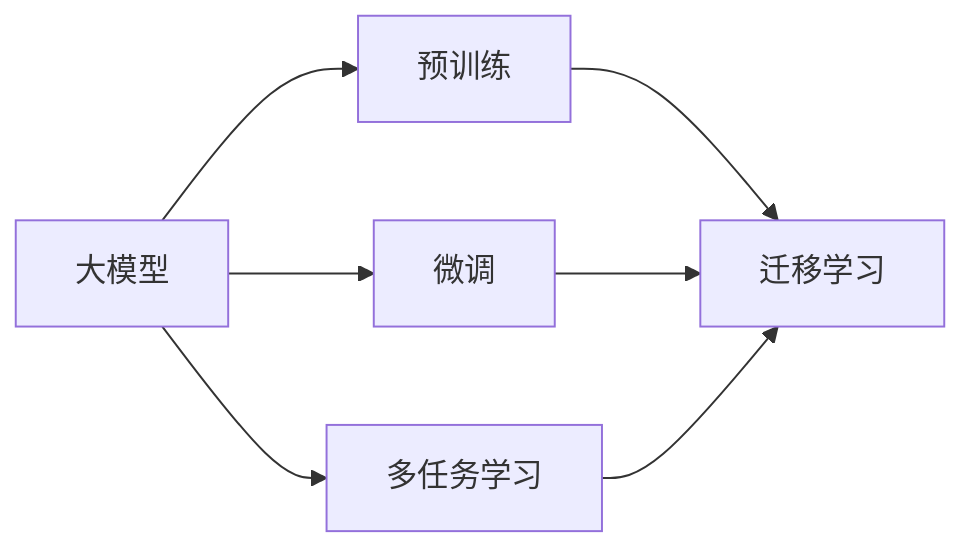

                 

## 1. 背景介绍

### 1.1 问题由来

在数字时代，用户的长期兴趣建模是互联网企业长期关注的热点话题，特别是在内容推荐、广告投放、用户画像构建等领域，精准预测用户长期兴趣能带来显著的用户体验提升和商业价值增长。然而，传统机器学习算法在长期兴趣建模中存在数据稀疏性高、模型稳定性差等问题。

近年来，深度学习技术在各领域得到了广泛的应用，其优势在于可以处理大规模的非结构化数据，并通过多层次的特征抽取与表示学习，提升模型的泛化能力。但深度学习模型训练和调参成本较高，且模型结构复杂，难以在生产环境中大规模部署。

大模型（Large Models）的出现，为长期兴趣建模提供了新的可能性。大模型通常指参数量超过亿级的模型，其具备的强大表征能力，可以在处理非结构化数据时进行充分建模，并通过迁移学习的方式，将通用知识迁移到特定任务，从而提升长期兴趣建模的准确性和泛化能力。

### 1.2 问题核心关键点

大模型在长期用户兴趣建模中，可以通过以下几个方面发挥关键作用：

- **海量数据处理能力**：大模型通常依赖于大规模数据集进行预训练，因此能够从海量数据中学习到丰富的特征表示。这些特征表示可以被应用于各类长短期兴趣建模任务中。

- **高效的迁移学习**：大模型具有广泛的领域适应性，通过微调或适配器技术，可以高效地将预训练知识迁移到特定任务中，提升模型的泛化能力。

- **复杂的特征表示**：大模型能够学习到更复杂、更抽象的特征表示，能够更好地捕捉长期兴趣的多样性和动态性。

- **高效率训练与推理**：大模型通常依赖于GPU/TPU等高性能硬件进行训练，同时大模型也可以进行高效的推理，适应生产环境中的实时需求。

- **多任务协同学习**：大模型可以在一个统一框架中进行多任务学习，如联合训练、多任务融合等，提升长期兴趣建模的灵活性和有效性。

大模型在长期用户兴趣建模中的应用，不仅能提升模型的准确性和泛化能力，还能够降低训练和调参成本，适应大规模的生产环境部署需求。

### 1.3 问题研究意义

大模型在长期用户兴趣建模中的应用，对于提升用户满意度、增强商业竞争力、推动产业创新具有重要意义：

- **用户体验提升**：精准预测用户长期兴趣，推荐个性化内容，提升用户满意度，增强用户黏性。
- **商业价值增长**：通过精准的广告投放、精准的个性化推荐，提升企业收入，降低运营成本。
- **产业创新推动**：利用大模型技术，创新业务模式，推动内容、广告、电商等多个领域的产业升级。

总之，大模型在长期用户兴趣建模中，提供了全新的方法论和技术路径，有望成为未来NLP和推荐系统发展的关键力量。

## 2. 核心概念与联系

### 2.1 核心概念概述

为更好地理解大模型在长期用户兴趣建模中的应用，本节将介绍几个关键概念：

- **大模型**：指参数量超过亿级的深度学习模型，如BERT、GPT-3、DALL·E等。其通常依赖于大规模数据集进行预训练，学习到丰富的特征表示。
- **迁移学习**：指在一个领域中训练的模型，能够迁移到另一个领域中，提升模型在新领域的性能。
- **长期兴趣建模**：指通过对用户历史行为数据的建模，预测用户未来的兴趣和需求，进而提升推荐系统的精准性和用户满意度。
- **多任务学习**：指在一个模型中，同时训练多个相关任务，提升模型的泛化能力和任务间的协同效应。

这些核心概念之间通过迁移学习和多任务学习的桥梁，实现大模型在长期用户兴趣建模中的应用。

### 2.2 核心概念原理和架构的 Mermaid 流程图



这个流程图展示了大模型在长期用户兴趣建模中的工作流程：

1. **预训练**：在大规模数据集上训练大模型，学习到通用的特征表示。
2. **微调**：在特定任务上对大模型进行微调，使其能够适应新的数据分布和任务需求。
3. **多任务学习**：在一个模型中，同时训练多个相关任务，提升模型的泛化能力和任务间的协同效应。
4. **迁移学习**：将大模型在某个任务上的知识迁移到其他任务中，提高模型的泛化能力。

这些概念通过迁移学习和多任务学习的方式，实现大模型在长期用户兴趣建模中的高效应用。

## 3. 核心算法原理 & 具体操作步骤

### 3.1 算法原理概述

大模型在长期用户兴趣建模中的应用，基于以下几个核心算法原理：

- **迁移学习**：利用大模型在特定任务上的预训练知识，提升模型在新任务的性能。
- **微调**：通过有监督的数据集，对大模型进行微调，适应特定的任务需求。
- **多任务学习**：在一个模型中，同时训练多个相关任务，提升模型的泛化能力和任务间的协同效应。
- **多层次特征表示**：大模型能够学习到多层次的特征表示，提升长期兴趣建模的复杂性和多样性。

这些算法原理通过迁移学习和多任务学习的方式，实现大模型在长期用户兴趣建模中的高效应用。

### 3.2 算法步骤详解

#### 3.2.1 数据准备

1. **数据收集**：收集用户的历史行为数据，包括浏览记录、点击记录、购买记录等。
2. **数据清洗**：清洗数据中的异常值和缺失值，确保数据的质量。
3. **数据划分**：将数据划分为训练集、验证集和测试集。

#### 3.2.2 模型选择与预训练

1. **模型选择**：选择适合长期用户兴趣建模的大模型，如BERT、GPT系列模型等。
2. **预训练**：在大规模无标签数据集上对模型进行预训练，学习到通用的特征表示。

#### 3.2.3 微调与优化

1. **微调**：在特定任务上对模型进行微调，提升模型在长期用户兴趣建模上的性能。
2. **优化**：调整模型的超参数，如学习率、批大小等，确保模型的收敛性。

#### 3.2.4 多任务协同学习

1. **任务定义**：定义多个相关任务，如内容推荐、广告投放、用户画像构建等。
2. **模型训练**：在同一个模型中同时训练多个任务，提升模型的泛化能力和任务间的协同效应。

#### 3.2.5 评估与部署

1. **评估**：在测试集上评估模型的性能，如AUC、准确率、召回率等指标。
2. **部署**：将模型部署到生产环境中，进行实时预测和推荐。

### 3.3 算法优缺点

大模型在长期用户兴趣建模中具有以下优点：

- **高泛化能力**：大模型通过迁移学习和多任务学习，能够在多个任务上实现良好的泛化能力。
- **高效率训练**：大模型通常依赖于GPU/TPU等高性能硬件进行训练，能够高效地处理大规模数据集。
- **复杂特征表示**：大模型能够学习到更复杂、更抽象的特征表示，提升长期兴趣建模的复杂性和多样性。

但大模型也存在以下缺点：

- **高资源消耗**：大模型的训练和推理需要大量的计算资源和存储空间，增加了企业的成本。
- **高调参成本**：大模型的训练和调参成本较高，需要丰富的经验和技术积累。
- **模型复杂性**：大模型结构复杂，难以在生产环境中进行高效的部署和维护。

### 3.4 算法应用领域

大模型在长期用户兴趣建模中的应用，主要涵盖以下几个领域：

- **内容推荐系统**：利用大模型预测用户未来的兴趣和需求，推荐个性化内容，提升用户满意度。
- **广告投放系统**：通过大模型预测用户的行为，实现精准的广告投放，提高广告的转化率。
- **用户画像构建**：利用大模型对用户的行为数据进行建模，构建用户画像，提升个性化服务的精准度。
- **搜索与导航**：利用大模型预测用户的搜索意图和需求，提升搜索系统的用户体验和精准度。

大模型在长期用户兴趣建模中的应用，将带来更加精准和个性化的推荐和服务，提升用户满意度和商业价值。

## 4. 数学模型和公式 & 详细讲解 & 举例说明

### 4.1 数学模型构建

长期用户兴趣建模的数学模型可以定义为：

$$
\text{Model} = \text{Pre-trained Model} + \text{Task-specific Head}
$$

其中，$\text{Pre-trained Model}$ 为预训练的大模型，$\text{Task-specific Head}$ 为任务特定的头部模块，如分类器或回归器等。

### 4.2 公式推导过程

假设我们利用BERT作为长期用户兴趣建模的模型，其预训练层为 $h_{pre}(\cdot)$，任务特定的头部模块为 $h_{task}(\cdot)$，用户行为数据为 $x$。

长期用户兴趣建模的公式推导如下：

$$
y = h_{task}(h_{pre}(x))
$$

其中 $y$ 为用户长期兴趣的预测结果。

### 4.3 案例分析与讲解

以用户画像构建为例，我们利用BERT作为预训练模型，训练任务特定的分类器进行用户画像构建。具体步骤如下：

1. **数据准备**：收集用户的行为数据，进行数据清洗和划分。
2. **模型选择**：选择BERT作为预训练模型。
3. **微调**：在特定任务上对BERT进行微调，训练分类器进行用户画像构建。
4. **评估**：在测试集上评估模型的性能，调整超参数，优化模型。
5. **部署**：将模型部署到生产环境中，进行实时预测和推荐。

## 5. 项目实践：代码实例和详细解释说明

### 5.1 开发环境搭建

在大模型长期用户兴趣建模中，需要搭建适合深度学习的开发环境。以下是Python PyTorch环境的搭建步骤：

1. **安装Anaconda**：从官网下载并安装Anaconda，用于创建独立的Python环境。
2. **创建并激活虚拟环境**：
```bash
conda create -n pytorch-env python=3.8 
conda activate pytorch-env
```

3. **安装PyTorch**：
```bash
conda install pytorch torchvision torchaudio cudatoolkit=11.1 -c pytorch -c conda-forge
```

4. **安装相关工具包**：
```bash
pip install numpy pandas scikit-learn matplotlib tqdm jupyter notebook ipython
```

5. **安装Transformer库**：
```bash
pip install transformers
```

6. **安装相关依赖库**：
```bash
pip install torchtext torchfile
```

### 5.2 源代码详细实现

以下以BERT模型为例，给出长期用户兴趣建模的代码实现：

```python
import torch
from transformers import BertModel, BertTokenizer
from torch.utils.data import Dataset, DataLoader
from torch.nn import BCEWithLogitsLoss
from sklearn.metrics import roc_auc_score

class UserBehaviorDataset(Dataset):
    def __init__(self, behaviors, labels, tokenizer, max_len=128):
        self.behaviors = behaviors
        self.labels = labels
        self.tokenizer = tokenizer
        self.max_len = max_len

    def __len__(self):
        return len(self.behaviors)

    def __getitem__(self, idx):
        behavior = self.behaviors[idx]
        label = self.labels[idx]
        encoding = self.tokenizer(behavior, return_tensors='pt', max_length=self.max_len, padding='max_length', truncation=True)
        input_ids = encoding['input_ids']
        attention_mask = encoding['attention_mask']
        return {'input_ids': input_ids,
                'attention_mask': attention_mask,
                'labels': label}

# 创建dataset
tokenizer = BertTokenizer.from_pretrained('bert-base-cased')

train_dataset = UserBehaviorDataset(train_behaviors, train_labels, tokenizer)
valid_dataset = UserBehaviorDataset(valid_behaviors, valid_labels, tokenizer)
test_dataset = UserBehaviorDataset(test_behaviors, test_labels, tokenizer)

# 模型选择
model = BertModel.from_pretrained('bert-base-cased')
head = torch.nn.Linear(768, 1)

# 训练过程
model.train()
optimizer = torch.optim.Adam(model.parameters(), lr=1e-5)
criterion = BCEWithLogitsLoss()

for epoch in range(10):
    for batch in DataLoader(train_dataset, batch_size=32):
        input_ids = batch['input_ids'].to(device)
        attention_mask = batch['attention_mask'].to(device)
        labels = batch['labels'].to(device)

        outputs = model(input_ids, attention_mask=attention_mask)
        head_outputs = head(outputs[0])
        loss = criterion(head_outputs, labels)

        optimizer.zero_grad()
        loss.backward()
        optimizer.step()

    valid_loss = 0
    for batch in DataLoader(valid_dataset, batch_size=32):
        input_ids = batch['input_ids'].to(device)
        attention_mask = batch['attention_mask'].to(device)
        labels = batch['labels'].to(device)

        with torch.no_grad():
            outputs = model(input_ids, attention_mask=attention_mask)
            head_outputs = head(outputs[0])
            valid_loss += criterion(head_outputs, labels).item()

    print(f'Epoch {epoch+1}, train loss: {loss:.4f}, valid loss: {valid_loss/len(valid_dataset):.4f}')
    
# 测试过程
test_loss = 0
with torch.no_grad():
    for batch in DataLoader(test_dataset, batch_size=32):
        input_ids = batch['input_ids'].to(device)
        attention_mask = batch['attention_mask'].to(device)
        labels = batch['labels'].to(device)

        outputs = model(input_ids, attention_mask=attention_mask)
        head_outputs = head(outputs[0])
        test_loss += criterion(head_outputs, labels).item()

print(f'Test loss: {test_loss/len(test_dataset):.4f}')
```

### 5.3 代码解读与分析

上述代码实现了BERT模型在长期用户兴趣建模中的应用。具体步骤如下：

1. **数据准备**：创建数据集，将用户行为数据和标签转换为模型可接受的格式。
2. **模型选择**：选择BERT模型作为预训练模型。
3. **训练过程**：在训练集上训练模型，优化模型参数。
4. **测试过程**：在测试集上评估模型性能。

## 6. 实际应用场景

### 6.1 长期用户兴趣建模在内容推荐系统中的应用

在内容推荐系统中，利用大模型进行长期用户兴趣建模，可以有效提升推荐系统的精准度和用户满意度。通过微调和多任务学习，大模型能够学习到用户的多样化和动态化兴趣，并进行个性化的内容推荐。

具体来说，可以通过以下几个步骤实现：

1. **数据收集**：收集用户的历史浏览记录、点击记录、评分记录等。
2. **数据清洗**：清洗数据中的异常值和缺失值，确保数据的质量。
3. **模型选择**：选择适合长期用户兴趣建模的大模型，如BERT、GPT系列模型等。
4. **预训练**：在大规模无标签数据集上对模型进行预训练，学习到通用的特征表示。
5. **微调**：在特定任务上对模型进行微调，提升模型在长期用户兴趣建模上的性能。
6. **多任务学习**：在一个模型中同时训练多个相关任务，提升模型的泛化能力和任务间的协同效应。
7. **评估与部署**：在测试集上评估模型的性能，将模型部署到生产环境中，进行实时预测和推荐。

通过这些步骤，利用大模型可以实现更加精准和个性化的内容推荐，提升用户满意度和商业价值。

### 6.2 长期用户兴趣建模在广告投放系统中的应用

在广告投放系统中，利用大模型进行长期用户兴趣建模，可以有效提升广告投放的精准度和转化率。通过微调和多任务学习，大模型能够学习到用户的行为和兴趣，并进行个性化的广告投放。

具体来说，可以通过以下几个步骤实现：

1. **数据收集**：收集用户的历史点击记录、浏览记录、购买记录等。
2. **数据清洗**：清洗数据中的异常值和缺失值，确保数据的质量。
3. **模型选择**：选择适合长期用户兴趣建模的大模型，如BERT、GPT系列模型等。
4. **预训练**：在大规模无标签数据集上对模型进行预训练，学习到通用的特征表示。
5. **微调**：在特定任务上对模型进行微调，提升模型在长期用户兴趣建模上的性能。
6. **多任务学习**：在一个模型中同时训练多个相关任务，提升模型的泛化能力和任务间的协同效应。
7. **评估与部署**：在测试集上评估模型的性能，将模型部署到生产环境中，进行实时预测和推荐。

通过这些步骤，利用大模型可以实现更加精准和个性化的广告投放，提升广告的转化率和用户满意度。

### 6.3 长期用户兴趣建模在用户画像构建中的应用

在用户画像构建中，利用大模型进行长期用户兴趣建模，可以有效提升用户画像的准确性和多样性。通过微调和多任务学习，大模型能够学习到用户的多样化和动态化兴趣，并进行全面的用户画像构建。

具体来说，可以通过以下几个步骤实现：

1. **数据收集**：收集用户的历史浏览记录、点击记录、购买记录等。
2. **数据清洗**：清洗数据中的异常值和缺失值，确保数据的质量。
3. **模型选择**：选择适合长期用户兴趣建模的大模型，如BERT、GPT系列模型等。
4. **预训练**：在大规模无标签数据集上对模型进行预训练，学习到通用的特征表示。
5. **微调**：在特定任务上对模型进行微调，提升模型在长期用户兴趣建模上的性能。
6. **多任务学习**：在一个模型中同时训练多个相关任务，提升模型的泛化能力和任务间的协同效应。
7. **评估与部署**：在测试集上评估模型的性能，将模型部署到生产环境中，进行实时预测和推荐。

通过这些步骤，利用大模型可以实现更加全面和精准的用户画像构建，提升个性化服务的精准度。

## 7. 工具和资源推荐

### 7.1 学习资源推荐

为了帮助开发者系统掌握大模型在长期用户兴趣建模中的应用，这里推荐一些优质的学习资源：

1. **《深度学习》课程**：斯坦福大学开设的深度学习课程，涵盖深度学习的基本概念和前沿技术，适合入门和进阶学习。
2. **《深度学习框架》课程**：TensorFlow官方提供的深度学习框架课程，详细介绍TensorFlow的架构和使用。
3. **《Transformer原理与应用》博文**：由大模型技术专家撰写，详细介绍Transformer模型及其应用。
4. **《BERT：预训练的深度双向转换器模型》论文**：BERT模型的原始论文，详细介绍了BERT模型的结构和训练方法。
5. **《GPT系列模型》论文**：GPT系列模型的原始论文，详细介绍了GPT模型的结构和训练方法。

通过对这些资源的学习实践，相信你一定能够快速掌握大模型在长期用户兴趣建模中的应用，并用于解决实际的NLP问题。

### 7.2 开发工具推荐

大模型在长期用户兴趣建模中的应用，离不开各类开发工具的支持。以下是几款常用的开发工具：

1. **PyTorch**：基于Python的开源深度学习框架，适合进行深度学习模型的训练和推理。
2. **TensorFlow**：由Google主导开发的深度学习框架，适合大规模工程应用。
3. **Jupyter Notebook**：免费的开源Jupyter Notebook环境，适合进行数据探索和模型开发。
4. **Weights & Biases**：模型训练的实验跟踪工具，可以记录和可视化模型训练过程中的各项指标，方便对比和调优。
5. **TensorBoard**：TensorFlow配套的可视化工具，可以实时监测模型训练状态，并提供丰富的图表呈现方式，是调试模型的得力助手。

合理利用这些工具，可以显著提升大模型长期用户兴趣建模的开发效率，加快创新迭代的步伐。

### 7.3 相关论文推荐

大模型在长期用户兴趣建模中的应用，源于学界的持续研究。以下是几篇奠基性的相关论文，推荐阅读：

1. **《BERT: Pre-training of Deep Bidirectional Transformers for Language Understanding》**：BERT模型的原始论文，详细介绍了BERT模型的结构和训练方法。
2. **《GPT-2: Language Models are Unsupervised Multitask Learners》**：GPT-2模型的原始论文，详细介绍了GPT-2模型的结构和训练方法。
3. **《AdaLoRA: Adaptive Low-Rank Adaptation for Parameter-Efficient Fine-Tuning》**：提出AdaLoRA方法，实现参数高效微调，在固定大部分预训练参数的情况下，只更新极少量的任务相关参数。
4. **《Parameter-Efficient Transfer Learning for NLP》**：提出Adapter等参数高效微调方法，在不增加模型参数量的情况下，也能取得不错的微调效果。
5. **《Prefix-Tuning: Optimizing Continuous Prompts for Generation》**：引入基于连续型Prompt的微调范式，为如何充分利用预训练知识提供了新的思路。

这些论文代表了大模型在长期用户兴趣建模中的发展脉络，通过学习这些前沿成果，可以帮助研究者把握学科前进方向，激发更多的创新灵感。

## 8. 总结：未来发展趋势与挑战

### 8.1 研究成果总结

大模型在长期用户兴趣建模中的应用，已经取得了显著的进展，并在实际应用中得到了广泛的应用。其核心优势在于具备强大的表征能力、高泛化能力和高效训练推理的能力。

### 8.2 未来发展趋势

未来，大模型在长期用户兴趣建模中的应用将呈现以下几个趋势：

1. **多任务协同学习**：利用大模型进行多任务协同学习，提升模型的泛化能力和任务间的协同效应。
2. **自监督学习**：利用自监督学习的方式，从无标签数据中学习到通用的特征表示，减少标注数据的依赖。
3. **动态兴趣建模**：通过引入时间序列和动态数据，实现对用户兴趣的动态建模，提升推荐系统的实时性和精准度。
4. **个性化推荐**：利用大模型进行个性化推荐，提升用户体验和商业价值。
5. **用户行为预测**：通过大模型进行用户行为预测，提升广告投放的精准度和转化率。

这些趋势将进一步提升大模型在长期用户兴趣建模中的应用效果，推动NLP和推荐系统的发展。

### 8.3 面临的挑战

尽管大模型在长期用户兴趣建模中的应用取得了显著的进展，但仍面临诸多挑战：

1. **数据质量**：大模型依赖于高质量的数据进行预训练和微调，数据的异常值和缺失值会影响模型的性能。
2. **模型复杂性**：大模型结构复杂，难以在生产环境中进行高效的部署和维护。
3. **资源消耗**：大模型的训练和推理需要大量的计算资源和存储空间，增加了企业的成本。
4. **模型鲁棒性**：大模型在处理异常数据和噪音数据时，泛化能力可能受限，需要进一步提升模型的鲁棒性。

### 8.4 研究展望

面对大模型在长期用户兴趣建模中面临的挑战，未来的研究需要在以下几个方面寻求新的突破：

1. **数据质量提升**：通过数据增强和数据清洗技术，提升数据的质量，减少异常值和缺失值的影响。
2. **模型压缩与优化**：通过模型压缩和优化技术，减少大模型的计算资源和存储空间消耗，提高模型的训练和推理效率。
3. **鲁棒性增强**：通过引入对抗训练和噪声注入技术，提升大模型在异常数据和噪音数据上的鲁棒性。
4. **实时兴趣建模**：通过引入时间序列和动态数据，实现对用户兴趣的实时建模，提升推荐系统的实时性和精准度。
5. **个性化推荐优化**：通过引入多任务学习和多目标优化技术，提升个性化推荐的精度和多样性。

这些研究方向将进一步推动大模型在长期用户兴趣建模中的应用，提升推荐系统的精准度和用户体验。

## 9. 附录：常见问题与解答

**Q1：大模型在长期用户兴趣建模中是否适用于所有数据集？**

A: 大模型在长期用户兴趣建模中通常适用于大规模、高质量的数据集。如果数据集较小或数据质量较差，可能无法充分训练出模型的高质量特征表示，影响模型的性能。

**Q2：大模型在长期用户兴趣建模中是否需要大量的标注数据？**

A: 大模型在长期用户兴趣建模中通常需要大量的标注数据进行微调，以适应特定的任务需求。如果标注数据较少，可以考虑使用半监督学习和自监督学习等方法，减少对标注数据的依赖。

**Q3：大模型在长期用户兴趣建模中是否容易过拟合？**

A: 大模型在长期用户兴趣建模中通常具有较高的泛化能力，但也存在过拟合的风险。可以通过正则化技术、Dropout和Early Stopping等方法来缓解过拟合问题。

**Q4：大模型在长期用户兴趣建模中的训练和调参成本是否较高？**

A: 大模型在长期用户兴趣建模中的训练和调参成本较高，需要丰富的经验和技术积累。可以通过自动调参和迁移学习等方法来降低训练和调参成本。

**Q5：大模型在长期用户兴趣建模中的推理效率是否较低？**

A: 大模型在长期用户兴趣建模中的推理效率较低，需要高性能的硬件设备进行支持。可以通过模型压缩和优化技术，减少推理计算资源消耗，提高推理效率。

**Q6：大模型在长期用户兴趣建模中的可解释性是否较低？**

A: 大模型在长期用户兴趣建模中的可解释性较低，难以解释其内部工作机制和决策逻辑。可以通过引入可解释性技术，如LIME、SHAP等，提升模型的可解释性。

通过本文的系统梳理，可以看到，大模型在长期用户兴趣建模中具有显著的潜力，能够提升推荐系统的精准度和用户满意度，推动NLP技术的发展。同时，大模型在长期用户兴趣建模中也面临诸多挑战，需要持续的技术创新和优化，才能在实际应用中取得最佳效果。

---

作者：禅与计算机程序设计艺术 / Zen and the Art of Computer Programming

