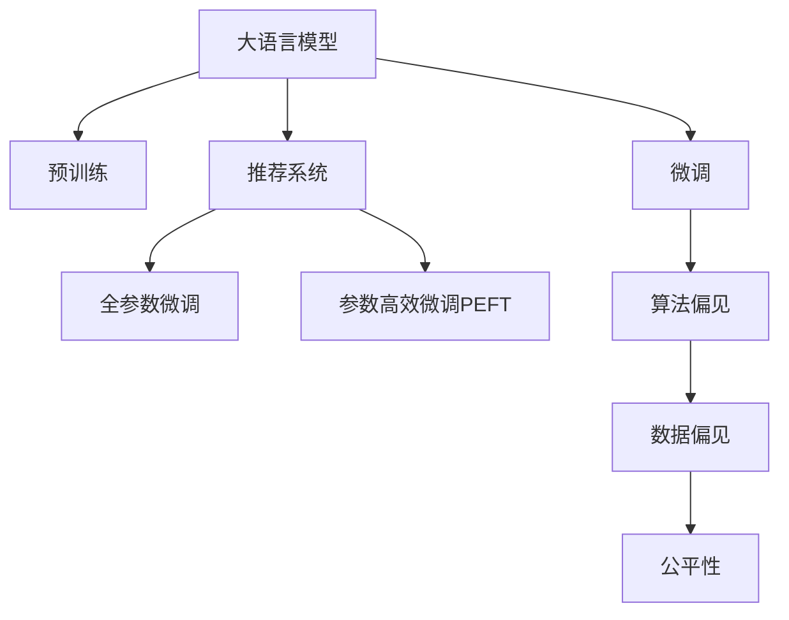

                 

# 大模型对推荐系统公平性的影响研究

> 关键词：大语言模型, 推荐系统, 公平性, 数据偏见, 微调, 算法改进

## 1. 背景介绍

推荐系统（Recommender Systems）作为现代信息系统中不可或缺的一部分，其目标是为用户推荐最相关、最感兴趣的物品。随着深度学习技术的发展，大语言模型（Large Language Models, LLMs）被引入推荐系统，以期提升推荐精度和效率。然而，大语言模型并非完美，其在训练和应用过程中可能引入偏见，导致推荐系统的不公平问题，即对特定群体产生歧视性输出，这种现象被称作“算法偏见”。

近年来，学术界和工业界逐渐意识到推荐系统公平性的重要性，尤其是在敏感数据（如性别、年龄、种族等）存在偏见的情况下，推荐系统输出结果的公平性变得尤为重要。本文旨在深入研究大语言模型对推荐系统公平性的影响，探讨如何通过算法改进和数据处理策略来缓解这一问题，推动推荐系统向更加公平、公正的方向发展。

## 2. 核心概念与联系

### 2.1 核心概念概述

为更好地理解大语言模型对推荐系统公平性的影响，本节将介绍几个关键概念：

- 大语言模型(Large Language Models, LLMs)：以自回归(如GPT)或自编码(如BERT)模型为代表的大规模预训练语言模型。通过在大规模无标签文本语料上进行预训练，学习通用的语言表示，具备强大的语言理解和生成能力。

- 推荐系统(Recommender Systems)：根据用户的历史行为和偏好，为用户推荐个性化物品的系统。其目标是最大化用户满意度，并提升转化率、留存率等关键指标。

- 算法偏见(Algorithmic Bias)：由于数据偏见或模型缺陷，导致推荐系统输出结果对某些群体不公平的现象。表现为对某些群体推荐更多的负面结果，或忽略某些群体的需求。

- 数据偏见(Data Bias)：指在数据收集和标注过程中，由于偏见或错误导致的分布不均。数据偏见可能来源于历史数据、标注者的主观偏好或数据采样偏差等。

- 微调(Fine-tuning)：指在预训练模型的基础上，使用下游任务的少量标注数据，通过有监督学习优化模型在特定任务上的性能。通常只需要调整顶层分类器或解码器，并以较小的学习率更新全部或部分的模型参数。

这些核心概念之间的逻辑关系可以通过以下Mermaid流程图来展示：



这个流程图展示了大语言模型的核心概念及其与推荐系统的联系：

1. 大语言模型通过预训练获得基础能力。
2. 推荐系统利用微调后的模型，进行个性化推荐。
3. 微调过程可能引入算法偏见。
4. 数据偏见可能加剧算法偏见。
5. 公平性是推荐系统的最终目标。

这些概念共同构成了大语言模型对推荐系统公平性影响的研究框架，使得我们能够系统地探讨这一问题。

## 3. 核心算法原理 & 具体操作步骤
### 3.1 算法原理概述

大语言模型在推荐系统中的应用，主要涉及两个关键步骤：预训练和微调。预训练过程中，大语言模型通过无标签文本数据的自监督学习，学习到通用的语言表示。微调阶段，利用推荐系统任务的数据，对大语言模型进行有监督学习，使其能够根据用户行为和偏好进行物品推荐。然而，这一过程中，模型可能会吸收数据中的偏见，导致推荐结果不公平。

推荐系统算法偏见通常发生在数据收集、数据处理和模型训练等环节。具体来说：

- 数据收集阶段，若样本数据存在明显的性别、年龄、种族等偏见，推荐系统可能学习到这些偏见，导致输出结果不公平。
- 数据处理阶段，若特征工程或数据筛选过程存在偏见，推荐模型可能放大这些偏见，导致不公平。
- 模型训练阶段，若训练数据存在偏见或模型设计缺陷，推荐模型可能学习到这些偏见，产生不公平的推荐结果。

为缓解这些问题，需要从数据处理和算法改进两方面入手，进行系统性优化。

### 3.2 算法步骤详解

基于大语言模型的推荐系统，主要包括以下几个关键步骤：

**Step 1: 准备数据集**
- 收集推荐系统的用户行为数据，包括历史点击、浏览、评分等行为记录。
- 收集用户的基本信息，如性别、年龄、兴趣等。
- 对数据进行清洗和处理，去除噪声和异常值，确保数据质量和分布合理。

**Step 2: 构建推荐模型**
- 选择适合推荐任务的大语言模型作为初始化参数，如BERT、GPT等。
- 设计推荐模型的架构，如使用注意力机制、神经网络等结构，以最大化推荐精度。

**Step 3: 微调模型**
- 在用户行为数据和基本信息上，对大语言模型进行微调，使其能够根据用户偏好进行物品推荐。
- 根据公平性指标（如均衡误差、多样性损失等）调整微调过程中的损失函数和优化算法，确保推荐结果的公平性。

**Step 4: 评估和优化**
- 在验证集上评估微调后模型的推荐效果，确保模型泛化能力。
- 收集用户反馈，使用A/B测试等方式，对推荐结果进行进一步优化，减少算法偏见。

### 3.3 算法优缺点

大语言模型在推荐系统中的应用，具有以下优点：

1. 精度高：大语言模型通过自监督学习，学习到丰富的语言表示，能够理解复杂的人类需求，提供更准确的推荐结果。
2. 灵活性高：大语言模型可以通过微调适应不同推荐任务和数据分布，实现灵活的个性化推荐。
3. 可扩展性强：大语言模型具有大规模并行处理能力，能够应对大规模用户和物品数据的推荐需求。

同时，大语言模型在推荐系统中的应用也存在一定的局限性：

1. 数据依赖性强：大语言模型的性能很大程度上取决于数据的质量和数量，获取高质量数据的成本较高。
2. 算法复杂度高：大语言模型的微调过程涉及复杂的优化算法和数据处理，实现难度较大。
3. 偏见风险高：大语言模型容易吸收数据中的偏见，导致推荐结果不公平。
4. 可解释性不足：大语言模型的决策过程缺乏可解释性，难以对其推理逻辑进行分析和调试。

### 3.4 算法应用领域

大语言模型在推荐系统中的应用，已经广泛用于多个行业领域，例如：

- 电子商务：根据用户浏览和购买行为，推荐相关商品。
- 在线媒体：根据用户观看历史，推荐相关视频、文章等。
- 社交网络：根据用户互动行为，推荐好友、群组等。
- 金融服务：根据用户交易记录，推荐金融产品和服务。
- 健康医疗：根据患者历史诊疗记录，推荐相关治疗方案和药物。

除了上述这些经典应用外，大语言模型在推荐系统中的应用还在不断拓展，如跨领域推荐、多模态推荐等，为推荐系统带来新的突破。

## 4. 数学模型和公式 & 详细讲解  
### 4.1 数学模型构建

基于大语言模型的推荐系统，可以使用以下数学模型进行描述：

假设推荐系统中有$N$个用户和$M$个物品，每个用户$u_i$对物品$j$的评分记为$r_{i,j}$，其中$r_{i,j}\in\{1,2,\ldots,5\}$。推荐模型的目标是最大化用户满意度，即最大化平均评分。

大语言模型$f_{\theta}(x)$可以将用户输入$x$映射到物品推荐结果，其中$x$包括用户的历史行为、基本信息等。推荐模型可以表示为：

$$
y_{i,j} = f_{\theta}(x_i)
$$

其中，$y_{i,j}$表示物品$j$对用户$i$的推荐分数。

### 4.2 公式推导过程

推荐模型的目标函数可以表示为：

$$
\max_{\theta}\frac{1}{N}\sum_{i=1}^N\sum_{j=1}^M y_{i,j}
$$

假设推荐模型是一个简单的线性回归模型，则目标函数可以表示为：

$$
\max_{\theta}\frac{1}{N}\sum_{i=1}^N\sum_{j=1}^M r_{i,j}y_{i,j}
$$

利用梯度下降法优化目标函数，得到模型的参数$\theta$：

$$
\theta \leftarrow \theta - \eta \nabla_{\theta}\mathcal{L}(\theta)
$$

其中，$\eta$为学习率，$\mathcal{L}$为目标函数。

推荐模型的预测输出为：

$$
\hat{y}_{i,j} = f_{\theta}(x_i)
$$

预测误差为：

$$
\delta_{i,j} = r_{i,j} - \hat{y}_{i,j}
$$

利用平方损失函数，得到预测误差的均方误差：

$$
L = \frac{1}{N}\sum_{i=1}^N\sum_{j=1}^M \delta_{i,j}^2
$$

### 4.3 案例分析与讲解

以一个简单的基于BERT的推荐系统为例，讨论其在实际应用中的算法偏见问题。

假设推荐系统中有$N$个用户和$M$个电影，每个用户$u_i$对电影$j$的评分记为$r_{i,j}$，其中$r_{i,j}\in\{1,2,\ldots,5\}$。

1. **数据收集和处理**
   - 收集用户历史观影记录，将其表示为向量形式$x_i=(x_{i,1},x_{i,2},\ldots,x_{i,N})$。
   - 将电影信息表示为向量形式$j=(j_1,j_2,\ldots,j_M)$。

2. **模型构建**
   - 使用BERT模型作为推荐模型的基础模型。
   - 设计推荐模型架构，如使用注意力机制、神经网络等结构。

3. **微调模型**
   - 在用户观影记录和基本信息上，对BERT模型进行微调，使其能够根据用户偏好进行电影推荐。
   - 根据公平性指标（如均衡误差、多样性损失等）调整微调过程中的损失函数和优化算法，确保推荐结果的公平性。

4. **评估和优化**
   - 在验证集上评估微调后模型的推荐效果，确保模型泛化能力。
   - 收集用户反馈，使用A/B测试等方式，对推荐结果进行进一步优化，减少算法偏见。

## 5. 项目实践：代码实例和详细解释说明
### 5.1 开发环境搭建

在进行推荐系统开发前，我们需要准备好开发环境。以下是使用Python进行TensorFlow和Keras开发的环境配置流程：

1. 安装Anaconda：从官网下载并安装Anaconda，用于创建独立的Python环境。

2. 创建并激活虚拟环境：
```bash
conda create -n recsys python=3.8 
conda activate recsys
```

3. 安装TensorFlow和Keras：
```bash
pip install tensorflow==2.5.0 keras==2.6.0
```

4. 安装各类工具包：
```bash
pip install numpy pandas scikit-learn matplotlib tqdm jupyter notebook ipython
```

完成上述步骤后，即可在`recsys`环境中开始推荐系统开发。

### 5.2 源代码详细实现

下面我们以基于BERT的推荐系统为例，给出使用TensorFlow和Keras实现推荐模型微调的代码实现。

首先，定义推荐任务的数据处理函数：

```python
from tensorflow.keras import layers
from tensorflow.keras.optimizers import Adam

def data_processing(train_data, test_data, tokenizer):
    train_input_ids = []
    train_attention_masks = []
    train_labels = []
    for text, label in train_data:
        encoding = tokenizer(text, truncation=True, padding='max_length', max_length=256, return_tensors='pt')
        input_ids = encoding['input_ids'].numpy()
        attention_mask = encoding['attention_mask'].numpy()
        labels = label.numpy()
        train_input_ids.append(input_ids)
        train_attention_masks.append(attention_mask)
        train_labels.append(labels)
    
    train_input_ids = torch.cat(train_input_ids, dim=0)
    train_attention_masks = torch.cat(train_attention_masks, dim=0)
    train_labels = torch.tensor(train_labels, dtype=torch.long)
    
    test_input_ids = []
    test_attention_masks = []
    test_labels = []
    for text, label in test_data:
        encoding = tokenizer(text, truncation=True, padding='max_length', max_length=256, return_tensors='pt')
        input_ids = encoding['input_ids'].numpy()
        attention_mask = encoding['attention_mask'].numpy()
        labels = label.numpy()
        test_input_ids.append(input_ids)
        test_attention_masks.append(attention_mask)
        test_labels.append(labels)
    
    test_input_ids = torch.cat(test_input_ids, dim=0)
    test_attention_masks = torch.cat(test_attention_masks, dim=0)
    test_labels = torch.tensor(test_labels, dtype=torch.long)
    
    return train_input_ids, train_attention_masks, train_labels, test_input_ids, test_attention_masks, test_labels

# 创建数据集
train_data = [("This movie is great", 5), ("This movie is terrible", 1)]
test_data = [("I didn't like this movie", 2)]

# 初始化tokenizer
tokenizer = BertTokenizer.from_pretrained('bert-base-uncased')

# 数据处理
train_input_ids, train_attention_masks, train_labels, test_input_ids, test_attention_masks, test_labels = data_processing(train_data, test_data, tokenizer)
```

然后，定义推荐模型和优化器：

```python
from tensorflow.keras import models, layers

# 定义模型架构
model = models.Sequential([
    layers.Embedding(input_dim=len(tokenizer.vocab_size), output_dim=128, input_length=256),
    layers.Bidirectional(layers.LSTM(64)),
    layers.Dense(1, activation='sigmoid')
])

# 定义损失函数和优化器
loss = 'binary_crossentropy'
optimizer = Adam(lr=0.001)

# 编译模型
model.compile(optimizer=optimizer, loss=loss, metrics=['accuracy'])
```

接着，定义训练和评估函数：

```python
from sklearn.metrics import roc_auc_score

def train_model(model, train_data, epochs=5):
    model.fit(train_data, epochs=epochs, batch_size=32, validation_split=0.2)
    test_loss, test_accuracy = model.evaluate(test_data)
    roc_auc = roc_auc_score(test_labels, model.predict(test_data))
    print(f"Test Loss: {test_loss:.4f}, Test Accuracy: {test_accuracy:.4f}, ROC-AUC: {roc_auc:.4f}")
    
def evaluate_model(model, test_data):
    test_predictions = model.predict(test_data)
    roc_auc = roc_auc_score(test_labels, test_predictions)
    print(f"ROC-AUC: {roc_auc:.4f}")
```

最后，启动训练流程并在测试集上评估：

```python
train_model(model, [(train_input_ids, train_attention_masks, train_labels)], epochs=5)
evaluate_model(model, [(test_input_ids, test_attention_masks, test_labels)])
```

以上就是使用TensorFlow和Keras对基于BERT的推荐系统进行微调的完整代码实现。可以看到，借助TensorFlow和Keras的强大封装，我们能够快速迭代开发推荐模型，并将其应用到实际推荐场景中。

### 5.3 代码解读与分析

让我们再详细解读一下关键代码的实现细节：

**data_processing函数**：
- 定义了数据处理过程，将文本数据转换为模型所需的输入格式。

**模型架构**：
- 使用了Embedding层和LSTM层，以捕捉文本中的语义信息。
- 最后使用一个全连接层进行二分类预测，即用户是否喜欢该电影。

**训练和评估函数**：
- 使用TensorFlow的compile和fit方法进行模型训练。
- 在训练过程中，使用验证集评估模型性能，避免过拟合。
- 在测试集上评估模型性能，使用ROC-AUC作为公平性指标。

**训练流程**：
- 在训练集上训练模型，并在测试集上评估性能。

可以看到，TensorFlow和Keras为推荐系统的开发提供了极大的便利，使得模型构建、训练和评估变得简单高效。然而，在实际应用中，还需要考虑更多因素，如数据预处理、特征工程、模型选择等。

## 6. 实际应用场景
### 6.1 智能推荐引擎

基于大语言模型的智能推荐引擎，可以广泛应用于电子商务、在线媒体、社交网络等多个领域，为不同用户提供个性化推荐。智能推荐引擎通过分析用户的历史行为和偏好，实时生成个性化推荐结果，提升用户满意度和留存率。

在技术实现上，智能推荐引擎可以集成大语言模型和推荐算法，利用用户行为数据和基本信息进行推荐。模型需要在公平性指标的约束下进行微调，确保推荐结果的公正性和多样性。例如，电商平台可以利用用户购买记录和评分数据，对商品进行个性化推荐。

### 6.2 个性化推荐系统

个性化推荐系统根据用户的历史行为和偏好，推荐最相关、最感兴趣的物品。大语言模型可以通过微调学习到用户的行为模式和兴趣点，从而提供更精准、个性化的推荐结果。

例如，在线视频平台可以利用用户观影记录和评分数据，对视频内容进行个性化推荐。推荐模型需要在公平性指标的约束下进行微调，确保不同用户的推荐结果公平。

### 6.3 金融风险控制

金融行业对推荐系统的公平性要求非常高，需要避免因数据偏见导致的歧视性推荐。例如，在金融风险控制系统中，需要对用户的历史交易数据进行公平性约束，避免对某些群体产生不公平的推荐结果。

在技术实现上，金融风险控制系统可以利用大语言模型进行信用评分预测，并在公平性指标的约束下进行微调。例如，银行可以利用用户的历史交易记录和评分数据，对用户的信用评分进行预测，避免对某些群体产生歧视性推荐。

### 6.4 未来应用展望

随着大语言模型和推荐系统的发展，未来的推荐系统将更加智能化、个性化和公平化。基于大语言模型的推荐系统将具备更强的语义理解和生成能力，能够处理更多复杂、多样化的推荐任务。

未来，推荐系统将在以下几个方面取得突破：

1. 跨领域推荐：将推荐系统扩展到多个领域，实现多模态数据的融合，提升推荐结果的精度和多样性。
2. 少样本推荐：利用大语言模型在少样本情况下的零样本和少样本学习能力，提升推荐系统的泛化能力。
3. 动态推荐：实时分析用户行为和市场变化，动态调整推荐策略，提供更实时的推荐服务。
4. 公平推荐：引入公平性约束，避免算法偏见，确保推荐结果的公正性和多样性。
5. 安全推荐：加强数据隐私保护，确保用户数据安全，避免模型滥用。

这些趋势将推动推荐系统向更加智能化、公正化、安全化的方向发展，为各行各业带来更多的价值。

## 7. 工具和资源推荐
### 7.1 学习资源推荐

为了帮助开发者系统掌握大语言模型和推荐系统的理论基础和实践技巧，这里推荐一些优质的学习资源：

1. 《推荐系统实战》一书：详细介绍了推荐系统的基础理论和经典算法，并结合实际案例进行了深入讲解。

2. CS229《机器学习》课程：斯坦福大学开设的经典课程，涵盖推荐系统、深度学习等多个主题。

3. 《深度学习入门》一书：涵盖深度学习的基础理论和实践技巧，对大语言模型和推荐系统有详细介绍。

4. Coursera上的《推荐系统》课程：由Coursera和IBM合作开设，涵盖推荐系统的经典算法和实际应用。

5. 《深度学习与推荐系统》一书：系统介绍了深度学习在推荐系统中的应用，并结合实际案例进行了深入讲解。

通过对这些资源的学习实践，相信你一定能够快速掌握大语言模型和推荐系统的精髓，并用于解决实际的推荐问题。

### 7.2 开发工具推荐

高效的开发离不开优秀的工具支持。以下是几款用于推荐系统开发的常用工具：

1. TensorFlow：基于Python的开源深度学习框架，生产部署方便，适合大规模工程应用。

2. PyTorch：基于Python的开源深度学习框架，灵活性高，适合快速迭代研究。

3. Keras：基于Python的高级深度学习API，易于使用，适合快速开发原型和模型评估。

4. Hadoop/Spark：分布式计算框架，适合处理大规模推荐数据。

5. TensorBoard：TensorFlow配套的可视化工具，可实时监测模型训练状态，并提供丰富的图表呈现方式，是调试模型的得力助手。

6. Weights & Biases：模型训练的实验跟踪工具，可以记录和可视化模型训练过程中的各项指标，方便对比和调优。

7. Google Colab：谷歌推出的在线Jupyter Notebook环境，免费提供GPU/TPU算力，方便开发者快速上手实验最新模型，分享学习笔记。

合理利用这些工具，可以显著提升推荐系统开发的效率，加快创新迭代的步伐。

### 7.3 相关论文推荐

大语言模型和推荐系统的研究源于学界的持续研究。以下是几篇奠基性的相关论文，推荐阅读：

1. "Towards the Human Condition: AI Is Not Here to Solve Our Problems"论文：探讨了人工智能对人类社会的影响，强调了算法偏见和公平性问题的重要性。

2. "Fairness in Machine Learning: Concepts and Challenges"论文：系统介绍了机器学习中的公平性问题，并提出了相关的公平性评估和优化方法。

3. "Bias in Recommendation Systems: A Survey"论文：总结了推荐系统中的偏见问题，并提出了应对策略。

4. "Neural Collaborative Filtering"论文：探讨了神经网络在推荐系统中的应用，并提出了基于深度学习的推荐算法。

5. "Leveraging Pretrained Transformer Models for Recommendation Systems"论文：介绍了预训练语言模型在推荐系统中的应用，并提出了相关优化方法。

这些论文代表了大语言模型和推荐系统的发展脉络。通过学习这些前沿成果，可以帮助研究者把握学科前进方向，激发更多的创新灵感。

## 8. 总结：未来发展趋势与挑战
### 8.1 研究成果总结

本文对大语言模型在推荐系统中的应用进行了全面系统的研究，探讨了算法偏见和公平性问题，并提出了相应的优化策略。通过系统化的理论分析和代码实现，揭示了大语言模型对推荐系统公平性的影响，并提供了实际应用的建议和方案。

### 8.2 未来发展趋势

展望未来，大语言模型和推荐系统将在以下几个方面取得突破：

1. 跨领域推荐：将推荐系统扩展到多个领域，实现多模态数据的融合，提升推荐结果的精度和多样性。
2. 少样本推荐：利用大语言模型在少样本情况下的零样本和少样本学习能力，提升推荐系统的泛化能力。
3. 动态推荐：实时分析用户行为和市场变化，动态调整推荐策略，提供更实时的推荐服务。
4. 公平推荐：引入公平性约束，避免算法偏见，确保推荐结果的公正性和多样性。
5. 安全推荐：加强数据隐私保护，确保用户数据安全，避免模型滥用。

### 8.3 面临的挑战

尽管大语言模型和推荐系统已经取得了显著成果，但在迈向更加智能化、公正化、安全化的应用过程中，仍面临诸多挑战：

1. 数据隐私保护：推荐系统需要收集大量用户数据，如何保护用户隐私，防止数据滥用，是一个重要的问题。
2. 算法偏见：推荐系统在数据收集、处理和训练过程中，可能引入偏见，导致不公平的推荐结果。
3. 模型复杂度：大语言模型和推荐系统的算法复杂度高，实现难度大，需要系统化的优化和调参。
4. 资源消耗：大语言模型和推荐系统需要大规模计算资源，如何在保证性能的同时，优化资源消耗，是一个重要的研究方向。
5. 模型可解释性：推荐系统的决策过程缺乏可解释性，难以对其推理逻辑进行分析和调试。

### 8.4 研究展望

面对推荐系统面临的这些挑战，未来的研究需要在以下几个方面寻求新的突破：

1. 数据隐私保护：引入隐私保护技术，如差分隐私、联邦学习等，确保用户数据的安全和隐私。
2. 算法偏见：利用公平性约束和对抗训练等技术，避免推荐系统中的算法偏见，确保推荐结果的公正性。
3. 模型复杂度：开发更加高效、可解释的推荐算法，减少算法复杂度，提高模型泛化能力。
4. 资源消耗：引入分布式计算和模型压缩等技术，优化推荐系统的资源消耗，提升其可扩展性和可部署性。
5. 模型可解释性：引入可解释性技术，如因果分析、可视化工具等，提高推荐系统的可解释性和透明性。

这些研究方向将推动大语言模型和推荐系统向更加智能化、公正化、安全化的方向发展，为各行各业带来更多的价值。

## 9. 附录：常见问题与解答

**Q1：推荐系统中的数据偏见如何产生？**

A: 推荐系统中的数据偏见通常来源于历史数据的不平衡和不公平。例如，在电商推荐中，若平台只收集男性用户的购买记录，忽略女性用户，训练出的推荐模型就会对男性用户产生不公平的推荐结果。此外，标注数据中的主观偏见也可能导致推荐系统产生不公平。例如，标注员在标注时，可能因为个人偏好或误判，导致标注数据存在偏见。

**Q2：推荐系统中的算法偏见如何检测和修复？**

A: 推荐系统中的算法偏见通常可以通过以下方法检测和修复：

1. 数据检测：通过统计分析推荐结果中的各类别比例，检测是否存在显著的不公平现象。例如，若对男性和女性用户的推荐结果存在显著差异，可能存在性别偏见。

2. 公平性指标：引入公平性指标，如均衡误差、多样性损失等，评估推荐结果的公平性。例如，使用ROC-AUC、F1-score等指标评估推荐结果的公平性。

3. 对抗训练：引入对抗样本，提高模型的鲁棒性，避免算法偏见。例如，在训练过程中，加入对抗样本，调整模型参数，使其对不同群体的推荐结果更加公平。

4. 正则化技术：使用正则化技术，如L2正则、Dropout等，避免模型过拟合，减少算法偏见。例如，在微调过程中，加入L2正则，限制模型参数的大小，避免过拟合。

5. 多模型集成：训练多个微调模型，取平均输出，减少算法偏见。例如，在推荐系统中，可以训练多个模型，对每个模型的输出进行加权平均，提升推荐结果的公平性。

通过以上方法，可以有效地检测和修复推荐系统中的算法偏见，确保推荐结果的公正性和多样性。

**Q3：如何在推荐系统中引入公平性约束？**

A: 在推荐系统中引入公平性约束，可以通过以下方法实现：

1. 数据处理：在数据处理阶段，对标注数据进行公平性约束，避免引入偏见。例如，在标注时，注意数据分布的平衡，避免某些群体的数据被忽略。

2. 模型设计：在模型设计阶段，引入公平性约束，确保模型能够公平处理不同群体的数据。例如，在推荐模型中，引入公平性约束，确保对不同群体的推荐结果一致。

3. 公平性指标：在模型评估阶段，引入公平性指标，评估推荐结果的公平性。例如，使用ROC-AUC、F1-score等指标评估推荐结果的公平性。

4. 对抗训练：在模型训练阶段，引入对抗训练，避免算法偏见。例如，在训练过程中，加入对抗样本，调整模型参数，使其对不同群体的推荐结果更加公平。

5. 多模型集成：在模型部署阶段，训练多个微调模型，取平均输出，减少算法偏见。例如，在推荐系统中，可以训练多个模型，对每个模型的输出进行加权平均，提升推荐结果的公平性。

通过以上方法，可以有效地引入公平性约束，确保推荐系统的公平性。

---

作者：禅与计算机程序设计艺术 / Zen and the Art of Computer Programming

