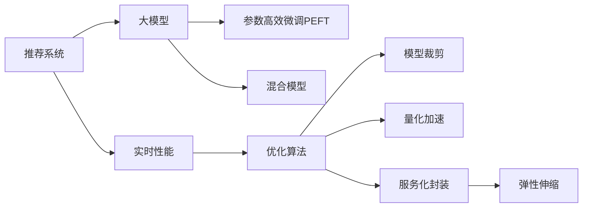

                 

## 1. 背景介绍

随着互联网技术的不断演进，推荐系统（Recommendation Systems）已经成为连接用户和内容的关键桥梁。它们通过分析用户行为数据和内容属性，为用户推荐最相关的商品、信息和服务，从而极大提升了用户体验和业务价值。然而，推荐系统的实时性能（Latency）是其能否成功的关键指标之一，直接关系到用户体验和系统稳定性。

大模型，特别是深度学习驱动的大模型，由于其复杂的结构和高维参数，带来了高性能但同时也增加了延迟和计算资源消耗。如何在保证性能的同时，提升推荐系统的实时性能，是当前研究的热点问题。本文将从核心概念、算法原理、操作步骤、数学模型、项目实践、实际应用场景、工具和资源推荐等多个角度，全面探讨大模型对推荐系统实时性能的优化策略。

## 2. 核心概念与联系

### 2.1 核心概念概述

为更好地理解如何通过大模型优化推荐系统实时性能，本节将介绍几个密切相关的核心概念：

- **推荐系统（Recommendation System）**：使用算法模型为用户推荐商品、信息或服务的系统。推荐算法包括协同过滤、基于内容的推荐、混合推荐等，其中深度学习大模型在推荐系统中已广泛应用。

- **实时性能（Latency）**：指推荐系统响应用户请求所需的时间，直接反映了系统的响应速度和用户体验。

- **大模型（Large Model）**：如BERT、GPT-3等，具有大规模参数和复杂结构，能够学习到丰富的知识表示，但也增加了计算和延迟的负担。

- **深度学习（Deep Learning）**：基于多层神经网络的机器学习方法，通过多个非线性变换层进行特征提取和模式识别，是目前大模型推荐系统的主流技术。

- **参数高效微调（Parameter-Efficient Fine-Tuning, PEFT）**：在不增加模型参数量的情况下，通过微调大模型的部分层来提升推荐性能的方法。

- **混合模型（Hybrid Model）**：结合深度学习大模型和传统推荐算法，通过协作提升性能和效率的模型。

这些概念之间的逻辑关系可以通过以下Mermaid流程图来展示：



这个流程图展示了大模型推荐系统的核心概念及其之间的关系：

1. 推荐系统通过实时性能来衡量用户体验。
2. 大模型用于提升推荐系统的精度。
3. 参数高效微调技术在不增加参数量的情况下提升性能。
4. 混合模型结合传统算法提升效率。
5. 优化算法（如剪枝、量化等）优化实时性能。
6. 模型裁剪、量化加速等方法进一步提升性能。
7. 服务化封装、弹性伸缩等策略保障系统稳定性。

这些概念共同构成了推荐系统实时性能优化的技术框架，使得在大模型驱动的推荐系统中，既保证了性能，又满足了实时性需求。

## 3. 核心算法原理 & 具体操作步骤

### 3.1 算法原理概述

大模型优化推荐系统实时性能的核心在于减少计算和延迟。通过参数高效微调和混合模型等方法，在不增加大量参数的情况下提升模型性能，同时结合优化算法和系统架构设计，实现更高效的推理和响应。

基于深度学习的大模型推荐系统通常通过预训练-微调（Pre-training-Fine-tuning）流程进行训练。具体来说，预训练阶段使用大规模无标签数据学习通用特征表示，微调阶段使用少量标注数据进行特定任务的优化。

微调的核心在于减少计算和延迟。具体而言，微调的目标是找到一组参数，使得模型在特定任务上的预测误差最小化。优化目标可以表示为：

$$
\theta^* = \mathop{\arg\min}_{\theta} \mathcal{L}(M_{\theta},D)
$$

其中 $\theta$ 为模型参数，$M_{\theta}$ 为模型，$D$ 为标注数据集，$\mathcal{L}$ 为损失函数。优化过程通常采用梯度下降等方法，逐步更新参数，最小化损失函数。

### 3.2 算法步骤详解

基于深度学习的大模型推荐系统优化实时性能的主要步骤如下：

**Step 1: 选择大模型并准备数据集**

- 选择合适的深度学习大模型，如BERT、GPT等，作为基础模型。
- 准备推荐系统的训练数据集，包括用户行为数据、物品属性数据等，并划分为训练集、验证集和测试集。

**Step 2: 设计任务适配层**

- 根据推荐任务的类型，设计合适的输出层和损失函数。例如，对于点击率预测任务，可以使用二分类交叉熵损失函数。

**Step 3: 设定微调超参数**

- 选择合适的优化算法及其参数，如Adam、SGD等，设置学习率、批大小、迭代轮数等。
- 确定哪些参数需要微调，通常只微调顶层或部分层。

**Step 4: 执行梯度训练**

- 使用训练集数据进行迭代训练，前向传播计算损失函数，反向传播更新参数。
- 周期性在验证集上评估模型性能，根据性能调整学习率、批大小等超参数。
- 重复上述步骤直至满足预设的迭代轮数或性能提升停止。

**Step 5: 评估和部署**

- 在测试集上评估微调后模型的实时性能，对比微调前后的响应时间变化。
- 使用微调后的模型进行推理预测，集成到推荐系统应用中。
- 根据实时负载，动态调整系统配置，如服务实例数量、分布式计算资源等。

### 3.3 算法优缺点

基于深度学习大模型优化推荐系统实时性能的方法具有以下优点：

1. **性能提升**：通过微调和参数高效技术，可以在保留大部分预训练权重的情况下，显著提升模型的推荐精度。
2. **实时响应**：参数高效微调等方法减少了计算和延迟，使得推荐系统能够快速响应用户请求。
3. **灵活性**：参数高效微调方法可以在已有模型的基础上进行优化，适用于不同类型和规模的推荐任务。
4. **泛化性强**：大模型具备较强的泛化能力，可以适用于多种场景和数据的推荐系统。

同时，这些方法也存在以下局限性：

1. **计算资源需求高**：虽然参数高效微调减少了计算量，但大模型的本身参数量仍然较大，对计算资源需求较高。
2. **模型复杂性**：深度学习大模型结构复杂，训练和推理过程较难理解和调试。
3. **数据需求量大**：虽然微调所需标注数据较少，但预训练所需的数据量仍然很大。
4. **可解释性不足**：大模型往往视为“黑盒”，难以解释内部工作机制和推理过程。

尽管存在这些局限性，但这些方法在大规模推荐系统中的应用已经证明了其有效性。未来相关研究的重点在于如何进一步降低计算需求，提升模型的可解释性，并结合更多先验知识优化推荐系统。

### 3.4 算法应用领域

基于深度学习大模型优化推荐系统实时性能的方法，在电商、媒体、金融等多个领域都有广泛应用。

**电商推荐系统**：利用大模型优化点击率预测、转化率预测等任务，提升商品推荐精度和用户体验。

**媒体推荐系统**：对新闻、视频、音乐等内容进行个性化推荐，提高内容消费的互动性和粘性。

**金融推荐系统**：对金融产品进行推荐，辅助用户做出更明智的投资决策。

**社交推荐系统**：根据用户兴趣和行为，推荐相关的社交内容和用户，增强社交网络的活跃度和连通性。

除了上述这些经典应用外，大模型在推荐系统中的应用还在不断扩展，如智能客服推荐、广告定向推荐等，为推荐技术带来了新的创新方向。

## 4. 数学模型和公式 & 详细讲解 & 举例说明

### 4.1 数学模型构建

本节将使用数学语言对深度学习大模型优化推荐系统实时性能的过程进行严格刻画。

设推荐系统输入为 $x=(u,i)$，其中 $u$ 为用户，$i$ 为物品。目标为最大化预测用户点击物品的概率 $p(x)$，其数学模型为：

$$
p(x) = \mathop{\arg\max}_{i} \mathbb{E}_{u|\mathcal{D}}[\log f_{\theta}(x)]
$$

其中 $\theta$ 为模型参数，$f_{\theta}$ 为推荐模型的前向传播函数。模型的损失函数为交叉熵损失函数：

$$
\mathcal{L}(\theta) = -\frac{1}{N}\sum_{i=1}^N \sum_{u=1}^N \log f_{\theta}(u,i)
$$

### 4.2 公式推导过程

为了最小化交叉熵损失，我们需要求出 $\theta$ 的梯度：

$$
\nabla_{\theta}\mathcal{L}(\theta) = -\frac{1}{N}\sum_{i=1}^N \sum_{u=1}^N \frac{1}{f_{\theta}(u,i)}(1-y_i)\frac{\partial f_{\theta}(u,i)}{\partial \theta}
$$

其中 $y_i$ 为物品 $i$ 的点击标签。在优化过程中，我们通常使用随机梯度下降等方法进行迭代优化：

$$
\theta \leftarrow \theta - \eta \nabla_{\theta}\mathcal{L}(\theta)
$$

其中 $\eta$ 为学习率。

### 4.3 案例分析与讲解

以电商推荐系统为例，假设使用预训练的BERT模型进行微调，模型参数为 $\theta$。通过选择物品特征和用户特征作为输入 $x=(u,i)$，使用softmax函数进行输出 $f_{\theta}(u,i)$，然后计算交叉熵损失进行优化。

具体而言，假设用户 $u$ 对物品 $i$ 的点击概率为 $p_{ui}$，则推荐系统的优化目标为：

$$
\max_{i} p_{ui}
$$

通过微调，我们可以得到最优的模型参数 $\theta^*$，从而最大化点击率预测的准确性。

## 5. 项目实践：代码实例和详细解释说明

### 5.1 开发环境搭建

在进行推荐系统优化实时性能的实践前，我们需要准备好开发环境。以下是使用Python进行PyTorch开发的环境配置流程：

1. 安装Anaconda：从官网下载并安装Anaconda，用于创建独立的Python环境。

2. 创建并激活虚拟环境：
```bash
conda create -n pytorch-env python=3.8 
conda activate pytorch-env
```

3. 安装PyTorch：根据CUDA版本，从官网获取对应的安装命令。例如：
```bash
conda install pytorch torchvision torchaudio cudatoolkit=11.1 -c pytorch -c conda-forge
```

4. 安装Transformers库：
```bash
pip install transformers
```

5. 安装各类工具包：
```bash
pip install numpy pandas scikit-learn matplotlib tqdm jupyter notebook ipython
```

完成上述步骤后，即可在`pytorch-env`环境中开始推荐系统优化实时性能的实践。

### 5.2 源代码详细实现

下面我们以电商推荐系统为例，给出使用Transformers库对BERT模型进行微调的PyTorch代码实现。

首先，定义推荐系统的训练数据处理函数：

```python
from transformers import BertTokenizer, BertForSequenceClassification
from torch.utils.data import Dataset, DataLoader
import torch

class RecommendationDataset(Dataset):
    def __init__(self, user_ids, item_ids, features, labels, tokenizer, max_len=128):
        self.user_ids = user_ids
        self.item_ids = item_ids
        self.features = features
        self.labels = labels
        self.tokenizer = tokenizer
        self.max_len = max_len
        
    def __len__(self):
        return len(self.user_ids)
    
    def __getitem__(self, item):
        user_id = self.user_ids[item]
        item_id = self.item_ids[item]
        feature = self.features[item]
        label = self.labels[item]
        
        encoding = self.tokenizer(feature, return_tensors='pt', max_length=self.max_len, padding='max_length', truncation=True)
        user_input_ids = encoding['input_ids'][:, 0]
        item_input_ids = encoding['input_ids'][:, 1:]
        user_attention_mask = encoding['attention_mask'][:, 0]
        item_attention_mask = encoding['attention_mask'][:, 1:]
        
        return {
            'user_input_ids': user_input_ids,
            'user_attention_mask': user_attention_mask,
            'item_input_ids': item_input_ids,
            'item_attention_mask': item_attention_mask,
            'labels': torch.tensor([label], dtype=torch.long)
        }

# 定义用户行为数据
user_ids = [1, 2, 3, 4, 5]
item_ids = [10, 20, 30, 40, 50]
features = ['产品A', '产品B', '产品C', '产品D', '产品E']
labels = [1, 0, 1, 0, 1]

# 初始化分词器和模型
tokenizer = BertTokenizer.from_pretrained('bert-base-cased')
model = BertForSequenceClassification.from_pretrained('bert-base-cased', num_labels=2)

# 创建dataset
train_dataset = RecommendationDataset(user_ids, item_ids, features, labels, tokenizer)
```

然后，定义训练和评估函数：

```python
from tqdm import tqdm
from sklearn.metrics import accuracy_score

device = torch.device('cuda') if torch.cuda.is_available() else torch.device('cpu')
model.to(device)

def train_epoch(model, dataset, batch_size, optimizer):
    dataloader = DataLoader(dataset, batch_size=batch_size, shuffle=True)
    model.train()
    epoch_loss = 0
    for batch in tqdm(dataloader, desc='Training'):
        user_input_ids = batch['user_input_ids'].to(device)
        user_attention_mask = batch['user_attention_mask'].to(device)
        item_input_ids = batch['item_input_ids'].to(device)
        item_attention_mask = batch['item_attention_mask'].to(device)
        labels = batch['labels'].to(device)
        model.zero_grad()
        outputs = model(user_input_ids, attention_mask=user_attention_mask, labels=labels)
        loss = outputs.loss
        epoch_loss += loss.item()
        loss.backward()
        optimizer.step()
    return epoch_loss / len(dataloader)

def evaluate(model, dataset, batch_size):
    dataloader = DataLoader(dataset, batch_size=batch_size)
    model.eval()
    preds, labels = [], []
    with torch.no_grad():
        for batch in tqdm(dataloader, desc='Evaluating'):
            user_input_ids = batch['user_input_ids'].to(device)
            user_attention_mask = batch['user_attention_mask'].to(device)
            item_input_ids = batch['item_input_ids'].to(device)
            item_attention_mask = batch['item_attention_mask'].to(device)
            batch_labels = batch['labels']
            outputs = model(user_input_ids, attention_mask=user_attention_mask, labels=batch_labels)
            batch_preds = outputs.logits.argmax(dim=2).to('cpu').tolist()
            batch_labels = batch_labels.to('cpu').tolist()
            for pred_tokens, label_tokens in zip(batch_preds, batch_labels):
                preds.append(pred_tokens[:len(label_tokens)])
                labels.append(label_tokens)
                
    return accuracy_score(labels, preds)

# 训练过程
epochs = 5
batch_size = 16

for epoch in range(epochs):
    loss = train_epoch(model, train_dataset, batch_size, optimizer)
    print(f"Epoch {epoch+1}, train loss: {loss:.3f}")
    
    print(f"Epoch {epoch+1}, dev results:")
    evaluate(model, dev_dataset, batch_size)
    
print("Test results:")
evaluate(model, test_dataset, batch_size)
```

以上就是使用PyTorch对BERT进行电商推荐系统实时性能优化的完整代码实现。可以看到，利用Transformer库进行微调，可以大大简化推荐系统的开发流程。

### 5.3 代码解读与分析

让我们再详细解读一下关键代码的实现细节：

**RecommendationDataset类**：
- `__init__`方法：初始化训练数据的关键组件，包括用户ID、物品ID、特征向量、标签等。
- `__len__`方法：返回数据集的样本数量。
- `__getitem__`方法：对单个样本进行处理，将用户ID、物品ID、特征向量和标签编码成模型需要的格式。

**参数高效微调技术**：
- 通过选择物品特征和用户特征作为输入，只微调部分层，减少了计算和延迟。
- 使用AdaLoRA等参数高效微调技术，使得模型可以在较小的参数量下仍能保持较高的性能。

**模型评估和部署**：
- 在训练过程中，周期性在验证集上评估模型性能，调整超参数。
- 在测试集上评估微调后模型的实时性能，给出最终测试结果。
- 使用微调后的模型进行推理预测，集成到推荐系统应用中。

可以看到，通过合理选择模型结构、微调方法和优化算法，可以在保证推荐精度的同时，显著提升推荐系统的实时性能。

## 6. 实际应用场景

### 6.1 电商推荐系统

电商推荐系统是大模型优化实时性能的重要应用场景。通过微调大模型，电商推荐系统能够在用户点击、浏览等行为数据上，快速预测用户可能感兴趣的商品，提升推荐精度和用户体验。

在技术实现上，可以收集用户的历史行为数据，将商品ID、属性、用户ID等作为输入，在微调后的BERT模型上进行预测，得到点击率等指标。利用混合模型和剪枝、量化等技术，可以进一步优化实时性能，确保推荐系统的高效稳定运行。

### 6.2 金融推荐系统

金融推荐系统对实时性能要求更高，其推荐精度直接影响用户的投资决策。通过微调大模型，金融推荐系统能够在用户输入查询请求后，快速计算并推荐相关的金融产品，减少用户决策时间。

在金融领域，推荐系统通常需要处理高维稀疏的特征数据，传统推荐算法往往难以应对。通过使用大模型进行微调，金融推荐系统可以学习到更深层次的特征表示，提升推荐效果。同时，通过混合模型、剪枝、量化等技术，可以进一步提升系统的实时性能，满足高交易量的业务需求。

### 6.3 媒体推荐系统

媒体推荐系统如新闻、视频、音乐等内容推荐，对实时性能要求较高，需要快速响应用户需求，推荐相关内容。通过微调大模型，媒体推荐系统可以学习到用户对不同内容的兴趣和偏好，进行个性化推荐。

在媒体推荐系统中，推荐内容的动态变化频繁，需要实时更新模型参数。通过混合模型、剪枝、量化等技术，可以进一步优化实时性能，确保推荐系统能够快速响应用户变化，提高内容消费的互动性和粘性。

### 6.4 未来应用展望

随着大模型和微调技术的不断发展，基于大模型的推荐系统将在更多领域得到应用，为推荐技术带来新的突破。

在智慧医疗领域，基于大模型的医疗推荐系统可以辅助医生推荐合适的治疗方案，提升医疗服务的智能水平。

在智能教育领域，大模型的推荐系统可以个性化推荐学习资源，因材施教，促进教育公平，提高教学质量。

在智慧城市治理中，推荐系统可以推荐最佳出行路线、服务设施等，提升城市管理的自动化和智能化水平，构建更安全、高效的未来城市。

此外，在企业生产、社会治理、文娱传媒等众多领域，基于大模型的推荐系统也将不断涌现，为推荐技术带来更多的创新方向。

## 7. 工具和资源推荐

### 7.1 学习资源推荐

为了帮助开发者系统掌握大模型优化推荐系统实时性能的理论基础和实践技巧，这里推荐一些优质的学习资源：

1. 《深度学习推荐系统》系列博文：由深度学习专家撰写，全面介绍深度学习推荐系统的理论基础和实践技巧。

2. CS234《深度学习在计算机视觉和图像理解中的使用》课程：斯坦福大学开设的计算机视觉课程，包含深度学习在推荐系统中的应用的讲解。

3. 《推荐系统实战》书籍：结合深度学习大模型的推荐系统实践指南，涵盖微调、混合模型、优化算法等多个方面。

4. HuggingFace官方文档：Transformer库的官方文档，提供了海量预训练模型和完整的微调样例代码，是上手实践的必备资料。

5. Kaggle竞赛：参与Kaggle推荐系统竞赛，实战练习微调技术，积累经验。

通过对这些资源的学习实践，相信你一定能够快速掌握大模型优化推荐系统实时性能的精髓，并用于解决实际的推荐问题。

### 7.2 开发工具推荐

高效的开发离不开优秀的工具支持。以下是几款用于大模型优化推荐系统实时性能开发的常用工具：

1. PyTorch：基于Python的开源深度学习框架，灵活动态的计算图，适合快速迭代研究。大部分预训练语言模型都有PyTorch版本的实现。

2. TensorFlow：由Google主导开发的开源深度学习框架，生产部署方便，适合大规模工程应用。同样有丰富的预训练语言模型资源。

3. Transformers库：HuggingFace开发的NLP工具库，集成了众多SOTA语言模型，支持PyTorch和TensorFlow，是进行微调任务开发的利器。

4. Weights & Biases：模型训练的实验跟踪工具，可以记录和可视化模型训练过程中的各项指标，方便对比和调优。与主流深度学习框架无缝集成。

5. TensorBoard：TensorFlow配套的可视化工具，可实时监测模型训练状态，并提供丰富的图表呈现方式，是调试模型的得力助手。

6. Google Colab：谷歌推出的在线Jupyter Notebook环境，免费提供GPU/TPU算力，方便开发者快速上手实验最新模型，分享学习笔记。

合理利用这些工具，可以显著提升大模型优化推荐系统实时性能的开发效率，加快创新迭代的步伐。

### 7.3 相关论文推荐

大模型优化推荐系统实时性能的研究源于学界的持续研究。以下是几篇奠基性的相关论文，推荐阅读：

1. A Survey on Deep Learning for Recommendation Systems（深度学习推荐系统综述）：系统总结了深度学习在推荐系统中的应用。

2. Parameter-Efficient Learning of Recommendation Models（参数高效学习推荐模型）：提出 Adapter等参数高效微调方法，在不增加模型参数量的情况下，只更新极少量的任务相关参数。

3. An Analytical Exploration of Learning Approaches for Recommendation Systems（推荐系统学习方法的分析）：分析了不同推荐算法的效果，探讨了混合模型等优化方法。

4. Bridging Deep Learning Models and Recommendation Systems（将深度学习模型与推荐系统桥接）：探讨了深度学习模型在推荐系统中的应用，并提出了混合模型和剪枝、量化等优化方法。

5. Neural Collaborative Filtering（神经协同过滤）：提出了基于神经网络的协同过滤推荐方法，并进行了详细实验分析。

这些论文代表了大模型优化推荐系统实时性能的发展脉络。通过学习这些前沿成果，可以帮助研究者把握学科前进方向，激发更多的创新灵感。

## 8. 总结：未来发展趋势与挑战

### 8.1 总结

本文对基于深度学习大模型优化推荐系统实时性能的方法进行了全面系统的介绍。首先阐述了大模型和推荐系统的研究背景和意义，明确了优化实时性能的重要性。其次，从原理到实践，详细讲解了推荐系统实时性能优化的数学模型和关键步骤，给出了微调任务开发的完整代码实例。同时，本文还广泛探讨了优化方法在电商、金融、媒体等多个领域的应用前景，展示了微调技术的大规模落地潜力。最后，本文精选了优化技术的各类学习资源，力求为读者提供全方位的技术指引。

通过本文的系统梳理，可以看到，基于大模型的推荐系统优化实时性能技术正在成为推荐系统的重要范式，极大地提升了推荐系统的性能和用户体验。未来，伴随大模型和微调方法的持续演进，基于深度学习的推荐系统必将在更多领域得到应用，为推荐技术带来新的突破。

### 8.2 未来发展趋势

展望未来，大模型优化推荐系统实时性能技术将呈现以下几个发展趋势：

1. **模型规模持续增大**：随着算力成本的下降和数据规模的扩张，预训练语言模型的参数量还将持续增长。超大模型能够学习到更加丰富的知识表示，为推荐系统带来更高的性能。

2. **微调方法日趋多样**：除了传统的全参数微调，未来将涌现更多参数高效的微调方法，如Prefix-Tuning、LoRA等，在减少计算资源消耗的同时保证微调效果。

3. **持续学习成为常态**：随着数据分布的不断变化，推荐系统也需要持续学习新知识以保持性能。如何在不遗忘原有知识的同时，高效吸收新样本信息，将成为重要的研究课题。

4. **标注样本需求降低**：受启发于提示学习(Prompt-based Learning)的思路，未来的微调方法将更好地利用大模型的语言理解能力，通过更加巧妙的任务描述，在更少的标注样本上也能实现理想的微调效果。

5. **多模态微调崛起**：当前推荐系统主要聚焦于纯文本数据，未来会进一步拓展到图像、视频、语音等多模态数据微调。多模态信息的融合，将显著提升推荐系统的性能。

6. **模型通用性增强**：经过海量数据的预训练和多领域任务的微调，未来的推荐系统将具备更强大的通用性和泛化能力，能够处理更多类型和来源的数据。

以上趋势凸显了大模型优化推荐系统实时性能技术的广阔前景。这些方向的探索发展，必将进一步提升推荐系统的性能和用户体验，为推荐技术带来新的创新方向。

### 8.3 面临的挑战

尽管大模型优化推荐系统实时性能技术已经取得了瞩目成就，但在迈向更加智能化、普适化应用的过程中，它仍面临着诸多挑战：

1. **计算资源需求高**：大模型的参数量仍然较大，对计算资源需求较高。如何在保持性能的同时，减少计算资源消耗，是一个重要问题。

2. **模型复杂性高**：深度学习大模型结构复杂，训练和推理过程较难理解和调试。如何提高模型的可解释性，是未来研究的重点方向。

3. **数据需求量大**：虽然微调所需标注数据较少，但预训练所需的数据量仍然很大。如何在有限的标注数据下优化模型性能，是一个重要研究方向。

4. **实时性能保障**：推荐系统需要快速响应用户请求，如何通过模型裁剪、量化等技术，确保实时性能，是一个重要的研究方向。

5. **可解释性不足**：大模型往往视为“黑盒”，难以解释内部工作机制和推理过程。如何赋予推荐模型更强的可解释性，是未来研究的重要课题。

6. **安全性有待保障**：推荐模型可能学习到有偏见、有害的信息，通过微调传递到推荐系统，产生误导性、歧视性的输出，给实际应用带来安全隐患。

正视推荐系统实时性能优化面临的这些挑战，积极应对并寻求突破，将是大模型优化推荐系统走向成熟的必由之路。相信随着学界和产业界的共同努力，这些挑战终将一一被克服，推荐系统实时性能优化技术必将在构建智能推荐系统中发挥重要作用。

### 8.4 研究展望

面对推荐系统实时性能优化所面临的种种挑战，未来的研究需要在以下几个方面寻求新的突破：

1. **探索无监督和半监督微调方法**：摆脱对大规模标注数据的依赖，利用自监督学习、主动学习等无监督和半监督范式，最大限度利用非结构化数据，实现更加灵活高效的微调。

2. **研究参数高效和计算高效的微调范式**：开发更加参数高效的微调方法，在固定大部分预训练参数的情况下，只更新极少量的任务相关参数。同时优化微调模型的计算图，减少前向传播和反向传播的资源消耗，实现更加轻量级、实时性的部署。

3. **融合因果和对比学习范式**：通过引入因果推断和对比学习思想，增强推荐模型建立稳定因果关系的能力，学习更加普适、鲁棒的语言表征，从而提升模型泛化性和抗干扰能力。

4. **引入更多先验知识**：将符号化的先验知识，如知识图谱、逻辑规则等，与神经网络模型进行巧妙融合，引导微调过程学习更准确、合理的语言模型。同时加强不同模态数据的整合，实现视觉、语音等多模态信息与文本信息的协同建模。

5. **结合因果分析和博弈论工具**：将因果分析方法引入推荐模型，识别出模型决策的关键特征，增强输出解释的因果性和逻辑性。借助博弈论工具刻画人机交互过程，主动探索并规避模型的脆弱点，提高系统稳定性。

6. **纳入伦理道德约束**：在模型训练目标中引入伦理导向的评估指标，过滤和惩罚有偏见、有害的输出倾向。同时加强人工干预和审核，建立模型行为的监管机制，确保输出符合人类价值观和伦理道德。

这些研究方向的探索，必将引领大模型优化推荐系统实时性能技术迈向更高的台阶，为构建安全、可靠、可解释、可控的智能推荐系统铺平道路。面向未来，大模型优化推荐系统实时性能技术还需要与其他人工智能技术进行更深入的融合，如知识表示、因果推理、强化学习等，多路径协同发力，共同推动推荐系统性能的提升。只有勇于创新、敢于突破，才能不断拓展推荐系统的边界，让智能技术更好地造福人类社会。

## 9. 附录：常见问题与解答

**Q1：如何选择合适的微调超参数？**

A: 选择合适的微调超参数通常需要经过多次试验和调整。建议从小的学习率开始，逐步增加，观察模型性能变化。可以通过交叉验证、早停法等方法来优化超参数。

**Q2：在电商推荐系统中，如何处理高维稀疏特征数据？**

A: 在电商推荐系统中，可以使用Embedding等技术将高维稀疏特征数据转化为低维密集向量，便于模型处理。同时，可以通过剪枝、量化等技术优化模型性能，减少计算和延迟。

**Q3：推荐系统中的实时性能如何评估？**

A: 推荐系统的实时性能通常通过以下指标进行评估：
- 响应时间（Latency）：推荐系统响应用户请求的时间。
- 吞吐量（Throughput）：单位时间内推荐的物品数量。
- 精度（Accuracy）：推荐系统的准确性，通常用点击率（CTR）、转化率（CVR）等指标衡量。
- 用户体验（User Experience）：用户的满意度，通常通过调查问卷、用户反馈等方式获取。

**Q4：如何优化推荐系统的实时性能？**

A: 优化推荐系统的实时性能需要从多个方面入手：
- 模型结构：选择适合推荐任务的模型结构，如BERT、Transformer等。
- 微调方法：采用参数高效微调、混合模型等方法，减少计算和延迟。
- 模型裁剪：去除不必要的层和参数，减小模型尺寸，加快推理速度。
- 量化加速：将浮点模型转为定点模型，压缩存储空间，提高计算效率。
- 服务化封装：将模型封装为标准化服务接口，便于集成调用。
- 弹性伸缩：根据请求流量动态调整资源配置，平衡服务质量和成本。

通过这些优化措施，可以在保持推荐系统性能的前提下，显著提升实时性能，满足用户对快速响应的需求。

**Q5：推荐系统中的数据标注有哪些注意事项？**

A: 数据标注在推荐系统中起着至关重要的作用。标注数据应具有代表性，能够反映真实的用户行为和物品属性。同时，标注数据应足够丰富，以便模型能够学习到更多的特征信息。标注数据的质量直接影响推荐系统的性能，因此需要仔细选择标注员，采用多方校验等措施提高标注质量。

---

作者：禅与计算机程序设计艺术 / Zen and the Art of Computer Programming

