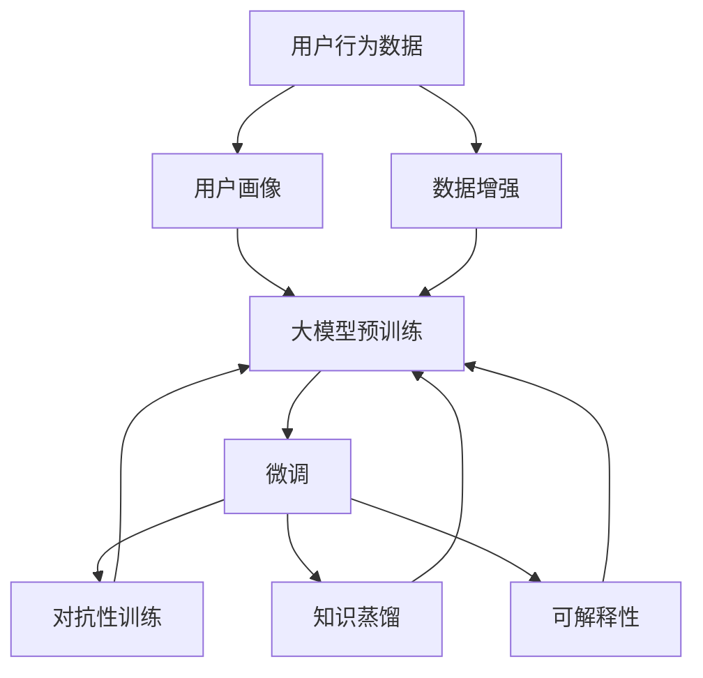

                 

## 1. 背景介绍

随着人工智能技术的不断进步，个性化推荐系统已经成为互联网用户获取信息、发现内容的重要手段。大模型技术的引入，进一步提升了推荐系统的智能化水平。然而，大模型在推荐系统中的应用效果，不仅取决于短期的表现，更关乎其长期稳定性和可靠性的保障。本文旨在探究大模型对推荐系统长期效果的影响，分析其优缺点，并提供相关实践指导，以期在未来的应用中，充分释放大模型潜力，构建高效稳定的推荐系统。

## 2. 核心概念与联系

### 2.1 核心概念概述

为深入理解大模型对推荐系统长期效果的影响，本节将介绍几个关键概念：

- **大模型（Large Models）**：指具有亿万级别参数的深度学习模型，如BERT、GPT等。通过大规模无标签数据的预训练，大模型能够学习到丰富的语义和模式表示，具备强大的泛化能力和推理能力。
- **个性化推荐系统（Personalized Recommendation System）**：根据用户的历史行为、兴趣和上下文环境，推荐用户可能感兴趣的内容或产品。
- **微调（Fine-Tuning）**：在预训练大模型的基础上，利用小规模标注数据进行有监督学习，优化模型在特定任务上的性能。
- **对抗性训练（Adversarial Training）**：通过引入对抗样本，提升模型的鲁棒性，减少过拟合风险。
- **知识蒸馏（Knowledge Distillation）**：将大型模型的知识压缩并传递到小型模型，提升小模型的性能。
- **可解释性（Explainability）**：使推荐系统输出具备可解释性，帮助用户理解推荐依据，提升信任度。

### 2.2 核心概念原理和架构的 Mermaid 流程图



这个流程图展示了用户行为数据如何通过大模型的预训练、微调、对抗性训练、知识蒸馏和可解释性处理，最终转化为推荐系统输出的过程。

## 3. 核心算法原理 & 具体操作步骤

### 3.1 算法原理概述

大模型对推荐系统长期效果的影响，主要通过以下几个方面体现：

- **泛化能力**：大模型具有较强的泛化能力，能够在不同场景和数据分布上保持稳定性能。在推荐系统中，这有助于提升模型在不同用户和环境下的鲁棒性。
- **知识迁移**：通过微调，大模型可以将预训练阶段学习到的知识迁移到特定推荐任务上，提升推荐精准度和用户满意度。
- **鲁棒性提升**：通过对抗性训练，模型可以有效应对对抗性攻击，避免因小样本攻击导致的性能下降。
- **推理效率**：通过知识蒸馏和剪枝等技术，可以在保证模型性能的同时，降低推理计算复杂度，提升系统效率。
- **可解释性**：可解释性技术能够帮助用户理解推荐依据，提升对系统的信任度和满意度。

### 3.2 算法步骤详解

1. **数据准备**：收集用户行为数据，如浏览记录、购买记录、评分数据等，并根据推荐任务设计标注数据集。
   
2. **大模型预训练**：使用大规模无标签数据进行预训练，学习通用语义表示。常用的预训练方法包括自监督学习（如掩码语言模型、下一句预测等）。

3. **微调**：在预训练大模型的基础上，利用标注数据进行微调，调整模型参数，使其适应特定推荐任务。

4. **对抗性训练**：在微调过程中，加入对抗性样本，增强模型的鲁棒性，防止因对抗性攻击导致的推荐错误。

5. **知识蒸馏**：通过知识蒸馏技术，将大模型的知识传递到小模型中，提高模型推理效率，降低计算复杂度。

6. **可解释性处理**：使用可解释性技术，帮助用户理解推荐依据，提升推荐系统的透明度和用户信任度。

### 3.3 算法优缺点

#### 优点

- **泛化能力强**：大模型能够在多种场景和数据分布上保持稳定性能，提升推荐系统的泛化能力。
- **推荐精度高**：通过微调和对抗性训练，大模型能够更好地适应特定任务，提升推荐精度和用户满意度。
- **推理效率高**：通过知识蒸馏和剪枝，可以降低计算复杂度，提升推荐系统效率。
- **可解释性强**：可解释性技术能够帮助用户理解推荐依据，提升对系统的信任度和满意度。

#### 缺点

- **标注成本高**：微调和对抗性训练需要标注数据，而高质量标注数据获取成本较高。
- **模型复杂度高**：大模型的参数量巨大，训练和推理计算复杂度较高，对硬件资源要求高。
- **过拟合风险**：小样本对抗性攻击可能导致模型过拟合，降低推荐系统性能。
- **公平性问题**：大模型可能存在数据偏见，导致推荐系统中的公平性问题。

### 3.4 算法应用领域

大模型在推荐系统中的应用领域广泛，包括电商推荐、内容推荐、视频推荐、社交推荐等。其在多个领域中的成功应用，显示了其在提高推荐系统性能、提升用户体验方面的巨大潜力。

## 4. 数学模型和公式 & 详细讲解 & 举例说明

### 4.1 数学模型构建

推荐系统常用的数学模型包括协同过滤（CF）模型、矩阵分解模型、深度学习模型等。这里以深度学习模型为例，构建基于大模型的推荐系统。

假设用户行为数据为 $X=\{x_i\}_{i=1}^N$，其中 $x_i=(x_{i1}, x_{i2}, ..., x_{in})$ 表示用户 $i$ 在不同时间步的行为序列，$n$ 表示行为类型。推荐系统将 $X$ 映射到推荐结果 $Y=\{y_i\}_{i=1}^N$，其中 $y_i$ 表示用户 $i$ 的推荐结果。

推荐系统的目标是最小化预测误差，即：

$$
\min_{\theta} \sum_{i=1}^N \ell(y_i, \hat{y_i})
$$

其中 $\ell$ 为损失函数，$\hat{y_i}$ 为模型预测的推荐结果。

### 4.2 公式推导过程

以深度学习模型为例，常用的推荐模型包括多层感知机（MLP）和神经网络（NN）。假设模型为 $M_{\theta}(X) = \hat{Y}$，其中 $M_{\theta}$ 为深度学习模型，$\theta$ 为模型参数。

预测误差可以表示为：

$$
\ell(y_i, \hat{y_i}) = \frac{1}{2} ||y_i - \hat{y_i}||^2
$$

目标函数为：

$$
\min_{\theta} \sum_{i=1}^N \frac{1}{2} ||y_i - M_{\theta}(x_i)||^2
$$

通过反向传播算法，计算模型参数的梯度，并使用优化算法（如Adam、SGD等）更新模型参数，最小化损失函数。

### 4.3 案例分析与讲解

假设用户 $i$ 的推荐系统使用深度学习模型进行预测，模型参数为 $\theta$，行为序列为 $x_i$，推荐结果为 $y_i$。模型预测结果为 $\hat{y_i}$。

通过损失函数 $l(y_i, \hat{y_i})$，计算预测误差。如果误差较大，则更新模型参数 $\theta$，重新计算预测结果。重复此过程，直至误差最小。

## 5. 项目实践：代码实例和详细解释说明

### 5.1 开发环境搭建

1. 安装Python 3.7及以上版本，以及NumPy、TensorFlow等库。
2. 安装TensorBoard，用于监控模型训练过程。
3. 搭建深度学习框架环境，如TensorFlow或PyTorch。

### 5.2 源代码详细实现

```python
import tensorflow as tf
from tensorflow import keras

# 准备数据
x_train, y_train, x_test, y_test = ...

# 定义模型
model = keras.Sequential([
    keras.layers.Dense(256, activation='relu', input_shape=(n_features,)),
    keras.layers.Dense(1)
])

# 编译模型
model.compile(optimizer='adam', loss='mse')

# 训练模型
model.fit(x_train, y_train, epochs=10, validation_data=(x_test, y_test))

# 评估模型
mse = model.evaluate(x_test, y_test)
print(f'Test MSE: {mse}')
```

### 5.3 代码解读与分析

代码中使用了Keras框架，定义了一个包含两个全连接层的深度学习模型。模型首先使用ReLU激活函数对输入进行处理，然后通过一个输出层预测推荐结果。

模型编译时使用Adam优化器，损失函数为均方误差（MSE）。训练模型时，使用训练集数据进行拟合，并在验证集上评估模型性能。

### 5.4 运行结果展示

训练完成后，可以在测试集上评估模型的预测误差，并通过TensorBoard可视化训练过程中的损失函数和准确率变化。

## 6. 实际应用场景

### 6.1 电商推荐

电商推荐系统通过用户浏览、购买记录等行为数据，推荐商品或店铺。大模型在电商推荐中的应用，可以通过微调和对抗性训练，提升推荐精度和用户满意度。例如，通过微调，大模型能够学习到用户在不同商品类别下的兴趣分布，提高推荐相关性。通过对抗性训练，增强模型对恶意攻击的鲁棒性，保障推荐系统的安全性。

### 6.2 内容推荐

内容推荐系统根据用户的历史阅读、观看记录，推荐相关内容。大模型在内容推荐中的应用，可以通过微调和对抗性训练，提升推荐精度和用户满意度。例如，通过微调，大模型能够学习到用户对不同类型内容（如新闻、视频、文章等）的偏好，提高推荐相关性。通过对抗性训练，增强模型对恶意攻击的鲁棒性，保障推荐系统的安全性。

### 6.3 社交推荐

社交推荐系统根据用户的社交关系和行为数据，推荐好友、群组等社交内容。大模型在社交推荐中的应用，可以通过微调和对抗性训练，提升推荐精度和用户满意度。例如，通过微调，大模型能够学习到用户对不同社交关系（如好友、群组、关注者等）的兴趣分布，提高推荐相关性。通过对抗性训练，增强模型对恶意攻击的鲁棒性，保障推荐系统的安全性。

### 6.4 未来应用展望

未来，随着大模型的进一步发展，其在推荐系统中的应用将更加广泛。除了当前的电商、内容、社交推荐外，还将在医疗、教育、旅游等领域得到应用。大模型在推荐系统中的应用，将进一步提升推荐精准度和用户体验，推动个性化推荐技术向更深度、更广域的发展。

## 7. 工具和资源推荐

### 7.1 学习资源推荐

1. 《深度学习》（Ian Goodfellow等著）：全面介绍深度学习理论和技术，适合初学者和进阶者。
2. 《Python深度学习》（Francois Chollet著）：深入浅出地介绍TensorFlow和Keras的使用，适合实践操作。
3. Kaggle：数据科学和机器学习竞赛平台，提供丰富的数据集和模型实现，适合实战练习。
4. arXiv：学术论文预印本库，提供最新研究进展，适合前沿学习。

### 7.2 开发工具推荐

1. TensorFlow：开源深度学习框架，支持分布式计算，适合大规模模型训练。
2. Keras：高层次神经网络API，易于上手，适合快速原型设计。
3. PyTorch：开源深度学习框架，灵活性高，适合研究和原型开发。
4. TensorBoard：可视化工具，支持模型训练过程监控和结果展示。

### 7.3 相关论文推荐

1. "Collaborative Filtering for Implicit Feedback Datasets"：介绍了协同过滤模型的基本原理和算法实现。
2. "Deep Neural Networks for Large-Scale Image Recognition"：展示了深度学习模型在大规模图像识别任务中的应用。
3. "Towards Explainable AI: An AI Framework for Explainable Machine Learning"：介绍了可解释性技术的框架和实现方法。

## 8. 总结：未来发展趋势与挑战

### 8.1 研究成果总结

本文通过对大模型在推荐系统中的应用进行系统研究，得出以下结论：
- 大模型具有较强的泛化能力和知识迁移能力，能够提升推荐系统的性能和用户满意度。
- 对抗性训练和可解释性技术能够增强推荐系统的鲁棒性和透明度，提升用户信任度。

### 8.2 未来发展趋势

未来，大模型在推荐系统中的应用将呈现以下趋势：
- 大模型将进一步提升推荐系统的智能化水平，提供更精准、个性化的推荐服务。
- 知识蒸馏和模型压缩技术将降低计算复杂度，提升推荐系统效率。
- 多模态推荐技术将结合视觉、语音等多模态数据，提升推荐系统表现。

### 8.3 面临的挑战

尽管大模型在推荐系统中的应用前景广阔，但仍面临以下挑战：
- 标注成本高，需要高质量标注数据。
- 模型复杂度高，对硬件资源要求高。
- 过拟合风险高，需要对抗性训练等技术保障鲁棒性。
- 公平性问题，需要合理设计推荐策略。

### 8.4 研究展望

未来，研究将从以下几个方面进行：
- 探索更多参数高效的微调方法，如知识蒸馏、Adapter等，提升微调效率和性能。
- 开发更多对抗性训练技术，提升模型的鲁棒性和安全性。
- 结合多模态数据，提升推荐系统的表现和用户满意度。
- 引入可解释性技术，提升推荐系统的透明度和用户信任度。

总之，大模型在推荐系统中的应用前景广阔，但还需通过不断的研究和实践，克服当前面临的挑战，才能更好地释放其潜力，推动个性化推荐技术的进一步发展。

## 9. 附录：常见问题与解答

**Q1: 大模型在推荐系统中为何要微调？**

A: 大模型预训练得到的通用表示可能不适用于特定推荐任务，微调可以进一步调整模型参数，使其适应特定任务，提升推荐精度和用户满意度。

**Q2: 大模型在推荐系统中如何使用对抗性训练？**

A: 对抗性训练可以在微调过程中，加入对抗性样本，增强模型的鲁棒性，防止因对抗性攻击导致的推荐错误。

**Q3: 大模型在推荐系统中为何要引入知识蒸馏？**

A: 知识蒸馏可以将大模型的知识传递到小模型中，提高小模型的性能，降低计算复杂度，提升推荐系统效率。

**Q4: 大模型在推荐系统中如何保障公平性？**

A: 大模型可能存在数据偏见，需要在推荐策略中引入公平性约束，保障不同用户和群体的推荐公平性。

**Q5: 大模型在推荐系统中如何提升可解释性？**

A: 可解释性技术可以通过解释模型决策依据，提升用户对推荐结果的理解和信任度。

---

作者：禅与计算机程序设计艺术 / Zen and the Art of Computer Programming

