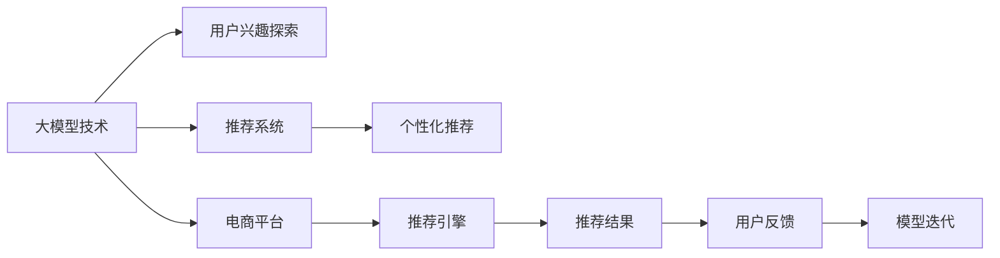

                 

# 大模型技术在电商平台用户兴趣探索中的应用

> 关键词：大模型技术, 用户兴趣探索, 电商平台, 自然语言处理, 推荐系统, 深度学习, 数据科学

## 1. 背景介绍

随着电子商务的蓬勃发展，电商平台已成为消费者购买商品和服务的重要渠道。为提升用户体验和运营效率，电商平台亟需深入理解用户的兴趣和行为。传统的基于规则和统计的方法已难以应对用户行为的多样性和动态变化，而大模型技术以其强大的数据建模能力和自适应性，为电商平台的用户兴趣探索带来了新的突破。

## 2. 核心概念与联系

### 2.1 核心概念概述

本节将介绍几个核心概念，以便更好地理解大模型技术在用户兴趣探索中的应用。

- **大模型技术**：以Transformer为基础的大规模预训练语言模型，如BERT、GPT等。这些模型通过在大规模语料上进行自监督预训练，学习到丰富的语言表示和知识，能够广泛应用于各种NLP任务。
- **用户兴趣探索**：指通过分析用户的历史行为和交互数据，发现用户的兴趣偏好和需求，从而提供个性化推荐和内容展示。
- **电商平台**：指通过互联网提供商品和服务的在线交易平台，如淘宝、京东、亚马逊等。
- **推荐系统**：基于用户行为和产品属性，通过算法推荐用户可能感兴趣的商品或内容，提升用户满意度和购买转化率。
- **深度学习**：一种基于人工神经网络的机器学习方法，通过多层次的特征抽象，提升模型的表达能力和泛化能力。
- **数据科学**：涉及数据的收集、处理、分析和可视化，旨在提取和发现数据中的有价值信息和知识。

这些概念之间的联系通过以下Mermaid流程图进行展示：



## 3. 核心算法原理 & 具体操作步骤

### 3.1 算法原理概述

基于大模型技术的用户兴趣探索算法主要通过以下步骤实现：

1. **预训练模型加载**：从HuggingFace等库中加载预训练语言模型，如BERT、GPT等。
2. **用户行为编码**：将用户的历史浏览、点击、收藏、购买等行为编码为向量，表示用户的兴趣特征。
3. **相似性计算**：利用大模型计算用户兴趣向量与商品属性向量之间的相似度，发现相关商品。
4. **推荐结果生成**：根据相似度排序，生成推荐商品列表。
5. **反馈更新模型**：根据用户对推荐结果的反馈，调整模型参数，优化推荐效果。

### 3.2 算法步骤详解

以下详细介绍基于大模型技术的用户兴趣探索算法的详细步骤：

**Step 1: 准备预训练模型和数据集**

- 选择适合的预训练模型，如BERT、GPT等。
- 准备电商平台的商品数据集，包含商品名称、描述、类别等属性。
- 收集用户的浏览、点击、收藏、购买等行为数据，存储在数据库中。

**Step 2: 用户兴趣编码**

- 使用自然语言处理技术，将用户行为数据转换为文本。
- 对文本进行分词、去除停用词等预处理操作。
- 利用预训练模型对处理后的文本进行编码，得到用户兴趣向量。

**Step 3: 商品属性编码**

- 对电商平台的商品进行文本描述，提取属性信息。
- 对商品描述进行分词、去除停用词等预处理操作。
- 利用预训练模型对处理后的文本进行编码，得到商品属性向量。

**Step 4: 相似度计算**

- 计算用户兴趣向量与商品属性向量之间的余弦相似度或其他相似度指标。
- 根据相似度大小，对商品进行排序，生成推荐列表。

**Step 5: 反馈更新模型**

- 根据用户对推荐结果的反馈（如点击、购买等），调整用户兴趣向量和商品属性向量的权重。
- 利用训练好的模型重新计算相似度，更新推荐列表。
- 循环上述步骤，不断优化推荐结果，提升用户体验。

### 3.3 算法优缺点

基于大模型技术的用户兴趣探索算法具有以下优点：

- **强大的数据建模能力**：大模型能够捕捉用户行为和商品属性之间的复杂关系，提供更加精准的推荐结果。
- **自适应性强**：模型能够根据用户的实时反馈进行动态调整，提升推荐效果。
- **可解释性高**：大模型可以提供推荐结果的详细解释，帮助用户理解推荐理由。

同时，该算法也存在一些缺点：

- **计算成本高**：大模型的推理和训练需要较高的计算资源和成本。
- **数据依赖性高**：需要大量的用户行为数据和商品属性数据进行训练和优化。
- **模型复杂度大**：大模型通常结构复杂，不易理解和调试。

### 3.4 算法应用领域

基于大模型技术的用户兴趣探索算法，已在多个领域得到了广泛应用，例如：

- 电商推荐系统：根据用户浏览和购买行为，推荐相关商品。
- 金融风控：通过分析用户的历史交易记录，评估用户风险。
- 新闻推荐：根据用户阅读偏好，推荐相关文章和视频。
- 视频推荐：根据用户观看历史，推荐相关视频内容。

## 4. 数学模型和公式 & 详细讲解 & 举例说明

### 4.1 数学模型构建

本节将使用数学语言对基于大模型技术的用户兴趣探索算法进行更加严格的刻画。

记预训练模型为 $M_{\theta}$，其中 $\theta$ 为模型参数。电商平台的商品数据集为 $D=\{(d_i, a_i)\}_{i=1}^N$，其中 $d_i$ 表示商品描述，$a_i$ 表示商品属性。用户的浏览、点击、收藏、购买等行为数据为 $B=\{(b_j)\}_{j=1}^M$，其中 $b_j$ 表示用户行为文本。

定义用户兴趣向量为 $u=\mathcal{E}(B)$，商品属性向量为 $a=\mathcal{E}(D)$。用户行为与商品属性之间的相似度矩阵为 $S \in \mathbb{R}^{M \times N}$，其中 $S_{ij}=\cos(u_i, a_j)$。

### 4.2 公式推导过程

基于余弦相似度的用户兴趣探索算法如下：

1. **用户兴趣编码**：
   $$
   u_i = M_{\theta}(b_i)
   $$

2. **商品属性编码**：
   $$
   a_j = M_{\theta}(d_j)
   $$

3. **相似度计算**：
   $$
   S_{ij} = \frac{u_i \cdot a_j}{\|u_i\|\|a_j\|}
   $$

4. **推荐结果生成**：
   $$
   r_i = \text{argmax}_j S_{ij}
   $$

### 4.3 案例分析与讲解

以下以电商推荐系统为例，具体讲解算法的实现过程。

假设电商平台收集到用户A的历史行为数据为“手机”，“笔记本电脑”，“平板电脑”。将其转换为文本“手机 笔记本电脑 平板电脑”。

1. 使用BERT模型对用户行为文本进行编码，得到用户兴趣向量 $u_A = M_{\theta}(b_A)$。
2. 电商平台的商品数据集为“小米手机”，“笔记本电脑”，“平板电脑”，“相机”，“耳机”等。
3. 对商品描述进行编码，得到商品属性向量 $a_i = M_{\theta}(d_i)$。
4. 计算用户兴趣向量与商品属性向量之间的余弦相似度，生成推荐列表 $r_A = \text{argmax}_i S_{iA}$。

最终，推荐列表中可能包含“小米手机”和“笔记本电脑”等用户感兴趣的商品。

## 5. 项目实践：代码实例和详细解释说明

### 5.1 开发环境搭建

在进行用户兴趣探索实践前，需要准备好开发环境。以下是使用Python进行TensorFlow开发的Python环境配置流程：

1. 安装Anaconda：从官网下载并安装Anaconda，用于创建独立的Python环境。
2. 创建并激活虚拟环境：
   ```bash
   conda create -n tf-env python=3.8 
   conda activate tf-env
   ```

3. 安装TensorFlow：
   ```bash
   pip install tensorflow==2.4
   ```

4. 安装各类工具包：
   ```bash
   pip install numpy pandas scikit-learn matplotlib tqdm jupyter notebook ipython
   ```

5. 下载预训练模型：
   ```bash
   model = tf.keras.applications.BERT(base_model_only=True)
   model.load_weights('https://tfhub.dev/tensorflow/bert_en_uncased_L-12_H-768_A-12/2')
   ```

完成上述步骤后，即可在`tf-env`环境中开始用户兴趣探索实践。

### 5.2 源代码详细实现

下面以电商推荐系统为例，给出使用TensorFlow对BERT模型进行用户兴趣探索的Python代码实现。

```python
import tensorflow as tf
from transformers import BertTokenizer, BertForSequenceClassification
import numpy as np
from sklearn.metrics import mean_squared_error

# 初始化BERT模型和tokenizer
tokenizer = BertTokenizer.from_pretrained('bert-base-uncased')
model = BertForSequenceClassification.from_pretrained('bert-base-uncased', num_labels=1)

# 定义用户行为编码函数
def encode_user_behavior(behavior):
    tokens = tokenizer.tokenize(behavior)
    tokens = [token for token in tokens if token != '[UNK]']
    inputs = tokenizer.encode(tokens, add_special_tokens=True, max_length=256)
    return inputs

# 定义商品属性编码函数
def encode_product_property(product):
    tokens = tokenizer.tokenize(product)
    tokens = [token for token in tokens if token != '[UNK]']
    inputs = tokenizer.encode(tokens, add_special_tokens=True, max_length=256)
    return inputs

# 定义相似度计算函数
def calculate_similarity(behavior, products):
    user_embedding = model(encode_user_behavior(behavior))
    product_embeddings = [model(encode_product_property(product)) for product in products]
    similarities = []
    for product_embedding in product_embeddings:
        similarity = np.dot(user_embedding.numpy(), product_embedding.numpy()) / (np.linalg.norm(user_embedding.numpy()) * np.linalg.norm(product_embedding.numpy()))
        similarities.append(similarity)
    return similarities

# 定义推荐函数
def recommend_products(user_behavior, products):
    similarities = calculate_similarity(user_behavior, products)
    product_ids = [product['id'] for product in products]
    recommended_products = [product_ids[argmax(similarities)]]  
    return recommended_products

# 加载商品数据集
products = [
    {'id': 1, 'name': '小米手机', 'description': '小米手机，5G版'},
    {'id': 2, 'name': '笔记本电脑', 'description': 'MacBook Pro，16英寸'},
    {'id': 3, 'name': '平板电脑', 'description': 'iPad，2021款'},
    {'id': 4, 'name': '相机', 'description': '索尼相机，ZV1'},
    {'id': 5, 'name': '耳机', 'description': 'Beats AirPods，Pro版'}
]

# 加载用户行为数据
user_behavior = '手机 笔记本电脑 平板电脑'

# 推荐商品
recommended_products = recommend_products(user_behavior, products)
print(recommended_products)
```

以上代码实现了使用BERT模型对电商推荐系统的用户兴趣探索。代码中包括了用户行为编码、商品属性编码、相似度计算和推荐商品等关键步骤。

### 5.3 代码解读与分析

让我们再详细解读一下关键代码的实现细节：

**encode_user_behavior函数**：
- 将用户行为文本分词，去除停用词。
- 使用tokenizer对分词后的文本进行编码，返回模型所需的输入。

**encode_product_property函数**：
- 对商品描述进行分词，去除停用词。
- 使用tokenizer对分词后的文本进行编码，返回模型所需的输入。

**calculate_similarity函数**：
- 使用预训练的BERT模型对用户行为和商品属性进行编码，计算余弦相似度。
- 返回用户与每个商品之间的相似度得分。

**recommend_products函数**：
- 根据相似度得分，找到最相似的商品，返回推荐商品列表。

**推荐流程**：
- 加载电商平台的商品数据集。
- 加载用户的历史行为数据。
- 使用推荐函数，根据用户行为数据和商品属性数据生成推荐商品列表。

可以看到，TensorFlow配合Transformers库使得用户兴趣探索的代码实现变得简洁高效。开发者可以将更多精力放在数据处理、模型改进等高层逻辑上，而不必过多关注底层的实现细节。

当然，工业级的系统实现还需考虑更多因素，如模型的保存和部署、超参数的自动搜索、更灵活的任务适配层等。但核心的用户兴趣探索算法基本与此类似。

## 6. 实际应用场景

### 6.1 电商平台推荐系统

基于大模型技术的用户兴趣探索算法，可以广泛应用于电商平台的推荐系统构建。传统的推荐系统往往依赖于基于规则和统计的方法，难以适应用户行为的多样性和动态变化。而使用大模型进行用户兴趣探索，能够更加准确地捕捉用户行为特征，提供个性化推荐。

在技术实现上，可以收集用户的历史浏览、点击、收藏、购买等行为数据，将其转换为文本。利用预训练模型对文本进行编码，计算用户兴趣向量与商品属性向量之间的相似度，生成推荐商品列表。用户对推荐结果的反馈（如点击、购买等），可以用来调整模型参数，优化推荐效果。

### 6.2 金融风控系统

金融行业需要实时监测用户行为，评估用户风险。传统的基于规则和统计的方法难以应对网络时代海量数据的处理需求。利用大模型进行用户兴趣探索，可以更好地捕捉用户行为和属性特征，提升风险评估的准确性。

具体而言，可以收集用户的历史交易记录、行为数据、社交网络等，将其转换为文本。利用预训练模型对文本进行编码，计算用户行为向量与风险指标向量之间的相似度，生成风险评估结果。根据用户对评估结果的反馈，调整模型参数，优化风险评估效果。

### 6.3 新闻推荐系统

新闻行业需要实时推荐相关文章和视频，提升用户阅读体验。传统的基于规则和统计的方法难以捕捉用户的兴趣偏好。利用大模型进行用户兴趣探索，可以更加准确地捕捉用户兴趣特征，提供个性化推荐。

具体而言，可以收集用户的历史阅读记录、评论、点赞等行为数据，将其转换为文本。利用预训练模型对文本进行编码，计算用户兴趣向量与新闻属性向量之间的相似度，生成推荐列表。用户对推荐结果的反馈（如点击、阅读等），可以用来调整模型参数，优化推荐效果。

### 6.4 视频推荐系统

视频行业需要实时推荐相关视频内容，提升用户观看体验。传统的基于规则和统计的方法难以捕捉用户的兴趣偏好。利用大模型进行用户兴趣探索，可以更加准确地捕捉用户兴趣特征，提供个性化推荐。

具体而言，可以收集用户的历史观看记录、评论、点赞等行为数据，将其转换为文本。利用预训练模型对文本进行编码，计算用户兴趣向量与视频属性向量之间的相似度，生成推荐列表。用户对推荐结果的反馈（如观看、点赞等），可以用来调整模型参数，优化推荐效果。

## 7. 工具和资源推荐

### 7.1 学习资源推荐

为了帮助开发者系统掌握大模型技术在用户兴趣探索中的应用，这里推荐一些优质的学习资源：

1. 《深度学习入门》系列博文：由大模型技术专家撰写，深入浅出地介绍了深度学习的基本概念和经典模型，包括BERT等预训练语言模型。
2. Coursera《深度学习专项课程》：由斯坦福大学和DeepMind合作开设的深度学习课程，涵盖深度学习的基础知识和实践技巧。
3. 《Python自然语言处理》书籍：Python语言的自然语言处理入门教材，涵盖NLP基础和高级技术，包括BERT等预训练语言模型。
4. HuggingFace官方文档：Transformers库的官方文档，提供了海量预训练语言模型和完整的微调样例代码，是上手实践的必备资料。
5. Kaggle数据竞赛：利用真实数据进行模型训练和测试，提升模型的实际应用能力。

通过对这些资源的学习实践，相信你一定能够快速掌握大模型技术在用户兴趣探索中的应用，并用于解决实际的NLP问题。

### 7.2 开发工具推荐

高效的开发离不开优秀的工具支持。以下是几款用于大模型技术开发和用户兴趣探索的常用工具：

1. TensorFlow：由Google主导开发的深度学习框架，生产部署方便，适合大规模工程应用。
2. PyTorch：基于Python的开源深度学习框架，灵活动态的计算图，适合快速迭代研究。
3. HuggingFace Transformers：开源的NLP工具库，集成了众多SOTA语言模型，支持PyTorch和TensorFlow，是进行微调任务开发的利器。
4. Weights & Biases：模型训练的实验跟踪工具，可以记录和可视化模型训练过程中的各项指标，方便对比和调优。
5. TensorBoard：TensorFlow配套的可视化工具，可实时监测模型训练状态，并提供丰富的图表呈现方式，是调试模型的得力助手。

合理利用这些工具，可以显著提升大模型技术在用户兴趣探索中的开发效率，加快创新迭代的步伐。

### 7.3 相关论文推荐

大模型技术和用户兴趣探索的研究源于学界的持续研究。以下是几篇奠基性的相关论文，推荐阅读：

1. Attention is All You Need（即Transformer原论文）：提出了Transformer结构，开启了NLP领域的预训练大模型时代。
2. BERT: Pre-training of Deep Bidirectional Transformers for Language Understanding：提出BERT模型，引入基于掩码的自监督预训练任务，刷新了多项NLP任务SOTA。
3. Deep Learning for Recommender Systems: A Review and Outlook：综述了深度学习在推荐系统中的应用，包括用户兴趣探索和推荐结果生成。
4. A Survey on Deep Learning-Based Recommendation Systems：综述了基于深度学习的推荐系统，包括用户行为建模和推荐算法。
5. Towards the Human Level of Personalized Recommendations：提出用户兴趣探索和推荐系统的最新技术，包括大模型技术和深度学习技术。

这些论文代表了大模型技术和用户兴趣探索的发展脉络。通过学习这些前沿成果，可以帮助研究者把握学科前进方向，激发更多的创新灵感。

## 8. 总结：未来发展趋势与挑战

### 8.1 总结

本文对基于大模型技术在电商平台用户兴趣探索中的应用进行了全面系统的介绍。首先阐述了大模型技术和用户兴趣探索的研究背景和意义，明确了该技术在电商平台的独特价值。其次，从原理到实践，详细讲解了用户兴趣探索的数学原理和关键步骤，给出了用户兴趣探索任务开发的完整代码实例。同时，本文还广泛探讨了用户兴趣探索方法在电商、金融、新闻、视频等多个领域的应用前景，展示了该技术的广泛潜力。此外，本文精选了用户兴趣探索技术的各类学习资源，力求为读者提供全方位的技术指引。

通过本文的系统梳理，可以看到，基于大模型技术在用户兴趣探索中的应用正在成为电商推荐系统的重要范式，极大地拓展了预训练语言模型的应用边界，催生了更多的落地场景。受益于大规模语料的预训练，大模型能够更好地捕捉用户行为和属性特征，提升推荐系统的个性化和精准度，为电商平台带来了显著的商业价值。未来，伴随大模型技术和用户兴趣探索方法的不断演进，相信电商推荐系统将能够提供更加多样、精准、实时化的推荐服务，为用户的购物体验带来质的提升。

### 8.2 未来发展趋势

展望未来，大模型技术和用户兴趣探索技术将呈现以下几个发展趋势：

1. 模型规模持续增大。随着算力成本的下降和数据规模的扩张，预训练语言模型的参数量还将持续增长。超大规模语言模型蕴含的丰富语言知识，有望支撑更加复杂多变的推荐任务。
2. 推荐算法日趋多样。除了传统的基于相似性的推荐算法外，未来会涌现更多参数高效的推荐方法，如协同过滤、基于图神经网络的推荐等，在减小计算资源消耗的同时，仍能保证推荐效果。
3. 实时推荐成为常态。随着实时计算技术的进步，推荐系统能够更快速地处理用户行为数据，实时调整推荐结果，提升用户体验。
4. 多模态融合推荐崛起。推荐系统不仅关注文本数据，还将更多地融合图像、视频、语音等多模态信息，提升推荐效果。
5. 推荐系统的智能化增强。未来的推荐系统将更加智能化，能够理解用户情感、意图等深层次信息，提升推荐效果。

以上趋势凸显了大模型技术在用户兴趣探索中的广阔前景。这些方向的探索发展，必将进一步提升推荐系统的性能和用户体验，为电商平台带来更多的商业价值。

### 8.3 面临的挑战

尽管大模型技术和用户兴趣探索技术已经取得了瞩目成就，但在迈向更加智能化、普适化应用的过程中，它仍面临着诸多挑战：

1. 数据依赖性高。需要大量的用户行为数据和商品属性数据进行训练和优化，获取高质量标注数据的成本较高。如何进一步降低数据依赖，提升数据使用效率，将是一大难题。
2. 计算成本高。大模型的推理和训练需要较高的计算资源和成本，特别是在大规模用户推荐场景下。如何优化计算图，提高模型推理效率，优化资源消耗，将是一个重要的研究方向。
3. 模型复杂度高。大模型通常结构复杂，不易理解和调试。如何简化模型结构，提高模型可解释性，增强用户体验，将是重要的优化方向。
4. 鲁棒性不足。推荐模型面对域外数据时，泛化性能往往大打折扣。如何提高推荐模型的鲁棒性，避免灾难性遗忘，还需要更多理论和实践的积累。

### 8.4 研究展望

面对大模型技术和用户兴趣探索技术所面临的挑战，未来的研究需要在以下几个方面寻求新的突破：

1. 探索无监督和半监督推荐方法。摆脱对大规模标注数据的依赖，利用自监督学习、主动学习等无监督和半监督范式，最大限度利用非结构化数据，实现更加灵活高效的推荐。
2. 研究参数高效和计算高效的推荐算法。开发更加参数高效的推荐方法，在固定大部分预训练参数的同时，只更新极少量的任务相关参数。同时优化推荐系统的计算图，减少前向传播和反向传播的资源消耗，实现更加轻量级、实时性的部署。
3. 融合因果和对比学习范式。通过引入因果推断和对比学习思想，增强推荐模型建立稳定因果关系的能力，学习更加普适、鲁棒的用户行为模型，从而提升推荐系统的泛化能力和抗干扰能力。
4. 引入更多先验知识。将符号化的先验知识，如知识图谱、逻辑规则等，与推荐模型进行巧妙融合，引导推荐过程学习更准确、合理的用户行为模型。同时加强不同模态数据的整合，实现视觉、语音等多模态信息与文本信息的协同建模。
5. 结合因果分析和博弈论工具。将因果分析方法引入推荐模型，识别出模型决策的关键特征，增强推荐结果的因果性和逻辑性。借助博弈论工具刻画人机交互过程，主动探索并规避推荐模型的脆弱点，提高系统稳定性。

这些研究方向的探索，必将引领大模型技术和用户兴趣探索技术的迈向更高的台阶，为构建智能推荐系统提供更全面、更高效、更可靠的解决方案。面向未来，大模型技术和用户兴趣探索技术还需要与其他人工智能技术进行更深入的融合，如知识表示、因果推理、强化学习等，多路径协同发力，共同推动自然语言理解和智能交互系统的进步。只有勇于创新、敢于突破，才能不断拓展用户兴趣探索的边界，让智能推荐系统更好地服务于用户，提升电商平台的商业价值。

## 9. 附录：常见问题与解答

**Q1：大模型技术在用户兴趣探索中是否适用于所有电商平台？**

A: 大模型技术在大多数电商平台上都能取得不错的效果，特别是对于数据量较小的平台。但对于一些特定领域的电商平台，如垂直电商平台，需要结合平台特色进行微调。同时，需要收集足够的高质量标注数据，才能保证模型的泛化性能。

**Q2：如何处理多模态数据，提升推荐效果？**

A: 多模态数据融合是提升推荐效果的重要方向。可以结合用户的文本数据、图像数据、视频数据等多模态数据，利用预训练模型对不同模态数据进行编码，计算相似度。最终的推荐结果可以综合考虑文本、图像、视频等多个模态的数据，提升推荐的个性化和精准度。

**Q3：大模型技术在推荐系统中的计算成本如何控制？**

A: 计算成本是大模型技术面临的重大挑战。可以采用以下方法来控制计算成本：
1. 数据分批次加载：将数据分批次加载，减小内存占用，提高计算效率。
2. 模型裁剪和压缩：对模型进行裁剪和压缩，减小模型参数量，降低计算成本。
3. 优化计算图：对计算图进行优化，减小计算量和内存消耗，提高模型推理效率。
4. 使用分布式计算：利用分布式计算技术，将计算任务分发到多个节点并行计算，提高计算速度。

**Q4：大模型技术在推荐系统中如何避免数据泄露？**

A: 数据隐私和安全是大模型技术在推荐系统中面临的重要问题。可以采用以下方法来避免数据泄露：
1. 匿名化处理：对用户数据进行匿名化处理，去除敏感信息，保护用户隐私。
2. 联邦学习：利用联邦学习技术，将模型训练过程在分布式节点上进行，不将数据集中传输，保护用户数据安全。
3. 差分隐私：引入差分隐私技术，对用户数据进行扰动处理，防止数据泄露。

**Q5：如何评估推荐系统的性能？**

A: 推荐系统的性能评估可以从以下几个方面考虑：
1. 准确率：评估推荐结果与用户实际需求的匹配程度。
2. 召回率：评估推荐系统覆盖用户需求的能力。
3. 点击率：评估推荐结果被用户点击的概率。
4. 转化率：评估推荐结果被用户购买或使用的概率。
5. 用户满意度：通过用户反馈、评价等方式，评估推荐系统对用户的满意度。

综合考虑这些指标，可以全面评估推荐系统的性能，优化推荐效果。

**Q6：推荐系统中的冷启动问题如何解决？**

A: 冷启动问题指新用户或新商品没有历史行为数据，难以进行个性化推荐。可以采用以下方法来解决冷启动问题：
1. 利用预训练模型：利用预训练模型对用户和商品进行编码，基于相似度进行推荐。
2. 利用先验知识：引入领域专家的先验知识，如知识图谱、逻辑规则等，进行推荐。
3. 利用协同过滤：利用用户之间的相似性，进行基于用户和商品的协同过滤推荐。
4. 利用上下文信息：利用用户的上下文信息，如时间、地点、设备等，进行推荐。

通过以上方法，可以在缺乏历史行为数据的情况下，提供合理的推荐结果。

---

作者：禅与计算机程序设计艺术 / Zen and the Art of Computer Programming

