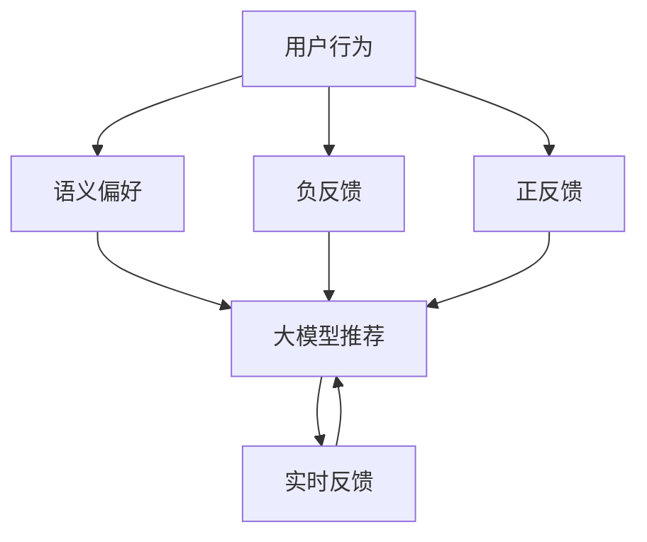

                 

## 1. 背景介绍

### 1.1 问题由来
在数字化时代，信息过载和个性化推荐需求日益增长，各大平台纷纷引入人工智能(AI)推荐系统，提升用户体验和平台竞争力。随着深度学习技术的蓬勃发展，大模型在推荐系统中也逐渐崭露头角。

相比于传统的协同过滤、基于内容的推荐方法，大模型推荐系统具备更强大的语义理解和知识提取能力，能够基于用户的历史行为和语义偏好，进行深度个性化推荐，为用户推荐更精准、更有价值的内容。然而，如何设计高效、稳定、人性化的推荐机制，是大模型推荐系统面临的一个关键问题。

### 1.2 问题核心关键点
推荐系统设计本质上是寻求智能人机协同的过程。在这一过程中，需要考虑用户的行为特征、语义偏好和实时反馈等多维度信息。如何在推荐算法中加入这些动态因素，并实现有效的反馈机制，优化推荐质量，是大模型推荐系统设计的核心。

本节将介绍基于大模型的推荐系统设计，并重点探讨人机协同和反馈机制的设计原则与实现方法。

## 2. 核心概念与联系

### 2.1 核心概念概述
1. **大模型推荐**：
   - **大模型**：以Transformer架构为代表的大规模预训练语言模型，如GPT、BERT、T5等。通过大规模无标签文本数据训练得到，具备强大的语义理解和生成能力。
   - **推荐系统**：通过用户的历史行为、实时反馈等数据，动态调整推荐策略，为用户推荐个性化内容。

2. **人机协同**：
   - **用户行为**：用户的历史点击、浏览、评分等行为数据，用于刻画用户的兴趣偏好。
   - **语义偏好**：用户的搜索关键词、评论内容等文本信息，反映其深层次的语义偏好。
   - **实时反馈**：用户在观看、点击、评分等行为中，通过交互界面反馈其满意度，用于调整推荐策略。

3. **反馈机制**：
   - **负反馈**：用户对推荐结果的不满意、屏蔽、跳过等行为，用于指导推荐算法调整。
   - **正反馈**：用户对推荐结果的点赞、收藏、分享等行为，用于增强推荐结果的吸引力。
   - **多轮交互**：通过多轮用户反馈，不断迭代优化推荐策略，提升推荐效果。

### 2.2 核心概念联系

人机协同与反馈机制在大模型推荐系统中相辅相成，共同构建起一个动态、智能的推荐闭环。通过合理设计协同机制和反馈机制，能够使大模型推荐系统具备更高的适应性和稳定性，提供更精准、更人性化的推荐服务。

这些核心概念之间的逻辑关系可以通过以下Mermaid流程图来展示：



这个流程图展示了大模型推荐系统的工作流程：
1. 首先，系统收集用户的行为数据和语义偏好。
2. 然后，系统通过大模型推荐算法生成初始推荐结果。
3. 接着，系统接收用户的实时反馈，包含正反馈和负反馈。
4. 根据反馈信息，系统对大模型推荐算法进行动态调整，生成新的推荐结果。

## 3. 核心算法原理 & 具体操作步骤
### 3.1 算法原理概述

基于大模型的推荐系统，通过将大模型的语言理解能力与用户行为数据相结合，实现深度个性化推荐。系统设计主要包括以下几个步骤：

1. **数据预处理**：对用户行为数据和语义偏好数据进行清洗、归一化和特征工程，提取有价值的信息。
2. **大模型嵌入**：将预处理后的用户特征嵌入大模型中，得到高维语义向量。
3. **推荐计算**：通过计算用户与物品之间的相似度，筛选出与用户偏好最匹配的物品，生成推荐结果。
4. **反馈调整**：根据用户反馈调整推荐算法，优化推荐质量。

### 3.2 算法步骤详解

1. **数据预处理**：
   - **用户行为数据**：记录用户的点击、浏览、评分等行为数据，通过统计分析，提取用户行为特征。
   - **语义偏好数据**：收集用户的搜索关键词、评论内容等文本数据，通过自然语言处理技术，提取用户语义偏好。
   - **特征工程**：将用户行为数据和语义偏好数据进行拼接、归一化，得到可用于大模型嵌入的特征向量。

2. **大模型嵌入**：
   - **特征嵌入**：将预处理后的特征向量输入大模型，得到高维语义向量。
   - **向量表示**：通过大模型的语言理解能力，将用户的兴趣和偏好转化为高维向量，便于计算和比较。

3. **推荐计算**：
   - **相似度计算**：计算用户和物品之间的相似度，包括余弦相似度、欧式距离等。
   - **物品排序**：根据相似度大小，对物品进行排序，生成推荐结果。

4. **反馈调整**：
   - **负反馈处理**：根据用户的屏蔽、跳过等行为，调整推荐策略，减少负反馈物品的出现。
   - **正反馈增强**：根据用户的点赞、收藏等行为，优先推荐正反馈物品，提高用户满意度。
   - **迭代优化**：通过多轮用户反馈，不断优化推荐算法，提升推荐效果。

### 3.3 算法优缺点

大模型推荐系统的优点：
1. **精准推荐**：通过大模型的语言理解能力，能够挖掘用户深层次的语义偏好，提供更精准的推荐内容。
2. **泛化性强**：大模型具备强大的泛化能力，能够在不同数据集和不同领域中表现良好。
3. **灵活性高**：结合用户行为数据和语义偏好数据，灵活调整推荐策略，提升推荐效果。

大模型推荐系统的缺点：
1. **计算量大**：大模型推荐系统需要计算高维向量之间的相似度，计算复杂度高。
2. **资源消耗高**：大模型在嵌入和推荐过程中，需要消耗大量的计算资源和存储资源。
3. **鲁棒性不足**：在大规模数据和复杂环境下的推荐效果，可能不如传统协同过滤算法稳定。

### 3.4 算法应用领域

大模型推荐系统已经在电商、视频、社交媒体等多个领域得到了广泛应用，覆盖了个性化推荐、内容推荐、广告推荐等多个方面，为各类平台提供了强大的技术支持。

- **电商推荐**：通过分析用户浏览记录和搜索关键词，推荐商品和活动。
- **视频推荐**：根据用户观影历史和评分数据，推荐电影、电视剧和短片。
- **社交推荐**：基于用户的社交关系和内容互动，推荐好友和内容。
- **广告推荐**：通过分析用户兴趣和行为数据，推荐个性化的广告内容。

此外，大模型推荐系统还应用于知识图谱构建、智能客服、在线教育等多个领域，为数字经济的各个方面带来了显著的增益。

## 4. 数学模型和公式 & 详细讲解
### 4.1 数学模型构建

基于大模型的推荐系统可以表示为如下数学模型：

设用户为 $U$，物品为 $I$，用户行为数据为 $X$，语义偏好数据为 $Y$，大模型为 $M$，推荐结果为 $R$。

推荐系统的目标函数为：

$$
\min_{X,Y,M} \mathcal{L}(R, Y, M)
$$

其中 $\mathcal{L}$ 为损失函数，$R$ 为推荐结果，$Y$ 为真实推荐结果，$M$ 为大模型。

推荐结果 $R$ 可以表示为：

$$
R = f(X, Y, M)
$$

其中 $f$ 为推荐函数，$X$ 和 $Y$ 为输入特征向量。

大模型嵌入的损失函数为：

$$
\mathcal{L}(\theta) = \frac{1}{N} \sum_{i=1}^N \ell(M_\theta(X_i), Y_i)
$$

其中 $\theta$ 为大模型参数，$\ell$ 为损失函数。

推荐函数的损失函数为：

$$
\mathcal{L}(R, Y) = \frac{1}{N} \sum_{i=1}^N \ell(R_i, Y_i)
$$

其中 $\ell$ 为损失函数。

### 4.2 公式推导过程

假设大模型为 $M_\theta$，输入特征向量为 $X$，输出为 $M_\theta(X)$，用户行为数据为 $X_u$，语义偏好数据为 $Y_u$，推荐结果为 $R_u$。

根据上文定义，推荐函数可以表示为：

$$
R_u = f(X_u, Y_u, M_\theta)
$$

其中 $f$ 为推荐函数，$X_u$ 和 $Y_u$ 为输入特征向量。

推荐函数的损失函数为：

$$
\mathcal{L}(R_u, Y_u) = \frac{1}{N} \sum_{i=1}^N \ell(R_i, Y_i)
$$

其中 $\ell$ 为损失函数。

### 4.3 案例分析与讲解

以电商推荐系统为例，分析推荐过程和模型设计。

1. **用户行为数据**：
   - **行为记录**：记录用户的浏览、点击、购买等行为数据。
   - **行为特征**：统计用户的浏览次数、点击率、购买次数等特征。

2. **语义偏好数据**：
   - **搜索关键词**：收集用户的搜索关键词，提取词频、关键词组合等特征。
   - **评论内容**：收集用户的评论文本，通过自然语言处理技术提取情感、关键词等特征。

3. **大模型嵌入**：
   - **用户特征**：将用户行为数据和语义偏好数据拼接、归一化，得到用户特征向量。
   - **模型嵌入**：将用户特征向量输入大模型，得到高维语义向量。

4. **推荐计算**：
   - **相似度计算**：计算用户和物品之间的余弦相似度。
   - **物品排序**：根据相似度大小，对物品进行排序，生成推荐结果。

5. **反馈调整**：
   - **负反馈处理**：根据用户的屏蔽、跳过等行为，调整推荐策略，减少负反馈物品的出现。
   - **正反馈增强**：根据用户的点赞、收藏等行为，优先推荐正反馈物品，提高用户满意度。

## 5. 项目实践：代码实例和详细解释说明
### 5.1 开发环境搭建

在进行推荐系统开发前，需要准备以下开发环境：

1. **Python**：安装Python 3.x版本。
2. **深度学习框架**：安装TensorFlow或PyTorch。
3. **大模型库**：安装预训练大模型库，如HuggingFace。
4. **数据集**：准备推荐系统所需的用户行为数据和语义偏好数据。
5. **数据处理工具**：安装Pandas、NumPy等数据处理工具。

### 5.2 源代码详细实现

下面以电商推荐系统为例，给出使用TensorFlow进行大模型嵌入和推荐计算的PyTorch代码实现。

```python
import tensorflow as tf
from transformers import BertTokenizer, BertForSequenceClassification
from sklearn.model_selection import train_test_split

# 数据预处理
# ...

# 大模型嵌入
tokenizer = BertTokenizer.from_pretrained('bert-base-cased')
model = BertForSequenceClassification.from_pretrained('bert-base-cased', num_labels=len(tag2id))
inputs = tokenizer(text, return_tensors='tf')
outputs = model(inputs.input_ids, attention_mask=inputs.attention_mask)
logits = outputs.logits
predictions = tf.argmax(logits, axis=1)

# 推荐计算
similarity = tf.reduce_sum(tf.multiply(inputs.attention_mask, tf.reduce_sum(tf.multiply(tf.nn.embedding_lookup(model.get_input_embeddings(), inputs.input_ids), tf.nn.embedding_lookup(model.get_output_embeddings(), logits))))
rankings = tf.argsort(similarity, axis=1)[::-1]

# 反馈调整
negative_feedback = tf.where(tf.not_equal(predictions, labels))
positive_feedback = tf.where(tf.equal(predictions, labels))

# 迭代优化
# ...
```

### 5.3 代码解读与分析

让我们再详细解读一下关键代码的实现细节：

1. **数据预处理**：
   - **用户行为数据**：记录用户的浏览、点击、购买等行为数据，通过统计分析，提取用户行为特征。
   - **语义偏好数据**：收集用户的搜索关键词、评论文本等数据，通过自然语言处理技术，提取词频、情感、关键词等特征。

2. **大模型嵌入**：
   - **特征工程**：将用户行为数据和语义偏好数据拼接、归一化，得到可用于大模型嵌入的特征向量。
   - **模型嵌入**：将特征向量输入大模型，得到高维语义向量。

3. **推荐计算**：
   - **相似度计算**：计算用户和物品之间的余弦相似度，得到相似度矩阵。
   - **物品排序**：根据相似度大小，对物品进行排序，生成推荐结果。

4. **反馈调整**：
   - **负反馈处理**：根据用户的屏蔽、跳过等行为，调整推荐策略，减少负反馈物品的出现。
   - **正反馈增强**：根据用户的点赞、收藏等行为，优先推荐正反馈物品，提高用户满意度。

## 6. 实际应用场景
### 6.1 电商推荐

基于大模型的电商推荐系统已经在各大电商平台上得到广泛应用。通过分析用户的浏览、点击、购买等行为数据，结合用户搜索关键词和评论内容，生成个性化的商品推荐，极大地提升了用户体验和平台销量。

以亚马逊为例，亚马逊使用大模型推荐系统，根据用户的历史行为和语义偏好，动态调整推荐策略，为用户推荐商品。通过多轮用户反馈，不断优化推荐算法，提升推荐效果。

### 6.2 视频推荐

视频平台如Netflix、YouTube等，通过大模型推荐系统为用户推荐电影、电视剧和短片。通过分析用户的观影历史和评分数据，结合搜索关键词和评论内容，生成个性化推荐，提升用户满意度和平台留存率。

以Netflix为例，Netflix使用大模型推荐系统，根据用户的观影历史和评分数据，生成个性化推荐。通过多轮用户反馈，不断优化推荐算法，提升推荐效果。

### 6.3 社交推荐

社交平台如Facebook、微信等，通过大模型推荐系统为用户推荐好友和内容。通过分析用户的社交关系和内容互动，生成个性化推荐，提升用户体验和平台粘性。

以Facebook为例，Facebook使用大模型推荐系统，根据用户的社交关系和内容互动，生成个性化推荐。通过多轮用户反馈，不断优化推荐算法，提升推荐效果。

### 6.4 未来应用展望

未来，大模型推荐系统将在更多领域得到应用，为各行各业带来变革性影响。

1. **医疗推荐**：通过分析用户的病历记录和搜索关键词，推荐个性化的医疗信息和药品。
2. **金融推荐**：通过分析用户的交易记录和搜索关键词，推荐个性化的金融产品和投资建议。
3. **教育推荐**：通过分析学生的学习记录和搜索关键词，推荐个性化的学习内容和教学资源。
4. **智能客服**：通过分析用户的历史咨询记录和搜索关键词，生成个性化的问答和推荐，提升客户体验。

此外，在智慧城市治理、智慧医疗、智能制造等领域，大模型推荐系统也将发挥重要作用，推动各行各业数字化转型升级。

## 7. 工具和资源推荐
### 7.1 学习资源推荐

为了帮助开发者系统掌握大模型推荐系统的理论基础和实践技巧，这里推荐一些优质的学习资源：

1. **《推荐系统实践》**：讲述推荐系统的基本原理和实现方法，涵盖协同过滤、基于内容的推荐、大模型推荐等多个方向。
2. **《深度学习与推荐系统》**：由清华大学计算机系团队编写，全面介绍了深度学习在推荐系统中的应用。
3. **《自然语言处理与推荐系统》**：介绍了自然语言处理和推荐系统的结合，提供了多轮迭代优化的方法。
4. **Kaggle推荐系统竞赛**：参与Kaggle推荐系统竞赛，实践大模型推荐系统的搭建和优化。
5. **《Recommender Systems: Theory and Practice》**：涵盖推荐系统的理论基础和实践方法，提供了丰富的案例和代码。

通过对这些资源的学习实践，相信你一定能够快速掌握大模型推荐系统的精髓，并用于解决实际的推荐问题。

### 7.2 开发工具推荐

高效的开发离不开优秀的工具支持。以下是几款用于大模型推荐系统开发的常用工具：

1. **TensorFlow**：谷歌开源的深度学习框架，提供了丰富的计算图和优化算法，适合大规模工程应用。
2. **PyTorch**：Facebook开源的深度学习框架，灵活动态的计算图，适合快速迭代研究。
3. **HuggingFace**：自然语言处理工具库，集成了众多预训练语言模型，支持PyTorch和TensorFlow。
4. **WEKA**：开源机器学习库，提供丰富的推荐算法和数据预处理工具。
5. **Scikit-learn**：Python机器学习库，提供了多种推荐算法和特征工程工具。

合理利用这些工具，可以显著提升大模型推荐系统的开发效率，加快创新迭代的步伐。

### 7.3 相关论文推荐

大模型推荐技术的发展源于学界的持续研究。以下是几篇奠基性的相关论文，推荐阅读：

1. **《ItemCF: A Scalable Collaborative Filtering Approach》**：提出了基于协同过滤的推荐方法，并分析了多种推荐策略的效果。
2. **《SVM-based Recommendation Systems: Algorithms and Comparative Analysis》**：介绍了基于支持向量机的推荐方法，并进行多算法比较。
3. **《A Survey on Deep Learning for Recommender Systems》**：综述了深度学习在推荐系统中的应用，并分析了深度模型和浅层模型的优缺点。
4. **《Deep Reinforcement Learning for Personalized Recommendation》**：提出基于强化学习的推荐方法，并分析了多轮反馈训练的效果。
5. **《Scalable Deep Learning for Recommendation Systems》**：分析了深度学习在大规模推荐系统中的挑战和解决方案。

这些论文代表了大模型推荐技术的发展脉络。通过学习这些前沿成果，可以帮助研究者把握学科前进方向，激发更多的创新灵感。

## 8. 总结：未来发展趋势与挑战

### 8.1 总结

本文对基于大模型的推荐系统设计进行了全面系统的介绍。首先阐述了大模型推荐系统的研究背景和意义，明确了推荐系统设计的核心要素和设计原则。其次，从原理到实践，详细讲解了推荐系统的数学模型和核心步骤，给出了推荐系统开发的完整代码实例。同时，本文还探讨了大模型推荐系统在电商、视频、社交等多个领域的应用场景，展示了其广阔的适用性和创新潜力。

通过本文的系统梳理，可以看到，基于大模型的推荐系统为推荐技术带来了新的发展机遇，显著提升了推荐效果的精准性和泛化能力，推动了推荐系统向智能化、个性化方向发展。未来，伴随大模型的持续进步和推荐算法的不断优化，推荐系统必将在更多领域得到应用，带来新的变革和突破。

### 8.2 未来发展趋势

展望未来，大模型推荐系统将呈现以下几个发展趋势：

1. **深度个性化推荐**：随着大模型的语言理解能力不断提升，推荐系统将能够更加深入地理解用户兴趣和行为，提供更加精准和个性化的推荐。
2. **跨领域推荐**：大模型推荐系统将能够跨越不同领域，将用户在多个领域的兴趣和偏好进行整合，提供更加全面的推荐。
3. **多模态融合**：结合用户行为数据、语义偏好数据和多模态信息（如视觉、语音、图像），实现更加全面的推荐。
4. **实时动态推荐**：通过实时获取用户反馈，动态调整推荐策略，提升推荐效果。
5. **分布式计算**：在大规模推荐系统中，采用分布式计算技术，提高推荐效率和系统稳定性。

以上趋势凸显了大模型推荐系统的广阔前景。这些方向的探索发展，必将进一步提升推荐系统的效果和应用范围，推动推荐技术的持续创新和突破。

### 8.3 面临的挑战

尽管大模型推荐系统已经取得了显著进展，但在迈向更加智能化、个性化推荐的过程中，仍面临诸多挑战：

1. **数据质量问题**：推荐系统的效果高度依赖于数据质量，数据缺失、数据噪声等问题可能影响推荐效果。
2. **冷启动问题**：新用户的推荐难以获得足够的历史数据，需要进行冷启动优化。
3. **模型鲁棒性不足**：在大规模数据和复杂环境下的推荐效果，可能不如传统协同过滤算法稳定。
4. **计算资源消耗高**：大模型推荐系统需要消耗大量的计算资源和存储资源，可能面临计算资源瓶颈。
5. **用户隐私保护**：如何保护用户隐私和数据安全，是大模型推荐系统面临的重要挑战。

### 8.4 研究展望

面对大模型推荐系统所面临的挑战，未来的研究需要在以下几个方面寻求新的突破：

1. **数据质量控制**：采用数据清洗、去重、补全等方法，提高数据质量和可用性。
2. **冷启动优化**：通过多轮推荐和用户反馈，快速获得新用户的推荐策略。
3. **模型鲁棒性提升**：引入鲁棒性增强方法，如对抗训练、数据增强等，提高推荐模型的鲁棒性。
4. **计算资源优化**：采用分布式计算、模型压缩、稀疏化存储等方法，优化计算资源消耗。
5. **用户隐私保护**：采用差分隐私、联邦学习等技术，保护用户隐私和数据安全。

这些研究方向的探索，必将引领大模型推荐系统技术迈向更高的台阶，为推荐系统带来新的变革和突破。总之，大模型推荐系统需要在数据、算法、工程、隐私等多个维度协同发力，才能真正实现智能推荐系统的理想效果。

---

作者：禅与计算机程序设计艺术 / Zen and the Art of Computer Programming

