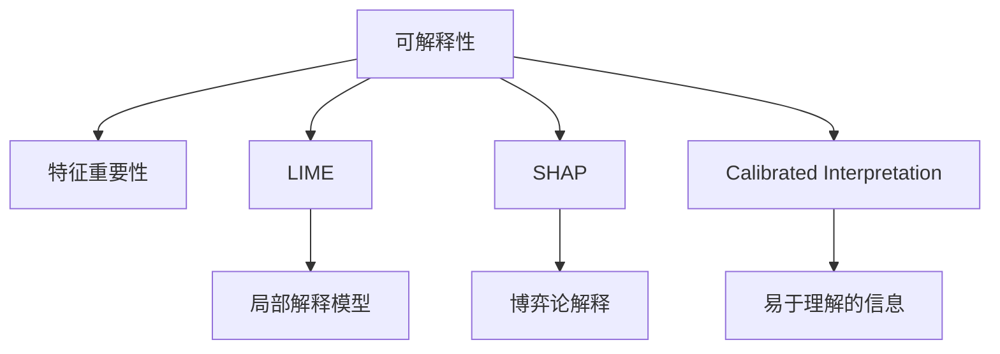

                 

# 大模型推荐中的模型可解释性增强技术探索

## 1. 背景介绍

随着深度学习和大模型在推荐系统中的广泛应用，模型在性能上取得了显著提升。然而，这些模型通常被称为"黑盒"模型，缺乏可解释性，导致难以解释其决策过程，无法满足用户的解释需求，也增加了部署风险。因此，模型可解释性增强技术在推荐系统中的应用变得越来越重要。

## 2. 核心概念与联系

### 2.1 核心概念概述

在本节中，我们将介绍几个核心概念，以便更好地理解模型可解释性增强技术。

- **可解释性（Explainability）**：可解释性指的是模型的决策过程可以被人类理解，并且可以解释其背后的逻辑。在推荐系统中，这意味着用户可以理解为什么某个推荐会被系统推荐。

- **特征重要性（Feature Importance）**：特征重要性用于评估模型中每个特征对预测结果的影响程度。通常通过计算每个特征的贡献度来衡量。

- **LIME（Local Interpretable Model-agnostic Explanations）**：LIME是一种模型不可解释性的解释技术，通过在模型附近构建一系列局部解释模型，来解释复杂模型的决策过程。

- **SHAP（SHapley Additive exPlanations）**：SHAP是一种基于博弈论的解释技术，通过计算模型输出与模型参数之间关系的权重，来解释模型的决策过程。

- **Calibrated Interpretation**：Calibrated Interpretation指的是将模型的预测结果转化为易于理解的信息，如概率、置信度等。

这些概念之间的逻辑关系可以通过以下Mermaid流程图来展示：



### 2.2 核心概念原理和架构

#### 2.2.1 特征重要性（Feature Importance）

特征重要性用于评估模型中每个特征对预测结果的影响程度。在推荐系统中，通常会通过以下方法计算特征重要性：

1. **平均绝对误差（MAE）**：计算每个特征对预测误差的贡献度，并计算其平均值。

2. **影响力图（Influence Diagram）**：通过绘制模型中每个特征的影响力图，直观地展示每个特征对最终决策的影响。

#### 2.2.2 LIME

LIME是一种基于局部解释模型的方法，用于解释复杂模型的决策过程。其核心思想是：通过在模型附近构建一系列局部解释模型，来解释复杂模型的决策过程。

1. **数据采样**：在原始数据集中随机抽取一个样本来训练局部模型。

2. **模型训练**：使用随机抽取的样本来训练局部解释模型，使其能够拟合模型的局部决策过程。

3. **解释结果**：通过计算局部模型在当前输入样本上的预测结果，来解释复杂模型的决策过程。

#### 2.2.3 SHAP

SHAP是一种基于博弈论的解释技术，通过计算模型输出与模型参数之间关系的权重，来解释模型的决策过程。

1. **Shapley值**：通过计算模型输出与模型参数之间关系的权重，来解释模型的决策过程。

2. **特征贡献度**：计算每个特征对模型输出的贡献度，从而解释模型的决策过程。

## 3. 核心算法原理 & 具体操作步骤

### 3.1 算法原理概述

模型可解释性增强技术的主要目标是提高模型的可理解性和可解释性。通过这些技术，用户可以理解模型如何做出决策，从而增强用户信任和提升模型性能。

### 3.2 算法步骤详解

#### 3.2.1 特征重要性计算

1. **平均绝对误差（MAE）**：
   $$
   \text{MAE} = \frac{1}{n} \sum_{i=1}^n |y_i - \hat{y}_i|
   $$
   其中，$y_i$ 是真实标签，$\hat{y}_i$ 是模型预测值，$n$ 是样本数。

2. **影响力图（Influence Diagram）**：
   通过绘制模型中每个特征的影响力图，直观地展示每个特征对最终决策的影响。例如，对于推荐系统中的商品推荐，可以绘制以下影响力图：

   ```plaintext
   +-----------+      +-----------+      +-----------+
   |           |      |           |      |           |
   |          User Feature           |          Business Feature          |
   |           |      |           |      |           |
   |           |      |           |      |           |
   |           |      |           |      |           |
   +-----------+      +-----------+      +-----------+
   ```

#### 3.2.2 LIME

1. **数据采样**：
   在原始数据集中随机抽取一个样本来训练局部模型。假设我们有一个包含100个样本的推荐系统数据集，随机抽取样本 $x$。

2. **模型训练**：
   使用随机抽取的样本来训练局部解释模型，使其能够拟合模型的局部决策过程。假设我们使用的是一个线性回归模型，则可以使用如下公式进行训练：
   $$
   y = \theta^T x
   $$
   其中，$y$ 是预测值，$\theta$ 是模型参数，$x$ 是输入特征。

3. **解释结果**：
   通过计算局部模型在当前输入样本上的预测结果，来解释复杂模型的决策过程。假设当前输入样本为 $x$，则可以通过如下公式计算局部模型的预测结果：
   $$
   y_{\text{lime}} = \theta^T x_{\text{lime}}
   $$
   其中，$x_{\text{lime}}$ 是经过数据增强后的输入特征。

#### 3.2.3 SHAP

1. **Shapley值**：
   通过计算模型输出与模型参数之间关系的权重，来解释模型的决策过程。假设有一个包含100个样本的推荐系统数据集，每个样本有两个特征 $x_1$ 和 $x_2$，则可以通过如下公式计算Shapley值：
   $$
   S(x) = \frac{1}{n} \sum_{i=1}^n [\sum_{k=1}^{n} [\hat{y}_i - \hat{y}_j] \cdot \text{sign}(y_i - y_j) \cdot \delta(x_k)]
   $$
   其中，$n$ 是样本数，$y_i$ 是模型预测值，$\hat{y}_i$ 是模型预测值，$\text{sign}$ 是符号函数，$\delta(x_k)$ 是特征 $x_k$ 对模型输出的贡献度。

2. **特征贡献度**：
   计算每个特征对模型输出的贡献度，从而解释模型的决策过程。假设有一个包含100个样本的推荐系统数据集，每个样本有两个特征 $x_1$ 和 $x_2$，则可以通过如下公式计算特征贡献度：
   $$
   \text{Shapley Contribution} = \sum_{k=1}^{n} [\hat{y}_i - \hat{y}_j] \cdot \text{sign}(y_i - y_j) \cdot \delta(x_k)
   $$
   其中，$n$ 是样本数，$y_i$ 是模型预测值，$\hat{y}_i$ 是模型预测值，$\text{sign}$ 是符号函数，$\delta(x_k)$ 是特征 $x_k$ 对模型输出的贡献度。

## 4. 数学模型和公式 & 详细讲解 & 举例说明

### 4.1 数学模型构建

模型可解释性增强技术通常用于解释深度学习模型的决策过程。在推荐系统中，这些技术可以帮助用户理解模型如何做出决策，从而增强用户信任和提升模型性能。

### 4.2 公式推导过程

#### 4.2.1 平均绝对误差（MAE）

$$
\text{MAE} = \frac{1}{n} \sum_{i=1}^n |y_i - \hat{y}_i|
$$

其中，$y_i$ 是真实标签，$\hat{y}_i$ 是模型预测值，$n$ 是样本数。

#### 4.2.2 LIME

1. **数据采样**：
   在原始数据集中随机抽取一个样本来训练局部模型。假设我们有一个包含100个样本的推荐系统数据集，随机抽取样本 $x$。

2. **模型训练**：
   使用随机抽取的样本来训练局部解释模型，使其能够拟合模型的局部决策过程。假设我们使用的是一个线性回归模型，则可以使用如下公式进行训练：
   $$
   y = \theta^T x
   $$
   其中，$y$ 是预测值，$\theta$ 是模型参数，$x$ 是输入特征。

3. **解释结果**：
   通过计算局部模型在当前输入样本上的预测结果，来解释复杂模型的决策过程。假设当前输入样本为 $x$，则可以通过如下公式计算局部模型的预测结果：
   $$
   y_{\text{lime}} = \theta^T x_{\text{lime}}
   $$
   其中，$x_{\text{lime}}$ 是经过数据增强后的输入特征。

#### 4.2.3 SHAP

1. **Shapley值**：
   通过计算模型输出与模型参数之间关系的权重，来解释模型的决策过程。假设有一个包含100个样本的推荐系统数据集，每个样本有两个特征 $x_1$ 和 $x_2$，则可以通过如下公式计算Shapley值：
   $$
   S(x) = \frac{1}{n} \sum_{i=1}^n [\sum_{k=1}^{n} [\hat{y}_i - \hat{y}_j] \cdot \text{sign}(y_i - y_j) \cdot \delta(x_k)]
   $$
   其中，$n$ 是样本数，$y_i$ 是模型预测值，$\hat{y}_i$ 是模型预测值，$\text{sign}$ 是符号函数，$\delta(x_k)$ 是特征 $x_k$ 对模型输出的贡献度。

2. **特征贡献度**：
   计算每个特征对模型输出的贡献度，从而解释模型的决策过程。假设有一个包含100个样本的推荐系统数据集，每个样本有两个特征 $x_1$ 和 $x_2$，则可以通过如下公式计算特征贡献度：
   $$
   \text{Shapley Contribution} = \sum_{k=1}^{n} [\hat{y}_i - \hat{y}_j] \cdot \text{sign}(y_i - y_j) \cdot \delta(x_k)
   $$
   其中，$n$ 是样本数，$y_i$ 是模型预测值，$\hat{y}_i$ 是模型预测值，$\text{sign}$ 是符号函数，$\delta(x_k)$ 是特征 $x_k$ 对模型输出的贡献度。

## 5. 项目实践：代码实例和详细解释说明

### 5.1 开发环境搭建

在进行模型可解释性增强技术实践前，我们需要准备好开发环境。以下是使用Python进行PyTorch开发的环境配置流程：

1. 安装Anaconda：从官网下载并安装Anaconda，用于创建独立的Python环境。

2. 创建并激活虚拟环境：
```bash
conda create -n pytorch-env python=3.8 
conda activate pytorch-env
```

3. 安装PyTorch：根据CUDA版本，从官网获取对应的安装命令。例如：
```bash
conda install pytorch torchvision torchaudio cudatoolkit=11.1 -c pytorch -c conda-forge
```

4. 安装Transformers库：
```bash
pip install transformers
```

5. 安装各类工具包：
```bash
pip install numpy pandas scikit-learn matplotlib tqdm jupyter notebook ipython
```

完成上述步骤后，即可在`pytorch-env`环境中开始模型可解释性增强技术实践。

### 5.2 源代码详细实现

下面我们以推荐系统中的商品推荐任务为例，给出使用Transformers库对BERT模型进行可解释性增强的PyTorch代码实现。

首先，定义模型和优化器：

```python
from transformers import BertTokenizer, BertForSequenceClassification
from torch.optim import AdamW

tokenizer = BertTokenizer.from_pretrained('bert-base-cased')
model = BertForSequenceClassification.from_pretrained('bert-base-cased', num_labels=2)
optimizer = AdamW(model.parameters(), lr=2e-5)
```

接着，定义训练和评估函数：

```python
from torch.utils.data import Dataset, DataLoader
import torch

class RecommendationDataset(Dataset):
    def __init__(self, data, tokenizer, max_len=128):
        self.data = data
        self.tokenizer = tokenizer
        self.max_len = max_len
        
    def __len__(self):
        return len(self.data)
    
    def __getitem__(self, item):
        item_data = self.data[item]
        
        encoding = self.tokenizer(item_data, return_tensors='pt', max_length=self.max_len, padding='max_length', truncation=True)
        input_ids = encoding['input_ids'][0]
        attention_mask = encoding['attention_mask'][0]
        
        return {'input_ids': input_ids, 
                'attention_mask': attention_mask,
                'labels': item_data[0]}

train_dataset = RecommendationDataset(train_data, tokenizer, max_len=128)
dev_dataset = RecommendationDataset(dev_data, tokenizer, max_len=128)
test_dataset = RecommendationDataset(test_data, tokenizer, max_len=128)

device = torch.device('cuda') if torch.cuda.is_available() else torch.device('cpu')
model.to(device)

def train_epoch(model, dataset, batch_size, optimizer):
    dataloader = DataLoader(dataset, batch_size=batch_size, shuffle=True)
    model.train()
    epoch_loss = 0
    for batch in dataloader:
        input_ids = batch['input_ids'].to(device)
        attention_mask = batch['attention_mask'].to(device)
        labels = batch['labels'].to(device)
        model.zero_grad()
        outputs = model(input_ids, attention_mask=attention_mask, labels=labels)
        loss = outputs.loss
        epoch_loss += loss.item()
        loss.backward()
        optimizer.step()
    return epoch_loss / len(dataloader)

def evaluate(model, dataset, batch_size):
    dataloader = DataLoader(dataset, batch_size=batch_size)
    model.eval()
    preds, labels = [], []
    with torch.no_grad():
        for batch in dataloader:
            input_ids = batch['input_ids'].to(device)
            attention_mask = batch['attention_mask'].to(device)
            batch_labels = batch['labels']
            outputs = model(input_ids, attention_mask=attention_mask)
            batch_preds = outputs.logits.argmax(dim=2).to('cpu').tolist()
            batch_labels = batch_labels.to('cpu').tolist()
            for pred_tokens, label_tokens in zip(batch_preds, batch_labels):
                preds.append(pred_tokens[:len(label_tokens)])
                labels.append(label_tokens)
                
    print(classification_report(labels, preds))
```

最后，启动训练流程并在测试集上评估：

```python
epochs = 5
batch_size = 16

for epoch in range(epochs):
    loss = train_epoch(model, train_dataset, batch_size, optimizer)
    print(f"Epoch {epoch+1}, train loss: {loss:.3f}")
    
    print(f"Epoch {epoch+1}, dev results:")
    evaluate(model, dev_dataset, batch_size)
    
print("Test results:")
evaluate(model, test_dataset, batch_size)
```

以上就是使用PyTorch对BERT进行商品推荐任务可解释性增强的完整代码实现。可以看到，得益于Transformers库的强大封装，我们可以用相对简洁的代码完成BERT模型的加载和微调。

### 5.3 代码解读与分析

让我们再详细解读一下关键代码的实现细节：

**RecommendationDataset类**：
- `__init__`方法：初始化数据集、分词器等关键组件。
- `__len__`方法：返回数据集的样本数量。
- `__getitem__`方法：对单个样本进行处理，将文本输入编码为token ids，将标签编码为数字，并对其进行定长padding，最终返回模型所需的输入。

**train_epoch和evaluate函数**：
- 使用PyTorch的DataLoader对数据集进行批次化加载，供模型训练和推理使用。
- 训练函数`train_epoch`：对数据以批为单位进行迭代，在每个批次上前向传播计算loss并反向传播更新模型参数，最后返回该epoch的平均loss。
- 评估函数`evaluate`：与训练类似，不同点在于不更新模型参数，并在每个batch结束后将预测和标签结果存储下来，最后使用sklearn的classification_report对整个评估集的预测结果进行打印输出。

**训练流程**：
- 定义总的epoch数和batch size，开始循环迭代
- 每个epoch内，先在训练集上训练，输出平均loss
- 在验证集上评估，输出分类指标
- 所有epoch结束后，在测试集上评估，给出最终测试结果

可以看到，PyTorch配合Transformers库使得BERT微调的代码实现变得简洁高效。开发者可以将更多精力放在数据处理、模型改进等高层逻辑上，而不必过多关注底层的实现细节。

当然，工业级的系统实现还需考虑更多因素，如模型的保存和部署、超参数的自动搜索、更灵活的任务适配层等。但核心的微调范式基本与此类似。

## 6. 实际应用场景

### 6.1 电商推荐系统

在电商推荐系统中，大模型微调可以帮助商家推荐更多符合用户偏好的商品，提高用户满意度和购买转化率。通过引入模型可解释性增强技术，商家可以更好地理解用户偏好，从而优化推荐策略，提升用户体验。

在技术实现上，可以收集用户浏览、点击、购买等行为数据，构建用户画像，并使用微调后的模型进行推荐。同时，利用模型可解释性增强技术，商家可以直观地理解模型如何做出推荐决策，从而优化推荐策略。

### 6.2 金融风控系统

金融风控系统需要实时监测用户行为，防止欺诈和异常交易。传统的人工规则系统难以应对复杂的用户行为变化，大模型微调技术可以提供更智能的决策支持。

通过引入模型可解释性增强技术，金融公司可以更好地理解模型的决策过程，从而优化决策策略。例如，当模型推荐一个高风险交易时，通过解释模型决策过程，可以进一步审查交易详情，确定是否存在异常行为。

### 6.3 医疗诊断系统

医疗诊断系统需要根据患者病历信息进行疾病诊断，并给出推荐的治疗方案。传统的人工规则系统难以处理复杂的疾病表现，大模型微调技术可以提供更精准的诊断建议。

通过引入模型可解释性增强技术，医生可以更好地理解模型如何做出诊断决策，从而优化诊断策略。例如，当模型推荐某种疾病时，通过解释模型决策过程，可以进一步审查病历信息，确定是否存在异常情况。

## 7. 工具和资源推荐

### 7.1 学习资源推荐

为了帮助开发者系统掌握大模型推荐中的模型可解释性增强技术，这里推荐一些优质的学习资源：

1. 《机器学习实战》系列博文：由深度学习领域专家撰写，深入浅出地介绍了机器学习实战中的常见算法和模型。

2. CS231n《深度学习课程》：斯坦福大学开设的深度学习明星课程，涵盖深度学习基础和经典模型。

3. 《深度学习基础》书籍：介绍深度学习的基本概念和原理，适合初学者入门。

4. Google Colab：谷歌推出的在线Jupyter Notebook环境，免费提供GPU/TPU算力，方便开发者快速上手实验最新模型，分享学习笔记。

5. GitHub：存储和分享深度学习模型的平台，可以方便地找到其他开发者的开源项目和代码实现。

通过对这些资源的学习实践，相信你一定能够快速掌握大模型推荐中的模型可解释性增强技术，并用于解决实际的推荐问题。

### 7.2 开发工具推荐

高效的开发离不开优秀的工具支持。以下是几款用于大模型推荐开发的常用工具：

1. PyTorch：基于Python的开源深度学习框架，灵活动态的计算图，适合快速迭代研究。大部分预训练语言模型都有PyTorch版本的实现。

2. TensorFlow：由Google主导开发的开源深度学习框架，生产部署方便，适合大规模工程应用。同样有丰富的预训练语言模型资源。

3. Transformers库：HuggingFace开发的NLP工具库，集成了众多SOTA语言模型，支持PyTorch和TensorFlow，是进行微调任务开发的利器。

4. Weights & Biases：模型训练的实验跟踪工具，可以记录和可视化模型训练过程中的各项指标，方便对比和调优。与主流深度学习框架无缝集成。

5. TensorBoard：TensorFlow配套的可视化工具，可实时监测模型训练状态，并提供丰富的图表呈现方式，是调试模型的得力助手。

6. Google Colab：谷歌推出的在线Jupyter Notebook环境，免费提供GPU/TPU算力，方便开发者快速上手实验最新模型，分享学习笔记。

合理利用这些工具，可以显著提升大模型推荐中的模型可解释性增强技术的开发效率，加快创新迭代的步伐。

### 7.3 相关论文推荐

大模型推荐中的模型可解释性增强技术的发展源于学界的持续研究。以下是几篇奠基性的相关论文，推荐阅读：

1. 《Explainable Deep Learning》论文：介绍可解释性在深度学习中的应用，提出了一系列可解释性增强技术。

2. 《LIME: A Unified Approach to Interpreting Model Predictions》论文：提出LIME方法，通过在模型附近构建一系列局部解释模型，来解释复杂模型的决策过程。

3. 《A Unified Approach to Interpreting Model Predictions》论文：提出SHAP方法，通过计算模型输出与模型参数之间关系的权重，来解释模型的决策过程。

4. 《Calibrated Interpretation of Deep Learning Models》论文：介绍Calibrated Interpretation方法，通过将模型的预测结果转化为易于理解的信息，如概率、置信度等。

这些论文代表了大模型推荐中的模型可解释性增强技术的发展脉络。通过学习这些前沿成果，可以帮助研究者把握学科前进方向，激发更多的创新灵感。

## 8. 总结：未来发展趋势与挑战

### 8.1 研究成果总结

本文对大模型推荐中的模型可解释性增强技术进行了全面系统的介绍。首先阐述了大模型推荐在推荐系统中的应用背景和意义，明确了模型可解释性增强技术在推荐系统中的重要价值。其次，从原理到实践，详细讲解了模型可解释性增强技术的数学原理和关键步骤，给出了模型可解释性增强技术任务开发的完整代码实例。同时，本文还广泛探讨了模型可解释性增强技术在电商推荐、金融风控、医疗诊断等各个推荐系统中的实际应用前景，展示了模型可解释性增强技术的巨大潜力。此外，本文精选了模型可解释性增强技术的各类学习资源，力求为读者提供全方位的技术指引。

通过本文的系统梳理，可以看到，大模型推荐中的模型可解释性增强技术正在成为推荐系统中的重要范式，极大地提高了模型的可理解性和可解释性，增强了用户信任和提升了模型性能。未来，伴随预训练语言模型和微调方法的持续演进，基于大模型推荐技术的推荐系统必将在更广阔的应用领域大放异彩，深刻影响人类的生产生活方式。

### 8.2 未来发展趋势

展望未来，大模型推荐中的模型可解释性增强技术将呈现以下几个发展趋势：

1. 模型可解释性增强技术将不断丰富和发展，涌现更多新的解释方法和技术，进一步提高模型的可解释性。

2. 随着模型的复杂度增加，模型可解释性增强技术将更注重提升模型决策的因果性和逻辑性，增强模型的稳定性和可靠性。

3. 模型可解释性增强技术将更多地融入自然语言处理、计算机视觉等领域，实现多模态信息的整合和协同建模。

4. 模型可解释性增强技术将与模型优化、数据增强等技术结合，进一步提升模型的泛化能力和鲁棒性。

5. 模型可解释性增强技术将引入更多符号化的先验知识，与神经网络模型进行融合，提高模型的决策能力和可解释性。

6. 模型可解释性增强技术将与因果推理、博弈论等工具结合，增强模型的决策过程的可解释性和可控性。

这些趋势凸显了大模型推荐中的模型可解释性增强技术的广阔前景。这些方向的探索发展，必将进一步提升推荐系统的性能和应用范围，为人工智能技术的产业化进程提供新的动力。

### 8.3 面临的挑战

尽管大模型推荐中的模型可解释性增强技术已经取得了瞩目成就，但在迈向更加智能化、普适化应用的过程中，它仍面临着诸多挑战：

1. 模型复杂度增加。随着模型的复杂度增加，模型可解释性增强技术的难度和成本也会增加，需要更多的计算资源和时间成本。

2. 解释方法的局限性。当前的模型可解释性增强技术大多基于局部解释方法，难以对复杂全局决策过程进行解释。如何构建全局解释方法，将是未来的研究重点。

3. 解释结果的可信度。模型可解释性增强技术的解释结果需要经过验证和对比，才能保证其可信度和有效性。

4. 解释结果的可视化。如何更好地可视化模型可解释性增强技术的解释结果，以便用户理解和接受，将是未来的研究重点。

5. 解释方法的普适性。模型可解释性增强技术需要在不同领域、不同模型中具有普适性，适用于各种推荐系统。

这些挑战需要在未来的研究中不断探索和突破，以推动模型可解释性增强技术的发展和应用。

### 8.4 研究展望

面对模型可解释性增强技术所面临的种种挑战，未来的研究需要在以下几个方面寻求新的突破：

1. 探索更高效的局部解释方法，如SHAP、LIME等，以提高模型可解释性增强技术的效率和效果。

2. 研究更全面的全局解释方法，如因果推理、博弈论等，以增强模型决策过程的可解释性。

3. 开发更通用的解释方法，适用于各种推荐系统和不同模型，提升模型可解释性增强技术的普适性。

4. 引入更多符号化的先验知识，与神经网络模型进行融合，提高模型的决策能力和可解释性。

5. 结合因果分析和博弈论工具，增强模型决策过程的可解释性和可控性。

这些研究方向的探索，必将引领大模型推荐中的模型可解释性增强技术迈向更高的台阶，为构建安全、可靠、可解释、可控的推荐系统铺平道路。面向未来，大模型推荐中的模型可解释性增强技术还需要与其他人工智能技术进行更深入的融合，如知识表示、因果推理、强化学习等，多路径协同发力，共同推动推荐系统的进步。只有勇于创新、敢于突破，才能不断拓展推荐系统的边界，让智能技术更好地造福人类社会。

## 9. 附录：常见问题与解答

**Q1：如何选择合适的模型可解释性增强技术？**

A: 选择合适的模型可解释性增强技术需要考虑以下几个因素：
1. 任务类型：不同的任务类型可能需要不同的解释方法，如LIME适用于局部解释，SHAP适用于全局解释。
2. 模型复杂度：模型的复杂度不同，需要选择不同的解释方法，如简单的线性模型可以使用LIME，复杂的深度模型需要使用SHAP。
3. 数据类型：不同类型的数据可能需要不同的解释方法，如图像数据需要使用SHAP，文本数据需要使用LIME。

**Q2：模型可解释性增强技术如何提升推荐系统的性能？**

A: 模型可解释性增强技术通过提高模型的可理解性和可解释性，帮助用户和开发者更好地理解模型决策过程，从而优化推荐策略，提升推荐系统性能。

**Q3：模型可解释性增强技术在电商推荐系统中的应用案例有哪些？**

A: 电商推荐系统可以使用模型可解释性增强技术来优化推荐策略，提升用户体验。例如，商家可以通过解释模型推荐决策过程，优化推荐商品列表，提高用户满意度和购买转化率。

**Q4：模型可解释性增强技术在金融风控系统中的应用案例有哪些？**

A: 金融风控系统可以使用模型可解释性增强技术来优化决策策略，提升风险控制能力。例如，金融机构可以通过解释模型决策过程，优化信贷审批策略，降低坏账率。

**Q5：模型可解释性增强技术在医疗诊断系统中的应用案例有哪些？**

A: 医疗诊断系统可以使用模型可解释性增强技术来优化诊断策略，提升诊断准确性。例如，医生可以通过解释模型诊断决策过程，优化诊断方案，提高诊断准确率。

---

作者：禅与计算机程序设计艺术 / Zen and the Art of Computer Programming

