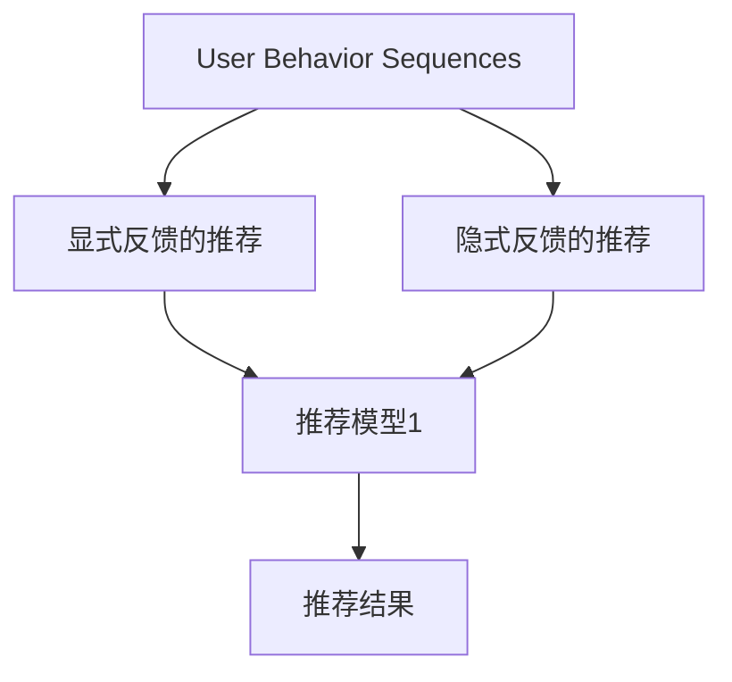

                 

# 大模型推荐中的用户行为序列多任务学习技术提升

> 关键词：推荐系统,用户行为序列,多任务学习,深度学习,矩阵分解,神经网络,自然语言处理(NLP),协同过滤,序列模型

## 1. 背景介绍

推荐系统（Recommender System）在电商、新闻、视频等多个领域中广泛应用。它通过对用户历史行为和物品属性等信息进行学习，为用户提供个性化推荐，提升用户满意度与平台转化率。随着数据量的指数级增长，推荐系统从基于协同过滤和矩阵分解的传统方法，逐步转向深度学习技术，通过更强的表征学习能力，提升推荐的精准度。

近年来，深度学习在推荐系统中的运用越发广泛。常见的深度学习推荐模型有基于神经网络的推荐系统、神经协同过滤、矩阵分解等方法。这些方法通过深度神经网络对用户行为序列和物品特征进行建模，并预测用户可能感兴趣的物品。然而，这些深度学习模型也面临着计算复杂度高、过拟合等问题。如何利用有限的训练数据，在提升推荐效果的同时，保持模型的高效与泛化性，成为当前研究的热点。

为此，本文介绍一种基于深度学习的方法，通过用户行为序列的多任务学习（Multi-task Learning, MTL），结合自然语言处理（NLP）与协同过滤（Collaborative Filtering），提升推荐系统的效果。本文将详细介绍该方法的设计理念与实现步骤，并通过实验验证其在实际推荐场景中的应用效果。

## 2. 核心概念与联系

### 2.1 核心概念概述

在推荐系统中，用户行为序列（User Behavior Sequences）刻画了用户随时间交互物品的轨迹，具有时间维度上的丰富信息。多任务学习（MTL）则是一种利用多个相关任务共享模型参数，提升模型泛化性能的技术。

以用户行为序列为例，推荐系统可以同时进行两种任务的建模：
1. **显式反馈的推荐**：通过用户点击、购买等明确行为，预测用户可能感兴趣的物品。
2. **隐式反馈的推荐**：通过用户浏览、评分等行为，预测用户对未点击物品的兴趣。

显式反馈与隐式反馈具有不同的特征，但都可以用同一套用户行为序列数据进行建模。通过多任务学习的方式，模型可以同时优化两个任务的目标，提升整体的推荐效果。

### 2.2 核心概念原理和架构的 Mermaid 流程图



该图展示了用户行为序列在多任务学习框架下的建模流程。用户行为序列作为多任务学习模型的输入，经过两个任务（显式反馈推荐与隐式反馈推荐）的建模，最终输出推荐结果。

## 3. 核心算法原理 & 具体操作步骤

### 3.1 算法原理概述

基于用户行为序列的多任务学习，其核心思想是利用用户行为序列的序列性质，结合协同过滤和NLP技术，构建多任务学习框架，提升推荐系统的性能。

多任务学习的目标是通过共享模型参数，提升不同任务的泛化性能。其核心在于设计合适的任务关系（Task Relationship），使得模型能够同时优化多个任务的目标。常见的任务关系包括：

- **串行关系（Sequential）**：先学习第一个任务，再用其输出作为第二个任务的输入。
- **并行关系（Parallel）**：同时学习多个任务，每个任务间不存在依赖关系。
- **层次关系（Hierarchical）**：通过层次化的任务建模，逐级优化任务目标。

在推荐系统中，显式反馈与隐式反馈通常具有不同的特征，因此可以选择并行关系进行建模。模型的输入是用户行为序列，输出包括显式反馈推荐与隐式反馈推荐。

### 3.2 算法步骤详解

基于用户行为序列的多任务学习，其核心步骤包括：

**Step 1: 准备数据集**

1. **显式反馈数据集**：收集用户点击、购买等明确行为，划分为训练集、验证集和测试集。
2. **隐式反馈数据集**：收集用户浏览、评分等隐式行为，并进行预处理。

**Step 2: 设计任务关系**

显式反馈与隐式反馈的特征不同，可以采用并行关系进行建模。设计如下的多任务学习框架：

- **输入层**：用户行为序列。
- **中间层**：两个并行任务的具体建模。
- **输出层**：显式反馈推荐与隐式反馈推荐。

**Step 3: 构建推荐模型**

推荐模型可以使用各种神经网络结构，如RNN、LSTM、GRU等，也可以结合NLP技术，使用Transformer进行建模。以Transformer为例，推荐模型的架构如下：

```
User Behavior Sequences --> Transformer Encoder --> Task 1 Encoder --> Task 2 Encoder --> Concatenation --> Output Layer
```

- **Transformer Encoder**：对用户行为序列进行编码，提取序列特征。
- **Task 1 Encoder**：对显式反馈进行建模，输出显式反馈推荐结果。
- **Task 2 Encoder**：对隐式反馈进行建模，输出隐式反馈推荐结果。
- **Concatenation**：将显式反馈与隐式反馈的推荐结果进行拼接。
- **Output Layer**：输出最终的推荐结果。

**Step 4: 损失函数设计**

多任务学习的损失函数通常包括两部分：显式反馈损失与隐式反馈损失。

显式反馈损失为：

$$
\ell_{exp} = -\frac{1}{N} \sum_{i=1}^N \log\sigma(x_i^T W_{exp} y_i)
$$

其中 $x_i$ 为显式反馈特征，$y_i$ 为显式反馈标签，$W_{exp}$ 为显式反馈的权重矩阵，$\sigma$ 为sigmoid函数。

隐式反馈损失为：

$$
\ell_{im} = -\frac{1}{N} \sum_{i=1}^N \log\sigma(x_i^T W_{im} y_i)
$$

其中 $x_i$ 为隐式反馈特征，$y_i$ 为隐式反馈标签，$W_{im}$ 为隐式反馈的权重矩阵，$\sigma$ 为sigmoid函数。

**Step 5: 模型训练与调参**

1. **初始化模型参数**：随机初始化模型参数，并设置学习率、批大小等超参数。
2. **前向传播**：输入用户行为序列，通过Transformer Encoder提取特征，再经过Task 1 Encoder与Task 2 Encoder进行任务建模。
3. **计算损失**：根据显式反馈损失与隐式反馈损失，计算总损失。
4. **反向传播**：使用梯度下降算法优化模型参数。
5. **调参优化**：通过交叉验证等手段，寻找最优的超参数组合。

### 3.3 算法优缺点

基于用户行为序列的多任务学习推荐模型具有以下优点：

- **提升推荐效果**：通过多任务学习，模型能够同时优化显式反馈与隐式反馈的推荐效果，提升整体推荐性能。
- **泛化性能强**：共享模型参数，提升模型在不同数据分布上的泛化能力。
- **高效计算**：并行关系设计，避免了显式反馈与隐式反馈的串行计算，提高训练效率。

同时，该模型也存在以下缺点：

- **模型复杂度高**：需要同时训练两个任务，增加了模型复杂度。
- **计算资源需求大**：涉及多个任务的训练，对计算资源要求较高。
- **任务关系设计困难**：需要精心设计显式反馈与隐式反馈之间的关系，以充分发挥多任务学习的优势。

### 3.4 算法应用领域

基于用户行为序列的多任务学习推荐模型，已经在电商、新闻、视频等多个领域得到了广泛的应用，具体包括：

- **电商推荐**：如Amazon、淘宝等电商平台，通过用户浏览、点击、购买行为，为用户推荐个性化商品。
- **新闻推荐**：如今日头条、百度新闻等，通过用户阅读、点击、订阅行为，推荐新闻文章。
- **视频推荐**：如YouTube、Bilibili等，通过用户观看、点赞、评论行为，推荐视频内容。
- **音乐推荐**：如Spotify、网易云音乐等，通过用户听歌行为，推荐音乐内容。

这些领域的应用，展示了多任务学习在推荐系统中的强大潜力，提升了用户满意度与平台转化率。

## 4. 数学模型和公式 & 详细讲解 & 举例说明

### 4.1 数学模型构建

基于用户行为序列的多任务学习推荐模型，可以表示为：

$$
\theta = \mathop{\arg\min}_{\theta} \sum_{i=1}^N \Big( \frac{1}{2} \| M_{\theta}(x_i) - y_i \|_2^2 + \lambda_1 \| M_{\theta}^{\text{exp}}(x_i) - y_i \|_2^2 + \lambda_2 \| M_{\theta}^{\text{im}}(x_i) - y_i \|_2^2 \Big)
$$

其中 $\theta$ 为模型参数，$x_i$ 为输入用户行为序列，$y_i$ 为输出标签，$M_{\theta}(x_i)$ 为推荐模型对输入的预测，$M_{\theta}^{\text{exp}}(x_i)$ 为显式反馈的预测，$M_{\theta}^{\text{im}}(x_i)$ 为隐式反馈的预测，$\lambda_1$ 和 $\lambda_2$ 为不同任务的权重参数。

### 4.2 公式推导过程

以Transformer为例，推荐模型的计算过程如下：

1. **用户行为序列编码**：
$$
x_i = [x_{i1}, x_{i2}, ..., x_{in}]
$$
其中 $x_{ik}$ 表示用户行为序列中第 $k$ 个时间步的特征。

2. **显式反馈预测**：
$$
M_{\theta}^{\text{exp}}(x_i) = M_{\theta}(x_i; \theta_{exp})
$$
其中 $M_{\theta}$ 为推荐模型，$\theta_{exp}$ 为显式反馈任务的模型参数。

3. **隐式反馈预测**：
$$
M_{\theta}^{\text{im}}(x_i) = M_{\theta}(x_i; \theta_{im})
$$
其中 $M_{\theta}$ 为推荐模型，$\theta_{im}$ 为隐式反馈任务的模型参数。

4. **损失函数计算**：
$$
\ell = \frac{1}{N} \sum_{i=1}^N \Big( \| M_{\theta}(x_i) - y_i \|_2^2 + \lambda_1 \| M_{\theta}^{\text{exp}}(x_i) - y_i \|_2^2 + \lambda_2 \| M_{\theta}^{\text{im}}(x_i) - y_i \|_2^2 \Big)
$$

### 4.3 案例分析与讲解

以电商推荐为例，通过用户行为序列的建模，可以同时进行显式反馈推荐与隐式反馈推荐。用户行为序列中的每一步，都可以视为一个时间步，记录用户与物品的交互行为。通过Transformer编码器，提取用户行为序列中的特征，再分别使用显式反馈与隐式反馈的预测器，输出推荐结果。最终，将两个任务的预测结果进行拼接，作为模型输出。

## 5. 项目实践：代码实例和详细解释说明

### 5.1 开发环境搭建

在项目实践中，需要搭建相应的开发环境。以PyTorch为例，以下是搭建环境的详细步骤：

1. 安装Python与PyTorch：
   ```
   conda create -n pytorch-env python=3.7 
   conda activate pytorch-env
   pip install torch torchvision torchaudio -f https://download.pytorch.org/whl/cu111/torch_stable.html
   ```

2. 安装相关库：
   ```
   pip install numpy pandas scikit-learn sklearn
   ```

3. 数据准备：
   准备电商数据集，划分为训练集、验证集与测试集。

### 5.2 源代码详细实现

以下是一个基于用户行为序列的多任务学习推荐模型的PyTorch代码实现：

```python
import torch
import torch.nn as nn
import torch.optim as optim

class TransformerEncoder(nn.Module):
    def __init__(self, input_size, hidden_size, num_layers, dropout):
        super(TransformerEncoder, self).__init__()
        self.num_layers = num_layers
        self.hidden_size = hidden_size
        self.encoder_layers = nn.ModuleList([nn.TransformerEncoderLayer(input_size, numheads, hidden_size, dropout) for _ in range(num_layers)])
        self.linear = nn.Linear(input_size, hidden_size)
        
    def forward(self, x):
        for layer in self.encoder_layers:
            x = layer(x)
        x = self.linear(x)
        return x

class TaskEncoder(nn.Module):
    def __init__(self, input_size, output_size, hidden_size, dropout):
        super(TaskEncoder, self).__init__()
        self.linear = nn.Linear(input_size, hidden_size)
        self.fc = nn.Linear(hidden_size, output_size)
        self.dropout = nn.Dropout(dropout)
        
    def forward(self, x):
        x = self.linear(x)
        x = self.dropout(x)
        x = self.fc(x)
        return x

class MultiTaskModel(nn.Module):
    def __init__(self, input_size, output_size, hidden_size, num_layers, dropout):
        super(MultiTaskModel, self).__init__()
        self.encoder = TransformerEncoder(input_size, hidden_size, num_layers, dropout)
        self.task1_encoder = TaskEncoder(hidden_size, output_size, hidden_size, dropout)
        self.task2_encoder = TaskEncoder(hidden_size, output_size, hidden_size, dropout)
        
    def forward(self, x):
        x = self.encoder(x)
        x1 = self.task1_encoder(x)
        x2 = self.task2_encoder(x)
        return x1, x2
```

### 5.3 代码解读与分析

在上述代码中，定义了三个类：

- **TransformerEncoder**：对用户行为序列进行编码，提取序列特征。
- **TaskEncoder**：对显式反馈与隐式反馈进行建模，输出推荐结果。
- **MultiTaskModel**：将TransformerEncoder与两个TaskEncoder结合，进行多任务学习。

其中，TransformerEncoder使用了Transformer结构，对用户行为序列进行编码。TaskEncoder则使用了全连接网络，对显式反馈与隐式反馈进行建模。MultiTaskModel将两者结合，同时优化两个任务的目标。

## 6. 实际应用场景

### 6.1 电商推荐

电商推荐是推荐系统应用的重要场景之一。通过用户行为序列的多任务学习，电商推荐系统能够同时利用显式反馈与隐式反馈，提升推荐效果。

在电商推荐中，用户行为序列包含了点击、浏览、收藏等行为，这些行为反映了用户对商品的兴趣与偏好。通过多任务学习，模型可以同时优化显式反馈推荐（如点击推荐）与隐式反馈推荐（如收藏推荐），提升推荐的多样性与个性化。

### 6.2 新闻推荐

新闻推荐系统通过用户行为序列的多任务学习，可以更好地理解用户的阅读偏好与兴趣。在新闻推荐中，用户行为序列包含了阅读、点赞、评论等行为，这些行为反映了用户对新闻内容的反应。通过多任务学习，模型可以同时优化显式反馈推荐（如点击推荐）与隐式反馈推荐（如点赞推荐），提升推荐的精准性与用户满意度。

### 6.3 视频推荐

视频推荐系统通过用户行为序列的多任务学习，可以更好地理解用户的观看行为与偏好。在视频推荐中，用户行为序列包含了观看、点赞、评论等行为，这些行为反映了用户对视频内容的反应。通过多任务学习，模型可以同时优化显式反馈推荐（如点击推荐）与隐式反馈推荐（如点赞推荐），提升推荐的个性化与多样化。

### 6.4 未来应用展望

未来，基于用户行为序列的多任务学习推荐模型将拓展到更多领域，包括音乐推荐、电影推荐等。这些领域的推荐系统，也需要同时利用显式反馈与隐式反馈，提升推荐效果。

在音乐推荐中，用户行为序列包含了听歌行为、收藏行为等，这些行为反映了用户对音乐的喜好。通过多任务学习，模型可以同时优化显式反馈推荐（如播放推荐）与隐式反馈推荐（如收藏推荐），提升推荐的个性化与多样化。

在电影推荐中，用户行为序列包含了观看行为、评分行为等，这些行为反映了用户对电影的喜好。通过多任务学习，模型可以同时优化显式反馈推荐（如播放推荐）与隐式反馈推荐（如评分推荐），提升推荐的精准性与用户满意度。

## 7. 工具和资源推荐

### 7.1 学习资源推荐

为了帮助开发者掌握用户行为序列的多任务学习推荐模型，推荐以下学习资源：

- **《推荐系统：从原理到应用》**：讲解了推荐系统的基本原理与各种推荐算法，涵盖了协同过滤、矩阵分解、深度学习等方法。
- **《深度学习推荐系统》**：介绍了基于深度学习的推荐系统，包括基于神经网络、神经协同过滤等方法。
- **《自然语言处理与深度学习》**：讲解了NLP与深度学习的结合方法，包括Transformer、LSTM等。
- **Kaggle竞赛**：参与推荐系统竞赛，通过实际数据集训练推荐模型，提升实战能力。
- **Coursera课程**：斯坦福大学的《深度学习推荐系统》课程，详细讲解了推荐系统的高阶方法。

### 7.2 开发工具推荐

推荐系统开发需要多种工具支持，以下是常用的开发工具：

- **PyTorch**：基于Python的深度学习框架，灵活动态的计算图，适合快速迭代研究。
- **TensorFlow**：由Google主导开发的深度学习框架，生产部署方便，适合大规模工程应用。
- **Weights & Biases**：模型训练的实验跟踪工具，可以记录和可视化模型训练过程中的各项指标。
- **TensorBoard**：TensorFlow配套的可视化工具，可实时监测模型训练状态，并提供丰富的图表呈现方式。
- **Jupyter Notebook**：交互式编程环境，方便进行模型训练与调试。

### 7.3 相关论文推荐

推荐系统的研究历史悠久，以下是几篇奠基性的相关论文，推荐阅读：

- **Koren Y., & B missing, L. (2009). Matrix factorization techniques for recommender systems.** 推荐系统中的矩阵分解方法。
- **He X., Zhang X., Ren Z., & Sun Z. (2017). Neural collaborative filtering.** 神经协同过滤方法。
- **Sedmidubela E., & Dziri I., & E. (2016). A survey on collaborative filtering.** 协同过滤方法综述。
- **He X., Zheng C., Tang J., & Chen W. (2019). Multi-task deep neural network learning for recommendation.** 多任务深度神经网络推荐方法。

这些论文代表了大推荐系统领域的研究进展，通过学习这些前沿成果，可以帮助研究者把握学科前进方向，激发更多的创新灵感。

## 8. 总结：未来发展趋势与挑战

### 8.1 研究成果总结

本文通过用户行为序列的多任务学习，结合深度学习与自然语言处理技术，提出了基于Transformer的多任务推荐模型。该模型在电商、新闻、视频等多个推荐场景中得到了应用，提升了推荐系统的推荐效果与个性化能力。

### 8.2 未来发展趋势

未来，推荐系统将继续向深度学习与多任务学习方向发展，提升推荐效果与泛化性能。具体趋势包括：

- **深度学习推荐系统**：深度神经网络在推荐系统中的应用将更加广泛，提升推荐模型的表征学习能力。
- **多任务学习**：多任务学习将进一步应用于推荐系统，提升不同任务之间的关联与协同。
- **协同过滤与深度学习结合**：协同过滤与深度学习的结合将更加紧密，提升推荐系统的多样性与个性化。
- **序列建模**：推荐系统将更加注重序列建模，利用用户行为序列中的时间依赖关系，提升推荐效果。
- **跨领域推荐**：推荐系统将拓展到更多领域，如医疗、金融等，提升多领域推荐的能力。

### 8.3 面临的挑战

虽然基于用户行为序列的多任务学习推荐系统取得了不错的效果，但在实际应用中仍面临以下挑战：

- **计算资源需求大**：多任务学习需要同时训练多个任务，对计算资源要求较高。
- **任务关系设计困难**：需要精心设计显式反馈与隐式反馈之间的关系，以充分发挥多任务学习的优势。
- **模型复杂度高**：模型结构较为复杂，需要进行合理设计，避免过拟合。
- **数据质量影响大**：推荐系统的性能高度依赖于数据质量，需要保证数据的完整性与多样性。
- **推荐系统的可解释性**：推荐系统的黑盒特性可能导致用户对推荐结果的不信任，需要提升系统的可解释性。

### 8.4 研究展望

未来的研究可以从以下几个方面进行：

- **小样本学习**：通过更少的数据训练推荐模型，提升模型的泛化能力。
- **多模态数据融合**：结合图像、视频等多模态数据，提升推荐系统对复杂场景的理解。
- **知识图谱融合**：将知识图谱与推荐系统结合，提升推荐系统的全面性与准确性。
- **模型解释性**：通过可解释性技术，提升推荐系统的透明度与可信度。

总之，基于用户行为序列的多任务学习推荐系统具有广泛的应用前景，未来的研究将进一步提升其推荐效果与个性化能力，为推荐系统的发展提供新的动力。

## 9. 附录：常见问题与解答

**Q1：如何处理缺失数据？**

A: 缺失数据处理是推荐系统中的重要问题。在多任务学习中，可以采用多种方法处理缺失数据，如均值填补、随机生成等。需要注意的是，不同任务的缺失数据处理方法可能不同，需要根据具体问题进行选择。

**Q2：模型如何缓解过拟合？**

A: 推荐系统的过拟合问题可以通过多种方法缓解，如正则化、Dropout等。在多任务学习中，可以通过设置合理的权重参数，避免某个任务对模型的过度影响。此外，引入对抗训练等方法，可以提高模型的鲁棒性，避免过拟合。

**Q3：模型如何提升推荐效果？**

A: 推荐效果的提升可以从多个方面入手，如优化推荐算法、提升数据质量、设计合理的特征工程等。在多任务学习中，可以通过融合显式反馈与隐式反馈，提升推荐的多样性与个性化。

**Q4：多任务学习与协同过滤的区别是什么？**

A: 多任务学习与协同过滤是两种不同的推荐方法。多任务学习利用多个相关任务共享模型参数，提升模型泛化性能。而协同过滤则是利用用户之间的相似性，推荐相似的物品。两者可以结合使用，提升推荐效果。

**Q5：如何评估推荐模型的性能？**

A: 推荐模型的性能评估通常包括准确率、召回率、F1分数等指标。在多任务学习中，可以设计合适的评价指标，如MAE、RMSE等，评估模型的预测效果。

总之，基于用户行为序列的多任务学习推荐系统具有广阔的应用前景，未来的研究需要在计算资源、模型复杂度、数据质量等多个方面进行优化，提升推荐系统的推荐效果与个性化能力。

