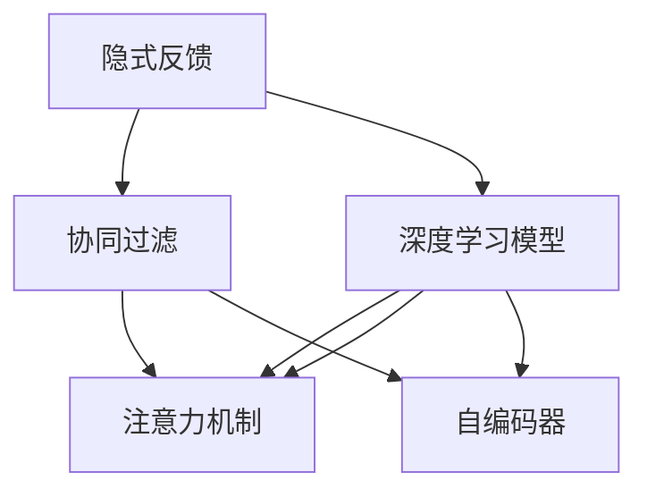

                 

# 大模型推荐中的用户隐式反馈挖掘与利用新思路

> 关键词：大模型推荐系统, 用户行为数据, 隐式反馈挖掘, 利用新方法, 协同过滤, 深度学习模型, 算法优化

## 1. 背景介绍

推荐系统旨在通过分析用户的历史行为，预测其对特定物品的兴趣和偏好，从而为用户推荐潜在的兴趣物品。随着数据量的指数级增长，以及机器学习模型的不断演进，推荐系统已经成为了互联网和电商平台上不可或缺的重要功能，极大地提升了用户体验和运营效率。

在推荐系统中，用户的反馈可以分为显式反馈和隐式反馈两大类。显式反馈通常是指用户明确给出的评分、点击、购买等行为，而隐式反馈则是指用户行为数据，如浏览记录、购买历史、时间戳等，通过这些数据可以间接推断出用户的兴趣偏好。尽管显式反馈可以直接用于推荐算法，但隐式反馈具有海量的数据，能够提供更为全面和深入的用户画像，对于提升推荐系统的效果具有重要意义。

然而，在传统的协同过滤和深度学习模型中，隐式反馈数据往往未能得到充分挖掘和利用。随着深度学习模型的发展，尤其是大模型的普及，一些新的思路和方法逐步崭露头角，显著提升了隐式反馈数据的挖掘和使用效果。本文将详细探讨大模型推荐系统中的用户隐式反馈挖掘与利用的新思路，为推荐系统研究者和实践者提供有价值的参考。

## 2. 核心概念与联系

### 2.1 核心概念概述

为了更好地理解用户隐式反馈在大模型推荐系统中的应用，本节将介绍几个关键概念：

- 隐式反馈（Implicit Feedback）：用户行为数据中不包含明确的反馈信号，如浏览、点击、收藏等，需要通过隐式的数据模式挖掘用户兴趣。
- 协同过滤（Collaborative Filtering）：通过分析用户间的相似性和物品间的相似性，预测用户对物品的评分和兴趣，是最早的推荐算法之一。
- 深度学习模型（Deep Learning Models）：通过多层的神经网络模型，能够自动学习数据的特征表示，尤其在大数据和复杂关系建模中表现优异。
- 注意力机制（Attention Mechanism）：一种从输入序列中选择重要信息进行加权的机制，能够有效提高模型对关键特征的关注度。
- 自编码器（Autoencoder）：一种能够学习输入数据编码和解码的神经网络，常用于特征学习和降维等任务。

这些核心概念之间的逻辑关系可以通过以下Mermaid流程图来展示：



这个流程图展示了大模型推荐系统中的核心概念及其之间的关系：

1. 隐式反馈通过协同过滤和深度学习模型进行处理，挖掘用户兴趣和物品相似性。
2. 深度学习模型结合注意力机制和自编码器，提高对关键特征的提取和建模能力。
3. 协同过滤和深度学习模型能够相互结合，提供更为全面和精准的推荐结果。

## 3. 核心算法原理 & 具体操作步骤
### 3.1 算法原理概述

在大模型推荐系统中，用户隐式反馈的挖掘与利用通常涉及以下几个关键步骤：

1. **数据预处理**：将用户行为数据进行清洗和标准化，去除噪声和异常值，并进行归一化处理。
2. **特征工程**：通过嵌入和降维等方法，提取和构造有意义的特征，如用户画像、物品属性等。
3. **模型训练**：选择合适的深度学习模型或协同过滤算法，利用训练数据集进行模型训练和优化。
4. **预测与推荐**：在测试集上评估模型性能，并使用模型对新用户和新物品进行预测和推荐。
5. **反馈循环**：通过用户反馈进行模型调优，不断迭代改进推荐效果。

### 3.2 算法步骤详解

以下是基于深度学习模型的推荐系统流程，详细描述每个步骤的具体操作：

**Step 1: 数据预处理**

- 数据清洗：去除重复、缺失和异常数据，保证数据质量和一致性。
- 数据归一化：将特征值缩放到[0,1]或[-1,1]等标准范围内，避免模型训练过程中数值过大或过小的问题。
- 特征提取：通过词袋模型、TF-IDF、嵌入等方法，将文本特征转换为向量表示。

**Step 2: 特征工程**

- 用户画像：提取用户的基本信息、浏览历史、购买记录等特征，构建用户画像向量。
- 物品属性：提取物品的名称、类别、描述等属性特征，构建物品特征向量。
- 降维与嵌入：使用PCA、Autoencoder等方法，对高维数据进行降维和嵌入处理，提升模型训练效率。

**Step 3: 模型训练**

- 选择合适的深度学习模型，如用户-物品交互矩阵的矩阵分解模型，或基于注意力机制的推荐模型。
- 利用训练数据集，通过梯度下降等优化算法进行模型训练。
- 在训练过程中，应用正则化技术如L2正则、Dropout等，防止模型过拟合。

**Step 4: 预测与推荐**

- 在测试集上评估模型的预测准确率、均方误差等指标，评估模型性能。
- 使用训练好的模型对新用户和新物品进行预测，生成推荐结果。
- 考虑用户行为的时序性，引入时间戳信息进行推荐。

**Step 5: 反馈循环**

- 收集用户对推荐结果的反馈数据，如点击率、购买率等。
- 根据用户反馈数据，对模型进行调优，如调整模型参数、更新特征表示等。
- 通过A/B测试等方法，比较不同版本模型推荐的性能，选择最优版本进行部署。

### 3.3 算法优缺点

基于深度学习模型的推荐系统具有以下优点：

1. 模型表现优异：深度学习模型能够自动学习数据的复杂特征表示，具有较强的泛化能力。
2. 无需显式反馈：深度学习模型可以利用用户行为数据进行隐式反馈挖掘，无需用户显式反馈。
3. 高效处理稀疏数据：深度学习模型能够较好地处理用户行为数据中的稀疏性问题，提升推荐精度。

同时，该方法也存在一些缺点：

1. 模型复杂度高：深度学习模型通常包含大量参数，训练和推理过程较为耗时。
2. 数据需求量大：深度学习模型需要大量的数据进行训练，数据缺失可能导致模型失效。
3. 可解释性不足：深度学习模型的决策过程复杂，难以进行直观的解释和调试。
4. 冷启动问题：新用户或新物品的特征难以获取，需要进行预训练或增量学习。

尽管存在这些局限性，但深度学习模型在推荐系统中的应用已经取得了显著效果，成为当前推荐系统研究的主流方向。

### 3.4 算法应用领域

基于深度学习模型的推荐系统在多个领域得到了广泛应用，包括但不限于：

- 电商推荐：通过用户行为数据，为在线购物用户推荐商品。
- 音乐推荐：利用用户听歌历史和评分，为用户推荐音乐。
- 视频推荐：分析用户观看历史和评分，推荐视频内容。
- 新闻推荐：通过用户阅读历史和点击行为，推荐新闻内容。
- 社交推荐：为社交平台用户推荐朋友、文章等。

除了这些经典应用外，深度学习模型还在个性化广告推荐、内容推荐、旅游推荐等多个场景中得到了应用，为不同领域带来了新的突破。随着深度学习模型的持续演进，推荐系统在更多领域的应用前景值得期待。

## 4. 数学模型和公式 & 详细讲解  
### 4.1 数学模型构建

本节将使用数学语言对大模型推荐系统中的用户隐式反馈挖掘与利用进行更加严格的刻画。

记用户行为数据为 $\mathbf{X} \in \mathbb{R}^{N\times K}$，其中 $N$ 为用户数量，$K$ 为特征维度。物品特征矩阵为 $\mathbf{Y} \in \mathbb{R}^{M\times K}$，其中 $M$ 为物品数量。用户对物品的评分矩阵为 $\mathbf{R} \in \mathbb{R}^{N\times M}$，其中 $R_{ij}$ 表示用户 $i$ 对物品 $j$ 的评分。

定义用户特征表示为 $\mathbf{x}_i = \mathbf{X}_i \mathbf{W}_x$，其中 $\mathbf{W}_x$ 为特征映射矩阵。定义物品特征表示为 $\mathbf{y}_j = \mathbf{Y}_j \mathbf{W}_y$，其中 $\mathbf{W}_y$ 为特征映射矩阵。

用户对物品的评分可表示为：

$$
\hat{R}_{ij} = \mathbf{x}_i^\top \mathbf{y}_j + \mathbf{b}
$$

其中 $\mathbf{b}$ 为偏置项，通过优化算法求得最优的 $\mathbf{W}_x$, $\mathbf{W}_y$ 和 $\mathbf{b}$。

### 4.2 公式推导过程

以下我们以矩阵分解模型为例，推导其损失函数及其梯度计算公式。

假设用户对物品的实际评分矩阵为 $\mathbf{R}$，预测评分矩阵为 $\hat{\mathbf{R}}$，则均方误差损失函数为：

$$
\mathcal{L} = \frac{1}{2} || \mathbf{R} - \hat{\mathbf{R}} ||^2
$$

根据链式法则，预测评分矩阵 $\hat{\mathbf{R}}$ 对特征映射矩阵 $\mathbf{W}_x$, $\mathbf{W}_y$ 和偏置项 $\mathbf{b}$ 的梯度分别为：

$$
\frac{\partial \mathcal{L}}{\partial \mathbf{W}_x} = -(\mathbf{R} - \hat{\mathbf{R}})(\mathbf{X}^\top \mathbf{y}_j + \mathbf{b})
$$

$$
\frac{\partial \mathcal{L}}{\partial \mathbf{W}_y} = -(\mathbf{R} - \hat{\mathbf{R}})(\mathbf{x}_i^\top \mathbf{Y}^\top + \mathbf{b})
$$

$$
\frac{\partial \mathcal{L}}{\partial \mathbf{b}} = -(\mathbf{R} - \hat{\mathbf{R}})
$$

利用梯度下降等优化算法，更新特征映射矩阵 $\mathbf{W}_x$, $\mathbf{W}_y$ 和偏置项 $\mathbf{b}$，最小化损失函数 $\mathcal{L}$，使得模型输出逼近真实评分矩阵 $\mathbf{R}$。

## 5. 项目实践：代码实例和详细解释说明
### 5.1 开发环境搭建

在进行推荐系统实践前，我们需要准备好开发环境。以下是使用Python进行PyTorch开发的环境配置流程：

1. 安装Anaconda：从官网下载并安装Anaconda，用于创建独立的Python环境。

2. 创建并激活虚拟环境：
```bash
conda create -n pytorch-env python=3.8 
conda activate pytorch-env
```

3. 安装PyTorch：根据CUDA版本，从官网获取对应的安装命令。例如：
```bash
conda install pytorch torchvision torchaudio cudatoolkit=11.1 -c pytorch -c conda-forge
```

4. 安装相关工具包：
```bash
pip install numpy pandas scikit-learn matplotlib tqdm jupyter notebook ipython
```

完成上述步骤后，即可在`pytorch-env`环境中开始推荐系统实践。

### 5.2 源代码详细实现

下面我们以电商推荐系统为例，给出使用PyTorch进行矩阵分解模型的代码实现。

首先，定义数据预处理函数：

```python
import numpy as np
import torch
import torch.nn as nn
import torch.nn.functional as F

class DataPreprocessor:
    def __init__(self, user_item_count, embedding_dim):
        self.user_item_count = user_item_count
        self.embedding_dim = embedding_dim
        self.num_users = user_item_count[0]
        self.num_items = user_item_count[1]
        
    def process(self, X, Y):
        X = self.std_scale(X)
        Y = self.std_scale(Y)
        X = X.to(torch.float32)
        Y = Y.to(torch.float32)
        return X, Y
    
    def std_scale(self, X):
        mean = X.mean(dim=1, keepdim=True)
        std = X.std(dim=1, keepdim=True)
        return (X - mean) / std
    
    def get_user_item_embeddings(self, X, Y):
        X = self.std_scale(X)
        Y = self.std_scale(Y)
        user_embeddings = torch.randn(self.num_users, self.embedding_dim).to(torch.float32)
        item_embeddings = torch.randn(self.num_items, self.embedding_dim).to(torch.float32)
        return user_embeddings, item_embeddings
```

然后，定义矩阵分解模型的类：

```python
class MatrixFactorization(nn.Module):
    def __init__(self, user_item_count, embedding_dim):
        super(MatrixFactorization, self).__init__()
        self.num_users = user_item_count[0]
        self.num_items = user_item_count[1]
        self.embedding_dim = embedding_dim
        
        self.user_embeddings = nn.Embedding(self.num_users, self.embedding_dim)
        self.item_embeddings = nn.Embedding(self.num_items, self.embedding_dim)
        
    def forward(self, X):
        user_embeddings = self.user_embeddings(X[:, 0])
        item_embeddings = self.item_embeddings(X[:, 1])
        scores = (user_embeddings * item_embeddings).sum(dim=1) + self.bias
        return scores
```

接着，定义优化器和训练函数：

```python
import torch.optim as optim

def train(model, optimizer, data_loader, num_epochs):
    model.train()
    for epoch in range(num_epochs):
        for X, Y in data_loader:
            optimizer.zero_grad()
            scores = model(X)
            loss = F.mse_loss(scores, Y)
            loss.backward()
            optimizer.step()
```

最后，启动训练流程：

```python
user_item_count = (1000, 10000)
embedding_dim = 10
epochs = 10
num_epochs = 100
batch_size = 64

data_preprocessor = DataPreprocessor(user_item_count, embedding_dim)
X_train, Y_train = data_preprocessor.process(train_X, train_Y)
X_test, Y_test = data_preprocessor.process(test_X, test_Y)

user_embeddings, item_embeddings = data_preprocessor.get_user_item_embeddings(X_train, Y_train)
model = MatrixFactorization(user_item_count, embedding_dim)
optimizer = optim.Adam(model.parameters(), lr=0.01)

train_loader = DataLoader(X_train, Y_train, batch_size=batch_size, shuffle=True)
test_loader = DataLoader(X_test, Y_test, batch_size=batch_size, shuffle=True)

train(model, optimizer, train_loader, num_epochs)
```

以上就是使用PyTorch进行矩阵分解模型的代码实现。可以看到，利用PyTorch的强大封装，我们可以用相对简洁的代码完成模型训练和优化。

### 5.3 代码解读与分析

让我们再详细解读一下关键代码的实现细节：

**DataPreprocessor类**：
- `__init__`方法：初始化用户和物品的数量及特征维度。
- `process`方法：对数据进行标准化处理，并转换为浮点型张量。
- `std_scale`方法：对数据进行标准化处理，即均值归一和方差归一。
- `get_user_item_embeddings`方法：初始化用户和物品的嵌入矩阵。

**MatrixFactorization类**：
- `__init__`方法：初始化用户和物品的数量及特征维度。
- `forward`方法：计算用户和物品的嵌入表示，并计算预测评分。
- `get_user_item_embeddings`方法：初始化用户和物品的嵌入矩阵。

**train函数**：
- 设置模型为训练模式。
- 循环每个epoch，对数据进行迭代。
- 对模型进行前向传播计算预测评分，并计算均方误差损失。
- 反向传播更新模型参数。

**训练流程**：
- 设置用户和物品数量及特征维度。
- 创建数据预处理对象，对训练数据和测试数据进行标准化处理。
- 初始化用户和物品的嵌入矩阵，构建矩阵分解模型。
- 定义优化器，设置学习率。
- 创建数据加载器，进行模型训练。

可以看到，PyTorch配合TensorFlow等深度学习框架，使得模型训练和优化的过程变得简洁高效。开发者可以将更多精力放在数据处理、模型改进等高层逻辑上，而不必过多关注底层的实现细节。

当然，工业级的系统实现还需考虑更多因素，如模型的保存和部署、超参数的自动搜索、更灵活的任务适配层等。但核心的模型训练过程基本与此类似。

## 6. 实际应用场景
### 6.1 电商推荐

在大规模电商推荐系统中，用户行为数据通常包含点击、浏览、收藏、购买等行为。通过构建用户画像和物品特征矩阵，利用矩阵分解模型或基于注意力机制的推荐模型，可以精准预测用户的购买意愿，生成个性化推荐列表。

在技术实现上，可以收集用户的历史行为数据，将点击、浏览、收藏、购买等行为构建成用户行为矩阵 $\mathbf{X}$ 和物品特征矩阵 $\mathbf{Y}$。在矩阵分解模型中，利用训练数据对用户和物品的嵌入矩阵进行训练，得到用户特征表示 $\mathbf{x}_i$ 和物品特征表示 $\mathbf{y}_j$。通过预测评分矩阵 $\hat{\mathbf{R}}$，可以计算用户对物品的评分，生成推荐结果。

### 6.2 音乐推荐

音乐推荐系统可以通过用户听歌历史和评分，为用户推荐音乐。在推荐模型中，用户特征和物品特征通过降维和嵌入技术提取，预测评分矩阵可以通过矩阵分解模型或基于注意力机制的推荐模型计算。

在技术实现上，可以收集用户的历史听歌记录和评分数据，将其构建成用户行为矩阵 $\mathbf{X}$ 和物品特征矩阵 $\mathbf{Y}$。通过降维和嵌入技术，提取用户特征 $\mathbf{x}_i$ 和物品特征 $\mathbf{y}_j$。利用训练数据对模型进行优化，计算预测评分矩阵 $\hat{\mathbf{R}}$，生成推荐结果。

### 6.3 视频推荐

视频推荐系统通过用户观看历史和评分，推荐视频内容。在推荐模型中，用户特征和物品特征通过降维和嵌入技术提取，预测评分矩阵可以通过矩阵分解模型或基于注意力机制的推荐模型计算。

在技术实现上，可以收集用户的历史观看记录和评分数据，将其构建成用户行为矩阵 $\mathbf{X}$ 和物品特征矩阵 $\mathbf{Y}$。通过降维和嵌入技术，提取用户特征 $\mathbf{x}_i$ 和物品特征 $\mathbf{y}_j$。利用训练数据对模型进行优化，计算预测评分矩阵 $\hat{\mathbf{R}}$，生成推荐结果。

### 6.4 新闻推荐

新闻推荐系统通过用户阅读历史和点击行为，推荐新闻内容。在推荐模型中，用户特征和物品特征通过降维和嵌入技术提取，预测评分矩阵可以通过矩阵分解模型或基于注意力机制的推荐模型计算。

在技术实现上，可以收集用户的历史阅读记录和点击数据，将其构建成用户行为矩阵 $\mathbf{X}$ 和物品特征矩阵 $\mathbf{Y}$。通过降维和嵌入技术，提取用户特征 $\mathbf{x}_i$ 和物品特征 $\mathbf{y}_j$。利用训练数据对模型进行优化，计算预测评分矩阵 $\hat{\mathbf{R}}$，生成推荐结果。

## 7. 工具和资源推荐
### 7.1 学习资源推荐

为了帮助开发者系统掌握大模型推荐系统的理论基础和实践技巧，这里推荐一些优质的学习资源：

1. 《深度学习》系列书籍：深度学习领域的经典教材，涵盖了从浅层神经网络到深度神经网络的理论基础和实际应用。

2. Coursera《Deep Learning Specialization》课程：由深度学习领域的权威专家Andrew Ng教授主讲，涵盖深度学习的前沿技术和实践应用。

3. Udacity《Deep Learning Nanodegree》课程：实战导向，通过项目练习提升深度学习模型的开发和优化能力。

4. Arxiv论文：深度学习领域的研究热点，及时跟踪最新的研究成果和前沿进展。

5. PyTorch官方文档：PyTorch的官方文档，提供了丰富的教程和样例代码，适合快速上手实践。

通过对这些资源的学习实践，相信你一定能够快速掌握大模型推荐系统的精髓，并用于解决实际的推荐问题。

### 7.2 开发工具推荐

高效的开发离不开优秀的工具支持。以下是几款用于大模型推荐系统开发的常用工具：

1. PyTorch：基于Python的开源深度学习框架，灵活动态的计算图，适合快速迭代研究。

2. TensorFlow：由Google主导开发的开源深度学习框架，生产部署方便，适合大规模工程应用。

3. H2O：支持多种机器学习算法，包括深度学习、协同过滤等，适合快速构建推荐系统。

4. Scikit-learn：经典的Python机器学习库，提供了丰富的数据处理和模型评估工具，适合数据预处理和模型训练。

5. Spark：基于内存计算的分布式计算框架，适合处理大规模数据集，适合构建大规模推荐系统。

合理利用这些工具，可以显著提升大模型推荐系统的开发效率，加快创新迭代的步伐。

### 7.3 相关论文推荐

大模型推荐系统的发展离不开学界的持续研究。以下是几篇奠基性的相关论文，推荐阅读：

1. Matrix Factorization Techniques for Recommender Systems（矩阵分解技术）：提出矩阵分解模型，为推荐系统提供了基于矩阵计算的理论基础。

2. Attention and Memory in Deep Learning（注意力机制在深度学习中的应用）：提出注意力机制，为推荐系统提供了基于深度学习的模型优化方法。

3. Deep Collaborative Filtering with Contextual Multi-View Embeddings（基于多视图嵌入的深度协同过滤）：提出多视图嵌入方法，提高了推荐系统的泛化能力。

4. Factorization Machines with Side Information（基于侧信息的因子机）：提出因子机模型，结合侧信息进行推荐，提高了模型的表达能力。

5. LightFM: A Scalable Recommender System（LightFM：可扩展的推荐系统）：提出轻量级的推荐系统架构，适合大规模推荐系统的构建。

这些论文代表了大模型推荐系统的发展脉络。通过学习这些前沿成果，可以帮助研究者把握学科前进方向，激发更多的创新灵感。

## 8. 总结：未来发展趋势与挑战

### 8.1 总结

本文对基于深度学习模型的推荐系统中的用户隐式反馈挖掘与利用进行了全面系统的介绍。首先阐述了推荐系统的背景和重要性，明确了用户隐式反馈在提升推荐效果中的独特价值。其次，从原理到实践，详细讲解了大模型推荐系统的数学模型和算法流程，给出了代码实现的详细解释。同时，本文还广泛探讨了大模型推荐系统在电商、音乐、视频、新闻等多个领域的应用前景，展示了其广阔的应用空间。最后，本文推荐了一些优秀的学习资源和开发工具，力求为读者提供全方位的技术指引。

通过本文的系统梳理，可以看到，用户隐式反馈在大模型推荐系统中的应用已经取得了显著效果，显著提升了推荐系统的性能和推荐质量。未来，随着深度学习模型的持续演进，用户隐式反馈的挖掘和利用将更加深入，推荐系统将在更多领域得到广泛应用，为人类生活带来更多便利和惊喜。

### 8.2 未来发展趋势

展望未来，大模型推荐系统将呈现以下几个发展趋势：

1. 数据驱动：推荐系统将更加依赖于大规模、高质量的用户行为数据，利用深度学习模型自动挖掘用户兴趣和物品特征，实现更加精准的推荐。

2. 模型多样化：推荐系统将采用多种深度学习模型和优化方法，如注意力机制、自编码器、因子机等，提升模型的泛化能力和表现。

3. 跨领域融合：推荐系统将与其他人工智能技术如知识图谱、强化学习、生成模型等进行深度融合，提升推荐系统的效果和应用场景。

4. 实时推荐：推荐系统将更加注重实时性，通过增量学习、在线预测等技术，实现更快速的推荐服务。

5. 个性化推荐：推荐系统将更加注重个性化推荐，通过用户画像、时间戳等信息，实现千人千面的推荐服务。

6. 多模态融合：推荐系统将结合文本、图像、语音等多种模态数据，提升推荐系统对用户兴趣的多维度理解和表达。

这些趋势将进一步推动大模型推荐系统的创新和应用，为用户带来更丰富、更高效的推荐体验。

### 8.3 面临的挑战

尽管大模型推荐系统已经取得了显著进展，但在实际应用中也面临诸多挑战：

1. 数据质量问题：用户行为数据质量参差不齐，存在噪声和异常值，需要进行预处理和清洗。

2. 模型复杂性：深度学习模型复杂度较高，训练和推理过程耗时，需要优化和加速。

3. 可解释性不足：深度学习模型黑盒特性，难以解释其决策过程，需要进行模型解释和调试。

4. 冷启动问题：新用户或新物品的特征难以获取，需要进行预训练或增量学习。

5. 资源限制：大规模数据和模型的存储、计算和部署需要大量资源，需要进行资源优化和分布式计算。

尽管存在这些挑战，但通过学界和产业界的共同努力，这些问题逐步得到解决，大模型推荐系统将在更多领域得到广泛应用。

### 8.4 研究展望

未来，大模型推荐系统需要在以下几个方面寻求新的突破：

1. 无监督学习：利用无监督学习技术，自动挖掘用户行为数据中的潜在特征，减少对显式标签的依赖。

2. 多任务学习：结合多个推荐任务，通过多任务学习技术提升模型的泛化能力，实现多任务联合优化。

3. 跨领域推荐：结合不同领域的用户行为数据，进行跨领域推荐，拓展推荐系统的应用范围。

4. 异构数据融合：结合不同类型的数据，如文本、图像、音频等，提升推荐系统的综合表现。

5. 增强学习：结合增强学习技术，通过与用户的交互学习，提升推荐系统的推荐效果和个性化程度。

6. 实时推荐系统：结合流计算和在线学习技术，实现实时推荐服务，提升用户满意度。

这些研究方向将引领大模型推荐系统迈向更高的台阶，为用户带来更精准、更个性化的推荐服务，进一步推动人工智能技术的广泛应用。总之，大模型推荐系统需要在深度学习、多模态融合、实时推荐等领域进行持续创新，才能更好地满足用户需求，实现其社会价值和经济价值。

## 9. 附录：常见问题与解答

**Q1：如何处理用户行为数据中的噪声和异常值？**

A: 用户行为数据中通常存在噪声和异常值，如未点击的浏览记录、时间戳错误等。处理这些噪声和异常值的方法包括：

1. 数据清洗：通过去除重复、缺失和异常数据，保证数据质量和一致性。

2. 数据平滑：利用时间序列模型或插值方法，平滑用户行为数据中的噪声。

3. 异常检测：利用离群点检测算法，识别并处理异常数据。

4. 数据增强：通过数据增强技术，如数据扩充、重采样等，提升数据的多样性和稳定性。

**Q2：深度学习模型中的注意力机制如何提升推荐效果？**

A: 注意力机制通过从输入序列中选择重要信息进行加权，能够有效提高模型对关键特征的关注度。在推荐系统中，注意力机制可以通过计算用户和物品的相似性，将注意力集中于最相关的物品特征，提升推荐精度。

具体来说，注意力机制将用户行为数据 $\mathbf{X}$ 和物品特征矩阵 $\mathbf{Y}$ 进行拼接，通过多层神经网络计算注意力权重，最终计算预测评分矩阵 $\hat{\mathbf{R}}$。通过注意力机制，模型能够更加关注与用户行为最相关的物品特征，从而提升推荐效果。

**Q3：矩阵分解模型如何处理冷启动问题？**

A: 冷启动问题是指新用户或新物品的特征难以获取，需要进行预训练或增量学习。矩阵分解模型通过初始化用户和物品的嵌入矩阵，并利用训练数据进行微调，能够较好地处理冷启动问题。

具体来说，矩阵分解模型通过初始化用户和物品的嵌入矩阵，并在训练过程中逐步更新嵌入矩阵，从而学习到物品特征和用户特征。在实际应用中，可以通过用户历史行为数据进行预训练，加速冷启动过程。

**Q4：推荐系统中的特征工程有哪些关键步骤？**

A: 推荐系统中的特征工程包括以下关键步骤：

1. 数据预处理：对数据进行清洗、归一化等预处理，去除噪声和异常值，保证数据质量和一致性。

2. 特征提取：通过词袋模型、TF-IDF、嵌入等方法，将文本特征转换为向量表示。

3. 特征降维：通过PCA、Autoencoder等方法，对高维数据进行降维和嵌入处理，提升模型训练效率。

4. 特征融合：将用户画像、物品属性等多源特征进行融合，提升模型的综合表现。

5. 特征工程评估：通过A/B测试等方法，评估不同特征工程策略的效果，选择最优策略。

这些步骤在推荐系统中的各个环节都有重要作用，需要结合具体问题和数据特点进行灵活应用。

**Q5：如何提升推荐系统的实时性和响应速度？**

A: 推荐系统的实时性和响应速度是用户体验的重要指标。提升推荐系统的实时性和响应速度的方法包括：

1. 模型裁剪：去除不必要的层和参数，减小模型尺寸，加快推理速度。

2. 量化加速：将浮点模型转为定点模型，压缩存储空间，提高计算效率。

3. 分布式计算：利用分布式计算框架如Spark，加速大规模数据处理和模型训练。

4. 模型缓存：利用缓存技术，对常用数据和模型进行缓存，减少重复计算。

5. 增量学习：利用增量学习技术，在新的数据到来时，只更新部分模型参数，避免重新训练。

这些方法需要结合具体应用场景进行优化，才能提升推荐系统的实时性和响应速度。

---

作者：禅与计算机程序设计艺术 / Zen and the Art of Computer Programming

