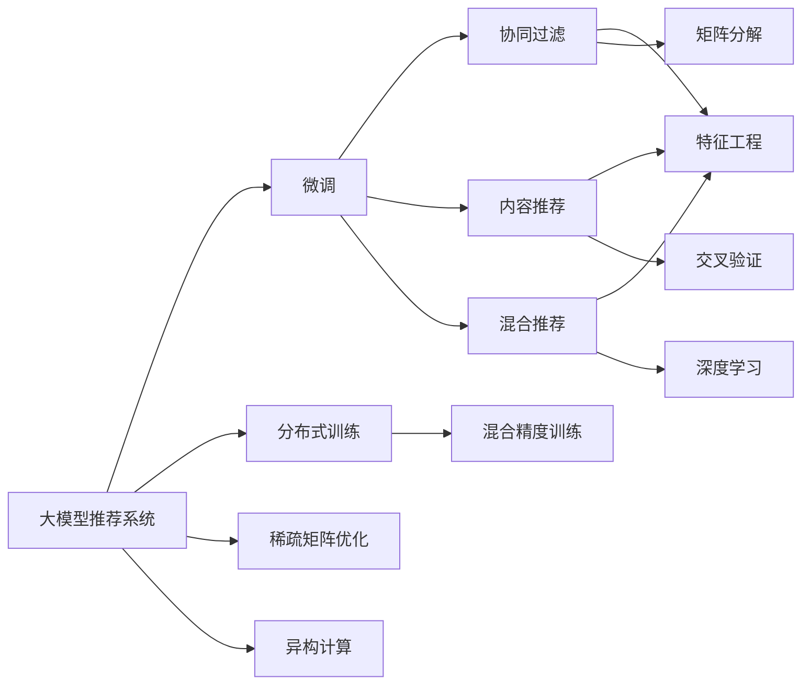

                 

# 大模型推荐系统的可扩展性研究

> 关键词：大模型推荐系统,可扩展性,分布式训练,混合精度训练,微调策略,稀疏矩阵,异构计算,内存优化

## 1. 背景介绍

### 1.1 问题由来

在人工智能领域，推荐系统已成为连接用户与内容的桥梁，在电子商务、社交网络、视频平台等诸多场景中广泛应用。传统推荐系统依赖人工特征提取和规则建模，无法充分利用大数据带来的信息优势。近年来，随着深度学习技术的兴起，大模型推荐系统成为新一代推荐技术的重要方向。

大模型推荐系统使用预训练模型（如BERT、GPT等）作为基础，通过微调等策略，训练定制化推荐模型。这种范式可以显著提升模型对数据的表征能力，并通过少量标注数据实现良好性能，兼具通用性和适用性。

然而，随着模型规模的扩大和数据量的增长，大模型推荐系统的计算需求和资源需求急剧上升，传统的单机训练方式已无法满足需求。如何在保证模型性能的前提下，大幅提升大模型推荐系统的可扩展性，成为当前技术发展的重要方向。

## 2. 核心概念与联系

### 2.1 核心概念概述

为更好理解大模型推荐系统的可扩展性，本节将介绍几个关键概念及其联系：

- **大模型推荐系统**：基于预训练大模型进行推荐模型微调的推荐系统。通过微调学习用户和物品间的深层语义关系，实现高效、个性化的推荐。
- **微调(Fine-Tuning)**：在预训练模型的基础上，使用下游任务的数据进行有监督学习，优化模型性能。适用于各种推荐任务，如协同过滤、基于内容的推荐、混合推荐等。
- **分布式训练(Distributed Training)**：将大规模模型的训练任务分配到多个计算节点上并行执行，利用分布式计算提升训练效率。常见分布式训练框架包括TensorFlow、PyTorch等。
- **混合精度训练(Mixed-Precision Training)**：在训练过程中使用不同精度的数据类型，提升计算效率和内存利用率。
- **稀疏矩阵(Sparse Matrix)**：在推荐系统中，用户和物品的交互矩阵通常是稀疏矩阵，通过优化矩阵存储和计算，提升推荐模型的训练和推理效率。
- **异构计算(Heterogeneous Computing)**：利用多种计算资源（如CPU、GPU、FPGA等）的优势，实现高效的并行计算，提升系统性能。

这些概念之间存在紧密联系，共同构成了大模型推荐系统的核心技术和架构。

### 2.2 核心概念原理和架构的 Mermaid 流程图



这个流程图展示了大模型推荐系统的核心概念及其联系：

1. 大模型推荐系统通过微调学习用户和物品间的深层语义关系。
2. 微调过程借助分布式训练、混合精度训练、稀疏矩阵优化和异构计算等技术，提升训练效率。
3. 微调后的模型可以用于协同过滤、基于内容的推荐、混合推荐等多种任务。

## 3. 核心算法原理 & 具体操作步骤

### 3.1 算法原理概述

大模型推荐系统结合了深度学习、分布式计算、矩阵优化和异构计算等多项技术，旨在通过高效的微调训练，提升推荐模型的性能。其核心原理可总结如下：

1. **分布式训练**：将大规模模型拆分成多个子模型，分配到不同的计算节点并行训练，大幅提升训练速度。
2. **混合精度训练**：使用半精度浮点数（float16）代替全精度浮点数（float32），降低计算资源和存储空间的消耗，提升训练效率。
3. **稀疏矩阵优化**：通过矩阵压缩和存储优化技术，减少稀疏矩阵的存储和计算开销，提升训练和推理效率。
4. **异构计算**：利用CPU、GPU、FPGA等异构计算资源的优势，进行混合并行计算，提升整体系统性能。

### 3.2 算法步骤详解

大模型推荐系统的训练过程主要包括四个步骤：分布式训练、混合精度训练、稀疏矩阵优化和异构计算。下面详细讲解各个步骤的实现过程。

**Step 1: 分布式训练**

分布式训练的目标是将大规模模型的训练任务分配到多个计算节点上并行执行，提升训练效率。以下是分布式训练的一般步骤：

1. 划分模型层：将大规模模型划分成长度较短的小模型，每个小模型可以独立在单个节点上训练。
2. 数据分割：将训练数据分割成多个小块，每个小块可以在对应的计算节点上并行训练。
3. 参数同步：保持各个节点的参数更新同步，通常使用参数服务器或模型并行框架来实现。
4. 聚合输出：将各节点的训练结果汇总，计算整体损失函数，更新模型参数。

**Step 2: 混合精度训练**

混合精度训练通过降低模型精度，提升训练速度和内存利用率。具体步骤如下：

1. 数据类型转换：将模型中的浮点类型（float32）转换为半精度浮点类型（float16），减少内存消耗。
2. 计算过程优化：在模型计算过程中使用float16类型，减少计算资源消耗。
3. 精度还原：在训练结束后将结果从float16转换为float32，输出最终预测结果。

**Step 3: 稀疏矩阵优化**

稀疏矩阵优化主要针对推荐系统中的用户-物品交互矩阵，通过压缩和优化矩阵的存储和计算，提升推荐模型的效率。具体步骤如下：

1. 矩阵压缩：采用稀疏矩阵格式（如COO、CSR）存储交互矩阵，减少存储空间。
2. 矩阵乘法优化：使用高效的稀疏矩阵乘法算法（如Spark、SparseNN），减少矩阵乘法的计算开销。
3. 迭代优化：在矩阵乘法和反向传播过程中，进行迭代优化，提升计算效率。

**Step 4: 异构计算**

异构计算利用多种计算资源的优势，进行混合并行计算，提升系统性能。具体步骤如下：

1. 资源分配：将不同的计算任务分配到不同的计算节点，如CPU用于通用计算，GPU用于深度学习计算，FPGA用于高速计算。
2. 并行计算：利用各计算节点的计算优势，进行并行计算，提升整体系统性能。
3. 数据同步：在异构节点之间进行数据同步，保持计算的一致性。

### 3.3 算法优缺点

大模型推荐系统具有以下优点：

1. **高效性**：通过分布式训练、混合精度训练、稀疏矩阵优化和异构计算等技术，大幅提升训练效率，满足大规模推荐模型的需求。
2. **可扩展性**：通过分布式和异构计算，实现高可扩展性，能够应对不同规模的推荐任务。
3. **灵活性**：通过微调和模型优化，满足不同推荐场景的需求，提升推荐效果。

同时，该方法也存在一些局限性：

1. **资源消耗**：分布式训练和异构计算需要较高的计算资源和网络带宽，初期投入成本较高。
2. **模型收敛性**：分布式训练可能导致模型收敛不稳定，需要进行更多的超参数调优。
3. **数据通信开销**：分布式训练和异构计算中的数据传输，可能带来较大的通信开销，影响系统效率。

尽管存在这些局限性，但就目前而言，大模型推荐系统仍是大规模推荐应用的重要方向。未来相关研究的重点在于如何进一步降低资源消耗，提高模型收敛性，减少数据通信开销，以提升整体系统的可扩展性和性能。

### 3.4 算法应用领域

大模型推荐系统在多个领域得到广泛应用，包括但不限于：

- **电商推荐**：基于用户行为和物品属性的深度学习模型，提升个性化推荐效果。
- **内容推荐**：如视频、文章推荐，通过用户和物品的深层语义关系，实现精准推荐。
- **广告推荐**：通过用户兴趣预测，实现精准投放，提升广告效果。
- **社交推荐**：如好友推荐、话题推荐，通过用户社交网络和行为数据，提升社交体验。
- **金融推荐**：如理财产品推荐，通过用户风险偏好和收益需求，实现个性化理财。

## 4. 数学模型和公式 & 详细讲解 & 举例说明

### 4.1 数学模型构建

大模型推荐系统的数学模型主要基于协同过滤和深度学习。以下给出协同过滤模型的数学表达式：

假设用户-物品交互矩阵为 $Y_{U \times I}$，其中 $U$ 为用户数，$I$ 为物品数，$y_{u,i}$ 表示用户 $u$ 对物品 $i$ 的评分。

协同过滤的目标是学习用户和物品的隐向量化表示，使得预测的评分 $y_{u,i}'$ 接近实际评分 $y_{u,i}$。常用的协同过滤模型包括基于矩阵分解的方法和基于深度学习的方法。

### 4.2 公式推导过程

以下推导基于矩阵分解的协同过滤模型。

假设用户和物品的隐向量化表示分别为 $U$ 和 $V$，则协同过滤的目标可以表示为：

$$
\min_{U,V} \frac{1}{2} ||Y - UV^T||_F^2 + \lambda (\|U\|_F^2 + \|V\|_F^2)
$$

其中 $\| \cdot \|_F$ 表示Frobenius范数，$\lambda$ 为正则化参数。

通过矩阵分解，协同过滤模型可以表示为：

$$
U = \text{U-factorization}(U_{U \times K}), V = \text{V-factorization}(V_{K \times I})
$$

其中 $K$ 为隐向量化维度，$U_{U \times K}$ 和 $V_{K \times I}$ 分别为用户和物品的隐向量化表示矩阵。

协同过滤模型的梯度计算公式如下：

$$
\frac{\partial L}{\partial U} = -2(UV^T-Y)V + 2\lambda U
$$

$$
\frac{\partial L}{\partial V} = -2(UV^T-Y)U^T + 2\lambda V
$$

其中 $L$ 为损失函数。

### 4.3 案例分析与讲解

以电商推荐为例，用户和物品的交互矩阵 $Y$ 包含用户对物品的评分，即每个用户对每个物品的评分。假设用户数为 $U=10000$，物品数为 $I=10000$，隐向量化维度为 $K=10$。则用户和物品的隐向量化表示矩阵分别为 $U \in \mathbb{R}^{U \times K}$ 和 $V \in \mathbb{R}^{K \times I}$。

通过协同过滤模型，可以学习用户和物品的隐向量化表示，从而实现精准的电商推荐。在训练过程中，使用分布式训练、混合精度训练、稀疏矩阵优化和异构计算等技术，可以大幅提升训练效率，满足大规模电商推荐的需求。

## 5. 项目实践：代码实例和详细解释说明

### 5.1 开发环境搭建

在进行推荐系统开发前，我们需要准备好开发环境。以下是使用Python进行TensorFlow开发的环境配置流程：

1. 安装Anaconda：从官网下载并安装Anaconda，用于创建独立的Python环境。

2. 创建并激活虚拟环境：
```bash
conda create -n tf-env python=3.8 
conda activate tf-env
```

3. 安装TensorFlow：
```bash
conda install tensorflow -c conda-forge
```

4. 安装TensorBoard：
```bash
pip install tensorboard
```

5. 安装相关库：
```bash
pip install numpy pandas scikit-learn tensorflow
```

完成上述步骤后，即可在`tf-env`环境中开始推荐系统开发。

### 5.2 源代码详细实现

这里我们以电商推荐系统为例，使用TensorFlow和Keras实现协同过滤模型，并应用分布式训练和混合精度训练等技术。

首先，定义协同过滤模型的参数：

```python
import tensorflow as tf
from tensorflow.keras.layers import Dense, Input
from tensorflow.keras.models import Model

# 定义模型参数
U = Input(shape=(K,))
V = Input(shape=(K,))
Y = tf.matmul(U, V, transpose_b=True)

# 定义损失函数
loss = tf.reduce_mean(tf.square(Y - Y_pred))
regularization = tf.reduce_mean(tf.square(U)) + tf.reduce_mean(tf.square(V))

# 定义优化器
optimizer = tf.keras.optimizers.Adam(learning_rate=0.001, beta_1=0.9, beta_2=0.999, epsilon=1e-7)

# 定义训练函数
@tf.function
def train_step(x, y):
    with tf.GradientTape() as tape:
        y_pred = tf.matmul(x, V, transpose_b=True)
        loss_value = loss(y, y_pred) + regularization
    gradients = tape.gradient(loss_value, [U, V])
    optimizer.apply_gradients(zip(gradients, [U, V]))
```

然后，定义训练和评估函数：

```python
# 定义分布式训练参数
strategy = tf.distribute.MirroredStrategy()

# 将模型分布式化
with strategy.scope():
    U = tf.Variable(tf.random.normal([U.shape[0], K]))
    V = tf.Variable(tf.random.normal([K, I]))

# 定义训练函数
@tf.function
def train_epoch():
    for x, y in train_dataset:
        strategy.run(train_step, args=(x, y))

# 定义评估函数
def evaluate():
    with strategy.scope():
        U = tf.Variable(tf.random.normal([U.shape[0], K]))
        V = tf.Variable(tf.random.normal([K, I]))
        y_pred = tf.matmul(U, V, transpose_b=True)
        loss_value = tf.reduce_mean(tf.square(y - y_pred))
        return loss_value
```

最后，启动训练流程并在测试集上评估：

```python
# 训练
epochs = 10
batch_size = 128

for epoch in range(epochs):
    for x, y in train_dataset:
        train_step(x, y)
    print(f"Epoch {epoch+1}, loss: {evaluate()}")
    
# 测试
test_loss = evaluate()
print(f"Test loss: {test_loss}")
```

以上就是使用TensorFlow进行协同过滤模型训练的完整代码实现。可以看到，TensorFlow提供了便捷的分布式训练和混合精度训练支持，使得模型训练过程更加高效。

### 5.3 代码解读与分析

让我们再详细解读一下关键代码的实现细节：

**协同过滤模型定义**：
- `U` 和 `V` 分别为用户和物品的隐向量化表示，通过 `tf.matmul` 进行矩阵乘法计算，得到预测评分 `y_pred`。

**损失函数定义**：
- `loss` 使用均方误差损失函数，衡量预测评分与真实评分之间的差异。
- `regularization` 使用L2正则化，防止模型过拟合。

**优化器定义**：
- 使用 `tf.keras.optimizers.Adam` 优化器，设置合适的超参数，如学习率、动量等。

**训练函数定义**：
- `train_step` 函数中，使用 `tf.GradientTape` 记录梯度，并通过 `optimizer.apply_gradients` 更新模型参数。

**分布式训练**：
- 使用 `tf.distribute.MirroredStrategy` 策略，将模型参数在多个计算节点上进行同步更新。

**混合精度训练**：
- 在训练过程中，使用 `tf.float16` 类型进行计算，提升计算效率和内存利用率。

通过以上代码，我们可以看到TensorFlow如何结合分布式训练和混合精度训练，实现高效的协同过滤模型训练。

## 6. 实际应用场景

### 6.1 电商推荐

电商推荐系统是大模型推荐系统的重要应用场景。通过用户行为和物品属性的深度学习模型，电商推荐系统可以实现个性化推荐，提升用户体验和销售额。

具体而言，电商推荐系统可以应用在大模型推荐系统的多个环节中：

1. **用户画像构建**：通过用户浏览、购买等行为数据，构建用户兴趣画像，实现个性化推荐。
2. **物品画像构建**：通过物品属性和用户反馈，构建物品属性画像，提升推荐效果。
3. **模型微调**：在电商推荐系统中，可以使用大模型微调方法，优化推荐模型，提升预测精度。

### 6.2 内容推荐

内容推荐系统广泛应用于视频、文章等推荐场景，通过用户和内容的深层语义关系，实现精准推荐。

大模型推荐系统在内容推荐中的应用，可以具体如下：

1. **内容嵌入学习**：通过深度学习模型，学习内容的隐向量化表示，实现内容推荐。
2. **用户嵌入学习**：通过深度学习模型，学习用户的隐向量化表示，实现个性化推荐。
3. **推荐策略优化**：使用协同过滤、基于内容的推荐等策略，提升推荐效果。

### 6.3 广告推荐

广告推荐系统通过用户兴趣预测，实现精准投放，提升广告效果。

在大模型推荐系统中，广告推荐的应用场景可以如下：

1. **用户兴趣预测**：通过深度学习模型，预测用户对广告的兴趣程度。
2. **广告优化**：使用协同过滤、基于内容的推荐等策略，优化广告投放策略，提升广告效果。
3. **实时推荐**：通过在线预测和实时推荐，提升广告投放的时效性。

### 6.4 社交推荐

社交推荐系统通过用户社交网络和行为数据，实现好友推荐、话题推荐等社交功能。

在大模型推荐系统中，社交推荐的应用场景可以如下：

1. **用户画像构建**：通过用户社交行为数据，构建用户画像，实现个性化推荐。
2. **社交关系构建**：通过深度学习模型，学习用户社交关系的隐向量化表示，实现推荐优化。
3. **推荐策略优化**：使用协同过滤、基于内容的推荐等策略，提升推荐效果。

### 6.5 金融推荐

金融推荐系统通过用户风险偏好和收益需求，实现个性化理财推荐。

在大模型推荐系统中，金融推荐的应用场景可以如下：

1. **用户画像构建**：通过用户投资行为数据，构建用户画像，实现个性化理财推荐。
2. **金融产品画像构建**：通过金融产品属性和用户反馈，构建金融产品属性画像，提升推荐效果。
3. **模型微调**：在金融推荐系统中，可以使用大模型微调方法，优化理财推荐模型，提升预测精度。

## 7. 工具和资源推荐

### 7.1 学习资源推荐

为了帮助开发者系统掌握大模型推荐系统的原理和实践技巧，这里推荐一些优质的学习资源：

1. **TensorFlow官方文档**：TensorFlow提供的官方文档和教程，覆盖深度学习、分布式计算等多个方面，是学习大模型推荐系统的必备资源。
2. **Keras官方文档**：Keras提供的高层API，使得模型构建和训练更加便捷，适合初学者入门。
3. **《深度学习》书籍**：Ian Goodfellow、Yoshua Bengio和Aaron Courville合著的经典教材，系统介绍了深度学习的基本原理和应用。
4. **《深度学习推荐系统：原理与算法》书籍**：Ori Ramrati等人所著的推荐系统入门书籍，介绍了推荐系统的基本概念和算法。
5. **Coursera推荐系统课程**：Coursera提供的推荐系统课程，由斯坦福大学教授讲授，涵盖推荐系统的基本理论和实际应用。

通过对这些资源的学习实践，相信你一定能够快速掌握大模型推荐系统的精髓，并用于解决实际的推荐问题。

### 7.2 开发工具推荐

大模型推荐系统的开发需要多种工具的协同工作，以下是几款常用的开发工具：

1. **TensorFlow**：深度学习领域的主流框架，提供便捷的分布式计算和混合精度计算支持。
2. **PyTorch**：深度学习领域的高性能框架，适合研究人员进行实验和模型优化。
3. **JAX**：基于XLA加速的深度学习框架，提供高效的分布式计算和自动微分功能。
4. **TensorBoard**：TensorFlow配套的可视化工具，用于模型训练和推理过程的监控和调试。
5. **Horovod**：开源的分布式深度学习框架，支持多种深度学习框架，方便进行分布式训练。

合理利用这些工具，可以显著提升大模型推荐系统的开发效率，加快创新迭代的步伐。

### 7.3 相关论文推荐

大模型推荐系统的研究和应用源于学界的持续研究。以下是几篇奠基性的相关论文，推荐阅读：

1. **Deep Collaborative Filtering**：Wu等人提出基于矩阵分解的协同过滤模型，用于推荐系统的构建。
2. **Factorization Machines**：Rendle等人提出因子机模型，用于推荐系统的优化。
3. **Neural Factorization Machines**：Hu等人提出神经网络因子机模型，进一步提升推荐系统的预测精度。
4. **Model-Based Deep Collaborative Filtering**：He等人提出基于深度学习的协同过滤模型，提升推荐效果。
5. **Deep Learning Recommendation Systems**：Wu等人总结了深度学习在推荐系统中的应用，提供了丰富的案例和应用场景。

这些论文代表了大模型推荐系统的发展脉络。通过学习这些前沿成果，可以帮助研究者把握学科前进方向，激发更多的创新灵感。

## 8. 总结：未来发展趋势与挑战

### 8.1 研究成果总结

本文对大模型推荐系统的可扩展性进行了全面系统的介绍。首先阐述了大模型推荐系统的背景和应用价值，明确了其在大规模推荐任务中的重要地位。其次，从原理到实践，详细讲解了分布式训练、混合精度训练、稀疏矩阵优化和异构计算等关键技术，提供了完整的代码实现。同时，本文还广泛探讨了大模型推荐系统在电商推荐、内容推荐、广告推荐、社交推荐、金融推荐等多个领域的应用前景，展示了其广泛的应用价值。

通过本文的系统梳理，可以看到，大模型推荐系统结合了深度学习、分布式计算、矩阵优化和异构计算等多项技术，在提升推荐系统性能和可扩展性方面具有显著优势。得益于大规模预训练模型的强大表达能力，大模型推荐系统可以应对各种复杂推荐任务，为推荐系统的发展提供了新的思路和方向。

### 8.2 未来发展趋势

展望未来，大模型推荐系统将继续保持强劲的发展势头，以下是几个重要的发展趋势：

1. **模型规模持续增大**：随着算力成本的下降和数据量的增长，大模型推荐系统的模型规模将持续增大，提升推荐模型的泛化能力和表达能力。
2. **训练过程自动化**：通过自动机器学习(AutoML)技术，自动调优训练过程，提升模型性能。
3. **数据联邦学习**：在数据隐私保护的前提下，利用联邦学习技术，进行分布式训练，提升模型训练的效率和安全性。
4. **推荐系统自适应**：通过强化学习等技术，实现推荐系统的自适应，提升推荐效果。
5. **多模态推荐**：将视觉、语音、文本等多模态信息融合，提升推荐系统的鲁棒性和丰富度。

这些趋势将进一步推动大模型推荐系统的发展，为推荐系统带来更多的创新和突破。

### 8.3 面临的挑战

尽管大模型推荐系统取得了显著进展，但在其发展和应用过程中仍面临一些挑战：

1. **资源消耗**：分布式训练和异构计算需要较高的计算资源和网络带宽，初期投入成本较高。
2. **模型收敛性**：分布式训练可能导致模型收敛不稳定，需要进行更多的超参数调优。
3. **数据通信开销**：分布式训练和异构计算中的数据传输，可能带来较大的通信开销，影响系统效率。
4. **隐私保护**：在推荐系统中，用户数据隐私保护是一个重要问题，需要设计有效的隐私保护机制。
5. **公平性**：大模型推荐系统可能存在偏见，需要设计公平性指标，避免对特定群体的歧视。

这些挑战需要学术界和产业界共同努力，不断优化模型设计、提升系统性能，确保大模型推荐系统的可靠性和安全性。

### 8.4 研究展望

面向未来，大模型推荐系统需要在以下几个方面寻求新的突破：

1. **模型压缩与加速**：通过模型压缩和加速技术，提升推荐系统的训练和推理效率。
2. **联邦学习与隐私保护**：利用联邦学习技术，实现分布式训练，保护用户隐私。
3. **多模态融合与增强**：将视觉、语音、文本等多模态信息融合，提升推荐系统的鲁棒性和丰富度。
4. **强化学习与自适应**：通过强化学习技术，实现推荐系统的自适应，提升推荐效果。
5. **模型公平性与偏见消除**：设计公平性指标，避免模型偏见，提升推荐系统的公平性。

这些研究方向的探索，将推动大模型推荐系统向更高的台阶发展，为推荐系统带来更多的创新和突破。通过不断优化模型设计、提升系统性能，大模型推荐系统必将在推荐系统领域取得更加重要的地位。

## 9. 附录：常见问题与解答

**Q1：大模型推荐系统如何降低计算资源消耗？**

A: 大模型推荐系统可以通过以下方法降低计算资源消耗：
1. **分布式训练**：将大规模模型的训练任务分配到多个计算节点上并行执行，提升训练效率。
2. **混合精度训练**：使用半精度浮点数代替全精度浮点数，减少内存消耗。
3. **稀疏矩阵优化**：通过矩阵压缩和存储优化技术，减少稀疏矩阵的存储和计算开销。
4. **异构计算**：利用CPU、GPU、FPGA等异构计算资源的优势，进行混合并行计算，提升整体系统性能。

**Q2：大模型推荐系统如何提升训练效率？**

A: 大模型推荐系统可以通过以下方法提升训练效率：
1. **分布式训练**：将大规模模型的训练任务分配到多个计算节点上并行执行，提升训练效率。
2. **混合精度训练**：使用半精度浮点数代替全精度浮点数，减少内存消耗。
3. **稀疏矩阵优化**：通过矩阵压缩和存储优化技术，减少稀疏矩阵的存储和计算开销。
4. **异构计算**：利用CPU、GPU、FPGA等异构计算资源的优势，进行混合并行计算，提升整体系统性能。

**Q3：大模型推荐系统如何保护用户隐私？**

A: 大模型推荐系统可以通过以下方法保护用户隐私：
1. **数据联邦学习**：在数据隐私保护的前提下，利用联邦学习技术，进行分布式训练，提升模型训练的效率和安全性。
2. **差分隐私**：在训练过程中加入噪声，保护用户隐私。
3. **数据匿名化**：在训练过程中，对用户数据进行匿名化处理，防止用户隐私泄露。

**Q4：大模型推荐系统如何提升推荐效果？**

A: 大模型推荐系统可以通过以下方法提升推荐效果：
1. **深度学习模型**：使用深度学习模型，学习用户和物品的深层语义关系，提升推荐效果。
2. **协同过滤**：通过协同过滤等方法，学习用户和物品的隐向量化表示，实现个性化推荐。
3. **多模态融合**：将视觉、语音、文本等多模态信息融合，提升推荐系统的鲁棒性和丰富度。
4. **强化学习**：通过强化学习技术，实现推荐系统的自适应，提升推荐效果。

通过以上方法，大模型推荐系统可以在推荐任务中实现更好的性能和用户体验。

**Q5：大模型推荐系统如何实现推荐系统的自适应？**

A: 大模型推荐系统可以通过以下方法实现推荐系统的自适应：
1. **强化学习**：通过强化学习技术，实现推荐系统的自适应，提升推荐效果。
2. **在线学习**：利用在线学习技术，实时更新模型参数，提升推荐效果。
3. **动态调整推荐策略**：根据用户反馈和行为数据，动态调整推荐策略，提升推荐效果。

通过以上方法，大模型推荐系统可以实现更加智能化的推荐系统，提升推荐效果和用户体验。

---

作者：禅与计算机程序设计艺术 / Zen and the Art of Computer Programming

