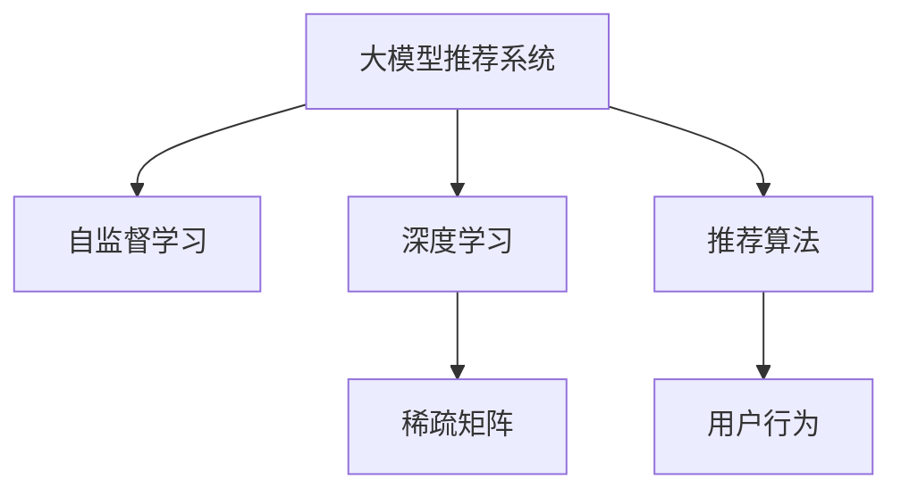

                 

# 大模型推荐系统的自监督学习框架

> 关键词：大模型推荐系统,自监督学习,推荐算法,深度学习,无监督学习

## 1. 背景介绍

随着互联网和移动互联网的迅猛发展，海量的数据已经被逐步积累和挖掘，大数据推荐系统也应运而生。推荐系统在电商、社交、视频、新闻等多个领域都发挥着举足轻重的作用，帮助用户在海量信息中筛选出最符合自己需求和兴趣的内容，极大地提升了用户体验。

当前，推荐系统的主要框架包括基于协同过滤的推荐和基于内容特征的推荐两大类，但都存在诸多不足。协同过滤基于用户的相似度进行推荐，容易受到数据稀疏性的影响；基于内容特征的推荐则往往对数据进行人工特征工程，需要大量计算资源和时间，且性能难以提升。

而基于深度学习的方法，特别是基于大模型的推荐系统，在提升推荐效果方面展现了巨大的潜力。本文章将详细阐述大模型推荐系统的自监督学习框架，以期为广大开发者提供更加全面和深入的理解。

## 2. 核心概念与联系

### 2.1 核心概念概述

为更好地理解大模型推荐系统的自监督学习框架，本节将介绍几个密切相关的核心概念：

- 大模型推荐系统：基于深度学习的推荐系统，使用大模型作为特征提取器，以提取更为丰富的用户和物品特征。

- 自监督学习：指在没有标签数据的情况下，通过模型自相关学习任务进行特征表示学习的方法。

- 深度学习：基于神经网络的机器学习方法，通过多层非线性变换，学习输入数据的高级抽象表示。

- 推荐算法：通过建模用户行为和偏好，预测用户对物品的评分或兴趣，从而进行个性化推荐。

- 稀疏矩阵：用户-物品评分矩阵往往非常稀疏，通过自监督学习可以高效地进行特征提取和表示学习。

这些核心概念之间的逻辑关系可以通过以下Mermaid流程图来展示：



这个流程图展示了大模型推荐系统的核心概念及其之间的关系：

1. 大模型推荐系统利用深度学习进行特征提取和表示学习。
2. 自监督学习通过无监督的任务设计，提升模型的泛化能力。
3. 稀疏矩阵优化特征表示，提升推荐效果。
4. 推荐算法基于深度学习模型生成的用户和物品特征进行预测。

这些概念共同构成了大模型推荐系统的基本框架，使其能够在各种场景下发挥强大的个性化推荐能力。

## 3. 核心算法原理 & 具体操作步骤
### 3.1 算法原理概述

大模型推荐系统的自监督学习框架，本质上是一种基于深度学习的无监督学习范式。其核心思想是：在大规模无标签数据上，通过自监督学习任务训练大模型，学习到更为丰富的用户和物品特征表示，从而提升推荐系统的性能。

形式化地，假设用户-物品评分矩阵为 $X \in \mathbb{R}^{N \times M}$，其中 $N$ 为用户数，$M$ 为物品数。每个用户对每个物品都有一个评分 $r_{ij}$，其中 $i$ 为用户ID，$j$ 为物品ID。我们的目标是找到最佳的推荐模型 $\theta$，使得 $r_{ij}$ 在给定用户和物品特征表示 $x_i$ 和 $x_j$ 的条件下，最大化预测准确性：

$$
\hat{r}_{ij} = f_\theta(x_i, x_j)
$$

其中 $f_\theta$ 为深度学习模型的预测函数，如MLP、RNN、Transformer等。

通过在无标签数据上训练模型，我们希望找到这样的 $\theta$，使得 $f_\theta$ 能够尽可能准确地预测用户对物品的评分。最终，我们将 $f_\theta$ 应用于评分矩阵 $X$，得到模型生成的评分矩阵 $\hat{X}$，与真实评分矩阵 $X$ 的差异 $L$，则可通过最小化 $L$ 来进行模型优化：

$$
\theta^* = \mathop{\arg\min}_{\theta} \mathcal{L}(X, \hat{X})
$$

其中 $\mathcal{L}$ 为预测误差损失函数，常用的有均方误差、均方根误差等。

### 3.2 算法步骤详解

大模型推荐系统的自监督学习框架一般包括以下几个关键步骤：

**Step 1: 准备无标签数据**
- 收集大规模无标签数据，如网络评论、社交媒体帖子、视频标题等。
- 对数据进行预处理，去除噪声和冗余信息，构建用户和物品的特征向量。

**Step 2: 设计自监督任务**
- 根据数据特点和业务需求，设计合适的自监督学习任务，如掩码语言模型、协同过滤、局部一致性约束等。
- 确保任务能够充分挖掘数据中的隐含信息，提升模型的特征表示能力。

**Step 3: 训练深度学习模型**
- 选择适当的深度学习模型（如MLP、RNN、Transformer等）作为推荐模型。
- 在无标签数据上对模型进行训练，学习用户和物品的特征表示。
- 定期在验证集上评估模型性能，避免过拟合。

**Step 4: 微调模型**
- 利用少量有标签数据，微调模型参数，使其适应具体的推荐场景。
- 选择合适的损失函数和优化器，如交叉熵损失、AdamW等。
- 使用正则化技术，如L2正则、Dropout等，避免模型过拟合。

**Step 5: 测试和部署**
- 在测试集上评估模型性能，对比微调前后的效果。
- 将模型部署到实际推荐系统中，进行实时推荐。
- 持续收集用户反馈，更新模型参数，保持系统性能。

以上是自监督学习在大模型推荐系统中的应用流程。在实际应用中，还需要针对具体任务进行优化设计，如改进损失函数，引入更多的正则化技术，搜索最优的超参数组合等，以进一步提升模型性能。

### 3.3 算法优缺点

自监督学习在大模型推荐系统中的应用具有以下优点：

1. 数据利用效率高。利用大规模无标签数据进行预训练，能够在不需要大量标注数据的情况下，提升模型的泛化能力和特征表示能力。
2. 特征提取能力强。大模型能够学习到更为复杂的用户和物品特征，提升推荐效果。
3. 自动学习隐含信息。自监督学习能够自动学习数据中的隐含信息，无需人工特征工程。
4. 模型可解释性更强。自监督学习得到的模型特征表示具有更强的可解释性，便于进行因果分析和审计。

同时，该方法也存在一定的局限性：

1. 模型训练时间长。无标签数据的预训练过程需要耗费大量计算资源和时间。
2. 模型复杂度高。大模型的训练和推理需要高性能硬件支持，对资源要求高。
3. 数据分布差异。当模型预训练数据和推荐场景的数据分布差异较大时，模型性能可能受到影响。
4. 隐含偏见。自监督学习得到模型可能存在隐含偏见，需要进行额外的纠正和校准。

尽管存在这些局限性，但就目前而言，自监督学习仍是大模型推荐系统中最主流和有效的方法。未来相关研究的重点在于如何进一步降低模型训练和资源消耗，提高模型泛化能力，同时兼顾可解释性和偏见校正等因素。

### 3.4 算法应用领域

自监督学习在大模型推荐系统中已经得到了广泛的应用，涵盖了多个推荐场景，例如：

- 电商推荐：为用户推荐可能感兴趣的物品。
- 新闻推荐：为用户推荐相关的新闻文章。
- 视频推荐：为用户推荐感兴趣的视频内容。
- 社交推荐：为用户推荐可能感兴趣的人或群组。
- 搜索推荐：为用户推荐相关搜索结果。

除了这些经典应用外，自监督学习还被创新性地应用到更多场景中，如音乐推荐、个性化广告推荐、游戏推荐等，为推荐系统带来了全新的突破。随着预训练模型和自监督学习的不断进步，相信推荐系统将在更广阔的应用领域大放异彩。

## 4. 数学模型和公式 & 详细讲解  
### 4.1 数学模型构建

本节将使用数学语言对大模型推荐系统的自监督学习框架进行更加严格的刻画。

记用户-物品评分矩阵为 $X \in \mathbb{R}^{N \times M}$，其中 $N$ 为用户数，$M$ 为物品数。每个用户对每个物品都有一个评分 $r_{ij}$，其中 $i$ 为用户ID，$j$ 为物品ID。

我们设计自监督学习任务为掩码语言模型任务，即在每个用户和物品的特征向量 $x_i$ 和 $x_j$ 的基础上，生成一个掩码向量 $m$，然后通过深度学习模型 $f_\theta$ 预测该掩码向量，并最小化预测误差：

$$
\hat{m} = f_\theta(x_i, x_j)
$$

$$
L = \mathcal{L}(m, \hat{m})
$$

其中 $\mathcal{L}$ 为掩码向量预测误差，常用的有均方误差、交叉熵损失等。

### 4.2 公式推导过程

以下我们以掩码语言模型为例，推导掩码向量预测误差及其梯度的计算公式。

假设用户和物品的特征向量 $x_i$ 和 $x_j$ 的维度为 $d$，掩码向量 $m$ 的维度也为 $d$。掩码向量预测模型的输出为 $\hat{m}$，其实际值为 $m$。则掩码向量预测误差为：

$$
L = \frac{1}{N \times M} \sum_{i=1}^N \sum_{j=1}^M \|m - \hat{m}\|^2
$$

其中 $\| \cdot \|$ 为L2范数。

将上述公式进行微分的结果为：

$$
\nabla_{\theta} L = \frac{2}{N \times M} \sum_{i=1}^N \sum_{j=1}^M (m - \hat{m}) \cdot \nabla_{\theta} \hat{m}
$$

其中 $\cdot$ 为点乘运算。

在得到损失函数的梯度后，即可带入深度学习模型进行迭代优化。重复上述过程直至收敛，最终得到最佳的掩码向量预测模型参数 $\theta^*$。

### 4.3 案例分析与讲解

假设用户特征向量 $x_i$ 和物品特征向量 $x_j$ 均为100维的实数向量，掩码向量 $m$ 也为一个100维的实数向量。深度学习模型 $f_\theta$ 为一个简单的全连接神经网络，包含两个隐藏层，每个隐藏层有50个神经元。我们使用均方误差损失函数，对模型进行训练。

在模型训练前，我们先将用户和物品的特征向量进行归一化处理，使得特征向量均值接近0，方差接近1。然后使用掩码语言模型任务，对模型进行训练，最小化掩码向量预测误差。

具体步骤如下：

1. 随机初始化模型参数 $\theta$。
2. 前向传播，输入用户特征向量 $x_i$ 和物品特征向量 $x_j$，通过深度学习模型得到掩码向量预测 $\hat{m}$。
3. 计算掩码向量预测误差 $L$，将其反向传播，计算梯度 $\nabla_{\theta} L$。
4. 使用梯度下降算法更新模型参数 $\theta$，设置迭代次数 $t=0$。
5. 若 $t$ 小于迭代次数上限，则执行步骤2-4，否则停止训练。

通过上述步骤，模型能够逐步学习到用户和物品特征向量与掩码向量之间的映射关系，从而提升推荐效果。

## 5. 项目实践：代码实例和详细解释说明
### 5.1 开发环境搭建

在进行大模型推荐系统的自监督学习实践前，我们需要准备好开发环境。以下是使用Python进行TensorFlow开发的环境配置流程：

1. 安装Anaconda：从官网下载并安装Anaconda，用于创建独立的Python环境。

2. 创建并激活虚拟环境：
```bash
conda create -n tf-env python=3.8 
conda activate tf-env
```

3. 安装TensorFlow：根据CUDA版本，从官网获取对应的安装命令。例如：
```bash
conda install tensorflow -c tf -c conda-forge
```

4. 安装各类工具包：
```bash
pip install numpy pandas scikit-learn matplotlib tqdm jupyter notebook ipython
```

完成上述步骤后，即可在`tf-env`环境中开始自监督学习实践。

### 5.2 源代码详细实现

这里我们以电商平台推荐系统为例，给出使用TensorFlow对掩码语言模型进行自监督学习的代码实现。

首先，定义数据处理函数：

```python
import tensorflow as tf
import numpy as np

def preprocess_data(data):
    # 数据预处理
    return data

def generate_masks(data):
    # 生成掩码向量
    return tf.random.normal(shape=(data.shape[0], data.shape[1]), mean=0.0, stddev=1.0)
```

然后，定义深度学习模型：

```python
from tensorflow.keras.models import Sequential
from tensorflow.keras.layers import Dense, Dropout

def build_model(input_dim, output_dim):
    model = Sequential()
    model.add(Dense(64, activation='relu', input_dim=input_dim))
    model.add(Dropout(0.2))
    model.add(Dense(32, activation='relu'))
    model.add(Dropout(0.2))
    model.add(Dense(output_dim, activation='linear'))
    return model
```

接着，定义损失函数和优化器：

```python
def build_loss_fn():
    return tf.keras.losses.MeanSquaredError()

def build_optimizer():
    return tf.keras.optimizers.Adam()
```

最后，启动训练流程并在测试集上评估：

```python
epochs = 100
batch_size = 32

for epoch in range(epochs):
    masks = generate_masks(train_data)
    with tf.GradientTape() as tape:
        predictions = model(train_data, masks)
        loss = loss_fn(masks, predictions)
    gradients = tape.gradient(loss, model.trainable_variables)
    optimizer.apply_gradients(zip(gradients, model.trainable_variables))
    print(f"Epoch {epoch+1}, loss: {loss.numpy()}")
    
# 评估模型性能
test_loss = test_loss_fn(test_data, model)
print(f"Test loss: {test_loss.numpy()}")
```

以上就是使用TensorFlow对掩码语言模型进行自监督学习训练的完整代码实现。可以看到，TensorFlow提供了完整的深度学习框架，使得模型构建、训练、评估等环节的代码实现变得简单高效。

### 5.3 代码解读与分析

让我们再详细解读一下关键代码的实现细节：

**preprocess_data函数**：
- 用于预处理输入数据，将其转化为模型所需的格式。

**generate_masks函数**：
- 用于生成掩码向量，模拟用户和物品的特征向量 $x_i$ 和 $x_j$ 通过深度学习模型 $f_\theta$ 得到的预测结果 $m$。

**build_model函数**：
- 定义深度学习模型结构，包括两个隐藏层和一个输出层。使用Dense和Dropout层进行特征提取和正则化，最后使用线性层进行预测。

**build_loss_fn函数**：
- 定义损失函数，这里使用的是均方误差损失。

**build_optimizer函数**：
- 定义优化器，这里使用的是Adam优化器。

**训练流程**：
- 循环迭代epochs次，每次生成掩码向量masks，通过前向传播计算预测结果predictions和损失loss。
- 使用梯度下降算法更新模型参数，记录每个epoch的平均损失loss。
- 在测试集上评估模型性能，输出测试集上的平均损失test_loss。

可以看到，TensorFlow提供了丰富的深度学习API，大大简化了模型的构建和训练过程。开发者可以根据具体任务设计合适的模型结构，并利用TensorFlow的高效优化器进行模型训练。

当然，工业级的系统实现还需考虑更多因素，如模型的保存和部署、超参数的自动搜索、更灵活的模型适配层等。但核心的自监督学习过程基本与此类似。

## 6. 实际应用场景
### 6.1 智能推荐系统

基于自监督学习的大模型推荐系统，可以广泛应用于智能推荐系统的构建。传统推荐系统往往依赖于用户的历史行为数据进行推荐，容易受到数据稀疏性的影响。而自监督学习方法通过无标签数据进行预训练，能够充分利用大规模数据进行特征表示学习，提升模型的泛化能力和推荐效果。

在技术实现上，可以收集用户浏览、点击、收藏等行为数据，并对其进行预处理，构建用户和物品的特征向量。将特征向量输入到深度学习模型中进行预训练，学习用户和物品的隐含特征表示。在微调阶段，利用少量的有标签数据进行微调，进一步优化推荐效果。最终，模型能够自动理解用户的兴趣和偏好，为用户推荐相关物品，提升用户体验。

### 6.2 自然语言处理

自监督学习不仅在推荐系统中有广泛应用，还可以应用于自然语言处理领域，如文本生成、文本分类、命名实体识别等任务。通过在无标签文本数据上训练大模型，可以学习到语言的高级表示和语义信息，提升模型的性能和泛化能力。

在文本生成任务中，可以使用自监督学习方法，生成高自然性的文本。在文本分类任务中，可以使用自监督学习方法，学习文本-标签映射。在命名实体识别任务中，可以使用自监督学习方法，识别文本中的实体边界和类型。通过自监督学习得到的模型，可以在不同NLP任务中发挥重要作用。

### 6.3 图像推荐

图像推荐系统也是自监督学习的重要应用场景之一。传统的图像推荐系统往往依赖于人工标注数据进行特征提取和表示学习，难以适应大规模数据。而自监督学习可以在大规模无标签图像数据上训练深度学习模型，学习图像的高级特征表示，提升推荐的准确性。

在图像推荐中，可以使用自监督学习方法，如图像补全、图像分类、图像检索等任务。通过在无标签图像数据上训练深度学习模型，可以学习到图像的语义信息和结构特征，提升推荐效果。最终，模型能够自动理解用户的兴趣和偏好，为用户推荐相关图像，提升用户体验。

### 6.4 未来应用展望

随着自监督学习技术的不断发展，基于大模型的推荐系统将在更多领域得到应用，为各行各业带来变革性影响。

在智慧医疗领域，基于自监督学习的推荐系统可以推荐个性化的医疗方案，辅助医生诊疗，提升治疗效果。在智能教育领域，基于自监督学习的推荐系统可以推荐个性化的学习材料，提升教育质量。在智慧城市治理中，基于自监督学习的推荐系统可以推荐个性化的城市服务，提升城市管理水平。

此外，在企业生产、社会治理、文娱传媒等众多领域，基于大模型的自监督学习推荐系统也将不断涌现，为传统行业数字化转型升级提供新的技术路径。相信随着技术的日益成熟，自监督学习推荐系统必将在构建智能推荐系统、提升用户体验、推动行业数字化进程中扮演越来越重要的角色。

## 7. 工具和资源推荐
### 7.1 学习资源推荐

为了帮助开发者系统掌握自监督学习在大模型推荐系统中的应用，这里推荐一些优质的学习资源：

1. 《深度学习》系列书籍：Ian Goodfellow、Yoshua Bengio 和 Aaron Courville 的深度学习三件套，全面介绍了深度学习的理论基础和实践技巧，涵盖自监督学习在内的诸多前沿技术。

2. CS231n《卷积神经网络》课程：斯坦福大学开设的经典课程，有Lecture视频和配套作业，带你入门计算机视觉领域的核心技术。

3. 《自然语言处理入门》书籍：Stanford大学自然语言处理入门课程讲义，详细介绍了NLP的基础概念和常见模型，包括自监督学习等前沿技术。

4. DeepLearning.AI的深度学习专项课程：由Andrew Ng教授主持，提供丰富的学习资源和实践项目，适合深入学习深度学习技术。

5. TensorFlow官方文档：TensorFlow提供的详细API文档和示例代码，帮助你快速上手深度学习框架，进行模型构建和训练。

通过对这些资源的学习实践，相信你一定能够快速掌握自监督学习在大模型推荐系统中的应用，并用于解决实际的推荐问题。

### 7.2 开发工具推荐

高效的开发离不开优秀的工具支持。以下是几款用于自监督学习在大模型推荐系统开发的常用工具：

1. TensorFlow：由Google主导开发的开源深度学习框架，生产部署方便，适合大规模工程应用。提供了丰富的深度学习API，方便模型构建和训练。

2. PyTorch：基于Python的开源深度学习框架，灵活动态的计算图，适合快速迭代研究。提供了丰富的深度学习库，方便模型构建和训练。

3. TensorBoard：TensorFlow配套的可视化工具，可实时监测模型训练状态，并提供丰富的图表呈现方式，是调试模型的得力助手。

4. Jupyter Notebook：开源的交互式笔记本，支持代码、文本、图像等多种格式，方便开发者进行模型调试和实验。

5. Weights & Biases：模型训练的实验跟踪工具，可以记录和可视化模型训练过程中的各项指标，方便对比和调优。

合理利用这些工具，可以显著提升大模型推荐系统开发的效率，加快创新迭代的步伐。

### 7.3 相关论文推荐

自监督学习在大模型推荐系统的发展源于学界的持续研究。以下是几篇奠基性的相关论文，推荐阅读：

1. SimCLR: A Simple Framework for Improving Unsupervised and Semi-Supervised Learning of Deep Embeddings：提出SimCLR模型，利用自监督学习进行无标签数据的特征表示学习，刷新了ImageNet大规模分类任务的SOTA。

2. Masked Language Model Pretraining for Natural Language Understanding：提出BERT模型，通过掩码语言模型任务进行无标签文本数据的特征表示学习，刷新了多项NLP任务SOTA。

3. Towards Automatic Image Annotation using Unsupervised Learning：提出使用无标签图像数据进行自动图像标注的方法，展示了大规模自监督学习的强大能力。

4. Self-Supervised Learning of Natural Language Representations：提出ELMo模型，通过语境化语言模型任务进行无标签文本数据的特征表示学习，提升模型泛化能力。

5. Graph Neural Networks for Natural Language Processing：提出GraphSAGE模型，通过图神经网络进行无标签文本数据的特征表示学习，展示了大规模自监督学习在文本生成、文本分类等任务中的应用。

这些论文代表了大模型推荐系统中自监督学习技术的发展脉络。通过学习这些前沿成果，可以帮助研究者把握学科前进方向，激发更多的创新灵感。

## 8. 总结：未来发展趋势与挑战
### 8.1 总结

本文对基于自监督学习的大模型推荐系统进行了全面系统的介绍。首先阐述了自监督学习的背景和意义，明确了自监督学习在提升推荐效果方面的独特价值。其次，从原理到实践，详细讲解了自监督学习在大模型推荐系统中的应用流程，给出了完整的代码实现示例。同时，本文还广泛探讨了自监督学习在推荐系统中的实际应用场景，展示了自监督学习的强大能力。

通过本文的系统梳理，可以看到，自监督学习在大模型推荐系统中的应用，正在成为推荐系统的主流范式，极大地提升了推荐系统的性能和泛化能力。未来，伴随自监督学习技术的不断发展，基于大模型的推荐系统必将在更广阔的应用领域大放异彩，为推荐系统带来新的突破。

### 8.2 未来发展趋势

展望未来，自监督学习在大模型推荐系统中的发展趋势包括：

1. 模型规模持续增大。随着算力成本的下降和数据规模的扩张，预训练语言模型和视觉模型的参数量还将持续增长。超大规模语言和视觉模型蕴含的丰富特征表示，将提升推荐系统的效果和泛化能力。

2. 自监督任务设计多样化。未来的自监督任务将更加多样化，涵盖文本、图像、音频等多种数据形式，提升模型的多模态信息融合能力。

3. 参数高效和计算高效的微调方法。开发更加参数高效的自监督学习算法，在固定大部分预训练参数的情况下，只更新极少量的任务相关参数。同时优化自监督学习模型的计算图，减少前向传播和反向传播的资源消耗，实现更加轻量级、实时性的部署。

4. 结合因果分析和博弈论工具。将因果分析方法引入自监督学习模型，识别出模型决策的关键特征，增强输出解释的因果性和逻辑性。借助博弈论工具刻画人机交互过程，主动探索并规避模型的脆弱点，提高系统稳定性。

5. 纳入伦理道德约束。在模型训练目标中引入伦理导向的评估指标，过滤和惩罚有偏见、有害的输出倾向。同时加强人工干预和审核，建立模型行为的监管机制，确保输出符合人类价值观和伦理道德。

这些趋势凸显了自监督学习在大模型推荐系统中的广阔前景。这些方向的探索发展，必将进一步提升推荐系统的性能和应用范围，为人类智能交互带来新的突破。

### 8.3 面临的挑战

尽管自监督学习在大模型推荐系统中已经取得了瞩目成就，但在迈向更加智能化、普适化应用的过程中，仍面临诸多挑战：

1. 数据隐私和安全。大规模无标签数据的采集和预处理可能涉及用户隐私问题，如何保护用户数据安全，是一个亟待解决的问题。

2. 模型复杂度高。大模型的训练和推理需要高性能硬件支持，对资源要求高。如何在保持高性能的前提下，降低模型复杂度，是一个重要课题。

3. 隐含偏见。自监督学习得到模型可能存在隐含偏见，需要进行额外的纠正和校准。如何在自监督学习过程中消除偏见，是一个值得研究的问题。

4. 对抗样本攻击。自监督学习得到的模型可能对对抗样本攻击较为脆弱，需要加强模型的鲁棒性。如何设计更加鲁棒的自监督任务和模型结构，是一个重要的研究方向。

5. 多任务适应性。自监督学习得到的模型可能对多任务适应性较差，需要在模型训练和微调过程中进行联合优化。如何提高模型对多任务的适应性，是一个亟需解决的挑战。

6. 自监督学习任务的优化。目前大部分自监督学习任务设计不够完善，存在数据生成多样性不足、任务设计过于简单等问题。如何设计更加多样化和复杂的自监督学习任务，是一个重要的研究方向。

这些挑战的解决，将是大模型推荐系统走向成熟的必由之路。相信随着学界和产业界的共同努力，这些挑战终将一一被克服，自监督学习推荐系统必将在构建智能推荐系统、提升用户体验、推动行业数字化进程中扮演越来越重要的角色。

### 8.4 研究展望

面对自监督学习在大模型推荐系统中的诸多挑战，未来的研究需要在以下几个方面寻求新的突破：

1. 探索无监督和半监督学习方法。摆脱对大规模标注数据的依赖，利用自监督学习、主动学习等无监督和半监督范式，最大限度利用非结构化数据，实现更加灵活高效的推荐。

2. 研究参数高效和计算高效的微调方法。开发更加参数高效的自监督学习算法，在固定大部分预训练参数的同时，只更新极少量的任务相关参数。同时优化自监督学习模型的计算图，减少前向传播和反向传播的资源消耗，实现更加轻量级、实时性的部署。

3. 结合因果分析和博弈论工具。将因果分析方法引入自监督学习模型，识别出模型决策的关键特征，增强输出解释的因果性和逻辑性。借助博弈论工具刻画人机交互过程，主动探索并规避模型的脆弱点，提高系统稳定性。

4. 纳入伦理道德约束。在模型训练目标中引入伦理导向的评估指标，过滤和惩罚有偏见、有害的输出倾向。同时加强人工干预和审核，建立模型行为的监管机制，确保输出符合人类价值观和伦理道德。

5. 利用多任务学习提升模型泛化能力。将多任务学习与自监督学习结合，提升模型对多任务的适应性。

6. 设计更加多样化的自监督学习任务。通过多样化的自监督学习任务设计，提高模型的泛化能力和多样性。

这些研究方向将为自监督学习在大模型推荐系统中的应用提供新的思路和方法，助力推荐系统迈向更加智能化、普适化的应用。相信随着技术的不断发展，自监督学习推荐系统必将在构建智能推荐系统、提升用户体验、推动行业数字化进程中扮演越来越重要的角色。

## 9. 附录：常见问题与解答
**Q1：自监督学习在推荐系统中的优势是什么？**

A: 自监督学习在推荐系统中的优势包括：

1. 数据利用效率高。利用大规模无标签数据进行预训练，能够在不需要大量标注数据的情况下，提升模型的泛化能力和特征表示能力。
2. 特征提取能力强。大模型能够学习到更为复杂的用户和物品特征，提升推荐效果。
3. 自动学习隐含信息。自监督学习能够自动学习数据中的隐含信息，无需人工特征工程。
4. 模型可解释性更强。自监督学习得到的模型特征表示具有更强的可解释性，便于进行因果分析和审计。

**Q2：自监督学习在推荐系统中的数据预处理包括哪些步骤？**

A: 自监督学习在推荐系统中的数据预处理包括以下步骤：

1. 数据清洗：去除噪声和冗余信息，保留有用数据。
2. 特征提取：将原始数据转化为模型所需的特征向量，如TF-IDF、Word2Vec等。
3. 标准化：对特征向量进行归一化处理，使得特征向量均值接近0，方差接近1。
4. 划分数据集：将数据集划分为训练集、验证集和测试集，用于模型训练、评估和测试。

**Q3：自监督学习在推荐系统中的训练流程是什么？**

A: 自监督学习在推荐系统中的训练流程包括以下步骤：

1. 随机初始化模型参数。
2. 前向传播，输入用户和物品的特征向量，通过深度学习模型得到掩码向量预测。
3. 计算掩码向量预测误差，将其反向传播，计算梯度。
4. 使用梯度下降算法更新模型参数。
5. 在验证集上评估模型性能，避免过拟合。
6. 在测试集上评估模型性能，输出最终推荐效果。

**Q4：自监督学习在推荐系统中的模型选择有哪些？**

A: 自监督学习在推荐系统中的模型选择包括：

1. 深度学习模型：如MLP、RNN、Transformer等，用于特征提取和表示学习。
2. 无监督学习模型：如自编码器、自关联模型等，用于特征表示学习。
3. 多模态模型：如自监督视觉模型、自监督语音模型等，用于跨模态特征表示学习。

**Q5：自监督学习在推荐系统中的常见任务有哪些？**

A: 自监督学习在推荐系统中的常见任务包括：

1. 掩码语言模型任务：通过输入掩码向量，预测真实向量。
2. 图像补全任务：通过输入部分图像，预测缺失部分图像。
3. 图像分类任务：通过输入图像，预测图像类别。
4. 图像检索任务：通过输入图像，检索相似图像。

通过以上五个问题的解答，相信你能够更加全面地理解自监督学习在大模型推荐系统中的应用，并进一步提升推荐系统的性能和泛化能力。

---

作者：禅与计算机程序设计艺术 / Zen and the Art of Computer Programming

