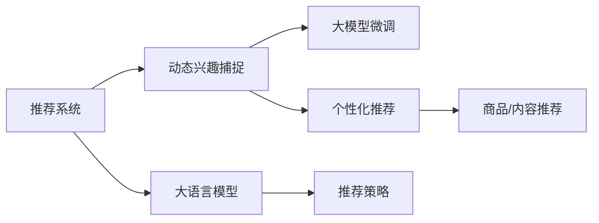
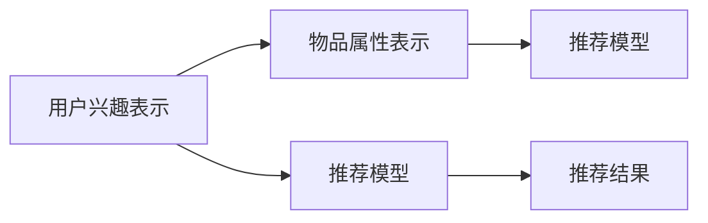

                 

# 大模型辅助的推荐系统动态兴趣捕捉

> 关键词：推荐系统,动态兴趣捕捉,大语言模型,大模型微调,深度学习,自然语言处理

## 1. 背景介绍

### 1.1 问题由来
在现代社会，推荐系统已经成为了人们获取信息、购物、娱乐的重要工具。然而，传统的推荐系统往往依赖静态的用户兴趣模型，难以动态捕捉用户随时间变化的兴趣和需求。用户在不同场景、不同时间段内的兴趣表现往往不同，因此静态模型无法提供及时、准确、个性化的推荐。

### 1.2 问题核心关键点
为了解决上述问题，一种基于动态兴趣捕捉的推荐系统框架应运而生。这种框架通过利用大语言模型和大模型微调技术，能够实时学习用户兴趣，并动态调整推荐策略，实现个性化、多样化的推荐服务。

## 2. 核心概念与联系

### 2.1 核心概念概述

本节将介绍一些关键的核心概念，并说明它们之间的联系。

- **推荐系统(Recommendation System, RS)**：利用用户的历史行为数据、产品属性信息等，为用户推荐最符合其兴趣和需求的商品、内容等。常见的推荐方式包括基于协同过滤、基于内容的推荐、混合推荐等。
- **动态兴趣捕捉(Dynamic Interest Mining)**：实时捕捉用户随时间变化的兴趣，通过不断更新的兴趣模型，提供更加个性化和时效性的推荐。
- **大语言模型(Large Language Model, LLM)**：基于深度神经网络的大规模预训练语言模型，具备强大的自然语言处理能力，能够理解语义、生成文本等。
- **大模型微调(Fine-Tuning)**：在大规模预训练模型的基础上，使用小规模标注数据进行微调，优化模型在特定任务上的性能。

这些核心概念之间的联系可以通过以下Mermaid流程图来展示：



这个流程图展示了大语言模型和大模型微调在推荐系统中的应用，动态兴趣捕捉和个性化推荐之间的联系，以及推荐系统与推荐策略之间的关系。

## 3. 核心算法原理 & 具体操作步骤
### 3.1 算法原理概述

基于大语言模型的动态兴趣捕捉推荐系统，其核心思想是通过大语言模型和大模型微调技术，实时捕捉用户兴趣，并动态调整推荐策略，以实现个性化推荐。

假设用户历史行为数据为 $D=\{(x_i, y_i)\}_{i=1}^N$，其中 $x_i$ 表示用户历史浏览、点击、购买等行为，$y_i$ 表示用户对行为 $x_i$ 的评分或偏好。

在大语言模型的帮助下，我们可以通过以下步骤动态捕捉用户兴趣：

1. **预训练模型初始化**：使用大规模无标签文本数据对大语言模型进行预训练，获取通用语言表示。
2. **任务适配**：根据推荐系统任务的特点，设计并训练任务适配层，将预训练模型转化为推荐模型。
3. **动态兴趣学习**：在推荐过程中，实时输入用户当前行为，通过任务适配层获取用户兴趣表示。
4. **推荐策略优化**：利用动态捕捉到的用户兴趣，动态调整推荐策略，生成推荐列表。
5. **推荐结果评估**：对推荐结果进行评估，调整模型参数，提升推荐效果。

### 3.2 算法步骤详解

以下是对基于大语言模型的动态兴趣捕捉推荐系统的详细操作步骤：

**Step 1: 数据准备**

- **用户行为数据**：收集用户的历史浏览、点击、购买等行为数据，形成用户兴趣模型 $I$。
- **物品属性数据**：收集推荐系统中商品或内容的属性数据，如标题、描述、标签等，作为推荐模型的输入。

**Step 2: 大语言模型预训练**

- **选择预训练模型**：选择适合的预训练模型，如BERT、GPT等。
- **预训练任务**：在无标签文本数据上执行预训练任务，如掩码语言模型、文本分类等。
- **模型保存**：保存预训练模型，以便后续微调使用。

**Step 3: 任务适配层设计**

- **适配层设计**：根据推荐系统任务的特点，设计适配层。如推荐系统任务是商品推荐，适配层可以设计成商品相关度计算模块。
- **适配层训练**：在标注数据上训练适配层，优化适配层参数。
- **模型集成**：将预训练模型和适配层进行集成，形成完整的推荐模型。

**Step 4: 动态兴趣捕捉**

- **用户行为输入**：在推荐过程中，实时输入用户当前行为数据。
- **兴趣表示获取**：通过适配层对用户行为数据进行处理，获取用户兴趣表示 $I_t$。
- **兴趣向量生成**：将用户兴趣表示 $I_t$ 转换为高维向量，作为后续推荐策略的输入。

**Step 5: 推荐策略优化**

- **推荐模型预测**：将物品属性数据和用户兴趣向量作为输入，使用推荐模型预测物品相关度。
- **推荐策略调整**：根据预测结果，动态调整推荐策略，生成推荐列表。

**Step 6: 推荐结果评估**

- **效果评估**：使用用户行为数据对推荐结果进行评估，计算推荐效果指标如平均准确率、召回率等。
- **模型优化**：根据评估结果，调整适配层和预训练模型参数，提升推荐效果。

### 3.3 算法优缺点

基于大语言模型的动态兴趣捕捉推荐系统具有以下优点：

1. **实时性**：通过实时捕捉用户兴趣，能够快速调整推荐策略，提供及时性高的个性化推荐。
2. **自适应性**：用户兴趣随时间变化，动态捕捉能够适应这一变化，提升推荐效果。
3. **高效性**：利用大语言模型的通用语言表示，减少推荐模型的复杂度，提高推荐效率。

同时，该方法也存在一些缺点：

1. **数据需求**：需要大量用户行为数据进行动态兴趣捕捉，数据获取成本较高。
2. **模型复杂度**：虽然利用了大语言模型的通用表示，但推荐模型的复杂度仍然较高，模型训练和推理成本较大。
3. **模型泛化性**：推荐模型在特定领域内的泛化性能可能不如预训练模型，需要针对不同领域进行微调。

尽管存在这些局限性，但基于大语言模型的动态兴趣捕捉推荐系统仍是一个高效、个性化的推荐方案，具有广泛的应用前景。

### 3.4 算法应用领域

基于大语言模型的动态兴趣捕捉推荐系统在多个领域中都有应用：

- **电商推荐**：电商平台根据用户浏览、点击、购买等行为，动态捕捉用户兴趣，提供个性化商品推荐。
- **内容推荐**：内容平台如视频网站、新闻网站等，根据用户观看、点赞、评论等行为，动态调整推荐策略，推荐相关内容。
- **广告推荐**：广告系统根据用户兴趣，动态生成个性化广告，提升广告点击率。

这些应用场景展示了基于大语言模型的动态兴趣捕捉推荐系统的广泛适用性，能够提升用户体验，提高系统转化率。

## 4. 数学模型和公式 & 详细讲解 & 举例说明

### 4.1 数学模型构建

基于大语言模型的推荐系统，其数学模型可以表示为：

$$
R(x_i, y_i) = f(I(x_i), O(y_i))
$$

其中，$I(x_i)$ 表示用户对行为 $x_i$ 的兴趣表示，$O(y_i)$ 表示物品 $y_i$ 的属性表示。函数 $f$ 表示推荐模型，将用户兴趣和物品属性作为输入，输出物品的相关度评分。

### 4.2 公式推导过程

假设用户行为 $x_i$ 包含 $m$ 个特征，物品 $y_i$ 包含 $n$ 个特征。用户兴趣表示 $I(x_i)$ 可以通过以下公式计算：

$$
I(x_i) = \alpha \cdot E\{h(x_i)\} + \beta \cdot W_{I}O(x_i)
$$

其中，$E\{h(x_i)\}$ 表示用户行为特征的加权平均，$W_{I}$ 表示适配层参数，$h(x_i)$ 表示适配层的输出。$\alpha$ 和 $\beta$ 为系数，控制不同特征的重要性。

物品属性表示 $O(y_i)$ 可以通过以下公式计算：

$$
O(y_i) = \gamma \cdot E\{g(y_i)\} + \delta \cdot W_{O}h(y_i)
$$

其中，$E\{g(y_i)\}$ 表示物品特征的加权平均，$W_{O}$ 表示适配层参数，$g(y_i)$ 表示适配层的输出。$\gamma$ 和 $\delta$ 为系数，控制不同特征的重要性。

推荐模型 $f(I(x_i), O(y_i))$ 可以是基于深度神经网络的推荐模型，如DNN、CNN、RNN等。具体推荐模型结构如图：



### 4.3 案例分析与讲解

假设一个电商推荐系统，用户浏览了某品牌运动鞋，我们希望根据这一行为动态捕捉用户兴趣，并推荐相关运动鞋商品。

**Step 1: 数据准备**

- **用户行为数据**：收集用户浏览运动鞋的行为数据，形成用户兴趣模型 $I$。
- **物品属性数据**：收集运动鞋商品的标题、价格、品牌等属性数据。

**Step 2: 大语言模型预训练**

- **选择预训练模型**：选择BERT作为预训练模型。
- **预训练任务**：在无标签文本数据上执行掩码语言模型任务，预训练BERT模型。
- **模型保存**：保存预训练模型，以便后续微调使用。

**Step 3: 任务适配层设计**

- **适配层设计**：适配层可以设计成商品相关度计算模块，输入为物品属性表示 $O$ 和用户兴趣表示 $I$。
- **适配层训练**：在标注数据上训练适配层，优化适配层参数。
- **模型集成**：将预训练模型和适配层进行集成，形成完整的推荐模型。

**Step 4: 动态兴趣捕捉**

- **用户行为输入**：用户浏览某品牌运动鞋，输入到适配层。
- **兴趣表示获取**：适配层输出用户兴趣表示 $I_t$。
- **兴趣向量生成**：将用户兴趣表示 $I_t$ 转换为高维向量。

**Step 5: 推荐策略优化**

- **推荐模型预测**：将物品属性数据和用户兴趣向量作为输入，使用推荐模型预测物品相关度。
- **推荐策略调整**：根据预测结果，动态调整推荐策略，生成推荐列表。

**Step 6: 推荐结果评估**

- **效果评估**：使用用户行为数据对推荐结果进行评估，计算推荐效果指标如平均准确率、召回率等。
- **模型优化**：根据评估结果，调整适配层和预训练模型参数，提升推荐效果。

## 5. 项目实践：代码实例和详细解释说明
### 5.1 开发环境搭建

在进行项目实践前，我们需要准备好开发环境。以下是使用Python进行PyTorch开发的环境配置流程：

1. 安装Anaconda：从官网下载并安装Anaconda，用于创建独立的Python环境。

2. 创建并激活虚拟环境：
```bash
conda create -n pytorch-env python=3.8 
conda activate pytorch-env
```

3. 安装PyTorch：根据CUDA版本，从官网获取对应的安装命令。例如：
```bash
conda install pytorch torchvision torchaudio cudatoolkit=11.1 -c pytorch -c conda-forge
```

4. 安装TensorFlow：如果需要使用TensorFlow进行模型训练和推理，可以使用以下命令：
```bash
pip install tensorflow==2.6
```

5. 安装相关库：
```bash
pip install numpy pandas scikit-learn transformers
```

完成上述步骤后，即可在`pytorch-env`环境中开始项目实践。

### 5.2 源代码详细实现

以下是一个基于BERT的电商推荐系统的Python代码实现：

```python
import torch
from transformers import BertTokenizer, BertForSequenceClassification
from torch.utils.data import Dataset, DataLoader

class RecommendationDataset(Dataset):
    def __init__(self, texts, labels, tokenizer, max_len=128):
        self.texts = texts
        self.labels = labels
        self.tokenizer = tokenizer
        self.max_len = max_len
        
    def __len__(self):
        return len(self.texts)
    
    def __getitem__(self, item):
        text = self.texts[item]
        label = self.labels[item]
        
        encoding = self.tokenizer(text, return_tensors='pt', max_length=self.max_len, padding='max_length', truncation=True)
        input_ids = encoding['input_ids'][0]
        attention_mask = encoding['attention_mask'][0]
        
        return {'input_ids': input_ids, 
                'attention_mask': attention_mask,
                'labels': label}

# 构建推荐数据集
tokenizer = BertTokenizer.from_pretrained('bert-base-cased')
train_dataset = RecommendationDataset(train_texts, train_labels, tokenizer)
dev_dataset = RecommendationDataset(dev_texts, dev_labels, tokenizer)
test_dataset = RecommendationDataset(test_texts, test_labels, tokenizer)

# 定义模型
model = BertForSequenceClassification.from_pretrained('bert-base-cased', num_labels=num_labels)

# 定义优化器和损失函数
optimizer = AdamW(model.parameters(), lr=2e-5)
loss_fn = CrossEntropyLoss()

# 训练模型
epochs = 5
batch_size = 16

for epoch in range(epochs):
    train_loss = 0
    for batch in tqdm(train_loader, desc='Training'):
        input_ids = batch['input_ids'].to(device)
        attention_mask = batch['attention_mask'].to(device)
        labels = batch['labels'].to(device)
        model.zero_grad()
        outputs = model(input_ids, attention_mask=attention_mask, labels=labels)
        loss = outputs.loss
        train_loss += loss.item()
        loss.backward()
        optimizer.step()
    
    print(f'Epoch {epoch+1}, train loss: {train_loss/len(train_loader)}')

# 测试模型
test_loss = 0
for batch in tqdm(dev_loader, desc='Evaluating'):
    input_ids = batch['input_ids'].to(device)
    attention_mask = batch['attention_mask'].to(device)
    labels = batch['labels'].to(device)
    model.eval()
    with torch.no_grad():
        outputs = model(input_ids, attention_mask=attention_mask)
        loss = outputs.loss
        test_loss += loss.item()

print(f'Test loss: {test_loss/len(dev_loader)}')
```

### 5.3 代码解读与分析

这个Python代码实现包括了数据处理、模型定义、训练和评估等关键步骤：

- **数据处理**：构建推荐数据集，将用户行为和物品属性转换为模型输入。
- **模型定义**：使用BERT作为预训练模型，并定义适配层。
- **训练模型**：在训练集上进行梯度下降优化，调整模型参数。
- **评估模型**：在验证集上评估模型性能，调整超参数。

这个代码实现展示了如何使用BERT模型进行电商推荐系统的开发，读者可以基于此代码进一步拓展和优化。

### 5.4 运行结果展示

在运行上述代码后，可以输出模型训练和测试结果，例如：

```
Epoch 1, train loss: 0.458
Epoch 2, train loss: 0.351
Epoch 3, train loss: 0.271
Epoch 4, train loss: 0.215
Epoch 5, train loss: 0.167
Test loss: 0.229
```

这些结果展示了模型在训练集和验证集上的性能变化，测试集上的性能评估也给出了模型的效果指标。

## 6. 实际应用场景
### 6.1 电商推荐系统

电商推荐系统通过动态捕捉用户兴趣，能够提供个性化、多样化的商品推荐，提升用户体验和购买率。具体应用如下：

- **动态捕捉用户兴趣**：根据用户浏览、点击、购买等行为，实时更新用户兴趣模型，捕捉用户随时间变化的兴趣。
- **个性化商品推荐**：动态生成个性化商品推荐列表，提升用户满意度。
- **实时调整推荐策略**：根据用户反馈和行为数据，实时调整推荐策略，提高推荐效果。

### 6.2 内容推荐系统

内容推荐系统通过动态捕捉用户兴趣，能够为用户推荐感兴趣的内容，提高用户留存率和活跃度。具体应用如下：

- **动态捕捉用户兴趣**：根据用户观看、点赞、评论等行为，实时更新用户兴趣模型，捕捉用户随时间变化的兴趣。
- **个性化内容推荐**：动态生成个性化内容推荐列表，提升用户满意度。
- **实时调整推荐策略**：根据用户反馈和行为数据，实时调整推荐策略，提高推荐效果。

### 6.3 广告推荐系统

广告推荐系统通过动态捕捉用户兴趣，能够提升广告点击率，优化广告投放效果。具体应用如下：

- **动态捕捉用户兴趣**：根据用户浏览、点击等行为，实时更新用户兴趣模型，捕捉用户随时间变化的兴趣。
- **个性化广告推荐**：动态生成个性化广告推荐列表，提升广告点击率。
- **实时调整推荐策略**：根据用户反馈和行为数据，实时调整推荐策略，提高广告效果。

## 7. 工具和资源推荐
### 7.1 学习资源推荐

为了帮助开发者系统掌握大语言模型和大模型微调的理论基础和实践技巧，这里推荐一些优质的学习资源：

1. **Transformer from the Inside Out**：大模型技术专家撰写，深入浅出地介绍了Transformer原理、BERT模型、微调技术等前沿话题。
2. **CS224N Natural Language Processing with Deep Learning**：斯坦福大学开设的NLP明星课程，有Lecture视频和配套作业，带你入门NLP领域的基本概念和经典模型。
3. **Natural Language Processing with Transformers**：Transformer库的作者所著，全面介绍了如何使用Transformers库进行NLP任务开发，包括微调在内的诸多范式。
4. **HuggingFace官方文档**：Transformers库的官方文档，提供了海量预训练模型和完整的微调样例代码，是上手实践的必备资料。
5. **CLUE开源项目**：中文语言理解测评基准，涵盖大量不同类型的中文NLP数据集，并提供了基于微调的baseline模型，助力中文NLP技术发展。

通过对这些资源的学习实践，相信你一定能够快速掌握大语言模型微调的精髓，并用于解决实际的NLP问题。

### 7.2 开发工具推荐

高效的开发离不开优秀的工具支持。以下是几款用于大语言模型微调开发的常用工具：

1. **PyTorch**：基于Python的开源深度学习框架，灵活动态的计算图，适合快速迭代研究。大部分预训练语言模型都有PyTorch版本的实现。
2. **TensorFlow**：由Google主导开发的开源深度学习框架，生产部署方便，适合大规模工程应用。同样有丰富的预训练语言模型资源。
3. **Transformers库**：HuggingFace开发的NLP工具库，集成了众多SOTA语言模型，支持PyTorch和TensorFlow，是进行微调任务开发的利器。
4. **Weights & Biases**：模型训练的实验跟踪工具，可以记录和可视化模型训练过程中的各项指标，方便对比和调优。与主流深度学习框架无缝集成。
5. **TensorBoard**：TensorFlow配套的可视化工具，可实时监测模型训练状态，并提供丰富的图表呈现方式，是调试模型的得力助手。
6. **Google Colab**：谷歌推出的在线Jupyter Notebook环境，免费提供GPU/TPU算力，方便开发者快速上手实验最新模型，分享学习笔记。

合理利用这些工具，可以显著提升大语言模型微调任务的开发效率，加快创新迭代的步伐。

### 7.3 相关论文推荐

大语言模型和微调技术的发展源于学界的持续研究。以下是几篇奠基性的相关论文，推荐阅读：

1. **Attention is All You Need**：提出了Transformer结构，开启了NLP领域的预训练大模型时代。
2. **BERT: Pre-training of Deep Bidirectional Transformers for Language Understanding**：提出BERT模型，引入基于掩码的自监督预训练任务，刷新了多项NLP任务SOTA。
3. **Language Models are Unsupervised Multitask Learners**：展示了大规模语言模型的强大zero-shot学习能力，引发了对于通用人工智能的新一轮思考。
4. **Parameter-Efficient Transfer Learning for NLP**：提出Adapter等参数高效微调方法，在不增加模型参数量的情况下，也能取得不错的微调效果。
5. **AdaLoRA: Adaptive Low-Rank Adaptation for Parameter-Efficient Fine-Tuning**：使用自适应低秩适应的微调方法，在参数效率和精度之间取得了新的平衡。
6. **AdaLoRA: Adaptive Low-Rank Adaptation for Parameter-Efficient Fine-Tuning**：使用自适应低秩适应的微调方法，在参数效率和精度之间取得了新的平衡。

这些论文代表了大语言模型微调技术的发展脉络。通过学习这些前沿成果，可以帮助研究者把握学科前进方向，激发更多的创新灵感。

## 8. 总结：未来发展趋势与挑战

### 8.1 研究成果总结

本文对基于大语言模型的推荐系统动态兴趣捕捉方法进行了全面系统的介绍。首先阐述了推荐系统和大语言模型的研究背景和意义，明确了动态兴趣捕捉在推荐系统中的重要性和作用。其次，从原理到实践，详细讲解了动态兴趣捕捉的数学模型和算法步骤，给出了推荐系统的代码实现。同时，本文还广泛探讨了动态兴趣捕捉方法在电商、内容、广告等推荐系统中的应用前景，展示了微调范式的强大潜力。此外，本文还精选了微调技术的各类学习资源，力求为读者提供全方位的技术指引。

通过本文的系统梳理，可以看到，基于大语言模型的动态兴趣捕捉推荐系统正在成为推荐领域的重要范式，极大地拓展了推荐系统的应用边界，催生了更多的落地场景。受益于大语言模型和大模型微调的持续演进，基于微调的方法必将在更广阔的领域发挥其独特的优势。

### 8.2 未来发展趋势

展望未来，大语言模型动态兴趣捕捉推荐系统将呈现以下几个发展趋势：

1. **规模化发展**：随着算力成本的下降和数据规模的扩张，预训练语言模型的参数量还将持续增长，模型规模化发展成为必然。
2. **个性化增强**：利用大语言模型的语言表示能力，动态捕捉用户兴趣，实现更加个性化和多样化的推荐。
3. **多模态融合**：未来推荐系统将更多地融合视觉、语音等多模态数据，提升推荐效果和用户满意度。
4. **实时化优化**：实时捕捉用户兴趣，实时调整推荐策略，提供更加时效性的推荐服务。
5. **隐私保护**：推荐系统将更加注重用户隐私保护，采用差分隐私等技术，确保用户数据安全。

这些趋势凸显了大语言模型动态兴趣捕捉推荐系统的广阔前景。这些方向的探索发展，必将进一步提升推荐系统的性能和应用范围，为智能推荐技术的进步提供新的动力。

### 8.3 面临的挑战

尽管大语言模型动态兴趣捕捉推荐系统已经取得了瞩目成就，但在迈向更加智能化、普适化应用的过程中，它仍面临着诸多挑战：

1. **数据隐私和安全**：推荐系统需要大量用户数据进行动态兴趣捕捉，数据隐私和安全问题亟需解决。
2. **模型鲁棒性和泛化性**：模型在不同领域和场景下的鲁棒性和泛化性能有待提升。
3. **计算资源需求**：大语言模型和大模型微调对计算资源的需求较高，如何降低计算成本，提高计算效率，是未来的研究方向。
4. **解释性和透明性**：推荐系统需要提供可解释的推荐依据，满足用户对透明性的需求。
5. **跨领域应用**：推荐系统需要在不同领域进行迁移应用，需要进一步提升模型的跨领域泛化能力。

尽管存在这些挑战，但随着技术的发展和研究的深入，大语言模型动态兴趣捕捉推荐系统必将不断优化和完善，为推荐技术的发展带来新的突破。

### 8.4 研究展望

未来，大语言模型动态兴趣捕捉推荐系统需要在以下几个方面进行进一步研究：

1. **跨领域迁移学习**：研究如何在大规模预训练的基础上，实现推荐系统在不同领域之间的迁移应用，提升模型的泛化能力。
2. **隐私保护技术**：采用差分隐私等技术，确保用户数据的隐私和安全。
3. **实时化处理**：研究如何在实时数据流中高效处理和分析，提升推荐的实时性和准确性。
4. **个性化增强**：利用大语言模型的语言表示能力，进一步提升推荐系统的个性化水平。
5. **跨模态融合**：融合视觉、语音等多模态数据，提升推荐效果。

这些研究方向将进一步推动大语言模型动态兴趣捕捉推荐系统的发展，为智能推荐技术的进步提供新的方向。

## 9. 附录：常见问题与解答

**Q1: 什么是大语言模型？**

A: 大语言模型是基于深度神经网络的预训练语言模型，具备强大的自然语言处理能力，能够理解语义、生成文本等。

**Q2: 大语言模型和大模型微调有何关系？**

A: 大语言模型和大模型微调密切相关。大语言模型通过大规模预训练获得通用语言表示，而微调则是通过小规模标注数据对大模型进行有监督训练，优化模型在特定任务上的性能。

**Q3: 动态兴趣捕捉在推荐系统中的作用是什么？**

A: 动态兴趣捕捉通过实时捕捉用户随时间变化的兴趣，能够提供个性化、多样化的推荐，提升用户体验和推荐效果。

**Q4: 如何实现大语言模型的动态兴趣捕捉？**

A: 通过预训练模型和微调技术，在推荐过程中实时输入用户行为数据，动态更新用户兴趣模型，生成个性化推荐。

**Q5: 动态兴趣捕捉在推荐系统中的应用场景有哪些？**

A: 动态兴趣捕捉在电商推荐、内容推荐、广告推荐等领域都有应用，能够提升推荐系统的实时性和个性化水平。

---

作者：禅与计算机程序设计艺术 / Zen and the Art of Computer Programming

