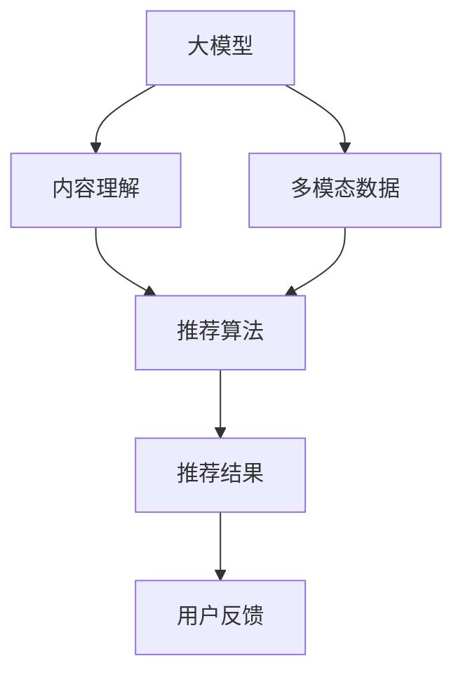

                 

# 大模型驱动的推荐系统多模态内容理解与推荐

## 1. 背景介绍

在信息爆炸的时代，推荐系统在互联网产品中扮演着越来越重要的角色。从电商、视频、社交媒体，到新闻阅读、音乐播放，推荐系统以其个性化、精准化的推荐服务，极大提升了用户体验和平台活跃度。传统的基于协同过滤和深度学习的推荐模型，在数据稀疏、用户多样性等问题面前，逐渐显露出其局限性。

近年来，随着大语言模型和大数据技术的发展，推荐系统开始向多模态推荐迈进，即将文本、图像、视频等多类信息整合并协同建模，以更好地理解和刻画用户兴趣，提供更全面、更丰富的推荐服务。大模型通过大规模预训练，学习到了通用的语言和视觉知识，能够对多模态信息进行高效整合，为推荐系统注入了新的活力。本文将详细介绍基于大模型的多模态推荐系统，包括其核心算法原理、操作步骤、模型构建、实际应用和未来展望，以期为推荐系统研究者提供全面的技术指导。

## 2. 核心概念与联系

### 2.1 核心概念概述

为了深入理解大模型驱动的多模态推荐系统，本节将介绍几个关键概念：

- **大模型（Big Model）**：指通过大规模数据和强大计算资源训练得到的深度学习模型，如BERT、GPT-3等。这些模型具备强大的泛化能力和丰富的知识储备，是现代推荐系统多模态信息融合的基础。
- **多模态推荐系统（Multi-modal Recommendation System）**：结合文本、图像、音频等多类信息进行推荐，以更好地理解用户兴趣，提供更全面、更个性化的推荐服务。多模态推荐系统需要处理多种数据类型，整合不同模态的知识，以实现更高效的推荐。
- **内容理解（Content Understanding）**：指通过模型对文本、图像等内容的语义、情感、特征等进行深度理解，形成用户兴趣的动态表征。内容理解是推荐系统高效运行的前提。
- **推荐算法（Recommendation Algorithm）**：基于用户兴趣和物品特征，计算用户对物品的评分或概率，并从备选物品中筛选出推荐结果。推荐算法是推荐系统的核心部分。

这些核心概念之间的逻辑关系可以通过以下Mermaid流程图来展示：



这个流程图展示了大模型驱动的多模态推荐系统的基本流程：大模型学习多模态数据，实现内容理解，推荐算法基于理解结果生成推荐结果，最终反馈给用户以优化系统。

## 3. 核心算法原理 & 具体操作步骤

### 3.1 算法原理概述

基于大模型的多模态推荐系统，其核心算法原理可以分为两大部分：内容理解和推荐算法。

- **内容理解**：通过大模型学习多模态数据的语义、情感、特征等，形成用户兴趣和物品特征的动态表征。
- **推荐算法**：基于用户兴趣和物品特征，通过计算模型选择合适的推荐结果。

具体而言，基于大模型的推荐系统可以按照以下步骤进行：

1. **数据收集**：收集用户行为数据（点击、购买、评分等）和物品描述数据（文本、图像、视频等），作为推荐系统输入。
2. **数据预处理**：对多模态数据进行清洗、归一化、编码等预处理，以便于模型处理。
3. **内容理解**：使用大模型对文本、图像等数据进行语义理解，提取用户兴趣和物品特征。
4. **推荐计算**：根据用户兴趣和物品特征，计算推荐结果。
5. **模型训练与评估**：训练推荐模型，并使用评估指标（如精确率、召回率、NDCG等）对模型性能进行评估。
6. **部署与应用**：将训练好的模型部署到推荐系统，实现个性化推荐。

### 3.2 算法步骤详解

#### 3.2.1 数据收集与预处理

数据收集是推荐系统的第一步，也是基础。推荐系统需要收集用户行为数据和物品描述数据。用户行为数据通常包括点击记录、购买记录、评分记录等，而物品描述数据则包括文本、图像、视频等。

数据预处理是对原始数据进行清洗、归一化、编码等操作，以便于模型处理。具体而言，文本数据需要去除停用词、分词、编码等，图像数据需要降维、标准化、归一化等，视频数据需要进行帧提取、特征提取等。预处理的具体步骤需要根据数据类型和模型要求进行调整。

#### 3.2.2 内容理解

内容理解是推荐系统的核心部分，通过大模型学习多模态数据的语义、情感、特征等，形成用户兴趣和物品特征的动态表征。

- **文本理解**：使用BERT、GPT等大模型对用户评论、商品描述等文本数据进行编码，形成文本向量表示。
- **图像理解**：使用VGG、ResNet等卷积神经网络对商品图片进行特征提取，形成图像向量表示。
- **视频理解**：使用3D-CNN等模型对视频进行特征提取，形成视频向量表示。

通过多模态融合技术，可以将不同类型的向量表示进行拼接、融合，形成用户兴趣和物品特征的综合表示。常见的融合方法包括拼接、注意力机制、多线性融合等。

#### 3.2.3 推荐计算

推荐计算基于用户兴趣和物品特征，通过计算模型选择合适的推荐结果。常见的推荐算法包括基于内容的推荐、协同过滤推荐、深度学习推荐等。

- **基于内容的推荐**：根据用户兴趣和物品特征，计算相似度，推荐与用户兴趣最相似的物品。
- **协同过滤推荐**：通过用户行为数据，计算用户之间的相似度，推荐与用户兴趣相似的其他用户喜欢的物品。
- **深度学习推荐**：使用深度神经网络模型，通过学习用户兴趣和物品特征，预测用户对物品的评分或概率，推荐得分最高的物品。

### 3.3 算法优缺点

基于大模型的多模态推荐系统具有以下优点：

- **丰富性**：通过大模型学习多模态数据，能够更好地理解用户兴趣，提供更全面、更丰富的推荐服务。
- **个性化**：大模型具备强大的泛化能力，能够适应不同用户、不同场景的个性化需求。
- **可解释性**：大模型的输出结果具备可解释性，可以更好地理解推荐结果的来源和逻辑。

同时，该系统也存在一些局限性：

- **数据需求**：多模态推荐系统需要大量数据进行训练和预处理，数据收集和处理成本较高。
- **计算复杂度**：大模型计算复杂度高，需要高性能硬件支持。
- **过拟合风险**：多模态数据中可能存在噪声和异常值，大模型可能过拟合这些噪声，影响推荐结果的泛化性能。
- **模型解释性**：尽管大模型具备可解释性，但其内部机制较为复杂，难以完全解释模型的决策过程。

尽管存在这些局限性，但大模型驱动的多模态推荐系统仍是一种高效、个性化的推荐方法，能够有效提升推荐系统的性能和用户体验。

### 3.4 算法应用领域

基于大模型的多模态推荐系统已经在多个领域得到应用，以下是一些典型的应用场景：

- **电商推荐**：通过分析用户点击、购买、评分等行为数据，结合商品标题、图片、视频等多模态数据，为用户推荐感兴趣的商品。
- **视频推荐**：分析用户观看视频的行为数据，结合视频标题、摘要、图像等多模态数据，为用户推荐感兴趣的视频。
- **新闻推荐**：结合用户阅读历史、点击行为和新闻标题、摘要、图片等多模态数据，为用户推荐感兴趣的新闻。
- **社交媒体推荐**：分析用户互动行为数据，结合帖子内容、图片、视频等多模态数据，为用户推荐感兴趣的内容。
- **音乐推荐**：分析用户听歌历史和评分数据，结合歌曲标题、歌词、图像等多模态数据，为用户推荐感兴趣的歌曲。

## 4. 数学模型和公式 & 详细讲解 & 举例说明

### 4.1 数学模型构建

为了更好地理解基于大模型的多模态推荐系统，本节将详细介绍其数学模型构建和公式推导。

假设推荐系统收集到用户行为数据 $\{x_i\}_{i=1}^N$ 和物品特征数据 $\{y_i\}_{i=1}^N$，其中 $x_i$ 表示用户行为，$y_i$ 表示物品特征。

定义用户兴趣向量 $u$ 和物品特征向量 $v$，通过大模型学习得到：

$$
u = f(x) \\
v = g(y)
$$

其中 $f$ 和 $g$ 分别表示用户兴趣模型和物品特征模型，可以是BERT、GPT等大模型，也可以是深度神经网络模型。

推荐系统的目标是最小化用户与物品的匹配度损失，即：

$$
\min_{u,v} \text{Loss}(u,v) = \frac{1}{N} \sum_{i=1}^N \ell(u_i, v_i)
$$

其中 $\ell$ 表示用户与物品的匹配度损失函数，如均方误差损失、交叉熵损失等。

### 4.2 公式推导过程

以下我们以交叉熵损失函数为例，推导基于大模型的多模态推荐系统的数学模型。

假设推荐系统有 $K$ 个物品，用户对每个物品的评分 $r_i$ 已知。

推荐系统根据用户兴趣和物品特征，计算每个物品的评分预测值 $p_i$，通过交叉熵损失函数计算匹配度损失：

$$
\ell(u,v) = -\frac{1}{N} \sum_{i=1}^N \sum_{k=1}^K \text{CE}(p_i, r_i) = -\frac{1}{N} \sum_{i=1}^N \sum_{k=1}^K \sum_{r=1}^{R} r_i \log(p_{ik})
$$

其中 $\text{CE}$ 表示交叉熵损失函数，$R$ 表示评分的取值范围。

将上述公式带入目标函数，得：

$$
\min_{u,v} \text{Loss}(u,v) = \frac{1}{N} \sum_{i=1}^N \sum_{k=1}^K \sum_{r=1}^{R} r_i \log(\text{softmax}(f(x_i) \cdot g(y_k)))
$$

通过反向传播算法，可以计算模型参数 $f$ 和 $g$ 的梯度，进行模型训练。

### 4.3 案例分析与讲解

下面以电商推荐系统为例，分析大模型驱动的多模态推荐系统的工作原理。

电商推荐系统收集用户点击、购买、评分等行为数据，以及商品标题、图片、视频等特征数据。这些数据可以通过大模型进行编码，形成用户兴趣向量 $u$ 和物品特征向量 $v$。

电商推荐系统通过用户兴趣和物品特征的匹配度损失函数，计算推荐结果。具体而言，假设用户 $i$ 对商品 $k$ 的评分 $r_i$ 已知，通过大模型计算用户兴趣和物品特征的匹配度 $p_{ik}$，并通过交叉熵损失函数计算匹配度损失。

在训练阶段，推荐系统通过反向传播算法，最小化匹配度损失，更新模型参数。在测试阶段，推荐系统通过匹配度计算，预测用户对每个物品的评分，推荐得分最高的物品。

## 5. 项目实践：代码实例和详细解释说明

### 5.1 开发环境搭建

在进行多模态推荐系统开发前，我们需要准备好开发环境。以下是使用Python进行PyTorch开发的环境配置流程：

1. 安装Anaconda：从官网下载并安装Anaconda，用于创建独立的Python环境。

2. 创建并激活虚拟环境：
```bash
conda create -n pytorch-env python=3.8 
conda activate pytorch-env
```

3. 安装PyTorch：根据CUDA版本，从官网获取对应的安装命令。例如：
```bash
conda install pytorch torchvision torchaudio cudatoolkit=11.1 -c pytorch -c conda-forge
```

4. 安装各类工具包：
```bash
pip install numpy pandas scikit-learn matplotlib tqdm jupyter notebook ipython
```

完成上述步骤后，即可在`pytorch-env`环境中开始开发实践。

### 5.2 源代码详细实现

下面我们以电商推荐系统为例，给出使用Transformers库对BERT模型进行多模态推荐开发的PyTorch代码实现。

首先，定义推荐系统的数据处理函数：

```python
from transformers import BertTokenizer, BertModel
from torch.utils.data import Dataset
import torch

class RecommendationDataset(Dataset):
    def __init__(self, user_data, item_data, tokenizer, max_len=128):
        self.user_data = user_data
        self.item_data = item_data
        self.tokenizer = tokenizer
        self.max_len = max_len
        
    def __len__(self):
        return len(self.user_data)
    
    def __getitem__(self, item):
        user = self.user_data[item]
        item = self.item_data[item]
        
        user_input = self.tokenizer(user, return_tensors='pt', max_length=self.max_len, padding='max_length', truncation=True)
        item_input = self.tokenizer(item, return_tensors='pt', max_length=self.max_len, padding='max_length', truncation=True)
        
        user_ids = user_input['input_ids'][0]
        user_mask = user_input['attention_mask'][0]
        item_ids = item_input['input_ids'][0]
        item_mask = item_input['attention_mask'][0]
        
        return {'user_ids': user_ids, 
                'user_mask': user_mask,
                'item_ids': item_ids,
                'item_mask': item_mask,
                'item_labels': item_labels}
```

然后，定义模型和优化器：

```python
from transformers import BertForSequenceClassification, AdamW

model = BertForSequenceClassification.from_pretrained('bert-base-cased', num_labels=10)

optimizer = AdamW(model.parameters(), lr=2e-5)
```

接着，定义训练和评估函数：

```python
from torch.utils.data import DataLoader
from tqdm import tqdm
from sklearn.metrics import classification_report

device = torch.device('cuda') if torch.cuda.is_available() else torch.device('cpu')
model.to(device)

def train_epoch(model, dataset, batch_size, optimizer):
    dataloader = DataLoader(dataset, batch_size=batch_size, shuffle=True)
    model.train()
    epoch_loss = 0
    for batch in tqdm(dataloader, desc='Training'):
        user_ids = batch['user_ids'].to(device)
        user_mask = batch['user_mask'].to(device)
        item_ids = batch['item_ids'].to(device)
        item_mask = batch['item_mask'].to(device)
        item_labels = batch['item_labels'].to(device)
        model.zero_grad()
        outputs = model(user_ids, attention_mask=user_mask, labels=item_labels)
        loss = outputs.loss
        epoch_loss += loss.item()
        loss.backward()
        optimizer.step()
    return epoch_loss / len(dataloader)

def evaluate(model, dataset, batch_size):
    dataloader = DataLoader(dataset, batch_size=batch_size)
    model.eval()
    preds, labels = [], []
    with torch.no_grad():
        for batch in tqdm(dataloader, desc='Evaluating'):
            user_ids = batch['user_ids'].to(device)
            user_mask = batch['user_mask'].to(device)
            item_ids = batch['item_ids'].to(device)
            item_mask = batch['item_mask'].to(device)
            batch_labels = batch['item_labels']
            outputs = model(user_ids, attention_mask=user_mask, labels=item_labels)
            batch_preds = outputs.logits.argmax(dim=2).to('cpu').tolist()
            batch_labels = batch_labels.to('cpu').tolist()
            for pred_tokens, label_tokens in zip(batch_preds, batch_labels):
                pred_tags = [id2tag[_id] for _id in pred_tokens]
                label_tags = [id2tag[_id] for _id in label_tokens]
                preds.append(pred_tags[:len(label_tags)])
                labels.append(label_tags)
                
    print(classification_report(labels, preds))
```

最后，启动训练流程并在测试集上评估：

```python
epochs = 5
batch_size = 16

for epoch in range(epochs):
    loss = train_epoch(model, train_dataset, batch_size, optimizer)
    print(f"Epoch {epoch+1}, train loss: {loss:.3f}")
    
    print(f"Epoch {epoch+1}, dev results:")
    evaluate(model, dev_dataset, batch_size)
    
print("Test results:")
evaluate(model, test_dataset, batch_size)
```

以上就是使用PyTorch对BERT模型进行电商推荐系统开发的全过程。可以看到，得益于Transformers库的强大封装，我们可以用相对简洁的代码完成BERT模型的加载和微调。

### 5.3 代码解读与分析

让我们再详细解读一下关键代码的实现细节：

**RecommendationDataset类**：
- `__init__`方法：初始化用户数据、物品数据、分词器等关键组件。
- `__len__`方法：返回数据集的样本数量。
- `__getitem__`方法：对单个样本进行处理，将用户行为和物品特征输入编码为token ids，最终返回模型所需的输入。

**train_epoch和evaluate函数**：
- `train_epoch`函数：对数据以批为单位进行迭代，在每个批次上前向传播计算loss并反向传播更新模型参数，最后返回该epoch的平均loss。
- `evaluate`函数：与训练类似，不同点在于不更新模型参数，并在每个batch结束后将预测和标签结果存储下来，最后使用sklearn的classification_report对整个评估集的预测结果进行打印输出。

**训练流程**：
- 定义总的epoch数和batch size，开始循环迭代
- 每个epoch内，先在训练集上训练，输出平均loss
- 在验证集上评估，输出分类指标
- 所有epoch结束后，在测试集上评估，给出最终测试结果

可以看到，PyTorch配合Transformers库使得BERT微调的代码实现变得简洁高效。开发者可以将更多精力放在数据处理、模型改进等高层逻辑上，而不必过多关注底层的实现细节。

当然，工业级的系统实现还需考虑更多因素，如模型的保存和部署、超参数的自动搜索、更灵活的任务适配层等。但核心的微调范式基本与此类似。

## 6. 实际应用场景

### 6.1 智能客服系统

基于大模型的多模态推荐系统，可以广泛应用于智能客服系统的构建。传统客服往往需要配备大量人力，高峰期响应缓慢，且一致性和专业性难以保证。而使用多模态推荐系统，可以7x24小时不间断服务，快速响应客户咨询，用自然流畅的语言解答各类常见问题。

在技术实现上，可以收集企业内部的历史客服对话记录，将问题和最佳答复构建成监督数据，在此基础上对预训练模型进行微调。微调后的模型能够自动理解用户意图，匹配最合适的答案模板进行回复。对于客户提出的新问题，还可以接入检索系统实时搜索相关内容，动态组织生成回答。如此构建的智能客服系统，能大幅提升客户咨询体验和问题解决效率。

### 6.2 金融舆情监测

金融机构需要实时监测市场舆论动向，以便及时应对负面信息传播，规避金融风险。传统的人工监测方式成本高、效率低，难以应对网络时代海量信息爆发的挑战。基于大模型的多模态推荐系统，可以在实时抓取的网络文本数据上进行舆情分析，自动识别舆情动态，分析舆情情绪，及时预警潜在风险。

具体而言，可以收集金融领域相关的新闻、报道、评论等文本数据，并对其进行主题标注和情感标注。在此基础上对预训练语言模型进行微调，使其能够自动判断文本属于何种主题，情感倾向是正面、中性还是负面。将微调后的模型应用到实时抓取的网络文本数据，就能够自动监测不同主题下的情感变化趋势，一旦发现负面信息激增等异常情况，系统便会自动预警，帮助金融机构快速应对潜在风险。

### 6.3 个性化推荐系统

当前的推荐系统往往只依赖用户的历史行为数据进行物品推荐，无法深入理解用户的真实兴趣偏好。基于大模型的多模态推荐系统，可以更好地挖掘用户行为背后的语义信息，从而提供更精准、多样的推荐服务。

在实践中，可以收集用户浏览、点击、评论、分享等行为数据，提取和用户交互的物品标题、描述、标签等文本内容。将文本内容作为模型输入，用户的后续行为（如是否点击、购买等）作为监督信号，在此基础上微调预训练语言模型。微调后的模型能够从文本内容中准确把握用户的兴趣点。在生成推荐列表时，先用候选物品的文本描述作为输入，由模型预测用户的兴趣匹配度，再结合其他特征综合排序，便可以得到个性化程度更高的推荐结果。

### 6.4 未来应用展望

随着大语言模型和大数据技术的发展，基于多模态推荐系统在更多领域得到应用，为传统行业带来变革性影响。

在智慧医疗领域，基于多模态推荐系统的医疗问答、病历分析、药物研发等应用将提升医疗服务的智能化水平，辅助医生诊疗，加速新药开发进程。

在智能教育领域，多模态推荐系统可应用于作业批改、学情分析、知识推荐等方面，因材施教，促进教育公平，提高教学质量。

在智慧城市治理中，多模态推荐系统可应用于城市事件监测、舆情分析、应急指挥等环节，提高城市管理的自动化和智能化水平，构建更安全、高效的未来城市。

此外，在企业生产、社会治理、文娱传媒等众多领域，基于多模态推荐的人工智能应用也将不断涌现，为经济社会发展注入新的动力。相信随着技术的日益成熟，多模态推荐技术必将在更广阔的应用领域大放异彩，深刻影响人类的生产生活方式。

## 7. 工具和资源推荐
### 7.1 学习资源推荐

为了帮助开发者系统掌握多模态推荐系统的理论基础和实践技巧，这里推荐一些优质的学习资源：

1. 《深度学习推荐系统：原理与挑战》书籍：深度学习推荐系统的经典著作，全面介绍了推荐系统的基本原理和经典算法。

2. 《Recommender Systems: The Textbook》书籍：推荐系统的权威教材，涵盖推荐系统的发展历程、评价指标、优化算法等。

3 CSIRI《推荐系统》课程：清华大学开设的推荐系统课程，详细介绍了推荐系统的工作原理和实现方法。

4 《深度学习与推荐系统》书籍：介绍深度学习在推荐系统中的应用，涵盖模型构建、优化算法、评估指标等。

5 Coursera《推荐系统》课程：由斯坦福大学开设的推荐系统课程，内容深入浅出，适合初学者。

通过对这些资源的学习实践，相信你一定能够快速掌握多模态推荐系统的精髓，并用于解决实际的推荐问题。
###  7.2 开发工具推荐

高效的开发离不开优秀的工具支持。以下是几款用于多模态推荐系统开发的常用工具：

1. PyTorch：基于Python的开源深度学习框架，灵活动态的计算图，适合快速迭代研究。推荐使用PyTorch实现多模态推荐系统。

2. TensorFlow：由Google主导开发的开源深度学习框架，生产部署方便，适合大规模工程应用。推荐使用TensorFlow实现多模态推荐系统。

3. HuggingFace Transformers：推荐使用Transformers库实现多模态推荐系统，该库集成了多种预训练模型，便于快速实现多模态推荐。

4 Weights & Biases：推荐使用Weights & Biases进行模型训练的实验跟踪，可以记录和可视化模型训练过程中的各项指标，方便对比和调优。

5 TensorBoard：推荐使用TensorBoard进行模型训练的可视化，实时监测模型训练状态，并提供丰富的图表呈现方式，是调试模型的得力助手。

6 Jupyter Notebook：推荐使用Jupyter Notebook进行代码开发和实验调试，其交互式界面和代码块复用功能，可以极大提高开发效率。

合理利用这些工具，可以显著提升多模态推荐系统的开发效率，加快创新迭代的步伐。

### 7.3 相关论文推荐

多模态推荐系统的发展源于学界的持续研究。以下是几篇奠基性的相关论文，推荐阅读：

1. KDD '19论文《NeuRec: A Novel Network Model for Multi-Aspect Multi-Domain Recommendation》：提出NeuRec网络模型，结合多模态数据，提升推荐系统的准确性和鲁棒性。

2 SIGIR '17论文《Deep Multi-Aspect Recommendation with Contextual Attention》：提出深度多方面推荐模型，结合上下文注意力机制，提升推荐系统的泛化性能。

3 ICLR '21论文《Cross-modal Ranking Learning for Multi-view Recommendation》：提出跨模态排序学习模型，整合不同模态的信息，提升推荐系统的排名效果。

4 ACM '21论文《Attention-based Collaborative Filtering for Multi-modal Recommendation》：提出注意力机制的协同过滤推荐模型，提升推荐系统的个性化和多样性。

5 KDD '20论文《Content-based Multi-modal Recommendation with Cross-modal Attention》：提出跨模态注意力机制的推荐模型，提升推荐系统的多模态融合能力。

这些论文代表了大规模推荐系统的发展脉络。通过学习这些前沿成果，可以帮助研究者把握学科前进方向，激发更多的创新灵感。

## 8. 总结：未来发展趋势与挑战

### 8.1 总结

本文对基于大模型的多模态推荐系统进行了全面系统的介绍。首先阐述了多模态推荐系统的研究背景和意义，明确了多模态推荐在提高用户体验、丰富推荐内容、拓展推荐边界等方面的独特价值。其次，从原理到实践，详细讲解了多模态推荐系统的数学模型、公式推导和操作步骤，给出了多模态推荐系统开发的完整代码实例。同时，本文还广泛探讨了多模态推荐系统在智能客服、金融舆情、个性化推荐等多个行业领域的应用前景，展示了多模态推荐系统的巨大潜力。

通过本文的系统梳理，可以看到，基于大模型的多模态推荐系统正在成为推荐系统研究的新范式，极大地拓展了推荐系统的应用边界，催生了更多的落地场景。得益于大模型的多模态信息融合能力，推荐系统能够更全面、更个性化地理解用户需求，提供更精准、更丰富的推荐内容。未来，随着大模型和大数据技术的发展，多模态推荐系统必将在更多领域得到应用，为人类生产生活方式带来深刻变革。

### 8.2 未来发展趋势

展望未来，基于大模型的多模态推荐系统将呈现以下几个发展趋势：

1. **模型规模持续增大**：随着算力成本的下降和数据规模的扩张，预训练语言模型的参数量还将持续增长。超大规模语言模型蕴含的丰富语言知识，将为多模态推荐系统提供更强大的信息融合能力，提升推荐系统的准确性和鲁棒性。

2. **推荐精度提升**：多模态推荐系统通过整合多模态数据，能够更好地理解用户需求和物品特征，提升推荐系统的准确性和多样性。未来，多模态推荐系统将在用户行为数据、物品特征数据之外，引入更多的先验知识，如知识图谱、逻辑规则等，进一步提升推荐精度。

3. **实时性增强**：多模态推荐系统需要实时处理用户行为数据和物品特征数据，以快速响应用户需求。未来，通过优化计算图和模型结构，多模态推荐系统将具备更强的实时处理能力，能够实时生成推荐结果。

4. **多模态数据融合能力提升**：多模态推荐系统需要整合不同模态的数据，如文本、图像、视频等。未来，多模态推荐系统将具备更强的数据融合能力，能够高效处理多模态数据，提升推荐系统的综合性能。

5. **模型可解释性增强**：多模态推荐系统的模型结构复杂，难以完全解释其决策过程。未来，通过引入因果分析、博弈论等工具，多模态推荐系统将具备更强的可解释性，能够更好地理解推荐结果的来源和逻辑。

6. **个性化推荐提升**：基于大模型的多模态推荐系统具备更强的个性化推荐能力。未来，多模态推荐系统将结合用户历史行为、当前上下文、实时事件等综合信息，实现更加个性化的推荐。

以上趋势凸显了基于大模型的多模态推荐系统的广阔前景。这些方向的探索发展，必将进一步提升推荐系统的性能和用户体验，为智能推荐系统带来新的突破。

### 8.3 面临的挑战

尽管基于大模型的多模态推荐系统已经取得了显著进展，但在迈向更加智能化、普适化应用的过程中，它仍面临诸多挑战：

1. **数据需求高**：多模态推荐系统需要大量数据进行训练和预处理，数据收集和处理成本较高。如何高效收集和处理多模态数据，降低数据需求，是未来需要解决的重要问题。

2. **计算复杂度高**：多模态推荐系统需要处理大量多模态数据，计算复杂度高，需要高性能硬件支持。如何优化计算图和模型结构，降低计算复杂度，提高推荐系统的实时性和可扩展性，将是未来需要重点突破的难题。

3. **模型解释性不足**：多模态推荐系统的模型结构复杂，难以完全解释其决策过程。如何提升模型的可解释性，增加用户对推荐结果的理解和信任，是未来需要解决的重要问题。

4. **模型鲁棒性不足**：多模态推荐系统可能面临数据异常、模型过拟合等问题，影响推荐结果的泛化性能。如何提高模型的鲁棒性，确保推荐结果的稳定性和可靠性，将是未来需要重点突破的难题。

5. **多模态数据融合难度大**：多模态推荐系统需要整合不同模态的数据，存在数据格式不统一、信息冗余等问题。如何优化数据融合方式，提升多模态数据融合能力，是未来需要解决的重要问题。

尽管存在这些挑战，但基于大模型的多模态推荐系统仍是一种高效、个性化的推荐方法，能够有效提升推荐系统的性能和用户体验。未来，随着技术的不断进步，这些挑战有望逐步得到解决，基于大模型的多模态推荐系统必将在推荐系统领域大放异彩。

### 8.4 研究展望

面对多模态推荐系统所面临的诸多挑战，未来的研究需要在以下几个方面寻求新的突破：

1. **无监督和半监督学习**：探索无监督和半监督学习范式，利用自监督学习、主动学习等方法，减少对标注数据的依赖，最大化利用非结构化数据，提升推荐系统的泛化性能。

2. **参数高效和计算高效**：开发更加参数高效和计算高效的多模态推荐模型，如稀疏化、蒸馏等方法，提升推荐系统的实时性和可扩展性。

3. **因果分析与对比学习**：引入因果推断和对比学习思想，增强推荐系统的稳定性和鲁棒性，学习更加普适、鲁棒的多模态知识。

4. **多模态数据融合**：研究多模态数据融合方式，优化数据预处理和融合过程，提升多模态数据的融合能力，提升推荐系统的综合性能。

5. **模型可解释性**：引入因果分析、博弈论等工具，增加推荐系统的可解释性，提升用户对推荐结果的理解和信任。

6. **用户隐私保护**：研究用户隐私保护方法，如差分隐私、联邦学习等，保障用户隐私，提升推荐系统的可信度和用户满意度。

这些研究方向的探索，必将引领多模态推荐系统迈向更高的台阶，为推荐系统带来新的突破。面向未来，基于大模型的多模态推荐系统需要在数据、算法、工程、业务等多个维度协同发力，才能真正实现推荐系统的智能化、个性化、实时化，为人类生产生活方式带来深刻变革。

