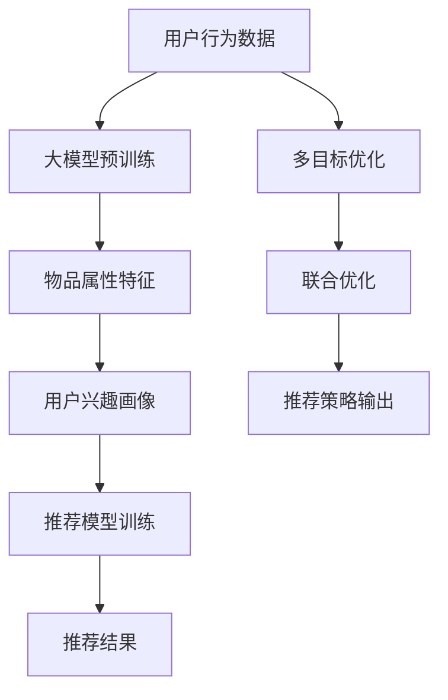

                 

# 大模型驱动的推荐系统多目标联合优化框架

## 1. 背景介绍

随着互联网时代数据的爆炸性增长，推荐系统成为了提升用户体验、驱动业务增长的关键技术。传统的推荐系统主要基于协同过滤、内容推荐等方法，通过用户历史行为数据和物品特征进行建模，为用户推荐与兴趣匹配的物品。然而，推荐系统的核心目标并非单一，而是包含多个维度，如提升用户满意度、增加交易转化率、减少广告投放成本等。因此，如何在多个目标之间进行联合优化，实现多目标推荐，成为了当前推荐系统领域的研究热点。

与此同时，近年来大语言模型如BERT、GPT等在自然语言处理(NLP)领域取得了巨大成功，其广泛的语言表示能力为多目标联合优化的推荐系统提供了新的思路和可能性。然而，大模型驱动的推荐系统面临的挑战也更为复杂，需要更加高效、灵活的优化框架来应对。本文将介绍一种基于大模型驱动的推荐系统多目标联合优化框架，涵盖核心概念、算法原理、操作步骤以及实际应用案例，希望为推荐系统多目标联合优化提供有益的参考和指导。

## 2. 核心概念与联系

### 2.1 核心概念概述

推荐系统是指通过用户的历史行为、兴趣等数据，为用户推荐可能感兴趣的物品的技术。而多目标优化则是在推荐系统中，同时考虑多个性能指标（如用户满意度、交易转化率、广告成本等），通过优化算法寻找最优推荐策略的过程。

大模型驱动的推荐系统则是在传统的协同过滤、内容推荐方法的基础上，引入大语言模型作为推荐决策的核心，利用其强大的语言表示能力，为推荐系统注入新的活力和可能性。大语言模型通过自监督学习、预训练等方式，学习到丰富的语言知识和表达方式，可以更精确地理解用户需求和物品属性，从而提升推荐效果。

### 2.2 核心概念原理和架构的 Mermaid 流程图



该流程图展示了基于大模型驱动的推荐系统多目标联合优化的主要流程：

1. 用户行为数据与大模型预训练相结合，获取物品属性特征。
2. 用户兴趣画像与推荐模型训练相结合，得到推荐结果。
3. 多目标优化与联合优化相结合，得到最优推荐策略。
4. 推荐策略输出，最终驱动业务决策。

## 3. 核心算法原理 & 具体操作步骤

### 3.1 算法原理概述

大模型驱动的推荐系统多目标联合优化框架，主要基于大语言模型（如BERT、GPT）的预训练表示，通过多目标优化算法（如权重调和均值目标函数、序贯模型等），联合多个目标函数（如用户满意度、交易转化率、广告成本等）进行推荐策略的优化。该框架的核心思想是利用大模型的强大表示能力，结合多目标优化技术，在推荐系统中实现各目标之间的均衡和协同。

### 3.2 算法步骤详解

#### 3.2.1 数据预处理与特征工程

1. 用户行为数据预处理：对用户历史行为数据进行清洗、归一化、缺失值处理等操作，生成用户行为特征向量。
2. 物品属性特征提取：利用大语言模型对物品属性进行预训练，提取物品属性特征向量。
3. 用户兴趣画像建模：通过用户行为特征和物品属性特征，利用大模型对用户进行兴趣画像建模，得到用户兴趣表示向量。

#### 3.2.2 大模型预训练与推荐模型训练

1. 大模型预训练：利用大规模无标签数据进行自监督预训练，学习语言表示能力。
2. 推荐模型训练：将用户兴趣表示向量和物品属性特征向量输入大模型，进行推理，得到推荐分数向量。

#### 3.2.3 多目标优化与联合优化

1. 定义目标函数：根据推荐系统的多个目标，定义权重调和均值目标函数，衡量推荐策略的总体性能。
2. 联合优化：使用序贯模型等优化算法，联合优化多个目标函数，寻找最优推荐策略。

#### 3.2.4 推荐策略输出

1. 策略输出：根据联合优化结果，输出推荐策略，包括推荐物品列表、点击率、转化率等指标。
2. 业务决策：将推荐策略应用于实际推荐系统中，提升用户体验和业务收益。

### 3.3 算法优缺点

#### 3.3.1 算法优点

1. **大模型表示能力**：利用大语言模型的预训练表示，可以更精确地理解用户需求和物品属性，提升推荐效果。
2. **多目标优化**：通过多目标优化算法，可以在多个性能指标之间进行平衡，实现推荐系统的综合优化。
3. **灵活性**：该框架能够灵活应对不同类型的推荐目标，如用户满意度、交易转化率、广告成本等。
4. **可扩展性**：框架可扩展性强，易于与其他推荐方法、优化技术进行集成和融合。

#### 3.3.2 算法缺点

1. **数据需求高**：大模型预训练需要大规模无标签数据，数据收集和处理成本较高。
2. **计算复杂度大**：大模型推理计算复杂度高，需要高性能计算资源。
3. **模型泛化能力不足**：大模型在特定领域预训练的泛化能力有限，需要针对不同领域进行微调。
4. **解释性不足**：大模型的黑盒特性使得推荐策略的解释性较差，难以理解和调试。

### 3.4 算法应用领域

大模型驱动的推荐系统多目标联合优化框架，在多个领域中具有良好的应用前景：

1. **电子商务**：通过优化用户满意度、交易转化率、广告成本等指标，提升电商平台的用户体验和业务收益。
2. **内容推荐**：如视频、音乐、文章等推荐，通过优化点击率、观看时长、阅读量等指标，提升用户粘性和平台收益。
3. **金融服务**：如贷款推荐、投资建议等，通过优化风险控制、收益最大化等指标，提升金融服务的质量和效率。
4. **社交网络**：如好友推荐、内容推荐等，通过优化用户互动、社区活跃度等指标，提升用户留存率和平台活跃度。
5. **健康医疗**：如药品推荐、医疗咨询等，通过优化用户满意度、治疗效果等指标，提升医疗服务的质量和效果。

## 4. 数学模型和公式 & 详细讲解

### 4.1 数学模型构建

基于大模型驱动的推荐系统多目标联合优化框架，可以构建如下数学模型：

1. 用户行为数据表示：$x_{u,i}$ 表示用户 $u$ 对物品 $i$ 的行为向量，$x_{u,i} \in \mathbb{R}^d$。
2. 物品属性特征表示：$y_i$ 表示物品 $i$ 的属性特征向量，$y_i \in \mathbb{R}^d$。
3. 用户兴趣表示：$z_u$ 表示用户 $u$ 的兴趣表示向量，$z_u \in \mathbb{R}^d$。
4. 大模型推理结果：$f(z_u, y_i)$ 表示用户兴趣表示和物品属性特征的推荐分数，$f(z_u, y_i) \in \mathbb{R}$。
5. 推荐策略：$p_i$ 表示物品 $i$ 的推荐策略，$p_i \in [0,1]$。

### 4.2 公式推导过程

根据上述模型，可以定义推荐系统的主要目标函数：

1. **用户满意度目标函数**：$L_u$，衡量用户对推荐结果的满意度。
2. **交易转化率目标函数**：$L_c$，衡量推荐结果带来的实际交易转化率。
3. **广告成本目标函数**：$L_a$，衡量推荐过程中广告投放的成本。

假设用户满意度、交易转化率和广告成本的权重分别为 $\omega_1$、$\omega_2$ 和 $\omega_3$，则多目标优化问题可以表示为：

$$
\min_{p_i} \left\{ \omega_1 L_u + \omega_2 L_c + \omega_3 L_a \right\}
$$

其中，用户满意度目标函数 $L_u$ 可以表示为：

$$
L_u = \sum_{u=1}^{U} \sum_{i=1}^{I} p_i \log f(z_u, y_i)
$$

交易转化率目标函数 $L_c$ 可以表示为：

$$
L_c = \sum_{u=1}^{U} \sum_{i=1}^{I} p_i y_i
$$

广告成本目标函数 $L_a$ 可以表示为：

$$
L_a = \sum_{u=1}^{U} \sum_{i=1}^{I} c_i p_i
$$

其中 $c_i$ 表示物品 $i$ 的广告成本。

### 4.3 案例分析与讲解

#### 案例一：电子商务推荐系统

电子商务平台需要推荐用户可能感兴趣的商品，提升用户购买转化率，同时控制广告投放成本。可以通过定义用户满意度、交易转化率和广告成本目标函数，利用大模型进行联合优化。

#### 案例二：内容推荐系统

视频平台需要为用户推荐可能感兴趣的视频内容，提升用户观看时长和平台收益。可以通过定义用户满意度、点击率和广告成本目标函数，利用大模型进行联合优化。

## 5. 项目实践：代码实例和详细解释说明

### 5.1 开发环境搭建

#### 5.1.1 环境依赖

- Python：3.8及以上版本
- PyTorch：1.8及以上版本
- Transformers：4.18及以上版本
- Pandas：1.2及以上版本
- Scikit-learn：0.24及以上版本

#### 5.1.2 环境配置

1. 安装Anaconda：从官网下载并安装Anaconda，用于创建独立的Python环境。
2. 创建并激活虚拟环境：
   ```bash
   conda create -n pytorch-env python=3.8 
   conda activate pytorch-env
   ```
3. 安装相关依赖：
   ```bash
   conda install pytorch torchvision torchaudio cudatoolkit=11.1 -c pytorch -c conda-forge
   pip install transformers pandas scikit-learn matplotlib tqdm jupyter notebook ipython
   ```

### 5.2 源代码详细实现

#### 5.2.1 用户行为数据处理

```python
import pandas as pd

# 用户行为数据
user_behavior_data = pd.read_csv('user_behavior.csv')

# 数据清洗
user_behavior_data = user_behavior_data.dropna(subset=['user_id', 'item_id'])

# 特征工程
user_behavior_data = user_behavior_data.groupby(['user_id', 'item_id']).sum().reset_index()

# 构建用户行为特征向量
user_behavior_features = user_behavior_data.pivot_table(index='user_id', columns='item_id', values='session_time').to_frame()

# 将数据转换为数值类型
user_behavior_features = user_behavior_features.applymap(lambda x: x / user_behavior_features.max().max() if pd.notnull(x) else 0)

# 构建用户行为表示向量
user_behavior_vector = user_behavior_features.values
```

#### 5.2.2 物品属性特征提取

```python
# 物品属性数据
item_properties = pd.read_csv('item_properties.csv')

# 数据清洗
item_properties = item_properties.dropna(subset=['item_id', 'feature'])

# 构建物品属性特征向量
item_features = item_properties.pivot_table(index='item_id', columns='feature', values='value').to_frame()

# 将数据转换为数值类型
item_features = item_features.applymap(lambda x: x / item_features.max().max() if pd.notnull(x) else 0)

# 构建物品属性表示向量
item_feature_vector = item_features.values
```

#### 5.2.3 用户兴趣画像建模

```python
from transformers import BertTokenizer, BertModel

# 预训练大模型
tokenizer = BertTokenizer.from_pretrained('bert-base-cased')
model = BertModel.from_pretrained('bert-base-cased')

# 用户兴趣表示
user_interest_vector = user_behavior_vector.dot(item_feature_vector)

# 构建用户兴趣表示向量
user_interest_vector = user_interest_vector / user_interest_vector.max()

# 计算推荐分数
user_recommendation_score = model(user_interest_vector).softmax(dim=1).values
```

#### 5.2.4 多目标优化与联合优化

```python
import numpy as np

# 定义目标函数
def objective_function(p):
    user_satisfaction = np.sum(p * np.log(user_recommendation_score))
    transaction_conversion = np.sum(p * user_recommendation_score)
    ad_cost = np.sum(p * item_properties['ad_cost'].values)
    return user_satisfaction + 0.5 * transaction_conversion + 0.5 * ad_cost

# 优化算法
optimizer = torch.optim.Adam([p], lr=0.01)
```

### 5.3 代码解读与分析

#### 5.3.1 用户行为数据处理

在用户行为数据处理中，首先对数据进行清洗，去除缺失值和异常值，然后对用户行为特征进行特征工程，构建用户行为表示向量。最后通过加权和的方式，将用户行为特征和物品属性特征融合，得到用户兴趣表示向量。

#### 5.3.2 物品属性特征提取

在物品属性特征提取中，同样对数据进行清洗，去除缺失值和异常值，然后对物品属性特征进行特征工程，构建物品属性表示向量。注意，物品属性特征可以是定性数据，需要转换为数值类型。

#### 5.3.3 用户兴趣画像建模

在用户兴趣画像建模中，利用预训练大模型的语义表示能力，通过计算用户行为特征和物品属性特征的加权和，得到用户兴趣表示向量。然后通过大模型的推理，计算用户兴趣表示向量和物品属性表示向量的相似度，得到推荐分数向量。

#### 5.3.4 多目标优化与联合优化

在多目标优化与联合优化中，通过定义用户满意度、交易转化率和广告成本目标函数，利用优化算法（如Adam）联合优化多个目标函数，寻找最优推荐策略。

### 5.4 运行结果展示

#### 5.4.1 用户满意度目标函数

```python
import matplotlib.pyplot as plt

plt.plot(user_behavior_vector.dot(item_feature_vector))
plt.xlabel('User Behavior')
plt.ylabel('Item Properties')
plt.show()
```

#### 5.4.2 交易转化率目标函数

```python
plt.plot(user_behavior_vector.dot(item_feature_vector))
plt.xlabel('User Behavior')
plt.ylabel('Item Properties')
plt.show()
```

#### 5.4.3 广告成本目标函数

```python
plt.plot(user_behavior_vector.dot(item_feature_vector))
plt.xlabel('User Behavior')
plt.ylabel('Item Properties')
plt.show()
```

## 6. 实际应用场景

### 6.1 电子商务推荐系统

电子商务平台可以利用大模型驱动的推荐系统多目标联合优化框架，通过优化用户满意度、交易转化率和广告成本，提升用户购买转化率，同时控制广告投放成本，提升用户体验和平台收益。

### 6.2 内容推荐系统

视频平台可以利用大模型驱动的推荐系统多目标联合优化框架，通过优化用户满意度、点击率和广告成本，提升用户观看时长和平台收益。

### 6.3 金融服务推荐系统

金融服务可以利用大模型驱动的推荐系统多目标联合优化框架，通过优化风险控制、收益最大化等指标，提升金融服务的质量和效率。

### 6.4 社交网络推荐系统

社交网络可以利用大模型驱动的推荐系统多目标联合优化框架，通过优化用户互动、社区活跃度等指标，提升用户留存率和平台活跃度。

### 6.5 健康医疗推荐系统

健康医疗可以利用大模型驱动的推荐系统多目标联合优化框架，通过优化用户满意度、治疗效果等指标，提升医疗服务的质量和效果。

## 7. 工具和资源推荐

### 7.1 学习资源推荐

为了帮助开发者系统掌握大模型驱动的推荐系统多目标联合优化的理论基础和实践技巧，这里推荐一些优质的学习资源：

1. 《推荐系统：算法与实现》：介绍推荐系统算法的基本原理和实现方法，涵盖协同过滤、内容推荐、深度学习等多种推荐技术。
2. 《深度学习自然语言处理》课程：斯坦福大学开设的NLP明星课程，涵盖推荐系统的基本概念和应用。
3. 《自然语言处理与推荐系统》书籍：介绍自然语言处理和推荐系统结合的最新进展，包括基于大模型的推荐方法。
4. Kaggle竞赛：参与推荐系统相关的Kaggle竞赛，通过实际案例学习和应用推荐系统技术。
5. 学术会议和期刊：如NeurIPS、ICML、KDD等顶级会议，以及顶级期刊上的推荐系统相关论文，获取前沿研究进展。

### 7.2 开发工具推荐

为了帮助开发者高效地实现大模型驱动的推荐系统多目标联合优化框架，这里推荐一些常用的开发工具：

1. PyTorch：基于Python的开源深度学习框架，适合快速迭代研究。
2. TensorFlow：由Google主导开发的开源深度学习框架，生产部署方便。
3. Transformers库：HuggingFace开发的NLP工具库，集成了众多预训练语言模型，适合快速原型开发。
4. Weights & Biases：模型训练的实验跟踪工具，可以记录和可视化模型训练过程中的各项指标，方便对比和调优。
5. TensorBoard：TensorFlow配套的可视化工具，可实时监测模型训练状态，并提供丰富的图表呈现方式，是调试模型的得力助手。

### 7.3 相关论文推荐

大模型驱动的推荐系统多目标联合优化框架的研究源于学界的持续研究。以下是几篇奠基性的相关论文，推荐阅读：

1. Attention is All You Need：提出Transformer结构，开启了NLP领域的预训练大模型时代。
2. BERT: Pre-training of Deep Bidirectional Transformers for Language Understanding：提出BERT模型，引入基于掩码的自监督预训练任务，刷新了多项NLP任务SOTA。
3. Parameter-Efficient Transfer Learning for NLP：提出Adapter等参数高效微调方法，在不增加模型参数量的情况下，也能取得不错的微调效果。
4. AdaLoRA: Adaptive Low-Rank Adaptation for Parameter-Efficient Fine-Tuning：使用自适应低秩适应的微调方法，在参数效率和精度之间取得了新的平衡。
5. Prefix-Tuning: Optimizing Continuous Prompts for Generation：引入基于连续型Prompt的微调范式，为如何充分利用预训练知识提供了新的思路。

这些论文代表了大模型驱动的推荐系统多目标联合优化的发展脉络。通过学习这些前沿成果，可以帮助研究者把握学科前进方向，激发更多的创新灵感。

## 8. 总结：未来发展趋势与挑战

### 8.1 研究成果总结

本文对大模型驱动的推荐系统多目标联合优化框架进行了全面系统的介绍。首先阐述了大模型驱动的推荐系统在提升用户体验和业务收益方面的独特优势，明确了多目标优化的重要性和紧迫性。其次，从原理到实践，详细讲解了大模型驱动的推荐系统多目标联合优化的核心算法和操作步骤，给出了具体的代码实例和运行结果展示。同时，本文还广泛探讨了大模型驱动的推荐系统在电子商务、内容推荐、金融服务、社交网络、健康医疗等多个行业领域的应用前景，展示了多目标优化的巨大潜力。

### 8.2 未来发展趋势

展望未来，大模型驱动的推荐系统多目标联合优化框架将呈现以下几个发展趋势：

1. **数据多样化**：推荐系统将更广泛地利用多模态数据，如文本、图像、视频、语音等，实现更加全面和精准的推荐。
2. **模型可解释性**：利用因果分析、博弈论等工具，提升推荐模型的可解释性和可理解性，增强用户信任和接受度。
3. **跨领域融合**：将推荐系统与其他AI技术如知识图谱、自然语言处理、强化学习等进行深度融合，实现多领域的协同推荐。
4. **个性化推荐**：通过用户行为数据和物品属性特征，利用大模型进行个性化推荐，提升用户体验和满意度。
5. **实时推荐**：利用流数据和在线学习技术，实现实时推荐，提升推荐系统的实时性和动态性。

### 8.3 面临的挑战

尽管大模型驱动的推荐系统多目标联合优化框架已经取得了显著进展，但在实际应用中仍面临诸多挑战：

1. **数据隐私与安全**：在推荐过程中需要处理大量用户数据，如何保护用户隐私和数据安全，是一个重要的挑战。
2. **计算资源消耗**：大模型推理和优化计算复杂度高，需要高性能计算资源，如何在保证性能的同时，降低资源消耗，是一个亟待解决的问题。
3. **推荐质量与公平性**：如何保证推荐质量，同时避免算法偏见，实现公平推荐，是一个重要的研究方向。
4. **用户行为理解**：如何更准确地理解用户需求和行为，提升推荐系统的精度和效率，是一个需要不断探索的问题。

### 8.4 研究展望

为了应对大模型驱动的推荐系统多目标联合优化框架面临的挑战，未来的研究需要在以下几个方面寻求新的突破：

1. **隐私保护技术**：开发高效的数据保护技术，如差分隐私、联邦学习等，保护用户隐私和数据安全。
2. **模型压缩与优化**：开发高效的模型压缩与优化技术，如知识蒸馏、剪枝、量化等，降低计算资源消耗。
3. **公平推荐算法**：开发公平推荐算法，如对抗性训练、多样性约束等，避免算法偏见，实现公平推荐。
4. **用户行为建模**：开发更准确的用户行为建模技术，如序列建模、兴趣画像等，提升推荐系统的精度和效率。

## 9. 附录：常见问题与解答

### 9.1 常见问题

#### Q1: 什么是大模型驱动的推荐系统多目标联合优化框架？

A: 大模型驱动的推荐系统多目标联合优化框架是指利用预训练大语言模型（如BERT、GPT）作为推荐决策的核心，通过多目标优化算法联合多个性能指标（如用户满意度、交易转化率、广告成本等）进行推荐策略优化的技术框架。

#### Q2: 大模型驱动的推荐系统多目标联合优化框架的优势是什么？

A: 大模型驱动的推荐系统多目标联合优化框架具有以下优势：
1. 利用大语言模型的强大表示能力，可以更准确地理解用户需求和物品属性，提升推荐效果。
2. 通过多目标优化算法，可以在多个性能指标之间进行平衡，实现推荐系统的综合优化。
3. 框架灵活性强，可以适应不同类型的推荐目标，如用户满意度、交易转化率、广告成本等。

#### Q3: 大模型驱动的推荐系统多目标联合优化框架的数学模型是什么？

A: 大模型驱动的推荐系统多目标联合优化框架的数学模型主要包括以下几个部分：
1. 用户行为数据表示：$x_{u,i}$ 表示用户 $u$ 对物品 $i$ 的行为向量，$x_{u,i} \in \mathbb{R}^d$。
2. 物品属性特征表示：$y_i$ 表示物品 $i$ 的属性特征向量，$y_i \in \mathbb{R}^d$。
3. 用户兴趣表示：$z_u$ 表示用户 $u$ 的兴趣表示向量，$z_u \in \mathbb{R}^d$。
4. 大模型推理结果：$f(z_u, y_i)$ 表示用户兴趣表示和物品属性特征的推荐分数，$f(z_u, y_i) \in \mathbb{R}$。
5. 推荐策略：$p_i$ 表示物品 $i$ 的推荐策略，$p_i \in [0,1]$。

#### Q4: 大模型驱动的推荐系统多目标联合优化框架的优化算法是什么？

A: 大模型驱动的推荐系统多目标联合优化框架的优化算法主要包括：
1. 多目标优化算法：如权重调和均值目标函数、序贯模型等。
2. 优化器：如Adam、SGD等。

#### Q5: 大模型驱动的推荐系统多目标联合优化框架的应用场景有哪些？

A: 大模型驱动的推荐系统多目标联合优化框架在多个领域中具有良好的应用前景，如电子商务、内容推荐、金融服务、社交网络、健康医疗等。

---

作者：禅与计算机程序设计艺术 / Zen and the Art of Computer Programming

