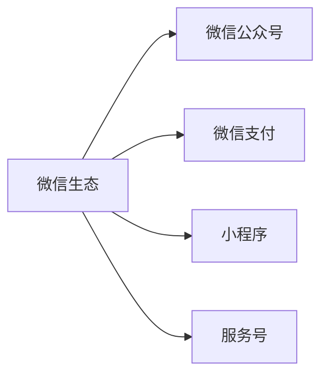

                 

# 如何利用微信生态卖课：程序员版

## 1. 背景介绍

随着互联网教育市场的蓬勃发展，越来越多的人开始在线上进行课程学习。微信作为中国最大的社交平台，其庞大的用户基数和丰富的生态系统，为在线教育提供了广阔的市场。本文将探讨如何利用微信生态卖课，帮助程序员更好地开发和运营课程，提高课程的曝光度和转化率。

## 2. 核心概念与联系

### 2.1 核心概念概述

为更好地理解如何利用微信生态卖课，本节将介绍几个密切相关的核心概念：

- **微信生态**：微信生态包括微信、微信朋友圈、微信小程序、微信服务号等，形成一个完整的社交、商业和服务闭环。
- **微信公众号**：微信公众号是微信平台上的一个重要组件，用于发布和管理内容。
- **微信支付**：微信支付是微信平台上的第三方支付功能，用于课程购买和支付。
- **小程序**：微信小程序是微信平台上的一个轻量级应用，可以快速开发和部署课程相关功能。
- **服务号**：服务号是微信平台上的一个功能强大的账号类型，可以进行课程推广和运营管理。

这些核心概念之间的逻辑关系可以通过以下Mermaid流程图来展示：



这个流程图展示了大语言模型的核心概念及其之间的关系：

1. 微信生态是基础，提供社交、商业和服务的闭环。
2. 微信公众号、微信支付、小程序、服务号都是微信生态的重要组成部分，各自扮演着不同的角色。
3. 通过这些组件的协同工作，可以实现课程的开发、销售、推广和管理。

## 3. 核心算法原理 & 具体操作步骤

### 3.1 算法原理概述

利用微信生态卖课的核心算法原理包括：

- **用户行为分析**：通过微信平台的统计数据和用户行为数据，分析用户兴趣和需求，精准定位目标用户。
- **内容推荐算法**：基于用户行为和课程内容特征，推荐合适的课程给用户。
- **用户转化优化**：通过微信营销手段和个性化推荐，提高用户购买课程的转化率。
- **课程管理与运营**：通过微信小程序和服务号，管理和运营课程内容，提升用户满意度和粘性。

### 3.2 算法步骤详解

以下是利用微信生态卖课的主要算法步骤：

**Step 1: 用户行为数据收集与分析**

- 收集用户在微信公众号、小程序和服务号上的行为数据，如浏览记录、点击次数、购买行为等。
- 使用数据分析工具对用户行为进行统计和分析，识别出用户兴趣和行为模式。
- 根据用户行为特征，划分出不同类型和层次的用户群体，制定针对性的课程推荐策略。

**Step 2: 课程内容推荐算法**

- 对课程内容进行特征提取，如课程标题、描述、讲师信息、用户评价等。
- 使用机器学习算法，如协同过滤、内容推荐、深度学习等，对课程内容进行相似度计算。
- 根据用户行为数据和课程内容特征，构建推荐模型，预测用户可能感兴趣的课程。
- 通过微信小程序或服务号，向用户推送个性化的课程推荐列表。

**Step 3: 用户转化优化**

- 设计微信营销策略，如优惠活动、社交裂变、限时抢购等，吸引用户购买课程。
- 利用微信小程序的轻量化优势，提供简洁、易用的课程购买和支付界面。
- 通过微信支付的高效和便捷性，简化用户支付流程，提高购买转化率。
- 结合用户反馈和评价，不断优化课程内容和推荐策略，提升用户满意度和忠诚度。

**Step 4: 课程管理与运营**

- 利用微信小程序的开发平台，快速构建和管理课程内容，如视频、文字、习题等。
- 通过微信服务号的订阅功能，发布课程更新、作业通知、考试信息等，保持与用户的互动。
- 利用微信社群功能，建立课程社区，促进用户之间的交流和分享，提升课程活跃度。
- 定期分析课程数据和用户反馈，不断优化课程内容和运营策略，提高用户粘性和口碑。

### 3.3 算法优缺点

利用微信生态卖课的主要优点包括：

- **用户覆盖广**：微信平台拥有庞大的用户基础，可以覆盖不同层次和类型的用户。
- **推广成本低**：通过微信平台的社交关系和推荐算法，可以以较低的成本推广课程。
- **转化率高**：通过个性化的推荐和微信营销手段，提高用户购买的转化率。
- **运营灵活**：通过微信小程序和服务号，可以灵活管理和运营课程，提升用户体验。

同时，该方法也存在一些局限性：

- **依赖微信平台**：课程销售和运营高度依赖微信平台，如果微信生态发生变化，可能会影响课程推广和运营。
- **竞争激烈**：微信生态中存在大量在线教育平台，课程竞争激烈，需要不断创新和优化。
- **用户流失风险**：如果用户无法满足课程需求或体验不佳，可能会流失，影响课程营收。

尽管存在这些局限性，但利用微信生态卖课仍然是一种高效、低成本的课程推广和运营方式。未来相关研究的重点在于如何进一步优化推荐算法，提高用户转化率，同时兼顾运营的灵活性和安全性等因素。

### 3.4 算法应用领域

利用微信生态卖课的方法已经在在线教育领域得到了广泛应用，涵盖课程开发、推广、运营等多个环节。具体包括：

- **编程课程**：如Python、Java、C++等编程语言的入门和进阶课程。
- **数据分析课程**：如数据可视化、机器学习、大数据等数据相关课程。
- **人工智能课程**：如深度学习、自然语言处理、计算机视觉等AI技术课程。
- **网络安全课程**：如网络攻防、安全漏洞分析、加密技术等安全相关课程。
- **产品经理课程**：如产品管理、用户研究、市场分析等产品相关课程。

除了上述这些经典课程外，微信生态中的在线教育平台还创新性地应用了微课、直播、互动问答等教学形式，为课程开发和推广提供了更多可能性。

## 4. 数学模型和公式 & 详细讲解 & 举例说明

### 4.1 数学模型构建

本节将使用数学语言对利用微信生态卖课的算法进行更加严格的刻画。

记微信平台上的用户集合为 $U$，课程集合为 $C$。设用户 $u \in U$ 对课程 $c \in C$ 的兴趣度为 $I(u,c)$，其取值范围为 $[0,1]$。

定义用户 $u$ 在一段时间内的行为序列为 $B(u) = (b_1, b_2, \dots, b_t)$，其中 $b_t$ 表示用户在第 $t$ 个时间点上对课程 $c_t$ 的行为，如浏览、点击、购买等。

则用户行为数据可以表示为 $B(U)$，其中 $B(U)$ 是一个行为矩阵。定义用户 $u$ 对课程 $c$ 的兴趣矩阵为 $I(u,c) = (i_{u,c})_{c \in C}$，其中 $i_{u,c}$ 表示用户 $u$ 对课程 $c$ 的兴趣度。

课程内容特征表示为 $F(c) = (f_1, f_2, \dots, f_n)$，其中 $f_i$ 表示课程内容的第 $i$ 个特征，如课程名称、讲师、评价等。

### 4.2 公式推导过程

基于上述模型，用户行为与课程兴趣之间的关系可以表示为：

$$
I(u,c) = \sum_{t=1}^T \alpha_t \cdot w_{b_t} \cdot \beta_t^t \cdot f(c)
$$

其中 $\alpha_t$ 表示第 $t$ 个行为对用户兴趣的影响权重，$w_{b_t}$ 表示第 $t$ 个行为的权重，$\beta_t^t$ 表示时间衰减因子，$f(c)$ 表示课程内容特征向量。

根据用户行为数据和课程内容特征，构建用户行为和课程兴趣的关系矩阵 $B$ 和 $I$，可以表示为：

$$
B = (b_{u,c})_{u \in U, c \in C}
$$

$$
I = (i_{u,c})_{u \in U, c \in C}
$$

通过矩阵乘法，可以计算出用户 $u$ 对课程 $c$ 的兴趣度：

$$
I(u,c) = B_{u,c} \cdot W \cdot F(c)
$$

其中 $W$ 是一个权重矩阵，用于调整用户行为和课程特征的权重。

### 4.3 案例分析与讲解

假设用户 $u$ 在一段时间内对课程 $c_1, c_2, c_3$ 的行为序列为 $B(u) = (b_1, b_2, \dots, b_t)$，其中 $b_1 = (b_{u,c_1}, b_{u,c_2}, b_{u,c_3})$，表示用户 $u$ 对课程 $c_1, c_2, c_3$ 的浏览行为。课程 $c_1, c_2, c_3$ 的特征表示为 $F(c_1) = (f_{c_1,1}, f_{c_1,2}, \dots, f_{c_1,n}), F(c_2) = (f_{c_2,1}, f_{c_2,2}, \dots, f_{c_2,n}), F(c_3) = (f_{c_3,1}, f_{c_3,2}, \dots, f_{c_3,n})$。

根据上述模型，用户 $u$ 对课程 $c_1, c_2, c_3$ 的兴趣度可以表示为：

$$
I(u,c_1) = b_{u,c_1} \cdot w_{b_{u,c_1}} \cdot \beta_{b_{u,c_1}}^1 \cdot f_{c_1}
$$

$$
I(u,c_2) = b_{u,c_2} \cdot w_{b_{u,c_2}} \cdot \beta_{b_{u,c_2}}^2 \cdot f_{c_2}
$$

$$
I(u,c_3) = b_{u,c_3} \cdot w_{b_{u,c_3}} \cdot \beta_{b_{u,c_3}}^3 \cdot f_{c_3}
$$

根据用户行为数据和课程内容特征，计算出用户对课程的兴趣度后，可以通过推荐算法，生成个性化的课程推荐列表，推送给用户。

## 5. 项目实践：代码实例和详细解释说明

### 5.1 开发环境搭建

在进行课程开发和推广实践前，我们需要准备好开发环境。以下是使用Python进行微信开发的环境配置流程：

1. 安装Python：从官网下载并安装Python，推荐使用3.7及以上版本。
2. 安装微信开发者工具：从微信开发者官网下载并安装微信开发者工具。
3. 创建微信小程序或服务号：在微信开发者平台上创建微信小程序或服务号，并获取相应的开发权限。
4. 安装开发工具：安装微信开发所需的各种工具和库，如Flask、Django、Tencent Serverless Framework等。

完成上述步骤后，即可在开发环境中开始课程开发和推广实践。

### 5.2 源代码详细实现

下面以一个简单的Python Flask服务为例，展示如何利用微信小程序进行课程销售和推广。

首先，在Flask应用程序中创建微信小程序的接口：

```python
from flask import Flask, request, jsonify

app = Flask(__name__)

@app.route('/api/wechat/course')
def get_course():
    # 获取微信小程序的请求参数
    app_id = request.args.get('appid')
    app_secret = request.args.get('app_secret')
    token = request.args.get('token')
    nonce_str = request.args.get('nonce_str')
    timestamp = request.args.get('timestamp')
    signature = request.args.get('signature')
    echo_str = request.args.get('echostr')
    
    # 验证微信小程序的签名
    app_sign = wx.verify_signature(app_id, app_secret, nonce_str, timestamp, echo_str)
    if app_sign != signature:
        return jsonify(error='签名不正确')
    
    # 获取课程信息
    course_id = request.args.get('course_id')
    course_name = get_course_name(course_id)
    course_price = get_course_price(course_id)
    
    # 构建响应结果
    response = {
        'return_code': 0,
        'return_msg': '处理成功',
        'echostr': '处理成功'
    }
    
    return jsonify(response)

if __name__ == '__main__':
    app.run(debug=True)
```

然后，在小程序中调用上述接口，实现课程信息的获取和课程的购买功能：

```html
<!-- 课程购买页面 -->
<form action="/api/wechat/course" method="get">
    <input type="hidden" name="appid" value="{{app_id}}" />
    <input type="hidden" name="app_secret" value="{{app_secret}}" />
    <input type="hidden" name="token" value="{{token}}" />
    <input type="hidden" name="nonce_str" value="{{nonce_str}}" />
    <input type="hidden" name="timestamp" value="{{timestamp}}" />
    <input type="hidden" name="signature" value="{{signature}}" />
    <input type="hidden" name="course_id" value="{{course_id}}" />
    <button type="submit">购买</button>
</form>
```

在上述代码中，`/api/wechat/course` 接口接收微信小程序的请求参数，包括小程序的 appid、app_secret、token、nonce_str、timestamp、signature 和 course_id 等。通过验证签名，确保请求来自合法的小程序，然后获取课程信息，返回购买响应。

### 5.3 代码解读与分析

以下是关键代码的实现细节：

**Flask应用程序**：
- 创建 Flask 应用程序，定义 `/api/wechat/course` 接口。
- 从请求中获取小程序的 appid、app_secret、token、nonce_str、timestamp 和 signature，验证签名，确保请求的合法性。
- 根据课程 id 获取课程名称和价格，构建响应结果，返回购买信息。

**微信小程序**：
- 通过表单提交请求到 `/api/wechat/course` 接口。
- 设置请求参数，包括 appid、app_secret、token、nonce_str、timestamp、signature 和 course_id 等。
- 点击提交按钮，触发表单提交，请求课程购买信息。

## 6. 实际应用场景

### 6.1 智能教育

利用微信生态卖课的方法可以广泛应用于智能教育领域，帮助教育机构和教师更好地推广和管理课程。

具体而言，可以创建微信服务号和小程序，发布教育机构和教师的课程信息，进行课程推广和报名管理。通过微信平台的社交关系和推荐算法，推荐合适的课程给用户，提升课程的曝光度和转化率。

### 6.2 企业培训

企业可以利用微信生态卖课，为员工提供便捷的培训和技能提升课程。通过微信服务号和小程序，推送培训课程信息，进行报名管理，提高员工的学习积极性和课程完成率。

### 6.3 在线编程社区

在线编程社区可以利用微信生态卖课，推广编程课程和技术文章，提升社区的活跃度和用户粘性。通过微信小程序，提供课程学习、技术交流、问题解答等功能，形成完整的编程学习生态。

### 6.4 未来应用展望

随着微信生态的不断发展和完善，利用微信生态卖课的方法将在更多领域得到应用，为在线教育、企业培训、编程社区等带来新的机遇。

在智慧医疗领域，利用微信生态卖课，可以为医护人员提供便捷的在线培训和医学知识更新，提升医疗服务质量。

在智能制造领域，通过微信生态卖课，可以为员工提供生产技能培训，提升生产效率和产品质量。

在智慧城市领域，通过微信生态卖课，可以为市民提供便捷的城市管理知识，提升城市治理水平。

此外，在金融、教育、政府等多个领域，利用微信生态卖课的方法也将不断涌现，为在线教育提供新的发展方向。

## 7. 工具和资源推荐

### 7.1 学习资源推荐

为了帮助开发者系统掌握利用微信生态卖课的技术基础和实践技巧，这里推荐一些优质的学习资源：

1. 《微信小程序开发手册》：微信官方文档，详细介绍了微信小程序的开发流程和接口调用方法。
2. 《微信服务号开发指南》：微信官方文档，介绍了微信服务号的开发和管理方法。
3. 《Flask Web应用开发》：Flask官方文档，介绍了Flask Web应用的开发和部署方法。
4. 《Python Web应用开发实战》：经典书籍，讲解了Python Web应用的开发和实践技巧。
5. 《微信小程序实战教程》：微信官方文档，提供丰富的案例和实战教程，帮助开发者快速上手。

通过对这些资源的学习实践，相信你一定能够快速掌握利用微信生态卖课的技术精髓，并用于解决实际的课程推广问题。

### 7.2 开发工具推荐

高效的开发离不开优秀的工具支持。以下是几款用于微信小程序和开发号的常用工具：

1. Flask：基于Python的开源Web框架，适合快速迭代研究。
2. Django：基于Python的开源Web框架，生产部署方便，适合大规模工程应用。
3. Tencent Serverless Framework：腾讯提供的无服务器开发框架，适合快速开发和部署小程序。
4. WeChat Developer Tools：微信开发者工具，提供代码调试和部署功能。
5. Visual Studio Code：微软推出的轻量级代码编辑器，支持Python和JavaScript开发。

合理利用这些工具，可以显著提升课程开发和推广的效率，加快创新迭代的步伐。

### 7.3 相关论文推荐

利用微信生态卖课的技术源于学界的持续研究。以下是几篇奠基性的相关论文，推荐阅读：

1. "A Survey on Social Network-Based Recommendation Systems"：一篇综述性论文，介绍了社交网络推荐系统的研究进展和未来趋势。
2. "Leveraging Social Networks for Recommendation"：一篇经典论文，探讨了利用社交网络进行推荐的技术方法和应用场景。
3. "Social Recommendation Algorithms: A Survey"：一篇综述性论文，介绍了社交推荐算法的研究现状和未来方向。
4. "User Behavior Modeling and Recommendation System"：一篇经典论文，探讨了用户行为建模和推荐系统的方法和应用。

这些论文代表了大语言模型微调技术的发展脉络。通过学习这些前沿成果，可以帮助研究者把握学科前进方向，激发更多的创新灵感。

## 8. 总结：未来发展趋势与挑战

### 8.1 总结

本文对利用微信生态卖课的技术进行了全面系统的介绍。首先阐述了微信生态和课程推广的核心概念及其之间的逻辑关系，明确了利用微信生态卖课在在线教育、企业培训、编程社区等领域的独特价值。其次，从原理到实践，详细讲解了课程推广的数学模型和算法步骤，给出了微信小程序和Flask的代码实现。同时，本文还广泛探讨了利用微信生态卖课的应用场景，展示了微信生态在课程推广中的巨大潜力。

通过本文的系统梳理，可以看到，利用微信生态卖课的方法正在成为在线教育的重要手段，极大地拓展了课程的推广渠道，催生了更多的创新应用。未来，伴随微信生态的持续发展和优化，利用微信生态卖课的技术也将不断进步，为课程推广和运营提供更高效、更便捷、更智能的解决方案。

### 8.2 未来发展趋势

展望未来，利用微信生态卖课的技术将呈现以下几个发展趋势：

1. **社交关系优化**：利用微信平台的社交关系，构建更精确、更高效的用户群体，提升课程推广的针对性和转化率。
2. **推荐算法优化**：进一步优化推荐算法，提升课程推荐的相关性和多样性，满足不同用户的多样化需求。
3. **用户行为分析**：深入分析用户行为数据，挖掘用户的兴趣和需求，提供个性化的课程推荐和服务。
4. **跨平台协同**：利用微信生态的多平台特性，跨微信小程序、服务号、微信朋友圈等平台进行课程推广和运营，形成完整的生态闭环。
5. **AI技术引入**：引入AI技术，如自然语言处理、图像识别等，提升课程推广的智能性和精准性。

以上趋势凸显了利用微信生态卖课技术的广阔前景。这些方向的探索发展，必将进一步提升课程推广的效果和用户体验，为在线教育的发展带来新的动力。

### 8.3 面临的挑战

尽管利用微信生态卖课的技术已经取得了显著的成果，但在迈向更加智能化、普适化应用的过程中，它仍面临着诸多挑战：

1. **平台依赖性强**：课程销售和运营高度依赖微信平台，平台规则和功能的变化可能影响课程推广和运营。
2. **数据隐私和安全**：微信平台涉及大量用户数据，数据隐私和安全问题需要特别注意，避免数据泄露和滥用。
3. **竞争激烈**：微信生态中存在大量在线教育平台，课程竞争激烈，需要不断创新和优化。
4. **用户流失风险**：如果用户无法满足课程需求或体验不佳，可能会流失，影响课程营收。

尽管存在这些挑战，但利用微信生态卖课仍然是一种高效、低成本的课程推广方式。未来相关研究的重点在于如何进一步优化推荐算法，提高用户转化率，同时兼顾运营的灵活性和安全性等因素。

### 8.4 研究展望

面对利用微信生态卖课所面临的挑战，未来的研究需要在以下几个方面寻求新的突破：

1. **数据隐私保护**：加强数据隐私保护，确保用户数据安全，避免数据滥用和泄露。
2. **用户行为预测**：通过机器学习和深度学习技术，预测用户行为，提升课程推荐的准确性和个性化。
3. **跨平台协同推广**：探索跨平台协同推广的方法，提高课程推广的覆盖面和用户粘性。
4. **个性化推荐优化**：结合用户画像和行为数据，提供更加精准的个性化推荐，提升用户转化率。
5. **多渠道整合**：整合多渠道推广资源，形成完整的课程推广生态，提升课程推广的效果。

这些研究方向将推动利用微信生态卖课技术的进一步发展和应用，为在线教育、企业培训、编程社区等提供更高效、更智能、更安全的技术支撑。面向未来，利用微信生态卖课技术将不断进步，成为在线教育的重要手段，为课程推广和运营提供更便捷、更智能、更安全的解决方案。

## 9. 附录：常见问题与解答

**Q1: 利用微信生态卖课的优势是什么？**

A: 利用微信生态卖课的主要优势包括：
- **用户覆盖广**：微信平台拥有庞大的用户基础，可以覆盖不同层次和类型的用户。
- **推广成本低**：通过微信平台的社交关系和推荐算法，可以以较低的成本推广课程。
- **转化率高**：通过个性化的推荐和微信营销手段，提高用户购买的转化率。
- **运营灵活**：通过微信小程序和服务号，可以灵活管理和运营课程，提升用户满意度和粘性。

**Q2: 如何提升课程的曝光度和转化率？**

A: 提升课程的曝光度和转化率的方法包括：
- **个性化推荐**：利用用户行为数据和课程内容特征，提供个性化的课程推荐，提高用户购买意愿。
- **微信营销**：设计微信营销策略，如优惠活动、社交裂变、限时抢购等，吸引用户购买课程。
- **优化用户体验**：通过微信小程序和Flask等工具，提供简洁、易用的课程购买和支付界面，提升用户购买体验。
- **用户互动**：利用微信社群功能，建立课程社区，促进用户之间的交流和分享，提升课程活跃度。

**Q3: 如何优化用户行为模型？**

A: 优化用户行为模型的方法包括：
- **数据收集**：收集用户行为数据，包括浏览记录、点击次数、购买行为等。
- **数据预处理**：对用户行为数据进行预处理，如去噪、归一化、特征工程等。
- **模型训练**：使用机器学习算法，如协同过滤、内容推荐、深度学习等，对用户行为进行建模。
- **模型评估**：通过A/B测试等方法，评估模型效果，不断优化模型参数。

通过优化用户行为模型，可以更准确地预测用户行为，提供个性化的课程推荐，提升课程推广效果。

---

作者：禅与计算机程序设计艺术 / Zen and the Art of Computer Programming

