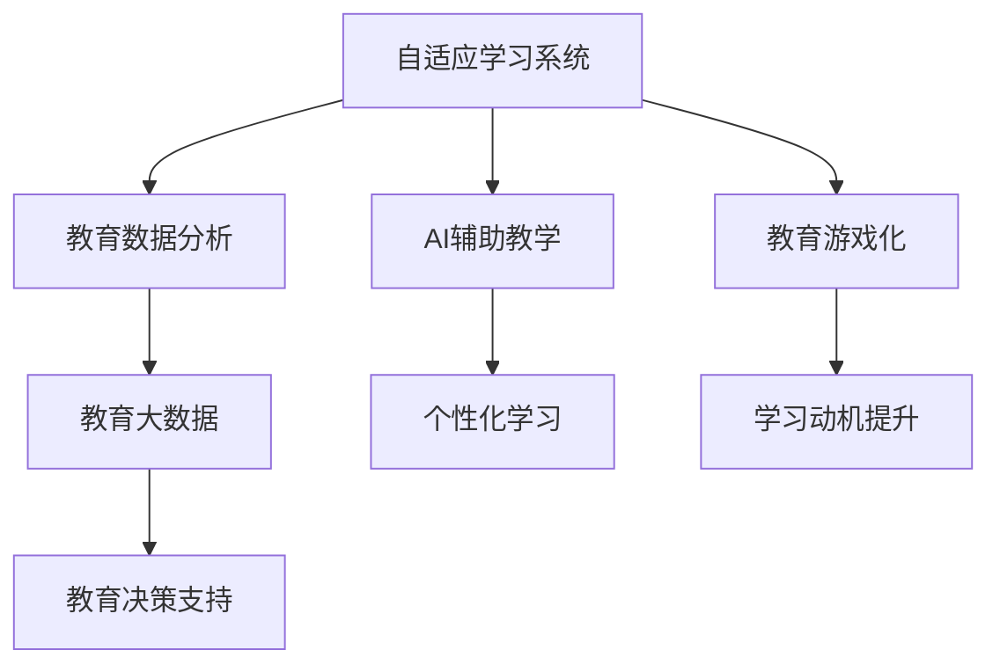

                 

# 如何利用技术能力进行教育科技创新

在数字化时代，教育技术（EdTech）已经成为推动教育革新的重要引擎。通过技术手段，我们可以实现个性化教学、提升教学质量、优化学习体验等目标。本文将深入探讨如何利用技术能力进行教育科技创新，涵盖从教学设计到实际应用的全过程。

## 1. 背景介绍

### 1.1 问题由来
当前教育面临诸多挑战：如何提高学生的学习动机和效果？如何应对教学资源的不均衡？如何激发教师的创造力和职业发展？这些问题催生了对教育科技创新的迫切需求。

### 1.2 问题核心关键点
教育科技创新的关键在于：
- 技术驱动教学设计：借助先进技术手段，优化课程内容和教学策略，提升教学效果。
- 个性化学习体验：利用数据分析和算法技术，根据学生的学习特点和需求，提供个性化的学习建议和资源。
- 增强教师能力：通过AI辅助和智能化工具，减轻教师负担，提升教学水平。
- 数据驱动决策：基于学习数据和反馈，及时调整教学方案，优化教学质量。
- 开源共享资源：构建开放的教学资源库，促进教学资源的共享与复用，提高教育公平性。

这些关键点共同构成了教育科技创新的核心方向，能够有效提升教育质量和效率，推动教育公平与普惠。

## 2. 核心概念与联系

### 2.1 核心概念概述

教育科技创新的核心概念包括：

- **自适应学习系统（Adaptive Learning Systems）**：通过数据分析和算法技术，根据学生的学习表现和偏好，实时调整教学内容和路径，提供个性化的学习体验。

- **教育数据分析（Educational Data Analytics）**：利用数据分析和机器学习技术，从学生行为和学习数据中提取有价值的信息，指导教学策略的优化和调整。

- **AI辅助教学（AI-Augmented Teaching）**：引入人工智能技术，如自然语言处理（NLP）、计算机视觉（CV）等，辅助教师进行教学设计、作业批改、学生评估等工作，提升教学效率和质量。

- **教育游戏化（Gamification in Education）**：通过游戏化设计，增强学生的学习动机和参与度，提升学习效果。

- **教育大数据（Educational Big Data）**：通过大规模数据采集和分析，揭示教育现象和规律，支持教育决策和优化。

这些概念通过技术手段实现教学的个性化、高效化和智能化，为教育创新提供了坚实的技术基础。

### 2.2 核心概念原理和架构的 Mermaid 流程图



这个流程图展示了自适应学习系统、教育数据分析、AI辅助教学、教育游戏化以及教育大数据等核心概念之间的相互关系和应用场景。

## 3. 核心算法原理 & 具体操作步骤

### 3.1 算法原理概述

教育科技创新的核心算法原理主要基于以下几个方面：

- **机器学习（Machine Learning）**：通过训练模型，预测学生的学习行为和结果，优化教学策略和资源配置。
- **自然语言处理（NLP）**：利用NLP技术，分析学生的文本回答和作业，提供精准的反馈和建议。
- **计算机视觉（CV）**：通过图像和视频分析，辅助教师进行教学过程的监控和评估。
- **推荐系统（Recommendation Systems）**：根据学生的历史学习数据，推荐个性化的学习资源和路径。

这些算法原理构成了教育科技创新的技术基础，能够有效支持个性化学习和智能化教学。

### 3.2 算法步骤详解

教育科技创新的算法步骤包括：

1. **数据收集**：通过传感器、问卷、作业等多种方式，收集学生的学习数据。
2. **数据预处理**：清洗和标注数据，确保数据质量。
3. **模型训练**：选择合适的算法和模型，训练预测模型。
4. **实时监控**：利用算法模型，实时监控学生的学习行为和状态。
5. **决策优化**：根据监控结果和预测结果，调整教学策略和资源配置。
6. **反馈评估**：通过学生和教师的反馈，评估模型效果和算法改进方向。

### 3.3 算法优缺点

教育科技创新的算法具有以下优点：

- **个性化学习**：能够根据学生的学习特点和需求，提供个性化的学习建议和资源。
- **数据驱动决策**：通过分析学习数据，优化教学策略和资源配置，提升教学效果。
- **高效资源利用**：利用算法推荐系统，优化学习资源的配置和使用。

然而，这些算法也存在以下局限性：

- **数据隐私问题**：需要处理大量的学生数据，涉及隐私保护和伦理问题。
- **算法偏见**：模型训练数据可能存在偏见，导致预测结果的偏差。
- **技术门槛高**：算法实现和优化需要较高的技术门槛，需要专业知识的支持。

### 3.4 算法应用领域

教育科技创新的算法在多个领域得到了广泛应用，例如：

- **智能课堂**：通过AI辅助教学，提升教学效率和质量。
- **个性化学习平台**：根据学生的学习数据，提供个性化的学习资源和路径。
- **作业自动批改系统**：利用NLP和CV技术，自动批改作业，减轻教师负担。
- **学习数据分析平台**：分析学生的学习数据，提供教学优化建议。

这些应用展示了教育科技创新的广阔前景，能够有效提升教育质量和学习效果。

## 4. 数学模型和公式 & 详细讲解 & 举例说明

### 4.1 数学模型构建

教育科技创新的数学模型构建主要基于以下几个方面：

- **学生学习行为模型**：通过时间序列分析，预测学生的学习进度和成绩。
- **个性化学习路径模型**：利用图模型，构建学生的学习路径和资源推荐。
- **教学效果评估模型**：通过回归分析，评估不同教学策略的效果。

### 4.2 公式推导过程

以学生学习行为模型为例，假设学生每天学习时间为 $T$，学习效率为 $E$，学习行为 $L$ 可以表示为：

$$ L = T \times E $$

其中 $T$ 和 $E$ 都是随机变量，通过历史数据和统计方法，可以估计出它们的概率分布，从而进行预测。

### 4.3 案例分析与讲解

假设某学生每天学习时间为 $T$，学习效率为 $E$，已知其历史学习数据，利用回归分析，可以预测其未来的学习效果。通过不断更新模型参数，可以实现实时监控和预测。

## 5. 项目实践：代码实例和详细解释说明

### 5.1 开发环境搭建

教育科技创新的项目开发通常需要多学科知识，包括数据科学、计算机科学和教育学等。以下是一个基于Python的开发环境搭建流程：

1. **安装Python**：确保Python环境已配置，可以使用Anaconda等工具进行环境管理。
2. **安装相关库**：安装必要的Python库，如Pandas、NumPy、Scikit-learn等。
3. **搭建数据平台**：构建学生学习数据平台，收集和存储学习数据。
4. **选择算法框架**：选择合适的算法框架，如TensorFlow、PyTorch等。
5. **搭建模型平台**：构建模型训练和部署平台，实现模型的训练和应用。

### 5.2 源代码详细实现

以下是一个基于Python的智能课堂系统示例代码：

```python
import pandas as pd
from sklearn.model_selection import train_test_split
from sklearn.linear_model import LinearRegression
from sklearn.metrics import mean_squared_error

# 加载数据
data = pd.read_csv('student_learning_data.csv')

# 数据预处理
X = data[['T', 'E']]
y = data['L']

# 划分训练集和测试集
X_train, X_test, y_train, y_test = train_test_split(X, y, test_size=0.2, random_state=42)

# 训练模型
model = LinearRegression()
model.fit(X_train, y_train)

# 预测测试集
y_pred = model.predict(X_test)

# 评估模型
mse = mean_squared_error(y_test, y_pred)
print(f"Mean Squared Error: {mse}")
```

### 5.3 代码解读与分析

这段代码展示了如何利用线性回归模型预测学生的学习行为。首先，加载并处理学生学习数据，然后划分训练集和测试集，训练线性回归模型，最后评估模型的预测效果。

### 5.4 运行结果展示

运行上述代码，可以得到预测误差 $mse$，评估模型的预测效果。通过不断优化模型参数，可以实现更准确的预测。

## 6. 实际应用场景

### 6.1 智能课堂

智能课堂系统通过AI辅助教学，提升教学效果。例如，利用自然语言处理技术，自动批改作业并提供反馈；利用计算机视觉技术，监控学生课堂行为，提供实时反馈；利用推荐系统，推荐个性化的学习资源和路径。

### 6.2 个性化学习平台

个性化学习平台根据学生的学习数据，提供个性化的学习建议和资源。例如，利用数据分析技术，识别学生的学习偏好和难点，提供针对性的学习建议；利用推荐系统，推荐适合的学习资源和路径。

### 6.3 作业自动批改系统

作业自动批改系统利用NLP和CV技术，自动批改作业，减轻教师负担。例如，利用OCR技术，自动识别学生提交的作业；利用NLP技术，自动分析学生的文本回答，提供精准的反馈和建议。

### 6.4 学习数据分析平台

学习数据分析平台分析学生的学习数据，提供教学优化建议。例如，利用数据挖掘技术，识别学生的学习行为模式和趋势；利用机器学习技术，预测学生的学习效果和风险；利用可视化工具，展示学习数据和分析结果，支持教师和学校做出决策。

### 6.5 未来应用展望

未来教育科技创新的应用前景广阔，可能涵盖更多领域，例如：

- **教育游戏化**：通过游戏化设计，提升学生的学习动机和参与度。
- **虚拟现实（VR）教学**：利用VR技术，提供沉浸式学习体验。
- **智能辅导系统**：利用AI技术，提供24小时在线辅导。
- **教育大数据分析**：通过大数据分析，揭示教育现象和规律，支持教育决策。

## 7. 工具和资源推荐

### 7.1 学习资源推荐

为了帮助开发者系统掌握教育科技创新的理论基础和实践技巧，这里推荐一些优质的学习资源：

1. **《教育数据挖掘：方法与应用》**：介绍教育数据挖掘的基本概念和应用技术，涵盖数据预处理、特征工程、模型选择等。
2. **《深度学习在教育中的应用》**：介绍深度学习在教育中的各种应用，如自适应学习系统、教育游戏化等。
3. **Coursera的《教育技术创新》**：介绍教育技术创新的基本理论和实践方法，涵盖数据驱动教学、个性化学习等。
4. **Kaggle的教育数据竞赛**：参与教育数据竞赛，提升数据分析和机器学习技能。
5. **开放教育资源（OER）**：如MIT OpenCourseWare，提供丰富的教育资源和课程，支持自主学习。

### 7.2 开发工具推荐

教育科技创新的开发通常需要多学科知识，以下推荐一些常用的开发工具：

1. **Python**：强大的编程语言，适合数据科学和机器学习开发。
2. **Jupyter Notebook**：交互式编程环境，支持代码执行和数据可视化。
3. **TensorFlow**：开源的机器学习框架，支持深度学习模型的训练和部署。
4. **PyTorch**：深度学习框架，支持动态计算图和丰富的算法库。
5. **Scikit-learn**：机器学习库，提供丰富的算法和工具函数。

### 7.3 相关论文推荐

教育科技创新的发展得益于学界的持续研究。以下是几篇奠基性的相关论文，推荐阅读：

1. **《教育数据挖掘：方法与应用》**：介绍教育数据挖掘的基本概念和应用技术，涵盖数据预处理、特征工程、模型选择等。
2. **《深度学习在教育中的应用》**：介绍深度学习在教育中的各种应用，如自适应学习系统、教育游戏化等。
3. **《教育技术创新的未来展望》**：探讨教育技术创新的未来方向，包括数据驱动教学、个性化学习等。

这些论文代表了大语言模型微调技术的发展脉络。通过学习这些前沿成果，可以帮助研究者把握学科前进方向，激发更多的创新灵感。

## 8. 总结：未来发展趋势与挑战

### 8.1 研究成果总结

教育科技创新的发展已经取得诸多成果，涵盖了数据驱动教学、个性化学习、AI辅助教学等多个方面。这些成果推动了教育质量和学习效率的提升，为教育公平和普惠提供了新的解决方案。

### 8.2 未来发展趋势

未来教育科技创新的发展趋势包括：

- **技术融合**：教育技术将与其他技术进行更深层次的融合，如人工智能、大数据、物联网等。
- **智能化**：教育系统将变得更加智能化，能够实时监控和调整教学过程，提升教学效果。
- **个性化**：通过大数据分析和机器学习，实现个性化的教学和辅导，提升学生的学习体验和效果。
- **开放共享**：教育资源将更加开放和共享，促进教育公平和普惠。

### 8.3 面临的挑战

教育科技创新的发展也面临诸多挑战，包括：

- **数据隐私**：教育数据涉及大量个人隐私，需要采取严格的隐私保护措施。
- **技术门槛**：教育科技创新的技术门槛较高，需要跨学科的知识和技能。
- **伦理问题**：教育科技创新的应用可能引发伦理问题，需要制定相关政策和规范。

### 8.4 研究展望

未来的教育科技创新需要在数据隐私、技术门槛和伦理问题等方面进行深入研究。通过技术手段实现教育公平和普惠，同时确保数据安全和技术应用的伦理合理性，是教育科技创新的重要课题。

## 9. 附录：常见问题与解答

**Q1：教育科技创新的核心是什么？**

A: 教育科技创新的核心在于利用技术手段，提升教学质量和效率，实现个性化学习和智能化教学。这包括数据分析、机器学习、自然语言处理等技术的应用。

**Q2：如何提升教育科技创新的效果？**

A: 提升教育科技创新的效果需要多方面的努力，包括：
- 数据质量：确保数据完整、准确、可靠，为模型训练和优化提供坚实基础。
- 算法选择：选择合适的算法和模型，根据具体任务和数据特点进行优化。
- 实时监控：利用算法模型，实时监控学生的学习行为和状态，及时调整教学策略。
- 反馈评估：通过学生和教师的反馈，评估模型效果和算法改进方向。

**Q3：教育科技创新的应用场景有哪些？**

A: 教育科技创新的应用场景包括：
- 智能课堂：通过AI辅助教学，提升教学效率和质量。
- 个性化学习平台：根据学生的学习数据，提供个性化的学习建议和资源。
- 作业自动批改系统：利用NLP和CV技术，自动批改作业，减轻教师负担。
- 学习数据分析平台：分析学生的学习数据，提供教学优化建议。

这些应用展示了教育科技创新的广阔前景，能够有效提升教育质量和学习效果。

---

作者：禅与计算机程序设计艺术 / Zen and the Art of Computer Programming

