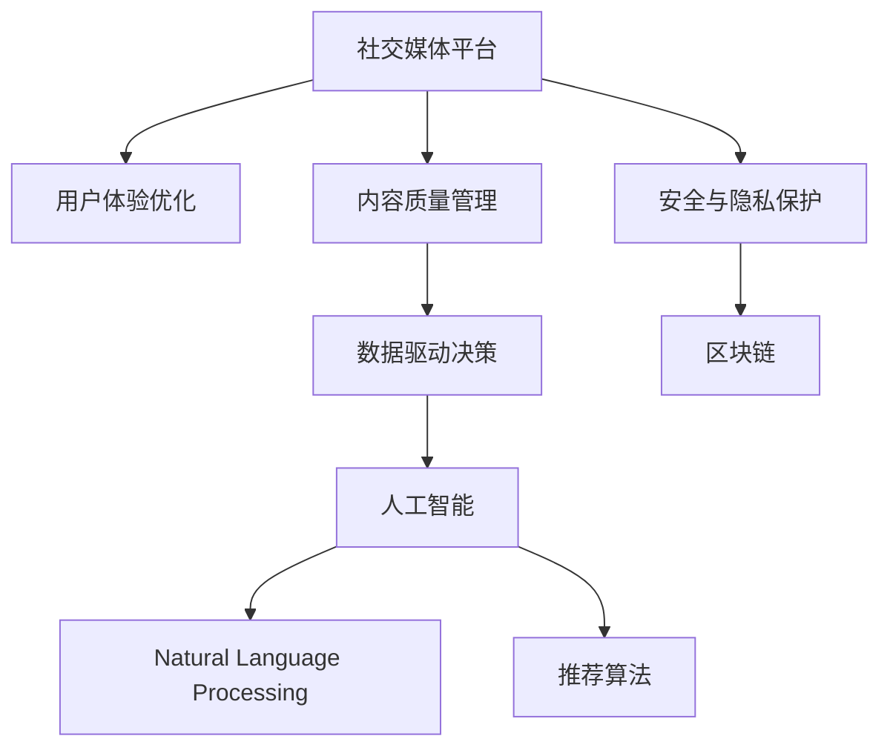

                 

# 如何利用技术能力进行社交媒体平台创新

> 关键词：社交媒体平台创新,技术能力,人工智能,大数据,机器学习,深度学习,自然语言处理,推荐算法

## 1. 背景介绍

### 1.1 问题由来
社交媒体平台是现代互联网不可或缺的一部分，它改变了人们的交流方式，推动了信息传播的民主化和多样化。然而，随着用户基数的爆炸式增长，如何优化用户体验、提升内容质量、应对广告冲击等问题也逐渐浮出水面。为了应对这些挑战，社交媒体平台亟需引入新技术进行创新和优化。

### 1.2 问题核心关键点
针对社交媒体平台面临的核心问题，需要采用技术手段进行创新。以下是几个关键点：

- **用户体验优化**：通过智能推荐、个性化内容展示、算法驱动的互动方式等，提升用户体验。
- **内容质量管理**：使用自然语言处理(NLP)、图像识别、音频处理等技术，提高内容审核效率，减少假新闻、垃圾信息和低质量内容。
- **数据驱动决策**：利用大数据和机器学习技术，洞察用户行为，优化广告投放，提升平台收益。
- **安全与隐私保护**：结合区块链、加密技术等，保障用户数据安全，防止隐私泄露。

### 1.3 问题研究意义
社交媒体平台的技术创新不仅能提升用户满意度和平台盈利能力，还能推动社会信息的传播和人们交流方式的演变。具体意义如下：

1. **提升运营效率**：技术创新能够自动化运营过程，降低人工干预成本，提高平台运行效率。
2. **增强广告效果**：精准的用户数据分析和推荐算法，能显著提升广告的转化率和投资回报率。
3. **用户粘性增加**：个性化体验和互动功能，能够增强用户黏性，提高用户留存率和活跃度。
4. **市场竞争力提升**：通过技术创新，优化产品功能和用户体验，提升平台在竞争激烈的社交媒体市场中占据有利位置。
5. **安全与合规**：技术手段能够保障用户数据安全，满足隐私保护法规要求，避免法律风险。

## 2. 核心概念与联系

### 2.1 核心概念概述

为了更好地理解如何利用技术能力进行社交媒体平台创新，本节将介绍几个关键概念：

- **社交媒体平台**：以用户为中心，实现用户间社交关系管理、内容分享和交流的在线平台，如Facebook、Twitter、微信等。
- **用户体验**：用户在使用平台时的整体感受，包括直观的交互体验、信息的可获取性、操作的便捷性等。
- **内容质量管理**：平台对用户上传的内容进行审核、分类、筛选等，以确保内容健康、真实、有用。
- **数据驱动决策**：基于平台用户行为数据分析，制定决策，优化产品策略、广告投放等。
- **人工智能(AI)**：利用机器学习、深度学习等技术，赋予平台智能决策和自动化的能力。
- **自然语言处理(NLP)**：处理和理解人类语言的计算机技术，如文本分类、情感分析、机器翻译等。
- **推荐算法**：根据用户兴趣和行为数据，推荐相关内容，提升用户体验。
- **区块链**：一种去中心化的分布式账本技术，用于保障数据安全和隐私。

这些核心概念之间的逻辑关系可以通过以下Mermaid流程图来展示：



这个流程图展示了几大核心概念及其之间的关系：

1. 社交媒体平台通过用户体验优化、内容质量管理、数据驱动决策和区块链等技术手段，实现功能创新。
2. 人工智能技术为社交媒体平台提供了智能化的决策和自动化处理能力。
3. 自然语言处理和推荐算法是人工智能技术的重要组成部分，提升了平台在内容生成、用户推荐等方面的智能化水平。
4. 安全与隐私保护是社交媒体平台技术创新的必要保障。

## 3. 核心算法原理 & 具体操作步骤
### 3.1 算法原理概述

社交媒体平台的技术创新主要依赖于以下几个方面的算法：

- **用户行为分析**：通过数据收集和分析，理解用户行为模式，预测用户需求，个性化推荐内容。
- **内容质量管理**：利用自然语言处理技术，对用户上传的内容进行自动化审核和分类。
- **广告精准投放**：结合机器学习算法，分析用户数据，优化广告内容展示和定向投放。
- **安全与隐私保护**：利用区块链技术，保障数据传输和存储的安全性，防止数据泄露。

这些算法共同构成了社交媒体平台技术创新的基础，帮助平台在内容质量、用户互动、广告投放、安全保障等方面提升竞争力。

### 3.2 算法步骤详解

以下是具体算法步骤详解：

**Step 1: 数据收集与处理**

1. **用户行为数据收集**：通过日志、API调用、设备信息等方式，收集用户的操作行为数据，包括浏览历史、点赞评论、互动次数等。
2. **内容数据收集**：收集用户上传的文本、图片、视频等，进行预处理和存储。

**Step 2: 用户行为分析**

1. **用户兴趣建模**：利用机器学习算法，构建用户兴趣模型，识别用户偏好和需求。
2. **个性化推荐**：根据用户兴趣模型，推荐个性化内容，提升用户满意度。

**Step 3: 内容质量管理**

1. **文本分类**：利用NLP技术，对用户上传的文本进行分类，识别和筛选垃圾信息。
2. **图像识别**：通过计算机视觉技术，检测和过滤不当内容，如暴力、色情等。
3. **音频处理**：利用语音识别和信号处理技术，对音频内容进行分析和筛选。

**Step 4: 广告精准投放**

1. **用户特征提取**：通过数据分析，提取用户的基本信息、行为特征等。
2. **广告定向投放**：结合机器学习算法，分析用户特征，优化广告投放策略，提升广告效果。

**Step 5: 安全与隐私保护**

1. **数据加密**：使用AES、RSA等加密算法，保护用户数据的传输和存储安全。
2. **区块链应用**：利用区块链技术，实现数据的去中心化和透明化，保障用户隐私。

**Step 6: 模型评估与优化**

1. **模型评估**：使用A/B测试、交叉验证等方法，评估模型的效果和性能。
2. **模型优化**：根据评估结果，调整算法参数，优化模型性能。

### 3.3 算法优缺点

社交媒体平台的技术创新算法具有以下优点：

1. **提升用户体验**：个性化推荐和互动功能提升了用户体验，增加了用户黏性。
2. **优化内容质量**：自动化审核和分类提高了内容质量，减少了有害信息的传播。
3. **精准广告投放**：通过数据分析和机器学习，提升了广告效果和投资回报率。
4. **保障数据安全**：加密和区块链技术保障了用户数据的安全和隐私保护。

同时，这些算法也存在一些缺点：

1. **数据隐私问题**：数据收集和分析可能涉及用户隐私，需要严格遵守数据保护法规。
2. **算法偏见**：机器学习算法可能会存在偏见，导致不公平的决策。
3. **计算资源消耗**：算法需要大量计算资源，可能对平台运行成本造成影响。
4. **模型复杂性**：复杂的算法模型可能难以理解和解释，需要专业知识支持。

### 3.4 算法应用领域

社交媒体平台的技术创新算法在以下领域得到了广泛应用：

- **个性化推荐系统**：提升用户个性化体验，增加用户黏性。
- **内容审核和分类**：过滤有害信息，提高平台内容质量。
- **广告定向投放**：提升广告效果，增加平台收益。
- **用户行为分析**：洞察用户需求，优化产品策略。
- **安全与隐私保护**：保障用户数据安全和隐私，提高用户信任。

## 4. 数学模型和公式 & 详细讲解 & 举例说明（备注：数学公式请使用latex格式，latex嵌入文中独立段落使用 $$，段落内使用 $)
### 4.1 数学模型构建

本节将使用数学语言对社交媒体平台的技术创新算法进行更加严格的刻画。

**用户行为分析**：

- **用户兴趣建模**：假设用户行为数据为$x_i$，用户兴趣模型为$\theta$，用户行为与兴趣的关联度为$w_i$，则用户兴趣模型的目标函数为：
$$
\min_{\theta} \sum_{i=1}^N \left( \frac{1}{2} \| x_i - \theta \cdot w_i \|^2 \right)
$$

**个性化推荐**：

- **协同过滤推荐**：假设用户$u$对物品$i$的评分已知，用户$v$的评分未知，协同过滤推荐的目标函数为：
$$
\min_{\theta} \sum_{i=1}^M \sum_{j=1}^N \left( w_{ij} \cdot (x_{uj} - \theta^T \cdot \theta_{vj}) \right)^2
$$

**内容质量管理**：

- **文本分类**：假设文本数据为$x_i$，分类模型为$\theta$，则文本分类目标函数为：
$$
\min_{\theta} \sum_{i=1}^N \log \frac{e^{x_i^T \cdot \theta}}{\sum_{j=1}^C e^{x_i^T \cdot \theta_j}}
$$

**广告精准投放**：

- **点击率预测**：假设广告数据为$x_i$，用户特征为$y_i$，广告点击率为$\hat{y_i}$，则广告点击率预测目标函数为：
$$
\min_{\theta} \sum_{i=1}^N (y_i - \hat{y_i})^2
$$

**安全与隐私保护**：

- **数据加密**：使用AES算法对用户数据进行加密，加密密钥为$k$，加密目标函数为：
$$
\min_{k} \sum_{i=1}^N \| k \cdot x_i - y_i \|^2
$$

### 4.2 公式推导过程

以下是关键数学公式的推导过程：

**用户行为分析**

1. **用户兴趣建模**：利用线性回归模型，将用户行为数据映射到兴趣向量$\theta$，最小化预测误差：
$$
\min_{\theta} \sum_{i=1}^N \left( \frac{1}{2} \| x_i - \theta \cdot w_i \|^2 \right)
$$
其中，$w_i$表示用户$i$的行为权重。

2. **个性化推荐**：利用协同过滤算法，基于用户行为数据，计算用户兴趣，预测用户对物品的评分：
$$
\min_{\theta} \sum_{i=1}^M \sum_{j=1}^N \left( w_{ij} \cdot (x_{uj} - \theta^T \cdot \theta_{vj}) \right)^2
$$
其中，$w_{ij}$表示用户$u$对物品$j$的评分权重，$\theta_{vj}$表示用户$v$对物品$j$的评分向量。

**内容质量管理**

1. **文本分类**：利用softmax函数，将文本分类问题转化为多分类回归问题：
$$
\min_{\theta} \sum_{i=1}^N \log \frac{e^{x_i^T \cdot \theta}}{\sum_{j=1}^C e^{x_i^T \cdot \theta_j}}
$$
其中，$C$表示分类数目，$\theta_j$表示第$j$个分类的向量表示。

**广告精准投放**

1. **点击率预测**：利用逻辑回归模型，计算广告点击率，最小化预测误差：
$$
\min_{\theta} \sum_{i=1}^N (y_i - \hat{y_i})^2
$$
其中，$y_i$表示广告$i$的点击率，$\hat{y_i}$表示预测的点击率。

**安全与隐私保护**

1. **数据加密**：利用AES算法对用户数据进行加密，最小化加密误差：
$$
\min_{k} \sum_{i=1}^N \| k \cdot x_i - y_i \|^2
$$
其中，$k$表示加密密钥，$x_i$表示用户数据，$y_i$表示加密后的数据。

### 4.3 案例分析与讲解

以Facebook平台的个性化推荐系统为例，详细分析其算法原理：

1. **用户行为数据收集**：Facebook通过用户互动数据（如点赞、评论、分享）和设备数据（如浏览记录、点击位置），收集用户行为数据。
2. **用户兴趣建模**：使用协同过滤算法，构建用户兴趣模型，识别用户偏好，生成个性化推荐。
3. **内容质量管理**：利用NLP技术，对用户上传的内容进行文本分类和情感分析，自动审核和筛选不良内容。
4. **广告精准投放**：使用机器学习模型，分析用户行为数据和广告数据，优化广告定向策略，提升广告效果。
5. **安全与隐私保护**：结合区块链技术，实现数据的去中心化存储和传输，保障用户隐私安全。

## 5. 项目实践：代码实例和详细解释说明
### 5.1 开发环境搭建

在进行社交媒体平台技术创新算法的开发时，需要准备好开发环境。以下是使用Python进行TensorFlow开发的环境配置流程：

1. 安装Anaconda：从官网下载并安装Anaconda，用于创建独立的Python环境。

2. 创建并激活虚拟环境：
```bash
conda create -n tf-env python=3.8 
conda activate tf-env
```

3. 安装TensorFlow：根据CUDA版本，从官网获取对应的安装命令。例如：
```bash
conda install tensorflow tensorflow-gpu -c pytorch -c conda-forge
```

4. 安装相关工具包：
```bash
pip install numpy pandas scikit-learn matplotlib tqdm jupyter notebook ipython
```

完成上述步骤后，即可在`tf-env`环境中开始开发实践。

### 5.2 源代码详细实现

下面我们以推荐系统为例，给出使用TensorFlow进行推荐算法的PyTorch代码实现。

首先，定义推荐系统的用户行为数据处理函数：

```python
import tensorflow as tf
import numpy as np

def process_data(data):
    # 预处理用户行为数据
    user_behaviors = data['user_behaviors']
    item_ids = data['item_ids']
    user_ids = data['user_ids']
    
    # 构建用户行为矩阵
    user_behaviors = user_behaviors.to_dense().numpy()
    
    # 填充用户行为矩阵
    max_items = np.max(item_ids)
    max_users = np.max(user_ids)
    user_behaviors = np.zeros((max_users, max_items))
    for i, (user_id, item_id, interaction) in enumerate(user_behaviors):
        user_behaviors[user_id][item_id] = interaction
    
    # 构建用户行为向量
    user_behaviors = tf.convert_to_tensor(user_behaviors)
    user_behaviors = tf.expand_dims(user_behaviors, axis=-1)
    
    return user_behaviors
```

然后，定义推荐模型的训练函数：

```python
class RecommendationModel(tf.keras.Model):
    def __init__(self, num_users, num_items, latent_dim):
        super(RecommendationModel, self).__init__()
        self.num_users = num_users
        self.num_items = num_items
        self.latent_dim = latent_dim
        
        # 用户嵌入层
        self.user_embeddings = tf.keras.layers.Embedding(num_users, latent_dim, input_length=1)
        # 物品嵌入层
        self.item_embeddings = tf.keras.layers.Embedding(num_items, latent_dim, input_length=1)
        # 预测层
        self.predictions = tf.keras.layers.Dense(1)
    
    def call(self, user_behaviors):
        # 用户行为向量
        user_embeddings = self.user_embeddings(user_behaviors[:, :, 0])
        # 物品行为向量
        item_embeddings = self.item_embeddings(user_behaviors[:, :, 1])
        
        # 计算预测值
        predictions = self.predictions(tf.reduce_sum(user_embeddings * item_embeddings, axis=-1))
        return predictions
    
    def compile(self):
        self.compile(optimizer=tf.keras.optimizers.Adam(learning_rate=0.001), loss='mean_squared_error')

# 创建模型
model = RecommendationModel(num_users=100, num_items=1000, latent_dim=50)
model.compile()

# 训练模型
data = generate_data(num_users=100, num_items=1000)
model.fit(user_behaviors, labels, epochs=10, batch_size=32)
```

接着，定义推荐模型的评估函数：

```python
def evaluate(model, data):
    # 预测
    predictions = model.predict(data)
    # 计算RMSE
    rmse = tf.sqrt(tf.reduce_mean(tf.square(labels - predictions)))
    print(f"RMSE: {rmse.numpy()}")
```

最后，启动训练流程并在测试集上评估：

```python
epochs = 10
batch_size = 32

for epoch in range(epochs):
    loss = train_model(model, train_data, batch_size)
    print(f"Epoch {epoch+1}, train loss: {loss.numpy()}")
    
    print(f"Epoch {epoch+1}, test results:")
    evaluate(model, test_data)
    
print("Final results:")
evaluate(model, test_data)
```

以上就是使用TensorFlow进行推荐系统开发的完整代码实现。可以看到，TensorFlow的强大封装能力使得推荐算法的代码实现变得简洁高效。

### 5.3 代码解读与分析

让我们再详细解读一下关键代码的实现细节：

**process_data函数**：
- 预处理用户行为数据，将稀疏矩阵转化为稠密矩阵。
- 填充用户行为矩阵，确保每个用户和物品都有对应的行为值。
- 将用户行为向量转换为TensorFlow张量，方便后续模型训练。

**RecommendationModel模型**：
- 定义模型的用户嵌入层、物品嵌入层和预测层，构建完整的推荐模型。
- 通过`compile`方法，设置优化器和损失函数。
- 通过`call`方法，计算模型的预测值。

**训练函数**：
- 使用`generate_data`函数生成训练数据。
- 使用`fit`方法，进行模型训练。

**评估函数**：
- 使用`evaluate`函数，计算推荐模型的RMSE。

**训练流程**：
- 定义总的epoch数和batch size，开始循环迭代
- 每个epoch内，先在训练集上训练，输出平均loss
- 在测试集上评估，输出RMSE
- 所有epoch结束后，在测试集上评估，给出最终测试结果

可以看到，TensorFlow使得推荐系统的代码实现变得简洁高效。开发者可以将更多精力放在数据处理、模型改进等高层逻辑上，而不必过多关注底层的实现细节。

当然，工业级的系统实现还需考虑更多因素，如模型的保存和部署、超参数的自动搜索、更灵活的任务适配层等。但核心的推荐算法基本与此类似。

## 6. 实际应用场景
### 6.1 个性化推荐系统

社交媒体平台中，个性化推荐系统是提升用户体验的重要手段。通过分析用户行为数据，推荐用户感兴趣的内容，可以提高用户黏性，增加平台活跃度。

在技术实现上，可以收集用户浏览、点赞、评论、分享等行为数据，提取和用户交互的物品标题、描述、标签等文本内容。将文本内容作为模型输入，用户的后续行为（如是否点击、购买等）作为监督信号，在此基础上训练推荐模型。推荐模型能够从文本内容中准确把握用户的兴趣点。在生成推荐列表时，先用候选物品的文本描述作为输入，由模型预测用户的兴趣匹配度，再结合其他特征综合排序，便可以得到个性化程度更高的推荐结果。

### 6.2 内容审核和分类

社交媒体平台需要应对大量的用户上传内容，如何自动识别和筛选垃圾信息、假新闻、有害内容，是平台内容管理的重要环节。

在技术实现上，可以利用NLP技术，对用户上传的文本进行文本分类、情感分析、关键词提取等处理。利用图像识别技术，对图片进行内容审核和分类。利用音频处理技术，对音频内容进行审核和分类。通过这些自动化审核和分类手段，提高内容质量，减少有害信息传播。

### 6.3 广告精准投放

广告精准投放是社交媒体平台的主要收入来源，如何提高广告投放的精准度和效果，是平台优化的关键问题。

在技术实现上，可以收集用户行为数据和广告数据，构建用户特征向量。利用机器学习算法，分析用户特征，优化广告定向策略，提升广告效果。同时，结合点击率预测模型，预测广告的点击率和转化率，优化广告投放的资源分配，提高广告投资回报率。

### 6.4 用户行为分析

用户行为分析是社交媒体平台优化产品策略、提升用户体验的基础。通过分析用户的行为数据，洞察用户需求，优化产品功能，提高用户满意度。

在技术实现上，可以利用数据挖掘技术，对用户行为数据进行分析和建模。构建用户兴趣模型，识别用户偏好和需求。结合推荐算法，推荐个性化内容，提升用户满意度。同时，利用数据分析工具，洞察用户行为模式，优化产品策略。

### 6.5 安全与隐私保护

社交媒体平台需要保障用户数据的安全和隐私，防止数据泄露和滥用。

在技术实现上，可以结合区块链技术，实现数据的去中心化存储和传输，保障用户隐私。利用加密技术，对用户数据进行加密保护，防止数据泄露。同时，结合隐私保护算法，对用户数据进行匿名化处理，确保用户数据的安全和隐私。

## 7. 工具和资源推荐
### 7.1 学习资源推荐

为了帮助开发者系统掌握社交媒体平台技术创新的理论基础和实践技巧，这里推荐一些优质的学习资源：

1. 《深度学习理论与实践》系列博文：由深度学习领域专家撰写，深入浅出地介绍了深度学习的基本概念和核心算法。

2. 《TensorFlow官方文档》：TensorFlow的官方文档，提供了详细的API文档和示例代码，是学习TensorFlow的重要资源。

3. 《推荐系统基础》书籍：系统介绍了推荐系统的理论基础和算法实现，适合入门和进阶学习。

4. 《机器学习实战》书籍：通过实际项目案例，展示了机器学习算法在各行各业的应用，帮助读者快速上手实践。

5. 《自然语言处理综论》书籍：介绍了自然语言处理的基本概念和核心技术，适合学习NLP的开发者。

通过对这些资源的学习实践，相信你一定能够快速掌握社交媒体平台技术创新的精髓，并用于解决实际的NLP问题。
###  7.2 开发工具推荐

高效的开发离不开优秀的工具支持。以下是几款用于社交媒体平台技术创新开发的常用工具：

1. Python：主流编程语言，支持丰富的第三方库和框架，适合进行数据处理和算法开发。

2. TensorFlow：由Google主导开发的开源深度学习框架，生产部署方便，适合大规模工程应用。

3. PyTorch：由Facebook主导开发的开源深度学习框架，灵活的动态计算图，适合快速迭代研究。

4. Weights & Biases：模型训练的实验跟踪工具，可以记录和可视化模型训练过程中的各项指标，方便对比和调优。

5. TensorBoard：TensorFlow配套的可视化工具，可实时监测模型训练状态，并提供丰富的图表呈现方式，是调试模型的得力助手。

6. Jupyter Notebook：交互式编程环境，支持代码片段的保存和共享，方便开发者进行迭代开发和团队协作。

合理利用这些工具，可以显著提升社交媒体平台技术创新的开发效率，加快创新迭代的步伐。

### 7.3 相关论文推荐

社交媒体平台的技术创新研究源于学界的持续研究。以下是几篇奠基性的相关论文，推荐阅读：

1. Deep Collaborative Filtering (DCF): A Unified Approach for Multi-field Collaborative Filtering: 提出了协同过滤推荐算法，解决了多维数据推荐问题，提升了推荐效果。

2. Learning Deep Architectures for AI: 深度学习领域奠基性论文，介绍了深度神经网络的基本概念和核心算法，奠定了深度学习的发展基础。

3. Recommendation Systems: 系统介绍了推荐系统的理论基础和算法实现，是推荐系统领域的经典教材。

4. A Survey of Recommendation System Evaluation Metrics: 综述了推荐系统评价指标的研究进展，帮助开发者选择合适的评价方法。

5. Big Data Challenges in Recommendation Systems: 讨论了大数据环境下推荐系统的挑战和解决方案，适合大数据背景下的推荐系统开发。

这些论文代表了大数据推荐系统的研究进展，为社交媒体平台的技术创新提供了理论基础和实践指导。

## 8. 总结：未来发展趋势与挑战

### 8.1 总结

本文对社交媒体平台的技术创新进行了全面系统的介绍。首先阐述了社交媒体平台面临的核心问题和创新方向，明确了技术创新的重要性和目标。其次，从原理到实践，详细讲解了推荐系统、内容审核、广告投放、用户行为分析、安全与隐私保护等关键技术的算法原理和具体操作步骤，给出了代码实例和详细解释说明。同时，本文还广泛探讨了技术创新在社交媒体平台中的应用场景，展示了技术创新的广泛应用和巨大价值。

通过本文的系统梳理，可以看到，社交媒体平台的技术创新不仅能提升用户体验和平台收益，还能推动社会信息的传播和人们交流方式的演变。未来，伴随技术的不断进步，社交媒体平台将在个性化推荐、内容审核、广告投放、用户行为分析、安全与隐私保护等方面取得更大突破，为用户带来更优质的服务体验。

### 8.2 未来发展趋势

展望未来，社交媒体平台的技术创新将呈现以下几个发展趋势：

1. **个性化推荐**：推荐算法将更加智能化，结合用户行为、兴趣、社交网络等多维信息，提升推荐效果。
2. **内容审核**：自动化内容审核技术将更加精准，结合NLP、图像识别、音频处理等多种技术，提高内容质量。
3. **广告投放**：精准投放算法将更加高效，结合机器学习和深度学习技术，优化广告定向策略，提升广告效果。
4. **用户行为分析**：数据挖掘和分析技术将更加深入，洞察用户行为模式，优化产品策略。
5. **安全与隐私保护**：区块链和加密技术将更加广泛应用，保障用户数据安全和隐私保护。

这些趋势凸显了社交媒体平台技术创新的广阔前景，将进一步提升平台的竞争力和用户体验。

### 8.3 面临的挑战

尽管社交媒体平台的技术创新已经取得了显著成果，但在迈向更加智能化、普适化应用的过程中，仍面临诸多挑战：

1. **数据隐私问题**：数据收集和分析可能涉及用户隐私，需要严格遵守数据保护法规。
2. **算法偏见**：机器学习算法可能会存在偏见，导致不公平的决策。
3. **计算资源消耗**：算法需要大量计算资源，可能对平台运行成本造成影响。
4. **模型复杂性**：复杂的算法模型可能难以理解和解释，需要专业知识支持。
5. **安全风险**：数据泄露和网络攻击等安全风险，对平台稳定性构成威胁。

### 8.4 研究展望

为了应对这些挑战，未来的研究需要在以下几个方面寻求新的突破：

1. **隐私保护技术**：发展更高效的隐私保护技术，保障用户数据安全，同时满足用户隐私需求。
2. **公平性算法**：开发更公平的算法，消除算法偏见，提升决策的公正性。
3. **资源优化技术**：采用更高效的计算资源管理技术，降低平台运行成本，提高算法效率。
4. **模型可解释性**：发展可解释性算法，提高模型的透明度，便于用户理解和信任。
5. **安全防护技术**：结合区块链和加密技术，保障数据安全和隐私保护，提高平台稳定性。

这些研究方向的探索，必将引领社交媒体平台技术创新的新一轮突破，为构建更安全、可靠、智能的社交媒体平台奠定基础。

## 9. 附录：常见问题与解答

**Q1：如何平衡用户隐私和数据利用？**

A: 在技术创新中，平衡用户隐私和数据利用是一个重要问题。可以采用以下措施：

1. **数据匿名化**：在数据处理过程中，对用户数据进行匿名化处理，防止用户隐私泄露。
2. **差分隐私**：利用差分隐私技术，在数据收集和分析过程中，对个体数据进行噪声干扰，保护用户隐私。
3. **透明隐私协议**：制定透明的隐私政策，告知用户数据的使用方式和范围，获得用户同意。

**Q2：如何提升推荐算法的公平性？**

A: 推荐算法的公平性问题需要通过以下方式解决：

1. **数据预处理**：在数据收集和处理过程中，避免数据偏见，确保数据的多样性和代表性。
2. **算法设计**：设计公平性友好的推荐算法，减少算法偏见，提升推荐效果。
3. **评估指标**：引入公平性评估指标，如平均误差、召回率等，评估推荐算法的公平性。
4. **用户反馈**：收集用户反馈，及时调整算法策略，提升用户满意度。

**Q3：如何优化推荐算法的计算效率？**

A: 推荐算法的计算效率可以通过以下方式优化：

1. **算法优化**：使用高效的推荐算法，如协同过滤、矩阵分解等，减少计算复杂度。
2. **并行计算**：利用分布式计算和并行计算技术，提高推荐算法的计算效率。
3. **模型压缩**：采用模型压缩技术，如剪枝、量化等，减小模型大小，提升推理速度。
4. **缓存技术**：使用缓存技术，提高推荐算法的响应速度，减少计算资源消耗。

**Q4：如何确保推荐算法的效果？**

A: 推荐算法的效果需要通过以下方式确保：

1. **数据质量**：确保推荐数据的质量和完整性，避免数据噪声和异常值影响推荐效果。
2. **算法调优**：通过A/B测试等手段，不断优化推荐算法，提升推荐效果。
3. **反馈机制**：结合用户反馈，不断调整推荐策略，提升推荐效果。
4. **实时评估**：通过实时评估和监控，及时发现和解决问题，保持推荐系统的高效运行。

**Q5：如何应对推荐算法中的冷启动问题？**

A: 推荐算法中的冷启动问题可以通过以下方式解决：

1. **初始化模型**：使用基线模型，如协同过滤、矩阵分解等，作为推荐算法的初始化模型，解决冷启动问题。
2. **基于内容的推荐**：结合用户行为数据和物品属性数据，进行基于内容的推荐，解决冷启动问题。
3. **用户反馈机制**：结合用户反馈，不断调整推荐策略，解决冷启动问题。
4. **多模态融合**：结合多种模态数据（如文本、图片、音频等），进行多模态推荐，解决冷启动问题。

---

作者：禅与计算机程序设计艺术 / Zen and the Art of Computer Programming

