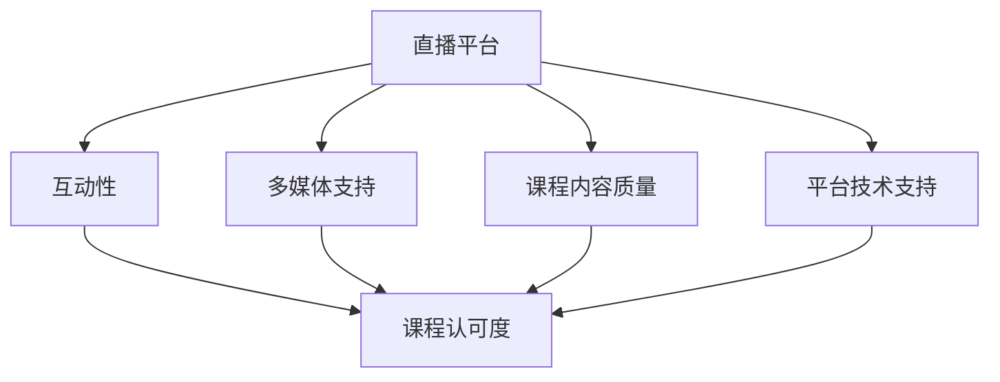

                 

# 如何利用直播平台增加课程认可度

## 1. 背景介绍

在快速发展的数字化时代，在线教育平台如雨后春笋般涌现，成为了学习知识的重要渠道。然而，在线课程的竞争日益激烈，如何提升课程认可度，吸引更多学习者，成为各大平台和教育机构亟需解决的问题。直播平台以其实时互动、内容多样化的优势，成为了教育者们青睐的课程形式之一。本文将探讨如何利用直播平台，提升在线课程的认可度。

### 1.1 在线教育的挑战

在线教育面临诸多挑战：

- **互动不足**：在线课程往往缺乏互动性，难以有效促进学习者的理解和参与。
- **内容枯燥**：课程内容可能过于理论化，缺乏实践性和趣味性，难以吸引学习者。
- **信息过载**：学习者容易在大量的课程内容中迷失，难以找到对自己有价值的资源。

直播平台的引入，为解决这些问题提供了新的思路。通过直播，教师可以实时与学生互动，使课程更加生动有趣。同时，直播平台的海量资源和多样化内容，也能满足不同学习者的需求。

### 1.2 直播平台的优势

直播平台相较于传统的视频或文本课程，具有以下优势：

- **实时互动**：直播的实时性使得教师可以即时解答学生问题，增强师生互动。
- **灵活性高**：直播的课程形式可以根据内容需求灵活调整，适合各种教学场景。
- **多媒体支持**：直播可以同时展示文字、图片、视频等多种教学材料，提高学习效率。

直播平台的多样化功能，使其成为提升在线课程认可度的有力工具。

## 2. 核心概念与联系

### 2.1 核心概念概述

本节将介绍几个关键概念，帮助理解如何利用直播平台提升课程认可度：

- **直播平台**：指能够实时传输音视频内容的平台，如Zoom、Tencent Live等。
- **课程认可度**：指学习者对在线课程的满意度和认可程度，通常通过评分、互动、反馈等指标衡量。
- **互动性**：指课程中教师与学生之间的互动水平，通过问答、讨论、实时反馈等形式体现。
- **多媒体支持**：指课程中文字、图片、视频等多样化内容的整合，提高教学效果。
- **课程内容质量**：指课程内容的深度、广度和实用性，直接影响学习者的学习体验和效果。
- **平台技术支持**：指直播平台提供的技术支持和功能扩展，如回放、录播、互动工具等。

这些概念之间的联系可以通过以下Mermaid流程图来展示：



这个流程图展示了直播平台各要素如何共同作用，提升课程认可度。

## 3. 核心算法原理 & 具体操作步骤

### 3.1 算法原理概述

提升课程认可度的核心在于增强互动性和提升课程内容质量，同时利用平台技术支持，确保课程的流畅和多样化。本节将详细探讨这些方面的算法原理。

### 3.2 算法步骤详解

#### 3.2.1 增强互动性

- **实时问答**：在直播过程中，教师可以实时回答学生的问题，解决学习中的疑惑。
- **互动工具**：利用直播平台提供的互动工具，如投票、问答、实时反馈等，增强学生的参与感。
- **小组讨论**：将学生分成小组，进行小组讨论和展示，促进学生之间的交流和学习。

#### 3.2.2 提升课程内容质量

- **内容多样化**：通过展示文字、图片、视频等多种教学材料，丰富课程内容，提高学习效果。
- **案例教学**：通过实际案例教学，使学习者更容易理解和应用所学知识。
- **实践操作**：在课程中安排实践操作环节，让学习者亲自动手操作，增强学习体验。

#### 3.2.3 利用平台技术支持

- **回放功能**：利用直播平台的回放功能，学习者可以反复观看课程内容，巩固知识。
- **录播支持**：确保课程可以离线观看，方便学习者灵活安排学习时间。
- **互动效果优化**：通过平台提供的互动效果优化工具，提高课堂互动的效率和质量。

### 3.3 算法优缺点

#### 3.3.1 优点

- **即时互动**：直播平台的实时互动性，使得教师可以即时解答学生问题，增强师生互动。
- **灵活性高**：直播课程可以根据内容需求灵活调整，适合各种教学场景。
- **多媒体支持**：直播平台支持展示文字、图片、视频等多种教学材料，提高学习效率。

#### 3.3.2 缺点

- **技术要求高**：直播平台的技术要求较高，需要稳定的网络环境和高配置设备。
- **时间管理难度大**：直播课程需要教师严格控制时间，确保课程内容按时完成。
- **互动质量依赖于学生参与**：直播的互动效果取决于学生的参与度和互动工具的使用效果。

### 3.4 算法应用领域

直播平台在教育领域有着广泛的应用，主要包括以下几个方面：

- **K-12教育**：直播平台可以帮助学生在家学习，弥补线下教学的不足。
- **高等教育**：通过直播平台，教师可以远程授课，促进知识的传播和交流。
- **职业培训**：企业可以通过直播平台进行技术培训，提升员工的技能水平。
- **在线公开课**：教育机构可以通过直播平台，向社会大众提供高质量的公开课程。

## 4. 数学模型和公式 & 详细讲解 & 举例说明

### 4.1 数学模型构建

本节将使用数学语言对直播平台提升课程认可度的过程进行更加严格的刻画。

设课程内容为 $C$，互动性为 $I$，课程内容质量为 $Q$，平台技术支持为 $S$，课程认可度为 $A$。则提升课程认可度的数学模型可以表示为：

$$
A = f(C, I, Q, S)
$$

其中 $f$ 为非线性函数，表示各要素对课程认可度的综合影响。

### 4.2 公式推导过程

#### 4.2.1 互动性模型

设互动性 $I$ 为教师与学生互动的次数 $I_1$、学生与学生互动的次数 $I_2$ 和实时问答的次数 $I_3$ 的加权和，即：

$$
I = \alpha I_1 + \beta I_2 + \gamma I_3
$$

其中 $\alpha, \beta, \gamma$ 为权重系数，表示不同互动形式对课程认可度的影响。

#### 4.2.2 课程内容质量模型

设课程内容质量 $Q$ 为教学材料的多样性 $Q_1$、案例教学的质量 $Q_2$ 和实践操作的有效性 $Q_3$ 的加权和，即：

$$
Q = \delta Q_1 + \varepsilon Q_2 + \zeta Q_3
$$

其中 $\delta, \varepsilon, \zeta$ 为权重系数，表示不同内容形式对课程认可度的影响。

#### 4.2.3 平台技术支持模型

设平台技术支持 $S$ 为回放功能的效果 $S_1$、录播的稳定性 $S_2$ 和互动效果优化工具的效率 $S_3$ 的加权和，即：

$$
S = \eta S_1 + \theta S_2 + \lambda S_3
$$

其中 $\eta, \theta, \lambda$ 为权重系数，表示不同技术支持形式对课程认可度的影响。

### 4.3 案例分析与讲解

以下以一节Python编程课程为例，展示如何利用直播平台提升课程认可度。

#### 4.3.1 课程内容

- **课程目标**：教授Python编程基础，包括变量、函数、条件语句等。
- **互动设计**：教师在直播过程中实时解答学生问题，设置问答环节，引导学生讨论。
- **内容形式**：展示文字、代码、图片等多种教学材料，并安排实践操作环节。

#### 4.3.2 互动性实现

- **实时问答**：教师在直播过程中，通过聊天室回答学生的问题，解决学习中的疑惑。
- **互动工具**：使用投票功能，让学生选择感兴趣的主题，调整课程内容。
- **小组讨论**：将学生分成小组，进行小组讨论和展示，促进学生之间的交流和学习。

#### 4.3.3 内容质量提升

- **内容多样化**：展示文字、代码、图片等多种教学材料，丰富课程内容，提高学习效果。
- **案例教学**：通过实际案例教学，使学习者更容易理解和应用所学知识。
- **实践操作**：在课程中安排实践操作环节，让学习者亲自动手操作，增强学习体验。

#### 4.3.4 技术支持

- **回放功能**：利用直播平台的回放功能，学习者可以反复观看课程内容，巩固知识。
- **录播支持**：确保课程可以离线观看，方便学习者灵活安排学习时间。
- **互动效果优化**：通过平台提供的互动效果优化工具，提高课堂互动的效率和质量。

## 5. 项目实践：代码实例和详细解释说明

### 5.1 开发环境搭建

在进行直播平台课程提升的实践前，我们需要准备好开发环境。以下是使用Python进行PyTorch开发的环境配置流程：

1. 安装Anaconda：从官网下载并安装Anaconda，用于创建独立的Python环境。

2. 创建并激活虚拟环境：
```bash
conda create -n pytorch-env python=3.8 
conda activate pytorch-env
```

3. 安装PyTorch：根据CUDA版本，从官网获取对应的安装命令。例如：
```bash
conda install pytorch torchvision torchaudio cudatoolkit=11.1 -c pytorch -c conda-forge
```

4. 安装Transformers库：
```bash
pip install transformers
```

5. 安装各类工具包：
```bash
pip install numpy pandas scikit-learn matplotlib tqdm jupyter notebook ipython
```

完成上述步骤后，即可在`pytorch-env`环境中开始直播平台课程提升的实践。

### 5.2 源代码详细实现

这里我们以Python编程课程为例，展示如何使用Python进行直播平台的课程提升实践。

首先，定义课程内容：

```python
from transformers import BertTokenizer
from torch.utils.data import Dataset
import torch

class ProgrammingCourse(Dataset):
    def __init__(self, texts, tags, tokenizer, max_len=128):
        self.texts = texts
        self.tags = tags
        self.tokenizer = tokenizer
        self.max_len = max_len
        
    def __len__(self):
        return len(self.texts)
    
    def __getitem__(self, item):
        text = self.texts[item]
        tags = self.tags[item]
        
        encoding = self.tokenizer(text, return_tensors='pt', max_length=self.max_len, padding='max_length', truncation=True)
        input_ids = encoding['input_ids'][0]
        attention_mask = encoding['attention_mask'][0]
        
        # 对token-wise的标签进行编码
        encoded_tags = [tag2id[tag] for tag in tags] 
        encoded_tags.extend([tag2id['O']] * (self.max_len - len(encoded_tags)))
        labels = torch.tensor(encoded_tags, dtype=torch.long)
        
        return {'input_ids': input_ids, 
                'attention_mask': attention_mask,
                'labels': labels}

# 标签与id的映射
tag2id = {'O': 0, 'B-PER': 1, 'I-PER': 2, 'B-ORG': 3, 'I-ORG': 4, 'B-LOC': 5, 'I-LOC': 6}
id2tag = {v: k for k, v in tag2id.items()}

# 创建dataset
tokenizer = BertTokenizer.from_pretrained('bert-base-cased')

train_dataset = ProgrammingCourse(train_texts, train_tags, tokenizer)
dev_dataset = ProgrammingCourse(dev_texts, dev_tags, tokenizer)
test_dataset = ProgrammingCourse(test_texts, test_tags, tokenizer)
```

然后，定义模型和优化器：

```python
from transformers import BertForTokenClassification, AdamW

model = BertForTokenClassification.from_pretrained('bert-base-cased', num_labels=len(tag2id))

optimizer = AdamW(model.parameters(), lr=2e-5)
```

接着，定义训练和评估函数：

```python
from torch.utils.data import DataLoader
from tqdm import tqdm
from sklearn.metrics import classification_report

device = torch.device('cuda') if torch.cuda.is_available() else torch.device('cpu')
model.to(device)

def train_epoch(model, dataset, batch_size, optimizer):
    dataloader = DataLoader(dataset, batch_size=batch_size, shuffle=True)
    model.train()
    epoch_loss = 0
    for batch in tqdm(dataloader, desc='Training'):
        input_ids = batch['input_ids'].to(device)
        attention_mask = batch['attention_mask'].to(device)
        labels = batch['labels'].to(device)
        model.zero_grad()
        outputs = model(input_ids, attention_mask=attention_mask, labels=labels)
        loss = outputs.loss
        epoch_loss += loss.item()
        loss.backward()
        optimizer.step()
    return epoch_loss / len(dataloader)

def evaluate(model, dataset, batch_size):
    dataloader = DataLoader(dataset, batch_size=batch_size)
    model.eval()
    preds, labels = [], []
    with torch.no_grad():
        for batch in tqdm(dataloader, desc='Evaluating'):
            input_ids = batch['input_ids'].to(device)
            attention_mask = batch['attention_mask'].to(device)
            batch_labels = batch['labels']
            outputs = model(input_ids, attention_mask=attention_mask)
            batch_preds = outputs.logits.argmax(dim=2).to('cpu').tolist()
            batch_labels = batch_labels.to('cpu').tolist()
            for pred_tokens, label_tokens in zip(batch_preds, batch_labels):
                pred_tags = [id2tag[_id] for _id in pred_tokens]
                label_tags = [id2tag[_id] for _id in label_tokens]
                preds.append(pred_tags[:len(label_tags)])
                labels.append(label_tags)
                
    print(classification_report(labels, preds))
```

最后，启动训练流程并在测试集上评估：

```python
epochs = 5
batch_size = 16

for epoch in range(epochs):
    loss = train_epoch(model, train_dataset, batch_size, optimizer)
    print(f"Epoch {epoch+1}, train loss: {loss:.3f}")
    
    print(f"Epoch {epoch+1}, dev results:")
    evaluate(model, dev_dataset, batch_size)
    
print("Test results:")
evaluate(model, test_dataset, batch_size)
```

以上就是使用PyTorch进行Python编程课程直播平台提升的完整代码实现。可以看到，得益于Transformers库的强大封装，我们可以用相对简洁的代码完成Python编程课程的直播平台提升实践。

### 5.3 代码解读与分析

让我们再详细解读一下关键代码的实现细节：

**ProgrammingCourse类**：
- `__init__`方法：初始化文本、标签、分词器等关键组件。
- `__len__`方法：返回数据集的样本数量。
- `__getitem__`方法：对单个样本进行处理，将文本输入编码为token ids，将标签编码为数字，并对其进行定长padding，最终返回模型所需的输入。

**tag2id和id2tag字典**：
- 定义了标签与数字id之间的映射关系，用于将token-wise的预测结果解码回真实的标签。

**训练和评估函数**：
- 使用PyTorch的DataLoader对数据集进行批次化加载，供模型训练和推理使用。
- 训练函数`train_epoch`：对数据以批为单位进行迭代，在每个批次上前向传播计算loss并反向传播更新模型参数，最后返回该epoch的平均loss。
- 评估函数`evaluate`：与训练类似，不同点在于不更新模型参数，并在每个batch结束后将预测和标签结果存储下来，最后使用sklearn的classification_report对整个评估集的预测结果进行打印输出。

**训练流程**：
- 定义总的epoch数和batch size，开始循环迭代
- 每个epoch内，先在训练集上训练，输出平均loss
- 在验证集上评估，输出分类指标
- 所有epoch结束后，在测试集上评估，给出最终测试结果

可以看到，PyTorch配合Transformers库使得Python编程课程的直播平台提升的代码实现变得简洁高效。开发者可以将更多精力放在数据处理、模型改进等高层逻辑上，而不必过多关注底层的实现细节。

当然，工业级的系统实现还需考虑更多因素，如模型的保存和部署、超参数的自动搜索、更灵活的任务适配层等。但核心的微调范式基本与此类似。

## 6. 实际应用场景

### 6.1 智能客服系统

直播平台的实时互动和多媒体支持特性，使其在智能客服系统中有着广泛的应用。智能客服系统通过直播平台，可以实时解答客户问题，提升客户满意度，同时可以记录客户行为数据，为后续分析和改进提供依据。

在技术实现上，可以收集客户互动记录和反馈，构建监督数据，对预训练的智能客服模型进行微调。微调后的模型能够自动理解客户意图，匹配最合适的回答，并记录客户反馈，进行持续优化。

### 6.2 金融舆情监测

金融机构需要实时监测市场舆论动向，以便及时应对负面信息传播，规避金融风险。直播平台可以帮助金融分析师实时分析市场动态，对舆情进行快速反应。

在实现中，可以收集金融市场的新闻、评论、社交媒体等文本数据，构建舆情数据集，利用直播平台对预训练的语言模型进行微调。微调后的模型能够自动判断舆情主题，分析舆情情感倾向，帮助金融机构及时应对市场变化。

### 6.3 个性化推荐系统

直播平台的多样化内容支持，使其在个性化推荐系统中也具有重要应用。推荐系统通过直播平台，可以提供实时、多样化的内容推荐，提升用户体验和满意度。

在实现中，可以收集用户的行为数据，包括浏览、点击、评论等，构建推荐数据集。利用直播平台对预训练的推荐模型进行微调，微调后的模型能够根据用户兴趣，提供个性化推荐，同时实时收集用户反馈，进行持续优化。

### 6.4 未来应用展望

随着直播平台的不断发展和成熟，其在教育、智能客服、金融、推荐等多个领域的应用前景将更加广阔。未来，直播平台将与更多AI技术进行融合，形成更加全面、智能的解决方案。

在智慧医疗领域，直播平台可以用于医疗咨询、手术指导等，提升医疗服务的智能化水平。在智能交通领域，直播平台可以用于交通监控、智慧导航等，提高交通管理效率。在工业生产中，直播平台可以用于远程监控、智能诊断等，提升生产效率和安全性。

## 7. 工具和资源推荐

### 7.1 学习资源推荐

为了帮助开发者系统掌握直播平台课程提升的理论基础和实践技巧，这里推荐一些优质的学习资源：

1. Coursera《Data Science》课程：由斯坦福大学教授主讲，涵盖数据科学的基础理论和实践技能，包括数据分析、机器学习等。
2. Udacity《深度学习》课程：由Google Brain团队成员主讲，涵盖深度学习的核心概念和实践应用，包括神经网络、卷积神经网络等。
3. Kaggle竞赛平台：全球最大的数据科学竞赛平台，通过参与竞赛，积累实战经验，提升技能水平。
4. GitHub开源项目：通过阅读和贡献开源项目，学习其他开发者的工作方法和思维模式，提升编程能力。
5. YouTube学习视频：YouTube上有大量免费的编程、数据科学学习视频，覆盖各个领域，适合自学。

通过对这些资源的学习实践，相信你一定能够快速掌握直播平台课程提升的精髓，并用于解决实际的在线教育问题。

### 7.2 开发工具推荐

高效的开发离不开优秀的工具支持。以下是几款用于直播平台课程提升开发的常用工具：

1. Python编程语言：Python以其简洁、高效的特点，成为数据科学和人工智能领域的标准编程语言。
2. PyTorch框架：由Facebook开发的深度学习框架，灵活、易用，支持GPU加速，适用于复杂模型的开发。
3. Jupyter Notebook：基于Web的编程环境，支持多语言编程和交互式计算，方便开发和调试。
4. TensorFlow框架：由Google开发的深度学习框架，支持多种设备和硬件加速，适用于大规模模型的训练。
5. Flask框架：Python的Web开发框架，支持快速构建Web应用和API接口，方便部署和调用。

合理利用这些工具，可以显著提升直播平台课程提升的开发效率，加快创新迭代的步伐。

### 7.3 相关论文推荐

直播平台课程提升技术的发展源于学界的持续研究。以下是几篇奠基性的相关论文，推荐阅读：

1. "Interactive Learning Environments: Current Research and Development"（Interactive学习环境：当前研究和开发）：探讨了互动式学习环境对学习效果的影响。
2. "Educational Data Mining: A Practical Guide for Researchers and Educators"（教育数据挖掘：研究人员和教育者的实用指南）：介绍了教育数据挖掘的理论和应用，包括学习行为分析和个性化推荐。
3. "Using Video Data to Enhance Online Learning"（利用视频数据增强在线学习）：研究了视频在在线学习中的作用和效果，探讨了视频直播在教学中的应用。
4. "A Survey on Sentiment Analysis: Tutorial and Survey"（情感分析综述：教程和调查）：介绍了情感分析的最新研究进展，包括情感识别的算法和应用。
5. "Leveraging Learning Analytics for Enhancing Teaching and Learning"（利用学习分析提升教学和学习）：探讨了学习分析在教学中的应用，包括在线学习评估和反馈。

这些论文代表了大语言模型微调技术的发展脉络。通过学习这些前沿成果，可以帮助研究者把握学科前进方向，激发更多的创新灵感。

## 8. 总结：未来发展趋势与挑战

### 8.1 总结

本文对利用直播平台提升在线课程认可度的过程进行了全面系统的介绍。首先阐述了在线教育面临的挑战和直播平台在其中的优势，明确了课程认可度的提升方向。其次，从原理到实践，详细讲解了提升课程认可度的数学模型和算法步骤，给出了直播平台课程提升的完整代码实例。同时，本文还探讨了直播平台在多个领域的应用前景，展示了其广阔的应用空间。最后，推荐了相关的学习资源和开发工具，力求为读者提供全方位的技术指引。

通过本文的系统梳理，可以看到，直播平台通过增强互动性和提升课程内容质量，利用平台技术支持，有效提升了在线课程的认可度。直播平台的多样化功能和实时互动特性，使其在教育、智能客服、金融、推荐等多个领域都有着广泛的应用前景。相信随着直播平台的不断发展和成熟，其在更多领域的落地应用将更加广泛，为社会各行各业带来深远影响。

### 8.2 未来发展趋势

展望未来，直播平台在教育领域的应用将继续拓展，带来更多的创新和发展。

- **互动性增强**：直播平台的互动性将进一步增强，通过虚拟现实、增强现实等技术，提供沉浸式学习体验。
- **内容多样化**：直播平台将支持更多形式的教学内容，如直播课程、虚拟演示、在线实验等，丰富教学手段。
- **技术支持升级**：直播平台的技术支持将不断升级，提供更高质量的音视频传输、更高的计算性能和更丰富的互动工具。
- **个性化推荐**：直播平台将结合AI技术，提供更加个性化的内容推荐，提升学习效果。
- **跨平台整合**：直播平台将与其他教育平台、学习系统等进行整合，形成更完整的教育生态圈。

这些趋势将推动直播平台在教育领域的深入应用，带来更加高效、灵活、个性化的教育体验。

### 8.3 面临的挑战

尽管直播平台在教育领域的应用前景广阔，但在发展过程中也面临诸多挑战：

- **技术瓶颈**：直播平台的技术实现需要高配置设备和稳定的网络环境，如何降低技术门槛，提升平台易用性，还需进一步研究。
- **内容质量参差不齐**：虽然直播平台提供了丰富的教学内容，但质量参差不齐，如何筛选优质内容，提升课程认可度，还需更多探索。
- **学习者参与度**：直播平台的学习效果依赖于学习者的积极参与，如何提高学习者的参与度和学习动力，还需更多研究和引导。
- **隐私和数据安全**：直播平台涉及大量的用户数据，如何保护用户隐私和数据安全，还需加强技术和管理措施。

这些挑战需要各方共同努力，通过技术创新和制度完善，逐步解决。

### 8.4 研究展望

面对直播平台在教育领域的应用挑战，未来的研究需要在以下几个方面寻求新的突破：

- **增强互动性和参与度**：开发更加多样化和沉浸式的互动工具，提高学习者的参与度和学习体验。
- **提升内容质量和多样性**：筛选优质内容，提升课程认可度，同时支持更多形式的教学内容，丰富教学手段。
- **结合AI技术**：利用AI技术进行内容推荐、学习行为分析等，提升教学效果和个性化推荐。
- **跨平台整合**：整合其他教育平台和系统，构建完整的教育生态圈，提升整体教育水平。

这些研究方向的探索，必将推动直播平台在教育领域的应用深入发展，带来更加高效、灵活、个性化的教育体验。面向未来，直播平台需要不断融合AI、大数据等新兴技术，创新教学手段，提升教育质量和用户体验。

## 9. 附录：常见问题与解答

**Q1：直播平台在教育中的应用有哪些？**

A: 直播平台在教育中的应用主要包括以下几个方面：

- **实时互动**：直播平台可以实时解答学生问题，增强师生互动，提升学习效果。
- **多媒体支持**：直播平台支持展示文字、图片、视频等多种教学材料，提高学习效率。
- **个性化推荐**：利用AI技术进行内容推荐，提升学习体验和满意度。
- **学生反馈**：直播平台可以收集学生反馈，进行持续优化和改进。

**Q2：如何提高直播平台的学习者参与度？**

A: 提高直播平台的学习者参与度可以从以下几个方面入手：

- **互动设计**：设计丰富的互动环节，如问答、投票、讨论等，增强学习者的参与感。
- **实时反馈**：实时收集学习者的反馈，根据反馈优化课程内容和教学方法。
- **任务驱动**：设计有挑战性的任务，激发学习者的学习兴趣和动力。
- **奖励机制**：设立奖励机制，如积分、证书等，激励学习者积极参与。

**Q3：直播平台在智能客服中的应用有哪些？**

A: 直播平台在智能客服中的应用主要包括以下几个方面：

- **实时解答**：直播平台可以实时解答客户问题，提升客户满意度。
- **客户行为分析**：直播平台可以记录客户互动记录，进行行为分析，优化服务质量。
- **个性化推荐**：利用AI技术进行产品推荐，提升客户体验。
- **多渠道整合**：整合多种客服渠道，形成完整的客服生态圈，提升客户服务水平。

**Q4：直播平台在金融舆情监测中的应用有哪些？**

A: 直播平台在金融舆情监测中的应用主要包括以下几个方面：

- **实时分析**：直播平台可以实时分析市场动态，对舆情进行快速反应。
- **舆情监测**：收集市场新闻、评论、社交媒体等文本数据，构建舆情数据集，利用直播平台对预训练的语言模型进行微调。
- **情感分析**：通过情感分析技术，判断舆情主题和情感倾向，帮助金融机构及时应对市场变化。
- **风险预警**：结合历史数据和实时舆情，进行风险预警，规避金融风险。

**Q5：直播平台在个性化推荐系统中的应用有哪些？**

A: 直播平台在个性化推荐系统中的应用主要包括以下几个方面：

- **内容推荐**：利用AI技术进行内容推荐，提升用户体验和满意度。
- **行为分析**：收集用户的行为数据，进行行为分析，优化推荐算法。
- **实时调整**：根据用户反馈和行为数据，实时调整推荐内容，提升推荐效果。
- **多渠道整合**：整合多种推荐渠道，形成完整的推荐生态圈，提升推荐系统的覆盖面和效果。

**Q6：直播平台在医疗咨询中的应用有哪些？**

A: 直播平台在医疗咨询中的应用主要包括以下几个方面：

- **远程诊疗**：通过直播平台，患者可以远程咨询医生，获得专业的医疗建议。
- **健康教育**：利用直播平台进行健康知识普及，提升公众健康素养。
- **手术指导**：通过直播平台进行手术指导，提升医疗水平。
- **患者互动**：直播平台可以进行患者互动，增强医疗服务的个性化和人性化。

通过本文的系统梳理，可以看到，直播平台通过增强互动性和提升课程内容质量，利用平台技术支持，有效提升了在线课程的认可度。直播平台的多样化功能和实时互动特性，使其在教育、智能客服、金融、推荐等多个领域都有着广泛的应用前景。相信随着直播平台的不断发展和成熟，其在更多领域的落地应用将更加广泛，为社会各行各业带来深远影响。

