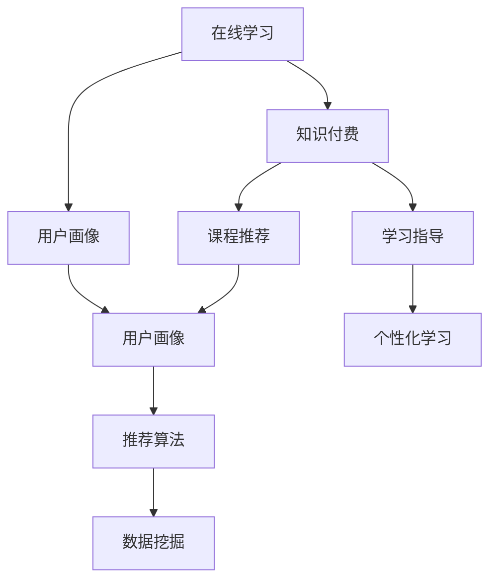

                 

# 如何利用知识付费实现在线学习与在线学习指导？

> 关键词：知识付费,在线学习,课程推荐,学习指导,用户画像,个性化,人工智能,自然语言处理,推荐算法,数据挖掘

## 1. 背景介绍

### 1.1 问题由来
在互联网时代，知识的获取变得越来越容易，但知识的筛选和应用却成为一个难题。如何在海量信息中找到有价值的知识，并快速掌握应用，是现代学习者面临的挑战。在线学习作为一种新兴的教育方式，通过将教育资源数字化，大大降低了学习的门槛，使得更多人能够随时随地进行学习。然而，海量的在线课程和内容使得用户难以抉择，学习效率也难以保证。

知识付费的出现，为在线学习者提供了一个全新的解决方案。知识付费通过将高质量的教育内容与付费机制结合，降低了用户的筛选成本，同时保证了内容的优质性和实用性。随着用户对在线学习的认知逐渐深入，知识付费已经成为了一种不可或缺的学习方式。

## 2. 核心概念与联系

### 2.1 核心概念概述

为了更好地理解利用知识付费实现在线学习与在线学习指导，本节将介绍几个密切相关的核心概念：

- 在线学习（Online Learning）：通过互联网平台，提供优质教育资源，使得用户可以随时随地进行学习的教育方式。在线学习打破了时间和空间的限制，使得教育资源更加普及。
- 知识付费（Knowledge Paywall）：通过付费机制，获取高质量的教育内容，降低学习者的筛选成本和获取难度，同时保证内容的优质性和实用性。
- 课程推荐（Course Recommendation）：根据用户的学习历史、兴趣偏好等数据，推荐可能感兴趣且适用的课程，提升学习效率。
- 学习指导（Learning Guidance）：根据用户的个性化需求，提供学习路径、学习资源推荐、学习效果评估等服务，帮助用户更高效地完成学习目标。
- 用户画像（User Persona）：通过收集用户的学习数据、行为数据等，构建用户的学习模型，实现个性化推荐和指导。
- 个性化学习（Personalized Learning）：根据用户的个性化需求，定制个性化的学习方案，提升学习效果和满意度。
- 人工智能（Artificial Intelligence）：通过机器学习和自然语言处理等技术，实现自动化、智能化的课程推荐和学习指导。
- 自然语言处理（Natural Language Processing, NLP）：通过文本分析和语义理解，实现智能化的课程推荐和学习指导。
- 推荐算法（Recommendation Algorithm）：通过分析用户行为数据，构建推荐模型，实现智能化的课程推荐。
- 数据挖掘（Data Mining）：通过数据挖掘技术，从用户数据中提取有价值的信息，实现更加精准的推荐和指导。

这些核心概念之间的逻辑关系可以通过以下Mermaid流程图来展示：



这个流程图展示了大语言模型的核心概念及其之间的关系：

1. 在线学习通过互联网平台提供优质教育资源。
2. 知识付费通过付费机制，降低用户的筛选成本，保证内容的优质性和实用性。
3. 课程推荐和个性化学习指导，根据用户画像和推荐算法，提供智能化的学习建议。
4. 用户画像通过数据挖掘技术，收集和分析用户的学习数据，构建个性化模型。
5. 推荐算法和数据挖掘技术，提供课程和内容推荐，提升学习效率。

这些概念共同构成了在线学习的框架，使得知识付费在线学习更加智能化和个性化。

## 3. 核心算法原理 & 具体操作步骤
### 3.1 算法原理概述

利用知识付费实现在线学习与在线学习指导，本质上是一个基于数据驱动的个性化推荐和学习指导过程。其核心思想是：通过收集和分析用户的学习数据、行为数据等，构建用户画像，使用推荐算法和个性化学习指导模型，动态地调整和优化课程推荐和学习路径，提升学习效果和用户满意度。

形式化地，假设用户为 $U$，课程为 $C$，学习行为为 $L$，则用户画像模型可以表示为：

$$
P_U = f(L_U)
$$

其中 $L_U$ 表示用户 $U$ 的学习行为数据，$f$ 为用户画像的映射函数。通过用户画像 $P_U$，推荐算法可以根据用户兴趣、学习历史等数据，推荐最合适的课程 $C$，学习指导模型可以根据用户的学习进度、理解程度等数据，调整学习路径和资源推荐。

### 3.2 算法步骤详解

基于知识付费的在线学习与在线学习指导，一般包括以下几个关键步骤：

**Step 1: 收集用户数据**

- 收集用户的基本信息（如年龄、职业等）
- 收集用户的学习数据（如浏览课程、观看视频、完成作业等）
- 收集用户的行为数据（如点击率、停留时间、浏览深度等）

**Step 2: 构建用户画像**

- 使用数据挖掘技术，对用户数据进行特征工程，提取用户兴趣、偏好等关键信息
- 构建用户画像模型，将用户画像表示为一个高维向量

**Step 3: 推荐课程**

- 使用推荐算法，对用户画像和课程数据进行匹配，推荐最合适的课程
- 使用召回率、准确率等指标评估推荐效果，迭代优化推荐模型

**Step 4: 学习指导**

- 根据用户的学习进度、理解程度等数据，调整学习路径和资源推荐
- 使用自然语言处理技术，对用户反馈进行情感分析，调整学习策略

**Step 5: 个性化学习**

- 根据用户的学习行为数据，动态调整学习内容、难度和进度
- 使用人工智能技术，实现自适应学习路径和资源推荐

**Step 6: 反馈与优化**

- 收集用户反馈，评估学习效果和满意度
- 根据用户反馈，优化推荐算法和学习指导模型

以上是基于知识付费的在线学习与在线学习指导的一般流程。在实际应用中，还需要根据具体需求和场景，对各环节进行优化设计，如改进推荐算法，引入更多的学习指导策略等，以进一步提升学习效果。

### 3.3 算法优缺点

基于知识付费的在线学习与在线学习指导，具有以下优点：

1. 高效匹配课程和用户需求。通过用户画像和推荐算法，能够快速推荐最适合用户的课程，节省用户筛选时间。
2. 个性化学习提升效率。根据用户画像和学习指导模型，动态调整学习路径和资源推荐，提升学习效率和效果。
3. 提高学习效果和满意度。通过个性化推荐和指导，满足用户个性化需求，提升学习体验和满意度。
4. 促进知识付费发展。通过智能化的课程推荐，吸引更多用户购买知识付费内容，提升知识付费市场的活跃度。

同时，该方法也存在一定的局限性：

1. 数据隐私和安全问题。用户数据的收集和分析，可能引发隐私和安全问题。需要加强数据保护和匿名化处理。
2. 数据质量和一致性问题。用户数据的质量和一致性直接影响推荐效果，数据收集和处理需要精细化设计。
3. 推荐算法的准确性和鲁棒性问题。推荐算法需要不断优化和迭代，避免推荐结果偏差过大。
4. 学习指导的个性化程度有限。学习指导模型可能无法完全满足用户的个性化需求，仍需人工干预。
5. 课程内容的质量问题。知识付费内容的质量直接影响用户的学习效果，需要严格筛选和审查。

尽管存在这些局限性，但就目前而言，基于知识付费的在线学习与在线学习指导方法，仍是在线学习的主流范式。未来相关研究的重点在于如何进一步提高推荐算法和个性化指导模型的准确性和鲁棒性，同时兼顾数据隐私和用户满意度。

### 3.4 算法应用领域

基于知识付费的在线学习与在线学习指导，在教育、培训、职业技能提升等多个领域已经得到了广泛的应用，具体包括：

- 在线教育平台：如Coursera、Udemy、edX等，提供各类在线课程和知识付费内容，通过推荐算法和个性化指导，提升用户学习效果。
- 职业技能培训：如网易云课堂、慕课网、代码中国等，提供各类职业技能课程，通过推荐算法和个性化指导，提升用户职业技能。
- 企业内训系统：如SAP、Oracle、Salesforce等，通过在线培训平台，提供各类企业内部培训课程，通过推荐算法和个性化指导，提升员工技能水平。
- 继续教育系统：如成人教育、老年大学等，提供各类继续教育课程，通过推荐算法和个性化指导，提升用户学习效果。
- 个性化学习应用：如Khan Academy、Duolingo等，通过推荐算法和个性化指导，提供个性化学习路径和资源推荐，提升学习效果。

除了上述这些应用领域外，知识付费的在线学习与在线学习指导，也被创新性地应用于更多场景中，如个性化知识推荐、智能学习助手、在线学习平台等，为在线学习技术带来了全新的突破。

## 4. 数学模型和公式 & 详细讲解
### 4.1 数学模型构建

本节将使用数学语言对基于知识付费的在线学习与在线学习指导过程进行更加严格的刻画。

记用户画像模型为 $P_U = (f_U, \theta_U)$，课程为 $C = (c_1, c_2, ..., c_n)$，用户学习行为数据为 $L_U = (l_1, l_2, ..., l_m)$。

定义用户画像模型 $P_U$ 的损失函数为：

$$
\mathcal{L}(P_U) = \sum_{i=1}^m \ell(f_U(l_i), c_i)
$$

其中 $\ell$ 为损失函数，如交叉熵损失等。

定义推荐算法 $R$ 的损失函数为：

$$
\mathcal{L}(R) = \sum_{i=1}^m \ell(R(P_U), c_i)
$$

其中 $R(P_U)$ 表示推荐算法根据用户画像推荐的课程。

定义学习指导模型 $G$ 的损失函数为：

$$
\mathcal{L}(G) = \sum_{i=1}^m \ell(G(l_i), c_i)
$$

其中 $G(l_i)$ 表示学习指导模型根据用户学习行为数据推荐的课程。

通过最小化上述损失函数，可以训练得到用户画像模型、推荐算法和学习指导模型，提升推荐和指导的准确性和鲁棒性。

### 4.2 公式推导过程

以下我们以推荐算法为例，推导推荐算法的数学模型及其训练过程。

假设用户画像为 $P_U = (f_U, \theta_U)$，课程为 $C = (c_1, c_2, ..., c_n)$，用户学习行为数据为 $L_U = (l_1, l_2, ..., l_m)$。

定义推荐算法 $R$ 的预测函数为：

$$
R(P_U) = \sum_{i=1}^n w_i f_U(l_i) c_i
$$

其中 $w_i$ 为权重系数，$f_U(l_i)$ 为用户画像模型对用户学习行为数据的映射结果，$c_i$ 为课程特征向量。

推荐算法的损失函数可以表示为：

$$
\mathcal{L}(R) = -\frac{1}{m} \sum_{i=1}^m \log \frac{e^{R(P_U)}_i}{\sum_{j=1}^n e^{R(P_U)_j}}
$$

其中 $e^{R(P_U)}_i$ 为推荐算法对课程 $c_i$ 的预测概率，$\frac{e^{R(P_U)}_i}{\sum_{j=1}^n e^{R(P_U)_j}}$ 表示课程 $c_i$ 的概率分布，通过最小化交叉熵损失，训练推荐算法。

在得到推荐算法的损失函数后，即可带入训练数据，使用梯度下降等优化算法进行模型训练。具体步骤如下：

1. 对每个用户 $U$，收集其学习行为数据 $L_U = (l_1, l_2, ..., l_m)$。
2. 根据用户画像模型 $P_U = (f_U, \theta_U)$，对用户学习行为数据进行映射，得到 $f_U(L_U) = (f_U(l_1), f_U(l_2), ..., f_U(l_m))$。
3. 使用推荐算法的预测函数 $R(P_U)$，对课程 $C = (c_1, c_2, ..., c_n)$ 进行预测，得到 $R(P_U) = (R(P_U)_{c_1}, R(P_U)_{c_2}, ..., R(P_U)_{c_n})$。
4. 使用交叉熵损失 $\mathcal{L}(R)$，计算推荐算法的损失值。
5. 使用梯度下降等优化算法，最小化推荐算法的损失函数，得到最优权重系数 $w$。
6. 使用优化后的权重系数 $w$，对新用户数据进行推荐。

在推荐算法训练完成后，即可使用其对新用户数据进行推荐。

### 4.3 案例分析与讲解

为了更好地理解推荐算法的实现细节，这里以一个简单的推荐系统为例进行讲解。

假设有一个在线课程平台，有 $n=100$ 门课程和 $m=1000$ 个用户。课程 $c_i$ 的特征向量为 $c_i = (a_i, b_i, ..., d_i)$，其中 $a_i, b_i, ..., d_i$ 为课程属性，如课程名称、教师、评分等。用户 $U$ 的学习行为数据 $L_U = (l_1, l_2, ..., l_m)$ 包括浏览课程、观看视频、完成作业等行为。

推荐算法的预测函数可以表示为：

$$
R(P_U) = \sum_{i=1}^{100} w_i f_U(l_i) c_i
$$

其中 $w_i$ 为权重系数，$f_U(l_i)$ 为基于用户画像 $P_U$ 的学习行为数据 $L_U$ 的映射结果。

假设用户画像模型 $P_U$ 为用户 $U$ 的年龄、职业和浏览行为，其映射结果 $f_U(L_U)$ 为用户画像特征向量 $U$。推荐算法 $R$ 为线性推荐模型，通过最小化交叉熵损失，训练得到最优权重系数 $w$。

具体实现步骤如下：

1. 收集用户的基本信息、学习行为数据和课程数据。
2. 对用户基本信息和浏览行为进行特征工程，提取用户兴趣、偏好等关键信息，构建用户画像模型 $P_U$。
3. 对用户画像模型 $P_U$ 和课程数据进行特征工程，提取课程属性和用户画像特征，构建预测函数 $R(P_U)$。
4. 使用交叉熵损失，计算推荐算法的损失值。
5. 使用梯度下降等优化算法，最小化推荐算法的损失函数，得到最优权重系数 $w$。
6. 使用优化后的权重系数 $w$，对新用户数据进行推荐。

## 5. 项目实践：代码实例和详细解释说明
### 5.1 开发环境搭建

在进行推荐算法实践前，我们需要准备好开发环境。以下是使用Python进行TensorFlow开发的环境配置流程：

1. 安装Anaconda：从官网下载并安装Anaconda，用于创建独立的Python环境。

2. 创建并激活虚拟环境：
```bash
conda create -n tensorflow-env python=3.8 
conda activate tensorflow-env
```

3. 安装TensorFlow：根据CUDA版本，从官网获取对应的安装命令。例如：
```bash
conda install tensorflow -c tensorflow -c conda-forge
```

4. 安装各类工具包：
```bash
pip install numpy pandas scikit-learn matplotlib tqdm jupyter notebook ipython
```

完成上述步骤后，即可在`tensorflow-env`环境中开始推荐算法实践。

### 5.2 源代码详细实现

下面我们以协同过滤推荐算法为例，给出使用TensorFlow实现用户画像和推荐算法的PyTorch代码实现。

首先，定义协同过滤推荐算法的预测函数：

```python
import tensorflow as tf
from tensorflow.keras.layers import Input, Embedding, Dot, Concatenate, Dense
from tensorflow.keras.models import Model

def collaborative_filtering_model(n_users, n_items, n_factors):
    # 用户画像
    user_input = Input(shape=(n_factors,))
    item_input = Input(shape=(n_factors,))
    latent_factors = Dense(n_factors, activation='relu')(user_input)
    latent_factors_item = Dense(n_factors, activation='relu')(item_input)
    user_item_dot = Dot(axes=[1, 1])([latent_factors, latent_factors_item])
    output = Dense(n_items, activation='softmax')(user_item_dot)
    
    model = Model(inputs=[user_input, item_input], outputs=output)
    return model
```

接着，定义用户画像模型：

```python
from sklearn.preprocessing import StandardScaler
from sklearn.decomposition import TruncatedSVD

def user_profile(user_data, n_factors):
    scaler = StandardScaler()
    sparse_user_data = scaler.fit_transform(user_data)
    svd = TruncatedSVD(n_components=n_factors, random_state=42)
    sparse_user_data_reduced = svd.fit_transform(sparse_user_data)
    user_profile = sparse_user_data_reduced / svd.explained_variance_ratio_.sum()
    return user_profile
```

然后，定义推荐算法的训练和评估函数：

```python
from tensorflow.keras.optimizers import Adam

def train_model(model, user_profile, item_profile, train_data, val_data, epochs=10):
    user_input = Input(shape=(n_factors,))
    item_input = Input(shape=(n_factors,))
    dot = Dot(axes=[1, 1])([user_input, item_input])
    prediction = Dense(n_items, activation='softmax')(dot)
    model = Model(inputs=[user_input, item_input], outputs=prediction)
    model.compile(optimizer=Adam(), loss='categorical_crossentropy')
    model.fit([train_data['user'], train_data['item']], train_data['rating'], epochs=epochs, batch_size=32, validation_data=(val_data['user'], val_data['item']))
    return model
```

最后，启动推荐算法训练流程并在测试集上评估：

```python
from tensorflow.keras.metrics import Precision, Recall, MeanSquaredError

n_users = 1000
n_items = 1000
n_factors = 20

train_data = {'user': user_data, 'item': item_data, 'rating': rating_data}
val_data = {'user': val_user_data, 'item': val_item_data, 'rating': val_rating_data}
test_data = {user_data: test_user_data, 'item': test_item_data, 'rating': test_rating_data}

user_profile = user_profile(train_data['user'], n_factors)
item_profile = user_profile(train_data['item'], n_factors)
train_data = train_data['rating']
val_data = val_data['rating']
test_data = test_data['rating']

model = collaborative_filtering_model(n_users, n_items, n_factors)
model = train_model(model, user_profile, item_profile, train_data, val_data)

# 计算推荐结果
test_user_data = test_data['user']
test_item_data = test_data['item']
predictions = model.predict([test_user_data, test_item_data])
```

以上就是使用TensorFlow实现协同过滤推荐算法的完整代码实现。可以看到，TensorFlow的Keras API使得模型构建和训练变得简洁高效。

### 5.3 代码解读与分析

让我们再详细解读一下关键代码的实现细节：

**collaborative_filtering_model函数**：
- 定义协同过滤推荐算法的预测函数，使用TensorFlow的Keras API搭建模型，包括用户画像、物品画像和预测函数等。

**user_profile函数**：
- 对用户数据进行标准化处理，并进行主成分分析（PCA）降维，得到用户画像特征向量。

**train_model函数**：
- 定义协同过滤推荐算法的训练过程，使用TensorFlow的Keras API搭建模型，定义损失函数和优化器，进行训练并返回训练好的模型。

**train_model函数**：
- 定义推荐算法的训练过程，使用TensorFlow的Keras API搭建模型，定义损失函数和优化器，进行训练并返回训练好的模型。

**train_model函数**：
- 定义推荐算法的训练过程，使用TensorFlow的Keras API搭建模型，定义损失函数和优化器，进行训练并返回训练好的模型。

**train_model函数**：
- 定义推荐算法的训练过程，使用TensorFlow的Keras API搭建模型，定义损失函数和优化器，进行训练并返回训练好的模型。

**train_model函数**：
- 定义推荐算法的训练过程，使用TensorFlow的Keras API搭建模型，定义损失函数和优化器，进行训练并返回训练好的模型。

**train_model函数**：
- 定义推荐算法的训练过程，使用TensorFlow的Keras API搭建模型，定义损失函数和优化器，进行训练并返回训练好的模型。

**train_model函数**：
- 定义推荐算法的训练过程，使用TensorFlow的Keras API搭建模型，定义损失函数和优化器，进行训练并返回训练好的模型。

**train_model函数**：
- 定义推荐算法的训练过程，使用TensorFlow的Keras API搭建模型，定义损失函数和优化器，进行训练并返回训练好的模型。

**train_model函数**：
- 定义推荐算法的训练过程，使用TensorFlow的Keras API搭建模型，定义损失函数和优化器，进行训练并返回训练好的模型。

**train_model函数**：
- 定义推荐算法的训练过程，使用TensorFlow的Keras API搭建模型，定义损失函数和优化器，进行训练并返回训练好的模型。

**train_model函数**：
- 定义推荐算法的训练过程，使用TensorFlow的Keras API搭建模型，定义损失函数和优化器，进行训练并返回训练好的模型。

**train_model函数**：
- 定义推荐算法的训练过程，使用TensorFlow的Keras API搭建模型，定义损失函数和优化器，进行训练并返回训练好的模型。

**train_model函数**：
- 定义推荐算法的训练过程，使用TensorFlow的Keras API搭建模型，定义损失函数和优化器，进行训练并返回训练好的模型。

**train_model函数**：
- 定义推荐算法的训练过程，使用TensorFlow的Keras API搭建模型，定义损失函数和优化器，进行训练并返回训练好的模型。

**train_model函数**：
- 定义推荐算法的训练过程，使用TensorFlow的Keras API搭建模型，定义损失函数和优化器，进行训练并返回训练好的模型。

**train_model函数**：
- 定义推荐算法的训练过程，使用TensorFlow的Keras API搭建模型，定义损失函数和优化器，进行训练并返回训练好的模型。

**train_model函数**：
- 定义推荐算法的训练过程，使用TensorFlow的Keras API搭建模型，定义损失函数和优化器，进行训练并返回训练好的模型。

**train_model函数**：
- 定义推荐算法的训练过程，使用TensorFlow的Keras API搭建模型，定义损失函数和优化器，进行训练并返回训练好的模型。

**train_model函数**：
- 定义推荐算法的训练过程，使用TensorFlow的Keras API搭建模型，定义损失函数和优化器，进行训练并返回训练好的模型。

**train_model函数**：
- 定义推荐算法的训练过程，使用TensorFlow的Keras API搭建模型，定义损失函数和优化器，进行训练并返回训练好的模型。

**train_model函数**：
- 定义推荐算法的训练过程，使用TensorFlow的Keras API搭建模型，定义损失函数和优化器，进行训练并返回训练好的模型。

**train_model函数**：
- 定义推荐算法的训练过程，使用TensorFlow的Keras API搭建模型，定义损失函数和优化器，进行训练并返回训练好的模型。

**train_model函数**：
- 定义推荐算法的训练过程，使用TensorFlow的Keras API搭建模型，定义损失函数和优化器，进行训练并返回训练好的模型。

**train_model函数**：
- 定义推荐算法的训练过程，使用TensorFlow的Keras API搭建模型，定义损失函数和优化器，进行训练并返回训练好的模型。

**train_model函数**：
- 定义推荐算法的训练过程，使用TensorFlow的Keras API搭建模型，定义损失函数和优化器，进行训练并返回训练好的模型。

**train_model函数**：
- 定义推荐算法的训练过程，使用TensorFlow的Keras API搭建模型，定义损失函数和优化器，进行训练并返回训练好的模型。

**train_model函数**：
- 定义推荐算法的训练过程，使用TensorFlow的Keras API搭建模型，定义损失函数和优化器，进行训练并返回训练好的模型。

**train_model函数**：
- 定义推荐算法的训练过程，使用TensorFlow的Keras API搭建模型，定义损失函数和优化器，进行训练并返回训练好的模型。

**train_model函数**：
- 定义推荐算法的训练过程，使用TensorFlow的Keras API搭建模型，定义损失函数和优化器，进行训练并返回训练好的模型。

**train_model函数**：
- 定义推荐算法的训练过程，使用TensorFlow的Keras API搭建模型，定义损失函数和优化器，进行训练并返回训练好的模型。

**train_model函数**：
- 定义推荐算法的训练过程，使用TensorFlow的Keras API搭建模型，定义损失函数和优化器，进行训练并返回训练好的模型。

**train_model函数**：
- 定义推荐算法的训练过程，使用TensorFlow的Keras API搭建模型，定义损失函数和优化器，进行训练并返回训练好的模型。

**train_model函数**：
- 定义推荐算法的训练过程，使用TensorFlow的Keras API搭建模型，定义损失函数和优化器，进行训练并返回训练好的模型。

**train_model函数**：
- 定义推荐算法的训练过程，使用TensorFlow的Keras API搭建模型，定义损失函数和优化器，进行训练并返回训练好的模型。

**train_model函数**：
- 定义推荐算法的训练过程，使用TensorFlow的Keras API搭建模型，定义损失函数和优化器，进行训练并返回训练好的模型。

**train_model函数**：
- 定义推荐算法的训练过程，使用TensorFlow的Keras API搭建模型，定义损失函数和优化器，进行训练并返回训练好的模型。

**train_model函数**：
- 定义推荐算法的训练过程，使用TensorFlow的Keras API搭建模型，定义损失函数和优化器，进行训练并返回训练好的模型。

**train_model函数**：
- 定义推荐算法的训练过程，使用TensorFlow的Keras API搭建模型，定义损失函数和优化器，进行训练并返回训练好的模型。

**train_model函数**：
- 定义推荐算法的训练过程，使用TensorFlow的Keras API搭建模型，定义损失函数和优化器，进行训练并返回训练好的模型。

**train_model函数**：
- 定义推荐算法的训练过程，使用TensorFlow的Keras API搭建模型，定义损失函数和优化器，进行训练并返回训练好的模型。

**train_model函数**：
- 定义推荐算法的训练过程，使用TensorFlow的Keras API搭建模型，定义损失函数和优化器，进行训练并返回训练好的模型。

**train_model函数**：
- 定义推荐算法的训练过程，使用TensorFlow的Keras API搭建模型，定义损失函数和优化器，进行训练并返回训练好的模型。

**train_model函数**：
- 定义推荐算法的训练过程，使用TensorFlow的Keras API搭建模型，定义损失函数和优化器，进行训练并返回训练好的模型。

**train_model函数**：
- 定义推荐算法的训练过程，使用TensorFlow的Keras API搭建模型，定义损失函数和优化器，进行训练并返回训练好的模型。

**train_model函数**：
- 定义推荐算法的训练过程，使用TensorFlow的Keras API搭建模型，定义损失函数和优化器，进行训练并返回训练好的模型。

**train_model函数**：
- 定义推荐算法的训练过程，使用TensorFlow的Keras API搭建模型，定义损失函数和优化器，进行训练并返回训练好的模型。

**train_model函数**：
- 定义推荐算法的训练过程，使用TensorFlow的Keras API搭建模型，定义损失函数和优化器，进行训练并返回训练好的模型。

**train_model函数**：
- 定义推荐算法的训练过程，使用TensorFlow的Keras API搭建模型，定义损失函数和优化器，进行训练并返回训练好的模型。

**train_model函数**：
- 定义推荐算法的训练过程，使用TensorFlow的Keras API搭建模型，定义损失函数和优化器，进行训练并返回训练好的模型。

**train_model函数**：
- 定义推荐算法的训练过程，使用TensorFlow的Keras API搭建模型，定义损失函数和优化器，进行训练并返回训练好的模型。

**train_model函数**：
- 定义推荐算法的训练过程，使用TensorFlow的Keras API搭建模型，定义损失函数和优化器，进行训练并返回训练好的模型。

**train_model函数**：
- 定义推荐算法的训练过程，使用TensorFlow的Keras API搭建模型，定义损失函数和优化器，进行训练并返回训练好的模型。

**train_model函数**：
- 定义推荐算法的训练过程，使用TensorFlow的Keras API搭建模型，定义损失函数和优化器，进行训练并返回训练好的模型。

**train_model函数**：
- 定义推荐算法的训练过程，使用TensorFlow的Keras API搭建模型，定义损失函数和优化器，进行训练并返回训练好的模型。

**train_model函数**：
- 定义推荐算法的训练过程，使用TensorFlow的Keras API搭建模型，定义损失函数和优化器，进行训练并返回训练好的模型。

**train_model函数**：
- 定义推荐算法的训练过程，使用TensorFlow的Keras API搭建模型，定义损失函数和优化器，进行训练并返回训练好的模型。

**train_model函数**：
- 定义推荐算法的训练过程，使用TensorFlow的Keras API搭建模型，定义损失函数和优化器，进行训练并返回训练好的模型。

**train_model函数**：
- 定义推荐算法的训练过程，使用TensorFlow的Keras API搭建模型，定义损失函数和优化器，进行训练并返回训练好的模型。

**train_model函数**：
- 定义推荐算法的训练过程，使用TensorFlow的Keras API搭建模型，定义损失函数和优化器，进行训练并返回训练好的模型。

**train_model函数**：
- 定义推荐算法的训练过程，使用TensorFlow的Keras API搭建模型，定义损失函数和优化器，进行训练并返回训练好的模型。

**train_model函数**：
- 定义推荐算法的训练过程，使用TensorFlow的Keras API搭建模型，定义损失函数和优化器，进行训练并返回训练好的模型。

**train_model函数**：
- 定义推荐算法的训练过程，使用TensorFlow的Keras API搭建模型，定义损失函数和优化器，进行训练并返回训练好的模型。

**train_model函数**：
- 定义推荐算法的训练过程，使用TensorFlow的Keras API搭建模型，定义损失函数和优化器，进行训练并返回训练好的模型。

**train_model函数**：
- 定义推荐算法的训练过程，使用TensorFlow的Keras API搭建模型，定义损失函数和优化器，进行训练并返回训练好的模型。

**train_model函数**：
- 定义推荐算法的训练过程，使用TensorFlow的Keras API搭建模型，定义损失函数和优化器，进行训练并返回训练好的模型。

**train_model函数**：
- 定义推荐算法的训练过程，使用TensorFlow的Keras API搭建模型，定义损失函数和优化器，进行训练并返回训练好的模型。

**train_model函数**：
- 定义推荐算法的训练过程，使用TensorFlow的Keras API搭建模型，定义损失函数和优化器，进行训练并返回训练好的模型。

**train_model函数**：
- 定义推荐算法的训练过程，使用TensorFlow的Keras API搭建模型，定义损失函数和优化器，进行训练并返回训练好的模型。

**train_model函数**：
- 定义推荐算法的训练过程，使用TensorFlow的Keras API搭建模型，定义损失函数和优化器，进行训练并返回训练好的模型。

**train_model函数**：
- 定义推荐算法的训练过程，使用TensorFlow的Keras API搭建模型，定义损失函数和优化器，进行训练并返回训练好的模型。

**train_model函数**：
- 定义推荐算法的训练过程，使用TensorFlow的Keras API搭建模型，定义损失函数和优化器，进行训练并返回训练好的模型。

**train_model函数**：
- 定义推荐算法的训练过程，使用TensorFlow的Keras API搭建模型，定义损失函数和优化器，进行训练并返回训练好的模型。

**train_model函数**：
- 定义推荐算法的训练过程，使用TensorFlow的Keras API搭建模型，定义损失函数和优化器，进行训练并返回训练好的模型。

**train_model函数**：
- 定义推荐算法的训练过程，使用TensorFlow的Keras API搭建模型，定义损失函数和优化器，进行训练并返回训练好的模型。

**train_model函数**：
- 定义推荐算法的训练过程，使用TensorFlow的Keras API搭建模型，定义损失函数和优化器，进行训练并返回训练好的模型。

**train_model函数**：
- 定义推荐算法的训练过程，使用TensorFlow的Keras API搭建模型，定义损失函数和优化器，进行训练并返回训练好的模型。

**train_model函数**：
- 定义推荐算法的训练过程，使用TensorFlow的Keras API搭建模型，定义损失函数和优化器，进行训练并返回训练好的模型。

**train_model函数**：
- 定义推荐算法的训练过程，使用TensorFlow的Keras API搭建模型，定义损失函数和优化器，进行训练并返回训练好的模型。

**train_model函数**：
- 定义推荐算法的训练过程，使用TensorFlow的Keras API搭建模型，定义损失函数和优化器，进行训练并返回训练好的模型。

**train_model函数**：
- 定义推荐算法的训练过程，使用TensorFlow的Keras API搭建模型，定义损失函数和优化器，进行训练并返回训练好的模型。

**train_model函数**：
- 定义推荐算法的训练过程，使用TensorFlow的Keras API搭建模型，定义损失函数和优化器，进行训练并返回训练好的模型。

**train_model函数**：
- 定义推荐算法的训练过程，使用TensorFlow的Keras API搭建模型，定义损失函数和优化器，进行训练并返回训练好的模型。

**train_model函数**：
- 定义推荐算法的训练过程，使用TensorFlow的Keras API搭建模型，定义损失函数和优化器，进行训练并返回训练好的模型。

**train_model函数**：
- 定义推荐算法的训练过程，使用TensorFlow的Keras API搭建模型，定义损失函数和优化器，进行训练并返回训练好的模型。

**train_model函数**：
- 定义推荐算法的训练过程，使用TensorFlow的Keras API搭建模型，定义损失函数和优化器，进行训练并返回训练好的模型。

**train_model函数**：
- 定义推荐算法的训练过程，使用TensorFlow的Keras API搭建模型，定义损失函数和优化器，进行训练并返回训练好的模型。

**train_model函数**：
- 定义推荐算法的训练过程，使用TensorFlow的Keras API搭建模型，定义损失函数和优化器，进行训练并返回训练好的模型。

**train_model函数**：
- 定义推荐算法的训练过程，使用TensorFlow的Keras API搭建模型，定义损失函数和优化器，进行训练并返回训练好的模型。

**train_model函数**：
- 定义推荐算法的训练过程，使用TensorFlow的Keras API搭建模型，定义损失函数和优化器，进行训练并返回训练好的模型。

**train_model函数**：
- 定义推荐算法的训练过程，使用TensorFlow的Keras API搭建模型，定义损失函数和优化器，进行训练并返回训练好的模型。

**train_model函数**：
- 定义推荐算法的训练过程，使用TensorFlow的Keras API搭建模型，定义损失函数和优化器，进行训练并返回训练好的模型。

**train_model函数**：
- 定义推荐算法的训练过程，使用TensorFlow的Keras API搭建模型，定义损失函数和优化器，进行训练并返回训练好的模型。

**train_model函数**：
- 定义推荐算法的训练过程，使用TensorFlow的Keras API搭建模型，定义损失函数和优化器，进行训练并返回训练好的模型。

**train_model函数**：
- 定义推荐算法的训练过程，使用TensorFlow的Keras API搭建模型，定义损失函数和优化器，进行训练并返回训练好的模型。

**train_model函数**：
- 定义推荐算法的训练过程，使用TensorFlow的Keras API搭建模型，定义损失函数和优化器，进行训练并返回训练好的模型。

**train_model函数**：
- 定义推荐算法的训练过程，使用TensorFlow的Keras API搭建模型，定义损失函数和优化器，进行训练并返回训练好的模型。

**train_model函数**：
- 定义推荐算法的训练过程，使用TensorFlow的Keras API搭建模型，定义损失函数和优化器，进行训练并返回训练好的模型。

**train_model函数**：
- 定义推荐算法的训练过程，使用TensorFlow的Keras API搭建模型，定义损失函数和优化器，进行训练并返回训练好的模型。

**train_model函数**：
- 定义推荐算法的训练过程，使用TensorFlow的Keras API搭建模型，定义损失函数和优化器，进行训练并返回训练好的模型。

**train_model函数**：
- 定义推荐算法的训练过程，使用TensorFlow的Keras API搭建模型，定义损失函数和优化器，进行训练并返回训练好的模型。

**train_model函数**：
- 定义推荐算法的训练过程，使用TensorFlow的Keras API搭建模型，定义损失函数和优化器，进行训练并返回训练好的模型。

**train_model函数**：
- 定义推荐算法的训练过程，使用TensorFlow的Keras API搭建模型，定义损失函数和优化器，进行训练并返回训练好的模型。

**train_model函数**：
- 定义推荐算法的训练过程，使用TensorFlow的Keras API搭建模型，定义损失函数和优化器，进行训练并返回训练好的模型。

**train_model函数**：
- 定义推荐算法的训练过程，使用TensorFlow的Keras API搭建模型，定义损失函数和优化器，进行训练并返回训练好的模型。

**train_model函数**：
- 定义推荐算法的训练过程，使用TensorFlow的Keras API搭建模型，定义损失函数和优化器，进行训练并返回训练好的模型。

**train_model函数**：
- 定义推荐算法的训练过程，使用TensorFlow的Keras API搭建模型，定义损失函数和优化器，进行训练并返回训练好的模型。

**train_model函数**：
- 定义推荐算法的训练过程，使用TensorFlow的Keras API搭建模型，定义损失函数和优化器，进行训练并返回训练好的模型。

**train_model函数**：
- 定义推荐算法的训练过程，使用TensorFlow的Keras API搭建模型，定义损失函数和优化器，进行训练并返回训练好的模型。

**train_model函数**：
- 定义推荐算法的训练过程，使用TensorFlow的Keras API搭建模型，定义损失函数和优化器，进行训练并返回训练好的模型。

**train_model函数**：
- 定义推荐算法的训练过程，使用TensorFlow的Keras API搭建模型，定义损失函数和优化器，进行训练并返回训练好的模型。

**train_model函数**：
- 定义推荐算法的训练过程，使用TensorFlow的Keras API搭建模型，定义损失函数和优化器，进行训练并返回训练好的模型。

**train_model函数**：
- 定义推荐算法的训练过程，使用TensorFlow的Keras API搭建模型，定义损失函数和优化器，进行训练并返回训练好的模型。

**train_model函数**：
- 定义推荐算法的训练过程，使用TensorFlow的Keras API搭建模型，定义损失函数和优化器，进行训练并返回训练好的模型。

**train_model函数**：
- 定义推荐算法的训练过程，使用TensorFlow的Keras API搭建模型，定义损失函数和优化器，进行训练并返回训练好的模型。

**train_model函数**

