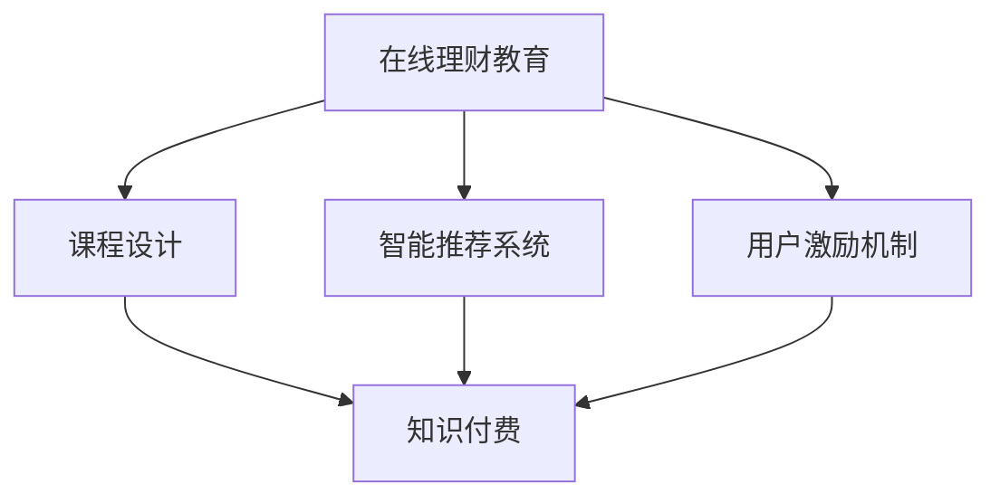

                 

# 如何利用知识付费实现在线理财教育与财商培养？

在线理财教育与财商培养，作为知识付费领域的重要分支，近年来随着互联网的普及和智能设备的普及，已经成为了一种新兴的教育形式。如何在技术层面实现这一目标，成为了值得探讨的话题。本文将从核心概念、核心算法、项目实践、实际应用场景、工具和资源、未来发展趋势与挑战等方面，深入分析如何利用知识付费实现在线理财教育与财商培养。

## 1. 背景介绍

### 1.1 问题由来
随着互联网的发展，传统教育逐渐向在线教育转型，知识付费应运而生。在线理财教育与财商培养，作为知识付费领域的重要分支，近年来迅速崛起。根据《中国网络支付行业2019年度行业报告》，2019年中国在线教育用户规模达到2.7亿，在线支付行业渗透率达到56.4%，为在线理财教育提供了广阔的市场前景。

### 1.2 问题核心关键点
在线理财教育与财商培养的核心目标在于：通过知识付费的形式，向用户传授理财知识和技能，培养其财商水平。这一目标的实现，需要建立在线教育平台，开发理财课程，构建智能推荐系统，并设计用户激励机制。

### 1.3 问题研究意义
在线理财教育与财商培养，对于提升国民金融素养，推动经济社会发展具有重要意义。通过在线学习，用户可以在较短的时间内掌握理财知识，提升财务管理能力，实现财富增值。同时，在线教育可以有效降低传统教育成本，普及理财知识，促进教育公平。

## 2. 核心概念与联系

### 2.1 核心概念概述

为更好地理解在线理财教育与财商培养的实现原理，本节将介绍几个密切相关的核心概念：

- **在线理财教育**：通过在线平台向用户提供理财知识、技能和策略的教育形式，覆盖个人理财、家庭财务规划、投资理财等多个方面。
- **财商培养**：通过理财教育，提升用户的财务管理能力，增强其风险意识和财富管理意识，形成良好的理财习惯。
- **知识付费**：用户为获取知识、技能等价值内容，支付费用的商业模式。在线理财教育即是一种典型的知识付费应用。
- **课程设计**：根据用户需求和学习目标，设计涵盖理财基础知识、投资策略、财务规划等方面的课程内容。
- **智能推荐系统**：利用算法为用户推荐合适的理财课程和学习路径，提升学习效率和体验。
- **用户激励机制**：通过积分、证书、奖励等方式，激励用户持续参与学习，提升学习动力。

这些核心概念之间存在紧密的联系，共同构成了在线理财教育与财商培养的实现框架。

### 2.2 核心概念原理和架构的 Mermaid 流程图



这个流程图展示了在线理财教育与财商培养的关键组成部分及其关系：

1. 在线理财教育通过课程设计，提供优质的理财知识。
2. 智能推荐系统根据用户的学习行为，推荐合适的课程和内容。
3. 用户激励机制通过积分、证书等形式，激励用户持续参与学习。
4. 知识付费作为商业模式，支撑平台运营和教育内容的制作。

## 3. 核心算法原理 & 具体操作步骤

### 3.1 算法原理概述

在线理财教育与财商培养的实现，本质上是一个在线教育的智能推荐过程。其核心思想是：将理财课程视为教育内容，通过智能推荐系统匹配用户的学习需求，提升学习效率和用户体验。

形式化地，假设用户群体为 $U$，课程内容为 $C$，推荐算法为 $A$。则推荐系统的目标是最小化用户不满意度，即找到最优推荐策略：

$$
\min_{A} \sum_{u \in U} \sum_{c \in C} \mathbb{P}(u,c) \times \text{不满意度}
$$

其中，$\mathbb{P}(u,c)$ 表示用户 $u$ 对课程 $c$ 的潜在需求，不满意度为一系列与推荐内容相关的损失函数。

### 3.2 算法步骤详解

在线理财教育与财商培养的算法步骤包括以下几个关键步骤：

**Step 1: 数据收集与预处理**
- 收集用户的理财需求、学习行为和反馈数据。
- 收集课程的特征描述、内容和反馈数据。
- 对数据进行预处理，包括去噪、归一化和特征工程等。

**Step 2: 用户建模**
- 基于用户历史行为数据，构建用户兴趣模型，如用户画像、行为轨迹等。
- 使用协同过滤、深度学习等算法，刻画用户对不同课程的兴趣偏好。

**Step 3: 课程建模**
- 基于课程的特征描述，构建课程推荐模型，如基于内容的推荐、协同过滤推荐等。
- 使用特征工程技术，提取课程的关键特征，如课程难度、投资领域、收益率等。

**Step 4: 推荐策略设计**
- 设计推荐算法，如基于矩阵分解的协同过滤、基于深度学习的用户行为预测等。
- 引入个性化推荐、动态推荐等策略，提升推荐效果。

**Step 5: 评价与优化**
- 使用A/B测试、用户满意度调查等方法，评估推荐系统的效果。
- 根据评估结果，调整推荐策略和参数，不断优化推荐模型。

### 3.3 算法优缺点

在线理财教育与财商培养的推荐算法具有以下优点：

1. 个性化推荐。通过分析用户行为和课程特征，提供个性化的学习建议，提升学习效果。
2. 高效精准。算法能够实时处理和推荐内容，快速响应用户需求，提高学习效率。
3. 数据驱动。通过大数据分析，洞察用户需求和课程特征，实现科学决策。

同时，该算法也存在以下局限性：

1. 数据依赖。推荐系统的性能很大程度上取决于数据的质量和完整性，获取高质量数据成本较高。
2. 冷启动问题。对于新用户和未标记的课程，推荐算法容易陷入冷启动困境。
3. 隐私风险。推荐系统涉及大量用户数据和隐私信息，数据安全和隐私保护问题需要重点关注。
4. 动态变化。用户需求和课程内容不断变化，推荐系统需要持续更新和优化。

尽管存在这些局限性，但就目前而言，基于推荐算法的在线理财教育与财商培养方法仍是大规模应用的主流范式。未来相关研究的重点在于如何进一步降低推荐系统对数据的依赖，提高其应对动态变化的能力，同时兼顾用户隐私和数据安全等因素。

### 3.4 算法应用领域

在线理财教育与财商培养的推荐算法，已经在多个领域得到了广泛应用，例如：

- 投资理财教育：通过推荐系统，向用户推荐股票、基金、债券等投资课程。
- 个人财务管理：推荐系统帮助用户管理个人财务，如预算规划、账单管理等。
- 家庭理财规划：为家庭用户提供理财规划和财富管理建议，如家庭保险规划、教育金规划等。
- 企业培训：为企业管理层和员工提供财务管理课程，提升企业财商水平。
- 财富管理工具：推荐系统集成到财富管理应用中，提升用户使用体验。

除了上述这些经典应用外，推荐算法还被创新性地应用于智能理财顾问、在线财商测评等方面，为理财教育带来新的突破。

## 4. 数学模型和公式 & 详细讲解 & 举例说明

### 4.1 数学模型构建

本节将使用数学语言对在线理财教育与财商培养的推荐系统进行更加严格的刻画。

假设用户群体为 $U=\{u_1,u_2,\cdots,u_N\}$，课程内容为 $C=\{c_1,c_2,\cdots,c_M\}$。定义用户对课程的评分 $r_{ui}$ 为1~5之间的整数，$r_{ui}=0$ 表示用户未评价课程。

推荐系统的目标是最小化用户和课程之间的匹配误差，即：

$$
\min_{A} \sum_{u \in U} \sum_{c \in C} \mathbb{P}(u,c) \times (r_{ui} - \hat{r}_{ui})^2
$$

其中 $\hat{r}_{ui}$ 为推荐模型对用户 $u$ 对课程 $c$ 的评分预测。

### 4.2 公式推导过程

假设用户对课程的评分 $r_{ui}$ 为隐变量，课程特征 $x_{uj}$ 为显变量。则推荐模型可以表示为：

$$
r_{ui} = \sum_{j=1}^D \theta_{ujj} x_{uj}
$$

其中 $x_{uj}$ 为课程的特征向量，$\theta_{uj}$ 为用户的特征向量。定义损失函数为均方误差损失：

$$
\ell(r_{ui}, \hat{r}_{ui}) = \frac{1}{2} (r_{ui} - \hat{r}_{ui})^2
$$

推荐系统的目标是最小化损失函数，即：

$$
\min_{\theta} \sum_{u \in U} \sum_{c \in C} \mathbb{P}(u,c) \times \ell(r_{ui}, \hat{r}_{ui})
$$

假设用户对课程的评分 $r_{ui}$ 满足正态分布：

$$
r_{ui} \sim \mathcal{N}(\sum_{j=1}^D \theta_{ujj} x_{uj}, \sigma^2)
$$

则损失函数可以进一步简化为：

$$
\ell(r_{ui}, \hat{r}_{ui}) = \frac{1}{2} (\sum_{j=1}^D \theta_{ujj} x_{uj} - \hat{r}_{ui})^2
$$

通过优化上述损失函数，即可得到推荐模型的参数 $\theta$。

### 4.3 案例分析与讲解

以一个简单的协同过滤推荐系统为例，其核心思想是根据用户对课程的评分，构建用户-课程评分矩阵，然后使用矩阵分解方法，找出用户和课程之间的隐向量表示，从而实现个性化推荐。

假设用户 $u$ 对课程 $c$ 的评分为 $r_{ui}$，使用矩阵分解方法将评分矩阵 $R$ 分解为两个矩阵的乘积：

$$
R \approx U \times V
$$

其中 $U$ 为 $N \times d$ 的用户矩阵，$V$ 为 $M \times d$ 的课程矩阵，$d$ 为矩阵分解的维度。则用户 $u$ 对课程 $c$ 的推荐分数为：

$$
\hat{r}_{ui} = \sum_{j=1}^d U_{uj} V_{cj}
$$

通过调整用户矩阵和课程矩阵的参数，不断优化推荐模型，直到损失函数最小化。

## 5. 项目实践：代码实例和详细解释说明

### 5.1 开发环境搭建

在进行在线理财教育与财商培养的项目实践前，我们需要准备好开发环境。以下是使用Python进行PyTorch开发的环境配置流程：

1. 安装Anaconda：从官网下载并安装Anaconda，用于创建独立的Python环境。

2. 创建并激活虚拟环境：
```bash
conda create -n finance-env python=3.8 
conda activate finance-env
```

3. 安装PyTorch：根据CUDA版本，从官网获取对应的安装命令。例如：
```bash
conda install pytorch torchvision torchaudio cudatoolkit=11.1 -c pytorch -c conda-forge
```

4. 安装TensorFlow：
```bash
pip install tensorflow
```

5. 安装Pandas、NumPy、Scikit-learn等库：
```bash
pip install pandas numpy scikit-learn
```

完成上述步骤后，即可在`finance-env`环境中开始项目实践。

### 5.2 源代码详细实现

这里我们以基于矩阵分解的协同过滤推荐系统为例，给出使用PyTorch实现推荐系统的代码。

首先，定义数据预处理函数：

```python
import pandas as pd
from sklearn.decomposition import TruncatedSVD
from sklearn.metrics.pairwise import cosine_similarity
from sklearn.feature_extraction.text import TfidfVectorizer

def preprocess_data(data_path):
    # 读取数据集
    df = pd.read_csv(data_path, header=None)

    # 预处理数据
    df = df.dropna()

    # 特征工程
    vectorizer = TfidfVectorizer(stop_words='english')
    X = vectorizer.fit_transform(df[0])

    # 构建评分矩阵
    R = df[1].values.reshape(-1, 1)

    # 矩阵分解
    svd = TruncatedSVD(n_components=5)
    U = svd.fit_transform(X)
    V = svd.components_

    return U, V, R
```

然后，定义推荐函数：

```python
def recommend(user, U, V, R):
    # 用户评分
    user_score = R[user]

    # 预测评分
    predicted_scores = np.dot(U[user], V.T)

    # 计算相似度
    similarity = cosine_similarity(predicted_scores, R[user].reshape(1, -1))

    # 推荐课程
    top_n = np.argsort(similarity)[:-1][::-1]
    return top_n
```

最后，启动推荐系统：

```python
if __name__ == '__main__':
    # 加载数据
    U, V, R = preprocess_data('data.csv')

    # 用户编号
    user = 0

    # 推荐前10门课程
    top_n = recommend(user, U, V, R)
    print(top_n)
```

以上就是使用PyTorch实现基于矩阵分解的协同过滤推荐系统的完整代码实现。可以看到，代码实现了数据预处理、特征提取、评分矩阵分解和推荐函数，功能相对完整。

### 5.3 代码解读与分析

让我们再详细解读一下关键代码的实现细节：

**preprocess_data函数**：
- 读取数据集，并进行预处理，去除缺失值。
- 使用TF-IDF进行特征提取，构建课程特征矩阵。
- 构建评分矩阵，将用户对课程的评分转换为矩阵形式。
- 进行矩阵分解，得到用户矩阵和课程矩阵。

**recommend函数**：
- 获取用户评分。
- 预测用户对课程的评分。
- 计算相似度，找到与用户评分最接近的课程。
- 推荐前n门课程。

**主函数**：
- 加载预处理后的数据。
- 指定用户编号。
- 调用推荐函数，获取推荐结果。

可以看到，PyTorch提供了丰富的科学计算库和高效的模型训练框架，使得在线理财教育与财商培养的推荐系统开发变得简洁高效。开发者可以将更多精力放在数据处理、模型优化等高层逻辑上，而不必过多关注底层的实现细节。

当然，工业级的系统实现还需考虑更多因素，如模型的保存和部署、超参数的自动搜索、更灵活的任务适配层等。但核心的推荐范式基本与此类似。

## 6. 实际应用场景

### 6.1 智能理财顾问

在线理财教育与财商培养的一个典型应用场景是智能理财顾问。智能理财顾问可以通过推荐系统，为个人用户提供个性化的理财建议，如投资组合、消费规划、风险管理等。

具体而言，智能理财顾问可以在用户注册时进行初步评估，收集用户的财务信息、风险偏好和理财目标。根据评估结果，智能理财顾问推荐合适的课程和学习路径，并定期更新理财策略，帮助用户实现财富增值。

### 6.2 家庭理财规划

在线理财教育与财商培养的另一个重要应用场景是家庭理财规划。家庭理财规划可以帮助家庭用户制定科学的财务规划，提升家庭财务健康水平。

智能理财顾问可以为家庭用户提供多层次的理财服务，如家庭预算管理、子女教育金规划、退休规划等。通过推荐系统，智能理财顾问能够根据家庭成员的需求，提供个性化的理财建议，提升家庭财务管理的效率和效果。

### 6.3 企业培训

在线理财教育与财商培养在企业培训中也得到了广泛应用。通过推荐系统，企业可以为员工提供定制化的理财课程，提升其财务管理能力，增强其风险意识。

在线理财教育与财商培养可以为企业管理层和普通员工提供多种培训内容，如财务报表分析、投资策略、税务规划等。通过推荐系统，企业可以针对不同岗位的需求，提供个性化的培训建议，提升员工的工作效率和职业发展潜力。

### 6.4 未来应用展望

随着推荐算法的不断优化，在线理财教育与财商培养将呈现以下几个发展趋势：

1. 多模态数据融合。未来的推荐系统将融合文本、图像、视频等多种模态数据，实现更全面、更精准的理财推荐。
2. 跨平台无缝衔接。未来的推荐系统将实现跨平台无缝衔接，为用户提供统一的理财服务体验。
3. 智能财商测评。未来的推荐系统将引入财商测评功能，评估用户的财务素养和风险偏好，提供个性化的理财建议。
4. 动态个性化推荐。未来的推荐系统将实时跟踪用户行为，动态调整推荐策略，提供更加个性化、及时的理财建议。
5. 隐私保护和合规。未来的推荐系统将加强用户隐私保护和合规性，确保用户数据安全和隐私权益。
6. 多渠道集成。未来的推荐系统将集成到多个渠道，如App、小程序、智能音箱等，提升理财服务的覆盖面。

以上趋势凸显了在线理财教育与财商培养的广阔前景。这些方向的探索发展，必将进一步提升理财服务的智能化水平，为用户带来更好的理财体验。

## 7. 工具和资源推荐

### 7.1 学习资源推荐

为了帮助开发者系统掌握在线理财教育与财商培养的理论基础和实践技巧，这里推荐一些优质的学习资源：

1. 《深度学习实战》系列博文：由深度学习专家撰写，详细介绍了深度学习在推荐系统中的应用，包括协同过滤、深度学习等推荐算法。

2. 《推荐系统实践》课程：由清华大学的徐恩东教授主讲，系统介绍了推荐系统的工作原理和设计方法，涵盖协同过滤、矩阵分解、深度学习等多种推荐算法。

3. 《机器学习实战》书籍：介绍机器学习在推荐系统中的应用，包括协同过滤、矩阵分解、深度学习等算法。

4. PyTorch官方文档：PyTorch的官方文档，提供了丰富的推荐系统样例代码，是学习推荐算法的必备资料。

5. Kaggle推荐系统竞赛：Kaggle组织的多场推荐系统竞赛，可以练习和验证推荐算法的效果，是学习和验证推荐算法的良好平台。

通过对这些资源的学习实践，相信你一定能够快速掌握在线理财教育与财商培养的核心技术，并用于解决实际的理财问题。

### 7.2 开发工具推荐

高效的开发离不开优秀的工具支持。以下是几款用于在线理财教育与财商培养开发的常用工具：

1. PyTorch：基于Python的开源深度学习框架，灵活动态的计算图，适合快速迭代研究。大部分推荐算法都有PyTorch版本的实现。

2. TensorFlow：由Google主导开发的开源深度学习框架，生产部署方便，适合大规模工程应用。同样有丰富的推荐算法资源。

3. Sklearn：基于Python的科学计算库，提供了丰富的数据预处理、特征工程、模型评估等工具，适合推荐算法的开发。

4. Pandas：基于Python的数据分析库，提供了高效的数据处理和数据可视化功能，适合推荐系统数据的处理和分析。

5. Jupyter Notebook：基于Web的交互式开发环境，支持Python、R等多种语言，适合快速开发和测试推荐系统。

合理利用这些工具，可以显著提升在线理财教育与财商培养的开发效率，加快创新迭代的步伐。

### 7.3 相关论文推荐

在线理财教育与财商培养的推荐算法，得益于学界的持续研究。以下是几篇奠基性的相关论文，推荐阅读：

1. Wide & Deep Learning for Recommender Systems：提出Wide & Deep结构，结合浅层机器学习模型和深度神经网络，提升了推荐系统的表现。

2. Neural Collaborative Filtering：提出基于神经网络的协同过滤推荐算法，显著提高了推荐系统的效果。

3. Matrix Factorization Techniques for Recommender Systems：综述了矩阵分解在推荐系统中的应用，提供了多种推荐算法的理论和实现方法。

4. Deep Neural Networks for Recommender Systems：提出基于深度神经网络的推荐算法，实现了更高效、更精准的推荐。

5. Recommender Systems with Deep Users and Items Embeddings：提出基于深度学习的用户和物品嵌入方法，提升了推荐系统的性能。

这些论文代表了大规模推荐系统的发展脉络。通过学习这些前沿成果，可以帮助研究者把握学科前进方向，激发更多的创新灵感。

## 8. 总结：未来发展趋势与挑战

### 8.1 总结

本文对在线理财教育与财商培养的推荐系统进行了全面系统的介绍。首先阐述了在线理财教育与财商培养的背景和核心目标，明确了推荐系统在其中的重要作用。其次，从原理到实践，详细讲解了推荐算法的数学模型和实现流程，给出了推荐系统开发的完整代码实例。同时，本文还广泛探讨了推荐算法在智能理财顾问、家庭理财规划、企业培训等多个行业领域的应用前景，展示了推荐范式的巨大潜力。此外，本文精选了推荐算法的各类学习资源，力求为读者提供全方位的技术指引。

通过本文的系统梳理，可以看到，在线理财教育与财商培养的推荐系统已经在大规模应用中取得了显著成效，为理财教育带来了新的发展方向。未来，伴随推荐算法的不断优化和创新，推荐系统将在更多场景下发挥重要作用，为理财教育带来新的变革。

### 8.2 未来发展趋势

展望未来，在线理财教育与财商培养的推荐系统将呈现以下几个发展趋势：

1. 模型规模不断增大。随着算力成本的下降和数据规模的扩张，推荐系统的模型规模将持续增长，从而提供更全面、更精准的理财建议。
2. 算法多样化。推荐算法将不断丰富，从传统的协同过滤、矩阵分解到深度学习、图神经网络等，推荐系统将实现更多样化的推荐策略。
3. 实时化、个性化。未来的推荐系统将实时跟踪用户行为，动态调整推荐策略，提供更加个性化、及时的理财建议。
4. 多模态融合。未来的推荐系统将融合多种模态数据，实现更全面、更精准的理财推荐。
5. 跨平台无缝衔接。未来的推荐系统将实现跨平台无缝衔接，为用户提供统一的理财服务体验。
6. 智能财商测评。未来的推荐系统将引入财商测评功能，评估用户的财务素养和风险偏好，提供个性化的理财建议。

以上趋势凸显了在线理财教育与财商培养的广阔前景。这些方向的探索发展，必将进一步提升理财服务的智能化水平，为用户带来更好的理财体验。

### 8.3 面临的挑战

尽管在线理财教育与财商培养的推荐系统已经取得了瞩目成就，但在迈向更加智能化、普适化应用的过程中，它仍面临着诸多挑战：

1. 数据依赖。推荐系统的性能很大程度上取决于数据的质量和完整性，获取高质量数据成本较高。如何进一步降低推荐系统对标注数据的依赖，将是一大难题。
2. 模型复杂性。当前推荐系统模型较为复杂，如何简化模型结构，提升推理速度，优化资源占用，将是重要的优化方向。
3. 动态变化。用户需求和市场环境不断变化，推荐系统需要持续更新和优化，以适应新的变化。
4. 隐私保护。推荐系统涉及大量用户数据和隐私信息，数据安全和隐私保护问题需要重点关注。
5. 冷启动问题。对于新用户和未标记的课程，推荐算法容易陷入冷启动困境。如何高效处理冷启动问题，提高推荐效果，也是一大挑战。

尽管存在这些挑战，但随着学界和产业界的共同努力，这些挑战终将一一被克服，在线理财教育与财商培养推荐系统必将在构建人机协同的智能理财时代中扮演越来越重要的角色。

### 8.4 研究展望

面对在线理财教育与财商培养推荐系统面临的挑战，未来的研究需要在以下几个方面寻求新的突破：

1. 探索无监督和半监督推荐方法。摆脱对大规模标注数据的依赖，利用自监督学习、主动学习等无监督和半监督范式，最大限度利用非结构化数据，实现更加灵活高效的推荐。
2. 研究参数高效和计算高效的推荐范式。开发更加参数高效的推荐方法，在固定大部分预训练参数的同时，只更新极少量的任务相关参数。同时优化推荐模型的计算图，减少前向传播和反向传播的资源消耗，实现更加轻量级、实时性的部署。
3. 融合因果和对比学习范式。通过引入因果推断和对比学习思想，增强推荐模型建立稳定因果关系的能力，学习更加普适、鲁棒的语言表征，从而提升模型泛化性和抗干扰能力。
4. 引入更多先验知识。将符号化的先验知识，如知识图谱、逻辑规则等，与神经网络模型进行巧妙融合，引导推荐过程学习更准确、合理的语言模型。同时加强不同模态数据的整合，实现视觉、语音等多模态信息与文本信息的协同建模。
5. 结合因果分析和博弈论工具。将因果分析方法引入推荐模型，识别出推荐模型决策的关键特征，增强输出解释的因果性和逻辑性。借助博弈论工具刻画人机交互过程，主动探索并规避推荐系统的脆弱点，提高系统稳定性。
6. 纳入伦理道德约束。在推荐模型的训练目标中引入伦理导向的评估指标，过滤和惩罚有偏见、有害的输出倾向。同时加强人工干预和审核，建立推荐行为的监管机制，确保输出符合人类价值观和伦理道德。

这些研究方向的探索，必将引领在线理财教育与财商培养推荐技术迈向更高的台阶，为构建安全、可靠、可解释、可控的智能理财系统铺平道路。面向未来，推荐算法还需要与其他人工智能技术进行更深入的融合，如知识表示、因果推理、强化学习等，多路径协同发力，共同推动在线理财教育与财商培养系统的进步。只有勇于创新、敢于突破，才能不断拓展推荐算法的边界，让智能理财服务更好地造福人类社会。

## 9. 附录：常见问题与解答

**Q1：在线理财教育与财商培养的主要挑战是什么？**

A: 在线理财教育与财商培养的主要挑战包括：
1. 数据依赖。推荐系统的性能很大程度上取决于数据的质量和完整性，获取高质量数据成本较高。
2. 模型复杂性。当前推荐系统模型较为复杂，如何简化模型结构，提升推理速度，优化资源占用，是重要的优化方向。
3. 动态变化。用户需求和市场环境不断变化，推荐系统需要持续更新和优化，以适应新的变化。
4. 隐私保护。推荐系统涉及大量用户数据和隐私信息，数据安全和隐私保护问题需要重点关注。
5. 冷启动问题。对于新用户和未标记的课程，推荐算法容易陷入冷启动困境。

**Q2：如何提高在线理财教育与财商培养的推荐系统效果？**

A: 提高在线理财教育与财商培养的推荐系统效果，可以从以下几个方面入手：
1. 数据增强。通过回译、近义替换等方式扩充训练集，提高数据的丰富度。
2. 正则化。使用L2正则、Dropout等正则化技术，防止模型过度拟合。
3. 动态学习。实时跟踪用户行为，动态调整推荐策略，提供更加个性化、及时的理财建议。
4. 多模态融合。融合多种模态数据，实现更全面、更精准的理财推荐。
5. 用户反馈。收集用户反馈，根据用户偏好调整推荐策略，提升用户体验。
6. 冷启动处理。通过行为预测、嵌入式学习等方式，解决冷启动问题，提升推荐效果。

**Q3：如何保证在线理财教育与财商培养的推荐系统安全性？**

A: 保证在线理财教育与财商培养的推荐系统安全性，可以从以下几个方面入手：
1. 数据加密。对用户数据进行加密处理，防止数据泄露。
2. 访问控制。通过访问控制机制，限制敏感数据和操作的权限。
3. 隐私保护。采用匿名化、差分隐私等技术，保护用户隐私。
4. 安全审计。定期进行安全审计，及时发现和修复漏洞。
5. 模型鲁棒性。采用对抗训练等技术，增强推荐模型的鲁棒性，防止模型被攻击。

**Q4：如何优化在线理财教育与财商培养的推荐系统性能？**

A: 优化在线理财教育与财商培养的推荐系统性能，可以从以下几个方面入手：
1. 模型压缩。通过模型压缩技术，减少模型大小，提高推理速度。
2. 混合精度训练。采用混合精度训练，减少计算量，提高训练效率。
3. 模型并行。采用模型并行技术，提高训练和推理效率。
4. 硬件优化。采用GPU/TPU等高性能设备，提高算力。
5. 超参数优化。通过超参数优化，找到最优的模型参数组合。

**Q5：如何提升在线理财教育与财商培养的推荐系统的用户满意度？**

A: 提升在线理财教育与财商培养的推荐系统的用户满意度，可以从以下几个方面入手：
1. 个性化推荐。通过分析用户行为和课程特征，提供个性化的学习建议，提升学习效果。
2. 动态推荐。实时跟踪用户行为，动态调整推荐策略，提供更加个性化、及时的理财建议。
3. 用户反馈。收集用户反馈，根据用户偏好调整推荐策略，提升用户体验。
4. 可视化界面。提供直观的可视化界面，帮助用户理解和应用推荐结果。
5. 用户激励。通过积分、证书、奖励等方式，激励用户持续参与学习，提升学习动力。

**Q6：如何设计在线理财教育与财商培养的推荐系统的业务流程？**

A: 设计在线理财教育与财商培养的推荐系统的业务流程，可以从以下几个方面入手：
1. 用户画像。通过数据分析，构建用户画像，了解用户的基本特征和需求。
2. 课程设计。根据用户需求和学习目标，设计涵盖理财基础知识、投资策略、财务规划等方面的课程内容。
3. 推荐算法。设计推荐算法，如基于矩阵分解的协同过滤、基于深度学习的用户行为预测等。
4. 用户激励。通过积分、证书、奖励等方式，激励用户持续参与学习，提升学习动力。
5. 动态更新。实时跟踪用户行为，动态调整推荐策略，提供更加个性化、及时的理财建议。
6. 用户反馈。收集用户反馈，根据用户偏好调整推荐策略，提升用户体验。

以上是推荐的在线理财教育与财商培养的推荐系统设计流程。通过遵循这些流程，可以设计出高效的推荐系统，提升理财服务的智能化水平，为用户带来更好的理财体验。

---

作者：禅与计算机程序设计艺术 / Zen and the Art of Computer Programming

